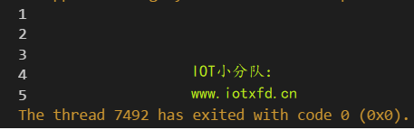
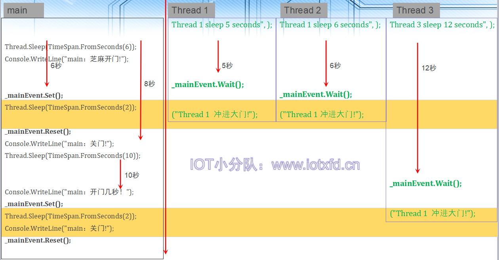
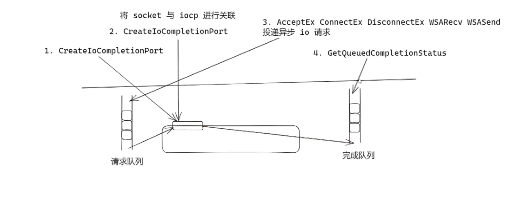
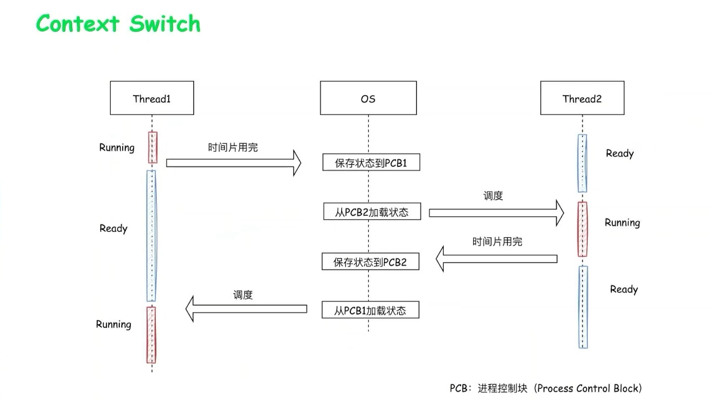

# 在面试中被问到本项目的问题


**1.在游戏服务器中，我们要获取某个角色周围的敌人，除了遍历当前场景的所有角色，我们还有什么好的方法来获取？**

在游戏服务器中，获取某个角色周围的敌人通常涉及到处理网络同步和优化性能的问题。以下是一些常见的方法，特别适用于游戏服务器环境：

1. **区域兴趣（Interest Management）：** 引入区域兴趣系统，该系统在服务器上负责跟踪和维护玩家周围的对象。当玩家移动到新区域时，服务器只需通知客户端或服务器更新该区域的信息，而不需要遍历整个场景。
2. **空间分割和空间索引：** 使用空间分割方法，如八叉树（Octree）或四叉树（Quadtree），将场景划分为空间单元。当需要查找周围的敌人时，只需检查相邻的空间单元，而不是整个场景。这样可以大大提高查找效率。
3. **索引数据结构：** 使用索引数据结构，如哈希表或空间网格，来存储场景中的对象信息。这样可以通过直接查找索引而不是遍历来获取所需的对象。
4. **消息系统：** 使用消息系统，允许对象在特定事件发生时广播消息。当敌人进入或离开某个区域时，它可以向周围的对象发送消息，通知它们进行相应的处理。
5. **服务器端碰撞检测：** 在服务器上执行碰撞检测，以确定角色周围的敌人。这通常涉及使用服务器端物理引擎或其他碰撞检测算法来处理对象之间的碰撞。


**2.你这个项目有使用到多线程吗？**

在我们的项目中很多地方都使用到了c#的ThreadPool，每个CLR都有一个线程池实例。（Common Language Runtime）


main线程,最后阻塞在这里了，因为我们使用了控制台。后面会改写为守护进程

```
        static void Main(string[] args)
        {	
        	....
            Console.ReadKey();//防止进程结束
        }
```


比如说：MessageRouter.Start()

```
        public void Start(int ThreadCount)
        {
            if (running) return;

            running = true;
            this.ThreadCount = Math.Min(Math.Max(1, ThreadCount),10);


            for(int i = 0; i < this.ThreadCount; i++)
            {
                //创建线程
                ThreadPool.QueueUserWorkItem(new WaitCallback(MessageWork));
            }
            //等待一会,让全部线程
            while (WorkerCount < this.ThreadCount)
            {
                Thread.Sleep(100);
            }
        }
```

Scheduler.Start()中Timer的实现也是从ThreadPool中获取线程的

```
        public void Start()
        {
            if (timer != null) return;
            //系统线程池中拿一个来用的
            timer = new Timer(new TimerCallback(Execute), null, 0, 1);//每隔一毫秒触发
        }
```

NetService中的心跳检测的timer

```
public void Start()
{
    //启动网络监听
    tcpServer.Start();

    //启动消息分发器
    MessageRouter.Instance.Start(Config.Server.WorkerCount);

    //订阅心跳事件
    MessageRouter.Instance.Subscribe<HeartBeatRequest>(_HeartBeatRequest);

    //定时检查心跳包的情况
    Timer timer = new Timer(TimerCallback, null, TimeSpan.Zero, TimeSpan.FromSeconds(HEARTBEATQUERYTIME));

}
```

SessionManager中的的session会话超时检测的timer

```
        public SessionManager()
        {
            //创建一个计时器,1秒触发
            var timer = new Timer(1000);
            timer.Elapsed += (sender, e) => CheckSession();
            timer.Start();
        }


```


**3.你的服务器是怎么处理socket请求的，一个socket对应一个线程？**

我使用的是c#给我们提供的**异步io编程模型**iocp   APM  TAP

在异步 I/O 模型中，底层系统会负责管理异步操作的执行，并在操作完成时通知相关的回调函数。这种方式可以有效地利用系统资源，而无需为每个异步操作创建一个新的线程。

比如说：`Socket.BeginAccept` 和 `Socket.EndAccept` 方法是用于异步接受连接请求的一对方法。以下是它们的基本流程：

`BeginAccept` 方法启动异步操作，开始监听传入的连接**请求**。

异步操作在后台进行，而不会阻塞主线程。

当有连接请求到达时，系统会调用你提供的回调函数。

在回调函数内，你调用 `Socket.EndAccept` 方法来完成异步操作，并获取新建立的连接的 `Socket` 对象。

对于`Socket.BeginAccept`和`Socket.EndAccept`，异步操作的实现通常基于I/O完成端口（I/O Completion Port）等底层机制，而不是简单地创建一个新线程来处理。这允许系统在没有创建新线程的情况下，有效地处理多个异步操作。（内核线程池）

在Windows操作系统上，I/O完成端口（IOCP）是一种高效的异步I/O机制，它使用线程池来管理异步操作的执行。但重要的是要理解，线程池并不是为每个异步操作都创建一个新线程，而是通过重用池中的现有线程来提高效率。


`Socket.AcceptAsync` 方法是.NET Framework中引入的更现代的异步模型的一部分，它属于TAP（Task-based Asynchronous Pattern）模式。与传统的`Socket.BeginAccept`和`Socket.EndAccept` APM 模式不同，`Socket.AcceptAsync` 返回一个 `Task<Socket>`，使得异步代码更加清晰和易于管理。

`Socket.AcceptAsync` 不会创建新线程来处理异步操作，而是通过底层的异步I/O机制（例如，I/O完成端口）来实现异步操作。这样可以更高效地利用系统资源，而不必为每个异步操作都分配一个新的线程。


**4.既然你的messageRouter使用了多线程，那么你的character中的信息存在线程并发问题吗？**

在这些个战斗场景中产生的数据，在处理的时候我们都会使用队列来缓存某个时间段收集到的数据包，然后在一起处理这些数据包。

也就是说，处理这些例如：character属性变更  我们是使用单个线程来处理的，所以是不存在一个并发的问题。

```
    public class FightManager
    {
        private Space space;

        //等待处理的技能施法队列：收集来自各个客户端的施法请求
        //这个队列维持了actor属性的同步，比如说hp的计算是单线程的。
        public ConcurrentQueue<CastInfo> castInfoQueue = new ConcurrentQueue<CastInfo>();


        public void OnUpdate(float deltaTime)
        {
            //处理施法请求
            while(castInfoQueue.TryDequeue(out var cast))
            {
                RunCast(cast);
            }
```


**5.既然你的服务器通过一个timer每隔n秒进行对character的一些属性进行保存的话，那么它和messageRouter会有并发问题吗？**

```
        private void SaveCharacterInfo()
        {
            foreach (var chr in characterDict.Values)
            {
                //更新位置
                chr.Data.X = chr.Position.x;
                chr.Data.Y = chr.Position.y;
                chr.Data.Z = chr.Position.z;
                chr.Data.Hp = (int)chr.Hp;
                chr.Data.Mp = (int)chr.Mp;
                chr.Data.SpaceId = chr.SpaceId;
                chr.Data.Knapsack = chr.knapsack.InventoryInfo.ToByteArray();
                chr.Data.Level = chr.Level;
                chr.Data.Exp = chr.Exp;
                //保存进入数据库
                repo.UpdateAsync(chr.Data);//异步更新
            }
        }
```

其实并不会有问题，因为我们保存到数据库其实是读取操作，并发问题是指多个线程修改同一个数据造成的脏读、幻读、不可重复读


# 在linux环境下部署环境


## 1.ubuntu下安装mysql服务


### **1.1安装 MySQL-Server**

通过 apt 包管理器安装 MySQL

```
sudo apt update
sudo apt install mysql-server
```


### **1.2启动mysql服务,并确定active**

```
systemctl start mysql
```


### **1.3验证 MySQL-Server**

你可以通过运行以下命令来验证安装结果，该命令将输出系统中所安装的 MySQL 版本和发行版。

```
mysql --version
```

 


### **1.4保护加固 MySQL**

MySQL 安装文件附带了一个名为`mysql_secure_installation`的脚本，它允许你很容易地提高[数据库服务](https://cloud.tencent.com/product/dbexpert?from_column=20065&from=20065)器的安全性。

不带参数运行这个脚本：

```
sudo mysql_secure_installation
```

你将会被要求配置`VALIDATE PASSWORD PLUGIN`，它被用来测试 MySQL 用户密码的强度，并且提高安全性：

 

看着按吧。


### **1.5以root身份登录并调整用户身份验证**

MySQL Server 带有一个客户端实用程序，可以从 Linux 终端访问数据库并与之交互。

通常，未做任何配置时，在 Ubuntu 上全新安装 MySQL 后，访问服务器的用户将使用 auth_socket 插件进行身份验证。

auth_socket 的使用会阻止服务器使用密码对用户进行身份验证。它不仅会引发安全问题，而且还会使用户无法借助外部程序（如 phpMyAdmin）访问数据库。因此我们需要将身份验证方法从 auth_socket 更改为使用 mysql_native_password。

为此需要打开 MySQL 控制台，并在 Linux 终端上运行以下命令。

```
mysql
```

现在，我们需要检查数据库对不同用户使用的身份验证方法。你可以通过运行以下命令来执行此操作。

```
SELECT user,authentication_string,plugin,host FROM mysql.user;
```

 

从上图中，我们可以确认 root 用户确实使用 auth_socket 进行了身份验证。我们需要使用下面的“ALTER USER”命令切换到密码验证的使用。另外需要注意的是，确保使用较强的安全密码（应超过 8 个字符，结合数字、字符串和特殊符号等），因为它将替换你在执行上述命令“sudo mysql_secure_installation” 时设置的密码。运行以下命令。

```
ALTER USER 'root'@'localhost' IDENTIFIED WITH mysql_native_password BY 'your_password';
```

现在，我们需要重新加载授权表并将更改更新到 MySQL 数据库。通过执行以下命令来执行此操作。

```
FLUSH PRIVILEGES;
```

完成后，我们需要确认 root 用户不再使用 auth_socket 进行身份验证。通过再次运行以下命令来执行此操作。

```
SELECT user,authentication_string,plugin,host FROM mysql.user;
```


从上图中，我们看到 root 身份验证方法已从“auth_socket”更改为“mysql_native_password”。

由于我们更改了 root 的身份验证方法，因此我们无法使用之前使用的相同命令打开 MySQL 控制台。即“sudo mysql”。我们需要包括用户名和密码参数，如下所示。

```
mysql -u root -p
```

“-u”表示用户，这里是“root”，“-p”代表“password”，一旦你按下 Enter 键，服务器就会提示你输入密码。


### **1.6创建新用户**

一切都设置好后，你可以创建一个新用户，并授予该用户适当的权限。我们将创建一个用户 'PyDataStudio' 并分配对所有数据库表的权限以及更改、删除和添加用户权限的权限。逐行执行下面的命令。

```
CREATE USER 'PyDataStudio'@'localhost' IDENTIFIED BY 'strong_password';

GRANT ALL PRIVILEGES ON *.* TO 'PyDataStudio'@'localhost' WITH GRANT OPTION;
```

第一个命令将创建新用户，第二个命令分配所需的权限。

我们现在可以通过运行以下命令来测试我们的新用户。

```
mysql -u PyDataStudio -p
```

 


### **1.7服务器上的配置**

在 Ubuntu 服务器上安装 MySQL-server 与上述步骤没有太大区别。但是，由于服务器是远程访问的，我们还需要为服务器启用远程访问。

安装成功后，需要启用远程访问。从逻辑上讲，我们需要在 Ubuntu 服务器防火墙上打开一个端口，以便 MySQL 数据库进行通信。默认情况下，MySQL 服务在 3306 端口上运行。执行以下命令。

```
sudo ufw enable
sudo ufw allow mysql
```

为了增强 MySQL 数据库的可靠性和可访问性，可以将 MySQL-server 服务配置为在启动时开始运行。执行以下命令。

```
sudo systemctl enable mysql
```

现在需要配置服务器的接口，从而服务器能够侦听远程可访问的接口。我们需要编辑“mysqld.cnf”文件。运行以下命令。

```
sudo nano /etc/mysql/mysql.conf.d/mysqld.cnf
```


默认情况下，绑定地址为“127.0.0.1”。为公网接口添加绑定地址，为服务网络接口添加另一个绑定地址。你可以将所有 IP 地址的绑定地址配置为“0.0.0.0”。


### **bug**

如果你在选择密码规则的时候不小心选择了2，也就是数字、大小写字母、特殊符号和字典文件的组合。这时候设置密码会出现如下提示：

```
Your password does not satisfy the current policy requirements.
```

这时候重新运行`mysql_secure_installation`也不会再给你机会重新设置了。手动微笑，mmp。

**解决方案如下：**

使用命令`mysql -uroot`登陆，执行：

```
set global validate_password.policy = 0;
#将密码规则设置为LOW，就可以使用纯数字纯字母密码
```

```
set global validate_password_length=4;  
#最低位数为4位
```

这个时候重新运行`mysql_secure_installation`就可以安心设置了。

**相关参数**

```
validate_password_dictionary_file：插件用于验证密码强度的字典文件路径。

validate_password_length：密码最小长度。

validate_password_mixed_case_count：密码至少要包含的小写字母个数和大写字母个数。

validate_password_number_count：密码至少要包含的数字个数。

validate_password_policy：密码强度检查等级，0/LOW、1/MEDIUM、2/STRONG。

validate_password_special_char_count：密码至少要包含的特殊字符数。
```


## 2.部署c#运行环境


## 3.启动服务器程序


# 网络游戏服务器技术栈


## 状态同步和帧同步


**状态同步：**

比如说你现在要向一个npc购买商品，此时客户端就会向服务端发送这个购买商品的操作（携带playerId，NpcId,ItemId）,然后服务器经过系列的逻辑操作，来给你返回状态数据（比如说你背包里面多了什么少了什么）。

优点：安全性比较好，因为逻辑操作都是在服务端上完成的，客户端没法作弊。

缺点：因为服务端返回的状态的数据可能会很大（同步的数据量比较大）


**帧同步：**

比如说：你在游戏中按下了'WASD'键位来控制角色的方向，我们客户端给服务端发送的就是这些操作指令‘wasd’，服务端不会对这些操作做任何的运算，他就把这些操作之间发给其他玩家了（以这种广播的形式）。

我们把这个网络数据收下来，然后我们要按照一定的频率去模拟收到的数据产生的操作。也就是说如果是一个前进，客户端它每一帧应该前进几个单位，前进到什么位置去。

优点：运算十分简洁，就好像做一个客户端工作一样，服务器并没有做很多其他的操作。


## 思考：如何控制100个游戏单位移动？


1.状态同步和帧同步分布要发送什么数据到服务器？

2.服务器要做什么运算？

3.服务器会给客户端发送什么数据包，该数据包多大？


## 状态同步vs帧同步


字典是无序的列表，所以不能用

 数学和物理都会涉及到一些浮点数，浮点数具有不稳定性和不精确性。所以我们不能使用传统uinity中实现的数学库，要自己去实现。  


**追帧：**需要在游戏开始的状态一直去做运算，算到游戏当前是什么状态。 

就比如说一个不能拉动进度条的视频，假如你看到30分钟的时候你中途退出了，再次进入你需要重新从第0秒开始看到30分钟才能恢复这个中途退出的状态。


## 采用不同同步方案的商业游戏


## 什么游戏使用帧同步？


## 帧同步的原理和实现


## 一套完整的帧同步游戏框架要实现什么？


### 1.可靠UDP


### 2.确定性的数学和物理运算库


解决方法


### 3.断线重连


### 4.比赛回放  

服务器记录关键帧

下放客户端进行回放


### 5.反作弊

重演

仲裁


### 6.避免等待


## 王室战争中的帧同步


# Sokcet


## Socket.Shutdown()

`Socket.Shutdown()` 方法是用于关闭 `Socket` 的一部分功能，而不是关闭整个 `Socket` 连接。

在网络编程中，`Socket` 类通常用于在计算机之间进行通信，而 `Shutdown` 方法可以用于关闭连接的一端的发送或接收功能，或者同时关闭两者。

### 1)关闭发送功能：

 通过调用 `Shutdown(SocketShutdown.Send)`，可以关闭 `Socket` 的发送功能。这意味着在调用这个方法后，不能再使用 `Socket` 发送数据，但仍然可以接收数据。这对于表示不再发送数据的情况很有用，但仍然需要接收对方发送的数据。

```
// 关闭发送功能
socket.Shutdown(SocketShutdown.Send);
```

### **2)关闭接收功能：**

 通过调用 `Shutdown(SocketShutdown.Receive)`，可以关闭 `Socket` 的接收功能。这意味着在调用这个方法后，不能再使用 `Socket` 接收数据，但仍然可以发送数据。

```
// 关闭接收功能
socket.Shutdown(SocketShutdown.Receive);
```

### **3)关闭发送和接收功能：** 

通过调用 `Shutdown(SocketShutdown.Both)`，可以关闭 `Socket` 的发送和接收功能，等效于关闭整个 `Socket` 连接。在调用这个方法后，不能再使用 `Socket` 发送或接收数据。

```
// 关闭发送和接收功能，等效于关闭整个 Socket 连接
socket.Shutdown(SocketShutdown.Both);
```

需要注意的是，一旦调用了 `Shutdown` 方法，就不能再使用 `Socket` 进行相应功能的操作。如果需要关闭整个 `Socket` 连接，通常建议在调用 `Shutdown` 后紧接着调用 `Close` 方法来释放相关资源。

```
// 关闭发送和接收功能，并关闭整个 Socket 连接
socket.Shutdown(SocketShutdown.Both);
socket.Close();
```

### 4)注意

你可以直接调用 `Close` 方法来关闭 `Socket` 连接，而不调用 `Shutdown` 方法。在许多情况下，直接调用 `Close` 方法就足够了，因为 `Close` 方法会自动关闭连接的发送和接收功能，并释放相关的资源。

```
// 直接关闭 Socket 连接
socket.Close();
```

这行代码将关闭 `Socket` 连接并释放相关资源。在这种情况下，系统会默认关闭发送和接收功能，因此你不必显式调用 `Shutdown` 方法。

然而，如果你有特殊需求，例如想在关闭连接之前显式地关闭发送或接收功能，你可以使用 `Shutdown` 方法来实现更精确的控制。通常情况下，对于简单的用例，直接调用 `Close` 就足够了。


## Sokcet.Close()

`socket.Close()` 是用于关闭 `Socket` 连接的方法。当调用这个方法时，它会执行以下操作：

1. **关闭连接：** 关闭 `Socket` 连接，使其不能再进行数据的发送和接收。
2. **释放资源：** 释放与 `Socket` 相关的资源，包括操作系统资源。这包括套接字使用的文件描述符或句柄等资源。

在网络编程中，调用 `Close` 方法通常是在你确定不再需要该 `Socket` 连接时进行的。这可能是因为通信已经完成，或者发生了错误，需要关闭连接等情况。

示例代码如下：

```
// 关闭 Socket 连接并释放资源
socket.Close();
```

在调用 `Close` 方法之后，应该避免再次使用该 `Socket` 对象，因为它已经被关闭。如果需要重新建立连接，你可能需要创建一个新的 `Socket` 实例。

需要注意的是，`Close` 方法可能会抛出异常，例如在关闭时发生错误。因此，通常建议使用 `try...catch` 块来处理可能的异常。

```
try
{
    // 关闭 Socket 连接并释放资源
    socket.Close();
}
catch (Exception ex)
{
    // 处理异常
    Console.WriteLine($"Error closing socket: {ex.Message}");
}

```


### 关闭时发生错误

在调用 `socket.Close()` 方法时，可能会发生各种错误，这些错误通常是由于底层操作系统或网络库的特定情况引起的。一些可能的错误包括：

1. **Socket 已关闭：** 如果你尝试关闭一个已经关闭的 `Socket`，可能会抛出 `ObjectDisposedException`。这表示你试图对已经被释放的资源执行操作。
2. **Socket 正在使用中：** 如果在关闭之前仍在进行读取或写入操作，可能会导致 `SocketException`。在关闭之前确保所有的读写操作都已完成是一个好的实践。
3. **底层操作系统错误：** 由于网络编程涉及底层的操作系统调用，因此在关闭连接时可能会发生与网络或操作系统相关的错误，这可能导致 `SocketException` 的抛出。

为了更好地处理可能的异常，可以使用 `try...catch` 块来捕获并处理异常。例如：

```
try
{
    // 关闭 Socket 连接并释放资源
    socket.Close();
}
catch (SocketException ex)
{
    Console.WriteLine($"SocketException: {ex.ErrorCode}, {ex.Message}");
}
catch (ObjectDisposedException ex)
{
    Console.WriteLine($"ObjectDisposedException: {ex.Message}");
}
catch (Exception ex)
{
    Console.WriteLine($"An unexpected error occurred: {ex.Message}");
}
```

在捕获异常时，你可以根据异常的类型和属性进行适当的处理，以便记录错误信息、进行调试或采取其他必要的措施


# c#多线程编程

## Lambda表达式 - 委托进化史

### 委托

早在C# 1.0时代，就引入了委托（delegate）类型的概念，学过C语言，拿C语言弄过高级一点东西的同学都会发现，C语言里函数指针无处不在，C语言也想面向对象，也会尝试面向对象，这些功能很多时候都是用回调函数实现的，回调函数就得用到函数指针。高级语言的出现就是为了解决C语言面向对象不是那么方便、直观的问题。C语言有，C#自然就得有，**委托就相当于C语言的函数指针，委托的意义在于可以将函数作为参数进行传递。某种意义上，委托可理解为一种托管的强类型函数指针。**

通常情况下，使用委托需要三步走：

1. 定义一个委托，包含指定的参数类型和返回值类型。
2. 创建一个与上述委托*参数类型*和*返回值*相符的方法。
3. 创建一个委托实例。

先来个最简单的例子演示C# 1.0中的委托，先创建一个控制台项目。

```
using System;

namespace lambda
{
    class Program
    {
        //创建一个委托，返回值为空，参数个数1个，类型为字符串
        delegate void TestDelegate(string s);
        //参考委托创建一个方法，返回值为空，参数个数1个，类型为字符串
        static void PrintString(string s)
        {
            Console.WriteLine(s);
        }
        static void Main(string[] args)
        {
            //创建委托实例，注意：参数“PrintString”必须和上面的方法签名相同
            TestDelegate testDel = new TestDelegate(PrintString);
            //调用委托
            testDel("Hello Lambda!");
        }
    }
}
```

注意，这里只是演示委托的使用，尽可能简单。实际应用中如果仅打印一个字符串，用方法就可以了，没必要绕个圈使用委托。


### 匿名函数

通过上例，大家可能会觉得委托用起来实在太麻烦，声明一堆东西才能使用。微软当然也意识到了这个问题，所以接下来的C# 2.0推出了匿名函数。下面我们用匿名函数修改上例：

```c
using System;

namespace lambda
{
    class Program
    {
        //创建一个委托，返回值为空，参数个数1个，类型为字符串
        delegate void TestDelegate(string s);
        static void Main(string[] args)
        {
            //创建委托实例，注意delegate里面参数类型和个数必须符合上面委托的声明
            TestDelegate testDel = delegate(string s)
            {   //第2步需要创建的方法现在跑这里了
                Console.WriteLine(s);
            }; //注意这里要加分号
            //调用委托
            testDel("Hello Lambda!");
        }
    }
}
```

现在我们发现委托的编写简单一些了，不再需要单独声明方法，创建委托实例的时候直接把方法主体写在下面就OK了。注意，如果方法体很长，或需要多处创建实例，那还是需要使用老办法。匿名函数只是使单次创建实例更为方便。

看到这里大家可能要问了，如果方法需要返回值怎么办？继续改代码：

```c
using System;

namespace lambda
{
    class Program
    {
        //创建一个委托，返回值为整数，参数个数1个，类型为字符串
        delegate int TestDelegate(string s);
        static void Main(string[] args)
        {
            //创建委托实例，注意delegate里面参数类型和个数必须符合上面委托的声明
            TestDelegate testDel = delegate(string s)
            {
                return s.Length;
            }; //注意这里要加分号
            //调用委托
            Console.WriteLine(testDel("Hello Lambda!"));
        }
    }
}
```

运行结果：13
这次委托带一个整数返回值，而在创建委托实例时，我们根本不需要显式地写返回值，只需要在方法体内返回相应类型值即可。


### lambda表达式

使用了匿名函数的委托变得清爽了些，但微软觉得还有改进余地，没有最好，只有更好，所以C# 3.0推出的lambda表达式进一步简化了委托的使用。微软意识到，delegate关键字也是可以省略的。继续修改例子，不带参数版：

```c
using System;

namespace lambda
{
    class Program
    {
        delegate void TestDelegate(string s);
        static void Main(string[] args)
        {
            //创建委托实例，注意括号里面参数类型和个数必须符合上面委托的声明
            TestDelegate testDel = () => Console.WriteLine("hello world");
            testDel();
        }
    }
}
```

这次改进，把`delegate`关键字换成了`=>`。并且，由于方法体只有一句代码，直接写在箭头后面完事，现在看清爽了很多啊！当然如果有多条语句，还是要写大括号的。

```
using System;

namespace lambda
{
    class Program
    {
        delegate void TestDelegate(string s);
        static void Main(string[] args)
        {
            TestDelegate testDel = (string s) => 
            {
                Console.WriteLine(s);
                Console.WriteLine("I am coming to you");
            };
            testDel("Hello Lambda!");
        }
    }
}
```

别急！C# 3.0可不仅仅是这些改动。现在看微软代码，根本看不到`delegate`关键字，跑哪去了？由于早在C# 2.0就有了泛型，到了3.0微软才意识到实际上仅通过两种泛型委托就可以满足 99% 的需求：

- `Action` ：无输入参数，无返回值
- `Action<T1, ..., T16>` ：支持1-16个输入参数，无返回值
- `Func<T1, ..., T16, Tout>` ：支持1-16个输入参数，有返回值

也就是说，微软已经内置了委托声明`Action`和`Func`，满足了99%的情况，你不需要再自己声明委托了。

下面我们为每项写一个程序。
无参无返回值版：

```
using System;
namespace lambda
{
    class Program
    {
        static void Main(string[] args)
        {
            Action testDel = () => Console.WriteLine("Hello Lambda");
            testDel();
        }
    }
}
```

有参无返回值版，对应之前的例子：

```c
using System;
namespace lambda
{
    class Program
    {
        static void Main(string[] args)
        {
            Action<string> testDel = (s) => Console.WriteLine(s);
            testDel("Hello Lambda!");
        }
    }
}
```

泛型在我之前制作的视频里好象只讲了一集，不理解先把泛型学通了再来学lambda吧。`Action<string>` 把委托参数限制为只有一个参数，且必须为字符串。

有参有返回值版，对应之前的例子：

```c
using System;
namespace lambda
{
    class Program
    {
        static void Main(string[] args)
        {
            Func<string, int> testDel = (s) =>
            {
                return s.Length;
            };
            Console.WriteLine(testDel("Hello Lambda!"));
        }
    }
}
```

这里需要注意：`Func<>` 中的最后一个参数为返回值类型，所以`Func<string, int>` 为带一个`string`类型参数，返回值为`int` 的委托。


别急，还没完，微软还是没有满足，还能更简化。把上有参无返回值版中的`(s)`改成`s`看看：

```c
Action<string> testDel = s => Console.WriteLine(s);
```

再把有参有返回值版的`return`关键字去掉：

```c
Func<string, int> testDel = s => s.Length;
```

改完看看能不能运行，有没有很惊喜的感觉？

现在总结一下：

- 如果仅有一个输入参，则可省略圆括号。
- 如果仅有一行语句，并且在该语句中返回，则可省略大括号，并且也可以省略 `return` 关键字。

现在我们再看委托，是不是感觉很爽！的确很爽，但是，方法看着再也不像方法了，而是Main()里的几条语句，这种情况有时很容易把我们的脑子搞混。


## 1.线程基础

本章讲解使用最原始的方法创建和使用线程（Thread），本章所涉及的内容已经过时或淘汰。我还是坚持把它写出来是因为这是最好的理解线程的方式，也是理解后面内容的一个基础，另外线程池也要求多线程继续存在。当然Thread我只讲我认为有必要了解的一部分，而不会所有内容都讲完。

### 简介

早先，计算机一般只有一个核心，而不是现在的多个核心。但是早期的计算机是可以同时运行多个应用程序的，即实现了多任务的概念。我们生活中无处不在的单片机虽然相对CPU没有那么复杂、高速，但也可以同时执行多个任务，简单的多任务可以通过中断来完成，但如果任务复杂到一定程度，并且同时执行的任务数量多时，就需要使用到操作系统了。操作系统的最主要任务，其实就是协调多个任务或程序的同时运行。

不同的操作系统同时执行多个任务的方式也各不相同，如实时操作系统，主要通过优先级来协调程序的运行，高优先级任务会中断低优先级任务，从而保证高优先级任务会得到即时响应。我们个电脑所使用的操作系统则是非实时操作系统，他把CPU时间划分为一个个片段，每个程序执行一个片段，然后轮到下一个程序执行，虽然也有优先级，但优先级的高低只是影响能分配到的时间的长短。

个人电脑操作系统中有进程和线程的概念，这点需要弄清楚。可以这样理解，一个程序表示一个进程，而一个进程里面还可以包含多个线程。也就是一个操作系统可以同时执行多个程序（进程），而一个程序（进程）里还可以同时执行多个线程。

本章中的内容将关注于使用C#语言执行一些非常基本的线程操作。我们将介绍线程的生命周期，其包括创建线程、挂起线程、线程等等以及中止线程。


### 使用C#创建线程

新建一个**ThreadBasic**文件夹，在此文件夹上点鼠标右键，选择**Open with Code**，从而打开Visual Studio Code，并定位到此文件夹。使用`dotnet new console`创建一个新的控制台应用程序，输入如下代码：

```c
using System;
using System.Threading;

namespace ThreadBasic
{
    class Program
    {
        static void PrintNumbers()
        {
            Console.WriteLine("开始......");
            for(int i=1;i<10;i++)
            {
                Console.WriteLine(i);
            }
        }
        static void Main(string[] args)
        {
            Thread t=new Thread(PrintNumbers);
            t.Start();
            PrintNumbers();  
        }
    }
}
```

运行结果：

 

在这个程序中，我们写了一个`PrintNumbers()`方法，此方法用循环打印数字1~10。然后在`Main()`函数中创建了这个方法所对应的线程并启动。最后在主线程中再次调用`PrintNumbers()`。

**提示：**
正在执行中的程序实例可被称为一个进程。进程由一个或多个线程组成。这意味着当运行程序时，始终有一个执行程序代码的主线程。可以这么理解，主线程从`main()`函数开始执行，除非你在代码中创建了其他线程，要不所有代码都在主线程中执行。

上例中，我们就创建了一个线程，先记下创建线程三步曲：

1. 编写一个方法，把线程所要执行的代码放在里面。
2. 调用`new Thread()`来创建一个线程，并将方法名称当作参数传递进行。
3. 调用方法实例的`Start()`方法来启动线程。

来分析一下结果，第一个开始是主线程中的`PrintNumbers()`所打印出来的，第二个开始是线程`t`打印出来的。按道理来说，两者应该同时执行、交替打印，但由于现在的电脑速度太快，线程`t`还未创建完毕，主线程中的`PrintNumbers()`已经执行完了。要想看到它们同时执行，只需每打印一个数字后延时一小段时间即可。更改代码如下：

```c
static void PrintNumbers()
{
    Console.WriteLine("开始......");
    for(int i=1;i<10;i++)
    {
        Console.WriteLine(i);
        Thread.Sleep(200); //加上这一句
    }
}
static void Main(string[] args)
{
    Thread t=new Thread(PrintNumbers);
    t.Start();
    PrintNumbers();  
}
```

运行结果：

 

`Thread.Sleep()`方法让当前所处线程暂停一定时间，也可以说是让线程休眠，它会占用尽可能少的CPU时间。当一个线程暂停，出让了控制权，自然而然，另一个线程就会接手控制权。所以我们会看到上述结果中，两个线程交替打印数字，因为它们每打印一个数字就会休息一会。

### 线程等待

有时，我们需要等待一个线程结束后才能做一些特定事情。将上例稍作更改：

```c
static void PrintNumbers()
{
    Console.WriteLine("开始......");
    for (int i = 1; i <= 5; i++)
    {
        Console.WriteLine(i);
        Thread.Sleep(200);
    }
}
static void Main(string[] args)
{
    Thread t = new Thread(PrintNumbers);
    t.Start();
    Console.WriteLine("线程结束！");
}
```

运行结果：

 

可以看到，线程才刚开始没多久，就已经打印线程结束了。我们希望在线程结束运行之后再打印线程结束，更改`Main()`函数代码如下：

```c
static void Main(string[] args)
{
    Thread t = new Thread(PrintNumbers);
    t.Start();
    t.Join(); //加上这一句
    Console.WriteLine("线程结束！");
}
```

运行结果：

 

现在再来看，直到线程运行结束，才打印线程结束。

我们在主程序中调用了`t.Join()`方法，该方法允许我们等待直到线程t完成。当线程t完成后，主程序才会继续运行。借助该技术可以实现在两个线程间同步执行步骤。第一个线程会等待另一个线程完成后再继续执行。第一个线程等待时处于阻塞状态。

### 终止线程

有一个`Thread.Abort`方法可用于关闭线程，但使用这种方法非常危险，且不一定能终止线程，因此不推荐使用这个方法。.NET Framework最新版本为了兼容旧程序虽然还支持这个方法，但机制已变。而.NET Core则已经完全不支持使用这个方法来终止线程了。正确终止线程的方法我们后面再讨论。

\##前台线程和后台线程
更改代码如下：

```
static void PrintNumbers()
{
    Console.WriteLine("开始......");
    for (int i = 1; i <= 10; i++)
    {
        Console.WriteLine(i);
        Thread.Sleep(1000);
    }
}
static void Main(string[] args)
{
    Thread t = new Thread(PrintNumbers);
    t.Start();
    Thread.Sleep(5000);
}
```

 

结果和之前所有程序一样，直到`t`线程结束，程序才结束运行，这里主线程睡眠5秒不会对程序产生任何影响。默认情况下一个线程是前台线程，这意味着程序会等待所有前台线程结束运行后才会关闭。如果是后台线程会是个什么情况呢？

更改`Main()`函数如下：

```c
static void Main(string[] args)
{
    Thread t = new Thread(PrintNumbers);
    t.IsBackground = true; //新添加语句
    t.Start();
    Thread.Sleep(5000);
}
```

 

我们把线程的`IsBackground`属性设置为`true`，使得线程`t`变为后台线程。从运行结果可知，主线程睡眠5秒后程序运行结束，线程`t`也随之被关闭。

总结一下就是：进程会等待所有的前台线程完成后再结束工作，但是如果只剩下后台线程，则会直接结束工作。一个重要注意事项是如果程序定义了一个不会完成的前台线程，主程序并不会正常结束。


### 向线程传递参数

向Thread传递参数有几种方法，下面一一介绍。

#### 通过对象构造函数传递参数

```c
namespace ThreadBasic
{
    class ThreadSample
    {
        private readonly int _iterations;
        public ThreadSample(int iterations)
        {
            _iterations = iterations;
        }
        public void CountNumbers()
        {
            for (int i = 1; i <= _iterations; i++)
            {
                Thread.Sleep(500);
                Console.WriteLine(i);
            }
        }
    }
    class Program
    {
        static void Main(string[] args)
        {   //创建线程所在类实例，并传递数字5
            var sample = new ThreadSample(5);
            //创建线程
            var threadOne = new Thread(sample.CountNumbers);
            threadOne.Start();
        }
    }
}
```

运行结果：

 

这一次，我们将线程方法包装在了一个类里面，并通过类的构造函数传递一个参数，以决定线程内部的循环次数。传递数字5，最终线程打印了1~5。这种传递参数的方法比较麻烦，还要为线程专门构建一个类。


#### 通过Thread.Start()方法传递参数

```
static void Main(string[] args)
{
    var t = new Thread(CountNumbers);
    t.Start(5); //参数在此传递
}
static void CountNumbers(object iterations)
{   //将参数强制转换为int
    int iter = (int)iterations;
    for (int i = 1; i <= iter; i++)
    {
        Thread.Sleep(500);
        Console.WriteLine(i);
    }
}
```

运行结果同上。

这次使用`Thread.Start`方法来传递参数。这种方法看似简便，但也相当麻烦。`Start()`方法只接收`object`类型参数，并且只接收一个。为了适应它，线程方法的参数也必须声明为`object`类型。在处理参数之前，必须先进行强制类型转换。


#### 通过lambda表达式传递参数

```
static void Main(string[] args)
{
    var t = new Thread(() => CountNumbers(5));
    t.Start();
}
static void CountNumbers(int iterations)
{
    for (int i = 1; i <= iterations; i++)
    {
        Thread.Sleep(500);
        Console.WriteLine(i);
    }
}
```

运行结果同上。

这次就很完美了，线程方法和平常一样声明，只需要创建线程时使用lambda表达式即可，优美，简单！我们来试试是否可以传递多个参数。

更改代码如下：

```
static void Main(string[] args)
{
    var t = new Thread(() => CountNumbers("Superman", 5));
    t.Start();
}
static void CountNumbers(string name, int iterations)
{
    for (int i = 1; i <= iterations; i++)
    {
        Thread.Sleep(500);
        Console.WriteLine(name + ":" + i);
    }
}
```

运行结果：

 

传递多个参数没有任何问题。


#### 通过lambda表达式的闭包方式传递参数

上例`() => CountNumbers(5)`中，我们直接传递整形常量`5`，那么是不是可以把常量改为局部变量呢？

```
static void Main(string[] args)
{
    int i = 5;
    var t = new Thread(() => CountNumbers(i));
    t.Start();
}
static void CountNumbers(int iterations)
{
    for (int i = 1; i <= iterations; i++)
    {
        Thread.Sleep(500);
        Console.WriteLine(i);
    }
}
```

运行结果：

 

本质上`() => CountNumbers(i)`是独立于`Main()`方法的另一个方法。而在另一个方法中是无法访问`Main()`方法中的局部变量`i`的。但从程序结果可知，局部变量`i`成功传递给了lambda表达式。**这种在一个方法中访问另一方法中的局部变量的行为方式被称为闭包。**从感观上来说`() => CountNumbers(i)`存在于`Main()`方法之中，访问`Main()`的局部变量合乎常理。但从原理上来讲，两者属于不同的作用域，不能互相访问。可以访问，我们写起程序来当然会方便很多，闭包的实现也是编译器在后台做了一些工作，从而自动帮我们实现的结果。

但需要注意的是，闭包很美丽，但往往会有陷阱。如果一个局部变量同时传递给不同的线程，有可能会出现意想不到的结果。

```c
static void Main(string[] args)
{   //线程1
    int i = 5;
    var t1 = new Thread(() => CountNumbers(i));
    t1.Start();
    //线程2
    i = 10;
    var t2 = new Thread(() => CountNumbers(i));
    t2.Start();
}
static void CountNumbers(int iterations)
{
    Console.WriteLine(iterations);
}
```

运行结果：

 

在线程`t1`中，我们传递进去的明明是5，为什么会打印出10呢？这是因为在`t1`在访问局部变量`i`之前，`i`的值已经被主线程改变为10了。


### lock关键字

#### 使用lock锁定资源

本节将描述如何确保当一个线程使用某些资源时，同时其他线程无法使用该资源。使用如下代码：

```c
class Counter
{
    public int Count { get; private set; }
    public void Increment()
    {
        Count++;
    }
    public void Decrement()
    {
        Count--;
    }
}
class Program
{
    static void Main(string[] args)
    {
        Console.WriteLine("Incorrect counter");
        var c = new Counter();
        var t1 = new Thread(() => TestCounter(c));
        var t2 = new Thread(() => TestCounter(c));
        var t3 = new Thread(() => TestCounter(c));
        t1.Start();
        t2.Start();
        t3.Start();
        t1.Join();
        t2.Join();
        t3.Join();

        Console.WriteLine("Total count: {0}", c.Count);
    }
    static void TestCounter(Counter c)
    {
        for (int i = 0; i < 100000; i++)
        {
            c.Increment();
            c.Decrement();
        }
    }
}
```

本例我们开三个线程同时操作计数器类`Counter`，所做的操作很简单，仅是对它的`Count`属性加1后再减1。也就是说，每次操作过后，`Count`属性值都应该保持为0，最终结果也应该为0。

但很遗憾，我这里第一次运行结果为50，第二次再运行，结果为30。结果不但不为0，还不确定。请参照下图脑补以下场景：

 

上图中纵向箭头为时间轴，横向箭头代表事件，依照其位置高低依次发生。

当多个线程同时访问counter对象时，t1得到Counter值为0并增加为1。然后t2得到的值是1并增加为2。t1得到Counter值为2，但在递减操作发生之前，t2线程得到的Counter值也是2。然后t1将2递减为1并保存回Counter中，同时t2也将2递减为1并保存回Counter中。最终Counter值变为了1，从而出现错误。这种情形被称为竞争条件（race condition）。竞争条件是多线程环境中非常常见的导致错误的原因。

为确保不会发生以上情形，必须保证当有线程操作Counter对象时，所有其他线程必须等待直到当前线程完成操作。我们可以使用`lock`关键字来实现这种行为。如果锁定了一个对象，需要访问该对象的所有其他线程则会处于阻塞状态，并等待直到该对象解除锁定。当然这也可能会导致严重的性能问题，我们会在后面章节进行讨论。

现在我们给Counter加把锁，将`Counter`类代码修改如下：

```c
class Counter
{
    private readonly object _syncRoot = new object(); 
    public int Count { get; private set; }
    public void Increment()
    {
        lock (_syncRoot)
        {
            Count++;
        }
    }
    public void Decrement()
    {
        lock (_syncRoot)
        {
            Count--;
        }
    }
}
```

现在运行程序，就可以得到正确结果了。需要注意的是，lock并不是用于Counter对象，而是单独声明一个变量来lock。


### 死锁（deadlock）

死锁是指两个或两个以上的进程在执行过程中，由于竞争资源或者由于彼此通信而造成的一种阻塞的现象，若无外力作用，它们都将无法推进下去。此时称系统处于死锁状态或系统产生了死锁，这些永远在互相等待的进程称为死锁进程。打个比方，朝鲜跟美国说：“你必须先解除制裁我才弃核”；而美国回答说：“你必须先弃核我才解除制裁”。如果双方都不愿先让一步，结果就是局面僵死在那了。

```c
static void Main(string[] args)
{
    object lock1 = new object();
    object lock2 = new object();
    new Thread(() => LockTooMuch(lock1, lock2)).Start();
    lock (lock2)
    {
        Console.WriteLine("局面僵持");
        Thread.Sleep(1000);
        lock (lock1)
        {
            Console.WriteLine("双方和解");
        }
    }
}
static void LockTooMuch(object lock1, object lock2)
{
    lock (lock1)
    {
        Thread.Sleep(1000);
        lock (lock2){};
    }
}
```

运行结果：
`局面僵持`

我们来看看上面程序的执行过程

1. 线程`LockTooMuch`锁定`lock1`后休眠一秒
2. 主线程锁定`lock2`，然后休眠一秒
3. 线程`LockTooMuch`睡醒后妄图给`lock2`上锁，但现在`lock2`正由主线程锁定中，只能阻塞等待中
4. 主线程睡醒后妄图给`lock1`上锁，但现在`lock1`正由`LockTooMuch`锁定中，只能阻塞等待

最后结果：线程`LockTooMuch`和主线程互相等待对方先释放自己的资源，局面僵持。

要解决这个问题，可以使用Monitor类。更改代码如下：

```c
static void Main(string[] args)
{
    object lock1 = new object();
    object lock2 = new object();
    new Thread(() => LockTooMuch(lock1, lock2)).Start();
    lock (lock2)
    {
        Console.WriteLine("局面僵持");
        Thread.Sleep(1000);
        if(Monitor.TryEnter(lock1,TimeSpan.FromSeconds(5)))
        {
            Console.WriteLine("主线程胜利");
        }
        else
        {
            Console.WriteLine("主线程让步");
        }
    }
}
static void LockTooMuch(object lock1, object lock2)
{
    lock (lock1)
    {
        Thread.Sleep(1000);
        lock (lock2){};
        Console.WriteLine("LockTooMuch线程胜利");
    }
```

运行结果：

 

`Monitor.TryEnter()`方法，使得主线程锁定`lock1` 5秒钟，5秒钟还未见`lock1`释放则放弃锁定，返回`false`。从程序运行结果可知，由于主线程的让步，最终`LockTooMuch`获得资源。


### 处理异常

本节讲述了在线程中如何正确地处理异常。在线程中始终使用try/catch代码块是非常重要的，因为不可能在线程代码之外来捕获异常。

执行以下代码：

```c
static void Main(string[] args)
{
    try
    {
        var t = new Thread(BadFaultyThread);
        t.Start();
    }
    catch 
    {
        Console.WriteLine("此处不可达!");
    }
}

static void BadFaultyThread()
{
    Console.WriteLine("开始BadFaultyThread线程...");
    Thread.Sleep(TimeSpan.FromSeconds(2));
    throw new Exception("BadFaultyThread抛出的异常!");
}
```

 

程序运行出错，在主线程中未能捕获支线程中所发生的异常。更改代码如下：

```c
static void Main(string[] args)
{
    var t = new Thread(FaultyThread);
    t.Start();
}
static void FaultyThread()
{
    try
    {
        Console.WriteLine("开始FaultyThread线程...");
        Thread.Sleep(TimeSpan.FromSeconds(1));
        throw new Exception("FaultyThread抛出的异常!");
    }
    catch (Exception ex)
    {
        Console.WriteLine("Exception handled: {0}", ex.Message);
    }
}
```

运行结果：

 

可以看到，这次正常捕获异常。一般来说，不要在线程中抛出异常，而是在线程代码中使用try/catch代码块。


## 2.线程同步

如上篇文章所看到的，多个线程同时使用共享对象会造成很多问题。同步这些线程使得对共享对象的操作能够以正确的顺序执行是非常重要的。在篇文章我们遇到了一个叫作竞争条件的问题。导致这问题的原因是多线程的执行并没有正确同步。当一个线程执行递增递减操作时，其他线程需要依次等待。这种常见问题通常被称为**线程同步**。

有多种方式来实现线程同步。首先，如果无须共享对象，那么就无须进行线程同步。令人惊奇的是大多数时候可以通过重新设计程序来移除共享状态，从而去掉复杂的同步构造。请尽可能避免在多个线程间使用单一对象。

如果必须使用共享状态，第二种方式是只使用**原子**操作。这意味着一个操作只占用一个量子的时间，一次就可以完成。所以只有当前操作完成后，其他线程才能执行其他操作。因此，你无须实现其他线程等待当前操作完成，这就避免了使用锁，也排除了死锁的情况。

如果上面的方式不可行，并且程序的逻辑更加复杂，那么我们不得不使用不同的方式来协调线程。方式之一是将等待的线程置于**阻塞**状态。当线程处于阻塞状态时，只会占用尽可能少的CPU时间。然而，这意味着将引入至少一次所谓的**上下文切换**（context switch）。**上下文切换是指操作系统的线程调试器。该调度器会保存等待的线程的状态，并切换到另一个线程，依次恢复等待的线程的状态。这需要消耗相当多的资源**。然而，如果线程要被挂起很长时间，那么这样做是值得的。这种方式又被称为**内核模式**（kernel-mode），因为只有操作系统的内核才能阻止线程使用CPU的时间。

万一线程只需要等待一小段时间，最好只是简单的等待，而不用将线程切换到阻塞状态。虽然线程等待时会浪费CPU时间，但我们节省了上下文切换耗费的CPU时间。该方式又被称为**用户模式**（user-mode）。该方式非常轻量，速度很快，但如果线程需要等待较长时间则会浪费大量的CPU时间。

为了利用好这两种方式，可以使用**混合模式**（hybrid）。混合模式先尝试使用用户模式等待，如果线程等待了足够长的时间，则会切换到阻塞状态以节省CPU资源。

在本间中我们将介绍线程同步这一知识点。我们将讲解如何执行原子操作，[以及如何使用.NET](http://xn--onq9jke06pfripz8b.net/) Core中现有的同步方式。


### 执行基本的原子操作

```
using System;
using System.Threading;

namespace Sync
{
    class Program
    {
        class Counter
        {
            private int _count;
            public int Count { get { return _count; } }
            public void Increment()
            {
                Interlocked.Increment(ref _count);
            }
            public void Decrement()
            {
                Interlocked.Decrement(ref _count);
            }
        }
        static void Main(string[] args)
        {
            var c = new Counter();
            var t1 = new Thread(() => TestCounter(c));
            var t2 = new Thread(() => TestCounter(c));
            var t3 = new Thread(() => TestCounter(c));
            t1.Start();
            t2.Start();
            t3.Start();
            t1.Join();
            t2.Join();
            t3.Join();

            Console.WriteLine("Total count: {0}", c.Count);
        }
        static void TestCounter(Counter c)
        {
            for (int i = 0; i < 100000; i++)
            {
                c.Increment();
                c.Decrement();
            }
        }
    }
}
```

运行结果：`0`

在上一篇文章中，我们通过锁定对象解决了这个问题。在一个线程获取旧的计数器值并计算后赋予新的值之前，其他线程都被阻塞了。然而，如果我们采用上述方式执行该操作，中途不能停止。而借助于`Interlocked`类，我们无需锁定任何对象即可获取到正确的结果。`Interlocked`提供了`Increment`、`Decrement`和`Add`等基本数学操作的原子方法，从而帮助我们在编写`Counter`类时无需使用锁。

### 使用Mutex类

Mutex，在单片机操作系统里经常会提到这个词，中文名互斥量，说明它是属于操作系统级别的机制。互斥量是一种原始的同步方式，一般用于进程间的同步。我们可以用它来实现同一程序，同一时间只能运行一个副本。输入如下代码：

```c
static void Main(string[] args)
{
    const string MutexName="iotxfd";
    using (var m=new Mutex(false,MutexName))
    {
        if(!m.WaitOne(TimeSpan.FromSeconds(10),false))
        {
            Console.WriteLine("第二个实例正在运行中!");
        }
        else
        {
            Console.WriteLine("运行中......");
            Console.ReadLine();
            m.ReleaseMutex();
        }
    }
}
```

这个程序需要使用`.exe`文件来测试，如果使用Visual Studio来写代码，还比较方便，但如果用的是Visual Studio Code则有些麻烦。下面跟我一起做。

1. 打开**Sync.csproj**文件（在根目录下，文件名根据你所建项目名称，后缀名是`.csproj`就行了）。在`<PropertyGroup>`节点下添加如下项：
   `<RuntimeIdentifiers>win10-x64</RuntimeIdentifiers>`
   注意，你的操作系统是win10才能这样写。

最后整个**Sync.csproj**文件的代码大概是以下的样子：

```xml
<Project Sdk="Microsoft.NET.Sdk">

  <PropertyGroup>
    <OutputType>Exe</OutputType>
    <TargetFramework>netcoreapp2.0</TargetFramework>
    <RuntimeIdentifiers>win10-x64</RuntimeIdentifiers>
  </PropertyGroup>

</Project>
```

2.打开终端，输入如下命

```
dotnet publish -c release -r win10-x64
```

此命令会发布应用程序并生成`exe`文件。

3.打开`\bin\release\netcoreapp2.0\win10-x64`目录，找到`Sync.exe`文件。

最终，我们在vscode得到了`exe`文件。


运行程序：

1. 在Windows资源管理器中双击*Sync.exe*文件，打开第一个控制台窗口，这时显示`运行中......`。
2. 再次双击*Sync.exe*文件，打开第二个控制台窗口，但未显示任何东西，说明它在等待中。
3. 在10秒内如果在第一个控制台窗口中使用回车结束程序，则第二个控制台窗口显示`运行中......`。
4. 如果一直不停止第一个程序的运行，则第二个程序在10秒后会自动关闭。

**注意：**具名的互斥量是全局的操作系统对象！请务必正确关闭互斥量。最好是使用using代码块来包裹互斥量对象。

Mutex跟后面的很多同步类使用起来非常相似，首先使用`WaitOne`来获取许可，如果此时别的线程或进程已经调用了`WaitOne`且没有释放，那么线程或进程将进入阻塞状态。当别的线程或进程调用`ReleaseMutex`后释放了Mutex资源，那么此线程或进程就获取许可从而可以继续执行程序了。

说白了，Mutex和lock类似，`WaitOne`就是上锁，`ReleaseMutex`就是解锁。但是需要注意的是Mutex的运行速度和其它同步类相比会慢很多，以前我使用的时候有这样的感受。所以如果有替代品，尽量就不要用它了。


### 使用SemaphoreSlim类

Semaphore也是单片机操作系统里经常提到的词，中文名信号量，可用于在线程间传递信号。SemaphoreSlim意为信号量的轻量级版本。先执行以下程序：

```c
static void Main(string[] args)
{
    for (int i = 1; i <= 6; i++)
    {
        string threadName = "Thread " + i;
        int secondsToWait = 2 * i;
        var t = new Thread(() => AccessDatabase(threadName, secondsToWait));
        t.Start();
    }
}
static SemaphoreSlim _semaphore = new SemaphoreSlim(4);
static void AccessDatabase(string name, int seconds)
{
    Console.WriteLine("{0} 等待访问资源", name);
    _semaphore.Wait();
    Console.WriteLine("{0} 获准访问资源", name);
    Thread.Sleep(TimeSpan.FromSeconds(seconds));
    Console.WriteLine("{0} 结束", name);
    _semaphore.Release();
}
```

运行结果：

 

先来看看这句代码：

```c
static SemaphoreSlim _semaphore = new SemaphoreSlim(4);
```

这里创建了一个`SemaphoreSlim`，参数`4`表示同时允许4条线程访问资源。

从运行结果可知，刚开始线程1、3、6、4获准访问资源，2、5等待，1线束后2顶上，3结束后5顶上，直到全部线程访问结束。

SemaphoreSlim的`Wait`方法用于获取许可，未获许可则阻塞线程，`Release`则用来释放许可。换个方式说就是：申请使用资源的线程`Wait`（等待）正在使用资源的线程`Release`（释放）信号。它的使用方式和Mutex类似，区别在于SemaphoreSlim可允许多条线程访问资源并控制同时访问的数量。

> **提示：**
> 这里我们使用了混合模式，其允许我们在等待时间很短的情况下无需使用上下文切换。然而，有一个叫作Semaphore的SemaphoreSlim类的老版本。该版本使用纯粹的内核时间（kernel-time）方式。一般没必要使用它，除非是非常重要的场景。我们可以创建一个具名的semaphore，就像一个具名的mutex一样，从而在不同的程序中同步线程。SemaphoreSlime并不使用Windows内核信号量，而且也不支持进程间同步。所以在跨程序同步的场景下可以使用Semaphore。


### 使用AutoResetEvent类

先运行以下实例：

```c
private static AutoResetEvent _workerEvent = new AutoResetEvent(false);
private static AutoResetEvent _mainEvent = new AutoResetEvent(false);
static void Process(int seconds)
{
    Console.WriteLine("thread：开始长时间工作...");
    Thread.Sleep(TimeSpan.FromSeconds(seconds));//工作
    Console.WriteLine("thread：工作已完成!");
    _workerEvent.Set();//释放
    Console.WriteLine("threard:等待主线程完成它的工作");
    _mainEvent.WaitOne();//等待
    Console.WriteLine("thread：开始第二个操作...");
    Thread.Sleep(TimeSpan.FromSeconds(seconds));
    Console.WriteLine("thread：工作已完成!");
    _workerEvent.Set();//释放
}
static void Main(string[] args)
{
    var t = new Thread(() => Process(10));
    t.Start();
    Console.WriteLine("main：等待另一个线程完成工作");
    _workerEvent.WaitOne();//等待
    Console.WriteLine("main：线程的第一个操作已经完成!");
    Console.WriteLine("main：在主线程执行一个操作");
    Thread.Sleep(TimeSpan.FromSeconds(5));//工作
    _mainEvent.Set();//释放
    Console.WriteLine("main：现在在第二个线程中执行第二个操作");
    _workerEvent.WaitOne();//等待
    Console.WriteLine("main：第二个操作已经完成");
}
```

运行结果：

 

运行过程我画了张图，图的左边是主线程，右边是`Process`线程。运行过程跟着箭头走，应该能看懂。


当主程序启动时，定义了两个AutoResetEvent实例。其中`_workerEvent`是从子线程向主线程发信号，`_mainEvent`是从主线程向子线程发信号。我们向AutoResetEvent构造方法传入false，定义了两个实例的初始状态为unsignatled。这意味着任何线程调用这两个对象中的任何一个的WaitOne将会被阻塞，直到我们调用了Set方法。如果初始事件状态为true，那么AutoResetEvent实例状态为signaled，如果线程调用WaitOne方法则会被立即处理。然后事件状态自动变为unsignaled，所以需要再对该实例调用一次Set方法，以便让其他的线程对该实例调用WaitOne方法从而继续执行。

然后我们创建了第二个线程，其会执行第一个操作10秒钟，然后等待从第二个线程发出信号。该信号意味着第一个操作已经完成。现在第二个线程在等待主线程的信号。我们对主线程做了一些附加工作，并通过调用_mainEvent.Set方法发送了一个信号。然后等待从第二个线程发出的另一个信号。

AutoResetEvent类采用的是内核时间模式，所以等待时间不能太长。使用ManualResetEventSlim类更好，因为它使用的是混合模式。

### 使用ManualResetEventSlim类

AutoResetEvent事件一次只允许一个线程执行，而ManualResetEventSlim事件一次允许多个线程执行。

```
static ManualResetEventSlim _mainEvent = new ManualResetEventSlim(false);
static void TravelThroughGates(string threadName, int seconds)
{
    Console.WriteLine("{0} 睡觉去了", threadName);
    Thread.Sleep(TimeSpan.FromSeconds(seconds));
    Console.WriteLine("{0} 等着开门!", threadName);
    _mainEvent.Wait();
    Console.WriteLine("{0} 冲进大门!", threadName);
}

static void Main(string[] args)
{
    var t1 = new Thread(() => TravelThroughGates("Thread 1", 5));
    var t2 = new Thread(() => TravelThroughGates("Thread 2", 6));
    var t3 = new Thread(() => TravelThroughGates("Thread 3", 12));
    t1.Start();
    t2.Start();
    t3.Start();
    Thread.Sleep(TimeSpan.FromSeconds(6));
    Console.WriteLine("main：芝麻开门!");
    _mainEvent.Set();
    Thread.Sleep(TimeSpan.FromSeconds(2));
    _mainEvent.Reset();
    Console.WriteLine("main：关门!");
    Thread.Sleep(TimeSpan.FromSeconds(10));
    Console.WriteLine("main：开门几秒!");
    _mainEvent.Set();
    Thread.Sleep(TimeSpan.FromSeconds(2));
    Console.WriteLine("main：关门!");
    _mainEvent.Reset();
}
```

运行结果：

 

我画了张图，图解了程序的运行过程：



图中黄色区域表示开门时间。

- `Wait`方法：阻塞线程，等待其它线程调用了Set方法方能继续运行。
- `Set`方法：开门，允许调用了`Wait`的ManualResetEventSlim类通过
- `Reset`方法：关门

ManualResetEventSlim的整个工作方式有点像人群通过大门。而AutoResetEvent事件像一个旋转门，一次只允许一人通过。ManualResetEventSlim的`Set`方法相当于打开大门，从而允许所有准备好的线程接收信号并继续工作。而`_mainEvent.Reset`相当于关闭了大门。


### 使用CountDownEvent类

```
static CountdownEvent _countdown = new CountdownEvent(2);
static void PerformOperation(string message, int seconds)
{
    Thread.Sleep(TimeSpan.FromSeconds(seconds));
    Console.WriteLine(message);
    _countdown.Signal();
}
static void Main(string[] args)
{
    Console.WriteLine("开始两个operations");
    var t1 = new Thread(() => PerformOperation("Operation 1 已完成", 4));
    var t2 = new Thread(() => PerformOperation("Operation 2 已完成", 8));
    t1.Start();
    t2.Start();
    _countdown.Wait();
    Console.WriteLine("两个operations都已经完成");
    _countdown.Dispose();
}
```

运行结果：

 

当主程序启动时，通过以下语句创建了一个CountdownEvent实例：

```c
static CountdownEvent _countdown = new CountdownEvent(2);
```

其构造函数中的`2`指定了当两个操作完成时会发出信号。然后我们启动了两个线程，当它们执行完成后会使用`_countdown.Signal();`发出信号。一旦第二个线程完成，主线程会从等待CountDownEvent的状态中返回并继续执行。针对需要等待多个异步操作完成的情形，使用该方式是非常便利的。

然而这有一个重大的缺点。如果调用`_countdown.Signal()`没达到指定的次数，那么`_countdown.Wait()`将一直等待。请确保使用CountDownEvent时，所有线程完成后都要调用`Signal`方法。


### 使用Barrier类

`Barrier`类用于组织多个线程及时在某个时刻碰面。其提供了一个回调函数，每次线程调用了`SignalAndWait`方法后该回调函数会被执行。

```
static Barrier _barrier = new Barrier(2, b => Console.WriteLine("第 {0} 场结束",b.CurrentPhaseNumber + 1));
static void PlayMusic(string name, string message, int seconds)
{
    for (int i = 1; i < 3; i++)
    {
        Console.WriteLine("--------------------------------------");
        Thread.Sleep(TimeSpan.FromSeconds(seconds));
        Console.WriteLine("{0} 开始 {1}", name, message);
        Thread.Sleep(TimeSpan.FromSeconds(seconds));
        Console.WriteLine("{0} 结束 {1}", name, message);
        _barrier.SignalAndWait();
    }
}
static void Main(string[] args)
{
    var t1 = new Thread(() => PlayMusic("吉它手", "独奏", 5));
    var t2 = new Thread(() => PlayMusic("歌手", "歌唱", 2));
    t1.Start();
    t2.Start();
}
```

 

这里需要分析下Barrier类的构造函数，原型为：

```c
public Barrier(int participantCount, Action<Barrier> postPhaseAction);
```

- 参数`participantCount`：参与线程的数量
- 参数`postPhaseAction`：每个阶段完成后所执行的`Action`。关于`Action`请参考《[Lambda表达式 - 委托进化史](http://iotxfd.cn/article/CSharp Reference/[01]delegate evolution.html)》这篇文章。

要理解这个程序还有点费劲，先改下代码，屏敝`Main`函数中的两句代码，如下所示：

```c
static void Main(string[] args)
{
    var t1 = new Thread(() => PlayMusic("吉它手", "独奏", 5));
    // var t2 = new Thread(() => PlayMusic("歌手", "歌唱", 2));
    t1.Start();
    // t2.Start();
}
```

看看运行结果：

```
--------------------------------------
吉它手 开始 独奏
吉它手 结束 独奏
```

程序显示完这些内容就停在那了，然后就没有然后了。显然单个线程发两条`_barrier.SignalAndWait()`指令并不会结束Barrier的等待状态。而必须是两条线程各自发了一条`_barrier.SignalAndWait()`才能结束等待状态并执行回调函数。

Barrier在线程程迭代运算中非常朋用，可以在每个迭代结束前执行一些计算。当最后一个线程调用`SignalAndWait`方法时可以在迭代结束时进行交互。


### 使用ReaderWriterLockSlim类

ReaderWriterLockSlim代表了一个管理资源访问的锁，允许多个线程同时读取，以及独占写。

运行如下代码：

```c
using System;
using System.Threading;
using System.Collections.Generic;

namespace Sync
{
    class Program
    {
        static ReaderWriterLockSlim _rw = new ReaderWriterLockSlim();
        static Dictionary<int, int> _items = new Dictionary<int, int>();
        static void Read(string threadName)
        {
            while (true)
            {
                try
                {
                    _rw.EnterReadLock();
                    foreach (var key in _items.Keys)
                    {
                        Console.WriteLine("{0}读取键值{1}", threadName, key);
                        Thread.Sleep(500);
                    }
                    Console.WriteLine("{0}完成一次读取", threadName);
                }
                finally
                {
                    _rw.ExitReadLock();
                }
            }
        }
        static void Write(string threadName)
        {
            while (true)
            {
                try
                {
                    int newKey = new Random().Next(250);
                    //稍后要进行一个读取操作，以判断新键是否已存在，使用可升级读锁
                    _rw.EnterUpgradeableReadLock();
                    if (!_items.ContainsKey(newKey))
                    {
                        try
                        {   //确定要进行写入操作后再使用写锁
                            _rw.EnterWriteLock();
                            _items[newKey] = 1;
                            Console.WriteLine("{0}：向Dictionary加入新键{1}", threadName, newKey);
                        }
                        finally
                        {
                            _rw.ExitWriteLock();
                        }
                    }
                    Thread.Sleep(1000);
                }
                finally
                {
                    _rw.ExitUpgradeableReadLock();
                }
            }
        }
        static void Main(string[] args)
        {
            new Thread(() => Read("Read Thread 1")) { IsBackground = true }.Start();
            new Thread(() => Read("Read Thread 2")) { IsBackground = true }.Start();
            new Thread(() => Read("Read Thread 3")) { IsBackground = true }.Start();

            new Thread(() => Write("Write Thread 1")) { IsBackground = true }.Start();
            new Thread(() => Write("Write Thread 2")) { IsBackground = true }.Start();
            Thread.Sleep(TimeSpan.FromSeconds(3));
        }
    }
}
```

运行结果：

```
Read Thread 3完成一次读取
Read Thread 1完成一次读取
Read Thread 2完成一次读取
Write Thread 1：向Dictionary加入新键190
Read Thread 2读取键值190
Read Thread 1读取键值190
Read Thread 3读取键值190
Read Thread 3完成一次读取
Read Thread 3读取键值190
Read Thread 1完成一次读取
Read Thread 1读取键值190
Read Thread 2完成一次读取
Read Thread 2读取键值190
Read Thread 2完成一次读取
Read Thread 1完成一次读取
Read Thread 3完成一次读取
Write Thread 1：向Dictionary加入新键82
Read Thread 1读取键值190
Read Thread 3读取键值190
Read Thread 2读取键值190
Read Thread 2读取键值82
Read Thread 3读取键值82
Read Thread 1读取键值82
Read Thread 1完成一次读取
Read Thread 2完成一次读取
Read Thread 3完成一次读取
Write Thread 1：向Dictionary加入新键142
Read Thread 3读取键值190
Read Thread 1读取键值190
Read Thread 2读取键值190
Read Thread 2读取键值82
Read Thread 3读取键值82
Read Thread 1读取键值82
```

当主程序启动时，同时运行了三个线程来从字典中读取数据，还有另外两个线程向该字典中写入数据。我们使用ReaderWriterLockSlim类来实现线程安全，该类专为这样的场景而设计。

在本例中，我们先生成一个随机数。然后获取读锁并检查该数是否存在于字典的键集合中。如果不存在，将读锁更新为写锁，然后将该新键加入到字典中。始终使用try/finally代码块来确保在捕获锁后一定会释放锁，这是一项好的实践。所有线程都被创建为后台线程，主线程在所有后台线程完成后会等待3秒。

先看看使用了哪些锁：

- EnterReadLock：进入读锁，允许多线程读取数据。
- ExitReadLock：退出读锁
- EnterUpgradeableReadLock：进入可升级读锁
- ExitUpgradeableReadLock：退出可升级读锁
- EnterWriteLock：进入写锁，在被释放前会阻塞其他线程的所有操作
- ExitWriteLock：退出写锁

这里使用了两种锁:读锁允许多线程读取数据而不会阻塞其他线程，写锁在被释放前会阻塞其他线程的所有操作。示例代码中，在写操作前会去判断写入的键是否已经存在，这是一个读操作，如果此时就使用写锁，将会阻塞所有线程，从而浪费大量的时间，此时使用可升级为写的读锁`EnterUpgradeableReadLock`进行读取，如果发现新键不存在，将要写入，再使用`EnterWriteLock`升级锁，然后快速执行一次写操作。

### 总结

讲了这么多同步类，下面做一个总结：

- **lock**：用于简单同步
- **Mutex**：一般用于进程间同步
- **SemaphoreSlim**：可指定同时访问的线程数量
- **AutoResetEvent**：采用的是内核时间模式，所以等待时间不能太长。
- **ManualResetEventSlim**：在释放锁时可让所有在等待的线程一起唤醒
- **CountDownEvent**：可等待指定数量的线程发信号后再解锁
- **Barrier**： 可等待指定数量的不同类型线程发信号后执行回调函数
- **ReaderWriterLockSlim**：用于多线程读，独占写


## 3.使用线程池


### 简介

在之前的章节中我们讨论了创建线程和线程协作的几种方式。现在考虑另一种情况，即只花费极少的时间来完成创建很多异步操作。创建线程是昂贵的操作，所以为每个短暂的异步操作创建线程会产生显著的开销。

为了解决该问题，有一个常用的方式叫做**池**（pooling）。线程池可以成功地适应于任何需要大量短暂的开销大的资源的情形。我们事先分配一定的资源，将这些资源放入到资源池。每次需要新的资源，只需从池中获取一个，而不用创建一个新的。当该资源不再被使用时，就将其返回到池中。

**.NET线程池**是该概念的一种实现。通过System.Threading.ThreadPool类型可以使用线程池。线程池是受 **.NET通用语言运行时**（Common Language Runtime，简称CLR）管理的。这意味着每个CLR都有一个线程池实例。ThreadPool类型拥有一个QueueUserWorkItem静态方法。该静态方法接受一个委托，代表用户自定义的一个异步操作。在该方法被调用后，委托会进入到内部队列中。如果池中没有任何线程，将创建一个新的**工作线程**（worker thread），并将队列中第一个委托放入到该工作线程中。

如果想线程池中放入新的操作，当之前的所有操作完成后，很可能只需重用一个线程来执行这些新的操作，当之前的所有操作完成后，很可能只需重用一个线程来执行这些新的操作。然而，如果放置新的操作过快，线程池将创建更多的线程来执行这些操作。创建线程的数量是有限制的，在这种情况下新的操作将在队列中等待直到线程池中的工作线程有能力来执行它们。

> **提示：** 保持线程中的操作都是短暂的是非常重要的。不要在线程池中放入长时间运行的操作，或者阻塞工作线程。这将导致所有工作线程变得繁忙，从而无法服务用户操作。这会导致性能问题和非常难以调试的错误。

当停止向线程池中放置新操作时，线程池最终会删除一定时后过期的不再使用的线程。这将释放所有那些不再需要的系统资源。

**再次强调，线程池的用途是执行运行时间短的操作。**使用线程池可以减少并行度耗费及节省操作系统资源。我们只使用较少的线程，但是以比平常的速度来执行异步操作，使用一定数量的可用的工作线程批量处理这些操作。如果操作能快速地完成则比较适用线程池，但是执行长时间运行的计算密集型操作则会降低性能。

另一个重要事情是在ASP.NET应用程序中使用线程池时要相当小心。ASP.NET基础设施使用自己的线程池，如果在线程池中浪费所有的工作线程，Web服务器将不能够服务新的请求。在ASP.NET中只推荐使用输入/输出密集型的异步操作，因为其使用了一个不同的方式，叫做**I/O线程**。我们将在之后讨论I/O线程。

> **注意：** 线程池中的工作线程都是后台线程。这意味着当所有的前台线程（包括主程序线程）完成后，所有的后台线程将停止工作。

在本章中，我们将学习使用线程池来执行异步操作。本章将覆盖将操作放入线程池的不同方式，以及如何取消一个操作，并防止其长时间运行。


### 在线程池中调用委托

本节将展示在线程池中如何异步地执行委托。另外，我们将讨论一个叫做**异步编程模型**（Asynchronous Programming Model，简称APM）的方式，这是.NET历史中第一个异步编程模式。需要注意，.NET Core已经不再支持使用这种方式进行异步编程。需要在Visual Studio里使用.NET Framework的控制台程序来编译运行以下代码。

```c
private delegate string RunOnThreadPool(out int threadId);
static void Main(string[] args)
{
    int threadId = 0;
    RunOnThreadPool poolDelegate = Test;

    var t = new Thread(() => Test(out threadId));
    t.Start();
    t.Join();
    Console.WriteLine("线程 id: {0}", threadId);

    IAsyncResult r = poolDelegate.BeginInvoke(out threadId,Callback, "委托异步调用");
    r.AsyncWaitHandle.WaitOne();

    string result = poolDelegate.EndInvoke(out threadId, r);
    Console.WriteLine("线程池工作线程ID: {0}", threadId);
    Console.WriteLine(result);
    Thread.Sleep(TimeSpan.FromSeconds(2));
    Console.ReadLine();
}

private static void Callback(IAsyncResult ar)
{
    Console.WriteLine("开始执行回调函数...");
    Console.WriteLine("传递给回调函数的state: {0}", ar.AsyncState);
    Console.WriteLine("是否线程池中的线程: {0}",Thread.CurrentThread.IsThreadPoolThread);
    Console.WriteLine("线程池工作线程ID: {0}",Thread.CurrentThread.ManagedThreadId);
}

private static string Test(out int threadId)
{
    Console.WriteLine("Starting...");
    Console.WriteLine("是否线程池中的线程: {0}",Thread.CurrentThread.IsThreadPoolThread);
    Thread.Sleep(TimeSpan.FromSeconds(2));
    threadId = Thread.CurrentThread.ManagedThreadId;
    return string.Format("线程池工作线程ID: {0}", threadId);
}
```

运行结果：

```
Test：启动...
Test：是否线程池中的线程: False
Main：线程 id: 3
Test：启动...
Test：是否线程池中的线程: True
Main：线程池工作线程ID: 4
Main：Test：线程池工作线程ID: 4
Callback：开始执行回调函数...
Callback：传递给回调函数的state: 委托异步调用
Callback：是否线程池中的线程: True
Callback：线程池工作线程ID: 4
```

说实在的，这种编程方式挺烧脑。微软给出的网络编程示例也是类似这种方式，更加烧脑、复杂、麻烦。当然这种方式已经淘汰，后面就舒服多了。

在此示例中，线程的第一次启动是通过传统方式创建的，从结果可知，它并没有使用线程池。线程的第二次启动通过调用方法所对应委托的`BeginInvoke`方法来进行的，它启用了线程池。线程工作完毕后自动调用被作为参数的回调函数`Callback`。

当需要异步操作的结果时，可以使用`BeginInvoke`方法调用返回的result对象。我们可以使用result对象的`IsCompleted`属性轮询结果。但在本例中，使用的是`AsyncWaitHandle`属性来等待直到操作完成。当操作完成后，会得到一个结果，可以通过委托调用`EndInvoke`方法，将`IAsyncResult`对象传递给委托参数。

> **提示：** 事实上使用`AsyncWaitHandle`并不是必要的。如果注释掉`r.AsyncWaitHandle.WaitOne()`，代码照样可以成功运行，因为`EndInvoke`方法事实上会等待异步操作完成。调用`EndInvoke`方法（或者针对其他异步API的`EndOperationName`方法）是非常重要的，因为该方法会将任何未处理的异常抛回到调用线程中。当使用这种异步API时，请确保始终调用了`Begin`和`End`方法。

当操作完成后，传递给`BeginInvoke`方法的回调函数将被放置到线程池中，确切地说是一个工作线程中。如果在Main方法定义的结尾注释掉`Thread.Sleep`方法调用，回调函数将不会被执行。这是因为当主线程完成后，所有的后台线程都被停止，包括该回调函数。对委托和回调函数的异步调用很可能会被同一个工作线程执行。通过工作线程ID可以容易地看出。

使用`BeginOperationName`/`EndOperationName`方法和.NET中的`IAsyncResult对象等方式被称为异步编程模型（或APM模式），这样的方法对被称为异步方法。该模式也被应用于多个.NET类库的API中，但在现代编程中，更推荐使用**任务并行库**（Task Parallel Library，简称TPL）来组织异步API。之后会讨论。


### 多线程访问UI

多线程访问UI可以说是Windows应用程序编程的一门必修课。上述例子正好使用Visual Studio编程，在这里顺便就把这个话题给讲了。

打开Visual Studio，新建一个Windows应用程序（vs2017中是Windows窗体应用）项目。在**工具箱**的**所有Windows窗体**栏中拖一个`ProgressBar`控件到窗体上。然后再拖动一个按钮控件到窗体上。界面如下图所示：

 


### 在主线程更新ProgressBar

双击按钮生成`button1_Click`事件，在代码窗口输入如下代码：

```c
private void button1_Click(object sender, EventArgs e)
{
    int percent = 0;
    while (percent <= 100)
    {
        progressBar1.Value = percent;
        Thread.Sleep(TimeSpan.FromSeconds(0.5));
        percent += 5;
    }
}
```

运行程序，点击按钮，程序正常运行，但这时如果用鼠标试图拖动窗体，是没办法移动窗体的。你在进度条更新期间无法做任何事，因为所有行为都在主线程发生，刷新进度条当然就不能同时接收鼠标事件了。解决这个问题的办法就是将进度条更新放在一个工作线程内，当两个线程同时工作，当然就可以同一时间做两件事了。

### 在工作线程中更新ProgressBar

更改代码如下：

```c
private void button1_Click(object sender, EventArgs e)
{
    Thread t = new Thread(DoSomeWork);
    t.Start();
}
void DoSomeWork()
{
    int percent = 0;
    while (percent <= 100)
    {   //在线程中访问ProgressBar控件
        progressBar1.Value = percent;
        Thread.Sleep(TimeSpan.FromSeconds(0.5));
        percent += 5;
    }
}
```

运行程序，单击按钮，结果抛出异常，如下图所示：

 

我们不能在工作线程上访问主线程上创建的UI控件。要解决这个问题，可以把访问UI这件事包装在委托内，然后由窗体调用这个委托。也就是由窗体自己去更新UI控件，这样就没问题了。

### 使用委托方式在工作线程中更新ProgressBar

更新代码如下：

```c
private void button1_Click(object sender, EventArgs e)
{
    Thread t = new Thread(DoSomeWork);
    t.Start();
}
//委托
delegate void SetProgressBarDelegate(int percent);
//委托所对应的方法
void SetProgressBar(int percent) 
{
    progressBar1.Value = percent;
}
void DoSomeWork()
{
    int percent = 0;
    while (percent <= 100)
    {
        this.BeginInvoke(new SetProgressBarDelegate(SetProgressBar), percent);
        Thread.Sleep(TimeSpan.FromSeconds(0.5));
        percent += 5;
    }
}
```

运行程序，在进度条更新时移动窗口就没有任何问题了。当然根据《[Lambda表达式 - 委托进化史](http://iotxfd.cn/article/CSharp Reference/[01]delegate evolution.html)》这篇文章所学的lambda表达式知识，我们可以把程序写得更简单些：

```c
private void button1_Click(object sender, EventArgs e)
{
    Thread t = new Thread(DoSomeWork);
    t.Start();
}
void DoSomeWork()
{
    int percent = 0;
    while (percent <= 100)
    {
        this.BeginInvoke(new Action<int>(p =>
            progressBar1.Value = percent
        ), percent);
        Thread.Sleep(TimeSpan.FromSeconds(0.5));
        percent += 5;
    }
}
```

这个程序是有bug的，当你在进度条更新期间关闭窗体，会引发一个异常。我们会在本文稍后部分解决这个问题。


### 向线程池中放入异步操作

以下所有程序都可以在Visual Studio Code内进行调试运行，继续使用Visual Studio也没有问题。运行以下代码：

```c
static void Main(string[] args)
{
    const int x = 1;
    const int y = 2;
    const string lambdaState = "lambda state 2";

    ThreadPool.QueueUserWorkItem(AsyncOperation);
    Thread.Sleep(TimeSpan.FromSeconds(1));

    ThreadPool.QueueUserWorkItem(AsyncOperation, "async state");
    Thread.Sleep(TimeSpan.FromSeconds(1));

    ThreadPool.QueueUserWorkItem( state => {
            Console.WriteLine("Operation state: {0}", state);
            Console.WriteLine("Worker thread id: {0}", Thread.CurrentThread.ManagedThreadId);
            Thread.Sleep(TimeSpan.FromSeconds(2));
        }, "lambda state");

    ThreadPool.QueueUserWorkItem( _ =>
    {
        Console.WriteLine("Operation state: {0}, {1}", x+y, lambdaState);
        Console.WriteLine("Worker thread id: {0}", Thread.CurrentThread.ManagedThreadId);
        Thread.Sleep(TimeSpan.FromSeconds(2));
    });

    Thread.Sleep(TimeSpan.FromSeconds(2));
}

private static void AsyncOperation(object state)
{
    Console.WriteLine("Operation state: {0}", state ?? "(null)");
    Console.WriteLine("Worker thread id: {0}", Thread.CurrentThread.ManagedThreadId);
    Thread.Sleep(TimeSpan.FromSeconds(2));
}
```

运行结果如下：

```
Operation state: (null)
Worker thread id: 3
Operation state: async state
Worker thread id: 4
Operation state: lambda state
Worker thread id: 5
Operation state: 3, lambda state 2
Worker thread id: 6
```

此例演示了`QueueUserWorkItem`的四种使用方法。其中`state ?? "(null)"`这句代码表示：当`state`的值为空时返回`??`右边的值。`??`叫空合并运算符。

首先定义了AsyncOperation方法，其接受单个object类型的参数。然后使用QueueUserWorkItem方法将该方法放到线程池中。接着再次放入该方法，但是这次给方法调用传入了一个状态对象。该对象将作为状态参数传递给AsyncOperation方法。

在操作完成后让线程睡眠一秒钟，从而让线程池拥有为新操作重用线程的可能性。如果注释掉所有的Thread.Sleep调用，那么所有打印出的线程ID多半是不一样的。如果ID是一样的，那很可能是前两个线程被重用来运行接下来的两个操作。

首先将一个lambad表达式放置到线程池中。这里没什么特别的。我们使用了lambda表达式语法，从而无须定义一个单独的方法。lambad表达式语法刚开始看很难受，多看，多做，慢慢习惯就好了。

然后，我们使用**闭包**机制，从而无须传递lambda表达式的状态。闭包更灵活，允许我们向异步操作传递一个以上的对象而且这些对象具有静态类型。所以之前介绍的传递对象给方法回调的机制即冗余又过时。在C#中有了闭包后就不再需要使用它了。

下来面解释最后一次异步操作中的箭头表达式前面的`_`符号。`QueueUserWorkItem`的函数原型是：

```c
public static bool QueueUserWorkItem(WaitCallback callBack);
```

继续往下挖，`WaitCallback`的函数原型为：

```
public delegate void WaitCallback(object state);
```

也就是说`QueueUserWorkItem`里面使用的lambda表达式必须带一个object类型的参数。而如果我现在不想使用这个参数，那么就在箭头表达式前面用`_`符号来代替这个参数。


### 线程池与并行度

本节将展示线程池如何工作于大量的异步操作，以及它与创建大量单独的线程的方式有何不同。

运行以下代码：

```c
using System;
using System.Threading;
using System.Diagnostics;

namespace Sync
{
    class Program
    {
        static void UseThreads(int numberOfOperations)
        {
            using (var countdown = new CountdownEvent(numberOfOperations))
            {
                Console.WriteLine("创建线程：");
                for (int i = 0; i < numberOfOperations; i++)
                {   //创建200条线程工作
                    var thread = new Thread(() =>
                      {
                          Console.Write("{0},", Thread.CurrentThread.ManagedThreadId);
                          Thread.Sleep(TimeSpan.FromSeconds(0.1));
                          countdown.Signal();
                      });
                    thread.Start();
                }
                countdown.Wait();//等待200个信号完成
                Console.WriteLine();
            }
        }

        static void UseThreadPool(int numberOfOperations)
        {
            using (var countdown = new CountdownEvent(numberOfOperations))
            {
                Console.WriteLine("使用线程池：");
                for (int i = 0; i < numberOfOperations; i++)
                {   //通过调用线程池的线程来工作
                    ThreadPool.QueueUserWorkItem(_ =>
                    {
                        Console.Write("{0},", Thread.CurrentThread.ManagedThreadId);
                        Thread.Sleep(TimeSpan.FromSeconds(0.1));
                        countdown.Signal();
                    });
                }
                countdown.Wait();//等待200个信号完成
                Console.WriteLine();
            }
        }

        static void Main(string[] args)
        {
            const int numberOfOperations = 200;
            var sw = new Stopwatch();
            sw.Start();//计时开始
            UseThreads(numberOfOperations);
            sw.Stop();//计时结束
            Console.WriteLine("花费时间 : {0}", sw.ElapsedMilliseconds);

            sw.Reset();//重新计时
            sw.Start();//计时开始
            UseThreadPool(numberOfOperations);
            sw.Stop();//计时结束
            Console.WriteLine("花费时间 : {0}", sw.ElapsedMilliseconds);
        }
    }
}
```

运行结果：


当主线程启动时，创建了很多不同的线程，每个线程都运行一个操作。该操作打印出线程ID并阻塞线程100毫秒。结果我们创建了200条线程，全部并行运行这些操作。虽然在我的机器上总耗时是1235毫秒，但是所有线程消耗了大量的操作系统资源。

然后我们使用了执行同样的任务，只不过不为每个操作创建一个线程，而将它们放入到线程池中。然后线程池开始执行这些操作。从结果看一共只创建了5条线程，但花费了更多的时间，在我的机器上是4574毫秒。我们为操作系统节省了内存和线程数，但是为此付出了更长的执行时间。


### 实现一个取消选项

之前我们讨论过使用`Thread.Abort`方法终止线程是非常危险的，这一节演示如何使用正确方法来终止线程。

```c
static void AsyncOperation1(CancellationToken token)
{
    Console.WriteLine("开始第一个任务");
    for (int i = 0; i < 5; i++)
    {
        if (token.IsCancellationRequested)
        {
            Console.WriteLine("第一个任务已经取消.");
            return;
        }
        Thread.Sleep(TimeSpan.FromSeconds(1));
    }
    Console.WriteLine("第一个任务已经成功完成");
}

static void AsyncOperation2(CancellationToken token)
{
    try
    {
        Console.WriteLine("开始第二个任务");
        for (int i = 0; i < 5; i++)
        {
            token.ThrowIfCancellationRequested();
            Thread.Sleep(TimeSpan.FromSeconds(1));
        }
        Console.WriteLine("第二个任务已经成功完成");
    }
    catch (OperationCanceledException)
    {
        Console.WriteLine("第二个任务已经取消.");
    }
}

static void AsyncOperation3(CancellationToken token)
{
    bool cancellationFlag = false;
    token.Register(() => cancellationFlag = true);
    Console.WriteLine("开始第三个任务");
    for (int i = 0; i < 5; i++)
    {
        if (cancellationFlag)
        {
            Console.WriteLine("第三个任务已被取消.");
            return;
        }
        Thread.Sleep(TimeSpan.FromSeconds(1));
    }
    Console.WriteLine("第三个任务已经成功完成");
}

static void Main(string[] args)
{
    using (var cts = new CancellationTokenSource())
    {
        CancellationToken token = cts.Token;
        ThreadPool.QueueUserWorkItem(_ => AsyncOperation1(token));
        Thread.Sleep(TimeSpan.FromSeconds(2));
        cts.Cancel(); //发送取消信号
    }

    using (var cts = new CancellationTokenSource())
    {
        CancellationToken token = cts.Token;
        ThreadPool.QueueUserWorkItem(_ => AsyncOperation2(token));
        Thread.Sleep(TimeSpan.FromSeconds(2));
        cts.Cancel();
    }

    using (var cts = new CancellationTokenSource())
    {
        CancellationToken token = cts.Token;
        ThreadPool.QueueUserWorkItem(_ => AsyncOperation3(token));
        Thread.Sleep(TimeSpan.FromSeconds(2));
        cts.Cancel();
    }

    Thread.Sleep(TimeSpan.FromSeconds(2));
}
```

简而言之，正确终止线程的方法应该发送一个取消信号，在线程中每做一个操作之前都判断是否收到取消信号，如果收到，则自行关闭。

本节中介绍了`CancellationTokenSource`和`CancellationToken`两个新类。它们在.NET4.0被引入，目前是实现异步操作的取消操作的事实标准。由于线程池已经存在了很长时间，并没有特殊的API来实现取消标记功能，但是仍然可以对线程池使用上述API。

在本程序中使用了三种方式来实现取消过程。

第一个是来检查`CancellationToken.IsCancellationRequested`属性。如果该属性为true，则说明操作需要被取消，我们必须放弃该操作。

第二种方式是抛出一个`OperationCanceledException`异常。这允许在操作之外控制取消过程，即需要取消操作时，通过操作之外的代码来处理。

最后一种方式是注册一个回调函数。当操作被取消时，在线程池将调用该回调函数。这允许链式传递一个取消逻辑到另一个异步操作中。


### 修复进度条更新程序bug

在之前【多线程访问UI】这一节中，我们做更新进度条例子时留了个尾巴。当你在更新进度条期间如果关闭程序，会引发异常。如下图所示：

 

窗体已经被释放，还试图调用窗体的方法，自然不行。

现在我们学会了如何取消线程，正好拿来练练手。要解决这个问题，可以在窗体关闭事件里发信号，让线程自行结束。生成窗体的`FormClosing`事件，然后将程序代码更改如下：

```c
CancellationTokenSource cts;
private void button1_Click(object sender, EventArgs e)
{
    cts = new CancellationTokenSource();
    CancellationToken token = cts.Token;
    Thread t = new Thread(() => DoSomeWork(token));
    t.Start();
}
void DoSomeWork(CancellationToken token)
{
    int percent = 0;
    while (percent <= 100)
    {
        if (token.IsCancellationRequested)
        {
            return;
        }
        this.BeginInvoke(new Action<int>(p =>
            progressBar1.Value = percent
        ), percent);
        Thread.Sleep(TimeSpan.FromSeconds(0.5));
        percent += 5;
    }
    cts.Dispose();
    cts = null;
}

private void Form1_FormClosing(object sender, FormClosingEventArgs e)
{
    if (cts != null)
    {
        cts.Cancel();
    }
}
```

现在在更新进度条时关闭窗体，就没有问题了。


### 在线程池中使用等待事件处理器及超时

```
static void Main(string[] args)
{
    RunOperations(TimeSpan.FromSeconds(5));
    RunOperations(TimeSpan.FromSeconds(7));
}

static void RunOperations(TimeSpan workerOperationTimeout)
{
    using (var evt = new ManualResetEvent(false))
    using (var cts = new CancellationTokenSource())
    {
        Console.WriteLine("注册超时操作...");
        var worker = ThreadPool.RegisterWaitForSingleObject(evt,
            (state, isTimedOut) => WorkerOperationWait(cts, isTimedOut), null, workerOperationTimeout, true);

        Console.WriteLine("开始长时间操作...");

        ThreadPool.QueueUserWorkItem(_ => WorkerOperation(cts.Token, evt));

        Thread.Sleep(workerOperationTimeout.Add(TimeSpan.FromSeconds(2)));
        worker.Unregister(evt);
    }
}

static void WorkerOperation(CancellationToken token, ManualResetEvent evt)
{
    for(int i = 0; i < 6; i++)
    {
        if (token.IsCancellationRequested)
        {
            return;
        }
        Thread.Sleep(TimeSpan.FromSeconds(1));
    }
    evt.Set();
}

static void WorkerOperationWait(CancellationTokenSource cts, bool isTimedOut)
{
    if (isTimedOut)
    {
        cts.Cancel();
        Console.WriteLine("超时并取消.");
    }
    else
    {
        Console.WriteLine("成功完成.");
    }
}
```

运行结果：

```
注册超时操作...
开始长时间操作...
超时并取消.
注册超时操作...
开始长时间操作...
成功完成.
```


线程池还有一个有用的方法：`ThreadPool.RegisterWaitForSingleObject`。该方法允许我们将回调函数放入线程池中的队列中。当提供的等待事件处理器收到信号或发生超时时，该回调函数将被调用。这允许我们为线程池中的操作实现超时功能。

RegisterWaitForSingleObject的原型为：

```c
public static RegisteredWaitHandle RegisterWaitForSingleObject
(
    WaitHandle waitObject, 
    WaitOrTimerCallback callBack, 
    object state, 
    TimeSpan timeout, 
    bool executeOnlyOnce
);
```

参数解析：

- **waitObject**：注册的`System.Threading.WaitHandle`，应使用`System.Threading.WaitHandle`而不是`System.Threading.Mutex`。此参数使用的是一个同步信号类，在此例中，我们使用的是`ManualResetEvent`类，它是`WaitHandle`的子类。当通过`ManualResetEvent.Set`方法发送信号时，会调用RegisterWaitForSingleObject方法中注册的委托。
- **callBack**：`System.Threading.WaitOrTimerCallback`委托，当`waitObject`参数收到信号，会调用此委托。`WaitOrTimerCallback`函数原型为：

```
public delegate void WaitOrTimerCallback(object state, bool timedOut);
```

此例中的`WorkerOperationWait`方法就是按照此委托打造的。其中的第一个参数用于取消线程。

- **state**：传递给委托的对象。此例未通过此参数传递CancellationTokenSource，而是通过闭包的方式传递。
- **timeout**：由System.TimeSpan表示。如果设置为0，则立即返回；如果设置为-1则表示永远不会到期。在此例中，第一次调用`RunOperations`传递的参数是5秒，5秒过后，会触发委托，并将委托中的`isTimedOut`参数设置为`true`表示超时了，从而在执行委托方法`WorkerOperationWait`时发送取消信号导致线程提前终止。因为线程需要6秒钟方能执行完毕。第二次调用`RunOperations`传递的参数是7秒，而在6秒过后线程中的`evt.Set()`这句代码发送了一个信号，RegisterWaitForSingleObject中的`waitObject`在接收到信号后，触发委托，并将委托中的`isTimedOut`参数设置为`false`表示线程已经完成。
- **executeOnlyOnce**：设置为`true`时表示在委托被超时调用后线程不再等待`waitObject`参数的信号；设置为`false`时表示每次`waitObject`操作完成后都会重启计时器，直到`waitObject`被注销（Unregister）。


当有大量的线程必须处于阻塞状态中等待一些多线程事件发信号时，以上方式非常有用。借助于线程池的基础设施，我们无需阻塞所有这样的线程。可以释放这些线程直到信号事件被设置。在服务器端应用程序中这是个非常重要的应用场景，因为服务器端应用程序要求高伸缩性及高性能。

### 使用计时器

本节将描述如何使用System.Threading.Timer对象来在线程池中创建周期性调用的异步操作。使用如下代码：

```c
using System;
using System.Threading;
using System.Diagnostics;

namespace Sync
{
    class Program
    {
        static Timer _timer;
        static void Main(string[] args)
        {
            Console.WriteLine("输入 'Enter' 键来停止计时器...");
            DateTime start = DateTime.Now;
            _timer = new Timer(_ => TimerOperation(start),null, TimeSpan.FromSeconds(1), TimeSpan.FromSeconds(2));
            Thread.Sleep(TimeSpan.FromSeconds(6));
            _timer.Change(TimeSpan.FromSeconds(1), TimeSpan.FromSeconds(4));
            Console.ReadLine();
            _timer.Dispose();
        }

        static void TimerOperation(DateTime start)
        {
            TimeSpan elapsed = DateTime.Now - start;
            Console.WriteLine("运行时间：{0} 秒，线程ID {1}", elapsed.Seconds,
                Thread.CurrentThread.ManagedThreadId);
        }
    }
}
```

如果在vscode内运行此程序不会自动停止，需手动关闭。如果希望按回车键结束程序，请参考《[线程同步](http://iotxfd.cn/article/Thread Basic/[02]Thread Synchronization.html)》这篇文章中的【使用Mutex类】这一节来生成`.exe`文件运行。

运行结果：

```
输入 'Enter' 键来停止计时器...
运行时间：1 秒，线程ID 4
运行时间：3 秒，线程ID 4
运行时间：5 秒，线程ID 4
运行时间：7 秒，线程ID 4
运行时间：11 秒，线程ID 4
运行时间：15 秒，线程ID 4
运行时间：19 秒，线程ID 4
运行时间：23 秒，线程ID 4
```

首先我们看看计时器`System.Threading.Timer`的构造函数原型：

```c
public Timer(TimerCallback callback, object state, TimeSpan dueTime, TimeSpan period);
```

参数解析：

- **callback**：将要被执行的方法委托，原型为：

```c
public delegate void TimerCallback(object state);
```

此委托需要一个object对象作为参数。此例中的`TimerOperation`方法即为此委托的实现。表示计时器每隔指定周期所要执行的方法。

- **state**：一个object对象,包含callback方法所需使用的信息，可以设置为null。此例中关没有使用此参数给委托传递参数，而是使用了闭包的方式获取所需值。
- **dutTime**：在`callback`参数调用方法前所需延迟的时间，如果设置为0，则计时器启动后立即执行方法。
- **period**：调用周期，每隔这么多时间调用一次方法。

我们首先创建了一个Timer实例。第一个参数量个lambda表达式，将会 在线程池中被执行。之后等待6秒后修改计时器。在调用`_timer.Change`方法一秒后启动`TimerOperation`，然后每隔4秒再次运行。

**计时器还可以更复杂**
可以以更复杂的方式使用计时器。比如，可以通过`Timeout.Infinet`值提供给计时器一个间隔参数来只允许计时器操作一次。然后在计时器异步操作内，能够设置下一次计时器操作将被执行的时间。具体时间取决于自定义业务逻辑。


### 使用BackgroundWorker组件

本节实例演示了另一种异步编程的方式，即使用BackgroundWorker组件。借助于该对象，可以将异步代码组织为一系列事件及事件处理器。你将学会如何使用该组件进行异步编程。

使用以下代码：

```c
using System;
using System.Threading;
using System.ComponentModel;

namespace Sync
{
    class Program
    {
        static void Main(string[] args)
        {
            var bw = new BackgroundWorker();
            bw.WorkerReportsProgress = true;
            bw.WorkerSupportsCancellation = true;

            bw.DoWork += Worker_DoWork;
            bw.ProgressChanged += Worker_ProgressChanged;
            bw.RunWorkerCompleted += Worker_Completed;

            bw.RunWorkerAsync();

            Console.WriteLine("按 c 以取消工作");
            do
            {
                if (Console.ReadKey(true).KeyChar == 'c')
                {
                    bw.CancelAsync();
                }
            }
            while (bw.IsBusy);
        }

        static void Worker_DoWork(object sender, DoWorkEventArgs e)
        {
            Console.WriteLine("线程池中的线程ID: {0}", Thread.CurrentThread.ManagedThreadId);
            var bw = (BackgroundWorker)sender;
            for (int i = 1; i <= 100; i++)
            {

                if (bw.CancellationPending)
                {
                    e.Cancel = true;
                    return;
                }

                if (i % 10 == 0)
                {
                    bw.ReportProgress(i);
                }

                Thread.Sleep(TimeSpan.FromSeconds(0.1));
            }
            e.Result = 42;
        }

        static void Worker_ProgressChanged(object sender, ProgressChangedEventArgs e)
        {
            Console.WriteLine("完成{0}% ， 线程池中的线程ID: {1}", e.ProgressPercentage,
                Thread.CurrentThread.ManagedThreadId);
        }

        static void Worker_Completed(object sender, RunWorkerCompletedEventArgs e)
        {
            Console.WriteLine("完成的线程ID: {0}", Thread.CurrentThread.ManagedThreadId);
            if (e.Error != null)
            {
                Console.WriteLine("发生异常： {0}", e.Error.Message);
            }
            else if (e.Cancelled)
            {
                Console.WriteLine("操作被取消");
            }
            else
            {
                Console.WriteLine("结果是: {0}", e.Result);
            }
        }
    }
}
```

要想获取完整演示效果，请参考《[线程同步](http://iotxfd.cn/article/Thread Basic/[02]Thread Synchronization.html)》这篇文章中的【使用Mutex类】这一节来生成`.exe`文件运行。否则无法按**c**键中断程序。

```
按 c 以取消工作
线程池中的线程ID: 3
完成10% ， 线程池中的线程ID: 4
完成20% ， 线程池中的线程ID: 5
完成30% ， 线程池中的线程ID: 5
完成40% ， 线程池中的线程ID: 5
完成50% ， 线程池中的线程ID: 5
完成60% ， 线程池中的线程ID: 4
完成70% ， 线程池中的线程ID: 5
完成80% ， 线程池中的线程ID: 4
完成90% ， 线程池中的线程ID: 5
完成100% ， 线程池中的线程ID: 4
完成的线程ID: 5
结果是: 42
```

可以运行过程中按下**c**键取消工作。

`BackgroundWorker`使用的是事件机制来实现异步编程，这种方式被称为**基于事件的异步模式**（Event-based Asynchronous Pattern，简称EAP）。这是历史上第二种用来构造异步程序的方式，现在更推荐使用TPL，会在后面的文章中描述。

关于**事件**，可以参考我的《C#语言参考视频》，里面有详细讲解，这里不再讨论。本例实现了`BackgroundWorker`的三个事件：

- **DoWork**：对应的函数为`Worker_DoWork`，它在调用BackgroundWorker.RunWorkerAsync时被触发，里面放的是工作的主体内容。
- **ProgressChanged**：对应的函数为`orker_ProgressChanged`，它在调用BackgroundWorker.ReportProgress时被触发，可通过此函数传递一个int值，并在事件中通过访问事件参数`e.ProgressPercentage`来获取此int值。
- **RunWorkerCompleted**：对应函数为`Worker_Completed`，它在DoWork事件所对应的方法执行结束时触发。通过访问此事件的参数`e`可获取线程状态，如访问`e.Error`判断线程是否出错，访问`e.Cancelled`访问线程是否被取消。

可以线程运行的过程中使用 BackgroundWorker.CancelAsync() 方法发信号终止线程，在线程中通过 BackgroundWorker.CancellationPending 来判断是否收到此信号，从而决定是否取消线程。

BackgroundWorker组件实际上被用于Windows窗体应用程序（Windows Forms Applications，简称WPF）中。该实现通过后台工作事件处理器的代码可以直接与UI控制器交互。与线程池中的线程与UI控制器交互的方式相比较，使用BackgroundWorker组件的方式更加自然和好用。


## 4.使用任务并行库

总算走到这了，最新并行编程使用的都是Task，前面的知识可以蜻蜓点水，从这篇文章开始就要认真学了。

### 简介

我们在之前的章节中学习了什么是线程，如何使用线程，以及为什么需要线程池。使用线程池可以使我们在减少并行度花销时节省操作系统资源。我们可以认为线程池是一个**抽象层**，其向程序员隐藏了使用线程的细节，使我们专心处理程序逻辑，而不是各种线程问题。

然而使用线程池也相当复杂。从线程池的工作线程中获取结果并不容易。我们需要实现自定义方式来获取结果，而且万一有异常发生，还需将异常正确地传播到初始线程中。除此以外，创建一组相关的异步操作，以及实现当前操作执行完成后下一操作才会执行的逻辑也不容易。

在尝试解决这些问题的过程中，创建了异步编程模型及基于事件的异步模式。之前提到过基于事件的异步模式。这些模式使得获取结果更容易，传播异常也更轻松，但是组合多个异步操作仍需大量工作，需要编写大量的代码。

为了解决所有问题，.NET Framework4.0引入了一个新的关于异步操作的API。它叫做任务并行库（**Task Parallel library，简称TPL**）。.Net framework 4.5版对该API进行了轻微的改进，使用更简单。在本文的项目中将使用最新版的TPL，即.Net Framework 4.5版中的API。TPL可被认为是线程池之上的又一个抽象层，其对程序员隐藏了与线程池交互的底层代码，并提供了更方便的细粒度API。

TPL的核心概念是任务。一个任务代表了一个异步操作，该操作可以通过多种方式运行，可以使用或不使用独立线程运行。在本章中将探究任务的所有使用细节。

> **提示：**
> 默认情况下，程序员无须知道任务实际上是如何执行的。TPL通过向用户隐藏任务的实现细节从而创建一个抽象层。遗憾的是，有些情况下这会导致诡秘的错误，比如试图获取任务的结果时程序被挂起。本章有助于理解TPL底层的原理，以及如何避免不恰当的使用方式。

一个任务可以通过多种方式和其他任务组合起来。例如，可以同时启动多个任务，等待所有任务完成，然后运行一个任务对之前所有任务的结果进行一些计算。TPL与之前的模式相比，其中一个关键优势是其具有用于组合任务的便利的API。

处理任务中的异常结果有多种方式。由于一个任务可能会由多个其他任务组成，这些任务也可能依次拥有各自的子任务，所以有一个AggregateException的概念。这种异常可以捕获底层任务内部的所有异常，并允许单独处理这些异常。

而且，C# 5.0已经内置了对TPL的支持，允许我们使用新的await和async关键字以平滑的、舒服的方式操作任务。在之后的文章会讨论该主题。

在本章中我们将学习使用TPL来执行异步操作。我们将学习什么是任务，如何用不同的方式创建任务，以及如何将任务组合在一起。我们会讨论如何将遗留的APM和EAP模式转换为使用任务，还有如何正确地处理异常，如何取消任务，以及如何使用多个任务同时执行。另外，还将讲述如何在Windows GUI应用程序中正确地使用任务。

### 创建任务

运行以下代码：

```c
using System;
using System.Threading;
using System.Threading.Tasks;
using System.ComponentModel;

namespace Sync
{
    class Program
    {
       static void Main(string[] args)
		{
			var t1 = new Task(() => TaskMethod("Task 1"));
			var t2 = new Task(() => TaskMethod("Task 2"));
			t2.Start();
			t1.Start();
			Task.Run(() => TaskMethod("Task 3"));
			Task.Factory.StartNew(() => TaskMethod("Task 4"));
			Task.Factory.StartNew(() => TaskMethod("Task 5"), TaskCreationOptions.LongRunning);
			Thread.Sleep(TimeSpan.FromSeconds(1));
		}

		static void TaskMethod(string name)
		{
			Console.WriteLine("Task {0} 正在运行， 线程id：{1}，是否线程池线程: {2}",
				name, Thread.CurrentThread.ManagedThreadId, Thread.CurrentThread.IsThreadPoolThread);
		}
    }
}
```

运行结果：

```
Task Task 3 正在运行， 线程id：6，是否线程池线程: True
Task Task 4 正在运行， 线程id：5，是否线程池线程: True
Task Task 2 正在运行， 线程id：3，是否线程池线程: True
Task Task 5 正在运行， 线程id：7，是否线程池线程: False
Task Task 1 正在运行， 线程id：4，是否线程池线程: True
```

当程序运行时，我们使用Task的构造函数创建了两个任务。我们传入一个lambda表达式作为Action委托。这可以使我们给`TaskMethod`提供一个string参数。然后使用`Start`方法运行这些任务。

> 请注意只有调用了这些任务的`Start`方法，才会执行任务。很容易忘记真正启动任务。

然后使用`Task.Run`和`Task.Factory.StartNew`方法来运行来运行另外两个任务。与使用Task构造函数的不同之处在于这两个被创建的任务会立即开始工作，所以无需显式地调用这些任务的`Start`方法。从Task 1到Task 4的所有任务都被放置在线程池的工作线程中并以未指定的顺序运行。如果多次运行该程序，就会发现任务的执行顺序是不确定的。

`Task.Run`方法只是`Task.Factory.StartNew`的一个快捷方式，但是后者有附加的选项。通常如果无特殊需求，则可使用前一个方法，如 Task 5 所示。我们标记该任务为长时间运行，结果该任务将不会使用线程池，而在单独的线程中运行。然而，根据运行该任务的当前的**任务调度程序**(task scheduler)，运行方式有可能不同。稍后会讲解什么是任务调试程序。


### 使用任务执行基本的操作

本节将描述如何从任务中获取结果值。我们将通过几个场景来了解在线程池中和主线程中运行任务的不同之处。

```
static void Main(string[] args)
{
	TaskMethod("主线程Task");
	Task<int> task = CreateTask("Task 1");
	task.Start();
	int result = task.Result;//这一句会导致程序阻塞
	Console.WriteLine("结果为: {0}", result);

	task = CreateTask("Task 2");
	task.RunSynchronously();
	result = task.Result;
	Console.WriteLine("结果为: {0}", result);

	task = CreateTask("Task 3");
	Console.WriteLine(task.Status);
	task.Start();

	while (!task.IsCompleted)
	{
		Console.WriteLine(task.Status);
		Thread.Sleep(500);
	}

	Console.WriteLine(task.Status);
	result = task.Result;
	Console.WriteLine("结果为: {0}", result);
}

static Task<int> CreateTask(string name)
{
	return new Task<int>(() => TaskMethod(name));
}

static int TaskMethod(string name)
{
	Console.WriteLine("{0} 正在运行，线程 id {1}，是否线程池线程: {2}",
		name, Thread.CurrentThread.ManagedThreadId, Thread.CurrentThread.IsThreadPoolThread);
	Thread.Sleep(TimeSpan.FromSeconds(2));
	return 42;
}
```

```
主线程Task 正在运行，线程 id 1，是否线程池线程: False
Task 1 正在运行，线程 id 3，是否线程池线程: True
结果为: 42
Task 2 正在运行，线程 id 1，是否线程池线程: False
结果为: 42
Created
Task 3 正在运行，线程 id 3，是否线程池线程: True
Running
Running
Running
Running
RanToCompletion
结果为: 42
```

首先直接运行`TaskMethod`方法，这是在主线程中执行，肯定没线程池什么事。id为1的线程就是主线程。

然后我们运行了`Task 1`，使用`Start`方法启动该任务并等待结果。该任务会被放置在线程池中。需要注意的是调用`task.Result`会导致主线程等待，直到任务返回前一直处于阻塞状态。

`Task 2`和`Task 1`类似，除了`Task 2`是通过`RunSynchronously()`方法运行的。该任务会运行在主线程中，该任务的输出与第一个例子中直接同步调用`TaskMethod`的输出完全一样。**这是个非常好的优化，可以避免使用线程池来执行非常短暂的操作。**

我们用以运行`Task 1`相同的方式来运行`Task 3`。但这次在阻塞主线程前打印出任务状态。

### 组合任务

本节将展示如何设置相互依赖的任务。我们将学习如何创建一个任务，使其在父任务完成后才被运行。另外，将探寻为非常短暂的任务节省线程开销的可能性。

```
static void Main(string[] args)
{
	var firstTask = new Task<int>(() => TaskMethod("First Task", 3));
	var secondTask = new Task<int>(() => TaskMethod("Second Task", 2));
	//此后续任务在线程池中运行
	firstTask.ContinueWith(
		t => Console.WriteLine("第一个结果是 {0}. 线程 id {1}, 是否线程池线程: {2}",
			t.Result, Thread.CurrentThread.ManagedThreadId, Thread.CurrentThread.IsThreadPoolThread),
		TaskContinuationOptions.OnlyOnRanToCompletion);

	firstTask.Start();
	secondTask.Start();

	Thread.Sleep(TimeSpan.FromSeconds(4));
	//此后续任务在主线程中运行
	Task continuation = secondTask.ContinueWith(
		t => Console.WriteLine("第二个结果是 {0}. 线程 id {1}, 是否线程池线程: {2}",
			t.Result, Thread.CurrentThread.ManagedThreadId, Thread.CurrentThread.IsThreadPoolThread),
		TaskContinuationOptions.OnlyOnRanToCompletion | TaskContinuationOptions.ExecuteSynchronously);
	//这是后续任务的后续任务
	continuation.GetAwaiter().OnCompleted(
		() => Console.WriteLine("Continuation Task 已完成! 线程 id {0}, 是否线程池线程: {1}",
			Thread.CurrentThread.ManagedThreadId, Thread.CurrentThread.IsThreadPoolThread));

	Thread.Sleep(TimeSpan.FromSeconds(2));
	Console.WriteLine();

	firstTask = new Task<int>(() =>
	{
		//firstTask里嵌套的子任务
		var innerTask = Task.Factory.StartNew(() => TaskMethod("Second Task", 5), TaskCreationOptions.AttachedToParent);
		//子任务的后续任务
		innerTask.ContinueWith(t => TaskMethod("Third Task", 2), TaskContinuationOptions.AttachedToParent);
		//下面这句代码也会在线程池内完成
		return TaskMethod("First Task", 2);
	});

	firstTask.Start();

	while (!firstTask.IsCompleted)
	{
		Console.WriteLine(firstTask.Status);
		Thread.Sleep(TimeSpan.FromSeconds(0.5));
	}
	Console.WriteLine(firstTask.Status);

	Thread.Sleep(TimeSpan.FromSeconds(10));
}

static int TaskMethod(string name, int seconds)
{
	Console.WriteLine("{0} 正在运行，线程id {1}，是否线程池线程: {2}",
		name, Thread.CurrentThread.ManagedThreadId, Thread.CurrentThread.IsThreadPoolThread);
	Thread.Sleep(TimeSpan.FromSeconds(seconds));
	return 42 * seconds;
}
```

```
Second Task 正在运行，线程id 4，是否线程池线程: True
First Task 正在运行，线程id 3，是否线程池线程: True
第一个结果是 126. 线程 id 5, 是否线程池线程: True
第二个结果是 84. 线程 id 1, 是否线程池线程: False
Continuation Task 已完成! 线程 id 3, 是否线程池线程: True

Running
Second Task 正在运行，线程id 5，是否线程池线程: True
First Task 正在运行，线程id 3，是否线程池线程: True
Running
Running
Running
WaitingForChildrenToComplete
WaitingForChildrenToComplete
WaitingForChildrenToComplete
WaitingForChildrenToComplete
WaitingForChildrenToComplete
WaitingForChildrenToComplete
Third Task 正在运行，线程id 3，是否线程池线程: True
WaitingForChildrenToComplete
WaitingForChildrenToComplete
WaitingForChildrenToComplete
WaitingForChildrenToComplete
RanToCompletion
```

这程序设计得真够复杂，就快晕倒了。

当主程序启动时，我们创建了两个任务，并为第一个任务设置了一个后续操作（continuation，一个代码块，会在当前任务完成后运行）。然后启动这两个任务并等待4秒，这个时间足够两个任务完成。然后给第二个任务运行另一个后续操作，并通过指定`TaskContinuationOptions.ExecuteSynchronously`选项来尝试同步执行该后续操作。如果后续操作耗时非常短暂，使用以上方式是非常有用的，因为放置在主线程中运行比放置在线程池中运行要快。可以实现这一点是因为第二个任务恰好在那一刻完成。如果注释掉4秒的`Thread.Sleep`方法，将会看到该代码放置到线程池中，这是因为还未从之前的任务中得到结果。

最后我们为之前的后续操作也定义了一个后续操作，但这里使用了一个稍微不同的方式，即使用了新的`GetAwaiter`和`OnCompleted`方法。这些方法是 C# 5.0 语言中异步机制中的方法。以后会讨论。

本节示例的最后部分与父子线程有关。我们创建了一个新任务，当运行该任务时，通过提供一个`TaskContinuationOptions.AttachedToParent`选项来运行一个所谓的子任务。

> 注意：子任务必须在父任务运行时创建，并正确的附加给父任务！

这意味着只有所有子任务结束工作，父任务才会完成。通过提供一个`TaskContinuationOptions`选项也可以在子任务上运行后续操作。该后续操作也会影响父任务，并且直到最后一个子任务结束后它才会运行完成。


### 实现取消选项

本节是关于如何给基于任务的异步操作实现取消流程。我们将学习如何正确的使用取消标志，以及在任务真正运行前如何得知其是否被取消。

```
private static void Main(string[] args)
{
	var cts = new CancellationTokenSource();
	var longTask = new Task<int>(() => TaskMethod("Task 1", 10, cts.Token), cts.Token);
	Console.WriteLine(longTask.Status);
	cts.Cancel(); //还未运行就被取消了
	Console.WriteLine(longTask.Status);
	Console.WriteLine("第一个 task 在运行前被取消");
	cts = new CancellationTokenSource();
	longTask = new Task<int>(() => TaskMethod("Task 2", 10, cts.Token), cts.Token);
	longTask.Start();
	for (int i = 0; i < 5; i++)
	{
		Thread.Sleep(TimeSpan.FromSeconds(0.5));
		Console.WriteLine(longTask.Status);
	}
	cts.Cancel(); //中途取消
	for (int i = 0; i < 5; i++)
	{
		Thread.Sleep(TimeSpan.FromSeconds(0.5));
		Console.WriteLine(longTask.Status);
	}

	Console.WriteLine("task 已结束，返回结果 {0}.", longTask.Result);
}

private static int TaskMethod(string name, int seconds, CancellationToken token)
{
	Console.WriteLine("Task {0} 正在运行，线程 id {1}. 是否线程池线程: {2}",
		name, Thread.CurrentThread.ManagedThreadId, Thread.CurrentThread.IsThreadPoolThread);
	for (int i = 0; i < seconds; i++)
	{
		Thread.Sleep(TimeSpan.FromSeconds(1));
		if (token.IsCancellationRequested) return -1;
	}
	return 42 * seconds;
}
```

```
Created
Canceled
第一个 task 在运行前被取消
Task Task 2 正在运行，线程 id 3. 是否线程池线程: True
Running
Running
Running
Running
Running
RanToCompletion
RanToCompletion
RanToCompletion
RanToCompletion
RanToCompletion
task 已结束，返回结果 -1.
```

之前已经讨论过取消标志概念，你已经相当熟悉了。而本节又是一个关于为TPL任务实现取消选项的简单例子。

首先仔细看看longTask的创建代码。我们将给底层任务传递一次取消标志，然后给任务构造函数再传递一次。为什么需要提供取消标志两次呢？

答案是如果在任务实际启动前取消它，该任务的TPL基础设施有责任处理该取消操作，因为这些代码根本不会执行。通过得到的第一个任务的状态可以知道它被取消了。如果尝试对该任务调用Start方法，将会得到的第一个任务的状态可以知道它被取消了。如果尝试对该任务调用STart方法，将会得到InvalidOperationException异常。

然后需要自己写代码来处理取消过程。这意味着我们对取消过程全权负责，并且在取消任务后，任务的状态仍然是RanToCompletion，因为从TPL的视角来看，该任务正常完成了它的工作。辨别这两种情况是非常重要的，并且需要理解每种情况下职责的不同。


### 处理任务中的异常

本节将描述异步任务中处理异常这一重要的主题。我们将讨论任务中抛出异常的不同情况，以及如何获取这些异常信息。

```
static void Main(string[] args)
{
	Task<int> task;
	try
	{
		task = Task.Run(() => TaskMethod("Task 1", 2));
		int result = task.Result;
		Console.WriteLine("结果: {0}", result);
	}
	catch (Exception ex)
	{
		Console.WriteLine("捕获了异常: {0}", ex);
	}
	Console.WriteLine("----------------------------------------------");
	Console.WriteLine();

	try
	{
		task = Task.Run(() => TaskMethod("Task 2", 2));
		int result = task.GetAwaiter().GetResult();
		Console.WriteLine("结果: {0}", result);
	}
	catch (Exception ex)
	{
		Console.WriteLine("捕获了异常: {0}", ex);
	}
	Console.WriteLine("----------------------------------------------");
	Console.WriteLine();

	var t1 = new Task<int>(() => TaskMethod("Task 3", 3));
	var t2 = new Task<int>(() => TaskMethod("Task 4", 2));
	var complexTask = Task.WhenAll(t1, t2);
	var exceptionHandler = complexTask.ContinueWith(t =>
			Console.WriteLine("捕获了异常: {0}", t.Exception),
			TaskContinuationOptions.OnlyOnFaulted
		);
	t1.Start();
	t2.Start();

	Thread.Sleep(TimeSpan.FromSeconds(5));
	Console.ReadLine();
}

static int TaskMethod(string name, int seconds)
{
	Console.WriteLine("Task {0} 正在运行，线程 id {1}. 是否线程池线程: {2}",
		name, Thread.CurrentThread.ManagedThreadId, Thread.CurrentThread.IsThreadPoolThread);
	Thread.Sleep(TimeSpan.FromSeconds(seconds));
	throw new Exception("Boom!");
	return 42 * seconds;
}
```

本代码需要生成`.exe`文件方能完整运行。请参考《[线程同步](http://iotxfd.cn/article/Thread Basic/[02]Thread Synchronization.html)》这篇文章中的【使用Mutex类】这一节来生成`.exe`文件运行。

运行结果:


之前在《[线程基础](http://iotxfd.cn/article/Thread Basic/[01]Threading Basics.html)》这篇文章中的【处理异常】这一节中，我们知道，异常应当在工作线程中捕捉，而不是放到主线程中捕捉。但TPL中的工作线程会将异常封闭并传递给主线程捕获。

当程序启动时，创建了一个任务并尝试同步获取任务结果。`Result`属性的`Get`部分会使当前线程等待直到该任务完成，并将异常传播给当前线程。在这种情况下，通过catch代码块可以很容易地捕获异常，但是该异常是一个被封装的异常，叫做`AggregateException`。在本例中，它里面包含一个异常，因为只有一个任务抛出了异常。可以访问`InnerException`属性来得到底层异常。

第二个例子与第一个非常相似，不同之处是使用`GetAwaiter`和`GetResult`方法来访问任务情况。这种情况下无需封装异常，因为TPL基础设施会提取该异常。如果只有一个底层任务，那么一次只能获取一个原始异常，这种设计非常合适。

最后一个例子展示了两个任务抛出异常的情形。现在使用后续操作来处理异常。只有之前的任务完成前有异常时，该后续操作才会被执行。通过给后续操作传递`TaskContinuationOptions.OnlyOnFaulted`选项可以实现该行为。结果打印出了`AggregateException`，其内部封闭了两个任务抛出的异常。`Task.WhenAll(t1, t2)`表示当`t1`和`t2`都执行完毕后才执行`complexTask`。

由于任务可以以非常不同的方式连接，因此结果的`AggregateException`异常可能包含他内部包含普通异常的聚合异常。这些内部的聚合异常自身也可包含其他的聚合异常。

为了摆脱这些对异常的封闭，欠可以使用根聚合异常的`Flatten`方法。它将返回一个集合。该集合包含以层级结构中每个子聚合异常中的内部异常。


### 并行运行任务

本节展示了如何同时运行多个异步任务。我们将学习当所有任务都完成或任意一个任务完成了工作时，如何高效地得到通知。

使用以下命名空间:

```c
using System;
using System.Threading;
using System.Threading.Tasks;
using System.Collections.Generic;
```

添加如下代码：

```c
static void Main(string[] args)
{
	var firstTask = new Task<int>(() => TaskMethod("First Task", 3));
	var secondTask = new Task<int>(() => TaskMethod("Second Task", 2));
	var whenAllTask = Task.WhenAll(firstTask, secondTask);

	whenAllTask.ContinueWith(t =>
		Console.WriteLine("第一个任务结果为 {0}, 第二个任务结果为 {1}", t.Result[0], t.Result[1]),
		TaskContinuationOptions.OnlyOnRanToCompletion
		);

	firstTask.Start();
	secondTask.Start();

	Thread.Sleep(TimeSpan.FromSeconds(4));

	var tasks = new List<Task<int>>();
	for (int i = 1; i < 4; i++)
	{
		int counter = i;
		var task = new Task<int>(() => TaskMethod(string.Format("Task {0}", counter), counter));
		tasks.Add(task);
		task.Start();
	}

	while (tasks.Count > 0)
	{
		var completedTask = Task.WhenAny(tasks).Result;
		tasks.Remove(completedTask);
		Console.WriteLine("一个任务已完成，结果为 {0}.", completedTask.Result);
	}

	Thread.Sleep(TimeSpan.FromSeconds(1));
}

static int TaskMethod(string name, int seconds)
{
	Console.WriteLine("{0} 正在运行，线程 id {1}. 是否线程池线程: {2}",
		name, Thread.CurrentThread.ManagedThreadId, Thread.CurrentThread.IsThreadPoolThread);
	Thread.Sleep(TimeSpan.FromSeconds(seconds));
	return 42 * seconds;
}
```

```
Second Task 正在运行，线程 id 4. 是否线程池线程: True
First Task 正在运行，线程 id 3. 是否线程池线程: True
第一个任务结果为 126, 第二个任务结果为 84
Task 1 正在运行，线程 id 4. 是否线程池线程: True
Task 2 正在运行，线程 id 3. 是否线程池线程: True
Task 3 正在运行，线程 id 6. 是否线程池线程: True
一个任务已完成，结果为 42.
一个任务已完成，结果为 84.
一个任务已完成，结果为 126.
```

当程序启动时，创建了两个任务。然后借助于`Task.WhenAll`方法，创建了第三个任务，该任务将会在所有任务完成后运行。该任务的结果提供了一个结果数组，第一个元素是第一个任务的结果，第二个元素是第二个任务的结果，以此类推。

然后我们创建了另外一系列任务，并使用`Task.WhenAny`方法等待这些任务中的人任何一个完成。当有一个任务完成后，从列表中移除该任务并继续等待其他任务完成，直到列表为空。获取任务的完成进展情况或在运行任务时使用超时，都可以使用`Task.WhenAny`方法。例如，我们等待一组任务运行，并且使用其中一个任务用来记录是否超时。如果该任务先完成，则只需取消掉其他还未完成的任务。


### 使用 TaskScheduler 配置任务的执行

本节将描述处理任务的另一个重要方面，即通过异步代码与UI正确地交互。我们将学习什么是任务调度程序，为什么它如此重要，它如何损害应用程序，以及如何在使用避免错误。

此例需要在Visual Studio中使用Windows窗体应用程序编写代码。

打开Visual Studio，新建一个【Windows窗体应用】，在窗体中放一个【TextBox】控件，三个【Button】控件，如下图所示：

 

三个按钮分别命名为：`btnSync`、`btnAsync`、`btnAsyncOK`，TextBox命名为`ContentTextBlock`。

分别双击三个按钮生成事件方法，引入命名空间：`System.Threading`。最终输入代码如下：

```c
private void btnSync_Click(object sender, EventArgs e)
{
	ContentTextBlock.Text = string.Empty;
	try
	{
		//string result = TaskMethod(TaskScheduler.FromCurrentSynchronizationContext()).Result;
		//同步运行方法
		string result = TaskMethod().Result;
		ContentTextBlock.Text = result;
	}
	catch (Exception ex)
	{
		ContentTextBlock.Text = ex.InnerException.Message;
	}
}

private void btnAsync_Click(object sender, EventArgs e)
{
	ContentTextBlock.Text = string.Empty;
	this.Cursor = Cursors.WaitCursor;
	//此处最终使用的是TaskScheduler.Default，使得Task在线程池中运行，无法访问UI
	Task<string> task = TaskMethod();
	task.ContinueWith(t => {
		//此处使用的是TaskScheduler.FromCurrentSynchronizationContext
		//使得Task在UI线程中运行，从而可以将异常打印到UI内
		ContentTextBlock.Text = t.Exception.InnerException.Message;
		this.Cursor = Cursors.Arrow;
	},
		CancellationToken.None,
		TaskContinuationOptions.OnlyOnFaulted,
		TaskScheduler.FromCurrentSynchronizationContext());//此选项使得方法在UI线程中运行
}

private void btnAsyncOk_Click(object sender, EventArgs e)
{
	ContentTextBlock.Text = string.Empty;
	this.Cursor = Cursors.WaitCursor;
	//以下task全部运行于UI线程，可以在UI打印结果
	Task<string> task = TaskMethod(TaskScheduler.FromCurrentSynchronizationContext());
	task.ContinueWith(t => this.Cursor = Cursors.Arrow,
		CancellationToken.None,
		TaskContinuationOptions.None,
		TaskScheduler.FromCurrentSynchronizationContext());
}

Task<string> TaskMethod()
{
	return TaskMethod(TaskScheduler.Default);
}

Task<string> TaskMethod(TaskScheduler scheduler)
{
	Task delay = Task.Delay(TimeSpan.FromSeconds(5));

	return delay.ContinueWith(t =>
	{
		string str = string.Format("Task 运行中，线程 id {0}. 是否线程池线程: {1}",
				Thread.CurrentThread.ManagedThreadId, Thread.CurrentThread.IsThreadPoolThread);
		ContentTextBlock.Text = str;
		return str;
	}, scheduler);
}
```

运行程序，结果如下图所示。蓝框表示运行时所点击的按钮：


TaskScheduler是一个非常重要的抽象。该组件实际上负责如何执行任务。默认的任务调度程序将任务放置到线程池找作线程中。这是非常见的场景，所以TPL将其作为默认选项并不奇怪。我们已经知道了如何同步运行任务，以及如何将任务附加到父任务上，从而一起运行。现在让我们看看使用任务的其他方式。

当程序启动时，创建了一个包含三个按钮的窗口。第一个按钮调用了一个同步任务的执行。该代码被放置在`btnAsync_Click`方法中。当任务运行时，我们甚至无法移动应用程序窗口。当用户界面线程忙于运行任务时，整个用户界面被完全冻结，在任务完成前无法响应任何消息循环。对于GUI窗口程序来说这是一个相当不好的实践，我们需要找到一个方式来解决该问题。

第二个问题是我们尝试从其他线程访问UI控制器。图形用户界面控制器从没有被设计为可被多线程使用，并且为了避免可能的错误，不允许从创建UI线程之外的线程中访问UI组件。当我们尝试这样做时，得到了一个异常，该异常信息5秒后打印到了主窗口中。

为了解决第一个问题，我们尝试异步运行任务。第二个按钮就是这样做的。该代码被放置在`btnAsync_Click`方法中。当使用调试模式运行该任务时，将会看到该任务被放置在线程池中，最后将得到同样的异常。然而，当任务运行时用户界面一直保持响应。这是好事，但是我们仍需要除掉异常。

给`TaskScheduler.FromCurrentSynchronizationContext`选项提供一个后续操作用于输出错误信息。如果不这样做，我们将无法看到错误信息，因为可能会得到在任务中产生的相同异常。该选项驱使TPL基础设施给UI线程的后续操作中放入代码，并借助UI线程消息循环来异步运行该代码。这解决了从其他线程访问UI控制器并仍保持UI处于响应状态的问题。

为了检查是否真的是这样，可以按下最后一个按钮来运行`btnAsyncOk_Click`方法中的代码。与其余例子不同之处在于我们将UI线程任务调度程序提供给了该任务。你将看到任务以异步方式运行在UI线程中。UI依然保持响应。甚至尽管等待光标处于激活状态，你仍可以按下另一个按钮。

然而使用UI线程运行任务有一些技巧。如果回到同步任务代码，取消对使用UI线程任务调度程序获取结果的代码行的注释，我们将永远得不到任何结果。这是一个经典的死锁情况：我们在UI线程队列中调度了一个操作，UI线程等待该操作完成，但当等待时，它又无法运行该操作，这将永不会结束（甚至永不会开始）。如果在任务中调用`Wait`方法也会发生死锁。为了避免死锁，绝对不要通过任务调度程序在UI线程中使用同步操作，请使用C# 5.0中的`ContinueWith`或`async/await`方法。

## 5.使用C# 6.0

之前的文章，并没有使用C#的最新语法，因为机房安装的是VS2012。估计我上课也不会讲到这里，所以从这篇文章开始，全部使用C#最新语法，如果开发窗体应用，也会使用VS2017。

### 简介

到现在为止，我们学习了任务并行库，这是微软提供的最新的异步编程基础设施。它允许我们以模块化的方式设计程序，来组合不同的异步操作。

遗憾的是，当阅读此类程序时仍然非常难理解程序的实际执行顺序。在大型程序中将会有许多相互依赖的任务和后续操作，用于运行其他后续操作的后续操作，处理异常的后续操作，并且它们都出现在程序代码中不同的地方。因此了解程序的先后执行变成了一个极具挑战性的问题。

另一个需要关注的问题是，能够接触用户界面控制器的每个异步任务是否得到了正确的同步上下文。程序只允许通过UI线程使用这些控制器，否则将会得到多线程访问异常。

说到异常，我们不得不使用单独的后续操作任务来处理在之前的异步操作中发生的错误。这又导致了分散在代码的不同部分的复杂的处理错误的代码，逻辑上无法相互关联。

为了解决这些问题，C# 5.0引入了新的语言特性，称为**异步函数**（asynchronous function）。它是TPL之上的更高级别的抽象，真正简化了异步编程。正如在之前提到的，抽象隐藏了主要的实现细节，使得程序员无须考虑许多重要的事情，从而使异步编程更容易。了解异步函数背后的概念是非常重要的，有助于我们编写健壮的高扩展性的应用程序。

要创建一个异步函数，首先需要用 async 关键字标一个方法。如果不先做这个，就不可能拥有 async 属性或事件访问方法和构造函数。代码如下所示：

```c
async Task<string> GetStringAsync()
{
    await Task.Delay(TimeSpan.FromSeconds(2));
    return "Hello, World!";
}
```

**另一个重要的事实是，异步函数必须返回 Task 或 Task 类型**。可以使用 async void 方法，但是更推荐使用 async Task 方法。使用 async void 方法的唯一合理的地方是在程序中使用顶层UI控制器事件处理器的时候。

使用 async 关键字标注的方法内部，可以使用 await 操作符。该操作符可与TPL的任务一起工作，并获取该任务中异步操作的结果。在本章中稍后会讲述细节。在 async 方法外不能使用 await 关键字，否则会有编译错误。另外，异步函数在其代码中至少要拥有一个 await 操作符。然而，如果没有只会导致编译警告，而不是编译错误。

需要注意的是，在执行完 await 调用的代码行后该方法会立即返回。如果是同步执行，执行线程将会阻塞两秒然后返回结果。这里当执行完 await 操作后，立即将工作者线程放回线程池的过程中，我们会异步等待。2秒后，我们又一次从线程池中得到工作者线程并继续运行其中剩余的异步方法。这允许我们在等待2秒时重用工作者线程做些其他事，这对提高应用程序的可伸缩性非常重要借助于异步函数我们拥有了线性的程序控制流，但它的执行依然是异步的。这虽然好用，但是难以理解。本章将帮助你学习异步函数所有重要的方面。

以我的自身经验而言，如果程序中有两个连续的 await 操作符，此时程序如何工作有一个常见的误解。很多人认为如果在另一个异步操作之后使用 await 函数，它们将会并行运行。然而，事实上它们是顺序运行的，即第一个完成后第二个才会开始运行。记住这一点很重要，在本章中稍后会覆盖该细节。

关联 async 和 await 有一定的限制。例如，在C# 5.0中，不能把控制台程序的 Main 方法标记为 async。不能在 catch、finally、lock 或 unsafe 代码块中使用 await 操作符。不允许对任何异步函数使用 ref 或 out 参数。还有其他微妙的地方，但是以上已经包括了主要的需要注意的地方。C# 6.0 去除了其中一些限制，由于编译器内部进行了改进，可以在 catch 和 finally 代码块中使用 await 关键字。

异步函数会被C#编译器在后台编译成复杂的程序结构。这里我不会说明该细节。生成的代码与另一个 C# 构造很类似，称为**迭代器**。生成的代码被实现为一种状态机。尽管很多程序员几乎开始为每个方法使用 async 修饰符，我还是想强调如果本来无需异步或并行运行，那么将该方法标注为 async 是没有道理的。调用 async 方法会有显著的性能损失，通常的方法调用比使用 async 关键字的同样的方法调用要快上40~50倍。请注意这一点。

在本章中我们将学习如何使用 C# 中的 async 和 await 关键字实现异步操作。本章将讲述如何使用 await 按顺序或并行地执行异步操作，还将讨论如何在 lambda 表达式中使用 await，如果处理异常，以及在使用 async void 方法时如何避免陷阱。在本章结束前，我们会深入探究同步上下文传播机制并学习如何创建自定义的 awaitable 对象，从而无需使用任务。

### 使用 await 操作符获取异步任务结果

本节将讲述使用异步函数的基本场景。我们将比较使用 TPL 和使用 await 操作符获取异步操作结果的不同之处。

在Visual Studio Code中引入以下命名空间：

```c
using System;
using System.Threading;
using System.Threading.Tasks;
```

运行以下代码：

```c
static void Main(string[] args)
{
    Task t = AsynchronyWithTPL();
    t.Wait();

    t = AsynchronyWithAwait();
    t.Wait();
}

static Task AsynchronyWithTPL()
{
    Task<string> t = GetInfoAsync("Task 1");
    Task t2 = t.ContinueWith(task => Console.WriteLine(t.Result),TaskContinuationOptions.NotOnFaulted);
    Task t3 = t.ContinueWith(task => Console.WriteLine(t.Exception.InnerException),TaskContinuationOptions.OnlyOnFaulted);

    return Task.WhenAny(t2, t3);
}

static async Task AsynchronyWithAwait()
{
    try
    {
        string result = await GetInfoAsync("Task 2");
        Console.WriteLine(result);
    }
    catch (Exception ex)
    {
        Console.WriteLine(ex);
    }
}

static async Task<string> GetInfoAsync(string name)
{
    await Task.Delay(TimeSpan.FromSeconds(2));
    //throw new Exception("Boom!");
    return
        $"Task {name} is running on a thread id {Thread.CurrentThread.ManagedThreadId}." +
        $" Is thread pool thread: {Thread.CurrentThread.IsThreadPoolThread}";
}
```

运行结果：

```
Task Task 1 is running on a thread id 4. Is thread pool thread: True
Task Task 2 is running on a thread id 4. Is thread pool thread: True
```

当程序运行时运行了两个异步操作。其中一个是标准的TPL模式的代码，第二个使用了 C# 的新特性 async 和 await。`AsynchronyWithTPL`方法启动了一个任务，运行两秒后返回关于工作者线程信息的字符串。然后我们定义了一个后续操作，用于在异步操作完成后打印出该操作结果，还有另一个后续操作，用于万一有错误发生时打印出异常的细节。最终，返回了一个代表其中一个后续操作任务的任务（正常返回`t2`，出现异常返回`t3`），并等待其在 Main 函数中完成。

在`AsynchronyWithAwait`方法中，我们对任务使用 await 并得到了相同的结果。这和编写通常的同步代码风格一样，即我们获取任务的结果，打印出结果，如果任务完成时带有错误则捕获异常。关键不同的是这实际上是一个异步程序。**使用 await 后，C#立即创建了一个任务，其有一个后续操作任务，包含了 await 操作符后面的所有剩余代码**。**这个新任务也处理了异常传播。然后，将该任务返回到主方法中并等待其完成。**

> 请注意根据底层异步操作的性质和当前异步的上下文，执行异步代码的具体方式可能会不同。稍后在本章中会解释这一点。

因此可以看到程序的第一部分和第二部分在概念上是等同的，但是在第二部分中 C# 编译器隐式地处理了异步代码。事实上，第二部分比第一部分更复杂，接下来我们将讲述细节。

请记住在 Windows GUI 或 ASP.NET 之类的环境中不推荐使用`Task.Wait`和`Task.Result`方法。如果程序员不是百分百地清楚代码在做什么，很可能导致死锁。

取消对`GetInfoAsync`方法的`throw new Exception`代码行的注释，并在`Main`方法的最后加上`Console.ReadLine();`来测试异常处理是否工作。请生成`.exe`文件运行，结果如下图所示：

 


### 在lambda表达式中使用 await 操作符

本节将展示如何在 lambda表达式中使用 await。我们将编写一个使用了 await 的匿名方法，并且获取异步执行该方法的结果。

运行以下程序：

```c
static void Main(string[] args)
{
    Task t = AsynchronousProcessing();
    t.Wait();
}

static async Task AsynchronousProcessing()
{
    Func<string, Task<string>> asyncLambda = async name =>
    {
        await Task.Delay(TimeSpan.FromSeconds(2));
        return
            $"Task {name} 运行中，线程 id {Thread.CurrentThread.ManagedThreadId}." +
            $" 是否线程池线程: {Thread.CurrentThread.IsThreadPoolThread}";
    };

    string result = await asyncLambda("async lambda");
    Console.WriteLine(result);
}
```

```
Task async lambda 运行中，线程 id 4. 是否线程池线程: True
```

首先，由于不能在 Main 方法中使用 async，我们将异步函数移到了`AsynchronousProcessing`方法中。然后使用 async 关键字声明了一个 lambda 表达式。由于任何 lambda 表达式的类型都不能通过 lambda 自身来推断，所以不得不显式向 C# 编译器指定它的类型。在本例中，该类型说明该 lambda 表达式接受一个字符串参数，并返回一个`Task<string>`对象。

接着，我们定义了 lambda 表达式体。有个问题是该方法被定义为返回一个`Task<string>`对象，但实际上返回的是字符串，却没有编译错误！这是因为 C# 编译器自动产生一个任务并返回给我们。

最后一步是等待异步 lambda 表达式执行并打印出结果。

### 对连续的异步任务使用 await 操作符

本节将展示当代码中有多个连续的 await 方法时，程序的实际流程是怎样的。我们将学习如何阅读有 await 方法的代码，以及理解为什么 await 调用的是异步操作。

```
static void Main(string[] args)
{
    Task t = AsynchronyWithTPL();
    t.Wait();

    t = AsynchronyWithAwait();
    t.Wait();
}

static Task AsynchronyWithTPL()
{
    var containerTask = new Task(() => { 
        Task<string> t = GetInfoAsync("TPL 1");
        t.ContinueWith(task => {
            Console.WriteLine(t.Result);
            Task<string> t2 = GetInfoAsync("TPL 2");
            t2.ContinueWith(innerTask => Console.WriteLine(innerTask.Result),
                TaskContinuationOptions.NotOnFaulted | TaskContinuationOptions.AttachedToParent);
            t2.ContinueWith(innerTask => Console.WriteLine(innerTask.Exception.InnerException),
                TaskContinuationOptions.OnlyOnFaulted | TaskContinuationOptions.AttachedToParent);
            },
            TaskContinuationOptions.NotOnFaulted | TaskContinuationOptions.AttachedToParent);

        t.ContinueWith(task => Console.WriteLine(t.Exception.InnerException),
            TaskContinuationOptions.OnlyOnFaulted | TaskContinuationOptions.AttachedToParent);
    });

    containerTask.Start();
    return containerTask;
}

static async Task AsynchronyWithAwait()
{
    try
    {
        string result = await GetInfoAsync("Async 1");
        Console.WriteLine(result);
        result = await GetInfoAsync("Async 2");
        Console.WriteLine(result);
    }
    catch (Exception ex)
    {
        Console.WriteLine(ex);
    }
}

static async Task<string> GetInfoAsync(string name)
{
    Console.WriteLine($"Task {name} 开始!");
    await Task.Delay(TimeSpan.FromSeconds(2));
    if(name == "TPL 2")
        throw new Exception("Boom!");
    return
        $"Task {name} 正在运行，线程id {Thread.CurrentThread.ManagedThreadId}." +
        $" 是否线程池线程: {Thread.CurrentThread.IsThreadPoolThread}";
}
```

当程序运行时，与上节一样运行了两个异步操作。然而这次从`AsynchronyWithAwait`方法讲起。它看起来仍然像平常的同步代码，唯一不同之处是使用了两个 await 声明。最重要的一点是该代码依然是顺序执行的，`Async 2` 任务只有等之前的任务完成后才会开始执行。当阅读该代码时，程序流很清晰，可以看到什么先运行，什么后运行。但该程序如何是异步程序呢？首先，它不总是异步的。当使用 await 时如果一个任务已经完成，我们会异步地得到该任务结果。否则，当在代码中看到 await 声明时，通常的行为是方法执行到该 await代码行时将立即返回，并且剩下的代码将会在一个后续操作任务中运行。因此等待操作结果时并没有阻塞程序执行，这是一个异步调用。当`AsynchronyWithAwait`方法中的代码在执行时，除了在 Main 方法中调用`t.Wait`外，我们可以执行任何其他任务。然而，主线程必须等待直到所有异步操作完成，否则主线程完成后所有运行异步操作的后台线程会停止运行。

`AsynchronyWithTPL`方法模仿了`AsynchronyWithAwait`的程序流。我们需要一个容器任务来处理所有相互依赖的任务。然后启动主任务，给其加了一组后续操作。当该任务完成后，会打印出其结果。然后又启动了一个任务，在该任务完成后会依次运行更多的后续操作。为了测试对异常的处理，当运行第二个任务时故意抛出一个异常，并打印出异常信息。这组后续操作创建了与第一个方法中一样的程序流。如果用它与 await 方法比较，可以看到空更容易阅读和理解。唯一的技巧是请记住异步并不总是意味着并行执行。

### 对并行执行的异步任务使用 await 操作符

本节将学习如何使用 await 来并行地运行异步任务，而不是采用常用的顺序执行。

```
static void Main(string[] args)
{
    Task t = AsynchronousProcessing();
    t.Wait();
}

static async Task AsynchronousProcessing()
{
    Task<string> t1 = GetInfoAsync("Task 1", 3);
    Task<string> t2 = GetInfoAsync("Task 2", 5);

    string[] results = await Task.WhenAll(t1, t2);
    foreach (string result in results)
    {
        Console.WriteLine(result);
    }
}

static async Task<string> GetInfoAsync(string name, int seconds)
{
    await Task.Delay(TimeSpan.FromSeconds(seconds));
    //await Task.Run(() => Thread.Sleep(TimeSpan.FromSeconds(seconds)));
    return
        $"Task {name} 正在运行，线程 id {Thread.CurrentThread.ManagedThreadId}." +
        $" 是否线程池线程: {Thread.CurrentThread.IsThreadPoolThread}";
}
```

运行结果：

```
Task Task 1 正在运行，线程 id 4. 是否线程池线程: True
Task Task 2 正在运行，线程 id 4. 是否线程池线程: True
```

这里定义了两个异步任务，分别运行3秒和5秒。然后使用`Task.WhenAll`辅助方法创建了另一个任务，该任务只有在所有底层任务完成后才会运行。之后我们等待该组合任务的结果。5秒后，我们获取了所有结果，说明了这些任务是同时运行的。

然而这里观察到一个有意思的现象。当运行该程序时，你可能注意到这两个任务似乎是被线程池中的同一个工作线程执行的。当我们并行运行任务时怎么可能发生这样的事情呢？为了让事情更有趣，我们来注释掉`GetInfoAsync`方法中的`await Task.Delay`代码行，并解除对`await Task.Run`代码行的注释，然后再次运行程序。结果如下：

```
Task Task 1 正在运行，线程 id 3. 是否线程池线程: True
Task Task 2 正在运行，线程 id 5. 是否线程池线程: True
```

我们会看到该情况下两个任务会被不同的工作者线程执行。不同之处是`Task.Delay`在幕后使用了一个计时器，过程如下：从线程池中获取工作者线程，它将等待`Task.Delay`方法返回结果。然后`Task.Delay`方法启动计时器并指定一块代码，该代码会在计时器时间到了`Task.Delay`方法中指定的秒数后被调用。之后立即将工作者线程返回到线程池中。当计时器事件运行时，我们又从线程池中任意获取一个可用的工作者线程（可能就是运行一个任务时使用的线程）并运行计时器提供给它的代码。

当使用`Task.Run`方法时，从线程池中获取了一个工作者线程并将其阻塞几秒，具体秒数由`Thread.Sleep`方法提供。然后获取了第二个工作者线程并且也将其阻塞。在这种场景下，我们消费了两个工作者线程，而它们绝对什么事没做，因为在它们等待时不能执行任何其他操作。

我们将在之后讨论第一个场景的细节。到时会讨论用大量的异步操作进行数据输入和输出。尽可能地使用第一种方式是创建高伸缩性的服务器程序的关键。


# c#socket编程


## socket多线程编程

我们留下了很多问题。今天先解决服务无法侦听第二个连接的问题。想要解决这个问题，当然需要使用多线程了。这里我们先使用最原始的线程 Thread 来解决这问题。即使 Thread 已经被淘汰，但我觉得在这个场景下使用 Thread 还是挺好的，首先长线程不适合使用线程池，其次结构清晰，明了，易于理解，算是将来使用更高级异步网络编程的一个基础吧。


### 服务器接收多个客户端连接

首先来看上篇文章中最后一个服务器程序的流程图：

 

由图可知`s.Accept`会阻塞进程，一旦调用，服务器就无法做其它的事了。所以这里需要专门开一个线程用于`s.Accept`。流程变成如下形式：

 

现在我们专门开了一个线程去执行`s.Accept`并处理接收消息，服务器在等待连接的同时，可以去做其它的事情了。

新的问题来了，看上图可知程序一旦接收到连接，会继续往下执行，就再也无法再回到`s.Accept`去接收新的连接了。而且`recvSocket.Receive`也会阻塞程序，也就是说`recvSocket.Receive`和`s.Accept`是无法在同一个线程里同时工作的。这里就需要在接收到新客户端连接时，专门再开一个线程去处理这个客户端的事情。如下图所示：

 

现在终于可以同时处理多个连接请求了，而且每个请求互不干扰。下面按照这个想法把代码写出来。直接在上一篇文章的基础上修改代码。

添加以下命名空间：

```c
using System.Threading;
```

```
static void Main(string[] args)
{
    IPAddress ip = IPAddress.Parse("127.0.0.1");
    IPEndPoint point = new IPEndPoint(ip, 5000);
    Socket s = new Socket(AddressFamily.InterNetwork, SocketType.Stream, ProtocolType.Tcp);

    s.Bind(point);
    s.Listen(5);
    Console.WriteLine("服务器开始侦听...");
    //创建线程去监听客户端连接
    Thread listenThread = new Thread(() => ListenConnect(s));
    listenThread.IsBackground = true; //一定要设置为后台线程，否则程序无法关闭
    listenThread.Start();

    Console.ReadLine();
}
//监听客户端连接的线程方法
static void ListenConnect(Socket s)
{
    while (true)
    {
        Socket recvSocket = s.Accept();
        Console.WriteLine("获取一个来自{0}的连接", recvSocket.RemoteEndPoint.ToString());
        //创建专门的线程去监听客户端发送信息请求
        Thread receiveThread = new Thread(() => ReceiveMessage(recvSocket));
        receiveThread.IsBackground = true;
        receiveThread.Start();
    }
}
//接收指定客户端发送信息的线程
static void ReceiveMessage(Socket recvSocket)
{
    string ip = recvSocket.RemoteEndPoint.ToString();
    byte[] buff = new byte[1024]; //创建一个接收缓冲区
    try
    {
        while (true)
        {
            int count = recvSocket.Receive(buff, buff.Length, SocketFlags.None);
            string recvStr = Encoding.Unicode.GetString(buff, 0, count);
            Console.WriteLine("接收到来自{0}数据：{1}", ip, recvStr);
        }
    }
    catch (Exception e)
    {
        Console.WriteLine(e.Message);
    }
    finally
    {
        recvSocket.Close();//客户端关闭时会引发异常，此时关闭此连接
        Console.WriteLine("{0} 已退出连接。", ip);
    }
}
```

先运行服务器，然后找到上篇文章最后的客户端程序所生成的`.exe`文件，打开多个客户端，运行效果如下：

 

我是先后打开三个客户端，然后提前关闭了第一个打开的客户端。

### 控制台版聊天程序

学了这么多，来练练手，做个控制台版聊天程序。当然，第一个聊天程序，一切重简，只允许一个服务器和一个客户端之间进行在聊天，任何一端即可发信息，也可收信息。

#### 服务器程序

由于服务器只接收一个客户端连接，所以无需专门开一个线程专门侦听客户端连接。在侦听到连接之后，由于接收消息会阻塞程序运行，则需要开一个线程接收消息，开另一个线程发送消息。

修改服务器端代码如下：

```c
static void Main(string[] args)
{
    IPAddress ip = IPAddress.Parse("127.0.0.1");
    IPEndPoint point = new IPEndPoint(ip, 5000);
    Socket s = new Socket(AddressFamily.InterNetwork, SocketType.Stream, ProtocolType.Tcp);
    s.Bind(point);
    s.Listen(5);
    Console.WriteLine("服务器开始侦听...");
    Socket subSocket = s.Accept();
    Console.WriteLine("获取来自{0}的连接", subSocket.RemoteEndPoint.ToString());
    //接收消息线程
    Thread tRecv = new Thread(() => ReceiveMessage(subSocket));
    tRecv.Start();
    //发送消息线程
    Thread tSend = new Thread(() => SendMessage(subSocket));
    tSend.Start();
}
//接收消息的线程方法
static void ReceiveMessage(Socket recvSocket)
{
    string ip = recvSocket.RemoteEndPoint.ToString();
    byte[] buff = new byte[1024]; //创建一个接收缓冲区
    try
    {
        while (true)
        {
            int count = recvSocket.Receive(buff, buff.Length, SocketFlags.None);
            string recvStr = Encoding.Unicode.GetString(buff, 0, count);
            Console.WriteLine("接收到来自{0}数据：{1}", ip, recvStr);
        }
    }
    catch (Exception e)
    {
        Console.WriteLine(e.Message);
    }
    finally
    {
        recvSocket.Close();
        Console.WriteLine("{0} 已退出连接。", ip);
    }
}
//发送消息的线程方法
static void SendMessage(Socket subSocket)
{
    while (true)
    {
        string sendStr = Console.ReadLine();
        byte[] sendBuff = Encoding.Unicode.GetBytes(sendStr);
        subSocket.Send(sendBuff, sendBuff.Length, SocketFlags.None);
    }
}
```

这里需要注意的是线程不能设置为后台线程，否则程序会提前退出。现在的处理方法也不完善，仅作为演示。

#### 客户端代码

客户端代码除了连接部分不一样，其余和服务器端代码类似。

修改客户端代码如下：

```c
static void Main(string[] args)
{
    //获取服务器端IP地址
    IPAddress ip = IPAddress.Parse("127.0.0.1");
    try
    {
        Socket s = new Socket(AddressFamily.InterNetwork, SocketType.Stream, ProtocolType.Tcp);
        s.Connect(ip, 5000); //向服务器发起连接
        Console.WriteLine("开始连接服务器 {0} ...", ip.ToString());
        if(s.Connected)
        {
            Console.WriteLine("连接成功！");
        }
        //发送消息线程
        Thread tSend = new Thread(() => SendMessage(s));
        tSend.Start();
        //接收消息线程
        Thread tRecv = new Thread(() => ReceiveMessage(s));
        tRecv.Start();
    }
    catch(Exception e)
    {
        Console.WriteLine(e.Message);
    }
}
//发送消息线程方法
static void SendMessage(Socket s)
{
    while (true)
    {
        string sendStr = Console.ReadLine();
        byte[] sendBuff = Encoding.Unicode.GetBytes(sendStr);
        s.Send(sendBuff, sendBuff.Length, SocketFlags.None);
    }
}
//接收消息线程方法
static void ReceiveMessage(Socket s)
{
    byte[] recvBuff = new byte[1024];
    try
    {
        while (true)
        {
            int count = s.Receive(recvBuff, recvBuff.Length, SocketFlags.None);
            string recvStr = Encoding.Unicode.GetString(recvBuff, 0, count);
            Console.WriteLine("收到服务器信息：{0}", recvStr);
        }
    }
    catch(Exception e)
    {
        Console.WriteLine(e.Message);
    }
    finally
    {
        s.Close();
        Console.WriteLine("服务器已经退出连接。");
    }
}
```

先运行服务器代码，再运行客户端代码，效果如下：

 


## Socket异步编程之 Begin/End 模式

上篇文章，我们讲解了使用最原始 Thread 进行编程，但 Thread 实际上现在已经很少使用了。用得比较多的是 Begin/End,即使现在查微软的网络编程文档，介绍的还是这种编程模型。它并不是最新的网络编程模型，而且使用和理解起来还比较困难、麻烦。但想到现在大多数项目用的都是这个模型，学习还是很有必要的。另外此处不再是授课内容，将使用最新 C# 语法。

### 建立连接

之前我们在 Thread 编程中需要自己手动创建线程做一系列操作，**Begin/End 编程模型则不再需要你去创建线程，它会在内部使用线程完成一系列操作，最重要的是它使用的是线程池。**在 Thread 编程模型中，我们使用`Socket.Accept()`方法接收连接，然后创建线程去处理这些连接。如果在短时间内有成百上千的连接，对这些连接一一创建线程显然会耗费大量服务器资源，而使用线程池当然是一个很好的选择。**在异步模式下，服务器可以使用`BeginAccept`方法和`EndAccept`方法来接受客户端连接的任务，在客户端则通过`BeginConnect`方法和`EndConnect`方法来实现向服务器的连接请求。**


#### 单次连接

先来个最简单的，服务器只接受一个客户端连接。

##### 服务器程序

在 Visual Studio 中新建一个控制台应用程序，使用如下命名空间：

```
using System;
using System.Net;
using System.Net.Sockets;
```

```
static void Main(string[] args)
{
    IPAddress ip = IPAddress.Parse("127.0.0.1");
    IPEndPoint point = new IPEndPoint(ip, 5000);
    Socket listener = new Socket(AddressFamily.InterNetwork, SocketType.Stream, ProtocolType.Tcp);
    try
    {
        listener.Bind(point);
        listener.Listen(5);
        listener.BeginAccept(new AsyncCallback(AcceptCallback), listener);//开始侦听连接
        Console.WriteLine("服务器开始侦听...");
    }
    catch(Exception e)
    {
        Console.WriteLine(e.Message);
    }
    Console.ReadLine();
}
//成功收到连接请求后调用的回调函数
static void AcceptCallback(IAsyncResult ar)
{
    Socket listener = (Socket)ar.AsyncState; //将参数ar还原为Socket
    Socket handler = listener.EndAccept(ar); //EndAccept对应BeginAccept，它会阻塞线程，直到收到连接后解除阻塞，并结束一个侦听周期，
    Console.WriteLine($"侦听到来自{handler.RemoteEndPoint.ToString()}的连接请求");
}
```

`listener.BeginAccept()`方法用于开始侦听客户端连接，它会去线程池开一个线程用于侦听服务，然后立即返回，继续执行下面的代码打印出`服务器开始侦听...`，这点在之后运行程序的结果中可验证。当有客户端发送连接请求后，则会自动调用`AcceptCallback`回调函数。

`BeginAccept`方法原型为：

```c
public IAsyncResult BeginAccept(AsyncCallback callback, object state);
```

- callback：为回调函数委托，原型为：

  ```c
    public delegate void AsyncCallback(IAsyncResult ar);
  ```

  参数ar是一个IAsyncResult接口实例，用于表示线程状态

- **state**：为一个 object 对象，方法内部会将它传递给`callback`参数`ar`的`AsyncState`属性，在此处应传递侦听 Socket 的实例，以便使用此 Socket 进行后续操作。

`BeginAccept`和`EndAccept`需要成对使用，本例在主线程中开始侦听时使用`BeginAccept`；在接收到连接后调用的回调函数中使用`EndAccept`阻塞工作线程，并在收到一个连接后解除阻塞，从而结束一个侦听周期。

从代码可知，这种编程机制已经非常古老，使用的还是最原始的委托。现在可以使用lambda表达式将回调函数直接写在`BeginAccept()`方法中：

```
listener.BeginAccept(new AsyncCallback((ar)=> {
    Socket s = (Socket)ar.AsyncState;
    Socket handler = s.EndAccept(ar);
    Console.WriteLine($"侦听到来自{handler.RemoteEndPoint.ToString()}的连接请求");
}), listener);
```

甚至可以使用闭包机制，直接调用主线程 Socket，不再需要参数传递：

```c
listener.BeginAccept(new AsyncCallback((ar)=> {
    Socket handler = listener.EndAccept(ar);
    Console.WriteLine($"侦听到来自{handler.RemoteEndPoint.ToString()}的连接请求");
}), null);
```

以上两种方式测试可以使用，但实际使用时闭包会不会出问题，不得而知。之后的代码还是老老实实按照微软文档的方式，使用委托。

##### 客户端程序

新建一个控制台应用程序，使用如下命名空间：

```c
using System;
using System.Net;
using System.Net.Sockets;
```

使用如下代码：

```c
static void Main(string[] args)
{
    IPAddress ip = IPAddress.Parse("127.0.0.1");
    try
    {
        Socket s = new Socket(AddressFamily.InterNetwork, SocketType.Stream, ProtocolType.Tcp);
        IPEndPoint point = new IPEndPoint(ip, 5000);
        s.BeginConnect(point, new AsyncCallback(ConnectCallback), s); //向服务器发起连接
        Console.WriteLine($"开始连接服务器 {ip.ToString()} ...");
    }
    catch(Exception e)
    {
        Console.WriteLine(e.Message);
    }
    Console.ReadLine();
}
//连接成功后的回调函数
static void ConnectCallback(IAsyncResult ar)
{
    try
    {
        Socket s = (Socket)ar.AsyncState;
        s.EndConnect(ar);//连接结束
        Console.WriteLine($"成功连接服务器 {s.RemoteEndPoint.ToString()} ");
    }
    catch(Exception e)
    {
        Console.WriteLine(e.Message);
    }
}
```

理解了`BeginAccept`和`EndAccept`，也就理解了`BeginConnect`和`EndConnect`。两者使用上没什么分别，都是成对出现，一个开始，一个结束，甚至使用的委托都完全相同。

运行效果如下图所示：

 

从运行结果可知，开第一个客户端，服务器收到连接，但开第二个客户端，服务器就没有收到连接了。这是因为一个`BeginConnect`只能接收一个连接，而程序只执行了一次`BeginConnect`。要想重复接收，只能象之前处理的一样，使用`while(true)`不断循环执行`BeginConnect`。


#### 多客户端连接

由于`BeginConnect`并不阻塞程序，直接套`while(true)`肯定是行不通的，瞬间开几万条线程是分分钟的事。所以只能手动阻塞，微软示例中使用的是`ManualResetEvent`。这个类我们在多线程相关文章中并没有讲到，但它的使用方法和`ManualResetEventSlim`一样，请参考《[线程同步](http://iotxfd.cn/article/Thread Basic/[02]Thread Synchronization.html)》这篇文章。

`ManualResetEvent`的机制是发一个信号可以允许多条等待线程通过：

- WaitOne方法：阻塞线程，等待其它线程调用了 Set 方法方能继续运行。
- Set方法：开门，允许调用了 Wait 的所有 ManualResetEvent 类通过
- Reset方法：关门

更改服务器代码如下：

```c
public static ManualResetEvent allDone = new ManualResetEvent(false);//线程信号

static void Main(string[] args)
{
    IPAddress ip = IPAddress.Parse("127.0.0.1");
    IPEndPoint point = new IPEndPoint(ip, 5000);
    Socket listener = new Socket(AddressFamily.InterNetwork, SocketType.Stream, ProtocolType.Tcp);
    try
    {
        listener.Bind(point);
        listener.Listen(5);
        Console.WriteLine("服务器开始侦听...");
        while (true)
        {
            allDone.Reset();//关门
            listener.BeginAccept(new AsyncCallback(AcceptCallback), listener);//开始侦听连接
            allDone.WaitOne();//阻塞主线程
        }
    }
    catch (Exception e)
    {
        Console.WriteLine(e.Message);
    }
    Console.ReadLine();
}
//成功收到连接请求后调用的回调函数
static void AcceptCallback(IAsyncResult ar)
{
    allDone.Set();//开门
    Socket listener = (Socket)ar.AsyncState;
    Socket handler = listener.EndAccept(ar);
    Console.WriteLine($"侦听到来自{handler.RemoteEndPoint.ToString()}的连接请求");
}
```

运行程序并直接使用上例中的客户端程序，多开几个，运行效果如下：

 

现在可以接收多个客户端的连接了。

画张图演示程序运行过程
 

虽然 ManualResetEvent 一次允许多条线程通过，但这里只有主线程调用，所以每次只会有主线程一条线程通过。所以执行过程如图所示：`BeginAccept`执行时会到线程池取线程进行侦听，同时到门口等着门打开，当客户端有连接请求时，在处理连接的同时会把门打开，使得主线程通过大门进入到下一个 Accept 周期，同时大门关闭。

从这段代码可知，虽然`BeginAccept`另外开了一条线程进行监听，但主线程还是会被`allDone.WaitOne()`阻塞住的，所以在实际应用中，还得要专门开一个线程来处理侦听连接。这就比之前用用线程处理同步的`Accept`多一个线程了，使用起来还是相对麻烦的。当然，这里用到线程池以及专门的机制，对I/O密集型操作当然更好，出错的几率更低。


### 数据的发送和接收

#### 服务器程序

数据的接收与 Accept 和 Connect 机制类似，也是使用`BeginReceive`和`EndReceive`配对使用。

首先来看看`BeginReceive`方法原型：

```c
public IAsyncResult BeginReceive(byte[] buffer, int offset, int size, SocketFlags socketFlags, AsyncCallback callback, object state);
```

其中：

- **buffer**：接收缓区
- **offset**：缓冲中所接收数据的存储位置，该位置从零开始计数
- **size**：缓冲区长度
- **socketFlags**：指定 Socket 的发送和接收行为
- **callback**：回调函数委托，前面已经介绍过
- **object**：用户定义的对象，其中包含有关接收操作的信息。 当操作完成时，此对象会被传递给 `EndReceive`

这些参数后两个本文之前已经提到过。而前面的四个参数除了 offset 相信大家在上篇文章中全都使用过，只是在这里需要作为参数传递而已。offset 一般情况下设置为0即可。

更改服务器代码如下：

```c
public class StateObject //将BeginReceive需要的的参数包装在此类中进行传递
{
    public Socket workSocket = null;
    public const int BufferSize = 1024;//缓冲区大小
    public byte[] buffer = new byte[BufferSize];//接收缓冲
}

public static ManualResetEvent allDone = new ManualResetEvent(false);//线程信号

static void Main(string[] args)
{
    IPAddress ip = IPAddress.Parse("127.0.0.1");
    IPEndPoint point = new IPEndPoint(ip, 5000);
    Socket listener = new Socket(AddressFamily.InterNetwork, SocketType.Stream, ProtocolType.Tcp);
    try
    {
        listener.Bind(point);
        listener.Listen(5);
        Console.WriteLine("服务器开始侦听...");
        while (true)
        {
            allDone.Reset();//关门
            listener.BeginAccept(new AsyncCallback(AcceptCallback), listener);//开始侦听连接
            allDone.WaitOne();//阻塞主线程
        }
    }
    catch (Exception e)
    {
        Console.WriteLine(e.Message);
    }
    Console.ReadLine();
}
//成功收到连接请求后调用的回调函数
static void AcceptCallback(IAsyncResult ar)
{
    allDone.Set();//开门
    Socket listener = (Socket)ar.AsyncState;
    Socket handler = listener.EndAccept(ar);
    Console.WriteLine($"侦听到来自{handler.RemoteEndPoint.ToString()}的连接请求");

    StateObject state = new StateObject();
    state.workSocket = handler;
    handler.BeginReceive(state.buffer, 0, StateObject.BufferSize, SocketFlags.None,
        new AsyncCallback(ReadCallback), state);
}
//收到 socket 发送的信息后触发的接收回调函数
static void ReadCallback(IAsyncResult ar)
{
    try
    {
        StateObject state = (StateObject)ar.AsyncState;
        Socket handler = state.workSocket;
        int count = handler.EndReceive(ar);//这句会阻塞程序，直接接收到数据为止
        string recvStr = Encoding.Unicode.GetString(state.buffer, 0, count);
        Console.WriteLine($"收到{handler.RemoteEndPoint.ToString()}发来的信息：{recvStr}");
        //进入到下一个等待接收周期
        handler.BeginReceive(state.buffer, 0, StateObject.BufferSize, SocketFlags.None,
            new AsyncCallback(ReadCallback), state);
    }
    catch(Exception e)
    {
        Console.WriteLine(e.Message);
    }
}
```

本例使用了一个内部类`StateObject`将`BeginReceive`所需参数包装起来并方便在回调函数中进行传递。

另外，我们也注意到，跟上一篇文章中的同步接收进行对比，这里没有使用`while(true)`循环接收数据，而是直接在回调函数内再一次调用`BeginReceive`而进入到下一个接收周期。然后本线程结束，接力棒交到下一个`ReadCallback`。有点递归的感觉。流程如下图所示：


#### 客户端程序

数据的发送使用`BeginSend`和`EndSend`配对使用。

```c
public IAsyncResult BeginSend(byte[] buffer, int offset, int size, SocketFlags socketFlags, AsyncCallback callback, object state);
```

参数和之前的`BeginReceive`完全一样，这里就不再赘述了。

将客户端代码更改如下：

```c
private static ManualResetEvent connectDone = new ManualResetEvent(false);//控制连接
private static ManualResetEvent sendDone = new ManualResetEvent(false);//控制发送
static void Main(string[] args)
{
    IPAddress ip = IPAddress.Parse("127.0.0.1");
    try
    {
        Socket s = new Socket(AddressFamily.InterNetwork, SocketType.Stream, ProtocolType.Tcp);
        IPEndPoint point = new IPEndPoint(ip, 5000);
        s.BeginConnect(point, new AsyncCallback(ConnectCallback), s); //向服务器发起连接
        Console.WriteLine($"开始连接服务器 {ip.ToString()} ...");
        connectDone.WaitOne();//等待连接成功

        Console.WriteLine("开始发送信息");
        for (int i = 0; i < 10; i++)
        {
            byte[] sendBuff = Encoding.Unicode.GetBytes($"消息 {i}");
            s.BeginSend(sendBuff, 0, sendBuff.Length, SocketFlags.None,
                new AsyncCallback(SendCallback), s);
            sendDone.WaitOne();//等待发送成功
            Thread.Sleep(1000);//挂起1秒，稍后删掉
        }
    }
    catch (Exception e)
    {
        Console.WriteLine(e.Message);
    }
    Console.ReadLine();
}
//连接成功后的回调函数
static void ConnectCallback(IAsyncResult ar)
{
    try
    {
        Socket s = (Socket)ar.AsyncState;
        s.EndConnect(ar);
        Console.WriteLine($"成功连接服务器 {s.RemoteEndPoint.ToString()} ");
        connectDone.Set();//开门，通知主线程连接完成
    }
    catch (Exception e)
    {
        Console.WriteLine(e.Message);
    }
}
//发送回调函数
static void SendCallback(IAsyncResult ar)
{
    try
    {
        Socket s = (Socket)ar.AsyncState;
        int count = s.EndSend(ar);
        sendDone.Set();//开门，通知主线程继续发送信息
    }
    catch (Exception e)
    {
        Console.WriteLine(e.Message);
    }
}
```

由于`BeginSend`是异步操作，为避免多条信息同时发送，使用`sendDone`控制顺序发送，使得一条信息发送完毕后再发送下一条。运行程序，效果如下图所示：

 

另外，使用`connectDone`等待连接成功，如果注释掉 Main 方法中的`sendDone.WaitOne();`，将会看到先打印发送消息，然后再打印连接成功。

#### 粘包问题

将上例代码中的客户端 Main 方法中的`Thread.Sleep(1000);`这句代码删除，再次运行，结果如下图所示：


对比上例运行结果，我们发现发送的消息全连在一起了。这是因为发送速度太快，旧的数据还未接收，新的数据已经压入缓冲。这种现象叫粘包，前面讲的使用同步接收也会出现同样的问题，只是当时每发送一条消息后，都会停顿一段时间，所以没出现而已。要解决这类问题，只能手动划定边界了。

在客户端发消息时，在每条消息后面加一个’\n’作为结束标记，然后在服务器端解析消息时，以’\n’为界，将取出的字符串分段打印。

客户端发消息的`for`循环改为：

```c
for (int i = 0; i < 1000; i++)
{   //给每条消息后面加一个'\n'作为结束标记
    byte[] sendBuff = Encoding.Unicode.GetBytes($"消息 {i}"+"\n");
    s.BeginSend(sendBuff, 0, sendBuff.Length, SocketFlags.None,
        new AsyncCallback(SendCallback), s);
    sendDone.WaitOne();
}
```

服务器端的`ReadCallback`方法代码改为：

```c
static void ReadCallback(IAsyncResult ar)
{
    try
    {
        StateObject state = (StateObject)ar.AsyncState;
        Socket handler = state.workSocket;
        int count = handler.EndReceive(ar);
        string recvStr = Encoding.Unicode.GetString(state.buffer, 0, count);
        int i = 0, pos = 0;
        //以'\n'为界，取出每段字符
        while (i < recvStr.Length)
        {
            if (recvStr[i] == '\n')
            {
                string s = recvStr.Substring(pos, i - pos);
                Console.WriteLine(s);
                pos = i + 1;
            }
            i++;
        }
        //进入到下一个等待接收周期
        handler.BeginReceive(state.buffer, 0, StateObject.BufferSize, SocketFlags.None,
            new AsyncCallback(ReadCallback), state);
    }
    catch (Exception e)
    {
        Console.WriteLine(e.Message);
    }
}
```

运行程序，这里只贴出服务端结果：

 

结果看似没问题，但浏览全部收到的消息，可以发现，每隔一段就会出现字符丢失的情况。这是因为缓冲区满时，一条消息可能会被分成两段，第一段在这次发送，第二段在下次发送。使用当前算法使得第一段丢失。所以需要改进算法，将第一段保存下来，留到下次接收时接上。继续更改服务器代码：

更改`StateObject`类代码如下：

```c
public class StateObject
{
    public Socket workSocket = null;
    public const int BufferSize = 1024;//缓冲区大小
    public byte[] buffer = new byte[BufferSize];//接收缓冲
    public string remainStr = ""; //上次接收的消息解析后的剩余部分
}
```

更改`ReadCallback`代码如下：

```c
static void ReadCallback(IAsyncResult ar)
{
    try
    {
        StateObject state = (StateObject)ar.AsyncState;
        Socket handler = state.workSocket;
        int count = handler.EndReceive(ar);
        string recvStr = Encoding.Unicode.GetString(state.buffer, 0, count);
        int i = 0, pos = 0;
        //找到第一个结束标记，将第一段字符串取出跟上次剩余的字符串合并
        while (recvStr[i] != '\n')
        {
            i++;
        }
        Console.WriteLine($"{state.remainStr}{recvStr.Substring(0, i)}");
        pos = ++i;
        //以'\n'为界，取出每段字符
        while (i < recvStr.Length)
        {
            if (recvStr[i] == '\n')
            {
                string s = recvStr.Substring(pos, i - pos);
                Console.WriteLine(s);
                pos = i + 1;
            }
            i++;
        }
        //剩余的无'\n'结尾的字符存入state.remainStr供下次使用
        state.remainStr = recvStr.Substring(pos, i - pos);
        //进入到下一个等待接收周期
        handler.BeginReceive(state.buffer, 0, StateObject.BufferSize, SocketFlags.None,
            new AsyncCallback(ReadCallback), state);
    }
    catch (Exception e)
    {
        Console.WriteLine(e.Message);
    }
}
```

现在再运行程序，就不会有字符丢失了。

Begin/End 就介绍到这吧，也不做例子了。因为这并不是最新的编程模型，了解即可，以后看别人的源码可能会用到。


## Socket异步编程之 Async 模式

之前讲的 Begin/End 模式是 .NET Framework 2.0 时候出的基于 APM 的 Socket 异步编程模型。之后的 .NET Framework 3.5 出现了新的 Socket 编程模型。由`BeginXXX`/`EndXXX`对变为`XXXAsync`，使用超级复杂，当然对于高并发来说，性能肯定提升较高。现在 .NET Core 都出来了，也没看见有新的 Socket 编程模型。所以，这算是最新的了吧，重点讲解。郁闷的是微软官网网络编程文档使用的还是 Begin/End 模型。新模型仅有一个示例代码，只能上网找其它资料，关键是网上的资料孰优孰劣，一时很难辨别，只能硬着头皮上了。

**新模型使用的是`SocketAsyncEventArgs`，此类专为高性能网络服务器应用程序而设计。它是 Begin/End 模式的一个增强版本，它的主要作用主要是解决之前异步过程时创建不可复用的异步对象而产生的。**主要是在高并发下节省大量对象重分配和同步相关问题，从而实现在高并发吞吐下更少的资源损耗。`SocketAsyncEventArgs`实现了服务器网络编程中最先进的IOCP模型（Input Output Completion Port,又称I/O完成端口），关于 IOCP，大家可以上网进行了解。由于是专为服务器而设计的，我就主要拿它写服务器程序吧。为省事，部分客户端还是用回原来的模型。


### 建立连接

先来看看`SocketAsyncEventArgs`是怎么个玩法。

#### 单次连接

先来服务端程序，在 Visual Studio 中新建一个控制台应用程序，使用如下命名空间：

```c
using System;
using System.Net;
using System.Net.Sockets;
```

代码如下：

```c
static void Main(string[] args)
{
    IPAddress ip = IPAddress.Parse("127.0.0.1");
    IPEndPoint point = new IPEndPoint(ip, 5000);
    Socket listener = new Socket(AddressFamily.InterNetwork, SocketType.Stream, ProtocolType.Tcp);
    try
    {
        listener.Bind(point);
        listener.Listen(100);
        SocketAsyncEventArgs acceptEventArg = new SocketAsyncEventArgs();
        acceptEventArg.Completed += new EventHandler<SocketAsyncEventArgs>(OnAccept);//将OnAccept方法加入acceptEventArg事件

        Console.WriteLine("开始侦听...");
        if(!listener.AcceptAsync(acceptEventArg))//异步侦听连接，如果返回true，则异步调用OnAccept
        {   //如果返回false，则同步调用OnAccept
            OnAccept(null, acceptEventArg);
        }
    }
    catch (Exception e)
    {
        Console.WriteLine(e.Message);
    }
    Console.ReadLine();
}
//收到连接后触发的接收事件原型
static void OnAccept(object sender, SocketAsyncEventArgs e)
{
    Socket handler = e.AcceptSocket; //专为新连接创建的socket
    Console.WriteLine($"侦听到来自{handler.RemoteEndPoint.ToString()}的连接请求");
}
```

所有对 Windows 应用程序编程熟悉的同学都不会对 EventArgs 这个单词感到陌生，所有的事件里的参数 `e` 的数据类型都是以它结尾的。`SocketAsyncEventArgs`类正是用于事件，也就是说最新的网络编程模型是基于事件的。

侦听使用的是`AcceptAsync()`方法，它接收一个`SocketAsyncEventArgs`参数，而事件方法（OnAccept）就包装在这个参数内，在收到一个连接后会触发这个事件方法（OnAccept），而为新连接创建的新 Socket 则被包装在`OnAccept`的参数`e`之内。**之前的 Begin/end 模型中，我们通过`IAsyncResult`来传递状态和 Socket。同样地，这里通过`SocketAsyncEventArgs`来进行传递，只是`SocketAsyncEventArgs`传递的东西更多而已。**

客户端程序来个之前使用过的最简单的程序：

```c
static void Main(string[] args)
{
    IPAddress ip = IPAddress.Parse("127.0.0.1");
    try
    {
        Socket s = new Socket(AddressFamily.InterNetwork, SocketType.Stream, ProtocolType.Tcp);
        s.Connect(ip, 5000); //向服务器发起连接
        Console.WriteLine("开始连接服务器 {0} ...", ip.ToString());
        if (s.Connected)
        {
            Console.WriteLine("连接成功！");
        }
    }
    catch (Exception e)
    {
        Console.WriteLine(e.Message);
    }
    Console.ReadLine();
}
```

运行结果：


不错，有了一个好的开始，现在我们了解了事件机制。其实看着挺顺眼，比委托舒服。大家可能觉得这也不难嘛。别急，事情没这么简单。

如何接收多个连接？是不是如之前一样在`AcceptAsync()`外面加个`While(true)`循环调用？游戏不是这么玩的！之前的 Begin/End 模式使用`While(true)`导致频繁创建`IAsyncResult`，在高并发访问时，增加了垃圾回收的压力。现在的这套玩法是共用一个`SocketAsyncEventArgs`对象，改为垃圾回收再利用。再利用听起来很美，但实现起来就要多费些周折了。

#### 多客户端连接

首先，要实现再利用，必须在用完`e.AcceptSocket`后将其值设置为`null`。然后还要把`AcceptAsync`包装在一个方法内，以实现在其它地方再调用。

更改服务器代码如下：

```
static Socket listener;
static void Main(string[] args)
{
    IPAddress ip = IPAddress.Parse("127.0.0.1");
    IPEndPoint point = new IPEndPoint(ip, 5000);
    listener = new Socket(AddressFamily.InterNetwork, SocketType.Stream, ProtocolType.Tcp);
    try
    {
        listener.Bind(point);
        listener.Listen(100);
        SocketAsyncEventArgs acceptEventArg = new SocketAsyncEventArgs();
        acceptEventArg.Completed += new EventHandler<SocketAsyncEventArgs>(OnAccept);
        StartAccept(acceptEventArg);//开始第一个侦听周期
        Console.WriteLine("开始侦听...");

    }
    catch (Exception e)
    {
        Console.WriteLine(e.Message);
    }
    Console.ReadLine();
}
//开始侦听，将AcceptAsync包装在此方法内
static void StartAccept(SocketAsyncEventArgs e)
{
    if (!listener.AcceptAsync(e))//异步侦听连接
    {
        OnAccept(null, e);
    }
}
//收到连接后触发的事件
static void OnAccept(object sender, SocketAsyncEventArgs e)
{
    Socket handler = e.AcceptSocket;
    e.AcceptSocket = null;//为重复利用e，必须使用此句代码
    Console.WriteLine($"侦听到来自{handler.RemoteEndPoint.ToString()}的连接请求");
    StartAccept(e);//进入下一个侦听周期，注意，参数e是上一个StartAccept传递过来的
}
```

更改客户端代码如下：

```c
static void Main(string[] args)
{
    IPAddress ip = IPAddress.Parse("127.0.0.1");
    try
    {
        Socket s;
        //向服务端发送99个连接
        for (int i = 1; i < 100; i++)
        {
            s = new Socket(AddressFamily.InterNetwork, SocketType.Stream, ProtocolType.Tcp);
            s.Connect(ip, 5000); //向服务器发起连接
            Console.WriteLine("开始连接服务器 {0} ...", ip.ToString());
            if (s.Connected)
            {
                Console.WriteLine("连接成功！");
            }
        }
    }
    catch (Exception e)
    {
        Console.WriteLine(e.Message);
    }
    Console.ReadLine();
}
```

客户端开了99条向服务发起请求的连接。

运行结果：


下图展示了AcceptAsync运行机制

 

这次把`AcceptAsync`包装在`StartAccept`方法中，并把`SocketAsyncEventArgs`作为参数进行传递；在收到连接请求后，`AcceptAsync`触发`OnAccept`并将参数传递进去；`OnAccept`处理完连接后，又将收到的参数传递给下一个`StartAccept`。从而完成了`SocketAsyncEventArgs`参数循环再利用。需要注意的是，在`OnAccept`，必须要把`SocketAsyncEventArgs.AcceptSocket`设置为`null`，才能再次使用它。


### 数据的接收

数据的读取和侦听连接的机制基本相同，不同之处仅在于不再需要将`e.AcceptSocket`的值设置为`null`。

#### 服务器程序

更改服务器代码如下：

```c
static Socket listener;
static void Main(string[] args)
{
    IPAddress ip = IPAddress.Parse("127.0.0.1");
    IPEndPoint point = new IPEndPoint(ip, 5000);
    listener = new Socket(AddressFamily.InterNetwork, SocketType.Stream, ProtocolType.Tcp);
    try
    {
        listener.Bind(point);
        listener.Listen(100);
        SocketAsyncEventArgs acceptEventArg = new SocketAsyncEventArgs();
        acceptEventArg.Completed += new EventHandler<SocketAsyncEventArgs>(OnAccept);
        StartAccept(acceptEventArg);//开始第一个侦听周期
        Console.WriteLine("开始侦听...");

    }
    catch (Exception e)
    {
        Console.WriteLine(e.Message);
    }
    Console.ReadLine();
}
//开始接收，将AcceptAsync包装在此方法内
static void StartAccept(SocketAsyncEventArgs e)
{
    if (!listener.AcceptAsync(e))//异步侦听连接
    {
        OnAccept(null, e);
    }
}
//收到连接后触发的事件
static void OnAccept(object sender, SocketAsyncEventArgs e)
{
    Socket handler = e.AcceptSocket;
    Console.WriteLine($"侦听到来自{handler.RemoteEndPoint.ToString()}的连接请求");

    //为新连接开启一个异步读取消息进程
    SocketAsyncEventArgs receiveArg = new SocketAsyncEventArgs();//专为读取消息新建一个SocketAsyncEventArgs
    receiveArg.Completed += new EventHandler<SocketAsyncEventArgs>(OnRead);//加入读取事件
    receiveArg.SetBuffer(new byte[1024], 0, 1024);//设置读取缓存
    receiveArg.AcceptSocket = e.AcceptSocket;//此处的AcceptSocket参数仅用于传递读取Socket
    StartRead(receiveArg);

    e.AcceptSocket = null;//为重复利用e，必须使用此句代码
    StartAccept(e);//进入下一个侦听周期，注意，参数e是上一个StartAccept传递过来的
}
//开始读取消息，将ReceiveAsync包装在此方法内
static void StartRead(SocketAsyncEventArgs e)
{
    if(!e.AcceptSocket.ReceiveAsync(e))//返回true，则会触发OnRead事件进行异步读取
    {   //返回false则同步读取
        OnRead(null, e);
    }
}
//收到消息后触发的事件
static void OnRead(object sender,SocketAsyncEventArgs e)
{
    if(e.BytesTransferred>0 && e.SocketError==SocketError.Success)
    {
        string sendStr = Encoding.Unicode.GetString(e.Buffer, e.Offset, e.BytesTransferred);
        Console.WriteLine($"收到来自{e.AcceptSocket.RemoteEndPoint.ToString()}的信息：{sendStr}");
        //进入下一个读取周期，参数e被循环利用
        StartRead(e);
    }
}
```

读取消息的机制如下图所示：

在侦听 Socket 收到一个新连接后，立即为此新连接创建读取专用的`SocketAsyncEventArgs`，然后设置读取事件，缓存，并利用`AcceptSocket`属性传递此连接专用的 Socket，然后调用`ReceiveAsync`方法异步等待读取信息。当完成一个读取后，会触发`OnRead`事件对接收到的消息进行处理。处理完毕则再次调用`ReceiveAsync`方法进入下一个等待读取周期。

#### 客户端程序

这次我们使用 Task 来创建线程，引入如下命名空间：

```c
using System;
using System.Net;
using System.Net.Sockets;
using System.Text;
using System.Threading.Tasks;
using System.Threading;
```

代码如下：

```c
static void Main(string[] args)
{
    IPAddress ip = IPAddress.Parse("127.0.0.1");
    try
    {
        //向服务端发送99个连接
        for (int i = 1; i < 100; i++)
        {
            Socket s = new Socket(AddressFamily.InterNetwork, SocketType.Stream, ProtocolType.Tcp);
            s.Connect(ip, 5000); //向服务器发起连接
            Console.WriteLine("开始连接服务器 {0} ...", ip.ToString());
            if (s.Connected)
            {
                Console.WriteLine("连接成功！");
            }
            //使用Task让多个线程同时向服务发送消息
            Task.Run(() => SendMessage(s));
        }
    }
    catch (Exception e)
    {
        Console.WriteLine(e.Message);
    }
    Console.ReadLine();
}
//每个连接发送100条消息
static void SendMessage(Socket s)
{
    for (int j = 0; j < 100; j++)
    {
        byte[] sendBuff = Encoding.Unicode.GetBytes($"消息{j}");
        s.Send(sendBuff, sendBuff.Length, SocketFlags.None);
        Thread.Sleep(100);
    }
    s.Shutdown(SocketShutdown.Both);
    s.Close();
}
```

之前的文章我们从来没有用过`s.Shutdown`，这是微软官方推荐关闭 Socket 的正确方式。先 Shutdown 关闭连接，再 Close 套接字。

这次我们创建了99个 Socket 同时向服务器发送消息，每 Socket 隔0.1秒发送一条消息，共发送100条消息。

运行结果：

 

有意思的是，如果使用 Thread 而不是 Task 创建线程，你会发现消息的发送速度会快很多，使用 Task 甚至慢到不会出现粘包现象。而使用 Thread 则依然存在少数粘包现象。编写服务器程序，Task 肯定是首先，但如果仅仅编写客户端，而且线程不多，那么就需要根据实际情况来确定使用哪个机制了。


#### 服务器关闭连接

上述程序还有一个比较严重的问题，服务器未对 Socket 有可能出现的错误进行相应处理，如果客户端中途退出，那么为此客户端创建的100个 Socket 还是存在于服务器，并没有关闭，所以还需要继续修改代码。

将服务器的`OnRead`方法代码更改如下：

```c
Socket s = e.AcceptSocket;
if(e.BytesTransferred>0 && e.SocketError==SocketError.Success)
{
    string sendStr = Encoding.Unicode.GetString(e.Buffer, e.Offset, e.BytesTransferred);
    Console.WriteLine($"收到来自{s.RemoteEndPoint.ToString()}的信息：{sendStr}");
    //进入下一个读取周期，参数e被循环利用
    StartRead(e);
}
else
{
    string epStr = s.RemoteEndPoint.ToString();
    try
    {
        s.Shutdown(SocketShutdown.Both);
    }
    catch(Exception ex)
    {       
        Console.WriteLine(ex.Message);
    }
    s.Close();
    Console.WriteLine($"已关闭{epStr}连接");
}
```

再次运行程序，客户端在运行期间中途关闭，可以看到，100个连接同时被关闭。


### 数据的发送

数据的发送机制与数据接收类似，但又有所不同。接收是被动的，需要侦听等待，而发送是主动的。

#### 服务器程序

修改服务器代码如下：

```c
static Socket listener;
static void Main(string[] args)
{
    IPAddress ip = IPAddress.Parse("127.0.0.1");
    IPEndPoint point = new IPEndPoint(ip, 5000);
    listener = new Socket(AddressFamily.InterNetwork, SocketType.Stream, ProtocolType.Tcp);
    try
    {
        listener.Bind(point);
        listener.Listen(100);
        SocketAsyncEventArgs acceptEventArg = new SocketAsyncEventArgs();
        acceptEventArg.Completed += new EventHandler<SocketAsyncEventArgs>(OnAccept);
        StartAccept(acceptEventArg);//开始第一个侦听周期
        Console.WriteLine("开始侦听...");

    }
    catch (Exception e)
    {
        Console.WriteLine(e.Message);
    }
    Console.ReadLine();
}
//开始接收，将AcceptAsync包装在此方法内
static void StartAccept(SocketAsyncEventArgs e)
{
    if (!listener.AcceptAsync(e))//异步侦听连接
    {
        OnAccept(null, e);
    }
}
//收到连接后触发的事件
static void OnAccept(object sender, SocketAsyncEventArgs e)
{
    Socket handler = e.AcceptSocket;
    Console.WriteLine($"侦听到来自{handler.RemoteEndPoint.ToString()}的连接请求");

    //为新连接开启一个异步发送消息进程
    SocketAsyncEventArgs sendArg = new SocketAsyncEventArgs();//专为发送消息新建一个SocketAsyncEventArgs
    sendArg.Completed += new EventHandler<SocketAsyncEventArgs>(OnSend);//加入发送事件          
    sendArg.AcceptSocket = e.AcceptSocket;//此处的AcceptSocket参数仅用于传递发送Socket
    sendArg.UserToken = 1; //UserToken专为用户存放数据，这里存放发送次数
    StartSend(sendArg);

    e.AcceptSocket = null;//为重复利用e，必须使用此句代码
    Console.WriteLine("进入下一个等待周期");
    StartAccept(e);//进入下一个侦听周期，注意，参数e是上一个StartAccept传递过来的
}
//开始读取消息，将ReceiveAsync包装在此方法内
static void StartSend(SocketAsyncEventArgs e)
{
    int i = (int)e.UserToken;
    if (i > 5)
    {
        return;
    }
    byte[] sendBuff = Encoding.Unicode.GetBytes($"服务器消息：{e.UserToken}");//发送缓存
    e.SetBuffer(sendBuff, 0, sendBuff.Length);//设置发送缓存
    e.UserToken = i + 1;
    if (!e.AcceptSocket.SendAsync(e))//返回true，则会触发OnSend事件进行异步读取
    {   //返回false则同步发送
        OnSend(null, e);
    }
}
//收到消息后触发的事件
static void OnSend(object sender, SocketAsyncEventArgs e)
{
    Socket s = e.AcceptSocket;
    if (e.SocketError == SocketError.Success)
    {
        Console.WriteLine($"成功向{s.RemoteEndPoint.ToString()}发送信息");
        Thread.Sleep(500);
        StartSend(e);//进入下一个发送周期
    }
    else
    {
        s.Shutdown(SocketShutdown.Send);
        s.Close();
    }
}
```

服务器每收到一个连接，便向此连接客户端每隔0.5秒发一条信息，共发5条。

发送流程和读取基本一样，`UserToken`属性专门用于存放用户数据。坑爹的是微软示例里它是`AsyncUserToken`，但此类型已被废弃，示例却不改。搞到我到处查资料查不到，费了一翻周折。现在`UserToken`是`Object`类型，随便你设计放什么都可以。只是用起来需要类型转换，有点麻烦。

#### 客户端程序：

命名空间：

```c
using System;
using System.Net;
using System.Net.Sockets;
using System.Text;
using System.Threading.Tasks;
```

程序代码：

```c
static void Main(string[] args)
{
    IPAddress ip = IPAddress.Parse("127.0.0.1");
    try
    {
        for (int i = 0; i < 5; i++)
        {
            Socket s = new Socket(AddressFamily.InterNetwork, SocketType.Stream, ProtocolType.Tcp);
            s.Connect(ip, 5000); //向服务器发起连接
            Console.WriteLine("开始连接服务器 {0} ...", ip.ToString());
            if (s.Connected)
            {
                Console.WriteLine("连接成功！");
            }
            Task.Run(() => ReceiveMessage(s));
        }
    }
    catch (Exception e)
    {
        Console.WriteLine(e.Message);
    }
    Console.ReadLine();
}
static void ReceiveMessage(Socket recvSocket)
{
    string ip = recvSocket.RemoteEndPoint.ToString();
    byte[] buff = new byte[1024]; //创建一个接收缓冲区
    try
    {
        while (true)
        {
            int count = recvSocket.Receive(buff, buff.Length, SocketFlags.None);
            string recvStr = Encoding.Unicode.GetString(buff, 0, count);
            Console.WriteLine("接收到来自{0}数据：{1}", ip, recvStr);
        }
    }
    catch (Exception e)
    {
        Console.WriteLine(e.Message);
    }
    finally
    {
        recvSocket.Close();//客户端关闭时会引发异常，此时关闭此连接
        Console.WriteLine("{0} 已退出连接。", ip);
    }
}
```

客户端开了5条连接。然后等待服务器发信息。

运行结果：


写这程序调试了挺久，得出一个血的教训，不要去尝试手动关闭发送 Socket，会导致可怕的结果。大家可以试试，将服务器代码中的`StartSend`方法代码更改如下：

```c
static void StartSend(SocketAsyncEventArgs e)
{
    int i = (int)e.UserToken;
    if (i > 5)
    {
        e.AcceptSocket.Close();
        return;
    }
    byte[] sendBuff = Encoding.Unicode.GetBytes($"服务器消息：{e.UserToken}");//发送缓存
    e.SetBuffer(sendBuff, 0, sendBuff.Length);//设置发送缓存
    e.UserToken = i + 1;
    if (!e.AcceptSocket.SendAsync(e))//返回true，则会触发OnSend事件进行异步读取
    {   //返回false则同步发送
        OnSend(null, e);
    }
}
```

其实，正确的用法是接收和发送共用一个`SocketAsyncEventArgs`，一般不会发生我这个程序里发生的问题。需要注意的是，千万不要象这篇文章一样去使用`SocketAsyncEventArgs`，正确的使用方法并不是这样的。我这样写只是为了让大家先更容易地理解它的机制，然后再深入学习。下一篇文章介绍正确的使用方法。


## Socket异步编程之Async模式2

上篇文章我们讲了 Socket 异步编程 SAEA 模式的使用方法，那篇文章仅仅是帮助你理解 SAEA 侦听、数据接收和发送的流程，并非正确使用方法。本文深入讨论如何使用 SAEA

SAEA 面向的是高性能，高并发网络服务器，因此它将资源的循环利用做到了极致。上篇文章我们写的代码有三处可改进的地方：

- 第一是`SocketAsyncEventArgs`对象的共用。当服务器侦听到一个连接后，便会创建一个新的`SocketAsyncEventArgs`对象，然后将此对象传递给数据接收和发送进程，这是我们上篇文章已经实现了的。但是，数据的接收和发送进程亦可以共享这一个`SocketAsyncEventArgs`对象。这样就实现所一个连接的收发操作共享一个`SocketAsyncEventArgs`对象。
- 第二`SocketAsyncEventArgs`对象的重用。很多时候，客户端和服务器并非保持长久连接，而是连接一次，数据交换，然后断开，需要再次连接时则重复这一过程，典型如 HTTP。当服务器每天有大量的这种瞬时访问时，则会产生无数`SocketAsyncEventArgs`对象的碎片，这显然会增加服务器的负担。解决方案是建立 SAEA 对象池，当一个`SocketAsyncEventArgs`对象使用完毕后，将它扔进池里，下次有连接需要使用时则从池里捞一个来用。
- 第三是接收和发送缓存的重用，上篇文章中，我们在每次创建新 SAEA 时都会`new`一个长度为1024的字节数组作为接收缓存，用完就扔，发送也一样。这样的设计在服务器瞬时访问量高时肯定是会有问题的。解决方案是分配一个大块的内存做为缓存池，供所有的 SAEA 使用。一个 SAEA 在创建时从池中指定一块区域作为缓存，用完后，将它归还池子，以便下次有新的 SAEA 创建时可以重新利用这块内存区域，以防止内存碎片化。

### 建立 SAEA 对象池

本来只需要一个栈就可以直接存储并循环使用 SAEA 对象，可以直接使用，但考虑到栈不支持多线程，使用时需要上锁，所以需要包装一层。

在服务器程序中新建一个`SocketAsyncEventArgsPool`类，使用如下命名空间：

```c
using System;
using System.Collections.Generic;
using System.Net.Sockets;

internal class SocketAsyncEventArgsPool
{
    Stack<SocketAsyncEventArgs> saeaPool;//saea池，使用栈存储

    internal SocketAsyncEventArgsPool(int capacity)
    {
        saeaPool = new Stack<SocketAsyncEventArgs>(capacity);
    }

    internal void Push(SocketAsyncEventArgs item)
    {
        if (item == null)
        {
            throw new ArgumentNullException("传入的SocketAsyncEventArgs对象不能为空！");
        }
        lock (saeaPool)
        {   //压入一个SocketAsyncEventArgs
            saeaPool.Push(item);
        }
    }

    internal SocketAsyncEventArgs Pop()
    {
        lock (saeaPool)
        {   //取出一个SocketAsyncEventArgs
            return saeaPool.Pop();
        }
    }

    internal int Count
    {
        get { return saeaPool.Count; }
    }
}
```

服务器在初始化时，将创建好的 SAEA `Push`进池里。当连接需要使用 SAEA 时从池里`Pop`一个，用完再`Push`进去。从而实现循环利用。

### 建立缓存池

在服务器程序中新建一个`BufferManager`类，使用如下命名空间：

```c
using System;
using System.Collections.Generic;
using System.Net.Sockets;

class BufferManager
{
    int totalSize; //缓存池总长度（字节为单位）
    byte[] bufferBlock; //缓存池所在内存空间
    Stack<int> IndexPool; //此栈记录缓存池中处于回收状态的缓存
    int usedIndex;//缓存池从最小索引值开始使用，此变量记录曾经使用到的最大值
    int buffSize;//单个缓存的长度（字节为单位）

    public BufferManager(int totalSize, int buffSize)
    {
        this.totalSize = totalSize;
        usedIndex = 0;
        this.buffSize = buffSize;
        IndexPool = new Stack<int>();
    }
    //初始化缓存池
    internal void InitBuffer()
    {
        bufferBlock = new byte[totalSize];
    }
    //为作为参数传递进来的saes划分缓存空间
    internal bool SetBuffer(SocketAsyncEventArgs saea)
    {
        if (IndexPool.Count > 0) //如果存在处于回收状态的缓存
        {   //从栈中取出缓存地址并赋予saea
            saea.SetBuffer(bufferBlock, IndexPool.Pop(), buffSize);
        }
        else //没有处于回收状态的缓存
        {   //如果缓存池空间不够则返回false
            if ((totalSize - buffSize) < usedIndex)
            {
                return false;
            }
            saea.SetBuffer(bufferBlock, usedIndex, buffSize);//分配缓存池中的新空间
            usedIndex += buffSize;//指定缓存池中新空间和旧空间的分界点
        }
        return true;
    }
    //释放saea所使用的缓存空间
    internal void FreeBuffer(SocketAsyncEventArgs saea)
    {
        IndexPool.Push(saea.Offset);//将saea中用完的缓存地址压入栈中
        saea.SetBuffer(null, 0, 0);
    }
}
```

这也算是一个小小的数据结构吧，微软实现，精简、漂亮。它划分了一块大的内存空间（大小为`totalSize`）给所有 SAEA 共同使用。这块内存空间会被划分为一个个小块，每个 SAEA 使用一块，需要注意的是这些小块空间必须容量相同（大小为`buffSize`），这也是此数据结构能够这样实现的前提。在 Socket 连接释放时，将相应 SAEA 所使用的小块空间释放回缓存池，以便新的 SAEA 再次使用。

这段代码已经注释得很清楚了，下面画张图演示它的动作过程吧，以方便各位理解。

首先是缓存池中的三块缓存依次被使用

 

接下来还回第一块缓存和第二块缓存，它们的地址先后入栈。当新 SAEA 申请使用缓存时，从栈中`Pop`出地址25，将其对应的第二块缓存分配给新 SAEA 使用。

 

### 服务器程序

准备工作完毕，下面可以开始改服务器程序了。这一块微软的示例程序好象是有点问题的，花了精力写了一个先进的网络编程模型，却没有写相应文档，只有API帮助，而且示例程序还有问题。真不知道微软在想啥。只能自己改了。

命名空间：

```c
using System;
using System.Net;
using System.Net.Sockets;
using System.Text;
using System.Threading;
```

Main()方法：

```c
static Socket listener;
static BufferManager bm;//缓存池
static SocketAsyncEventArgsPool saeaPool;//saea对象池
static int connectCount = 20; //最大连接数
static int bufferSize = 25; //缓存大小，25个字节
static SemaphoreSlim acceptLimit;//用于控制同时访问线程数的信号量

static void Main(string[] args)
{
    //初始化缓存池
    bm = new BufferManager(connectCount * bufferSize, bufferSize);//缓存池
    bm.InitBuffer();
    //初始化saea对象池，将100个设置好的saea加入对象池
    saeaPool = new SocketAsyncEventArgsPool(connectCount);//saea对象池
    SocketAsyncEventArgs saea;
    for (int i = 0; i < connectCount; i++)
    {
        saea = new SocketAsyncEventArgs();
        saea.Completed += new EventHandler<SocketAsyncEventArgs>(OnIOCompleted);//给新建saea对象指定事件方法
        bm.SetBuffer(saea);//给saea分配缓存
        saeaPool.Push(saea);//将saea压入saea对象池
    }

    acceptLimit = new SemaphoreSlim(connectCount, connectCount);//用于控制同时访问线程数的信号量

    IPAddress ip = IPAddress.Parse("127.0.0.1");
    IPEndPoint point = new IPEndPoint(ip, 5000);
    listener = new Socket(AddressFamily.InterNetwork, SocketType.Stream, ProtocolType.Tcp);
    try
    {
        listener.Bind(point);
        listener.Listen(connectCount);
        SocketAsyncEventArgs acceptEventArg = new SocketAsyncEventArgs();//所有侦听共用此saea
        acceptEventArg.Completed += new EventHandler<SocketAsyncEventArgs>(OnAccept);
        StartAccept(acceptEventArg);//开始第一个侦听周期
        Console.WriteLine("开始侦听...");

    }
    catch (Exception e)
    {
        Console.WriteLine(e.Message);
    }
    Console.ReadLine();
}
```

接收模块：

```c
//开始接收，将AcceptAsync包装在此方法内
static void StartAccept(SocketAsyncEventArgs e)
{
    acceptLimit.Wait();
    if (!listener.AcceptAsync(e))//异步侦听连接
    {
        OnAccept(null, e);
    }
}
//收到连接后触发的事件
static void OnAccept(object sender, SocketAsyncEventArgs e)
{
    Socket handler = e.AcceptSocket;
    Console.WriteLine($"侦听到来自{handler.RemoteEndPoint.ToString()}的连接请求");

    //为新连接开启一个异步发送消息进程
    SocketAsyncEventArgs saea = saeaPool.Pop();//从saea对象池获取一个SocketAsyncEventArgs    
    bm.SetBuffer(saea);//重新设置缓存
    saea.AcceptSocket = e.AcceptSocket;//此处的AcceptSocket参数仅用于传递发送Socket
    StartReceive(saea);

    e.AcceptSocket = null;//为重复利用e，必须使用此句代码
    StartAccept(e);//进入下一个侦听周期，注意，参数e是上一个StartAccept传递过来的
}
```

接收和发送共享事件方法：

```c
static void OnIOCompleted(object sender, SocketAsyncEventArgs e)
{   //根据不同的动作分配不同的操作
    switch (e.LastOperation)
    {
        case SocketAsyncOperation.Receive: //为接收操作时
            ProcessReceive(e);
            break;
        case SocketAsyncOperation.Send: //为发送操作时
            ProcessSend(e);
            break;
        default:
            throw new ArgumentException("OnIOCompleted事件错误！");
    }
}
```

这里是跟上篇文章中最大的不同，接收和发送共享一个事件，通过判断 Socket 的最后一个动作来决定分配处理方法。

接收消息模块：

```c
//开始读取消息，将ReceiveAsync包装在此方法内
static void StartReceive(SocketAsyncEventArgs e)
{
    if (!e.AcceptSocket.ReceiveAsync(e))//返回true，则会触发OnRead事件进行异步读取
    {   //返回false则同步读取
        ProcessReceive(e);
    }
}
//收到消息后的处理方法
static void ProcessReceive(SocketAsyncEventArgs e)
{
    if (e.BytesTransferred > 0 && e.SocketError == SocketError.Success)
    {
        string sendStr = Encoding.Unicode.GetString(e.Buffer, e.Offset, e.BytesTransferred);
        Console.WriteLine($"收到来自{e.AcceptSocket.RemoteEndPoint.ToString()}的信息：{sendStr}");
        //将收到的消息回发
        e.SetBuffer(e.Offset, e.BytesTransferred);
        StartSend(e);
    }
    else
    {
        CloseSocket(e);
    }
}
```

发送消息模块：

```c
//开始读取消息，将ReceiveAsync包装在此方法内
static void StartSend(SocketAsyncEventArgs e)
{
    if (!e.AcceptSocket.SendAsync(e))//返回true，则会触发OnSend事件进行异步读取
    {   //返回false则同步发送
        ProcessSend(e);
    }
}
//收到消息后触发的事件
static void ProcessSend(SocketAsyncEventArgs e)
{
    Socket s = e.AcceptSocket;
    if (e.SocketError == SocketError.Success)
    {
        e.SetBuffer(0, bufferSize); //将offset指针指回开始处
        StartReceive(e);//进入下一个接收周期
    }
    else
    {
        CloseSocket(e);
    }
}
```

关闭消息模块：

```c
static void CloseSocket(SocketAsyncEventArgs e)
{
    Socket s = e.AcceptSocket;
    string epStr = s.RemoteEndPoint.ToString();
    try
    {
        s.Shutdown(SocketShutdown.Send);
    }
    catch (Exception ex)
    {
        Console.WriteLine(ex.Message);
    }
    s.Close();
    acceptLimit.Release();//释放信号量
    bm.FreeBuffer(e); //释放缓存
    saeaPool.Push(e); //将saea回收至对象池
    Console.WriteLine($"已关闭{epStr}连接");
}
```

整个服务器的逻辑是：侦听连接–>收到连接后创建 Socket --> 进入异步接收消息状态 --> 收到消息后将消息回发 --> 进入异步发送状态 --> 发送完毕后，继续进入异步接收消息状态。服务器的最大连接数设置为20，缓存大小设置为25个字节。


### 客户端程序

怎么少事怎么来，继续用 Thread。代码如下：

```c
const int SEND_TIME= 10;
static void Main(string[] args)
{
    //获取服务器端IP地址
    IPAddress ip = IPAddress.Parse("127.0.0.1");
    try
    {
        for (int i = 1; i <= 50; i++)
        {
            Socket s = new Socket(AddressFamily.InterNetwork, SocketType.Stream, ProtocolType.Tcp);
            s.Connect(ip, 5000); //向服务器发起连接
            Console.WriteLine("开始连接服务器 {0} ...", ip.ToString());
            if (s.Connected)
            {
                Console.WriteLine("连接成功！");
            }
            //发送消息线程
            Thread tSend = new Thread(() => SendMessage(i, s));
            tSend.IsBackground = true;
            tSend.Start();
            //接收消息线程
            Thread tRecv = new Thread(() => ReceiveMessage(i, s));
            tRecv.IsBackground = true;
            tRecv.Start();
            Thread.Sleep(1000);
        }
    }
    catch (Exception e)
    {
        Console.WriteLine(e.Message);
    }
    Console.ReadLine();
}
//发送消息线程方法
static void SendMessage(int threadId, Socket s)
{
    for (int i = 1; i <= SEND_TIME; i++)
    {
        string sendStr = $"线程{threadId}-消息{i}";
        byte[] sendBuff = Encoding.Unicode.GetBytes(sendStr);
        s.Send(sendBuff, sendBuff.Length, SocketFlags.None);
        Thread.Sleep(500);
    }
}
//接收消息线程方法
static void ReceiveMessage(int threadId, Socket s)
{
    byte[] recvBuff = new byte[25];
    try
    {
        int i = 0;
        while (i < SEND_TIME)
        {
            int count = s.Receive(recvBuff, recvBuff.Length, SocketFlags.None);
            string recvStr = Encoding.Unicode.GetString(recvBuff, 0, count);
            Console.WriteLine($"线程{threadId}收到服务器信息：{recvStr}");
            i++;
        }
    }
    catch (Exception e)
    {
        Console.WriteLine(e.Message);
    }
    finally
    {
        s.Close();
        Console.WriteLine($"线程{threadId}退出连接。");
    }
}
```

客户端每隔 1 秒开一条连接，共开50条连接。每条连接每隔半秒向服务器发送一条消息，发完 5 条后结束，在收到服务器应答的 5 条消息后关闭连接。

运行效果：


### 存在的问题

这回我们使用之前《[Socket多线程编程](http://iotxfd.cn/article/Network programming/[01-01]Program by Thread.html)》这篇文章中的【控制台版聊天程序】这一节中的客户端代码：

```c
static void Main(string[] args)
{
    //获取服务器端IP地址
    IPAddress ip = IPAddress.Parse("127.0.0.1");
    try
    {
        Socket s = new Socket(AddressFamily.InterNetwork, SocketType.Stream, ProtocolType.Tcp);
        s.Connect(ip, 5000); //向服务器发起连接
        Console.WriteLine("开始连接服务器 {0} ...", ip.ToString());
        if (s.Connected)
        {
            Console.WriteLine("连接成功！");
        }
        //发送消息线程
        Thread tSend = new Thread(() => SendMessage(s));
        tSend.Start();
        //接收消息线程
        Thread tRecv = new Thread(() => ReceiveMessage(s));
        tRecv.Start();
    }
    catch (Exception e)
    {
        Console.WriteLine(e.Message);
    }
}
//发送消息线程方法
static void SendMessage(Socket s)
{
    while (true)
    {
        string sendStr = Console.ReadLine();
        byte[] sendBuff = Encoding.Unicode.GetBytes(sendStr);
        s.Send(sendBuff, sendBuff.Length, SocketFlags.None);
    }
}
//接收消息线程方法
static void ReceiveMessage(Socket s)
{
    byte[] recvBuff = new byte[1024];
    try
    {
        while (true)
        {
            int count = s.Receive(recvBuff, recvBuff.Length, SocketFlags.None);
            string recvStr = Encoding.Unicode.GetString(recvBuff, 0, count);
            Console.WriteLine("收到服务器信息：{0}", recvStr);
        }
    }
    catch (Exception e)
    {
        Console.WriteLine(e.Message);
    }
    finally
    {
        s.Close();
        Console.WriteLine("服务器已经退出连接。");
    }
}
```

使用这个程序连接服务器，得到如下结果：

为什么会出现乱码呢？这是因为缓存长度为25，我们发送的信息长度超过了25，被截断分开发送。而我们以 Unicode 进行发送，Unicode 格式的每个编码占2个字节，这时第13个字每的编码的上半部份第一次发送，而下半部分到了第二次发送，从而导致整个编码错乱。所以切记，如果发送格式每字符占两个字节，缓存长度必须为偶数。我们将服务器缓存长度设置为26，再运行程序就没问题了。更改服务器代码：

```c
static int bufferSize = 26; //缓存大小，26个字节
```

运行结果：

另外就是信息过长被截断的问题，解决办法第一是加长接收缓存长度，但长度设得太长，整个缓存池会占用大量内存。这个缓存长度需要根据实际情况来设置。第二是在客户端限定发送的信息长度。第三是手动分界，在服务端拼接信息。拼接信息这块我在之前的文章已经演示过，这里就不再多讲了。这样，整个 SAEA 模式我们也讲完了。需要注意的是这次的服务器的使用场景是一应一答的模式，可以接收和发送共享缓存和 saea ，其它情况下不一定行得能，这点是需要注意的。


# 相关小知识


## IOCP


### 1.网络io都在干什么？

 

上面这些个函数都是同步io的操作。

 

比如说我们调用这个异步函数AcceptEx的时候，这个函数返回的时候，这个io并没有完成，我们只是投递了一个请求，投递到iocp里面，

接着iocp它会帮我们建立连接，然后再来通知我们，通知完成的结果。

接着我们需要准备一个线程，异步地接收iocp的完成通知。


### 2.完成端口怎么理解

**完成**：应用程序向系统发起一个io操作，系统会在操作结束后，讲io操作完成结果通知应用程序

我们是一个异步io，我们会向操作系统发起一个io操作，此时操作不会立刻完成，操作系统在内部会帮我们完成这个io操作，当完成的时候操作系统会通知我们。

**端口：**机制，操作系统给我们提供的一个功能/机制，这个机制用来处理异步io


### 3.重叠io又怎么理解

Overlapped

针对一个socket可以发起多个io操作，无需等待上一个io完成

尽管调用io操作是按顺序的，但是io操作完成通知是随机无序的


### 4.iocp工作原理

 


1.CreateIoCompletionProt

创建一个完成端口，操作系统就会打开这个机制，返回一个句柄

2.CreateIoCompletionProt

将一些socket与iocp进行关联，相当于将socekt交给了iocp帮我们管理。

3.使用这些异步io给iocp投递请求，放到iocp的请求队列当中

4.iocp 帮我们处理完io操作后就会将结果放入完成队列中，我们需要用GetQueuedCompletionStatus来获取，这里我们可以使用线程池来处理这些完成通知。


**IOCP（Input/Output Completion Port）是 Windows 操作系统提供的一种高效的异步 I/O 模型。**它主要用于实现高性能的输入输出操作，特别是在网络编程和文件 I/O 中广泛应用。

**IOCP 的核心思想是将输入/输出操作的完成通知异步处理，而不是采用传统的同步阻塞模型。这种模型非常适用于需要处理大量并发连接或文件操作的情况。**

以下是 IOCP 的一些关键概念和特点：

1. **异步操作：** IOCP 支持异步 I/O 操作，允许应用程序发起一个 I/O 操作，并在操作完成时得到通知。这样可以在等待 I/O 操作完成的过程中继续执行其他任务，提高系统的并发性和吞吐量。

2. **Completion Port：** IOCP 使用一个称为 Completion Port 的内核对象来管理异步操作的完成。当一个异步操作完成时，操作系统将通知相关的 Completion Port，应用程序可以通过监听 Completion Port 来得知操作完成的事件。

3. **事件驱动：** IOCP 是基于事件驱动的模型，应用程序可以注册回调函数（回调函数通常称为完成例程）来处理异步操作完成的事件。这样的设计使得应用程序可以更有效地利用系统资源。

4. **高性能：** 由于采用了异步模型和事件驱动，IOCP 在处理大量并发连接时表现出色，适用于高性能的网络服务器和文件服务器。

在 C# 中，Socket 类的 `BeginReceive`、`BeginSend`、`BeginConnect` 等方法，以及 .NET 中的异步 I/O 操作，都可以基于 IOCP 实现。使用 IOCP 时，应用程序通过异步操作发起 I/O 请求，然后通过回调函数处理完成的事件，而无需显式地创建和管理线程。

需要注意的是，IOCP 是 Windows 操作系统上的一种实现，对于其他操作系统，可能采用不同的异步 I/O 模型，如 epoll 在 Linux 上的应用。


## 线程池 epoll和IOCP之比较

总结：IOCP ：我的打印文件放在店里面排队，轮到我打印了，店长帮我打印一下，打印好了通知我来拿

​            Epoll ：我的打印文件放在店里面排队，轮到我叫我一下，我自己来打印。

直入正题：
Epoll 是Linux系统下的模型；IOCP 是Windows下模型；
Epoll 是当事件资源满足时发出可处理通知消息；
IOCP 则是当事件完成时发出完成通知消息；
从应用程序的角度来看， Epoll 是同步非阻塞的；IOCP是异步操作；

举例说明，更加清晰透彻：

有一个打印店，有一台打印机，好几个人在排队打印。
普通打印店，正常情况是：

1、你准备好你的文档，来到打印店;
2、排队，等别人打印完;
3、轮到你了，打印你的文档;
4、你取走文档，做后面的处理。

这种方式，你会浪费很多等待时间，非常低效。
于是, Linux和windows都提出了自己最优的模型。

Linux的epoll模型，则可以描述如下：
1、你准备好你的文档，来到打印店;
2、告诉店小二说，我先排队在这位置，轮到我了通知一声(假定你来回路上不耗时);
3、你先去忙你的事情去了;
4、轮到你了，店小二通知你(假定你来回路上不耗时);
5、你获得打印机使用权了，开始打印;
6、打印完了拿走。

你会发现，你节省了排队的时间，等到你能获得打印机资源的时候，告诉你来处理。但是这里，就浪费了一点时间，就是你自己打印。这就是epoll的同步非阻塞。

windows的IOCP模型，则可以描述如下：
1、你准备好你的文档，来到打印店;
2、告诉店小二说，我先排队，轮到我了帮打印下，好了通知我(也假定你来回路上不耗时);
3、你先去忙你的事情去了;
4、轮到你的文档了，店小二直接帮你打印好了，通知你;
5、你来了,直接取走文档。

你会发现，你不但节省了排队时间，你连打印时间都节省了, 完全异步操作。

很显然，IOCP简直是太完美了，可以称得上是最高性能的服务器网络模型了。


## Task调度和await（残缺）





 


我的任务调度到线程上执行，这个任务就是协程


`await` 关键字确保在异步操作完成之前，其后的代码不会被执行。当 `await` 执行时，控制权会立即返回给调用者，不会等待异步操作完成之前的代码继续执行。

在下面的例子中，当 `SomeAsyncOperation` 方法启动异步操作后，`await` 之后的代码不会立即执行，而是会让出控制权。只有当异步操作完成后，方法才会从 `await` 之后的位置继续执行。

```
    using System;
using System.Threading;
using System.Threading.Tasks;

    class Program
    {
            static async Task Main()
            {
                //Console.WriteLine("111111");
                Console.WriteLine($"[Main] BTID: {Thread.CurrentThread.ManagedThreadId}, IsThreadPoolThread: {Thread.CurrentThread.IsThreadPoolThread}");
                await MyAsyncMethod();
                //Console.WriteLine("4444444");

                Console.WriteLine($"[Main]  ATID: {Thread.CurrentThread.ManagedThreadId}, IsThreadPoolThread: {Thread.CurrentThread.IsThreadPoolThread}");
                
                Console.ReadLine();
            }

        static async Task MyAsyncMethod()
        {
            //Console.WriteLine("222222");
            Console.WriteLine($"MyAsyncMethod BTID: {Thread.CurrentThread.ManagedThreadId}, IsThreadPoolThread: {Thread.CurrentThread.IsThreadPoolThread}");
            await SomeAsyncOperation();
            Console.WriteLine($"MyAsyncMethod ATID: {Thread.CurrentThread.ManagedThreadId}, IsThreadPoolThread: {Thread.CurrentThread.IsThreadPoolThread}");
            //Console.WriteLine("3333333");
        }

        static async Task SomeAsyncOperation()
        {
            Console.WriteLine($"SomeAsyncOperation BTID: {Thread.CurrentThread.ManagedThreadId}, IsThreadPoolThread: {Thread.CurrentThread.IsThreadPoolThread}");
            await Task.Delay(1000);
            Console.WriteLine($"SomeAsyncOperation ATID: {Thread.CurrentThread.ManagedThreadId}, IsThreadPoolThread: {Thread.CurrentThread.IsThreadPoolThread}");
        }


}

```

 


## APM和BAP

APM（Asynchronous Programming Model）和 TAP（Task-based Asynchronous Pattern）都是 C# 中用于异步编程的模式，但它们在设计和使用上有一些差异。

**APM 模式（Asynchronous Programming Model）**

APM 模式是 .NET Framework 初始引入的一种异步编程模型。它基于回调函数，使用 `IAsyncResult` 接口和两个方法：`Begin` 和 `End`。一般来说，异步方法以 `Begin` 开头，而对应的完成方法以 `End` 开头。

```csharp
public class SomeAsyncClass
{
    // 开始异步操作
    public IAsyncResult BeginSomeOperation(AsyncCallback callback, object state)
    {
        // 异步操作的实现
        // 返回 IAsyncResult 对象
    }

    // 结束异步操作
    public void EndSomeOperation(IAsyncResult result)
    {
        // 处理异步操作的结果
    }
}
```

使用 APM 模式的代码通常是这样的：

```csharp
SomeAsyncClass asyncObject = new SomeAsyncClass();

// 开始异步操作
IAsyncResult result = asyncObject.BeginSomeOperation(callback, state);

// 主线程可以继续执行其他操作

// 等待异步操作完成
asyncObject.EndSomeOperation(result);
```

**TAP 模式（Task-based Asynchronous Pattern）**

TAP 模式是 .NET Framework 4.5 引入的，它基于 `Task` 类型和异步方法的返回类型。TAP 模式更为直观和灵活，使用 `async` 和 `await` 关键字，使得异步编程更加清晰和易读。

```csharp
public class SomeAsyncClass
{
    // 异步操作
    public async Task<int> SomeOperationAsync()
    {
        // 异步操作的实现
        // 返回异步结果
    }
}
```

使用 TAP 模式的代码通常是这样的：

```csharp
SomeAsyncClass asyncObject = new SomeAsyncClass();

// 异步调用
int result = await asyncObject.SomeOperationAsync();

// 主线程可以继续执行其他操作
```

相较于 APM 模式，TAP 模式的优势包括：

1. **清晰性：** 使用 `async` 和 `await` 关键字的代码更容易理解和维护。
2. **异常处理：** 异常处理更为自然，可以直接使用 `try/catch` 包裹异步代码块。
3. **任务组合：** 可以使用 `Task.WhenAll` 和 `Task.WhenAny` 等方法更方便地组合多个任务。

总的来说，TAP 模式是目前推荐的异步编程模式，除非你需要与老的异步 API 交互，否则应该优先选择使用 TAP 模式。


# ================================


# 遇到的小问题和bug


## 2024.2.21 

**1.skill系统问题**，ai追逐玩家释放技能，短时间内释放了多次技能，当施法消息传送到客户端的时候，由于客户端的技能表现是由状态机推动的且在技能active状态下不可打断，所以会有技能被吞的问题，释放了两个技能但是只打出1个技能。

解决方法：优化了skill的生命周期，添加后摇时间，给客户端的状态机保持一个缓冲的时间。

```
    public enum Stage
    {
        None,               //无状态
        Intonate,           //吟唱
        Active,             //已激活
        PostRock,           //后摇
        Colding             //冷却中
    }
```


**2.服务端怪物ai的问题**，原本追击玩家的流程是：巡逻->追击->攻击

追击的时候不断调整ai的位置，逐渐靠近玩家，当达到怪物攻击范围的时候，停下来不移动，然后攻击。

如果按照这样的流程，客户端ai在攻击玩家的时候就会出现一个抖动的问题（行走+不断挥刀，但是没有产生伤害），目前还没解决这个问题。正常来说服务器skill并没有影响怪物ai，初步判断应该是服务器ai的状态机和客户端的状态机的问题，存在一个攻击状态被打断的一个问题。

idle->attack/move   

attack->move/attack

很可能就是idle和move动作之间的抖动，到达攻击范围停下脚步（idle），判断能否攻击（发现不可以），然后继续靠近target(move)

重复上面，攻击范围上限浮动的时候，就会出现这个抖动。

推动怪物ai的是entitymanager，场景中技能的推动也是entitymanager，也就是中心计时器，

场景中推动战斗管理器也是这个中心计时器，说明这几个东西是单个线程处理的。

但是skill使用的时候，需要将的施法请求放到下一帧处理，会不会就是因为这一帧的时间，导致原来满足攻击的距离现在变得不满足了，所以idle->move...，这个时间太短了。。。。。

**临时方法**：当达到怪物攻击范围的时候，直接攻击，去处理停下来这个动作。倒是客户端展现的时候会出现一个攻击时滑步的问题。

**问题未解决**：将方法1修复之后，这个现象没有复现了，估计也是这个攻击频率的问题，需要给一个缓冲时间，否则一个时间段内，客户端短时间接收到多次attack的施法请求可能会产生问题。

**问题未解决：**

这是客户端的施法响应，它没有判断就一股脑将skill.use，而技能的推动会导致状态机的状态切换

这里没问题，不用改了，甚至状态机切换的active状态下不能中断也需要删除，因为客户端只是一个显示用的view层次。

```
    private void _SpellCastResponse(Connection conn, SpellCastResponse msg)
    {

        foreach (CastInfo item in msg.List)
        {
            var caster = EntityManager.Instance.GetEntity<Actor>(item.CasterId);
            var skill = caster.skillManager.GetSkill(item.SkillId);
            if (skill.IsUnitTarget)
            {
                var target = EntityManager.Instance.GetEntity<Actor>(item.TargetId);
                skill.Use(new SCEntity(target));
            }
            else if (skill.IsPointTarget)
            {

            }else if (skill.IsNoneTarget)
            {
                skill.Use(new SCEntity(caster));
            }

        }
    }
```


状态机的共有属性skill可能会受到覆盖的影响，导致后续的技能使用skill的时候导致空指针异常。

这里改为有null就不能使用use。

```
        /// <summary>
        /// 使用技能
        /// </summary>
        /// <param name="target"></param>
        public void Use(SCObject target)
        {
            //只有本机玩家才会用到这个值
            if (Owner.EntityId == GameApp.character.EntityId)
            {
                GameApp.CurrSkill = this;
            }
            _sco = target;
            RunTime = 0;

            Owner.StateMachine.parameter.skill = this;

            //技能阶段从none切换到蓄气阶段
            Stage = SkillStage.Intonate;
            OnIntonate();
        }
```

**问题解决：**其实这个抖动就是用混合书导致idle和walk之间不断切换的抖动，因为切换不平滑。捣鼓半天还是这两个抖动我就知道。

现在只能接收滑步攻击这个小问题了。。。。。，后面再修改吧。


## 2024.2.21

关于awake和start的问题

当你在某些场景下，比如两个对象都在start中修改了同一东西，这就会导致修改后的状态不符合预期。

因为我们确定不了这两个对象谁先执行，这就导致了我以为setactive(bool)实现，其实并没有失效，就是结果被覆盖了。

因为我一直将awake里写获取组件  ，start中设置变量值的


# server相关的一些东西


## 1.服务器的配置文件


**为什么要使用配置文件呢？**

我们将来要把项目打包部署到云服务器上面，总不能改一点信息就回来重新改代码吧。

比如说：

- server端的ip和port
- 数据库信息。
- 工作线程数


**常用的配置文件：**

- txt,配置解析麻烦
- json，不能写注释
- xml，结构啰嗦
- yml


**我们使用yaml文件来做配置文件**

**config.yaml**

```
database:
  host: 127.0.0.1
  port: 3306
  username: root
  password: root
  dbName: MMORPG

server:
  ip: 127.0.0.1
  port: 8888
  MessageRouteworkCount: 2
```

- 用两个空格代表缩进，来区分层级
- 使用冒号加空格代码赋值


**我们使用第三方扩展库 YamlDotNet，将配置文件进行解析**

 


**GameServer/Utils/Config.cs**

```
public static void Init(string filePath = "config.yaml")
{
    // 读取配置文件,当前项目根目录
    var yaml = File.ReadAllText(filePath);
    Log.Information("LoadYamlText:\n {Yaml}", yaml);

    // 反序列化配置文件
    var deserializer = new DeserializerBuilder().Build();
    _config = deserializer.Deserialize<AppConfig>(yaml);
}
```

注意：File.ReadAllText(filePath)  使用相对路径时是以当前工作目标为根目录的，也就是说必须再debug目录或者release目标中有才能读取

 

我们可以把Config配置文件从项目中复制一份过来，但是每次修改都有复制也太麻烦了。。

可以使用以下方法来解决这个问题：

GameServer.csproj里面要有这段配置，配置文件回自动复制到运行目录

```
	<!--将文件复制到输出目录中 -->
	<ItemGroup>
		<None Update="config.yaml">
			<CopyToOutputDirectory>PreserveNewest</CopyToOutputDirectory>
		</None>
	</ItemGroup>		
```


## 2.来自客户端的数据

不要相信来自客户端的数据，如果要使用请做好检测


# 游戏系统设计


## 1.游戏系统开发中遇到的问题？

1.不知道如何下手，先做什么？再做什么？

2.功能好像实现了，但是不知道好不好？

3.提交后，bug频发，修不完？

4.过了几个月，自己的代码不认识了。


## 2.设计的作用

 


## 3.设计到底是在讲什么？

解决问题


# 频道聊天系统

涉及到社交，对于游戏是很重要的。

**需求分析---->设计**


## 1.需求分析

最重要的一环

  

上图：首先是一个聊天框用来显示消息，然后有一排按钮，用来切换频道的。这样起码我们知道ui可以怎么拼了

有个特殊的需求：就是彩色的文本框，而且中间还能点击。

​                    

 

 


## 2.proto协议


chat_channel

```
enum CHAT_CHANNEL{
	ALL = 0;				
	LOCAL = 1;
	WORLD = 2;
	SYSTEM = 4;
	PRIVATE = 8;
	TEAM = 16;
	GUILD = 32;
}
这些数值这样设计的目的，是因为有的游戏可以自由定制筛选频道，这个频道只显示队伍和私聊......
这种按bit位的方式来进行存储是最方便的，可以用一个整型来存储任意多个频道的自由组合
给将来来提供拓展性
```


ChatMessage

```
message ChatMessage{
	CHAT_CHANNEL channel = 1;
	int32 id = 2;
	int32 from_id = 3;
	string from_name = 4;			//假设两个玩家在不同的地图私聊，因为客户端只记录本地图的玩家信息，所以找不到name。
									//也可以拿着这个id去问服务端，但是这样会加大服务端的压力
	int32 to_id = 5;
	sting to_name = 6;
	string message = 7;
	double time = 8;				//时间，来拿做判断啊。比如说排序，聊天时能拿最近5分钟的消息....
}
```


ChatRequest

```
message ChatRequest{
	ChatMessage message = 1;
}
```


ChatResponse

```
message ChatResponse{
	Result result = 1;			//响应码，错误码
	string errormsg = 2;
	repeated ChatMessage localMessages = 3;
	repeated ChatMessage worldMessages = 4;
	repeated ChatMessage systemMessages = 5;
	repeated ChatMessage privateMessages = 6;
	repeated ChatMessage teamMessages = 7;
	repeated ChatMessage guildMessages = 8;
}
```


大部分游戏的proto都是这样设计的，这是为什么？

```
NetMessage{
	NetMessageRequest{
		...
		ChatRequest = 30;
		...
	}
	NetMessageResponse{
		...
		ChatResponse = 30;
		...
	}
}
```

 


## 3.Client

ChatService  主要负责消息的发送与接收（在我们mmorpg项目中其实是与messagRouter来通信


## 4.server


## 5.UI

 


 


# 背包系统

当我们谈论游戏开发中的角色扮演游戏（RPG）或冒险游戏时，背包系统往往是不可或缺的一部分。无论是在探索未知世界、击败怪兽，还是在积累各种宝贵资源，背包系统都扮演着重要的角色。它是游戏中管理物品、装备和资源的关键工具，为玩家提供了储存、组织和使用游戏中各种物品的便捷方式。

市面上绝大多数技术教程，讲背包系统，只讲最简单：拾取+收纳功能，我认为是有失偏颇的。

在我看来，设计一个背包系统，其背后的：**MVC架构模式、数据存储、表格配置、UI交互处理才是更为重要的部分**。因此，这次我挑选了大家最为熟悉的 原神 背包系统进行分析。


## 原神背包系统需求分析

需求分析，简而言之就是把你想做的事情罗列清楚。一般情况下，这部分内容是策划同学负责的。但是作为独立游戏开发者，几乎得什么都会。核心目标，就是把自己想做的玩法写清楚，这里我用xmind进行梳理。


### 1.场景角色

场景中的角色可以通过拾取场景中的物体来增加背包的东西 

（按键F拾取鸟蛋）

 

而背包中的物体装备后又会在场景角色中展示

 

 


### 2.背包浏览

(整体浏览)

 


背包页签：分为多个页签（装备、食物、材料），点击不同页签，展示不同物品。

 


简略视图（全局）

在全局视图下，可以看到所有物品的简略图，放在一个滚动容器中，可以通过滚轮进行上下滑动。


具体的每一个简略图下，又包含有多重状态，比如：

1. 星级
2. 等级
3. 数量
4. 锁定
5. 新（是否是新获得）
6. 装备状态（谁装备了）


在ui右侧，还有每个物体的详细介绍，这里基本是对简略视图的一个拓展

  


### 3.背包交互

在背包系统中，可以对物体进行的一些操作，这些操作是用户输入后才会发生的变化。


主要集中在ui下方，包括

1. 删除物体
2. 对物体进行排序
3. 物体的装备、强化、精炼


### 4.用户交互

那么在原神的背包系统中，用到了哪些交互方式呢？

 点击（点击卡片有加强的光效） 

 


鼠标移到（略过卡片有光效） 

 


滚轮（拖拽滑条和鼠标滚轮的响应） 

 


长按（删除物体的长按多选） 


## 技术分析

需求是站在产品的角度思考问题，技术分析则是站在程序的角度分析解决方案。

下面我还是使用xmind来梳理整个设计逻辑：

（事实上，真正熟练之后不一定每次都要画图，比如我一看到这个需求，脑海里就已经有一个大体的框架了，可能就直接去写代码了。前期还是多画图~）


## 设计框架模式

这里我采用了MVC的程序设计框架，将数据、表现、逻辑进行分离，即降低耦合性，又可提高逻辑的复用性。


### Model

其中Model指的是数据，我们的背包系统包含两部分数据，一是静态数据（即固定不变的数据，比如武器的描述文本），另一部分是动态数据（即玩家拥有几把武器、几个食品，分别是什么武器、什么食品，这里应该要会随着玩家拾取道具进行变化）。

静态数据，可以采用ScriptableObject，或者采用excel配置后导出的方式，二者的区别是excel可视化更强，但是需要多一步导出操作。

动态数据，如果存储在远端服务器，需要先请求协议拉取数据。如果存储在本地，比如以JSON文本存储，则可以使用我之前写过的JSON存储框架。


### View

View指的是视图，在Unity中我们可以使用UGUI来进行展示。为了实现原神的背包系统，可以预见的，我们要使用到的一些UGUI功能是：滚动容器、UI预制件、UI交互（点击、悬浮、长按）。


### Controller

Controller指的是逻辑脚本，这里就像所有数据和逻辑的中枢，一般我喜欢将其做成单例类方便使用。所有关于数据的逻辑处理最好都放在这里，这样方便表现层复用这些逻辑。当然，为了方便使用，我们的动态数据、静态数据加载完毕后，都会在这里有一份缓存，方便下次使用，而不是每次都需要重新加载，消耗IO性能。


### 事件分发和处理

事件的分发和处理，当玩家的一个命令发出时：比如销毁某件武器，那么有多个地方会收到这个命令的影响，比方说：

- 场景中的角色，如果装备了该武器，那么就会处于无装备的情况

- 滚动容器中的简略视图，应该要销毁掉这一件武器，而不应让他继续出现在玩家视野

- 如果这件武器正好是选中的武器，那么详情视图也应该关闭掉，或者展示其他武器。

- 等等

也就是说，会有多个关心这个事件的地方。如果到每个地方都写一堆if else显然是耦合的、冗余的、不够优美的。

因此我们可以用到事件系统（观察者模式）来帮助我们解决这个难题。


## UI制作


划分6个区域


## 存储框架设计


**静态数据**

 

1.使用Excel表格进行配置

- 可视化好

2.使用unity内置的scripttableObjcet配置


**动态数据**

 

数量、玩家是否拥有这个武器这都是动态的

- 存储在服务器上，登录的时候从服务器拉取数据
- 使用json保存在json


# 等级经验系统

其实和我们的hp mp差不多啊，我们可以同时属性更新来实现这个功能

 

客户端只需要处理我们这个服务端发出来的属性更新响应即可


升级所需要的经验，我们用一个excel表来存储即可

 


在服务器这边，我们用等级经验表来存储这些动态的信息

- characterId 
- level
- exp


# User系统


## 断线重连

当tcp连接断开之后，可以为玩家角色保留60秒，如果这段时间客户端重新连接，则可以继续游戏。

客户端：当前连接不可用，每隔5秒发起新的Socket请求

服务器：展示缓存离线消息(谁谁谁给你发消息，哪个野怪砍了你一下)，重连之后发给客户端

如何证明是你：在登陆的时候给客户端分配session对象，把唯一的sessionid发给客户端作为身份标识

 


**sessionid的生成**

```
var sessionid = Guid.NewGuid().ToString();
```


**客户端的重连响应**

1.玩家未登录

没有建立session，重新连接就重新跳回登录界面就行了。

2.玩家已登录，但是没有选择角色

此时已经建立session了，跳转到选择角色的列表当中

3.玩家已经登录，已经选择游戏在游戏中

回到场景中就可以了。

```
message  ReconnectResponse{
	bool success = 1;
	int32 entityId = 2;//重连的角色，0代表为选择角色
}
```


# 特效管理器

- 指定坐标的特效
- 跟随角色的特效
- 设置特效的生命周期


