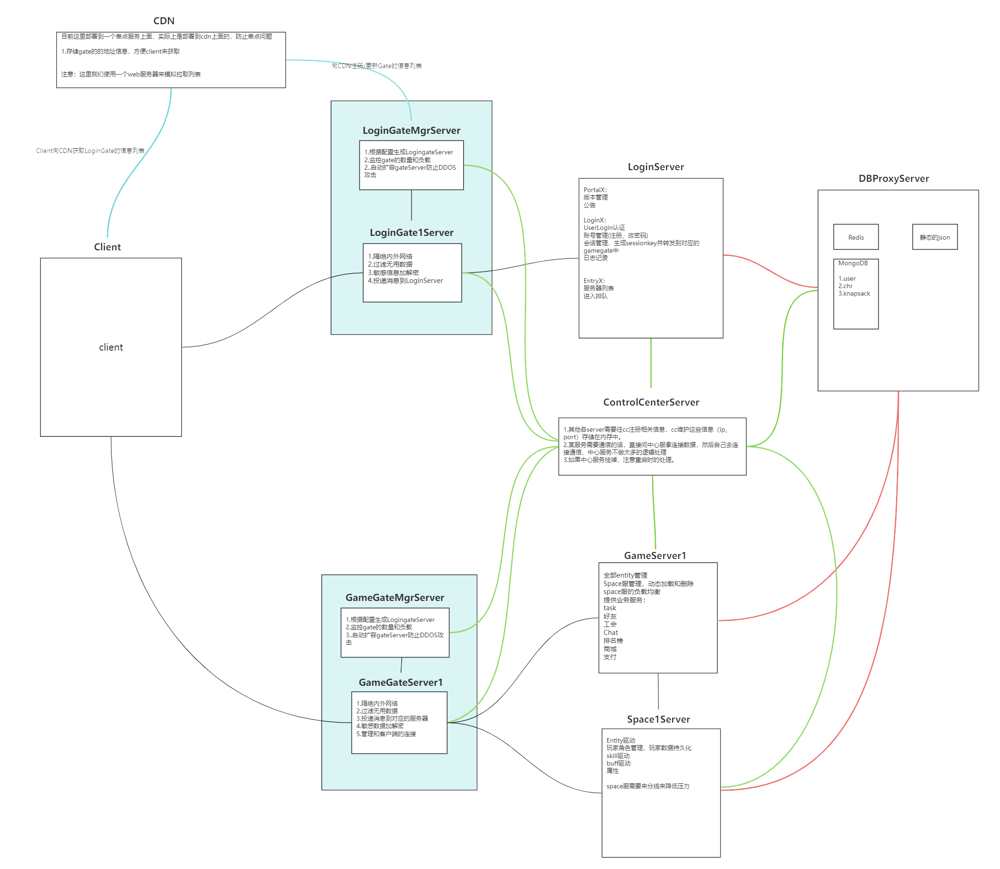

 

在此方世界中，灵气充沛，天眷者通过修仙不断强化自身，轻而易举获得移山填海、毁天灭地的能力，与此同时无数流派诞生更是丰富了这个世界的修炼体系，修士间互帮互助共同追寻那长生大道，修仙界呈现欣欣向荣的景象，貌似一切都往好的发展？


# 项目概述

自网络游戏出现以来，其发展趋势便势不可挡，可见其受欢迎程度。毕竟相对于死板的AI，人们更喜欢与真实的人进行互动，这样才能享受博弈的乐趣。

本项目主要用于学习如今网游的开发流程，学习网游关键技术，最终能构建我心中的那个世界。

2024.4.20：[目前项目进度演示视频链接](https://www.bilibili.com/video/BV1Rw4m1m7vS/?spm_id_from=333.999.0.0&vd_source=ff929fb8407b30d15d4d258e14043130)


# 注意事项


- 目前还在将单体架构转换为分布式架构，大部分的游戏逻辑都还没修改完毕。
- 目前还没有添加修仙元素...


# 项目已完成工作

## **Server架构**

2025.1.6版



**服务器角色简要说明：**


### 中心服务器(ControlCenterServer)

- 其他所有的服务器都需要向ControlCenterServer注册自己服务器的信息(ip、port、ListenEvent)
- 提供获取某某特定服务器信息的功能
- 提供订阅服务功能(如LoginGateServer订阅了LGMEnter事件，当LoginGateMgrServer上线后就会通知LoginGateServer)

### 数据库服务器(DBProxyServer)			

- 作为mognodb和其他server之间沟通的代理服务器。

### 登录服务器(LoginServer)	

- 完成登录、注册功能。

### 登录网关服务器(LoginGateServer)

- 隔绝内外网
- 加解密敏感信息
- 转发信息到login。

### 登录网关管理服务器(LoginGateMgrServer)

- 监控全部LoginGate状态
- 给Login和LoginGate建立关联
- 对为login服务的loginGate数量进行扩缩容。

### 游戏服务器(GameServer)

- 处理与场景无关的游戏逻辑，如聊天、背包、组队、商店、任务、邮件...

### 游戏网关服务器(GameGateServer)

- 隔绝内外网
- 加解密敏感信息
- 转发信息到Game或者Scene

### 游戏网关管理服务器(GameGateServerMgrServer)

- 监控GameGate和Scene
- 给Game和GameGate和Scene之间建立联系
- 对为Game服务的GameGate数量进行扩缩容

### 场景服务器(SceneServer)

- 处理玩家的移动、战斗相关的逻辑。

### 时间同步主服务器(MasterTimeServer)

- 尚未开发
- 定期将时间同步到SlaveTimeServer

### 时间同步子服务器(SlaveTimeServer)

- 尚未开发
- 其他服务器会连接到SlaveTimeServer进行时间同步

### 日志服务器(LogServer)

- 尚未开发
- 收集各个服务器的运行log并且进行分析
- 将log数据保存到数据库中

### 游戏管理员服务器(GmServer)

- 尚未开发
-  接受来自web后台的命令并且执行，间接控制其他服务器

### web代理服务器(HttpProxyServer)				

- 尚未开发
- 处理来自网页的请求，主要是可以查看其他服务器的负载情况，也可以发命令到GmServer。


## 基础模块

**网络模块**

- 使用谷歌的Protobuf作为数据格式
- 数据接收处理器，用于数据粘包拆包和消息数据提交
- 消息分发路由(多线程)
- session，暂存用户的登录信息，可用于断线重连

**日志模块**

- serilog插件

**热更新**

- yooasset+hybridclr实现

**数据库**

- ~~使用了mysql数据库 + freeSql ORM框架进行数据库的开发~~
- 使用MongoDB数据库


## 战斗模块

**Skill**

- 普攻连招系统
- 指向性技能、非指向性技能
- 技能攻击检测：扇形、圆形、矩形
- excel配置技能+脚本自定义技能

**buff系统**
- 正增益、负增益
- excel配置buff+脚本自定义buff

**敌人AI**

- excel配置地图中AI刷怪点
- 使用状态机实现怪物AI：巡逻、追逐、攻击、死亡、返回...


## 业务系统

**背包系统**
- 物品：消耗、材料、道具...
- 装备：武器、头盔、胸甲、....

**频道系统**
- 全服

**对话系统**

- ...


## 优化相关

**AOI机制**

- ~~九宫格~~
- 十字链表

**客户端游戏框架HSFrame**

- 单例单例、UI管理、延时任务、对象池、音频管理、资源加载、特效管理。

**客户端工具：**

- 循环复用列表


# 现阶段任务

战斗系统

- 需要重构一下战斗系统

背包系统

- 背包界面和装备界面UI需要优化
- 物品使用逻辑需要优化

AI

- 后面需要重构，现阶段ai太笨了

频道系统

- 后面再重构一下整个频道系统。

日志模块

- 我们自己实现一个日志模块

数据库

- ~~替换掉这个ORM框架，我们直接写操作数据库的逻辑~~
- 引入radis 加快数据库的查询效率。
- 考虑到这是一个学习项目，我们甚至可以自己手搓一个数据库。

游戏世界观完善

- 序章：天外来客


# MMORPG项目结构

**MMO-Client**：unity客户端的源码。

**MMO-SERVER**：服务端C#源代码。

**Tools**：里面有proto工具、excel工具、构建mysql数据库的sql文件。


# 项目部署运行(废弃)

## 所需工具

Unity 2022.3.59.f1


## Unity 编辑器插件


### hybridClr

https://hybridclr.doc.code-philosophy.com/docs/beginner/quickstart


vs 安装组件


### Yooasset 2.1.1

切记使用 2.1.1 版本，因为后面的版本改了一些接口，我们的项目还没升级

https://www.yooasset.com/docs/guide-editor/QuickStart


 

### BetterStreamingAssets

[BetterStreamingAssets](https://github.com/gwiazdorrr/BetterStreamingAssets)

通过 github 的 url 导入即可


### inputsystem

直接在管理器导入即可


### Post Processing

直接在管理器导入即可


## windows 下安装 mysql 环境


这里以windows10举例子

### 安装 mysql

我们这里使用的版本是 mysql 8.4.3LTS

https://dev.mysql.com/downloads/mysql/


一路傻瓜式安装即可。

可参考：https://www.runoob.com/w3cnote/windows10-mysql-installer.html


### 导入 sql 文件

这里我们使用数据库工具来完成这个工作

1.安装工具，这里我们使用 JookDB（网上随便找的）

https://jookdb.com/download.html

2.创建我们项目的数据库 mmorpg

 3.执行 sql 文件


 


### 更改 server 配置信息

在 server 中 config.yaml 修改数据库的 username 和 password

注意yaml的格式，:号后面要有一个空格

 


## windows下面启动server程序

启动后这样就没出现什么问题了。

 


## 资源服务器部署


**1.搞一个服务器**

可以使用本机来做服务器，但是我们这里以云服务器来举例子

这边使用一台阿里云的云服务器。

**2.安装宝塔面板**

https://www.bt.cn/new/download.html

记得在安全组中将宝塔的端口在云服务器上放行

然后就进入面板的网页，下载web服务器相关的资源(这里用默认的方案)

**3.网站搭建**

自己创建一个网站

然后在网站根目录创建mmo文件夹


mmo文件夹里面是这样的


其中game-config.json就是选择服务器时需要用到的信息

```
{
    "ServerList":[
        {
            "name":"本地服务器",
            "host":"127.0.0.1",
            "port":55555,
            "state":0
        },
        {
            "name":"云服务器",
            "host":"x.x.x.x",
            "port":55555,
            "state":0
        }
    ]
}
```


PC文件夹就存放我们PC平台下的热更资源包、Android同理

**注意将网站的端口在云服务器安全组中放行**

注意，需要在untiy中将Main脚本的AssetServer字段改为云服务器的mmo目录处


 


