 

在此方世界中，灵气充沛，天眷者通过修仙不断强化自身，轻而易举获得移山填海、毁天灭地的能力，与此同时无数流派诞生更是丰富了这个世界的修炼体系，修士间互帮互助共同追寻那长生大道，修仙界呈现欣欣向荣的景象，貌似一切都往好的发展？


# 项目概述

自网络游戏出现以来，其发展趋势便势不可挡，可见其受欢迎程度。毕竟相对于死板的AI，人们更喜欢与真实的人进行互动，这样才能享受博弈的乐趣。

本项目主要用于学习如今网游的开发流程，学习网游关键技术，最终能构建我心中的那个世界。

2024.4.20：[目前项目进度演示视频链接](https://www.bilibili.com/video/BV1Rw4m1m7vS/?spm_id_from=333.999.0.0&vd_source=ff929fb8407b30d15d4d258e14043130)


# 注意事项


- 目前还在将单体架构转换为分布式架构，大部分的游戏逻辑都还没修改完毕。
- 目前还没有添加修仙元素...


# 项目已完成工作

## **Server架构**

2025.3.13 版

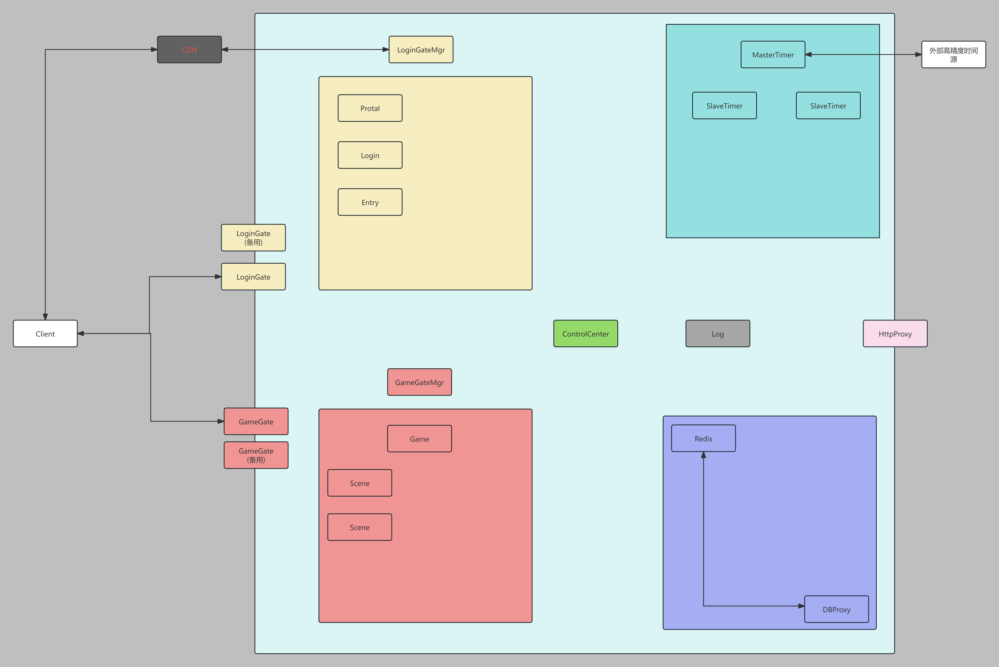

我们游戏服务器使用的是分布式服务器模式（Distribted Server）,游戏逻辑分布在多个服务器节点上，通过负载均衡动态分配玩家。这种模式适合超大型多人在线游戏。

### CDN

我们这里做一个模拟CDN的Web服务器，因为云厂商提供的CDN需要花费。

主要功能：
1.是给客户端提供我们LoginGate的地址。
2.预防DDOS攻击导致单点问题的发生。

这里解释一下单点问题（SPOF）：它指系统中存在某一组件或节点，其一旦发生故障，会导致整个系统不可用或功能严重受损。它是系统设计中的致命弱点，违背了高可用性（High Availability）和容错性（Fault Tolerance）原则。


### ControlCenter

主要功能：

1.服务器信息注册：他管理着集群中全部的服务器，当其他服务器启动之后，需要向中心服注册自己的信息。比如当login服务需要去连接GameGateMgr的服务器时，就可以通过中心服去获取IP和Port。

2.事件订阅：可能会有怎么一个情况，当Scene启动后，它首先向ControlCenter连接并且注册自己的信息（ip、port、事件订阅的位图）。

正常情况下Scene会订阅GameGateMgr上线的事件，当GameGateMgr向ControlCenter注册后，就会触发GameGateMgr上线的事件，ControlCenter就会通知所有注册该事件的服务器。那么此时Scene就知道了GameGateMgr的信息了，就可以去连接它继续它自己的流程了。

3.监控分布式系统中服务器的存活状态


### LoginGateMgr

主要功能：

1.所有的LoginGate上线之后，都需要连接到LoginGateMgr并且完成注册。

2.关注所有Login的上线，这里我们通过ControlCenter提供的事件服务来实现。

3.分配LoginGate给Login,同时关注LoginGate的负载情况，一旦负载超出或者低于阈值，动态增加对影Login关联的LoginGate数量。

4.更新CDN中LoginGate的存活情况


### LoginGate

这是与客户端直接连接的服务器
主要功能：
1.隔绝内外网环境，用户从始至终不知道自己一直通信的只是一个网关服务器。
2.过滤无效的客户端请求，降低后面逻辑处理服务器的压力。
3.和客户端的密钥交换流程，敏感请求的消息加解密。
4.根据不同的客户端请求，将请求转发到不同的逻辑服务器当中。比如登录请求转发到Login，获取GameGateList的请求转发到Entry中
5.定期向LoginGateMgr上报本服务器的负载情况


### Protal（未开发）

门户服务器

主要功能：

1.游戏版本更新

2.游戏公告


### Login

主要功能

1.处理登录和注册相关的信息。

2.用户登录成功后将生成的session投递到Entry中。


### Entry（未开发）

这个服务器接受全部的Login的连接。
这个服务器会主动连接到GameGateMgr。

主要功能：
1.接受来自Login 投递的Session, 将其放到队列中进行处理
2.根据session的信息，向GameGateMgr询问对应的GameGate列表，并将其返回给客户端。
3.是否需要在这里去控制进入对应世界的人数呢？


### GameGateServerMgr

主要功能：

1.所有的GameGate和 Scene上线之后，都需要连接到GameGateMgr并且完成注册。

2.关注所有Game的上线，这里我们通过ControlCenter提供的事件服务来实现。

3.分配GameGate和Scene给Game

4.接受来自Entry的session信息并且返回较为空闲的GameGateList


### GameGate

这是与客户端直接连接的服务器

主要功能：
1.隔绝内外网环境，用户从始至终不知道自己一直通信的只是一个网关服务器。
2.过滤无效的客户端请求，降低后面逻辑处理服务器的压力。
3.和客户端的密钥交换流程，敏感请求的消息加解密。
4.根据不同的客户端请求，将请求转发到不同的逻辑服务器当中。比如：拉取背包信息请求，我们就会将信息投递到Game；同步位置信息请求，我们会投递到Scene中进行处理。
5.定期向GameGateMgr上报本服务器的负载情况。


### Game

主要功能：
1.保存一些与场景无关的静态数据，如：角色信息、账户信息、背包信息、装备设置、技能树。
2.组队、聊天、任务等游戏逻辑。


### Scene

主要功能：
1.记录一些与场景相关的动态数据：玩家Transfrom信息、场景信息等。
2.处理玩家的移动、战斗相关的游戏逻辑。


### DBProxy

主要功能：
1.他作为底层MongoDB的代理服务器，替我们去处理其他服务器发送过来的请求,其他服务器通过它来间接获取和设置信息。


### Redis（未开发）

设计为主从结构，主写从读
主要功能：
1.其他的服务器要获取数据库数据时首先向Redis去获取，如果有缓冲那就直接返回，如果没有，Redis就代替原来的服务器向DBProxy去请求，当响应回来之后，先将数据进行缓冲，然后在返回给原来的服务器。


### Log（未开发）

主要功能：
1.收集各个服务器的log信息，目前的想法每个Server自己保存到文件，然后发送给Log，Log在自己处理。


### MasterTimer

时间同步主服务器，作为整一个分布式系统的时间权威
主要功能：

1.接受来自SlaveTimer的连接，并且响应其时间同步的请求
2.向其他一些高精度的时间源去发起请求去同步自己的时间


### SlaveTimer

时间同步从服务器，主从结构提高容灾能力
主要功能：
1.定期向MasterTimer去同步时间，比较时间误差积累
2.分布式系统中的其他服务器连接到SlaveTimer，并且定期进行时间同步。


### HttpProxyServer（未开发）

主要功能：

1.我们使用它就可以便捷地通过web去查看分布式集群中各个服务器的状态，并且可以通过web来进行命令的发送。


## 基础模块

**网络模块**

- 使用谷歌的Protobuf作为数据格式
- 数据接收处理器，用于数据粘包拆包和消息数据提交
- 消息分发路由(多线程)
- session，暂存用户的登录信息，可用于断线重连

**日志模块**

- serilog插件

**热更新**

- yooasset+hybridclr实现

**数据库**

- ~~使用了mysql数据库 + freeSql ORM框架进行数据库的开发~~
- 使用MongoDB数据库


## 战斗模块

**Skill**

- 普攻连招系统
- 指向性技能、非指向性技能
- 技能攻击检测：扇形、圆形、矩形
- excel配置技能+脚本自定义技能

**buff系统**
- 正增益、负增益
- excel配置buff+脚本自定义buff

**敌人AI**

- excel配置地图中AI刷怪点
- 使用状态机实现怪物AI：巡逻、追逐、攻击、死亡、返回...


## 业务系统

**背包系统**
- 物品：消耗、材料、道具...
- 装备：武器、头盔、胸甲、....

**频道系统**
- 全服

**对话系统**

- ...


## 优化相关

**AOI机制**

- ~~九宫格~~
- 十字链表

**客户端游戏框架HSFrame**

- 单例单例、UI管理、延时任务、对象池、音频管理、资源加载、特效管理。

**客户端工具：**

- 循环复用列表


# 现阶段任务

战斗系统

- 需要重构一下战斗系统

背包系统

- 背包界面和装备界面UI需要优化
- 物品使用逻辑需要优化

AI

- 后面需要重构，现阶段ai太笨了

频道系统

- 后面再重构一下整个频道系统。

日志模块

- 我们自己实现一个日志模块

数据库

- ~~替换掉这个ORM框架，我们直接写操作数据库的逻辑~~
- 引入radis 加快数据库的查询效率。
- 考虑到这是一个学习项目，我们甚至可以自己手搓一个数据库。

游戏世界观完善

- 序章：天外来客


# MMORPG项目结构

**MMO-Client**：unity客户端的源码。

**MMO-SERVER**：服务端C#源代码。

**Tools**：里面有proto工具、excel工具、构建mysql数据库的sql文件。


# 项目部署运行(废弃)

## 所需工具

Unity 2022.3.59.f1


## Unity 编辑器插件


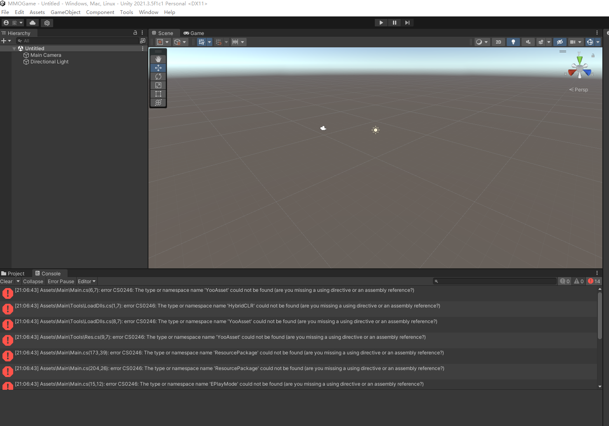


### hybridClr

https://hybridclr.doc.code-philosophy.com/docs/beginner/quickstart


vs 安装组件


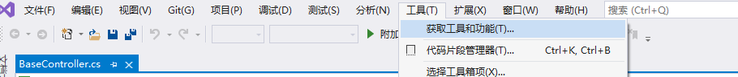

### Yooasset 2.1.1

切记使用 2.1.1 版本，因为后面的版本改了一些接口，我们的项目还没升级

https://www.yooasset.com/docs/guide-editor/QuickStart


 

### BetterStreamingAssets

[BetterStreamingAssets](https://github.com/gwiazdorrr/BetterStreamingAssets)

通过 github 的 url 导入即可


### inputsystem

直接在管理器导入即可


### Post Processing

直接在管理器导入即可


## windows 下安装 mysql 环境


这里以windows10举例子

### 安装 mysql

我们这里使用的版本是 mysql 8.4.3LTS

https://dev.mysql.com/downloads/mysql/

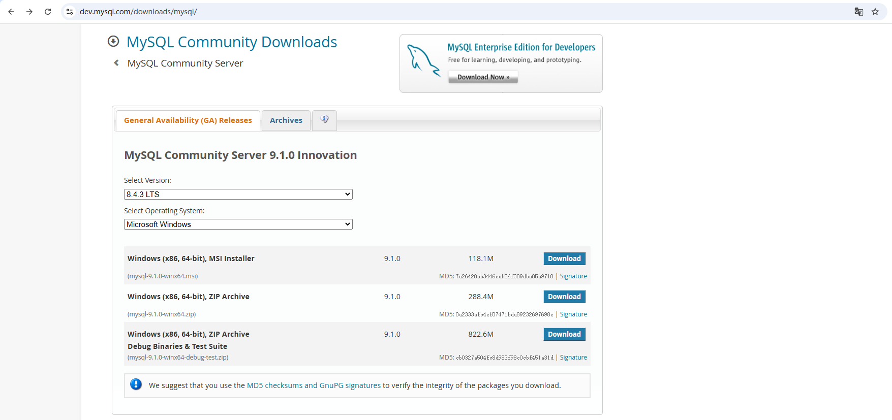

一路傻瓜式安装即可。

可参考：https://www.runoob.com/w3cnote/windows10-mysql-installer.html


### 导入 sql 文件

这里我们使用数据库工具来完成这个工作

1.安装工具，这里我们使用 JookDB（网上随便找的）

https://jookdb.com/download.html

2.创建我们项目的数据库 mmorpg

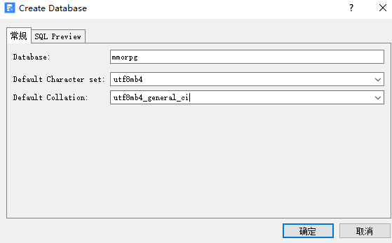 3.执行 sql 文件


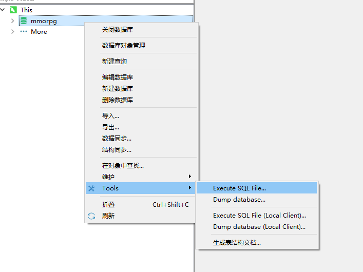 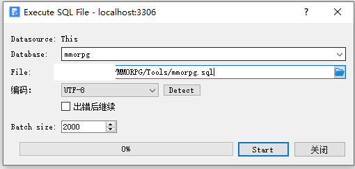


### 更改 server 配置信息

在 server 中 config.yaml 修改数据库的 username 和 password

注意yaml的格式，:号后面要有一个空格

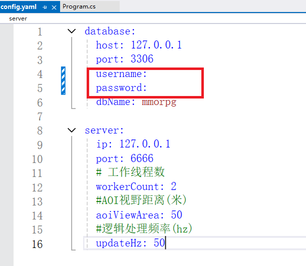 


## windows下面启动server程序

启动后这样就没出现什么问题了。

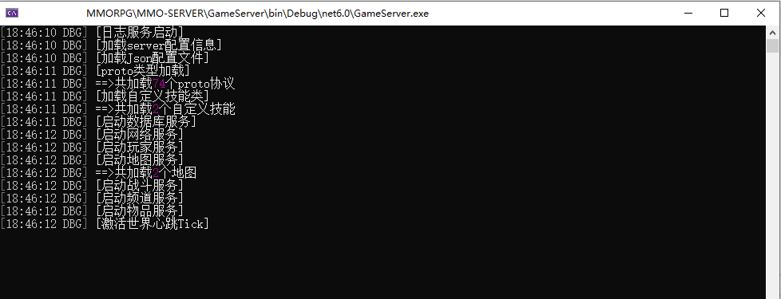 


## 资源服务器部署


**1.搞一个服务器**

可以使用本机来做服务器，但是我们这里以云服务器来举例子

这边使用一台阿里云的云服务器。

**2.安装宝塔面板**

https://www.bt.cn/new/download.html

记得在安全组中将宝塔的端口在云服务器上放行

然后就进入面板的网页，下载web服务器相关的资源(这里用默认的方案)

**3.网站搭建**

自己创建一个网站

然后在网站根目录创建mmo文件夹

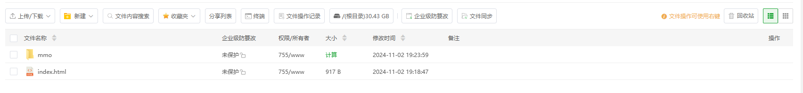

mmo文件夹里面是这样的

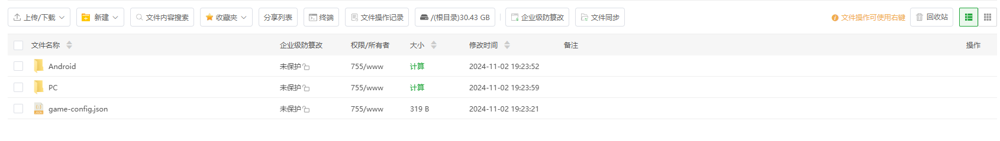

其中game-config.json就是选择服务器时需要用到的信息

```
{
    "ServerList":[
        {
            "name":"本地服务器",
            "host":"127.0.0.1",
            "port":55555,
            "state":0
        },
        {
            "name":"云服务器",
            "host":"x.x.x.x",
            "port":55555,
            "state":0
        }
    ]
}
```


PC文件夹就存放我们PC平台下的热更资源包、Android同理

**注意将网站的端口在云服务器安全组中放行**

注意，需要在untiy中将Main脚本的AssetServer字段改为云服务器的mmo目录处


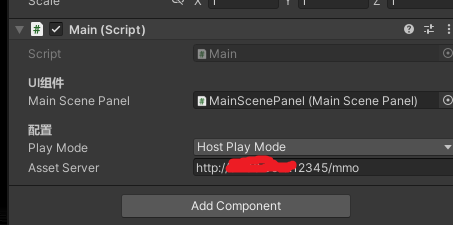 


