# 网络游戏哲学


## 世界是怎么活起来的

变化不是连续的，而是以普朗克长度为单位的时间间隔变化。十分像我们游戏世界中的tick。


## 技术框架易沉迷，请勿上瘾


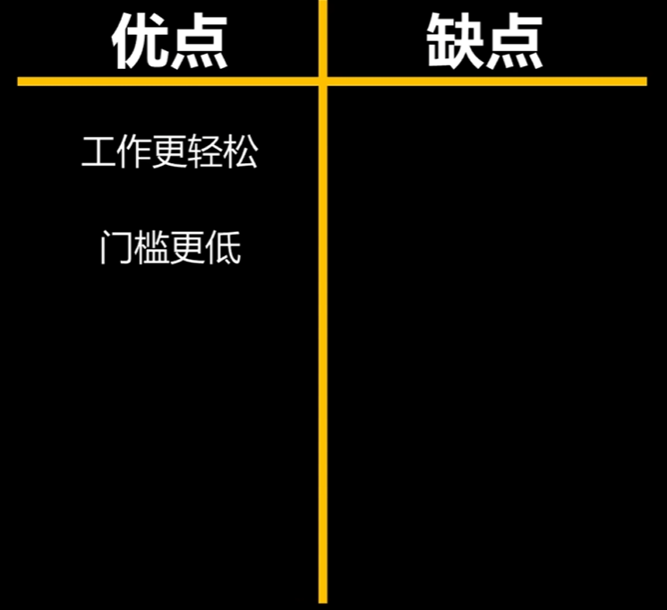 


### 被隐盖的原理和价值

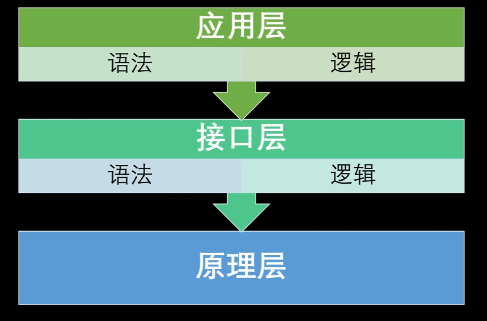 


比如说数据库，大部分人只会用ORM框架 

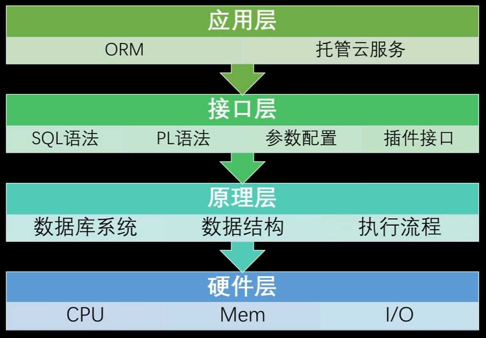 

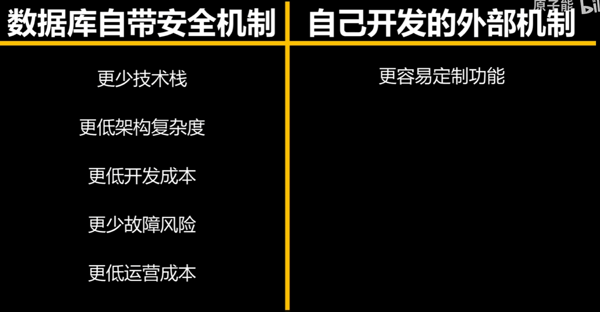


### 没用永恒的框架，只有永恒的原理


# =============================

# 动画系统

## bug

1.点击动画片段的时候没有预览画面

 


动画预览窗口只是被隐藏了，向上拖拉右下角的双横线，即可打开动画预览窗口。

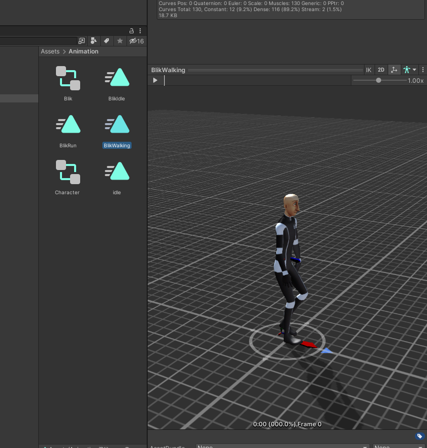 


 


## Animator Component

**动画组件**

组件里面可以配置的东西叫属性property

玩家希望物体拥有播放动画的功能时就需要添加动画组件，我们会把游戏对象需要的动画状态机放入该组件

如果游戏对象使用了替身系统，我们也需要把它对应的替身放进去。

然后我们就可以在游戏脚本中访问这个动画组件了，从而自由得控制游戏对象的动画

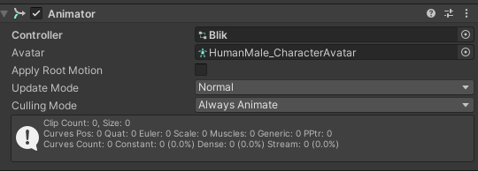 


### 1.Controller

这里是需要挂载一个Animator controller动画状态机，它是我们组织并且管理动画片段的工具

### 2.Avatar

如果我们要播放的是使用了avatar系统的人形动画，就要放上对应的avatar

如果我们没有使用avatar的话，那么animator就会严格按照动画片段记录的path去寻找相应的游戏对象并播放动画。

如果我们使用了avatar系统，那么只要avatar对应的角色模型在该对象的下面，不需要下一级子对象，无论他隔了多少级，animator都能通过avatar准确找对对象模型，并播放动画。

avatar还兼具传令兵的职责，animator只需要将动画片段传递给avatar，他就会去当前的游戏对象及其子对象下面层层寻找孵化要求的模型，并且将动画片段播放在该模型上面


### 3.Apply Root Motion

有一些动画片段本身是带有位移的，如果我们希望把这些动画里的位移应用到游戏对象上那么就勾选这里

如果我们希望通过自己编写脚本来控制角色的位移和选择那么这里就不用勾选

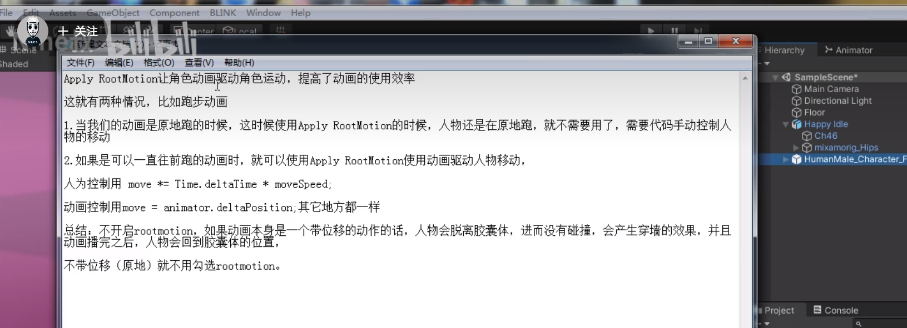

//魂穿，有点意思


### 4.Update Mode

动画的刷新模式，这里的刷新并不是指重新将动画绘制到屏幕上的刷新，而是重新计算每一个骨骼节点的位置、旋转、缩放的数值

**normal**表示与帧率同步，与就是和UPdate()进行同步刷新，即没在屏幕上绘制一张画面，我们就重新计算一些每个骨骼的相关数值

**animate physice** 表示与物理引擎同步，也就是和fixupdate进行同步刷新，即unity每做一次物理检测，比如说碰撞检测，那么我们就重新计算一些这里每个骨骼节点的相关数值，一般用在和物体有交互的情况下

**unscale time** 和normal一样和UPdate()进行同步刷新，但是这个模式下会忽略当前的时间标尺time scale

**时间标尺**：整个游戏的运行速度比例，默认情况下是1，如果我们设置为0.5，那么整个游戏的运行就会比正常情况下慢百分之50，设置为0.2就会慢百分之80以此类推。

animate physice也会受时间标尺的影响


### 5.Culling Mode

剔除模式：

剔除原本是图形学上第一个概念，也就是指当某个物体并没有被摄像机看到时，我们就不需要去渲染它。

同理在动画里就是指当这个游戏对象没有被摄像机看到时，那么我们应该做如何的处理

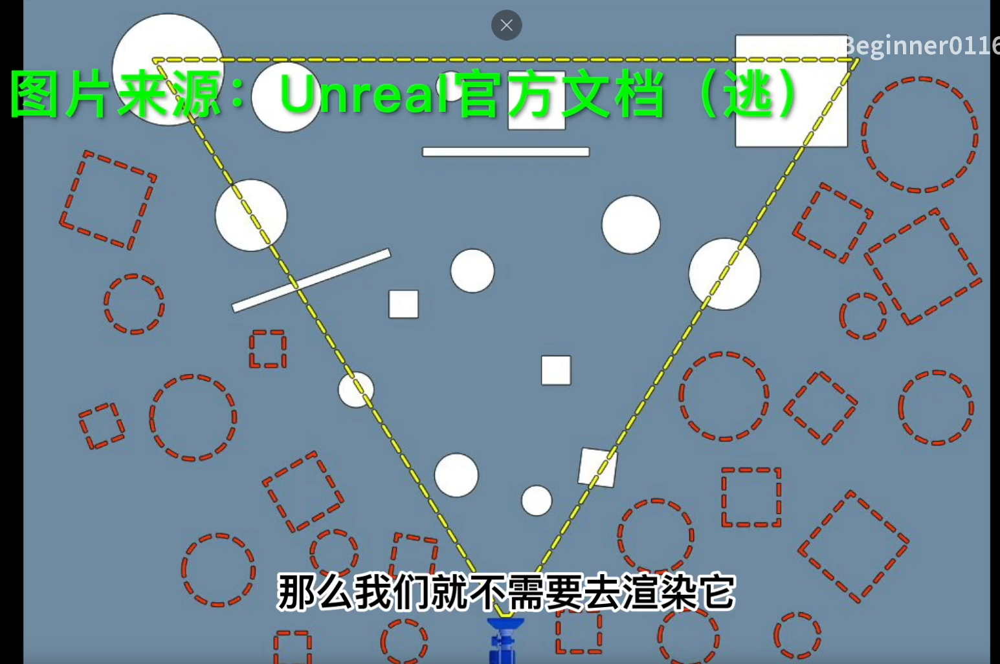 

**Always Animate** 表示即使摄像机看不见也要进行动画播放的更新

**cull update transform**    表示摄像机看不见时停止动画播放但是位置会继续更新，但是选择这个选项会剔除诸如IK之类的操作

**cull completely**表示摄像机看不见时停止动画的所有更新


## Animation Clip

动画片段

是对物体变换情况的一种展示，它可以是游戏角色的闪转腾挪，也可以是一扇门的开闭，甚至可以是ui界面的淡入淡出 。

动画片段可以由外部导入也可以在unity中制作

**动画文件用编辑器打开后是一个标记语言yaml写的文件，动画文件其实一个描述物体变化的文本文件**

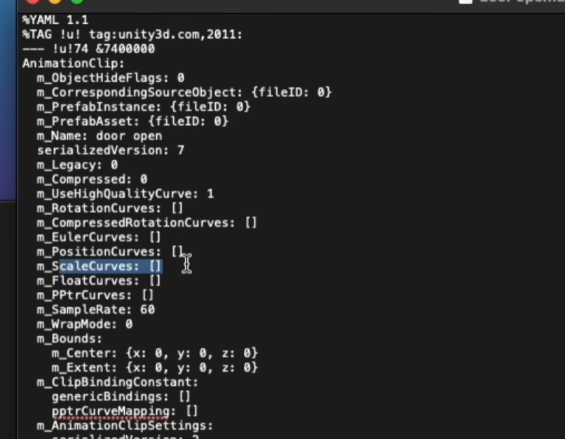 


### 外部导入

请看上面mixamo网站使用


### 在unity中制作简单的动画片段

接下来我们以一个门旋转作为例子：

1.先创建一个像门的玩意

 

注意：要选pivot模式，不然door拖到pivot的时候，pivot又在门的中心位置

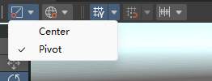 

2.开始制作动画，打开animation窗口

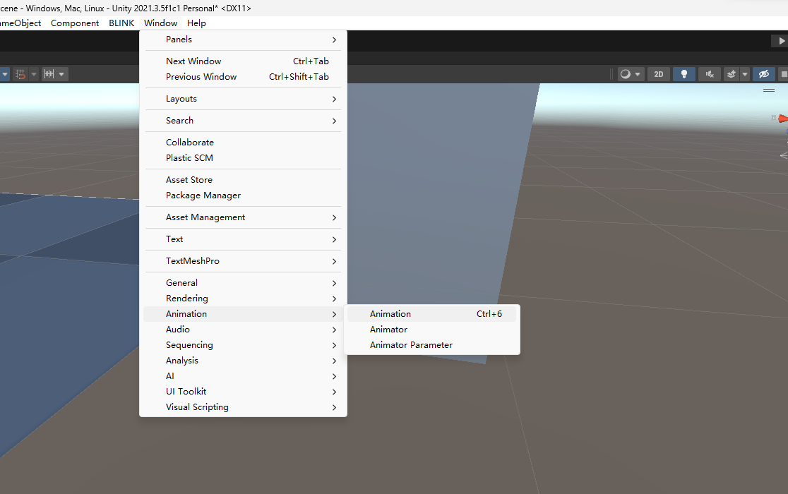 

然后选中要制作动画的物体，也就是pivot，然后点击animation窗口中的创建

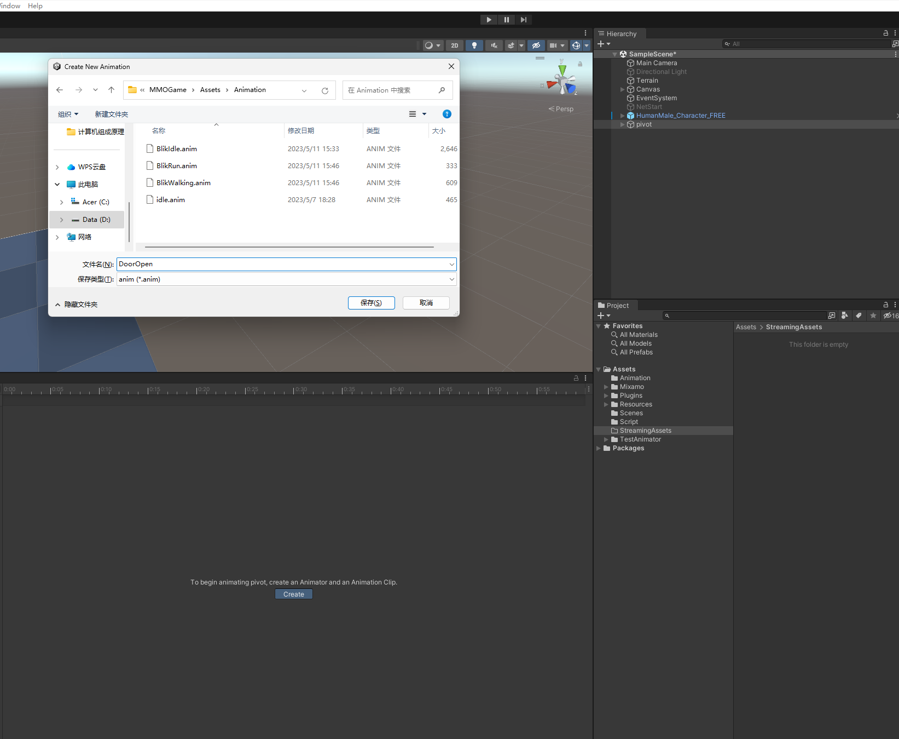

此时unity会帮我创建一个动画状态机和动画，并且会为pivot挂载上一个animator组件

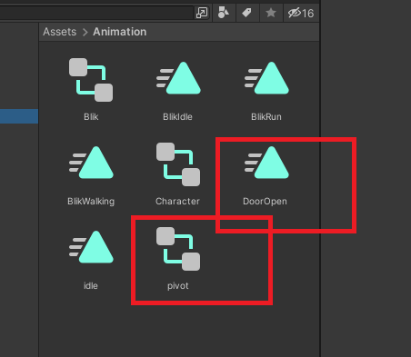 

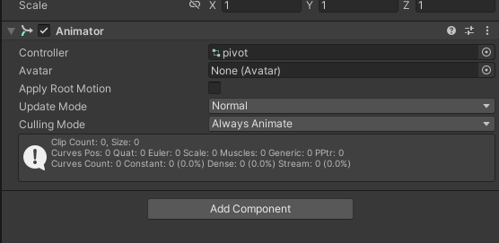 


**也就是说当我们按下create的时候我们就拥有了动画系统的全部三个组成部分**（动画片段，动画状态机，动画组件）

用一个文本编辑器打开刚刚创建的动画文件，我们可以看到其实动画片段文件是使用标记语言YAML编写的一个文件。

**我们可以知道，动画片段文件是一个描述物体变化状态的文本文件**

**还有就是：我们在unity中创建的资源文件其实大多数都是有yaml语言编写的文本文件（比如说场景文件，动画状态机，prefab）**

下图我们可以看到一些信息：文件类型，对应的物体名称，**旋转，位置，缩放，这是使用curves曲线来描述的，后面会讲到为什么用曲线来进行描述**

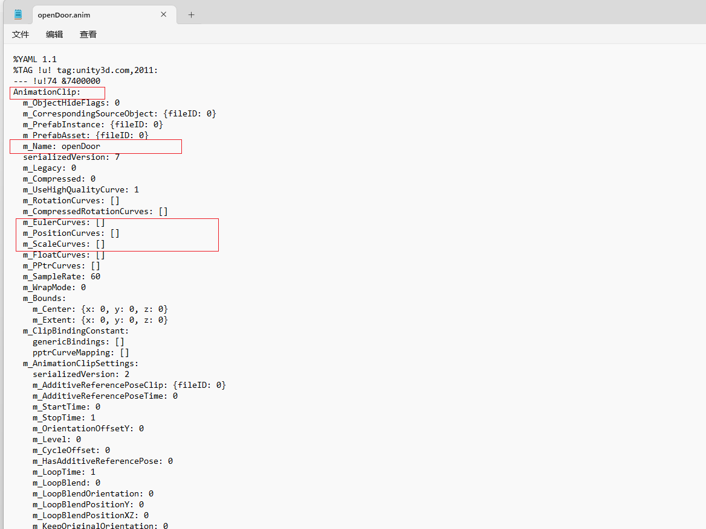 


在unity的检视视图下，我们可以看到刚刚那几个curves的信息都是为空的，所以这里显示为0

 


3.切换到animation视图，选中场景中的pivot，

通过add property我们可以选择在动画中对游戏对象的哪些属性进行变化

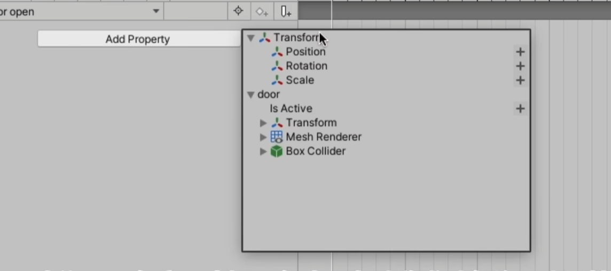


因为我们需要门轴选择，所以选择transform中的rotation


在左边我们可以修改xyz的值

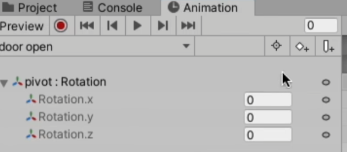

**右边这里是时间标尺，**我们可以选择在哪一个时间点上把这里的选择角度设置为什么值，这里的时间标尺默认为1秒

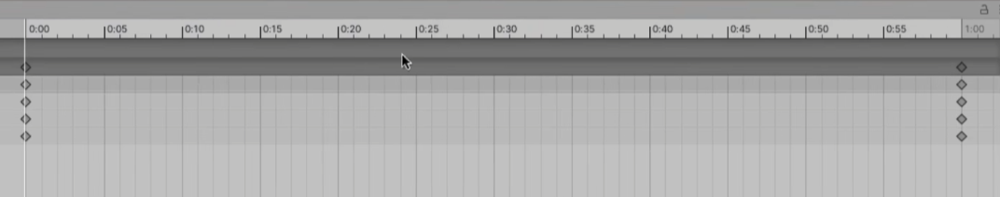

可以通过鼠标缩放来将时间刻度尺拉长

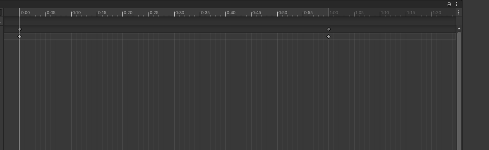


4.现在我们希望动画在播放一秒后把门开到120度

那么我们就在刻度尺为1这里点击鼠标左键，这里出现了白色的提示线

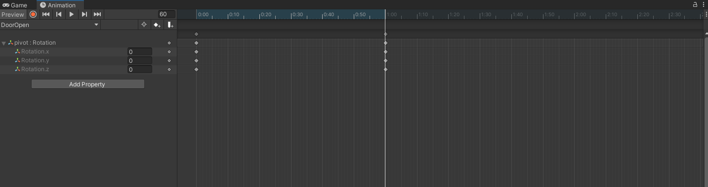

在这里我们可以看到60，就说明我们正在处理动画的第60帧，这也说明了我们动画的默认帧率为60


我们将y值改为120，可以观察到门的变换。


注意：**unity通过插值算法帮我们在每一帧中都即使了合适的角度值，我们这个动画实际上只做了2帧，而unity帮我们把其他的帧补全了。**


点击下面的**curves**，我们就能以曲线的形式观察并修改当前的动画片段，**这与就是为什么在动画文件中要使用curve来指代物体的变化**

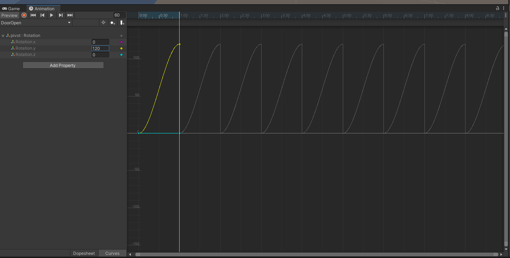


5.点击播放我们可以看到开门动画已经完成了

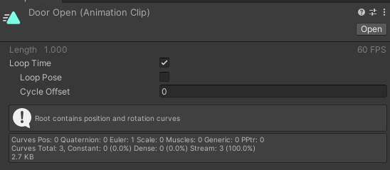

**观察到提示信息euler中的值变为1，说明动画文件中包含了一个绕欧拉角旋转的运动**，也就是记录了我们刚刚沿着y轴旋转。


打开动画片段文件，我们可以看到刚刚为空的eulerCurve出现了信息


### Q：我们是否可以用这个动画文件来旋转任意一个游戏对象呢？


### 动画复用

点击动画片段，在检视窗口下面，将我们opendoor模型拖进去，就能查看动画的效果了。

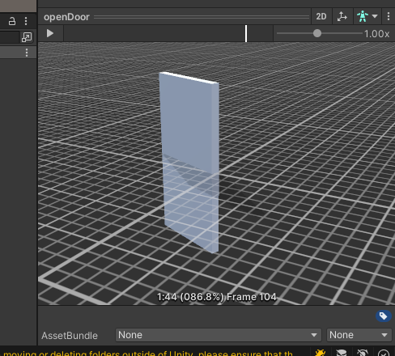


那其他的物体能使用这个动画片段吗？我们创建一个新的物体拖进去查看。

实验结果：这是可行的。这个动画可以正确在另外一个游戏对象上播放。换一个更加复杂的人物模型也是可行的。

这种复用看起来是理所当然的，因为这个动画文件描述的是物体的旋转，所以它当然可以用来旋转任何一个游戏对象，同理，这个动画文件里描述了物体的位移缩放，那它也一定可以用来位移和缩放任何一个游戏物体。

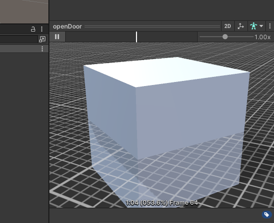


### **Q:那么当动画文件要处理的物体不止一个的时候会发生什么呢？**

我们可以设计一个双开门动画

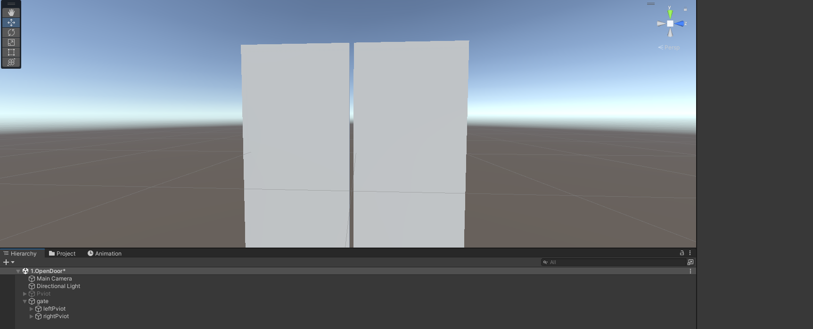

选中gate给gate创建一个新的动画，给leftpivot和rightpivot添加旋转动画

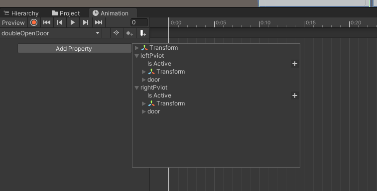 

设置旋转值

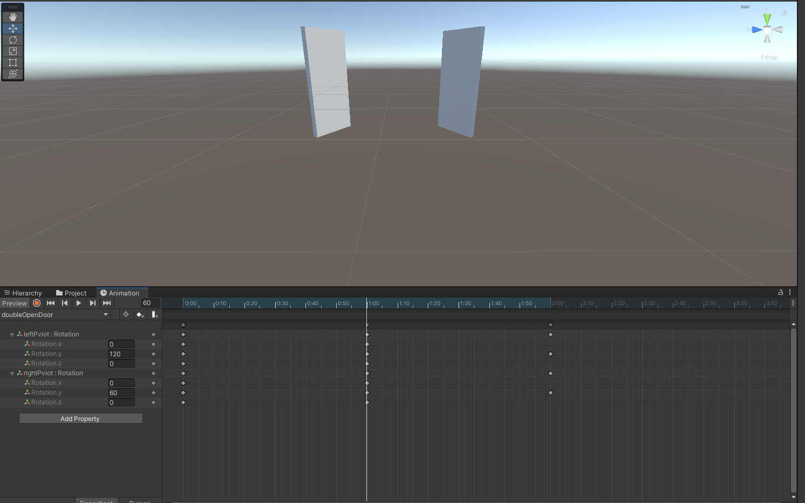 

创建好之后我们就可以在检视视图里面看到包含了两个旋转

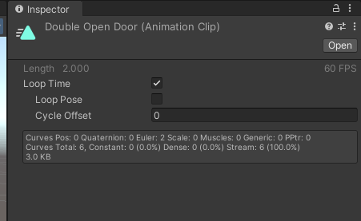 

我们用文本编辑器打开这个动画文件就可以看见这两个旋转，在这两个旋转下面我们可以找到一个关键词path,它后面写着我们两个被旋转对象的游戏对象名称，

**那么我们就可以知道当动画文件要处理多个游戏物体的时候会在文件中写上该物体的名称，unity会通过文件中的这个名称找到正确的游戏对象然后再通过动画文件中的描述去移动它。**

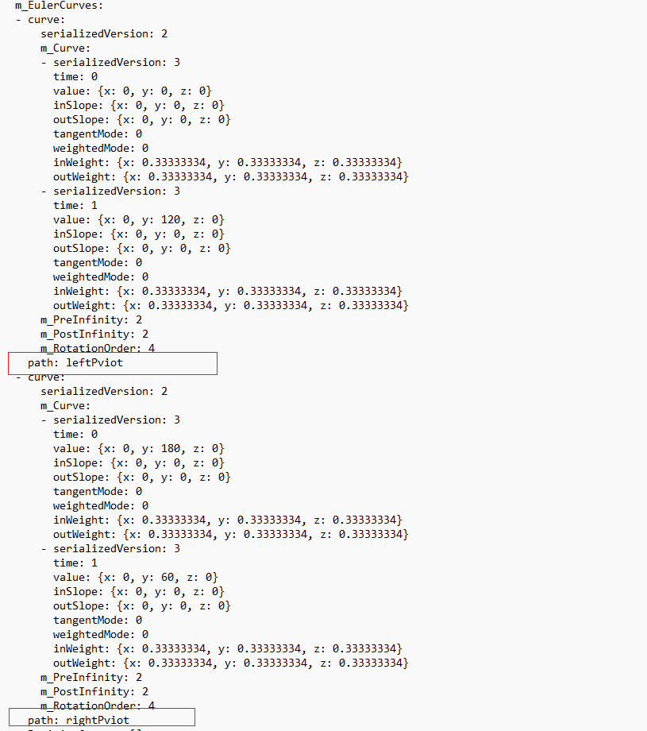 


我们尝试将门轴的名字修改之后，unity就不能在动画文件中找到这个门轴名字，动画就不能正常播放，**也就是说游戏对象的名字如果和动画文件里不一致就无法正常播放**。

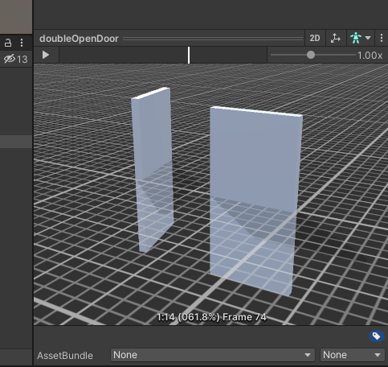 


### **Q：那么是不是另一组游戏对象的名字和动画文件里描述一致是不是就可以复用动画了？**

显然，这是可行的


### **Q：如果我们让动画再复杂一些，让它同时处理的物体更多一些，比如说人物动画，那我们该怎么做呢？**

其实就是像上面制作双开门动画一样，我们把人体的每一个关节都制作成一个pivot，然后用一个动画片段文件来描述这些pivot的旋转，就可以得到一个人物的动画，这些pivot的组织结构就是人物动画的骨骼。

人体动画的骨骼和动画片段，我们一般通过专门的软件制作：3dmax，maya，blender


**也就是说只要骨骼结构一致，命门一致，那么人物动画文件也是可以复用的**

如果我从别的地方找到一个人物模型，它的骨骼命名方式和这里的不一致，那么我们可不可以通过给骨骼改名的方式进行复用动画呢？

当然可以，不过一个一个去手动修改太过麻烦了，所以unity给我们提供了一个简便的解决方式--替身系统Avatar

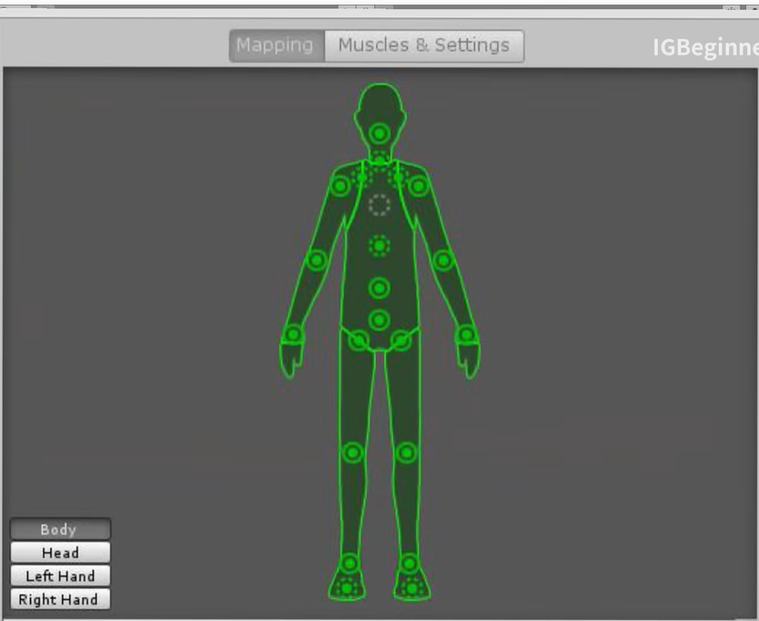 


## Avatar替身

**(人形动画)**

有时候我们希望对复制的动画资源进行复用，尤其是人形动画，为了解决这一问题，unity引入了替身的概念

这是一种人形动画骨骼的标准，所有按照统一标准配置好的人形角色都可以播放同一套动画


### 理论基础

**想要在不同的模型身上复用动画的话我们需要执行如下步骤：**


1.我们通过替身系统把人体模型骨骼A的骨骼，用一套标准的unity肌肉结构对应起来，这种对应关系被保存到A的Avatar文件当中

此时骨骼信息也被保存到了avatar文件当中，所以我们不在需要模型A上的骨骼了

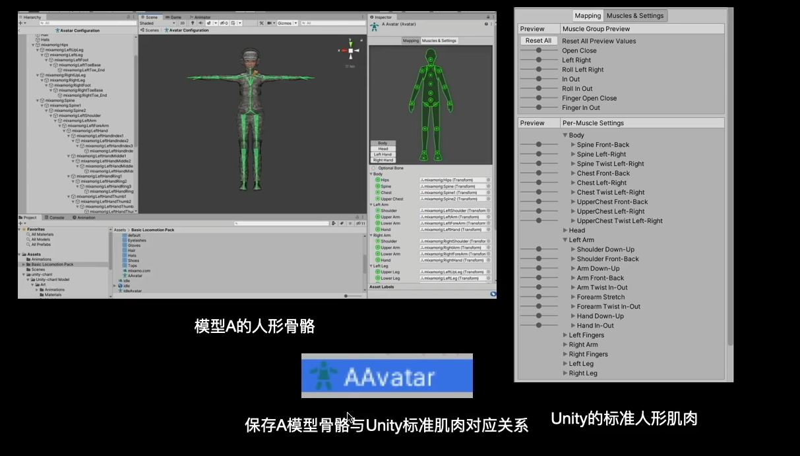


2.我们用相同的方法把人体模型B的骨骼与unity肌肉结构对应起来，并把这种对应关系保存到B的Avatar文件当中

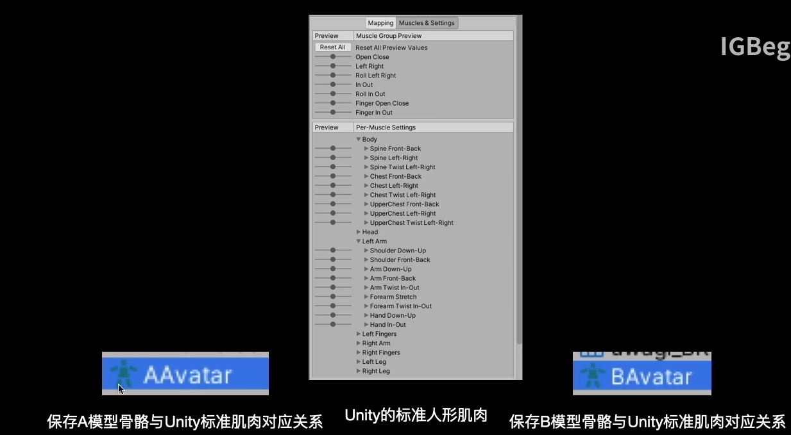


3.接下来我们再通过A的Avatar文件把**动画片段**从**描述A的骨骼变化情况的文本**转换为**描述unity肌肉拉伸程度的文本**

当我们在B模型上使用这个动画时，就要通过B的Avatar文件把**动画文件中对肌肉拉伸的描述**，再翻译为**对B模型变化的描述**

这样动画文件就可以再b模型上播放了


例子：


美方没有日语翻译、日方没有英语翻译，但是它们都有荷兰语翻译


### 实际操作

#### 打开模型进行配置


**animationType**:

表示该骨骼播放那种动画，这里我们选人形

如果是锅碗瓢盆这些一般是不用播放动画的，选中None即可

如果是飞禽走兽的话，选中通用即可

Legacy是老版本遗留的没什么用不选


**Avatar Definition:**

createFromThisModel:根据这个模型的骨骼简历一个与unity肌肉对应的关系 

CopyFromOtherAvatar:选择另外一个已经配置好的Avatar

这里我们选择第一个


**Skin Weights:**

表示每一个模型的蒙皮或者说mesh上的节点可以被几个骨骼所影响，这里我们暂时不用管，这里让他保留默认值


**optimize Game Objects**

优化游戏对象，当我们使用了avactar之后播放动画就与模型问卷上的骨骼无关了，动画组件会从Avatar文件中读取骨骼信息

选中这里的话，模型文件上的骨骼就会被删除，这样可以节省一些游戏空间

但是我们先不勾选


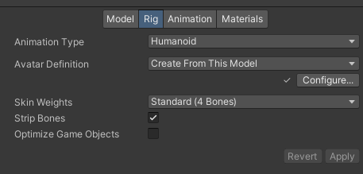 

最后apply应用即可，然后你会发现你的模型文件下面生成了一个Avactar文件，我们进入Avactar文件进行配置

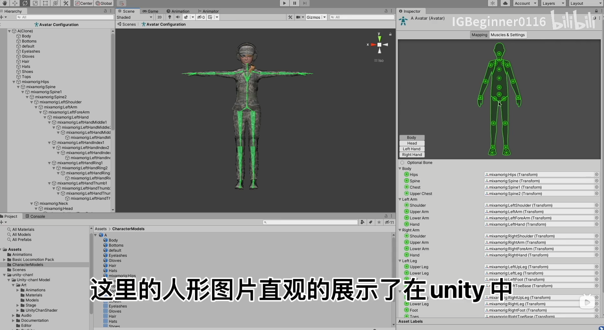

这里的人形图片直观得展示了在unity中一个标准的人形骨骼布局应当是怎么样的

在检视视图下的绿色圆圈，代表了一个对应的骨骼

外圈虚线表示这个骨骼可选，也就是说角色模型并非必须包含这块骨骼

外圈如果是实线，则表示该模型必须包含这个位置的骨骼，否则无法使用Avatar系统

当unity使用Avatar系统对骨骼和肌肉做对应关系时，它至少需要人体模型上有15块孵化排列规则的骨骼 

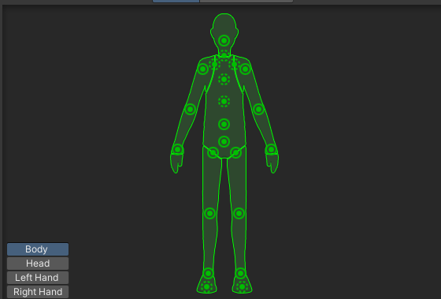 

在左下角我们可以擦看并配置人物模型的哪个部分：比如躯干、头、手、

在下面我们可以找到模型中具体骨骼的对应关系：

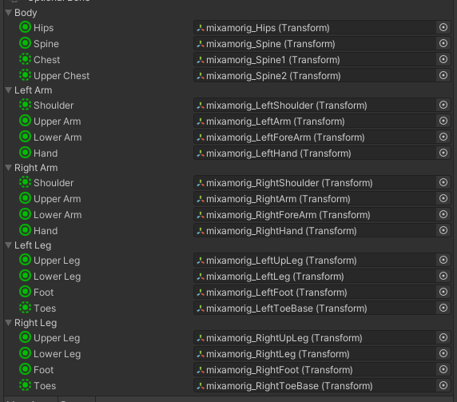 

我们可以很轻松的通过拖拽的方式配置这些骨骼，当然，在大多数情况下，unity会自动的帮我们把这些骨骼安排好

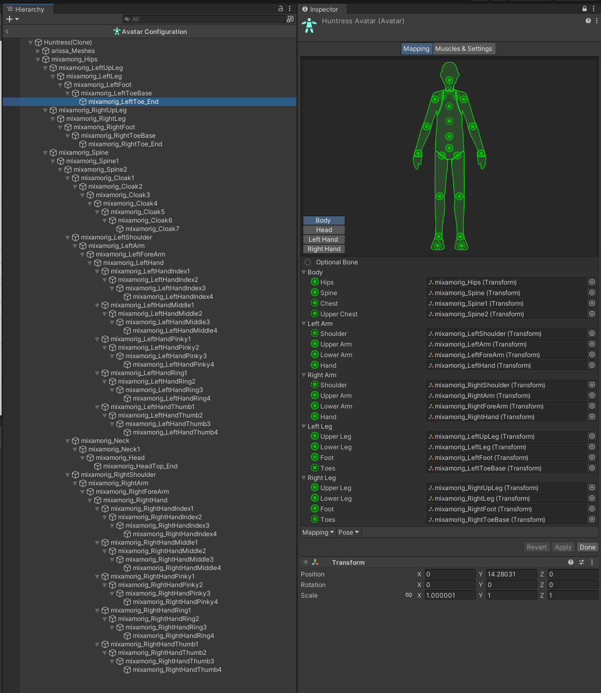


继续往下看，左边有两个下拉菜单

 


接下来我们点击muscles进入肌肉配置界面

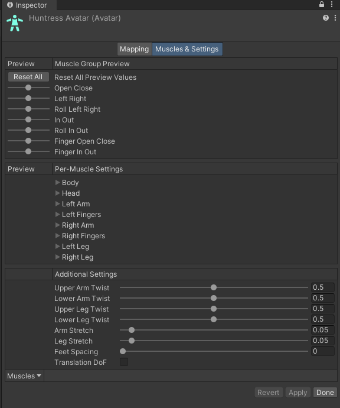 


但是绝大多数情况下都是不需要我们进行配置的。。。。


#### 接下来我们为模型b也制作一个Avatar

直接根据自身创建一个就行了


我们可以看到动画片段的描述，从原来mixamo的描述转换为unity对肌肉的描述了

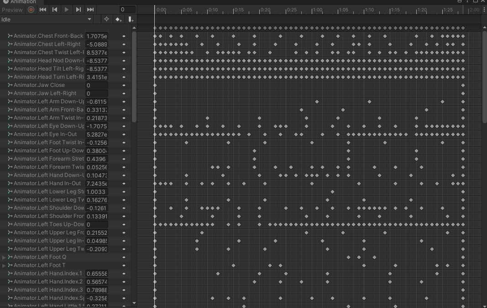 

给两个模型添加相对应的avatar和动画状态机

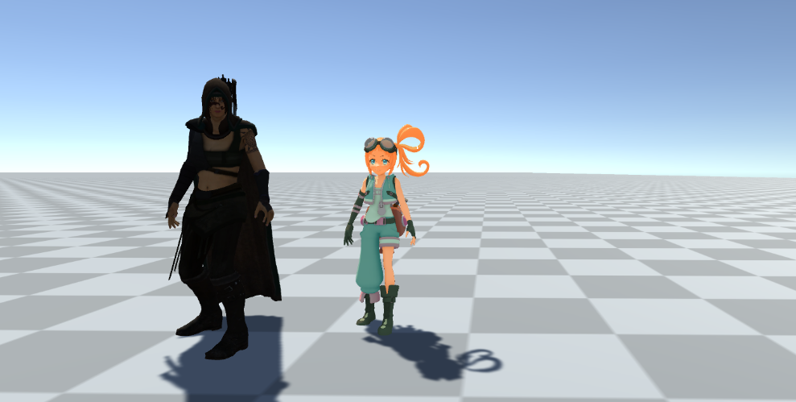 

动画复用成功！！


## Animator Controller


**动画状态机**

动画状态机会帮助我们跟踪当前动画的播放状态 ，并且根据我们的设置来决定何时以及如何切换动画片段。

这个是打开之后的视图，你可以在里面添加动作片段animation，然后通过连线控制动画的切换

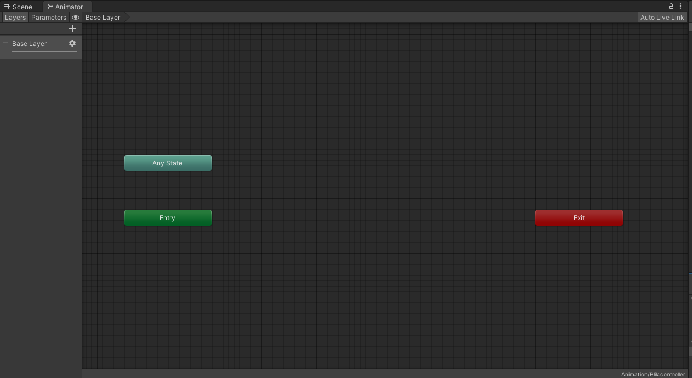 


 


### **Layers**

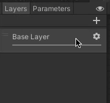 

一般用于组合动画，比如你需要角色身体的不同部分播放不同的动画片段时，会使用到这个功能

比如说我们有两个动画：人物持枪，人物空手移动

 


那么我们只需要让双手播放持枪动画， 其他部分播放行走动画，就可以组合出一个持枪行走动画

 


### Parameters

是用来控制动画状态的参数，


### 动画状态

在unity中动画状态分为3种：

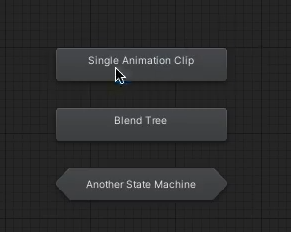 


#### 1.单独的动画片段

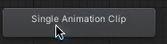 

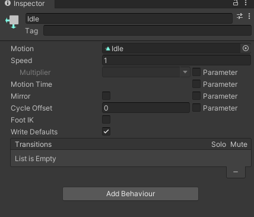 

**Tag:标签**，通过打标签我们可以给动画状态进行分类，以便于我们的管理。

比如说：我们可以给所有的前摇和后摇动画都打上标签【不能动】，然后我们在脚本中判断判断玩家是不是播放打着【不能动】标签的动画，如果是此时玩家的输入就是无效的。


**Motion**：对应的动画片段，如果是混合树的话就是对应的混合树

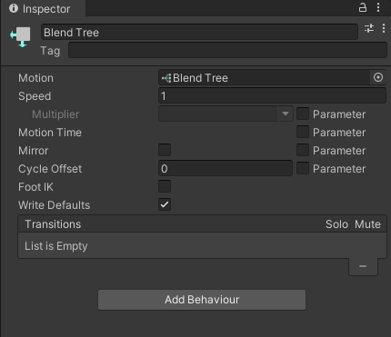 


**speed**：动画的播放速度，1是正常速度，大于1就是加速，小于1大于0就是减速，小于0就是倒放

speed属性是不可以根据脚本更改的，如果我们需要更改游戏中动画播放的速度 就要激活下面这个属性

 

激活这个属性我们要关联一个浮点类型的Parameter，我们在脚本中更改这个Parameter，就可以更改动画播放速度了


**Motion Time**:播放动画片段的一个特定时间点，motiontime的大小为[0,1],0和1分别代表动画片段的开始和结束

它也需要关联一个浮点型变量


**mirror**：镜像动画，它需要绑定一个布尔类型的变量


**Cycle Offset**:刚开始播放动画时做的偏移，这个值为0时不偏移从第1帧开始播放，如果是0.5的话就是偏移一半，从这个动画中间的那帧开始播放。它并没有把动画进行切割，它只是把这个循环动画的起始点修改了而已。


**Foot IK**:他其实是一种使用了IK的动画校正机制.

unity使用了avatar技术来为人形动画提供复用功能，这种技术很好用但是也有一些不足，比如当我们把骨骼系统转换为肌肉系统之后 ，人形角色的双手和双脚的位置会出现一定的偏移，unity为了解决这个问题，提前为我们保存了骨骼系统下手和脚的正常位置，并把这些位置放置在了四个**IK Goal**上

 

手部和脚部的红球就是unity提供的IK Goal,

膝盖和手肘处的红球就是IK Hint,我们可以通过它来防止中间的肘部关节出现奇怪的扭曲。

我们现在可以看到手臂已经出现明显的偏移了。


**Foot IK的作用就是把我们脚部的实际位置向这里的IK Goal的位置拉近一点**

注意：FootIK只是略微的调整脚部的位置，它可以在一定程度上改善脚部动画的不自然，但是不一定能满足高质量的动画需求。

其次我们调整IKGoal的位置并不会更改FootIK的效果，FootIK所参照的其实并不是这个IKGoal的本体，  而是这个IKGoad当前的或者是初始的位置，我们通过代码调整了IKGoal的位置之后，FootIk还是回按照原本的位置来修正自己，而不是参照修改后的ikgoal来修正自己


**Write Defaults,**,写入默认值

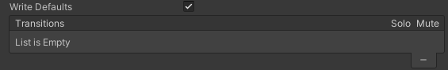 


#### 2.Blend Tree

多个动画片段组成的混合树

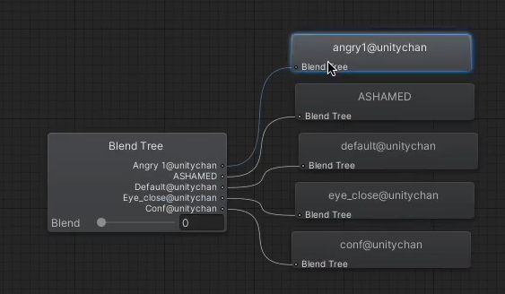 


#### 3.另外一个动画状态机

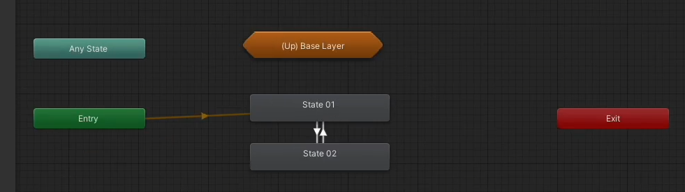 


### 动画状态转换

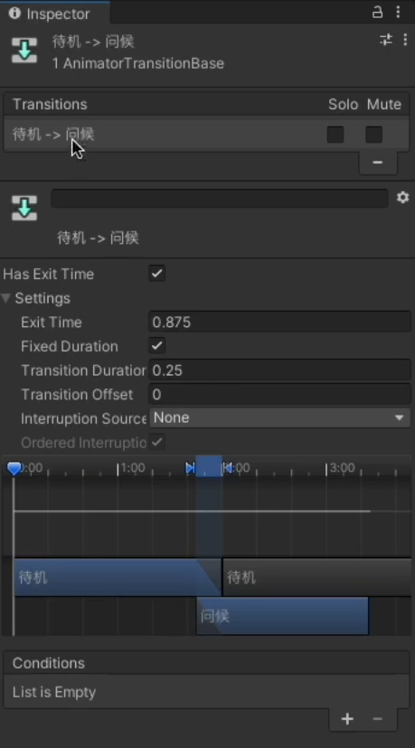 

#### **Transitions:**

勾选了solo的转换优先执行。

在勾选了solo的转换中，哪个转换条件先满足就先执行哪个转换

勾选了mute的转换永远不会被执行


#### **Has Exit Time**

默认勾选，如果勾选的话那么当前动画状态播放到某个时间点的时候就执行这个转换

如果不勾选，那么久必须在后面的conditions这里手动为这个转换添加其他的执行条件，否则的话这个转换久永远也不会被执行了

 

重叠的部分：unity会为我们两个动画转换之间做混合


#### Settings

**Exit Time**:大小[0,1],为0.5的时候就说明冲待机动画的中间那帧开始转换

**fixed duration**:指的时转换的持续时间是按秒计算还是按百分比来计算的，勾选就是按秒

**Transition Duration:**转换的持续时间

**Transition Offset**:进入下一个动画时的偏移量，为0时就说明下一个动画是从第1帧开始播放的

**Interruption source**；表示又那些转换可以打断当前的转换

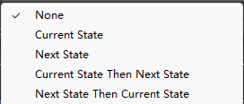 默认是None，也就是不可以被打断

**Current State**：A->B    也就是说A是这个CurrentState的其他转换可以打断当前A->B的转换

但是如果勾选了Ordered Interruption要注意优先级问题,只有优先级比当前转换的优先级高的转换才能打断当前转换

 

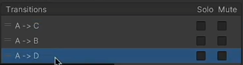 


**Next State**:A->B   ,B的全部转换可以打断当前A->B的转换

**Current state then next state**

**next state then Current state**  同理


#### **Conditions**

动画冲一个状态转换到另外一个状态需要检查两个部分：

1.has exit time

2.Conditions

如果勾选了Has exit time 即使condition满足了，也必须等到当前的动画执行到exit time时才会发生转换

所有当你在项目里发现动画转换并不是立刻发生的，可以检查一下这里的has exit time是不是被勾选了

Conditions使用Parameter的参数作为判断的条件进行转换

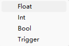 

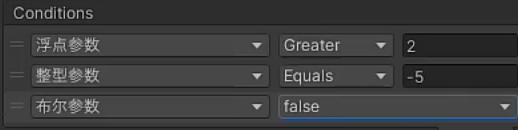 

条件之间是逻辑与的关系


### Animator在脚本中常用方法


#### Play()

可以直接播放动画片段

```
Animator.Play("动画片段名");
```


#### GetCurrentAnimatiorStateInfo()

获取当前状态机播放的动画状态，返回值是AnimatorStateInfo

```
animator.GetCurrentAnimatiorStateInfo(animaotr.GetLayerIndex("Base Layer"))
```

**AnimatorStateInfo.IsTag()**可以判断当前的动画片段是不是带有某个标签


#### Animator.StringToHash

```
public static int StringToHash(string name);
```

Parameters 参数 ： name The string to convert to Id.   **该字符串转换到ID**

Description 描述：Generates an parameter id from a string.  **从字符串生成一个参数ID。**

Ids are used for optimized setters and getters on parameters.**ID是用于参数的存取器优化**（setters 和 getters）。


当使用Animator时，如果要引用某个状态或者参数，有两种方法。
1：通过字符串名称
2：通过整数“Hash ID”
通过“Hash ID”更有优势，因为不容易出错，且更加高效。
两种的使用方式不同。animation状态或者parameters的字符串(Tag)需要通过对象使用；但是“Hash ID”不需要，他是Animator的静态方法。

由于这些参数会经常使用，将它们放在同一个脚本中，统一得到，统一管理，方便使用。
例如：官方案例–Stealth中

```
public class DoneHashIDs : MonoBehaviour
{
    // Here we store the hash tags for various strings used in our animators.
    public int dyingState;
    public int locomotionState;
    public int shoutState;
    public int deadBool;
    public int speedFloat;
    public int sneakingBool;
    public int shoutingBool;
    public int playerInSightBool;
    public int shotFloat;
    public int aimWeightFloat;
    public int angularSpeedFloat;
    public int openBool;


    void Awake ()
    {
        dyingState = Animator.StringToHash("Base Layer.Dying");
        locomotionState = Animator.StringToHash("Base Layer.Locomotion");
        shoutState = Animator.StringToHash("Shouting.Shout");
        deadBool = Animator.StringToHash("Dead");
        speedFloat = Animator.StringToHash("Speed");
        sneakingBool = Animator.StringToHash("Sneaking");
        shoutingBool = Animator.StringToHash("Shouting");
        playerInSightBool = Animator.StringToHash("PlayerInSight");
        shotFloat = Animator.StringToHash("Shot");
        aimWeightFloat = Animator.StringToHash("AimWeight");
        angularSpeedFloat = Animator.StringToHash("AngularSpeed");
        openBool = Animator.StringToHash("Open");
    }
}
```


#### animator.SetXX

比如说：

在Unity中，animator.SetFloat是一个用于控制动画状态机中浮点参数的函数。它可以被用来改变动画状态机中定义的浮点参数的值。这个函数通常用于控制动画的速度、混合权重或其他浮点参数。

该函数的原型为：

```csharp
public void SetFloat(string name, float value);
```

其中，name是要设置的浮点参数的名称，value是要设置的值。

使用animator.SetFloat函数，你可以在脚本中动态地改变动画状态机中的浮点参数，从而控制动画的行为和状态。这使得你能够实现动态的动画逻辑，以响应游戏中的各种事件和条件变化。


## 混合树

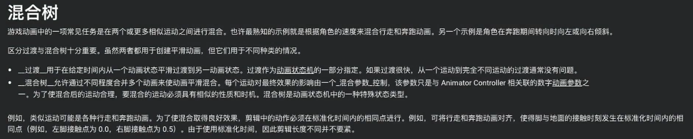

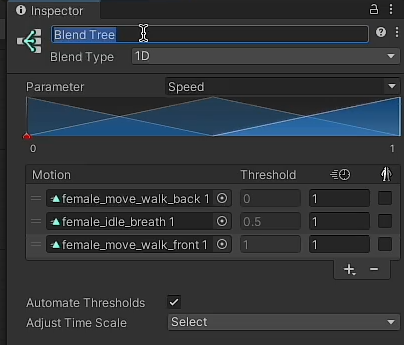 


**BlendType**

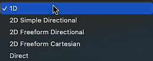 

1D:这种类型的blendtree只由一个参数控制


**Parameter**

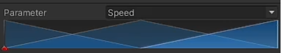 

示意图中横轴是参数speed的值，纵轴是动画片段在blendtree中的权重


**Motion**

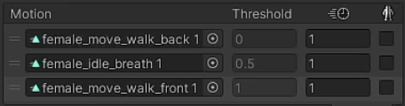 

Threshold是阈值，也就是speed的值为对应的Threshold的值时，该动画的权重为1

右边时钟的符号是动画的播放速度

最右边哪个是选择镜像动画的，仅限avatar的人形动画使用


## RootMotion

**拒绝脚底抹油--滑步**

在游戏开发中，我们常见的动画文件一般分为两种：一种是in place动画也就是不带位移的动画；一种是root motion动画也就是带根位移的动画

这种自带根位移的动画能带来的好处是显而易见的，它有效地避免了角色动画和实际位移不同步的现象。

 

rootmotion 是通过动画文件计算出与游戏对象上一帧的位移，那么我们可以通过OnAnimatorMove中的animatior.DeltaPosition来获取这个位移量


绝对坐标和旋转为相对坐标和旋转


**当然，把角色的移动全部交给root motion 总是让人不放心的，实际应用时，搭建还是通过OnAnimatorMove方法，用脚本来控制角色的移动。**


**Generic动画中的Root Motion机制**


**Humanoid动画中的Root  Motion机制**


avatar把互不兼容的骨骼结构下的根位移，转换成了统一的unity重心位移，这样一来，同一套带有root motion的动画就可以在不同骨骼结构的人形角色上表达位移


### **相关的设置**

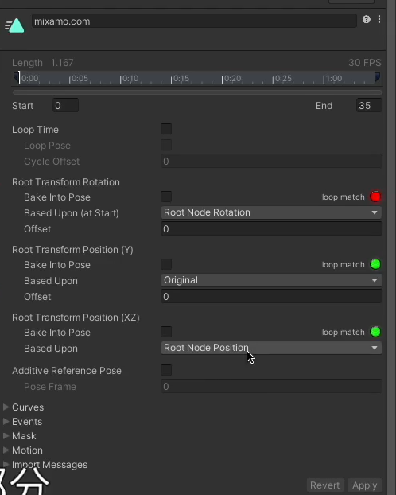 

#### **Root Transform Rotation**

旋转，rootmotion中的旋转特指y轴的旋转

**Bake Into Pose**：把旋转当作动画的一部分，而不是游戏对象移动的一部分，

简而言之：勾选了这个选项表示不要**骨骼节点**的旋转当作root motion的一部分来处理，而是把它当作普通的骨骼动画处理 


root motion 是根据动画片段里面发生的位移,旋转等属性来计算控制物体运动时的属性
但是有些时候,比如我们做前进动画的时候,由于左右肩膀是会跟着晃动的(正常),所以在动画片段里面会产生旋转.而我们只把它当做是前进移动的动画,所以作为控制的时候只需要它的z轴上的位移来计算速度,以符合脚步的频率.
所以,由走路引起的旋转,只是作为走路姿态(bake into pose 其中pose 的意思就是姿态)的一部分,而不应该作为root motion控制移动的计算条件(因为root motion自己是不能判断你拿这个动画是作为前进动画还是旋转动画,所以就只能由你来指定).


**我们什么时候要勾选这个选项呢?**

当我们不希望动画带动游戏对象旋转时我们就要考虑勾选这个选项，毫无疑问，比如说左转的动画是不需要勾选这个选项的，因为我们就指望着它带着我们的角色旋转了

而对于一下在我们看来不会旋转的动画来说，比如说前进、后退、待机那么我们就可以勾选这个选项，以避免因动画文件本身的瑕疵而给我们带来旋转。

右边的标记就代表这个动画在角度上的吻合度，如果这个动画在播放中的转角过大，这里就会提示红色，告诉我们这个动画勾选了bake into pose 则会带来不好的效果。

总结：要不要勾选这个选项取决于我们需不需要动画来驱动游戏对象的旋转，而至于能不能勾选则要参照右边的红色或者绿色标记


**Based upon(start)**:游戏对象在动画开始时对准的方向是哪里

 

**root node rotation**:让游戏对象在动画开始时对准根骨骼节点的指向方向，然而实际上这个root node rotation 是unity根据这个动画片段中root node的姿态算出来的。**一般情况下不准**

想要修正这个方向可以在下面修改offset

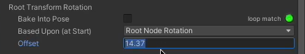 


**original**：表示这个动画原本的朝向，这个朝向是3d美术在制作动画时就已经设置好的了，一般可以相信这个方向


#### **Root Transform Position(Y)**

沿Y轴的位移

**Bake Into Pose**：比如说跳跃动画，不勾选的情况下播放跳跃动画，游戏对象是跟着向上一起跳动的，

勾选之后只有模型外观移动了。

垂直方向没有位移的动画就可以勾选这个选项，跑，走，待机，转身。有位移的话就在这里调整对齐方式和偏移量，比如说跳跃，爬上爬下。

**Based upon(start）**：是垂直方向上把模型的哪一个位置对齐到游戏对象的原点上，默认是original也就是3d美术设置的动画原点

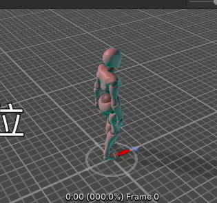 

如果有特殊需要可以旋转root node position   ,可以看到角色下沉了，这是因为角色的根骨骼被对齐到游戏对象的原点位置

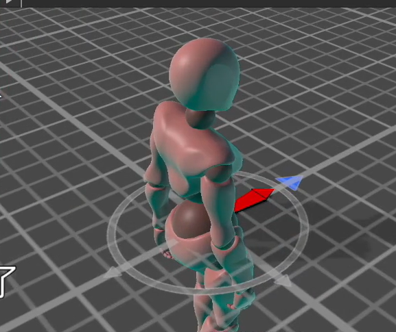 


Humanoid上还多了一个Feet

 

就是模型的脚，或者是是avatar系统下的脚

 


original和feet的区别好像不是很大，我们该选择哪一个呢？

可以相信original的也就是动画美术给我提供的原点，但是仅适用于generic动画，而在humanoid动画中，因为动画的复用会使得动画发生一系列的变形。简单来说动画原本是针对A模型制作的，那么这个original或者说原点就是A模型播放动画时的原点，当我们使用B模型复用这个动画的时候，我们没有办法保证avater转移后的原点还能保证其原来的准确性


#### **RootTransform Position(XZ)**

沿XZ轴的位移，也就是沿水平平面上的位移

如果我们不希望这个动画控制角色在水平方向上的位移，就勾选这里。比如说待机，原地转身动画，原地起跳动画等


#### 总结

unity把root motion分为了三个部分，旋转，垂直方向上的位移，水平平面上的位移，我们可以通过这里的bake into pose 来选择哪些部分会被当作root motion来控制游戏对象，哪些部分仅被当作动画的一部分，不控制游戏对象。


### rootmotion+混合树

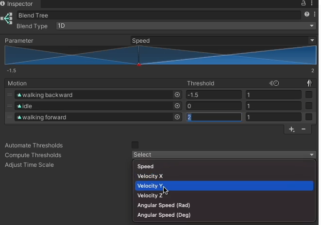 

假设我们使用一个一维变量Speed来控制Blandtree

我们需要设置合适的speedThreshold（阈值）来控制动画的过度，那么我们应该怎么确定这个阈值呢？


**ComputeThresholds**可用通过这个选项来帮我们计算阈值：

- **Velocity X Y Z** 就是三个方向上的位移速度

因为我们使用的动画是待机、前进、后退，所以我们现在只关心Z方向上的位移，所以我们可以选择Velocity Z

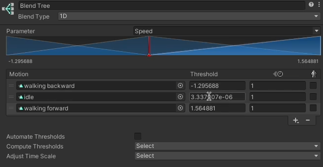 

可以看到这里已经帮我们计算出阈值了，我们已经知道这个阈值其实就是这个动画在z方向上的速度，

也就是说这个前进动画root motion的速度大概是1.565，后退动画就是-1.29，待机就是近似为0

这样一来在代码里只需要将移动速度设置到为上面那几个阈值，那么**理论上**rootmotion就会以相应的速度带着我们的角色前进或者后退

- **speed** 是root motion 的移动速度或者说它的速度绝对值，也就相当于下面这给三维向量velocity的长度
- 下面两个Angular speed是rootmiton的旋转速度，如果你的角色需要用到rootmotion转身的话会用到它们
- Angular Speed(rad)   弧度每秒
- Angular Speed(Deg)  角度每秒


**Adjust Time Scale**:自动帮我们计算动画的速度，使得各个位移动画的产生的位移速度一致

避免手动计算


**现在你发现了一个问题：就是角色现在的移动速度不是我们决定的，而是root motion决定的**

如果我希望前进速度是2，后退速度是1，那我该怎么做呢？

聪明的你可能会想到改变动画的播放速度来实现。

但是问题原因不止如此，当你的speed设置为1.5时，真正的移动速度也极有可能不受1.5

因为humanoid动画是不同的任务骨骼上复用动画的一种机制，同样的行走动画在小一点的角色身上自然是要走的慢一点，在大一点的角色身上就会走得快一点


下图它们挂载相同的脚本和动画控制器，可以看到它们的行走速度不一致

  

通过animator.velocity可以访问到rootmoiton移动速度向量，然后再取模就可以得到它的移动速度绝对值：**animator.velocity.z.magnitude**

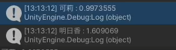 

可以看到可莉的速度明显小于明日香，而且明日香的速度也不是1.5，原因是1.5的这个速度是针对这个行走动画原本的骨骼的

而可莉和明日香都是通过avatar系统复用了这个动画，所以移动速度自然会改变。


**这样一来问题就严重了，不能控制角色的移动速度就算了，不同模型的移动速度还不一样，那我们应该怎么解决这个问题呢？**


**1.我们先来解决不同人物移动速度不同的情况。**

最稳妥的方式就是为不同的人物制作属于自己的状态机，然后针对性的设置动画的状态。

但是我们就算要使用同一个状态机，那怎么办呢？

root motion会考虑物体的缩放值scale，scale越小，rootmotion的位移就会越小。从理论上来说，可莉和明日香的速度不同 也是由于两者的大小不同或者是缩放值不同而导致的，但是从transform上看它们都是1，那么它们之间的缩放值差异或者说大小差异到底在哪里呢？

**animator下有一个humanscale属性**，这里记录了Avatar在制作骨骼映射时，对人体或者说对骨骼的缩放。我们输出一下这个值

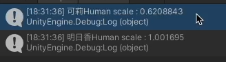 

可以看到，可莉的身体大小实际上是unity标准模型的0.62倍，明日香就算1.001倍，就算这样的差异导致了两者rootmotion速度的不同。

也就是说在可莉身上root motion的速度只有原来的62%，而在明日香身上这个数值则是100.1%

为了解决这个问题，我们只需要把它们的动画播放速度，除以相应的值就可以了

在start中：animator.speed/=animator.humanScale

 

可以看到在修正动画的播放速度之后，两人的移动速度已经一致了。


但是我们不希望整个animator的播放速度都受到影响，那么我们可以在动画只进入这个blendtree之后才改变speed

怎么做呢?

我们只需要将这个值传给Muliplier，因为Speed在游戏过程中是不能直接修改的.

给他关联一个ScaleFactor变量，

在start中animator.SetFloat("ScaleFactor",1/animator.humanScale);就可以了

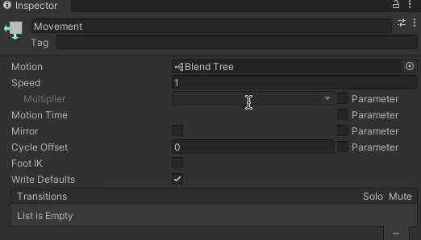 

这样只有这个blend tree播放的速度受到影响，其他的则正常播放。


**2.现在我们来解决不能控制角色的移动速度的问题**

直接最简单暴力的方法就算来修改这里的动画播放速度

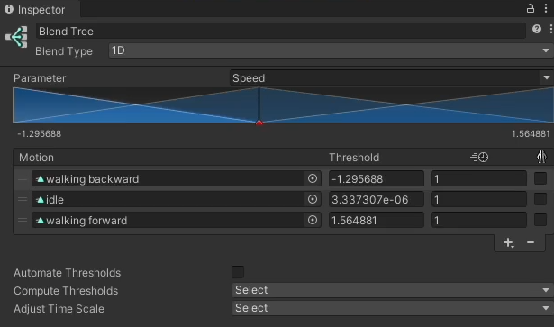 

此时上面的阈值其实是unity帮我们计算出来动画的移动速度，那么现在动画为1.2我们想要它变为1.5，现在就要调整动画播放速度，怎么调整呢？

用 比例来算：1.2/1 = 1.5/x      x=1.5/1.2

1.5/1.2 = 1.25 也就是动画播放速度调整到1.25倍即可。此时阈值就可以改为1.5了。

我们希望前进速度为1.5，就将动画的播放速度设置为1.5/1.565，阈值就可以设置为1.5了

后退的速度也为1.5的话，就将动画的播放速度设置为1.5/1.29，阈值就可以设置为1.5了

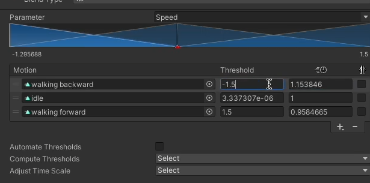 

rootmotion的移动速度并不稳定，我们在上面看到的移动速度阈值其实是平均值 


此时我们也应该回过头来看当初自己为什么要引入rootmotion，

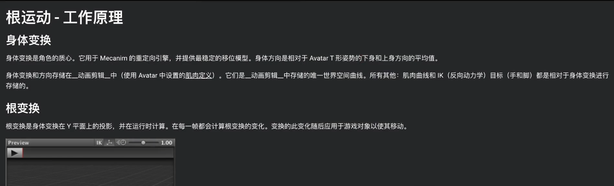

答案是：避免实际位移和动画表现的位移不同步，也就是说这个rootmotion原本要解决的问题就是同步而不是位移


```
using System;
using System.Collections;
using System.Collections.Generic;
using UnityEngine;

public class PlayeMoveTest : MonoBehaviour
{
    private Animator _animator;
    public float forwardSpeed = 1.5f;
    public float backSpeed = 1.5f;
    public float targetSpeed;
    public float currentSpeed;
    private Rigidbody rig;

    private void Start()
    {
        _animator = GetComponent<Animator>();
        rig = GetComponent<Rigidbody>();
    }
    private void Update()
    {
        playmove();
    }

    private void playmove()
    {
        Vector2 movement = InputManager.Instance.Movement;
        targetSpeed = movement.y > 0 ? forwardSpeed * movement.y : backSpeed * movement.y;
    }

    private void OnAnimatorMove()
    {
        Move();
    }

    private void Move()
    {
        currentSpeed = Mathf.Lerp(targetSpeed, currentSpeed, 0.5f);
        _animator.SetFloat("Speed", currentSpeed);
        rig.velocity = _animator.velocity;
    }
}
```

主要看这个脚本，当我们在脚本中声明了OnAnimatorMove()函数的时候，unity就不再直接用rootmotion来驱动游戏对象。

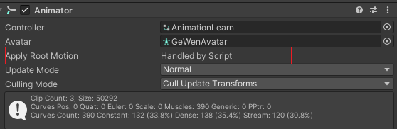 

上面的脚本是使用animator从rootmotion动画中提取值，然后把值赋给受物理引擎影响的rigidbody，所以要在animator这里把

既然要操作rigidbody为什么不把move方法放在于物理引擎同步的fixed update里面呢？

因为我们update mode从normal 转换成animate physice之后 OnAnimatorMove方法也已经与物理引擎同步了，它的具体调用时机在fixed update和动画系统的各回调方法之后，在物理引擎之前

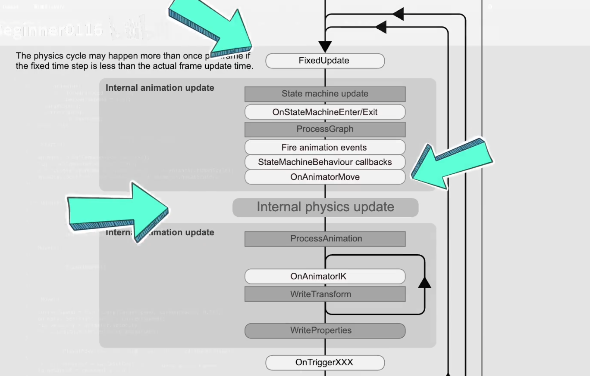


### Root Motion与Rigid Body的冲突

注意要animationclip动画在Y方向上的位移bake in pose

```
    private void Move()
    {
        currentSpeed = Mathf.Lerp(targetSpeed, currentSpeed, 0.5f);
        _animator.SetFloat("Speed", currentSpeed);
        rig.velocity = _animator.velocity;
    }
```

我们在OnAnimationMove方法里设置了rigid body的速度，接下来unity的物理引擎开始工作，根据默认的加速度9.8给rigid body施加了一个速度  

在默认情况下，物理引擎的刷新率是每秒50次也就是每0.02秒刷新一次，0.02秒在加速度为9.8的情况下rigid body在这里会获得一个大约每秒0.196米的向下的速度。然后rigidbody也会根据当前的速度对游戏对象 也就是我们的角色进行位移，然后物理引擎刷新我们回到OnAnimatorMove方法，我们在次回到了rigidbody的速度，我们在此时就把垂直方向向下的0.196的速度给归零了，在来到物理引擎工作的位置，根据加速度获得了一个方向向下的0.196米每秒的速度。

如果我们没有在OnAnimator把它归零的话，那么此时rigidbody的速度应该已经是0.392米每秒了。

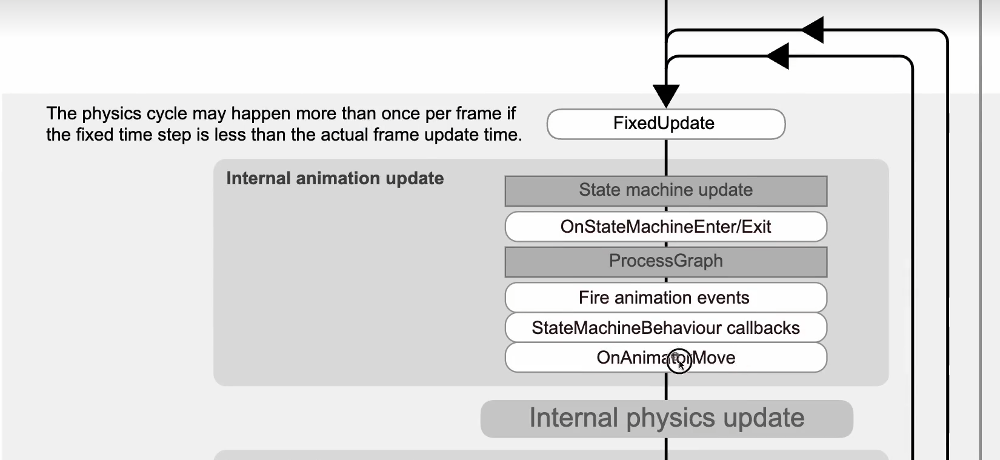

下降速度较慢的原因是我们在OnAnimatorMove中打断了重力加速度的过程，所以游戏对象的下落速度永远的被限制在0.196米每秒


如果我们的rigidbody会受到来自水平方向的力的时候，类似的问题会再次发生。

如果我希望用rootmotion影响游戏对象的垂直运动的话，那么又该怎么办。

到这里就应该由我们自己权衡利弊了。

你对物理模拟的要求有多高，如果要求不高，或者仅仅需要一个重力，那么我是否可以自己编写脚本来模拟重力，而不是直接使用rigdbody

你对移动的精度要求又有多高？如果要求不高我们是否可以不适用rootmotion，或者说在某些情况下不适用rootmotion

如果你对两者都有较高的要求的话，你是否有能力解决各种复杂的情况。

当你要把rootmotion和rigidbody配合在一起工作时，记得该bake into pose的地方一定要bake，其次最好把刷新方式调整到animate physice

最后不要再update方法力控制rigidbody，要放到fixupdate里面或者onanimatormvoe（animate physice）里面


## AnimationLayer和AvatarMask

在游戏制作中，有一种需求十分常见就是将两个或者多个动画组合在一起。

比如说玩家角色持枪移动动画

 

但是我们只有玩家持枪站立动画以及空手行走动画，那么我们必须要将两个动画缝合使用

 

针对这种动画缝合的需求，在unity中最方便的解决方案就是使用动画层级animationlayer和替身蒙板avatarmask

 

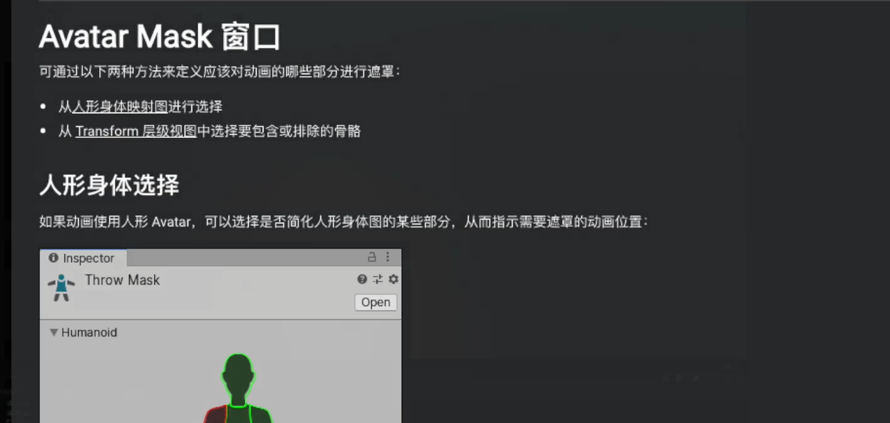 


动画状态机里面可以看到，我们新建了一个layer专门来处理角色双臂的动画

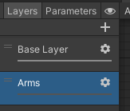 

点击这个齿轮，我们可以看到设置界面

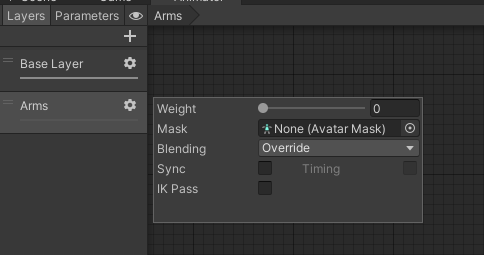 

**weight**：权重，表示当前这个layer中的动画会在多大程度影响整个动画的最终表现，0就是完全不起作用，1为完全播放。


**mask**：替身蒙板，这个蒙版表示了角色身体的哪些部分会播放我们选择的动画，放在这里就是指当前层级播放的动画会影响身体的哪些部分

我们在项目资源里可以创建一个avatar mask资源文件

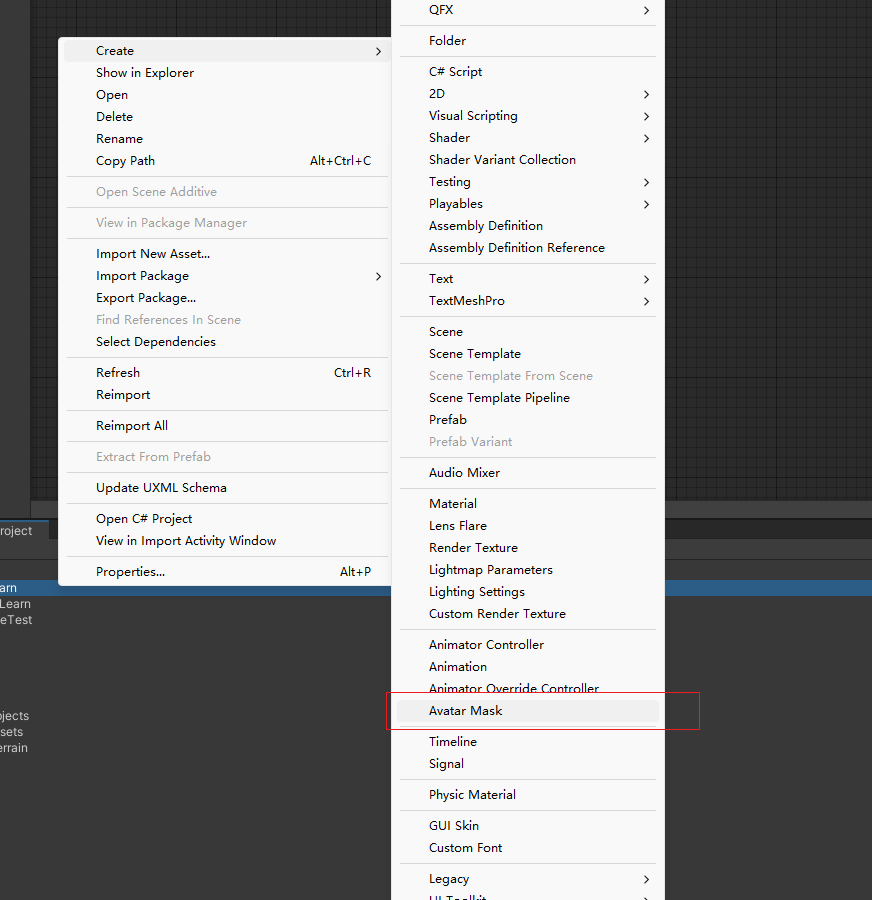 

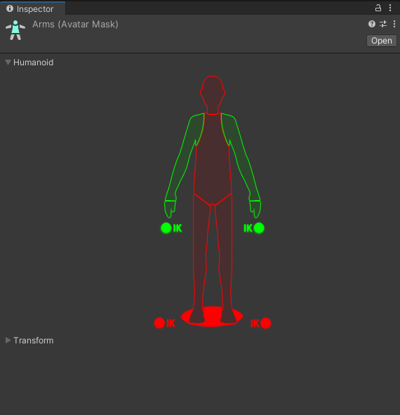 

因为我们使用了humanoid动画那么我们就配置这里的Humanoid，点击这些身体部位，绿色代表会播放动画，红色代表不会播放动画

我们要播放的手部动画，所以选择两个胳膊和手，以及两个ik

这两个ik指的是unity提供的两个avatar IK Goal

如果我们当前播放的不受humanoid动画则可以展开下面的transform来选择哪些骨骼节点受影响

我们将新创建的avatarmask应用到我们的arms层级

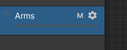 

可以看到这里有一个M标记，它表示动画层级使用了avatar mask，从力量上来说该层动画只会影响我们角色身体的一部分


**Blending**

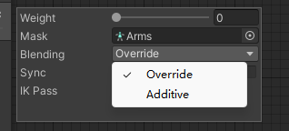 

Blending 项的两个值，Overide 和 Additive 决定了这一层的动画如何与上层动画进行混合

**Overide** 表示完全覆盖上层的动画，仅播放本层的动画，如果 Avatar Mask 设置了全身骨骼，所有的骨骼动画都会覆盖上层动画，如果只有部分的骨骼，则仅覆盖设置的骨骼进行动画。并且，在列表中的动画层越往下的优先级越高，如果有多个动画层并且权重都是1，仅会播放最下层的动画。

**additive**:表示加在上层动画，两层动画会进行混合运算并播放，也就是说这一层的动画并不会取代现有的动画。

根据我们的需求:双手持枪我们应该选择第一项override


**Sync**：同步，勾选之后可以选择当前层级要和哪个层级保持一致

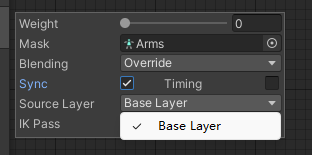 

**Timing**:跟sync一块的，下面再解释


**IK Pass**:如果我们要在当前层级使用ik的话，就需要勾选。


我们当前的设置

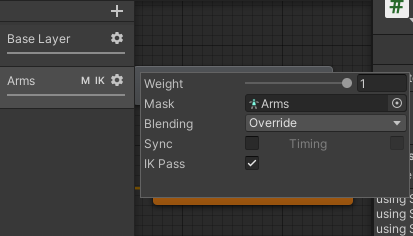 


然后我们使用一个持枪动画

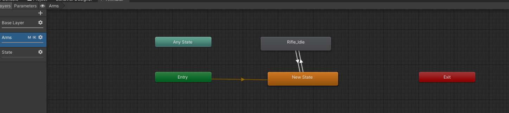

设置动画转换条件

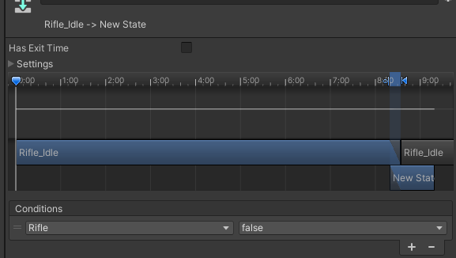 

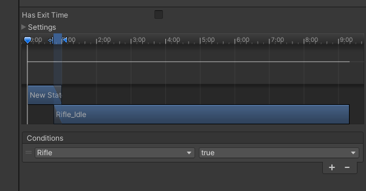 

在脚本中设置相关的拿枪bool值rifle

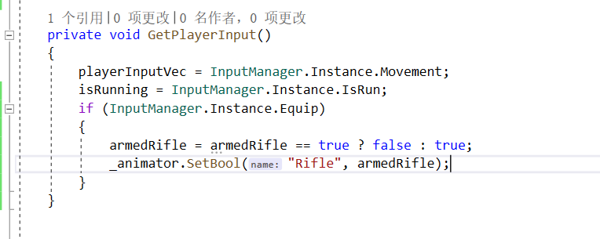 

​	

idle下可以看到持枪的动画

 


可以看到walk状态下的手部动画已经是我们的持枪动画

  


拿枪，拿刀，拿手枪都再Arms这一层级做转换，也是相同的操作

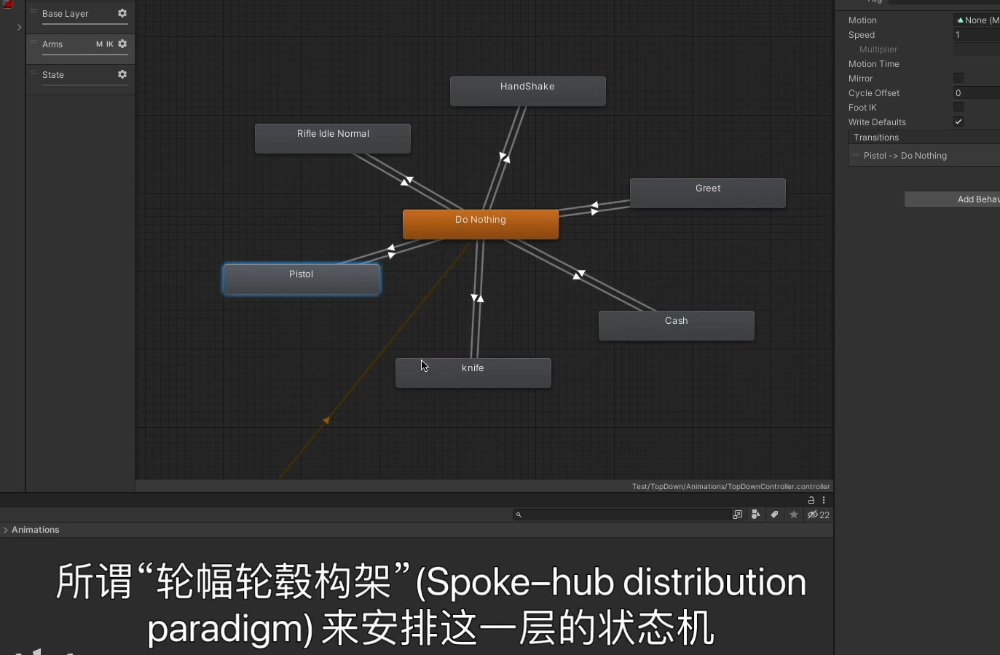 


### **Blending-additive**

我们再看回到Blending

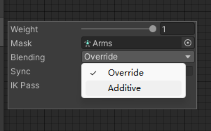 

additvie：就是把当前层级的动画和上面层级的动画混合起来，也就是说这一层的动画并不会取代现有的动画。

当我们要为当前的角色动画添加某种特色的时候，而又不希望取代现有动画的时候，可以考虑使用additive

**最常见的例子就是为角色添加“疲劳感”**

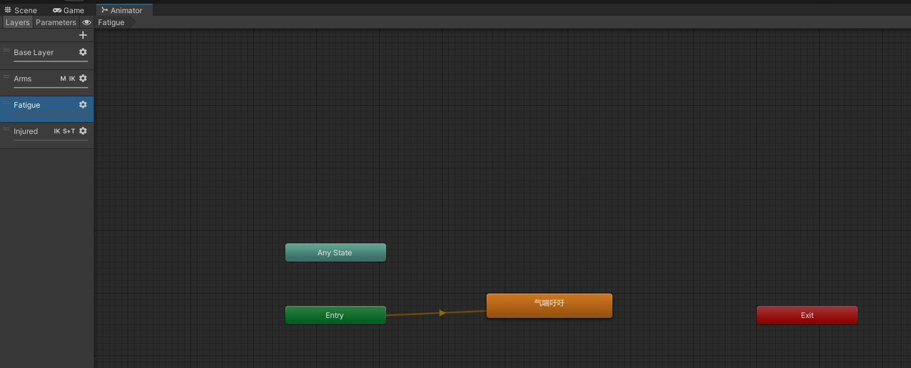

我们可以调整Fatigue层级的Weight来实现这个功能，直接使用weight来播放喘气动画还有一个好处，那就是weight值可以直接反映处喘气的幅度，也就表达了角色疲劳的程度。

我们新建一个avatarmask，我们希望只影响躯干部分

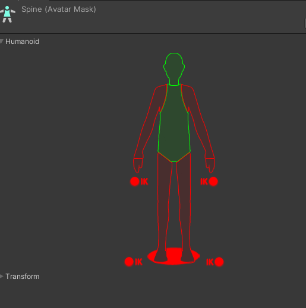 

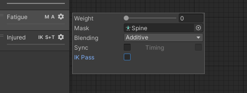 


```
animator.SetLayerWeight(layerIndex,百分比0-1);
```

```
int layerIndex = animator.GetLayerIndex("LayerName");
```

```c#
    void CaculateFatigue()
    {
        if(currentSpeed < 1f && currentFatigue > 0)
        {
            currentFatigue -= Time.deltaTime;
        }
        else if(currentSpeed > 2f && currentFatigue < 10f)
        {
            currentFatigue += Time.deltaTime;
        }
        else
        {
            return;
        }
        currentFatigue = Mathf.Clamp(currentFatigue, minFatigue, maxFatigue);
        _animator.SetLayerWeight(fatigueLayerIndex, currentFatigue / maxFatigue);

    }
```


可以参考：

[游戏角色的疲劳感是如何制作的？利用Animation Layers中的additive模式把多个动画混合在一起【Unity动画系统详解 二十四】_手机游戏热门视频 (bilibili.com)](https://www.bilibili.com/video/BV1J44y137JC/?p=36&spm_id_from=pageDriver)


### **Sync和Timing**

玩家角色在游戏过程中总是会受到各种各样的伤害，那么很多游戏就会用角色外观来直接表达玩家当前受到伤害的程度

 其中最广为玩家接收的表现方式就是爆乳，就是用一整套不同的受伤动画代替原有的动画

 

既然要代替一整套动画，那么在一个新的layer里复制一整套原有层级的状态机就是一个非常好的解决方案

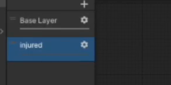 

但是这样有一个问题，就是随着开发的进行，原本的层级可能会发送变化，那么此时就需要修改对应injured layer中的内容

如果变化过于频繁的话，及有可能给开发者带来混乱。

所以unity在这里给我们提供了一个同步功能，在这里我只需要选择Injured和哪一个层级同步就可以了

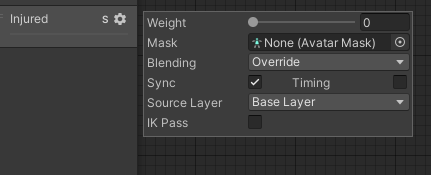 

那么在开发的过程中，无论被指定的这一层级结构如何改变 injuredlayer都始终会和他保持一致

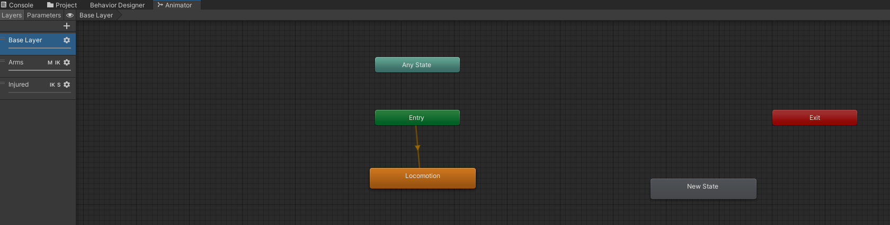

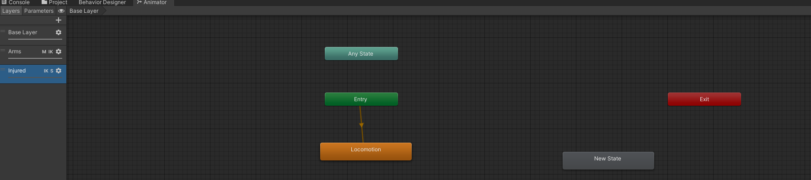

上面就是injured和Base层级保存同步的效果。

**注意：层级的同步仅仅是同步动画状态和动画状态间的转换关系，并不会转换blendtree的内容，所以在injured里的Locomotion状态是空的，我们需要新建里面的blendtree**

在injureLayer中的blendtree 这里我们使用三个受伤动画，然后调整速度

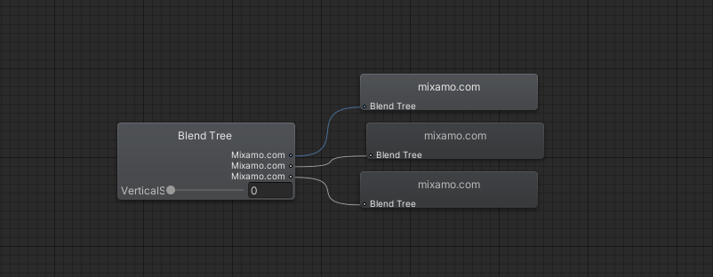 

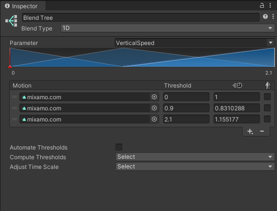 


有一个问题：

使用了同步的不同层级，在同一个动画状态中所使用的动画片段长度可能不一样，

比如说，我们在base层级有一个3秒长度的动画片段，播放完后转换

在else层级有一个1.6秒的动画片段播放完后转换，那么1.6秒之后会发送动画切换吗？如果发生了转换不就和base层级不同步了嘛？

**在默认情况下synclayer中的动画状态的时长会被缩放至它所需要同步的层级中对应动画状态的时长，也就是在这个例子里面else层级中的动画片段会被拉长到3秒**

如果我希望由else层级来决定动画状态的时长呢？

**timing**来解决这个问题

注意：只有blending状态为overrid的时候timing才能选择

一旦勾选了timing，动画状态的播放时长就由它和它同步的层级共同决定了，那么哪个层级的决定权更大一些呢？

else当权重为1时听else这一层的，当权重为0时听被同步那层的，当else的权重为0.5的时候，两个动画片段的长度就会被缩放为（else动画+base动画）*0.5

**同步层级的动画状态长度必须一致，具体长度由谁决定则看这里的timing和weight的设置**


### 动画层级的次序问题

在动画层级中位于下面的层级拥有更高的优先级

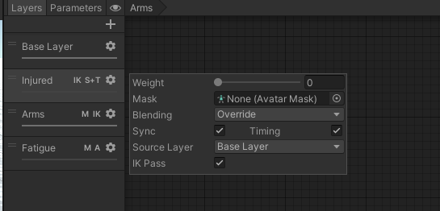 

我们来翻译一些Injured这一层：injured这一层有第三的播放优先级，他会代替比它更低优先级的其他所有动画，如果权重为1那么代替的程度就是百分百，代替的部位就是全身（因为mask为空）

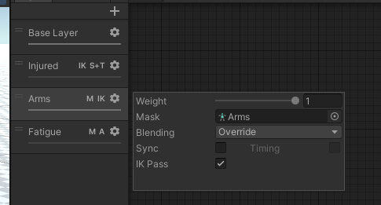 

arms层级：持枪层级比base和injured的优先级都要高，混合模式是override,持枪动画会代替掉base layer和injured layer，权重为1时，代替程度为百分百，代替部位是双臂。

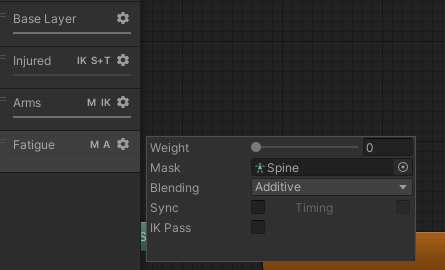 

fatigue拥有最高的优先级，但是它的混合模式是additive，这个优先级不代表他会代替哪些层级，因为他是additive。

additive的具体行为是把当前层级所播放的动画加到之前层级的结果上去，当前的avatarmask表示它只影响躯干的部位。

weight表示它会把本身动画以多少比例添加到之前的结果上去，0表示完全不添加，1表示完全添加。

比如喘气的时候弯腰的最大幅度是60度，那么权重为1时，在原有的动画基础伤再弯腰60°，0.5表示添加一半。


**在后面的开发中，如果你的动画状态机无法正确的播放动画，你不妨检查一下层级的排序以及混合模式的使用方式。**

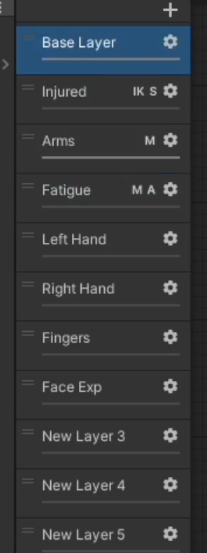 

只要你的动画层级设置合理，那么久可以使用一系列简单的动画制作处精彩的动画系统。


## IK


### 概要


**Forward Kinematics**

我们常见的，由美术制作或者由动作捕捉出来的固定动画，一般由骨骼的根节点，对于人形角色来说就是屁股，到末梢骨骼节点依次计算其旋转位移和缩放来决定每一块骨骼的最终位置，这种就称为正向动力学。

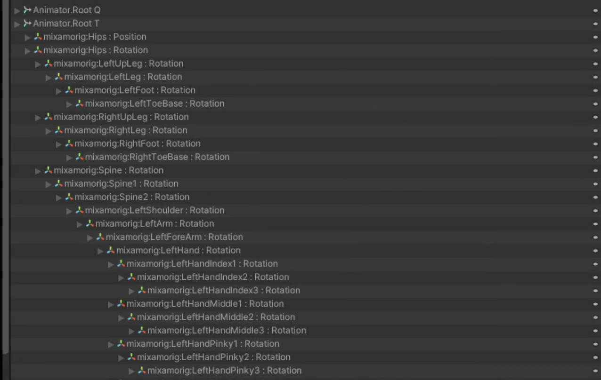 

打开动画文件我们就可以看到，各个骨骼选择的顺序是从根骨骼hips开始的，以末梢骨骼为结尾。这也就接收了为什么在使用了Huamanoid动画之后，四肢末梢位置的动作偏移量较大，那是因为动画从generic变成humanoid时，在每个骨骼位置都有可能产生误差，在正向动力学中上一节骨骼选择误差会累积到下一层。这就导致了末梢位置的误差是最大的。


**Inverse kinematics**

反向动力学，他要解决的问题是如何根据现有的机械关节，把机械臂的末端放到制定的位置上去。

我们在游戏中使用的ik大多比较简单，也就是转转脑袋伸伸胳膊，所以一般采用所谓的CCD（cyclic coordinate descent）来计算各个骨骼节点的转角。它的做法是从参与ik计算的最后一根骨骼开始，到参与ik计算的根骨骼为止，依次进行旋转，每次旋转的任务是让末端尽量靠近ik目标。

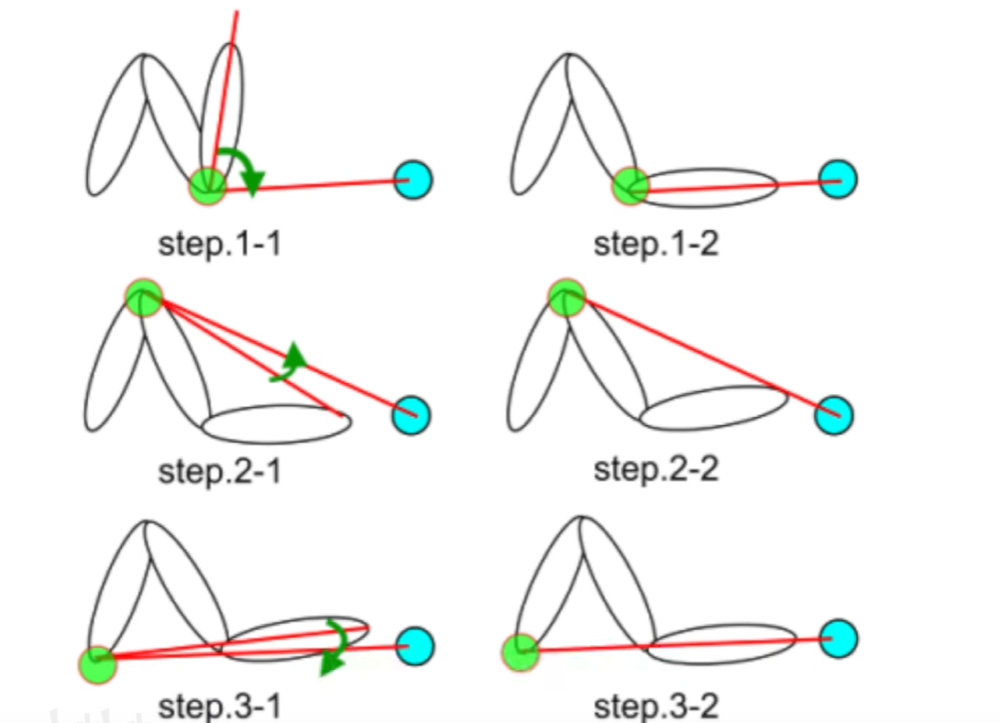 

因为各个骨骼的旋转方式由末端的位置并从后往前决定，所以被成为反向动力学。

参考：[Unite Berlin 2018 - An Introduction to CCD IK and How to use it (youtube.com)](https://www.youtube.com/watch?v=MA1nT9RAF3k)


比如：

但是在很多时候，我们需要反过来计算，比如我们希望手和脚放在一个特定的位置下。

举个例子就是在爬山的时候，我们需要手和脚接触在岩壁上，此时我们没有现成的动画片段来调用，我们只能先确定手和脚的位置，在通过手和脚的这个位置反向计算它们的各个父节点的旋转位移和缩放了这种就叫反向动力学

 

为了使用IK，我们必须在使用IK的层级这里激活IK pass

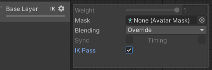 

这样我们就可以在脚本力调用相关的IK方法了

**与IK相关的回调方法OnAnimatorIK()**


### 使用IK Goal给角色加把枪

 

给模型新建一个握把的空物体，将其放到枪支的握把靠近扳机的位置上

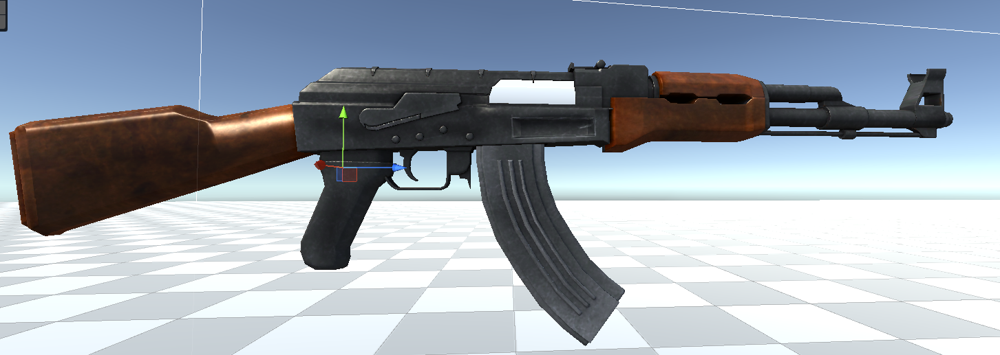 

注意：把scene视图下方那个center改成pivot就行了，这样才可以看到父物体的坐标和子物体的坐标，否则就是看到它们的中间坐标

这样我们只需要正确的把这个handle放到玩家的的右手上，这样就等于枪被正确的放置到右手的位置上。

接下来就是在人物模型下寻找右手骨骼，但是一个一个找十分地麻烦，后面我们会使用untiy给我提供的animation rigging来快速定位骨骼位置

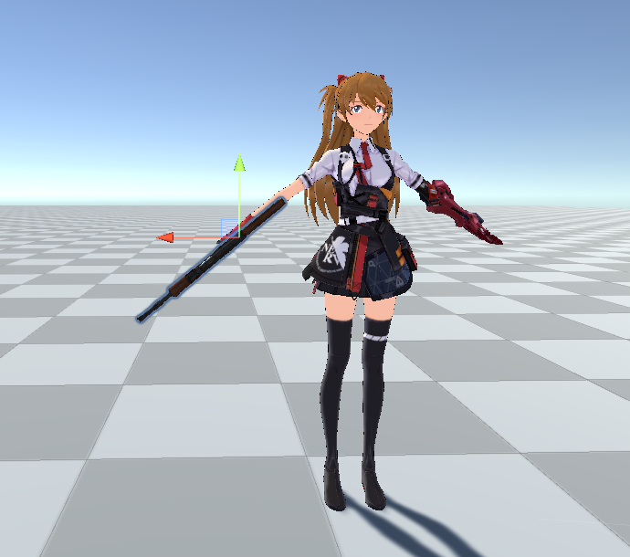 


如果我们要为手和脚进行ik操作的话，直接使用unity为我们提供的ik goal就可以了

只要在脚本中设置好相关的权重，untiy就会尽量把手和脚放到对应的ik goal上。

我们在脚本中使用**OnAnimatorIK**方法，**把双手的两个ik goal位置和角度权重都设置为1**

```
    private void OnAnimatorIK(int layerIndex)
    {
        _animator.SetIKPositionWeight(AvatarIKGoal.LeftHand, 1f);
        _animator.SetIKPositionWeight(AvatarIKGoal.RightHand, 1f);
        _animator.SetIKRotationWeight(AvatarIKGoal.LeftHand, 1f);
        _animator.SetIKRotationWeight(AvatarIKGoal.RightHand, 1f);
    }
```

**注意：在状态机中至少要有一个层级打开ik pass，否则这个OnAnimatorIK方法是不会被系统调用的**

如果确定哪一个层级打开了ikpass可以使用这里的layerIndex参数


效果不是很好，做手的位置和右手的位置都不受很好

​	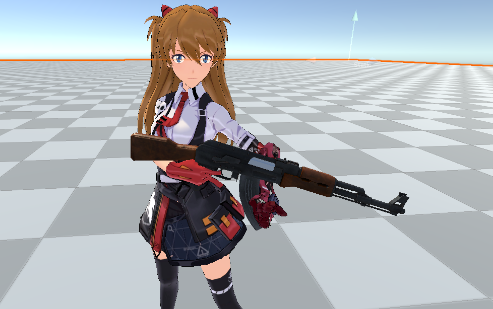


右手的最终的位置最好以胸口为参照物，我们在胸部骨骼位置放一个RightHandposition空物体

 

我们让右手的ik goal的位置和这个RightHandPosition保存一致

同样的在ak护木上也添加一个lefthandposition

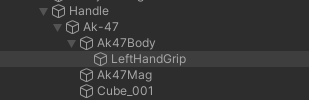 

然后在脚本中，让左右手靠近这两个我们自定义的ik位置

    private void OnAnimatorIK(int layerIndex)
    {
        _animator.SetIKPosition(AvatarIKGoal.RightHand, RightHandPosition.position);
        _animator.SetIKRotation(AvatarIKGoal.RightHand, RightHandPosition.rotation);
        _animator.SetIKPosition(AvatarIKGoal.LeftHand, LeftHandGrip.position);
        _animator.SetIKRotation(AvatarIKGoal.LeftHand, LeftHandGrip.rotation);
        
        _animator.SetIKPositionWeight(AvatarIKGoal.LeftHand, 1f);
        _animator.SetIKPositionWeight(AvatarIKGoal.RightHand, 1f);
        _animator.SetIKRotationWeight(AvatarIKGoal.LeftHand, 1f);
        _animator.SetIKRotationWeight(AvatarIKGoal.RightHand, 1f);
    }

 

需要调整RightHandposition和lefthandposition，调整到我们满意为止

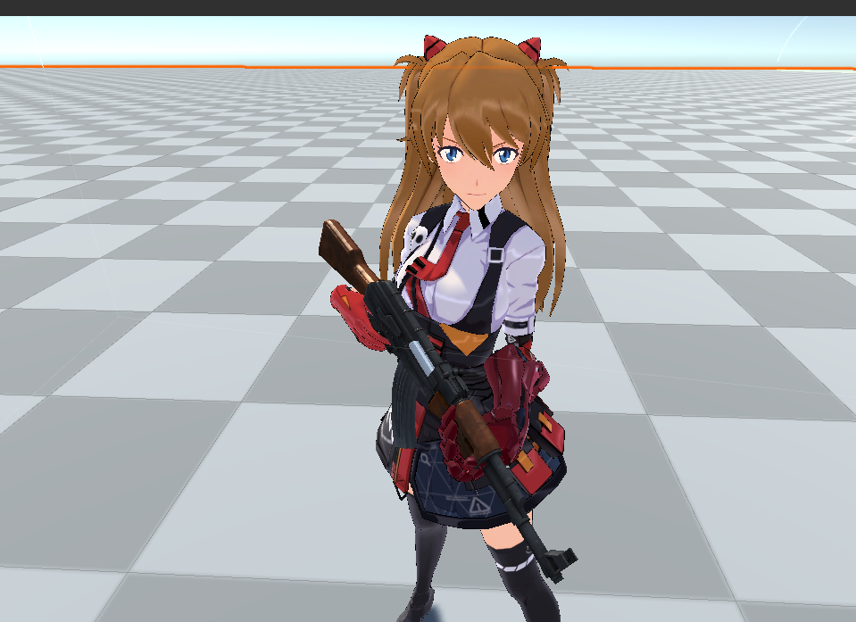 

**这里只是为了学习ik的用法，而不是调整枪支动画，在真实的开发环境下，对于动画的最好调整方式永远是回到3d建模软件中去调整动画文件本身。**


如果你对ik操作仅仅是限于双手和双脚的话，unity提供ik goal既可以满足你绝大部分需求了，但是你想让角色表现更加生动一些，那就需要它的各个部位都可以根据实际需求做ik运动，比如头部要跟随目标旋转，躯干要根据运动状态进行倾斜，再比如更进一步的程序化动画等等。这些功能用ik goal就没办法办到了。而且自己编写相关算法的话，不但难度高而且工作量大，所以**便于开发，unity为我们提供了animation rigging**


## animation Rigging

unity推出animationrigging的目标是简化整个优先动画的制作流程

**作用是可以帮助我们快速定位骨骼**


### rig和骨骼是一回事吗？

 

比如说这个提线木偶的表演，人偶是骨骼，提线工具的rig

那么在角色动画这里，rig就是我们控制骨骼的工具

**需要导入Animation Rigging这个插件**

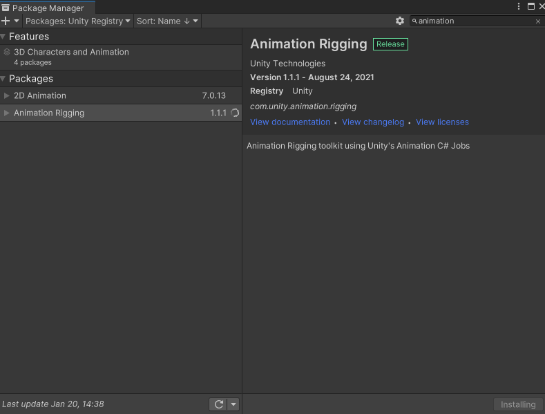 

我们先使用它的骨骼绘制功能

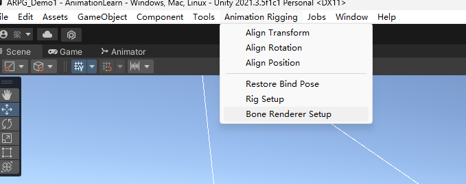 

选择我们的人物模型，然后选择bone renderer setup,或者也可以di点击animatior组件进行选择

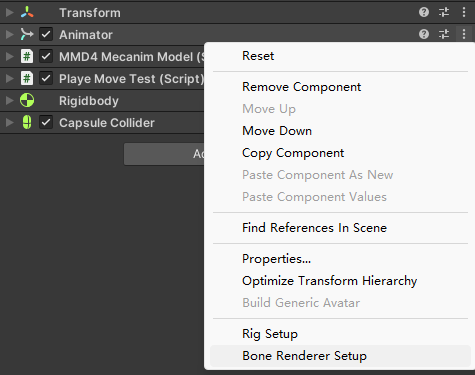 

现在可以看到角色的骨骼被绘制出来了，而且我们也可以在场景中通过点击直接选择骨骼了

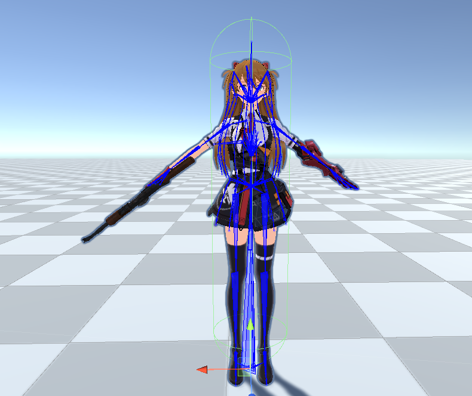 

通过这里的bone renderer脚本你可以控制绘制骨骼的方法

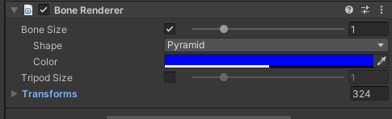 


### animation rigging的系统结构

现在我们通过木偶为参照来了解animationrigging的系统结构

控制目标的工具有很多种类：

提线

 

铁枝

 


体现还分为4根的2根的，不同的控制工具就是对木偶关键的不同约束，表演之利用这些约束来表现木偶的不同动作。

所以animation rigging也为我们提供了很多种约束，我们通过这些约束来控制骨骼的行为。

 比如说我们接下来要制作的持枪ik动画，在这里就要使用Two Bone IK约束。

这个two bone ik 约束对应到木偶的控制工具的话，那就相当于中国传统木偶戏种的“铁枝”

我们和木偶戏表演者一样，通过自己手中的rig来让骨骼的末梢节点抵达指定位置。其次一个木偶先要活灵活现的表达各种肢体动作，只有一个rig是不够的。

比如木偶的头部行为和双手行为很明显是不一样的，不可能使用同一组铁枝或者说提线来控制头部和双手 。

对应的animationrigging允许我们在一个角色上添加多个rig，这样我们就可以为双手设置一个rig，在为头部设置一个rig。

最后，木头有了一堆的控制工具之后，就需要有一个管理者来管理它们，在animation rigging这里我们使用rig builder 来管理同一个模型下的所有rig。


### 实际操纵

#### **1.rig builder**

**给我们的模型添加一个rig builder组件，它会和animator组件一起来管理这个角色上所有rig**

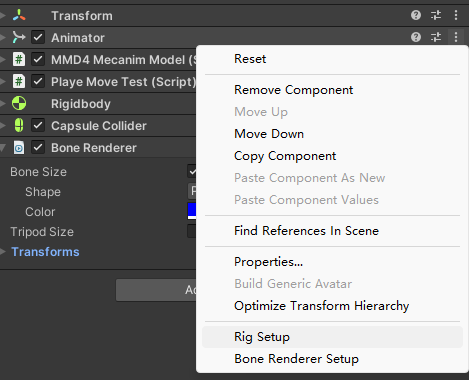 

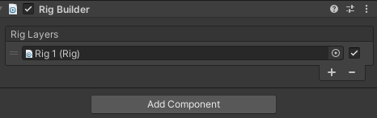 


#### **2.添加rig**

unity自作主张帮我们添加了一个。

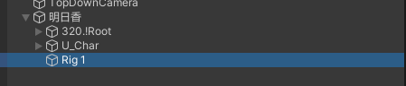 


下面我们删除，自己来添加：

首先添加一个空物体，取名Tow Hand Rig 用于控制我们的双手动作

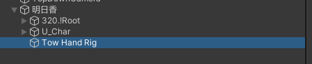 

然后给他添加一个rig组件

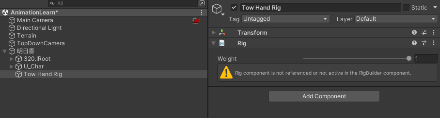 

然后将其拖进rig builder的rig layers中，这样这个rig就被rigbuilder管理起来了。

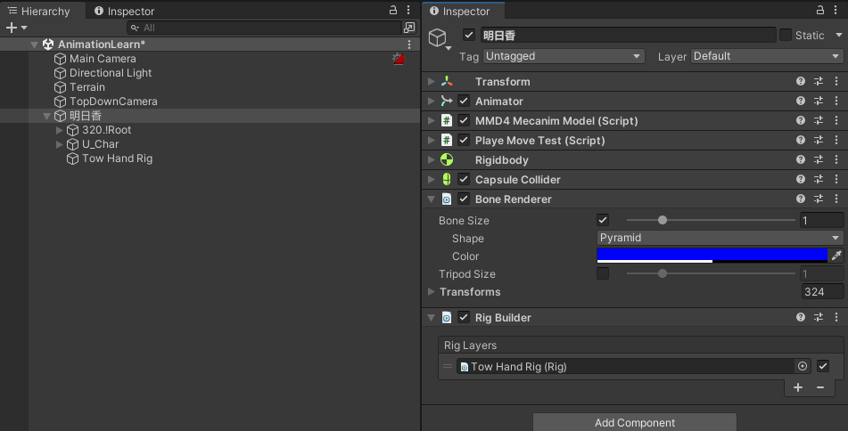 


#### **3.给rig指定约束**

也就是指定行为模式，在Rig物体下添加俩个空物体明天给他们添加Two Bone IK Constraint组件

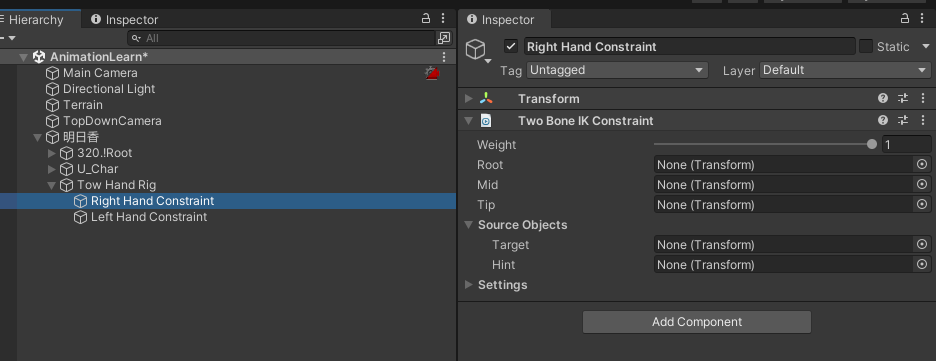 

通过自己手上的rig来让骨骼的末梢节点到制定的位置


#### **4.接下来我们用animation rigging来重新制作一下上面持枪ik动画**

首先删除脚本中和ik有关的代码，去掉animation layer中所有的ik pass，在animation rigging中我们用不上它们

删掉上一个视频里面我设置的ik target 

然后配置一下者两个constraint

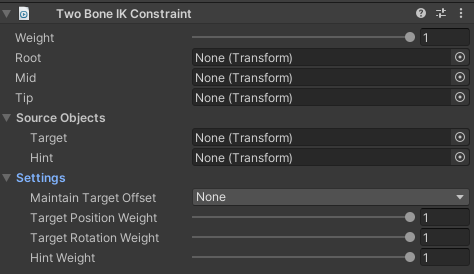 

weight：权重

Two Bone ik 的意思就是通过旋转“root”和“mid”这俩根骨骼，把“tip”这根骨骼尽量放到"Target"的位置上

Hint:

Settings：


我们实际来配置一下右手的constraint，我们希望转动上臂的**arm**和小臂的**elbow**把手**wrist**放到目标位置上

那么我们就把arm放进root，elbow放进mid，wrist放进tip

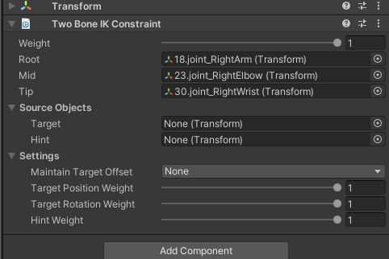 

然后再人物胸部添加一个target空物体

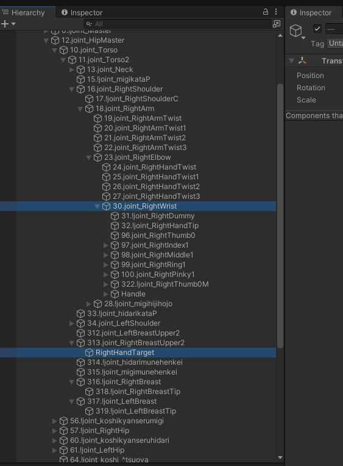 

选中我们的手和目标物体，利用align transform将目标点调整至到我们持枪动画时，手的位置处。然后记录信息

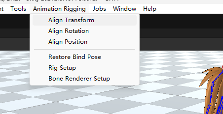 

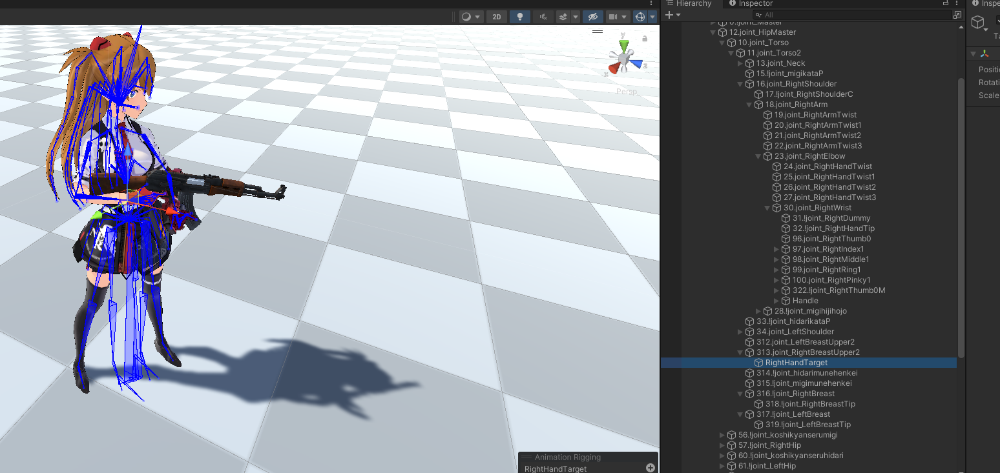


然后我再来配置一下左手的约束

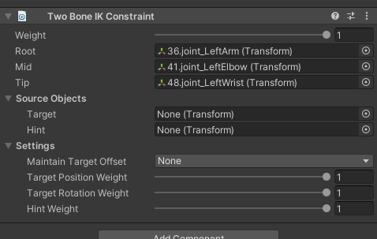 

在步枪的body下面新建一个left hand target


调整好两个约束后我们再来调整两个target的位置

 

感觉还是差点意思


**Hint**:如果我们在hint这里放置一个对象，那么root的角度就会偏向hint，在这个例子里大概就相当于指定了一个肘部关节的位置，它的作用是确定肘关键的位置 以免ik出现奇怪的扭曲。


**setting**：

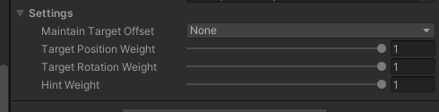 

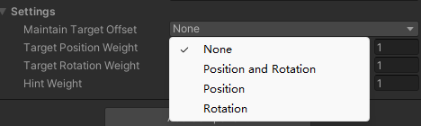 

这里的targetoffset表示tip和target算法需要保持原有的差异

比如我们在这里选中了position，那么右手tip和左手target之间在位置上的差异就会在游戏中被保留下来

而rotation就是角度被保留


## 动画Event

有时候可能需要某些动画片段播放完成之后去触发一些事件 。

注意：下载下来的模型大多数携带的动画片段都是只读的，所以我们需要复制一份动画片段出来，再添加动画事件


### 1.通过动画控制器添加事件

1. 在animator绑定的物体上添加一个新脚本，并写入触发事件后要调用的方法。要注意这个脚本不能放在其他物体上，否则控制器可能会找不到。
2. 在animation 控制器中的时间线上添加事件帧。
   2.1 找到你的.anim动画文件并打开它的控制器窗口

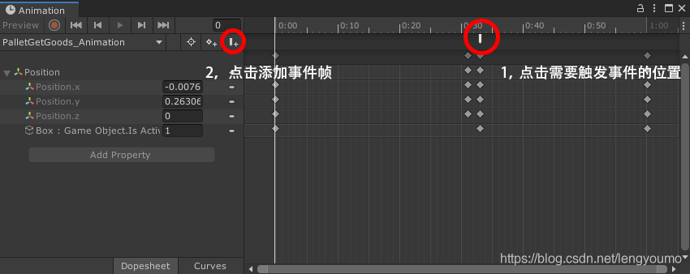

2.2 点击时间线上需要触发事件的位置，然后点击添加事件帧按钮即可生成。

3.事件帧绑定方法
点击时间线上刚刚创建的事件帧，Inspector窗口中就出现了相应的设置选项。function这里填写我们在脚本中创建的方法名：PrintEvent，下面的float、int、object、string是要传递的参数。可以不填。

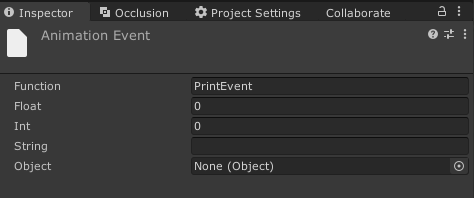

到这一步就已经实现了关键帧添加。当动画进行到事件关键帧就会触发绑定好的相关事件。


**注意：**如果出现找不到事件函数的错误的话，很可能你在其他的动画中添加了多余事件


### 2.通过代码方式添加事件

1.这个脚本创建在哪里都行，只要绑定好animator即可。脚本无法访问到通过控制器创建的事件关键帧，只能自己创建事件关键帧，并设置相关的事件。

```
using System.Collections;
using System.Collections.Generic;
using UnityEngine;

public class RbotArmController : MonoBehaviour
{
	// 指定animation 动画控制器，在脚本所在的物体上直接拖拽即可
    public Animator armAnimator;
    private void Start()
    {
    	// 创建一个事件
        AnimationEvent evt = new AnimationEvent();
        // 绑定触发事件后要执行的方法名
        evt.functionName = "PrintEvent";
        // 执行方法后要传入的参数
        evt.intParameter = 12345;
        // 设置事件关键帧的位置，当事件过了1.3秒后执行
        evt.time = 1.3f;
        // 设置目标动画剪辑，以下标为索引？
        AnimationClip clip = armAnimator.runtimeAnimatorController.animationClips[0];
        // 绑定事件
        clip.AddEvent(evt);
    }
    // 触发事件后，要执行的方法
    public void PrintEvent(int i)
    {
        print("PrintEvent: " + i + " called at: " + Time.time);
    }
}
```

`armAnimator.runtimeAnimatorController.animationClips[0]` 这段代码的含义如下：

- `armAnimator` 是一个 Animator 组件的实例，它控制着一个角色或对象的动画播放。
- `runtimeAnimatorController` 是 Animator 组件的一个属性，它返回当前的运行时动画控制器（RuntimeAnimatorController）。
- `runtimeAnimatorController.animationClips` 是 RuntimeAnimatorController 的一个属性，它返回一个 AnimationClip 数组，包含了当前动画控制器中的所有动画剪辑（AnimationClip）。
- `[0]` 表示我们正在访问数组中的第一个元素，也就是索引为 0 的动画剪辑。

综合起来，`armAnimator.runtimeAnimatorController.animationClips[0]` 的意思是获取 `armAnimator` 所使用的运行时动画控制器中的第一个动画剪辑（AnimationClip）。这样我们就可以对该动画剪辑进行操作，如添加事件、修改播放速度等。

```
AnimationClip[] clips = armAnimator.runtimeAnimatorController.animationClips;
if (clips.Length > 0)
{
    AnimationClip firstClip = clips[0];
    Debug.Log("第一个动画片段的名称：" + firstClip.name);
    // 在这里可以进行进一步的操作
}
else
{
    Debug.Log("动画控制器中没有任何动画片段！");
}

```

通过上述代码，你可以在Unity编辑器的控制台中查看第一个动画片段的名称。如果动画控制器中没有任何动画片段，将打印一条相应的消息。


2.绑定相关的animator
将脚本放到某个物体上，然后拖拽动画所在的animator到armAnimator上，即可完成绑定
这时，当动画播放到1.3秒所在的时间线位置时，绑定的相关方法就会触发。


### **3.注意：**

**Animation Event无法触发的解决办法**

- 如果是通过animation控制器添加的事件，要注意脚本是否和animator所在的对象所处同一对象。
- 如果是代码的添加方法，注意不能放在基类当中。就是说如果你的 脚本继承了某个基类，而事件的响应方法在基类中，那么这样可能会无法成功触发方法。
- 同时使用代码和动画控制器的方式添加，要注意是否有冲突。
- **在动画控制器上添加关键帧时，要注意是否多点了导致同一时间位置添加了你没注意到的多个事件帧，这样会导致不易定位且不会影响主进程的报错**


## TimeLine(导演)

在Unity中，Timeline是一种用于创建和编辑时间轴动画的工具。它允许您创建基于关键帧的动画，控制对象的位置、旋转、缩放、颜色和其他属性，以及在不需要编写代码的情况下组合和编辑这些动画。

Timeline还可以用于创建交互式序列，例如游戏中的场景、剧情、动画序列或UI动画。它支持各种功能，例如剪辑、分层、层蒙版、音频混合和过渡效果。

使用Timeline可以大大简化动画制作过程，因为您可以可视化地编辑动画序列，而无需手动编写脚本或通过代码控制动画。这使得它成为游戏开发者、动画师和设计师之间的桥梁，可以更好地协作和管理游戏的视觉效果。

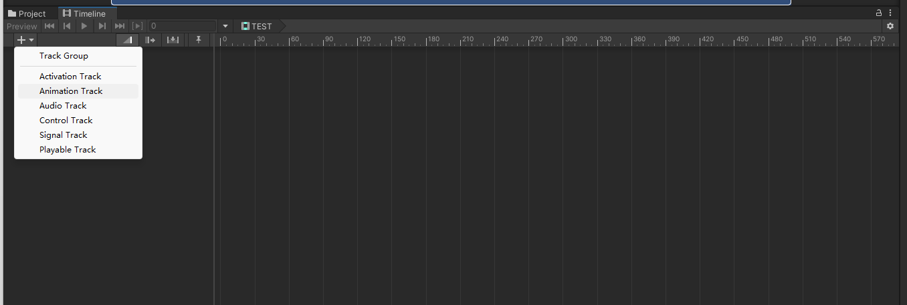

**这玩意和剪辑软件差不多，将相应的动画轨道和音频轨道放进去自己慢慢调整就行了。**


需要有物体挂载这个组件，然后将timeline挂载上去

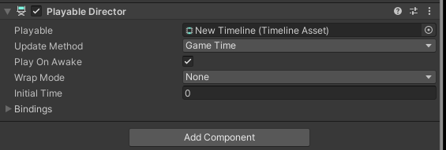


### 1.动画轨道

搞动画的


### 2.音频轨道

搞音乐的


### 3.可见轨道

可以让物体某段时间内激活或者非激活


### 4.代码衔接播放流程

```
using UnityEngine,Playables
```

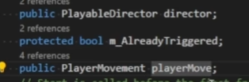


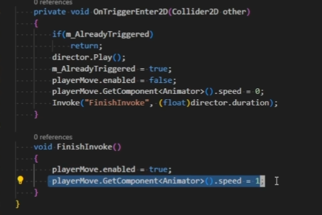


```
director.Play()//开始播放
director.duration//整个动画持续时间
```


## mixamo网站使用


### 1.下载人物模型


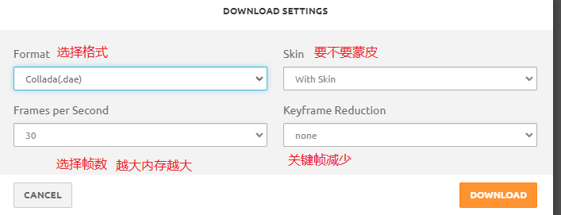 


Collada(.dae)格式：下载蒙皮和模型

FBX for Unity(.fbx)格式：只下载动作


**1.按照collada的格式下载，解压之后得到**

 

textures是这个模型的素材

下面那个是模型+动画


**2.将这两个文件放入assets中，然后之间把模型拖进场景就能使用了**

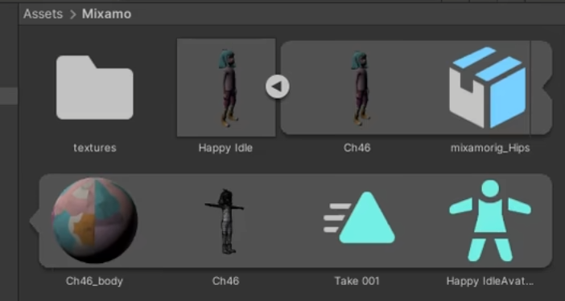 

**三角形那个是动画片段animation**  

**3.给这个模型创建一个Animator Controller，然后将动画拖入Animator Controller动画状态机即可**

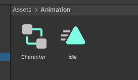 

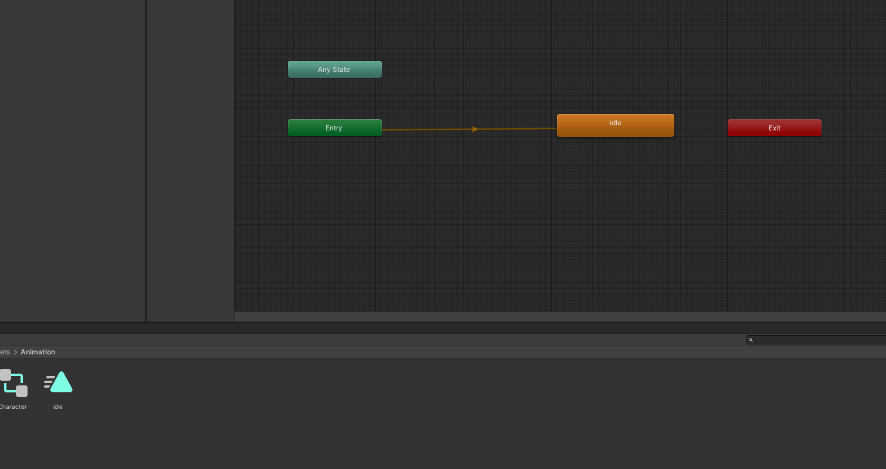


**4.给模型添加Animator组件，然后将上面的AnimatorController拖到这个组件上**

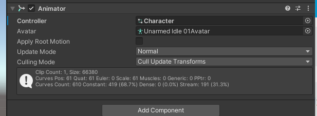 


### 2.给自己的模型使用mixamo的动作

**1.导入自己的模型**

这里主要有格式的限制


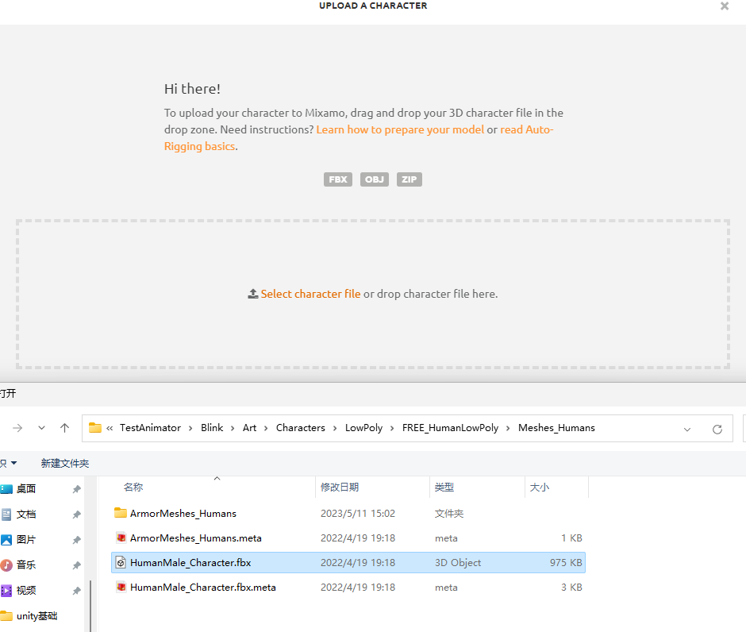


2.挑选喜欢的动作，然后导出，使用下面这个格式

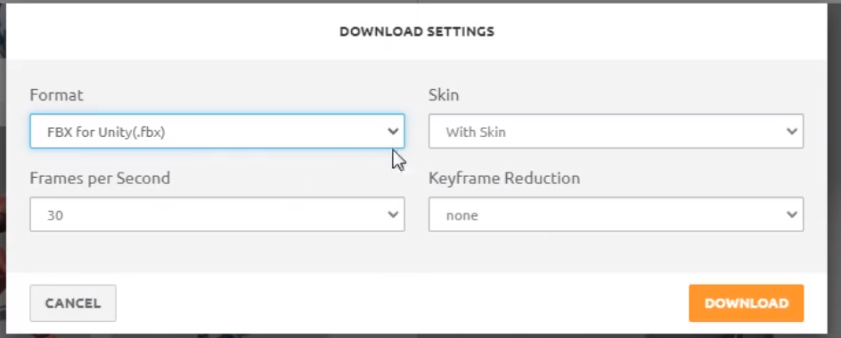


3.添加到unity项目当中，此时我们只需要他那个动作，将其复制一份出来拿去用即可

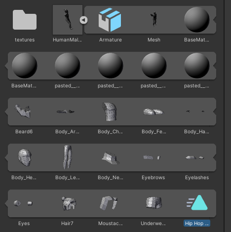


4.解决一些小问题

导出的动画是不循环播放的，所以我们需要去父级去设置


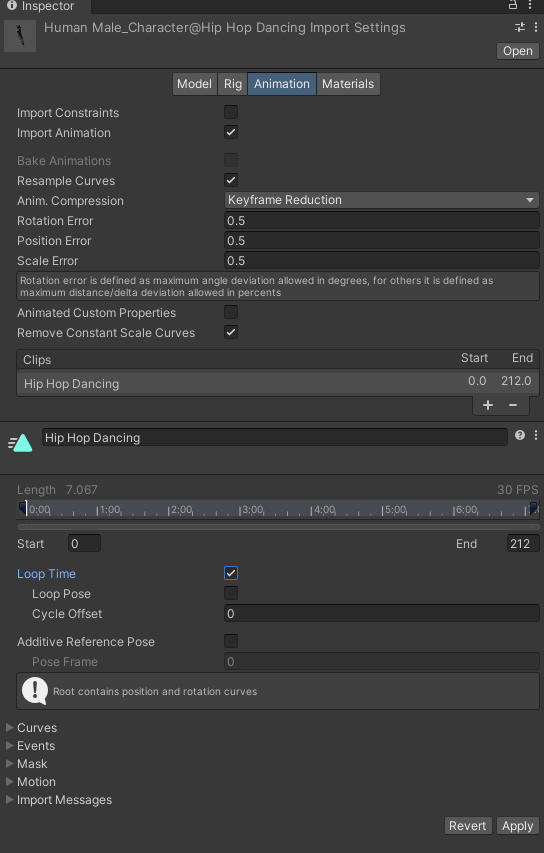


还需要将根据这个模型的类型去设置，如果是人形，就像以下即可

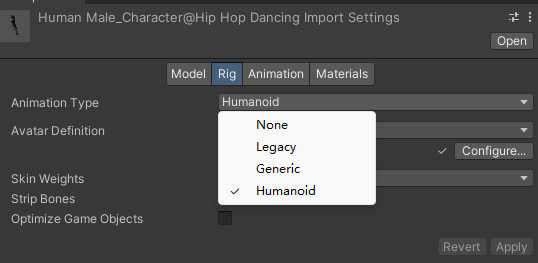

### 3.通过脚本控制动画

#### 1.在Animator Controller添加一些用于控制动画的变量

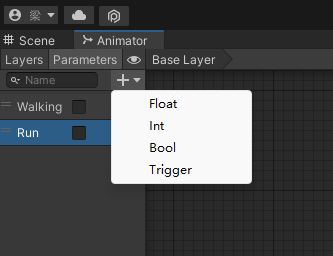 

#### 2.给你的动画之间添加关系，连线make Transition

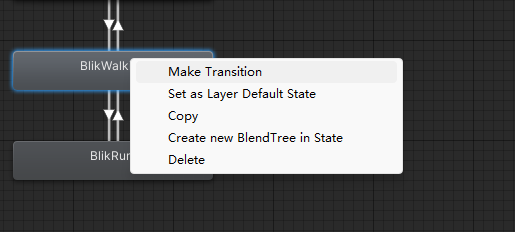 

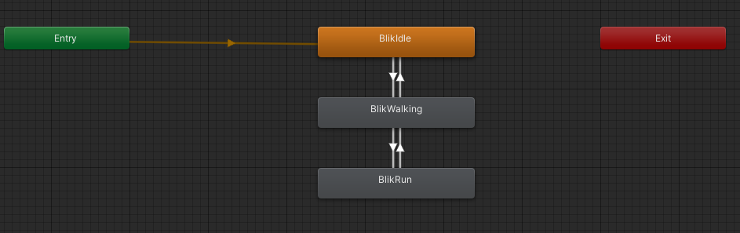


#### 3注意事项：点击你的那些连线，连线的inspector窗口如下

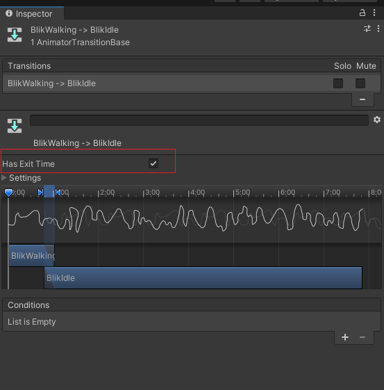 

1.transitions，//todo这里我们先都不选

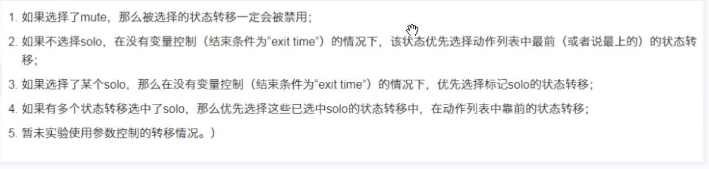


2.has exit time

这里取消勾选，这样让它没有等待时间，这样可以让他的状态从idel立刻切换到walk。

这里两条连线都需要取消


3.设置conditions中的变量，利用我们上面设置的变量

比如说idel-->walk

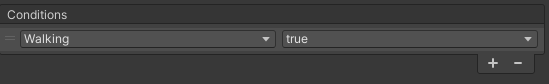

walk-->idel

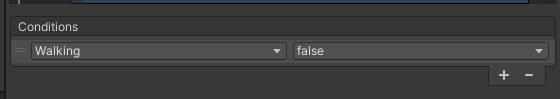

**这样我们就可以通过设置这个Walking这个bool值来控制动画的切换**


#### 4.脚本控制

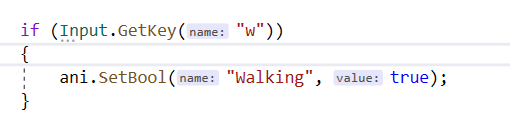 

可以通过animator中的方法来设置条件变量的值，因为我们都是用的bool类型所以是setbool这个方法

其他还有setInteger setFloat setTrigger........

可以通过变量命来选中哪一个条件变量

```
using System.Collections;
using System.Collections.Generic;
using UnityEngine;

public class AnimationController : MonoBehaviour
{
    private Animator ani;
    int theWalkId;
    int theRunId;

    // Start is called before the first frame update
    void Start()
    {
        ani= GetComponent<Animator>();
        theWalkId = Animator.StringToHash("walking");
        theRunId = Animator.StringToHash("running");
    }

    // Update is called once per frame
    void Update()
    {
        bool isWalking = ani.GetBool("walking");
        bool isRunning = ani.GetBool("running");
        bool pressedw = Input.GetKey("w");
        bool pressedr = Input.GetKey(KeyCode.LeftShift);

        if (!isWalking && pressedw)
        {
            ani.SetBool(theWalkId, true);
        }
        if(isWalking&&!pressedw)
        {
            ani.SetBool(theWalkId, false);
        }


        if (!isRunning && pressedw && pressedr)
        {
            ani.SetBool(theRunId, true);
        }
        if (isRunning &&(!pressedw || !pressedr))
        {
            ani.SetBool(theRunId, false);
        }
    }
}
```


### bug

如果动作不对的话，自己调调骨骼就行了

[从Mixamo导入的动画用起来会变形怎么办？三分钟告诉你怎么解决。_哔哩哔哩_bilibili](https://www.bilibili.com/video/BV1fg411w7HT/?spm_id_from=333.788&vd_source=ff929fb8407b30d15d4d258e14043130)


## 模型导入

### bug

1.模型紫色，修改材质球的sharder

 

或是用Strandard也可以


### 1.PMX模型直接导入Unity

我们用到的插件是 MMD4Mecanim，这是一个Unity的插件，可以直接在Unity中使用。

我们导入MMD4Mecanim.unitypackage到项目中。

 

然后找到PMX的模型

导入后会有一个MMD4Mecanim的ScriptableObject的文件。

点击后在Inspector中会有使用规则。

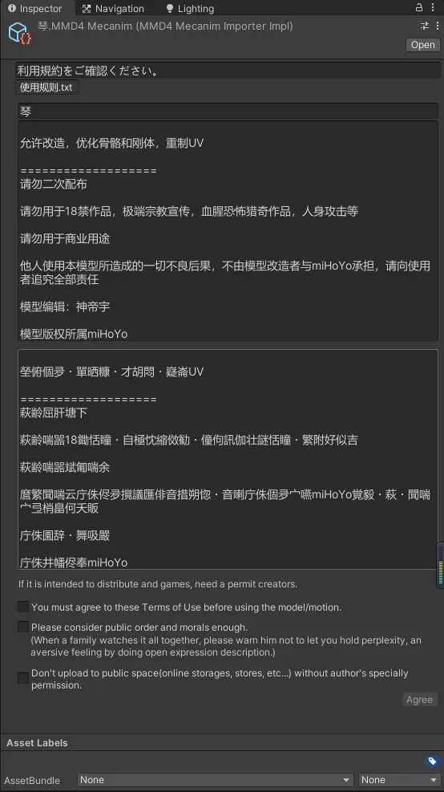 

同意上述条款，这里不做翻译了。

点击agree后。Inspector窗口发生了变化，点击Process，就开始转换了。

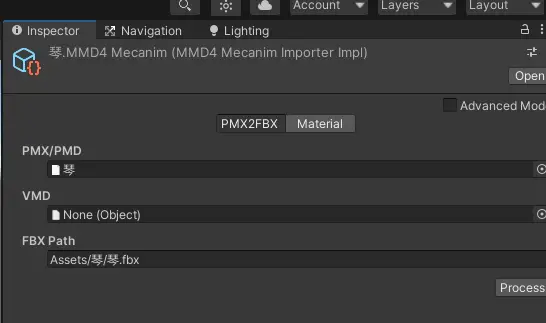 

完成后会将模型转化，同时将材质提取出来。


注意：

好像只支持标准3d模板的管线，如果项目是URP的，一导入，材质会全是洋红的，可以尝试这样解决：
1.全选洋红材质球
2.右边，将Shader换成Standard
3.Edit->Rendering->Materials->Convert Selected Built-in Materials to URP


2.使用blender+cats插件

[pmx转fbx的具体步骤-CSDN博客](https://blog.csdn.net/thy0000/article/details/123800040)

导入unity时效果不佳

[使用Blender的CATS插件把MMD模型转为FBX，导入Unity_blender cats-CSDN博客](https://blog.csdn.net/qq_42915442/article/details/130375098)


# 插件


## **Debug Console**

游戏界面控制台，方便我们调试

https://assetstore.unity.com/packages/tools/gui/in-game-debug-console-68068


## BetterStreamingAssets 

在Unity游戏开发中，对Streaming Assets目录的高效管理是提升应用程序性能的关键之一。Better Streaming Assets是一个轻量级插件，它提供了统一且线程安全的方式来访问Streaming Assets，几乎无额外开销。这个插件特别适用于Android平台，能够避免使用效率低下的WWW函数或嵌入到Asset Bundles中的数据。它的API设计灵感来源于System.IO.File和System.IO.Directory类，使得操作更加直观易用。

**应用场景**
资源加载：无论是游戏内文本、配置文件、音频文件或是大型模型，都能通过Better Streaming Assets快速、安全地加载。
热更新机制：当需要在不更新应用的情况下添加新内容时，可以将新资源存储在Streaming Assets中并动态加载。
跨平台兼容：虽然目前不支持WebGL，但在其他平台，包括Android，它可以作为高效的数据加载工具。

**项目特点**
简洁API：基于System.IO.File和Directory设计，易于理解和使用。
线程安全：所有操作都可以在非主线程中进行，提高程序执行效率。
高效读取：在Android上避免了传统方法的低效，实现了更快速的文件读取。
错误处理：有针对Android App Bundle和非ASCII文件名的异常处理机制，确保稳定运行。
自定义扩展：允许开发者通过扩展点来覆盖特定路径的压缩文件检测逻辑。基本使用

**基本使用**

以下是一个简单的示例，展示如何使用 BetterStreamingAssets 读取一个 XML 文件：

```
using BetterStreamingAssets;
 
public class Example : MonoBehaviour
{
    void Start()
    {
        string path = "config.xml";
        if (BetterStreamingAssets.FileExists(path))
        {
            using (var stream = BetterStreamingAssets.OpenRead(path))
            {
                var serializer = new System.Xml.Serialization.XmlSerializer(typeof(Config));
                Config config = (Config)serializer.Deserialize(stream);
                // 处理配置文件
            }
        }
        else
        {
            Debug.LogError("文件未找到: " + path);
        }
    }
}
```


## DOTween


### UGUI基本操作


### 功能


### Bug

**1.dotween中某些方法没办法使用**

Got the same error, in our case was due to using Assembly Definitions in our project and not referencing DOTween's Assemblies as dependencies. The discussion on this issue gave me the answer: [#264](https://github.com/Demigiant/dotween/issues/264)

We missed them because they are not generated by default; to generate DOTween's Assembly Definitions, open the DOTween Control Panel (*Tools/Demigiant/DOTween Utility Panel*) and in the *Setup* tab, press the *Create ASMDEF* button.

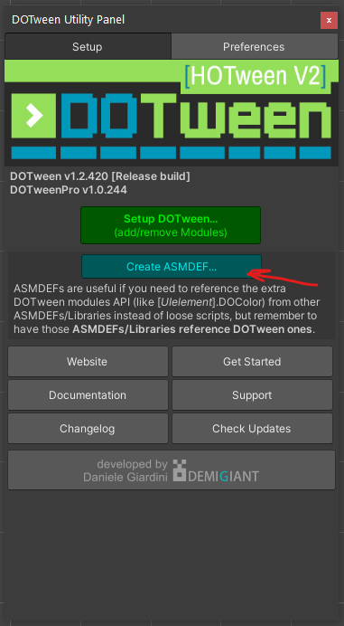 

Now you can reference both *DOTweenPro.Scripts.asmdef* and *DOTween.Modules.asmdef* to your Assembly Definitions :)

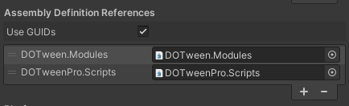 


来源：

https://github.com/Demigiant/dotween/issues/154


## **UnityMainThreadDispatcher**

解决客户端中实例化操作不能在主线程中使用

**这里用一个插件UnityMainThreadDispatcher**

原理：本身就是一个MonoBehaviour，然后加了一个线程消息队列，实际上这个脚本就是一个中介（因为它运行在主线程中），我们可以把我们要干的事情交给他，然后主线程就会调用这个脚本，如果消息队列里面有消息就执行这些操作，就可以达到一个间接使用主线程的目的。

**使用方法：**

```
UnityMainThreadDispatcher.Instance().Enqueue(()=>{
	//你的代码......
});
```


# 摄像机

战斗和休闲摄像机切换

这里使用unity给我们提供的插件Cinemachine

https://www.bilibili.com/video/BV1FN4y1G7n1/?spm_id_from=333.788&vd_source=ff929fb8407b30d15d4d258e14043130


## Camera组件

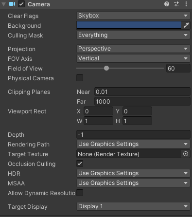 

**Culling Mask**：选择渲染哪些层级

**Depth**:值越大，渲染优先级越高，用于多个摄像机渲染时用。

其实就是这样，depth值小的先渲染。后渲染内容的会覆盖先渲染的内容，如果先渲染枪械，那后渲染的背景就会自动覆盖枪械，所以你必须先渲染背景，因此main camera的depth值要小于Gun


# 渲染相关

## 材质

在 Unity 中，**Material（材质）** 用于定义游戏对象的外观，控制其在光线、阴影、纹理等方面的表现。材质有很多参数，具体的参数取决于材质使用的 Shader 类型（比如 **Standard Shader**、**Lit Shader** 等）

 


在 Unity 中，**Material（材质）** 用于定义游戏对象的外观，控制其在光线、阴影、纹理等方面的表现。材质有很多参数，具体的参数取决于材质使用的 Shader 类型（比如 **Standard Shader**、**Lit Shader** 等）。以下是 Unity **Standard Shader** 的各个参数的详细解释，它是 Unity 中最常用的材质类型：

### **Rendering Mode（渲染模式）**
   - 控制材质的渲染方式，常见的选项有：
     - **Opaque**（不透明）：默认设置，不透明材质（例如墙壁、地板）。
     - **Cutout**（剪裁）：用于带有透明区域的材质（例如树叶），完全透明或完全不透明。
     - **Fade**（渐隐）：渐变透明效果（例如透明玻璃或幽灵）。
     - **Transparent**（透明）：用于完全透明的材质，支持反射和折射（例如水或玻璃）。

### **Albedo（反照率/颜色）**
   - 定义材质的基础颜色和纹理。
   - 你可以设置一个纯色或应用一张纹理贴图（Texture）。
   - Albedo 的透明度（Alpha 通道）也可以控制材质的透明效果，具体效果取决于渲染模式。

### **Metallic（金属度）**
   - 控制材质的金属感。值范围为 0 到 1：
     - 0 表示非金属（如木材、塑料）。
     - 1 表示完全金属（如金属表面）。
   - 你可以使用一个 **Metallic Map**（金属度贴图）来定义不同部位的金属度。

### **Smoothness（光滑度）**
   - 控制材质表面的光滑程度，从而影响反射和高光效果。
     - 数值越高，表面越光滑，反射更清晰。
     - 数值较低时，表面更粗糙，反射模糊。
   - 该参数可以与 **Metallic** 关联，或者从单独的 **Smoothness Map** 中读取值。

###  **Normal Map（法线贴图）**
   - 用于模拟表面的细节和凹凸感，而不增加实际几何体的多边形数量。
   - 通过使用 **Normal Map**，可以创建诸如砖墙、皮肤细纹等效果，使其在光照下显得更真实。

### **Height Map（高度贴图）**
   - 用于产生视差效果（Parallax Mapping），增加材质表面的深度感。
   - 通常与 Normal Map 结合使用，以模拟更多的表面细节。

###  **Occlusion Map（遮蔽贴图）**
   - 也称为 **Ambient Occlusion (AO) Map**，用于添加环境光遮蔽效果。
   - 这可以让一些凹陷或阴影区域看起来更暗，从而增加深度感和真实感。

### **Emission（自发光）**
   - 使材质发光，即使在没有光源的情况下也会显示亮度。
   - 可以设置一个颜色或者使用 **Emission Map**，来定义发光区域的颜色和强度。
   - 发光效果在黑暗场景中特别明显，常用于制作灯光、火焰或发光物体（如霓虹灯）。

###  **Detail Mask（细节遮罩）**
   - 用于定义哪些区域显示细节纹理。
   - 可以在特定区域上应用细节纹理，例如将额外的噪声或皮肤细节只应用到指定区域。

### **Detail Albedo（细节颜色贴图）和 Detail Normal Map（细节法线贴图）**
   - 在材质上增加更多的细节层，如在衣服或墙面上添加额外的纹理或噪声。
   - **Detail Normal Map** 可以在已有的 Normal Map 基础上增加更多的细节凹凸效果。

###  **Specular Highlights（镜面高光）**
   - 启用或禁用镜面高光反射效果。对于金属和光滑表面，它非常重要。

###  **Environment Reflections（环境反射）**
   - 控制材质是否反射环境光。
   - 适用于使用反射探针（Reflection Probes）或天空盒（Skybox）的场景，使得表面反射环境的颜色。

### **Tiling（平铺）和 Offset（偏移）**
   - 控制贴图在材质上的平铺方式。
     - **Tiling**：设置纹理在 U（水平）和 V（垂直）方向上的重复次数。
     - **Offset**：设置纹理在 U 和 V 方向上的偏移量。

### 其他高级参数
   - 在高级设置中，你可以控制一些更细化的渲染选项，例如 **双面渲染**（Backface Culling）、**Alpha 测试**（Alpha Test Threshold）、**光照模式**（Receive Shadows、Cast Shadows）等，用于精细调整材质的表现。

### 总结
材质的各个参数让你可以根据需要灵活调整对象的外观表现，从而达到真实感或特定风格的视觉效果。通过组合使用这些参数，你可以创建出各种不同的材质效果，从金属、塑料、木材到玻璃、液体和动漫风格等。


## 模型

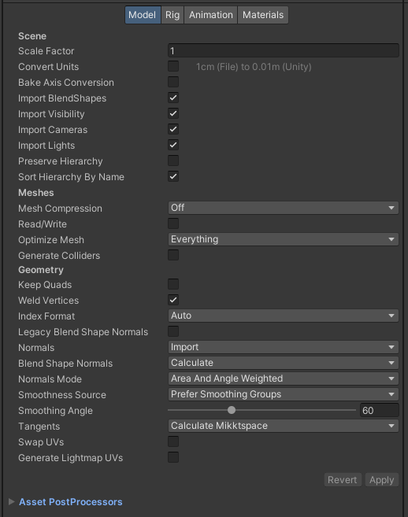 

**Scene**


**Meshes**


**Gemoetry**


**假设找到一个好看的模型，我们要给他配动画**

找到好模型可以放入mixamo帮我们搞定骨骼和动画

在mixamo中需要选择collada格式的，其他的导入不知道为什么不行。


**模型材质丢失**

关于模型导入unity材质丢失，并且材质白的时候，可以将贴图放到材质上。


# =============================

# c#基础


## 关键字&&语法糖


### out

**示例：普通的 `out` 参数**

通常，使用 `out` 参数的代码如下所示：

```csharp
public bool ResolveActionAndBinding(out string action, out int bindingIndex)
{
    action = "SomeAction";
    bindingIndex = 42;
    return true;
}

public void SomeMethod()
{
    string action;
    int bindingIndex;
    bool result = ResolveActionAndBinding(out action, out bindingIndex);
    // Now action and bindingIndex have values assigned within ResolveActionAndBinding
}
```

在上面的代码中，`ResolveActionAndBinding` 方法有两个 `out` 参数：`action` 和 `bindingIndex`。调用 `ResolveActionAndBinding` 方法时，必须先声明这两个变量，然后通过 `out` 关键字传递给方法。方法内部会为这些变量赋值。


**使用 `out var`**

C# 7.0 引入了一种新的简化语法：`out var`。这种语法允许在方法调用的同时声明和初始化 `out` 参数，代码会更加简洁。示例如下：

```csharp
public bool ResolveActionAndBinding(out string action, out int bindingIndex)
{
    action = "SomeAction";
    bindingIndex = 42;
    return true;
}

public void SomeMethod()
{
    bool result = ResolveActionAndBinding(out var action, out var bindingIndex);
    // Now action and bindingIndex have values assigned within ResolveActionAndBinding
}
```

在这个例子中，`out var` 语法使得我们不需要提前声明 `action` 和 `bindingIndex` 变量。相反，它们在方法调用时被声明和初始化。这种方式使代码更加紧凑和易读。


### ref

`ref` 关键字在C#中用于传递参数时，表示参数按引用传递，而不是按值传递。这意味着在方法内部对该参数的修改会反映到调用者的上下文中。`ref` 关键字的用法通常有以下几种情况：

1.**传递变量的引用**

使用 `ref` 关键字将参数按引用传递，这样在方法内部对参数的修改会影响到外部变量的值。以下是一个简单的例子：

```csharp
using System;

class Program
{
    static void Main()
    {
        int number = 10;
        ModifyValue(ref number);
        Console.WriteLine(number); // 输出：20
    }

    static void ModifyValue(ref int value)
    {
        value = 20;
    }
}
```

在这个例子中，`number` 变量在调用 `ModifyValue` 方法时通过 `ref` 关键字传递，因此方法内部对 `value` 的修改会直接影响到 `number` 的值。

2. **要求变量必须被初始化**

使用 `ref` 关键字的参数在传入方法之前必须被初始化，否则会编译错误。这是因为方法内部会直接使用这个引用变量，它必须有一个已知的值。例如：

```csharp
int number; 
ModifyValue(ref number); // 错误：number 未初始化
```

必须确保 `number` 在调用之前已经被赋值：

```csharp
int number = 0;
ModifyValue(ref number); // 现在没有错误
```

3. **在返回值中使用 `ref`**

`ref` 也可以用于方法的返回值，允许方法返回一个引用类型。返回值可以直接被用来修改引用的变量的值。例如：

```csharp
static ref int FindElement(int[] array, int index)
{
    return ref array[index];
}

int[] numbers = { 1, 2, 3, 4 };
ref int element = ref FindElement(numbers, 2);
element = 10; // 直接修改数组中的值
Console.WriteLine(numbers[2]); // 输出：10
```

在这个例子中，`FindElement` 方法返回一个对数组元素的引用，因此在外部修改 `element` 也会修改数组中的实际值。

4. **与 `out` 的区别**

`ref` 和 `out` 都是用于按引用传递参数，但它们有以下区别：

   - 使用 `ref` 的参数在传入方法之前必须已经初始化。
   - 使用 `out` 的参数不要求在传入方法之前初始化，但在方法内部必须对其进行赋值。

**`ref` 关键字的总结**：

- 允许方法修改传入参数的值，并且这些修改会反映到调用者的上下文中。
- 传递前必须确保变量已被初始化。
- 适用于需要在方法内部改变外部变量值的场景。


### where

在 C# 中，`where` 关键字用于为泛型类型参数指定约束。通过使用 `where` 关键字，可以限定泛型类型参数必须满足某些条件。这在定义泛型类、泛型接口、泛型方法时非常有用。

#### 语法

```csharp
class 类名<类型参数> where 类型参数 : 约束
```
或者
```csharp
方法名<类型参数>(参数) where 类型参数 : 约束
```

#### 常见约束

1. **`where T : class`**
   - 限制 `T` 必须是引用类型，如类、接口、委托或数组。无法使用值类型（如 `int`、`struct`）。

2. **`where T : struct`**
   - 限制 `T` 必须是值类型。这通常用于限制类型参数为结构体类型或原始值类型。

3. **`where T : new()`**
   - 限制 `T` 必须有一个公共的无参构造函数。确保可以通过 `new T()` 创建实例。

4. **`where T : SomeBaseClass`**
   - 限制 `T` 必须是 `SomeBaseClass` 或其派生类。这可以确保类型参数继承自特定的基类。

5. **`where T : SomeInterface`**
   - 限制 `T` 必须实现接口 `SomeInterface`。确保类型参数实现指定的接口。

6. **多个约束**
   - 可以对同一个类型参数指定多个约束：
     ```csharp
     where T : class, new()
     ```

7. **多个泛型参数**
   - 对多个泛型参数可以分别使用 `where` 关键字进行约束：
     ```csharp
     class MyClass<T1, T2>
         where T1 : class
         where T2 : struct
     {
         // 类的实现
     }
     ```

#### 示例


##### 泛型类

```csharp
public class MyClass<T> where T : class, new()
{
    public T CreateInstance()
    {
        return new T();  // 因为有 new() 约束，所以可以直接实例化 T
    }
}
```

##### 泛型方法

```csharp
public void MyMethod<T>(T param) where T : IDisposable
{
    param.Dispose();  // 因为 T 实现了 IDisposable，所以可以调用 Dispose 方法
}
```

通过 `where` 关键字，C# 提供了一种灵活的机制来确保泛型类型符合某些规则，使代码更安全、易于维护。


### using

`using` 关键字在C#中有几种不同的用法，包括引入命名空间、定义资源的作用域和简化类型别名等。以下是 `using` 关键字的主要用法和它们的详细解释：

#### **引入命名空间**

最常见的用法是在文件顶部使用 `using` 语句来引入命名空间，这样就可以在代码中直接使用命名空间中的类和其他类型，而无需写全限定名。例如：

```csharp
using System;
using System.Collections.Generic;

class Program
{
    static void Main()
    {
        List<int> numbers = new List<int> { 1, 2, 3 };
        Console.WriteLine("Count: " + numbers.Count);
    }
}
```

在这个例子中，`using System;` 和 `using System.Collections.Generic;` 允许我们直接使用 `Console` 和 `List<T>` 类，而无需写成 `System.Console` 或 `System.Collections.Generic.List<T>`。

#### 定义资源的作用域

（`using` 声明和 `using` 语句）

`using` 关键字可以用于管理资源的生命周期，通常用于自动处理实现了 `IDisposable` 接口的对象。这些对象在使用完后需要释放资源，例如文件流、数据库连接等。

有两种主要的方式使用 `using` 来管理资源：`using` 声明（C# 8.0+）和 `using` 语句。

##### **`using` 语句**
`using` 语句用于定义一个作用域，超出该作用域时自动释放资源。这是 C# 8.0 之前常用的写法：

```csharp
using (StreamReader reader = new StreamReader("file.txt"))
{
    string content = reader.ReadToEnd();
    Console.WriteLine(content);
}
// 这里 `reader` 会在作用域结束时自动调用 Dispose 方法
```

在这个例子中，`StreamReader` 对象在作用域结束时自动释放资源，这避免了手动调用 `Dispose` 方法。

##### **`using` 声明（C# 8.0+）**
C# 8.0 引入了 `using` 声明，它简化了资源的管理。在这种情况下，你可以直接在代码块中声明一个 `using` 变量：

```csharp
using StreamReader reader = new StreamReader("file.txt");
string content = reader.ReadToEnd();
Console.WriteLine(content);
// 这里 `reader` 会在方法结束时自动调用 Dispose 方法
```

使用 `using` 声明时，不需要再用大括号定义一个单独的作用域，当方法或代码块结束时，资源会自动释放。

#### 3. **简化类型别名**
`using` 还可以用于定义类型的别名，以简化代码的书写，尤其是在处理长类型名或复杂的泛型类型时。例如：

```csharp
using ProjectDictionary = System.Collections.Generic.Dictionary<string, Project>;

class Program
{
    static void Main()
    {
        ProjectDictionary projects = new ProjectDictionary();
        // 现在可以使用 `projects` 而不是长的泛型名称
    }
}
```

在这个例子中，我们为 `Dictionary<string, Project>` 定义了一个别名 `ProjectDictionary`，这样后续代码可以更简洁。

#### 4. **静态导入（C# 6.0+）**
`using` 也可以用于静态导入类的成员，这样可以直接使用类的静态成员而不必每次都引用类名。这在访问常用的静态方法或常量时很有用，例如：

```csharp
using static System.Console;

class Program
{
    static void Main()
    {
        WriteLine("Hello, World!"); // 直接使用 Console 的静态方法
    }
}
```

这里，我们静态导入了 `System.Console`，因此可以直接调用 `WriteLine` 方法，而不需要每次写 `Console.WriteLine`。

#### 总结
`using` 关键字在C#中主要有以下几种用法：
- 引入命名空间，使代码更简洁。
- 管理资源的生命周期，确保实现了 `IDisposable` 的对象在使用后被正确释放（`using` 语句和 `using` 声明）。
- 定义类型别名，简化长类型名的使用。
- 静态导入类的成员，使代码更简洁。

这些用法大大提升了代码的可读性和资源管理的安全性。


## 流

### MemoryStream

**使用流的速度通常比直接操作文件或网络资源要快，因为流可以在内存中缓冲数据，从而避免了频繁的磁盘或网络操作。**


MemoryStream 是 .NET Framework 和 .NET Core 中的一种流（stream）类型，它使用一个内存缓冲区来读写数据。它是一种特殊的流，可以将数据读写到内存缓冲区中，而不是一个实际的文件或网络资源。

MemoryStream 继承自抽象类 Stream，这意味着它继承了 Stream 类的所有特性。


**使用方法**

1.创建一个 MemoryStream 对象，可以使用无参构造函数创建一个空的 MemoryStream 对象，也可以使用带有 byte 数组参数的构造函数来创建一个已经包含数据的 MemoryStream 对象。

```
// 创建一个空的 MemoryStream 对象
MemoryStream stream = new MemoryStream();

// 创建一个包含数据的 MemoryStream 对象
byte[] data = new byte[] { 1, 2, 3, 4, 5 };
MemoryStream streamWithData = new MemoryStream(data);

```


2.通过 Write 方法写入数据到 MemoryStream 对象中。

```
// 写入一个字节到 MemoryStream 对象中
stream.WriteByte(1);

// 写入一个字节数组到 MemoryStream 对象中
byte[] data = new byte[] { 2, 3, 4 };
stream.Write(data, 0, data.Length);

```


3.通过 Seek 方法调整流的位置，可以读取或写入 MemoryStream 对象中的数据。

```
// 调整流的位置到开头
stream.Seek(0, SeekOrigin.Begin);

// 从流中读取一个字节
int b = stream.ReadByte();

// 从流中读取多个字节到字节数组中
byte[] buffer = new byte[stream.Length];
int bytesRead = stream.Read(buffer, 0, buffer.Length);

```

4.当不再需要 MemoryStream 对象时，应该调用 Dispose 方法释放资源。

```
// 释放资源
stream.Dispose();
```


5.可以将 MemoryStream 中的数据转换为 byte 数组。可以使用 MemoryStream 类的 ToArray 方法来实现。

```
// 创建一个 MemoryStream 对象并写入数据
MemoryStream stream = new MemoryStream();
byte[] data = new byte[] { 1, 2, 3 };
stream.Write(data, 0, data.Length);

// 将 MemoryStream 对象中的数据转换为 byte 数组
byte[] bytes = stream.ToArray();

// 输出 byte 数组的内容
foreach (byte b in bytes)
{
    Console.Write(b + " ");
}
// 输出结果：1 2 3
```


## 反射

### 概要

C# 中的反射（Reflection）是一种在运行时检查对象的类型、成员（如方法、属性、字段）以及动态调用方法的技术。反射可以在程序运行时获取类型信息、创建对象、调用方法或访问字段和属性，这使得它非常适合编写动态和灵活的代码。

反射主要由 `System.Reflection` 命名空间中的类和接口提供支持。

**反射可以用来：**

- 获取类型信息：可以在运行时获取类、接口、枚举、委托等的元数据。
- 动态创建对象：通过反射，可以在不知道类型的情况下动态实例化对象。
- 动态调用方法：可以在运行时调用对象的方法，即使方法名或参数在编译时未知。
- 访问和修改属性和字段的值。


### **获取类型信息**

反射的核心是 `Type` 类，它代表了对象的类型。可以通过以下几种方式获取一个类型的 `Type` 对象：

- 使用 `typeof` 关键字（编译时）。
- 使用 `GetType()` 方法（运行时）。
- 使用 `Assembly.GetType()` 从程序集加载类型。

**示例：**

```
using System;
using System.Reflection;

class Program
{
    static void Main()
    {
        // 通过 typeof 获取类型
        Type type1 = typeof(string);

        // 通过 GetType() 获取类型
        string str = "Hello, World!";
        Type type2 = str.GetType();

        // 输出类型信息
        Console.WriteLine(type1); // System.String
        Console.WriteLine(type2); // System.String
    }
}
```

### **获取类型的成员信息**

使用 `Type` 对象可以获取类型的各种成员信息，例如属性、方法、字段和构造函数。以下是一些常用方法：

- `GetProperties()`：获取所有属性。
- `GetMethods()`：获取所有方法。
- `GetFields()`：获取所有字段。
- `GetConstructors()`：获取所有构造函数。

**示例：**

```
Type type = typeof(Person);

// 获取所有方法
MethodInfo[] methods = type.GetMethods();
foreach (var method in methods)
{
    Console.WriteLine(method.Name);
}

// 获取所有属性
PropertyInfo[] properties = type.GetProperties();
foreach (var property in properties)
{
    Console.WriteLine(property.Name);
}
```

### **动态创建对象**

可以使用 `Activator.CreateInstance()` 方法通过反射动态创建对象。这在我们事先不知道对象类型的情况下非常有用。

**示例：**

```
Type personType = typeof(Person);
object personInstance = Activator.CreateInstance(personType);

// 如果有参数的构造函数
object personWithParams = Activator.CreateInstance(personType, new object[] { "John", 30 });
```

### **动态调用方法**

通过 `MethodInfo` 对象，可以在运行时调用方法。通常先使用 `GetMethod()` 方法获取方法信息，然后使用 `Invoke()` 方法调用它。

**示例：**

```
csharp复制代码using System;
using System.Reflection;

class Program
{
    static void Main()
    {
        // 创建对象
        Person person = new Person { Name = "Alice", Age = 25 };
        
        // 获取类型和方法信息
        Type type = person.GetType();
        MethodInfo method = type.GetMethod("SayHello");
        
        // 调用方法
        method.Invoke(person, null); // 输出：Hello, my name is Alice
    }
}

public class Person
{
    public string Name { get; set; }
    public int Age { get; set; }

    public void SayHello()
    {
        Console.WriteLine($"Hello, my name is {Name}");
    }
}
```

### **访问和修改字段、属性**

可以通过反射访问对象的私有或公共字段和属性，并修改它们的值。

**示例：**

```
csharp复制代码Person person = new Person();
Type type = person.GetType();

// 获取属性并设置值
PropertyInfo property = type.GetProperty("Name");
property.SetValue(person, "Bob");

// 获取字段并设置值
FieldInfo field = type.GetField("_age", BindingFlags.NonPublic | BindingFlags.Instance);
field.SetValue(person, 35);

Console.WriteLine($"{person.Name}, Age: {person.Age}");
```

### **加载程序集和动态类型**

可以使用 `Assembly` 类动态加载程序集，获取其中的类型，并使用反射来创建对象和调用方法。这在需要插件系统或动态扩展时特别有用。

**示例：**

```
// 加载程序集
Assembly assembly = Assembly.Load("MyAssembly");

// 获取类型
Type myType = assembly.GetType("MyNamespace.MyClass");

// 创建实例
object instance = Activator.CreateInstance(myType);
```

### **自定义属性（Attributes）**

通过反射，还可以读取自定义属性（Attributes）。例如，如果一个类或方法上标记了自定义属性，可以在运行时读取这些属性并做出相应的响应。

**示例：**

```
[AttributeUsage(AttributeTargets.Class | AttributeTargets.Method)]
public class MyCustomAttribute : Attribute
{
    public string Description { get; }
    public MyCustomAttribute(string description)
    {
        Description = description;
    }
}

[MyCustomAttribute("This is a sample class")]
public class SampleClass
{
    [MyCustomAttribute("This is a sample method")]
    public void SampleMethod() { }
}

Type type = typeof(SampleClass);
var attributes = type.GetCustomAttributes(typeof(MyCustomAttribute), false);
foreach (MyCustomAttribute attr in attributes)
{
    Console.WriteLine(attr.Description);
}
```

### 总结

C# 中的反射强大而灵活，可以在以下场景中大显身手：

- 插件和扩展系统：加载外部程序集和动态调用方法。
- 动态序列化和反序列化：遍历对象的属性和字段。
- 实现 ORM（对象关系映射）等框架：通过反射映射数据库字段与对象属性。
- 测试框架：动态发现和执行测试方法。

尽管反射非常强大，但它也有性能成本。因为反射是在运行时解析类型和成员的元数据，因此通常比直接访问慢。在性能敏感的代码中，应谨慎使用反射。


# c#多线程编程


## Lambda表达式 - 委托进化史

### 委托

早在C# 1.0时代，就引入了委托（delegate）类型的概念，学过C语言，拿C语言弄过高级一点东西的同学都会发现，C语言里函数指针无处不在，C语言也想面向对象，也会尝试面向对象，这些功能很多时候都是用回调函数实现的，回调函数就得用到函数指针。高级语言的出现就是为了解决C语言面向对象不是那么方便、直观的问题。C语言有，C#自然就得有，**委托就相当于C语言的函数指针，委托的意义在于可以将函数作为参数进行传递。某种意义上，委托可理解为一种托管的强类型函数指针。**

通常情况下，使用委托需要三步走：

1. 定义一个委托，包含指定的参数类型和返回值类型。
2. 创建一个与上述委托*参数类型*和*返回值*相符的方法。
3. 创建一个委托实例。

先来个最简单的例子演示C# 1.0中的委托，先创建一个控制台项目。

```
using System;

namespace lambda
{
    class Program
    {
        //创建一个委托，返回值为空，参数个数1个，类型为字符串
        delegate void TestDelegate(string s);
        //参考委托创建一个方法，返回值为空，参数个数1个，类型为字符串
        static void PrintString(string s)
        {
            Console.WriteLine(s);
        }
        static void Main(string[] args)
        {
            //创建委托实例，注意：参数“PrintString”必须和上面的方法签名相同
            TestDelegate testDel = new TestDelegate(PrintString);
            //调用委托
            testDel("Hello Lambda!");
        }
    }
}
```

注意，这里只是演示委托的使用，尽可能简单。实际应用中如果仅打印一个字符串，用方法就可以了，没必要绕个圈使用委托。


### 匿名函数

通过上例，大家可能会觉得委托用起来实在太麻烦，声明一堆东西才能使用。微软当然也意识到了这个问题，所以接下来的C# 2.0推出了匿名函数。下面我们用匿名函数修改上例：

```c
using System;

namespace lambda
{
    class Program
    {
        //创建一个委托，返回值为空，参数个数1个，类型为字符串
        delegate void TestDelegate(string s);
        static void Main(string[] args)
        {
            //创建委托实例，注意delegate里面参数类型和个数必须符合上面委托的声明
            TestDelegate testDel = delegate(string s)
            {   //第2步需要创建的方法现在跑这里了
                Console.WriteLine(s);
            }; //注意这里要加分号
            //调用委托
            testDel("Hello Lambda!");
        }
    }
}
```

现在我们发现委托的编写简单一些了，不再需要单独声明方法，创建委托实例的时候直接把方法主体写在下面就OK了。注意，如果方法体很长，或需要多处创建实例，那还是需要使用老办法。匿名函数只是使单次创建实例更为方便。

看到这里大家可能要问了，如果方法需要返回值怎么办？继续改代码：

```c
using System;

namespace lambda
{
    class Program
    {
        //创建一个委托，返回值为整数，参数个数1个，类型为字符串
        delegate int TestDelegate(string s);
        static void Main(string[] args)
        {
            //创建委托实例，注意delegate里面参数类型和个数必须符合上面委托的声明
            TestDelegate testDel = delegate(string s)
            {
                return s.Length;
            }; //注意这里要加分号
            //调用委托
            Console.WriteLine(testDel("Hello Lambda!"));
        }
    }
}
```

运行结果：13
这次委托带一个整数返回值，而在创建委托实例时，我们根本不需要显式地写返回值，只需要在方法体内返回相应类型值即可。


### lambda表达式

使用了匿名函数的委托变得清爽了些，但微软觉得还有改进余地，没有最好，只有更好，所以C# 3.0推出的lambda表达式进一步简化了委托的使用。微软意识到，delegate关键字也是可以省略的。继续修改例子，不带参数版：

```c
using System;

namespace lambda
{
    class Program
    {
        delegate void TestDelegate(string s);
        static void Main(string[] args)
        {
            //创建委托实例，注意括号里面参数类型和个数必须符合上面委托的声明
            TestDelegate testDel = () => Console.WriteLine("hello world");
            testDel();
        }
    }
}
```

这次改进，把`delegate`关键字换成了`=>`。并且，由于方法体只有一句代码，直接写在箭头后面完事，现在看清爽了很多啊！当然如果有多条语句，还是要写大括号的。

```
using System;

namespace lambda
{
    class Program
    {
        delegate void TestDelegate(string s);
        static void Main(string[] args)
        {
            TestDelegate testDel = (string s) => 
            {
                Console.WriteLine(s);
                Console.WriteLine("I am coming to you");
            };
            testDel("Hello Lambda!");
        }
    }
}
```

别急！C# 3.0可不仅仅是这些改动。现在看微软代码，根本看不到`delegate`关键字，跑哪去了？由于早在C# 2.0就有了泛型，到了3.0微软才意识到实际上仅通过两种泛型委托就可以满足 99% 的需求：

- `Action` ：无输入参数，无返回值
- `Action<T1, ..., T16>` ：支持1-16个输入参数，无返回值
- `Func<T1, ..., T16, Tout>` ：支持1-16个输入参数，有返回值

也就是说，微软已经内置了委托声明`Action`和`Func`，满足了99%的情况，你不需要再自己声明委托了。

下面我们为每项写一个程序。
无参无返回值版：

```
using System;
namespace lambda
{
    class Program
    {
        static void Main(string[] args)
        {
            Action testDel = () => Console.WriteLine("Hello Lambda");
            testDel();
        }
    }
}
```

有参无返回值版，对应之前的例子：

```c
using System;
namespace lambda
{
    class Program
    {
        static void Main(string[] args)
        {
            Action<string> testDel = (s) => Console.WriteLine(s);
            testDel("Hello Lambda!");
        }
    }
}
```

泛型在我之前制作的视频里好象只讲了一集，不理解先把泛型学通了再来学lambda吧。`Action<string>` 把委托参数限制为只有一个参数，且必须为字符串。

有参有返回值版，对应之前的例子：

```c
using System;
namespace lambda
{
    class Program
    {
        static void Main(string[] args)
        {
            Func<string, int> testDel = (s) =>
            {
                return s.Length;
            };
            Console.WriteLine(testDel("Hello Lambda!"));
        }
    }
}
```

这里需要注意：`Func<>` 中的最后一个参数为返回值类型，所以`Func<string, int>` 为带一个`string`类型参数，返回值为`int` 的委托。


别急，还没完，微软还是没有满足，还能更简化。把上有参无返回值版中的`(s)`改成`s`看看：

```c
Action<string> testDel = s => Console.WriteLine(s);
```

再把有参有返回值版的`return`关键字去掉：

```c
Func<string, int> testDel = s => s.Length;
```

改完看看能不能运行，有没有很惊喜的感觉？

现在总结一下：

- 如果仅有一个输入参，则可省略圆括号。
- 如果仅有一行语句，并且在该语句中返回，则可省略大括号，并且也可以省略 `return` 关键字。

现在我们再看委托，是不是感觉很爽！的确很爽，但是，方法看着再也不像方法了，而是Main()里的几条语句，这种情况有时很容易把我们的脑子搞混。


## 1.线程基础

本章讲解使用最原始的方法创建和使用线程（Thread），本章所涉及的内容已经过时或淘汰。我还是坚持把它写出来是因为这是最好的理解线程的方式，也是理解后面内容的一个基础，另外线程池也要求多线程继续存在。当然Thread我只讲我认为有必要了解的一部分，而不会所有内容都讲完。

### 简介

早先，计算机一般只有一个核心，而不是现在的多个核心。但是早期的计算机是可以同时运行多个应用程序的，即实现了多任务的概念。我们生活中无处不在的单片机虽然相对CPU没有那么复杂、高速，但也可以同时执行多个任务，简单的多任务可以通过中断来完成，但如果任务复杂到一定程度，并且同时执行的任务数量多时，就需要使用到操作系统了。操作系统的最主要任务，其实就是协调多个任务或程序的同时运行。

不同的操作系统同时执行多个任务的方式也各不相同，如实时操作系统，主要通过优先级来协调程序的运行，高优先级任务会中断低优先级任务，从而保证高优先级任务会得到即时响应。我们个电脑所使用的操作系统则是非实时操作系统，他把CPU时间划分为一个个片段，每个程序执行一个片段，然后轮到下一个程序执行，虽然也有优先级，但优先级的高低只是影响能分配到的时间的长短。

个人电脑操作系统中有进程和线程的概念，这点需要弄清楚。可以这样理解，一个程序表示一个进程，而一个进程里面还可以包含多个线程。也就是一个操作系统可以同时执行多个程序（进程），而一个程序（进程）里还可以同时执行多个线程。

本章中的内容将关注于使用C#语言执行一些非常基本的线程操作。我们将介绍线程的生命周期，其包括创建线程、挂起线程、线程等等以及中止线程。


### 使用C#创建线程

新建一个**ThreadBasic**文件夹，在此文件夹上点鼠标右键，选择**Open with Code**，从而打开Visual Studio Code，并定位到此文件夹。使用`dotnet new console`创建一个新的控制台应用程序，输入如下代码：

```c
using System;
using System.Threading;

namespace ThreadBasic
{
    class Program
    {
        static void PrintNumbers()
        {
            Console.WriteLine("开始......");
            for(int i=1;i<10;i++)
            {
                Console.WriteLine(i);
            }
        }
        static void Main(string[] args)
        {
            Thread t=new Thread(PrintNumbers);
            t.Start();
            PrintNumbers();  
        }
    }
}
```

运行结果：

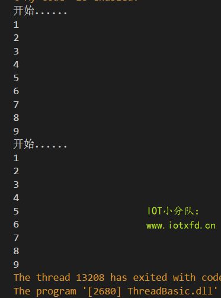 

在这个程序中，我们写了一个`PrintNumbers()`方法，此方法用循环打印数字1~10。然后在`Main()`函数中创建了这个方法所对应的线程并启动。最后在主线程中再次调用`PrintNumbers()`。

**提示：**
正在执行中的程序实例可被称为一个进程。进程由一个或多个线程组成。这意味着当运行程序时，始终有一个执行程序代码的主线程。可以这么理解，主线程从`main()`函数开始执行，除非你在代码中创建了其他线程，要不所有代码都在主线程中执行。

上例中，我们就创建了一个线程，先记下创建线程三步曲：

1. 编写一个方法，把线程所要执行的代码放在里面。
2. 调用`new Thread()`来创建一个线程，并将方法名称当作参数传递进行。
3. 调用方法实例的`Start()`方法来启动线程。

来分析一下结果，第一个开始是主线程中的`PrintNumbers()`所打印出来的，第二个开始是线程`t`打印出来的。按道理来说，两者应该同时执行、交替打印，但由于现在的电脑速度太快，线程`t`还未创建完毕，主线程中的`PrintNumbers()`已经执行完了。要想看到它们同时执行，只需每打印一个数字后延时一小段时间即可。更改代码如下：

```c
static void PrintNumbers()
{
    Console.WriteLine("开始......");
    for(int i=1;i<10;i++)
    {
        Console.WriteLine(i);
        Thread.Sleep(200); //加上这一句
    }
}
static void Main(string[] args)
{
    Thread t=new Thread(PrintNumbers);
    t.Start();
    PrintNumbers();  
}
```

运行结果：

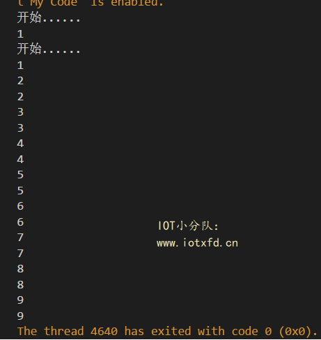 

`Thread.Sleep()`方法让当前所处线程暂停一定时间，也可以说是让线程休眠，它会占用尽可能少的CPU时间。当一个线程暂停，出让了控制权，自然而然，另一个线程就会接手控制权。所以我们会看到上述结果中，两个线程交替打印数字，因为它们每打印一个数字就会休息一会。

### 线程等待

有时，我们需要等待一个线程结束后才能做一些特定事情。将上例稍作更改：

```c
static void PrintNumbers()
{
    Console.WriteLine("开始......");
    for (int i = 1; i <= 5; i++)
    {
        Console.WriteLine(i);
        Thread.Sleep(200);
    }
}
static void Main(string[] args)
{
    Thread t = new Thread(PrintNumbers);
    t.Start();
    Console.WriteLine("线程结束！");
}
```

运行结果：

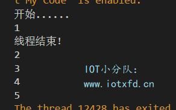 

可以看到，线程才刚开始没多久，就已经打印线程结束了。我们希望在线程结束运行之后再打印线程结束，更改`Main()`函数代码如下：

```c
static void Main(string[] args)
{
    Thread t = new Thread(PrintNumbers);
    t.Start();
    t.Join(); //加上这一句
    Console.WriteLine("线程结束！");
}
```

运行结果：

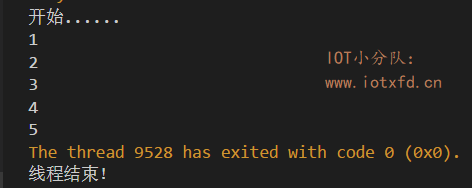 

现在再来看，直到线程运行结束，才打印线程结束。

我们在主程序中调用了`t.Join()`方法，该方法允许我们等待直到线程t完成。当线程t完成后，主程序才会继续运行。借助该技术可以实现在两个线程间同步执行步骤。第一个线程会等待另一个线程完成后再继续执行。第一个线程等待时处于阻塞状态。

### 终止线程

有一个`Thread.Abort`方法可用于关闭线程，但使用这种方法非常危险，且不一定能终止线程，因此不推荐使用这个方法。.NET Framework最新版本为了兼容旧程序虽然还支持这个方法，但机制已变。而.NET Core则已经完全不支持使用这个方法来终止线程了。正确终止线程的方法我们后面再讨论。

\##前台线程和后台线程
更改代码如下：

```
static void PrintNumbers()
{
    Console.WriteLine("开始......");
    for (int i = 1; i <= 10; i++)
    {
        Console.WriteLine(i);
        Thread.Sleep(1000);
    }
}
static void Main(string[] args)
{
    Thread t = new Thread(PrintNumbers);
    t.Start();
    Thread.Sleep(5000);
}
```

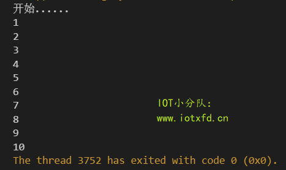 

结果和之前所有程序一样，直到`t`线程结束，程序才结束运行，这里主线程睡眠5秒不会对程序产生任何影响。默认情况下一个线程是前台线程，这意味着程序会等待所有前台线程结束运行后才会关闭。如果是后台线程会是个什么情况呢？

更改`Main()`函数如下：

```c
static void Main(string[] args)
{
    Thread t = new Thread(PrintNumbers);
    t.IsBackground = true; //新添加语句
    t.Start();
    Thread.Sleep(5000);
}
```

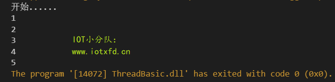 

我们把线程的`IsBackground`属性设置为`true`，使得线程`t`变为后台线程。从运行结果可知，主线程睡眠5秒后程序运行结束，线程`t`也随之被关闭。

总结一下就是：进程会等待所有的前台线程完成后再结束工作，但是如果只剩下后台线程，则会直接结束工作。一个重要注意事项是如果程序定义了一个不会完成的前台线程，主程序并不会正常结束。


### 向线程传递参数

向Thread传递参数有几种方法，下面一一介绍。

#### 通过对象构造函数传递参数

```c
namespace ThreadBasic
{
    class ThreadSample
    {
        private readonly int _iterations;
        public ThreadSample(int iterations)
        {
            _iterations = iterations;
        }
        public void CountNumbers()
        {
            for (int i = 1; i <= _iterations; i++)
            {
                Thread.Sleep(500);
                Console.WriteLine(i);
            }
        }
    }
    class Program
    {
        static void Main(string[] args)
        {   //创建线程所在类实例，并传递数字5
            var sample = new ThreadSample(5);
            //创建线程
            var threadOne = new Thread(sample.CountNumbers);
            threadOne.Start();
        }
    }
}
```

运行结果：

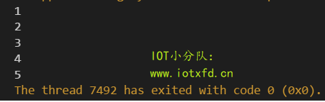 

这一次，我们将线程方法包装在了一个类里面，并通过类的构造函数传递一个参数，以决定线程内部的循环次数。传递数字5，最终线程打印了1~5。这种传递参数的方法比较麻烦，还要为线程专门构建一个类。


#### 通过Thread.Start()方法传递参数

```
static void Main(string[] args)
{
    var t = new Thread(CountNumbers);
    t.Start(5); //参数在此传递
}
static void CountNumbers(object iterations)
{   //将参数强制转换为int
    int iter = (int)iterations;
    for (int i = 1; i <= iter; i++)
    {
        Thread.Sleep(500);
        Console.WriteLine(i);
    }
}
```

运行结果同上。

这次使用`Thread.Start`方法来传递参数。这种方法看似简便，但也相当麻烦。`Start()`方法只接收`object`类型参数，并且只接收一个。为了适应它，线程方法的参数也必须声明为`object`类型。在处理参数之前，必须先进行强制类型转换。


#### 通过lambda表达式传递参数

```
static void Main(string[] args)
{
    var t = new Thread(() => CountNumbers(5));
    t.Start();
}
static void CountNumbers(int iterations)
{
    for (int i = 1; i <= iterations; i++)
    {
        Thread.Sleep(500);
        Console.WriteLine(i);
    }
}
```

运行结果同上。

这次就很完美了，线程方法和平常一样声明，只需要创建线程时使用lambda表达式即可，优美，简单！我们来试试是否可以传递多个参数。

更改代码如下：

```
static void Main(string[] args)
{
    var t = new Thread(() => CountNumbers("Superman", 5));
    t.Start();
}
static void CountNumbers(string name, int iterations)
{
    for (int i = 1; i <= iterations; i++)
    {
        Thread.Sleep(500);
        Console.WriteLine(name + ":" + i);
    }
}
```

运行结果：

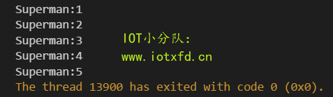 

传递多个参数没有任何问题。


#### 通过lambda表达式的闭包方式传递参数

上例`() => CountNumbers(5)`中，我们直接传递整形常量`5`，那么是不是可以把常量改为局部变量呢？

```
static void Main(string[] args)
{
    int i = 5;
    var t = new Thread(() => CountNumbers(i));
    t.Start();
}
static void CountNumbers(int iterations)
{
    for (int i = 1; i <= iterations; i++)
    {
        Thread.Sleep(500);
        Console.WriteLine(i);
    }
}
```

运行结果：

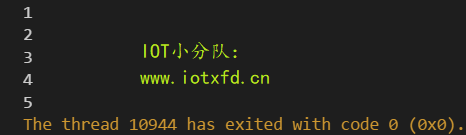 

本质上`() => CountNumbers(i)`是独立于`Main()`方法的另一个方法。而在另一个方法中是无法访问`Main()`方法中的局部变量`i`的。但从程序结果可知，局部变量`i`成功传递给了lambda表达式。**这种在一个方法中访问另一方法中的局部变量的行为方式被称为闭包。**从感观上来说`() => CountNumbers(i)`存在于`Main()`方法之中，访问`Main()`的局部变量合乎常理。但从原理上来讲，两者属于不同的作用域，不能互相访问。可以访问，我们写起程序来当然会方便很多，闭包的实现也是编译器在后台做了一些工作，从而自动帮我们实现的结果。

但需要注意的是，闭包很美丽，但往往会有陷阱。如果一个局部变量同时传递给不同的线程，有可能会出现意想不到的结果。

```c
static void Main(string[] args)
{   //线程1
    int i = 5;
    var t1 = new Thread(() => CountNumbers(i));
    t1.Start();
    //线程2
    i = 10;
    var t2 = new Thread(() => CountNumbers(i));
    t2.Start();
}
static void CountNumbers(int iterations)
{
    Console.WriteLine(iterations);
}
```

运行结果：

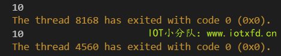 

在线程`t1`中，我们传递进去的明明是5，为什么会打印出10呢？这是因为在`t1`在访问局部变量`i`之前，`i`的值已经被主线程改变为10了。


### lock关键字

#### 使用lock锁定资源

本节将描述如何确保当一个线程使用某些资源时，同时其他线程无法使用该资源。使用如下代码：

```c
class Counter
{
    public int Count { get; private set; }
    public void Increment()
    {
        Count++;
    }
    public void Decrement()
    {
        Count--;
    }
}
class Program
{
    static void Main(string[] args)
    {
        Console.WriteLine("Incorrect counter");
        var c = new Counter();
        var t1 = new Thread(() => TestCounter(c));
        var t2 = new Thread(() => TestCounter(c));
        var t3 = new Thread(() => TestCounter(c));
        t1.Start();
        t2.Start();
        t3.Start();
        t1.Join();
        t2.Join();
        t3.Join();

        Console.WriteLine("Total count: {0}", c.Count);
    }
    static void TestCounter(Counter c)
    {
        for (int i = 0; i < 100000; i++)
        {
            c.Increment();
            c.Decrement();
        }
    }
}
```

本例我们开三个线程同时操作计数器类`Counter`，所做的操作很简单，仅是对它的`Count`属性加1后再减1。也就是说，每次操作过后，`Count`属性值都应该保持为0，最终结果也应该为0。

但很遗憾，我这里第一次运行结果为50，第二次再运行，结果为30。结果不但不为0，还不确定。请参照下图脑补以下场景：

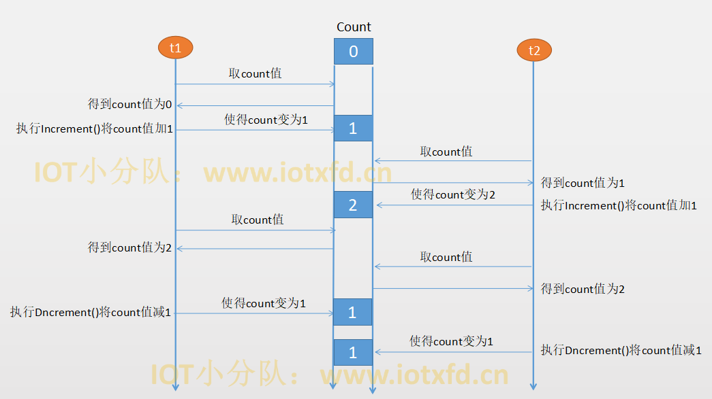 

上图中纵向箭头为时间轴，横向箭头代表事件，依照其位置高低依次发生。

当多个线程同时访问counter对象时，t1得到Counter值为0并增加为1。然后t2得到的值是1并增加为2。t1得到Counter值为2，但在递减操作发生之前，t2线程得到的Counter值也是2。然后t1将2递减为1并保存回Counter中，同时t2也将2递减为1并保存回Counter中。最终Counter值变为了1，从而出现错误。这种情形被称为竞争条件（race condition）。竞争条件是多线程环境中非常常见的导致错误的原因。

为确保不会发生以上情形，必须保证当有线程操作Counter对象时，所有其他线程必须等待直到当前线程完成操作。我们可以使用`lock`关键字来实现这种行为。如果锁定了一个对象，需要访问该对象的所有其他线程则会处于阻塞状态，并等待直到该对象解除锁定。当然这也可能会导致严重的性能问题，我们会在后面章节进行讨论。

现在我们给Counter加把锁，将`Counter`类代码修改如下：

```c
class Counter
{
    private readonly object _syncRoot = new object(); 
    public int Count { get; private set; }
    public void Increment()
    {
        lock (_syncRoot)
        {
            Count++;
        }
    }
    public void Decrement()
    {
        lock (_syncRoot)
        {
            Count--;
        }
    }
}
```

现在运行程序，就可以得到正确结果了。需要注意的是，lock并不是用于Counter对象，而是单独声明一个变量来lock。


### 死锁（deadlock）

死锁是指两个或两个以上的进程在执行过程中，由于竞争资源或者由于彼此通信而造成的一种阻塞的现象，若无外力作用，它们都将无法推进下去。此时称系统处于死锁状态或系统产生了死锁，这些永远在互相等待的进程称为死锁进程。打个比方，朝鲜跟美国说：“你必须先解除制裁我才弃核”；而美国回答说：“你必须先弃核我才解除制裁”。如果双方都不愿先让一步，结果就是局面僵死在那了。

```c
static void Main(string[] args)
{
    object lock1 = new object();
    object lock2 = new object();
    new Thread(() => LockTooMuch(lock1, lock2)).Start();
    lock (lock2)
    {
        Console.WriteLine("局面僵持");
        Thread.Sleep(1000);
        lock (lock1)
        {
            Console.WriteLine("双方和解");
        }
    }
}
static void LockTooMuch(object lock1, object lock2)
{
    lock (lock1)
    {
        Thread.Sleep(1000);
        lock (lock2){};
    }
}
```

运行结果：
`局面僵持`

我们来看看上面程序的执行过程

1. 线程`LockTooMuch`锁定`lock1`后休眠一秒
2. 主线程锁定`lock2`，然后休眠一秒
3. 线程`LockTooMuch`睡醒后妄图给`lock2`上锁，但现在`lock2`正由主线程锁定中，只能阻塞等待中
4. 主线程睡醒后妄图给`lock1`上锁，但现在`lock1`正由`LockTooMuch`锁定中，只能阻塞等待

最后结果：线程`LockTooMuch`和主线程互相等待对方先释放自己的资源，局面僵持。

要解决这个问题，可以使用Monitor类。更改代码如下：

```c
static void Main(string[] args)
{
    object lock1 = new object();
    object lock2 = new object();
    new Thread(() => LockTooMuch(lock1, lock2)).Start();
    lock (lock2)
    {
        Console.WriteLine("局面僵持");
        Thread.Sleep(1000);
        if(Monitor.TryEnter(lock1,TimeSpan.FromSeconds(5)))
        {
            Console.WriteLine("主线程胜利");
        }
        else
        {
            Console.WriteLine("主线程让步");
        }
    }
}
static void LockTooMuch(object lock1, object lock2)
{
    lock (lock1)
    {
        Thread.Sleep(1000);
        lock (lock2){};
        Console.WriteLine("LockTooMuch线程胜利");
    }
```

运行结果：

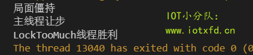 

`Monitor.TryEnter()`方法，使得主线程锁定`lock1` 5秒钟，5秒钟还未见`lock1`释放则放弃锁定，返回`false`。从程序运行结果可知，由于主线程的让步，最终`LockTooMuch`获得资源。


### 处理异常

本节讲述了在线程中如何正确地处理异常。在线程中始终使用try/catch代码块是非常重要的，因为不可能在线程代码之外来捕获异常。

执行以下代码：

```c
static void Main(string[] args)
{
    try
    {
        var t = new Thread(BadFaultyThread);
        t.Start();
    }
    catch 
    {
        Console.WriteLine("此处不可达!");
    }
}

static void BadFaultyThread()
{
    Console.WriteLine("开始BadFaultyThread线程...");
    Thread.Sleep(TimeSpan.FromSeconds(2));
    throw new Exception("BadFaultyThread抛出的异常!");
}
```

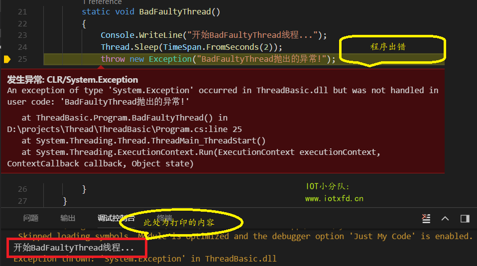 

程序运行出错，在主线程中未能捕获支线程中所发生的异常。更改代码如下：

```c
static void Main(string[] args)
{
    var t = new Thread(FaultyThread);
    t.Start();
}
static void FaultyThread()
{
    try
    {
        Console.WriteLine("开始FaultyThread线程...");
        Thread.Sleep(TimeSpan.FromSeconds(1));
        throw new Exception("FaultyThread抛出的异常!");
    }
    catch (Exception ex)
    {
        Console.WriteLine("Exception handled: {0}", ex.Message);
    }
}
```

运行结果：

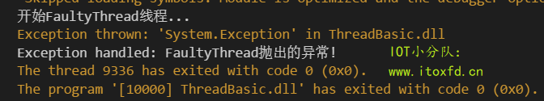 

可以看到，这次正常捕获异常。一般来说，不要在线程中抛出异常，而是在线程代码中使用try/catch代码块。


## 2.线程同步

如上篇文章所看到的，多个线程同时使用共享对象会造成很多问题。同步这些线程使得对共享对象的操作能够以正确的顺序执行是非常重要的。在篇文章我们遇到了一个叫作竞争条件的问题。导致这问题的原因是多线程的执行并没有正确同步。当一个线程执行递增递减操作时，其他线程需要依次等待。这种常见问题通常被称为**线程同步**。

有多种方式来实现线程同步。首先，如果无须共享对象，那么就无须进行线程同步。令人惊奇的是大多数时候可以通过重新设计程序来移除共享状态，从而去掉复杂的同步构造。请尽可能避免在多个线程间使用单一对象。

如果必须使用共享状态，第二种方式是只使用**原子**操作。这意味着一个操作只占用一个量子的时间，一次就可以完成。所以只有当前操作完成后，其他线程才能执行其他操作。因此，你无须实现其他线程等待当前操作完成，这就避免了使用锁，也排除了死锁的情况。

如果上面的方式不可行，并且程序的逻辑更加复杂，那么我们不得不使用不同的方式来协调线程。方式之一是将等待的线程置于**阻塞**状态。当线程处于阻塞状态时，只会占用尽可能少的CPU时间。然而，这意味着将引入至少一次所谓的**上下文切换**（context switch）。**上下文切换是指操作系统的线程调试器。该调度器会保存等待的线程的状态，并切换到另一个线程，依次恢复等待的线程的状态。这需要消耗相当多的资源**。然而，如果线程要被挂起很长时间，那么这样做是值得的。这种方式又被称为**内核模式**（kernel-mode），因为只有操作系统的内核才能阻止线程使用CPU的时间。

万一线程只需要等待一小段时间，最好只是简单的等待，而不用将线程切换到阻塞状态。虽然线程等待时会浪费CPU时间，但我们节省了上下文切换耗费的CPU时间。该方式又被称为**用户模式**（user-mode）。该方式非常轻量，速度很快，但如果线程需要等待较长时间则会浪费大量的CPU时间。

为了利用好这两种方式，可以使用**混合模式**（hybrid）。混合模式先尝试使用用户模式等待，如果线程等待了足够长的时间，则会切换到阻塞状态以节省CPU资源。

在本间中我们将介绍线程同步这一知识点。我们将讲解如何执行原子操作，[以及如何使用.NET](http://xn--onq9jke06pfripz8b.net/) Core中现有的同步方式。


### 执行基本的原子操作

```
using System;
using System.Threading;

namespace Sync
{
    class Program
    {
        class Counter
        {
            private int _count;
            public int Count { get { return _count; } }
            public void Increment()
            {
                Interlocked.Increment(ref _count);
            }
            public void Decrement()
            {
                Interlocked.Decrement(ref _count);
            }
        }
        static void Main(string[] args)
        {
            var c = new Counter();
            var t1 = new Thread(() => TestCounter(c));
            var t2 = new Thread(() => TestCounter(c));
            var t3 = new Thread(() => TestCounter(c));
            t1.Start();
            t2.Start();
            t3.Start();
            t1.Join();
            t2.Join();
            t3.Join();

            Console.WriteLine("Total count: {0}", c.Count);
        }
        static void TestCounter(Counter c)
        {
            for (int i = 0; i < 100000; i++)
            {
                c.Increment();
                c.Decrement();
            }
        }
    }
}
```

运行结果：`0`

在上一篇文章中，我们通过锁定对象解决了这个问题。在一个线程获取旧的计数器值并计算后赋予新的值之前，其他线程都被阻塞了。然而，如果我们采用上述方式执行该操作，中途不能停止。而借助于`Interlocked`类，我们无需锁定任何对象即可获取到正确的结果。`Interlocked`提供了`Increment`、`Decrement`和`Add`等基本数学操作的原子方法，从而帮助我们在编写`Counter`类时无需使用锁。

### 使用Mutex类

Mutex，在单片机操作系统里经常会提到这个词，中文名互斥量，说明它是属于操作系统级别的机制。互斥量是一种原始的同步方式，一般用于进程间的同步。我们可以用它来实现同一程序，同一时间只能运行一个副本。输入如下代码：

```c
static void Main(string[] args)
{
    const string MutexName="iotxfd";
    using (var m=new Mutex(false,MutexName))
    {
        if(!m.WaitOne(TimeSpan.FromSeconds(10),false))
        {
            Console.WriteLine("第二个实例正在运行中!");
        }
        else
        {
            Console.WriteLine("运行中......");
            Console.ReadLine();
            m.ReleaseMutex();
        }
    }
}
```

这个程序需要使用`.exe`文件来测试，如果使用Visual Studio来写代码，还比较方便，但如果用的是Visual Studio Code则有些麻烦。下面跟我一起做。

1. 打开**Sync.csproj**文件（在根目录下，文件名根据你所建项目名称，后缀名是`.csproj`就行了）。在`<PropertyGroup>`节点下添加如下项：
   `<RuntimeIdentifiers>win10-x64</RuntimeIdentifiers>`
   注意，你的操作系统是win10才能这样写。

最后整个**Sync.csproj**文件的代码大概是以下的样子：

```xml
<Project Sdk="Microsoft.NET.Sdk">

  <PropertyGroup>
    <OutputType>Exe</OutputType>
    <TargetFramework>netcoreapp2.0</TargetFramework>
    <RuntimeIdentifiers>win10-x64</RuntimeIdentifiers>
  </PropertyGroup>

</Project>
```

2.打开终端，输入如下命

```
dotnet publish -c release -r win10-x64
```

此命令会发布应用程序并生成`exe`文件。

3.打开`\bin\release\netcoreapp2.0\win10-x64`目录，找到`Sync.exe`文件。

最终，我们在vscode得到了`exe`文件。


运行程序：

1. 在Windows资源管理器中双击*Sync.exe*文件，打开第一个控制台窗口，这时显示`运行中......`。
2. 再次双击*Sync.exe*文件，打开第二个控制台窗口，但未显示任何东西，说明它在等待中。
3. 在10秒内如果在第一个控制台窗口中使用回车结束程序，则第二个控制台窗口显示`运行中......`。
4. 如果一直不停止第一个程序的运行，则第二个程序在10秒后会自动关闭。

**注意：**具名的互斥量是全局的操作系统对象！请务必正确关闭互斥量。最好是使用using代码块来包裹互斥量对象。

Mutex跟后面的很多同步类使用起来非常相似，首先使用`WaitOne`来获取许可，如果此时别的线程或进程已经调用了`WaitOne`且没有释放，那么线程或进程将进入阻塞状态。当别的线程或进程调用`ReleaseMutex`后释放了Mutex资源，那么此线程或进程就获取许可从而可以继续执行程序了。

说白了，Mutex和lock类似，`WaitOne`就是上锁，`ReleaseMutex`就是解锁。但是需要注意的是Mutex的运行速度和其它同步类相比会慢很多，以前我使用的时候有这样的感受。所以如果有替代品，尽量就不要用它了。


### 使用SemaphoreSlim类

Semaphore也是单片机操作系统里经常提到的词，中文名信号量，可用于在线程间传递信号。SemaphoreSlim意为信号量的轻量级版本。先执行以下程序：

```c
static void Main(string[] args)
{
    for (int i = 1; i <= 6; i++)
    {
        string threadName = "Thread " + i;
        int secondsToWait = 2 * i;
        var t = new Thread(() => AccessDatabase(threadName, secondsToWait));
        t.Start();
    }
}
static SemaphoreSlim _semaphore = new SemaphoreSlim(4);
static void AccessDatabase(string name, int seconds)
{
    Console.WriteLine("{0} 等待访问资源", name);
    _semaphore.Wait();
    Console.WriteLine("{0} 获准访问资源", name);
    Thread.Sleep(TimeSpan.FromSeconds(seconds));
    Console.WriteLine("{0} 结束", name);
    _semaphore.Release();
}
```

运行结果：

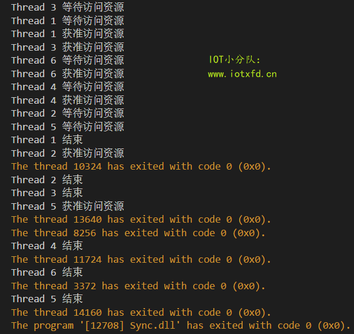 

先来看看这句代码：

```c
static SemaphoreSlim _semaphore = new SemaphoreSlim(4);
```

这里创建了一个`SemaphoreSlim`，参数`4`表示同时允许4条线程访问资源。

从运行结果可知，刚开始线程1、3、6、4获准访问资源，2、5等待，1线束后2顶上，3结束后5顶上，直到全部线程访问结束。

SemaphoreSlim的`Wait`方法用于获取许可，未获许可则阻塞线程，`Release`则用来释放许可。换个方式说就是：申请使用资源的线程`Wait`（等待）正在使用资源的线程`Release`（释放）信号。它的使用方式和Mutex类似，区别在于SemaphoreSlim可允许多条线程访问资源并控制同时访问的数量。

> **提示：**
> 这里我们使用了混合模式，其允许我们在等待时间很短的情况下无需使用上下文切换。然而，有一个叫作Semaphore的SemaphoreSlim类的老版本。该版本使用纯粹的内核时间（kernel-time）方式。一般没必要使用它，除非是非常重要的场景。我们可以创建一个具名的semaphore，就像一个具名的mutex一样，从而在不同的程序中同步线程。SemaphoreSlime并不使用Windows内核信号量，而且也不支持进程间同步。所以在跨程序同步的场景下可以使用Semaphore。


### 使用AutoResetEvent类

先运行以下实例：

```c
private static AutoResetEvent _workerEvent = new AutoResetEvent(false);
private static AutoResetEvent _mainEvent = new AutoResetEvent(false);
static void Process(int seconds)
{
    Console.WriteLine("thread：开始长时间工作...");
    Thread.Sleep(TimeSpan.FromSeconds(seconds));//工作
    Console.WriteLine("thread：工作已完成!");
    _workerEvent.Set();//释放
    Console.WriteLine("threard:等待主线程完成它的工作");
    _mainEvent.WaitOne();//等待
    Console.WriteLine("thread：开始第二个操作...");
    Thread.Sleep(TimeSpan.FromSeconds(seconds));
    Console.WriteLine("thread：工作已完成!");
    _workerEvent.Set();//释放
}
static void Main(string[] args)
{
    var t = new Thread(() => Process(10));
    t.Start();
    Console.WriteLine("main：等待另一个线程完成工作");
    _workerEvent.WaitOne();//等待
    Console.WriteLine("main：线程的第一个操作已经完成!");
    Console.WriteLine("main：在主线程执行一个操作");
    Thread.Sleep(TimeSpan.FromSeconds(5));//工作
    _mainEvent.Set();//释放
    Console.WriteLine("main：现在在第二个线程中执行第二个操作");
    _workerEvent.WaitOne();//等待
    Console.WriteLine("main：第二个操作已经完成");
}
```

运行结果：

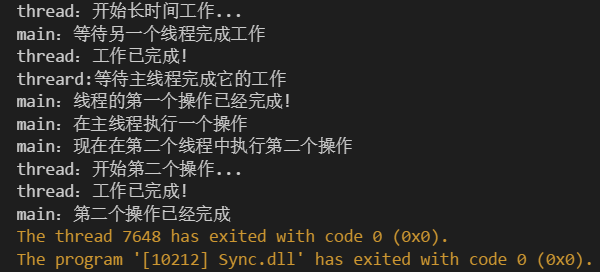 

运行过程我画了张图，图的左边是主线程，右边是`Process`线程。运行过程跟着箭头走，应该能看懂。

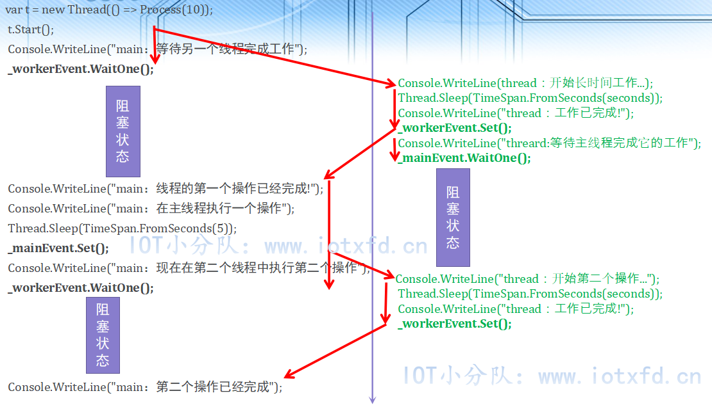

当主程序启动时，定义了两个AutoResetEvent实例。其中`_workerEvent`是从子线程向主线程发信号，`_mainEvent`是从主线程向子线程发信号。我们向AutoResetEvent构造方法传入false，定义了两个实例的初始状态为unsignatled。这意味着任何线程调用这两个对象中的任何一个的WaitOne将会被阻塞，直到我们调用了Set方法。如果初始事件状态为true，那么AutoResetEvent实例状态为signaled，如果线程调用WaitOne方法则会被立即处理。然后事件状态自动变为unsignaled，所以需要再对该实例调用一次Set方法，以便让其他的线程对该实例调用WaitOne方法从而继续执行。

然后我们创建了第二个线程，其会执行第一个操作10秒钟，然后等待从第二个线程发出信号。该信号意味着第一个操作已经完成。现在第二个线程在等待主线程的信号。我们对主线程做了一些附加工作，并通过调用_mainEvent.Set方法发送了一个信号。然后等待从第二个线程发出的另一个信号。

AutoResetEvent类采用的是内核时间模式，所以等待时间不能太长。使用ManualResetEventSlim类更好，因为它使用的是混合模式。

### 使用ManualResetEventSlim类

AutoResetEvent事件一次只允许一个线程执行，而ManualResetEventSlim事件一次允许多个线程执行。

```
static ManualResetEventSlim _mainEvent = new ManualResetEventSlim(false);
static void TravelThroughGates(string threadName, int seconds)
{
    Console.WriteLine("{0} 睡觉去了", threadName);
    Thread.Sleep(TimeSpan.FromSeconds(seconds));
    Console.WriteLine("{0} 等着开门!", threadName);
    _mainEvent.Wait();
    Console.WriteLine("{0} 冲进大门!", threadName);
}

static void Main(string[] args)
{
    var t1 = new Thread(() => TravelThroughGates("Thread 1", 5));
    var t2 = new Thread(() => TravelThroughGates("Thread 2", 6));
    var t3 = new Thread(() => TravelThroughGates("Thread 3", 12));
    t1.Start();
    t2.Start();
    t3.Start();
    Thread.Sleep(TimeSpan.FromSeconds(6));
    Console.WriteLine("main：芝麻开门!");
    _mainEvent.Set();
    Thread.Sleep(TimeSpan.FromSeconds(2));
    _mainEvent.Reset();
    Console.WriteLine("main：关门!");
    Thread.Sleep(TimeSpan.FromSeconds(10));
    Console.WriteLine("main：开门几秒!");
    _mainEvent.Set();
    Thread.Sleep(TimeSpan.FromSeconds(2));
    Console.WriteLine("main：关门!");
    _mainEvent.Reset();
}
```

运行结果：

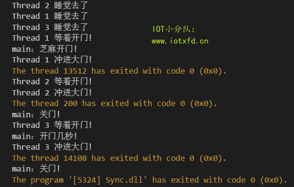 

我画了张图，图解了程序的运行过程：

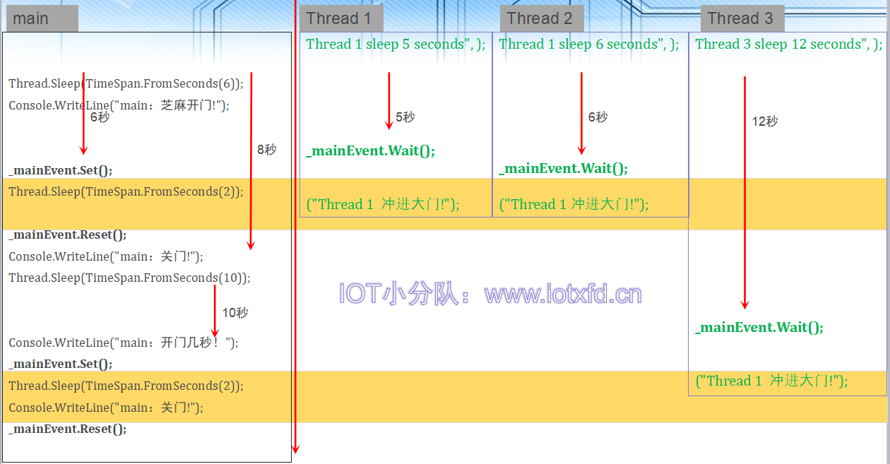

图中黄色区域表示开门时间。

- `Wait`方法：阻塞线程，等待其它线程调用了Set方法方能继续运行。
- `Set`方法：开门，允许调用了`Wait`的ManualResetEventSlim类通过
- `Reset`方法：关门

ManualResetEventSlim的整个工作方式有点像人群通过大门。而AutoResetEvent事件像一个旋转门，一次只允许一人通过。ManualResetEventSlim的`Set`方法相当于打开大门，从而允许所有准备好的线程接收信号并继续工作。而`_mainEvent.Reset`相当于关闭了大门。


### 使用CountDownEvent类

```
static CountdownEvent _countdown = new CountdownEvent(2);
static void PerformOperation(string message, int seconds)
{
    Thread.Sleep(TimeSpan.FromSeconds(seconds));
    Console.WriteLine(message);
    _countdown.Signal();
}
static void Main(string[] args)
{
    Console.WriteLine("开始两个operations");
    var t1 = new Thread(() => PerformOperation("Operation 1 已完成", 4));
    var t2 = new Thread(() => PerformOperation("Operation 2 已完成", 8));
    t1.Start();
    t2.Start();
    _countdown.Wait();
    Console.WriteLine("两个operations都已经完成");
    _countdown.Dispose();
}
```

运行结果：

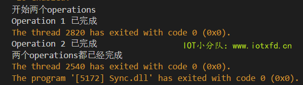 

当主程序启动时，通过以下语句创建了一个CountdownEvent实例：

```c
static CountdownEvent _countdown = new CountdownEvent(2);
```

其构造函数中的`2`指定了当两个操作完成时会发出信号。然后我们启动了两个线程，当它们执行完成后会使用`_countdown.Signal();`发出信号。一旦第二个线程完成，主线程会从等待CountDownEvent的状态中返回并继续执行。针对需要等待多个异步操作完成的情形，使用该方式是非常便利的。

然而这有一个重大的缺点。如果调用`_countdown.Signal()`没达到指定的次数，那么`_countdown.Wait()`将一直等待。请确保使用CountDownEvent时，所有线程完成后都要调用`Signal`方法。


### 使用Barrier类

`Barrier`类用于组织多个线程及时在某个时刻碰面。其提供了一个回调函数，每次线程调用了`SignalAndWait`方法后该回调函数会被执行。

```
static Barrier _barrier = new Barrier(2, b => Console.WriteLine("第 {0} 场结束",b.CurrentPhaseNumber + 1));
static void PlayMusic(string name, string message, int seconds)
{
    for (int i = 1; i < 3; i++)
    {
        Console.WriteLine("--------------------------------------");
        Thread.Sleep(TimeSpan.FromSeconds(seconds));
        Console.WriteLine("{0} 开始 {1}", name, message);
        Thread.Sleep(TimeSpan.FromSeconds(seconds));
        Console.WriteLine("{0} 结束 {1}", name, message);
        _barrier.SignalAndWait();
    }
}
static void Main(string[] args)
{
    var t1 = new Thread(() => PlayMusic("吉它手", "独奏", 5));
    var t2 = new Thread(() => PlayMusic("歌手", "歌唱", 2));
    t1.Start();
    t2.Start();
}
```

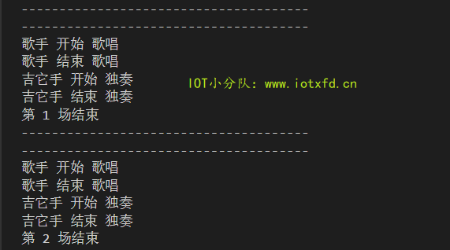 

这里需要分析下Barrier类的构造函数，原型为：

```c
public Barrier(int participantCount, Action<Barrier> postPhaseAction);
```

- 参数`participantCount`：参与线程的数量
- 参数`postPhaseAction`：每个阶段完成后所执行的`Action`。关于`Action`请参考《[Lambda表达式 - 委托进化史](http://iotxfd.cn/article/CSharp Reference/[01]delegate evolution.html)》这篇文章。

要理解这个程序还有点费劲，先改下代码，屏敝`Main`函数中的两句代码，如下所示：

```c
static void Main(string[] args)
{
    var t1 = new Thread(() => PlayMusic("吉它手", "独奏", 5));
    // var t2 = new Thread(() => PlayMusic("歌手", "歌唱", 2));
    t1.Start();
    // t2.Start();
}
```

看看运行结果：

```
--------------------------------------
吉它手 开始 独奏
吉它手 结束 独奏
```

程序显示完这些内容就停在那了，然后就没有然后了。显然单个线程发两条`_barrier.SignalAndWait()`指令并不会结束Barrier的等待状态。而必须是两条线程各自发了一条`_barrier.SignalAndWait()`才能结束等待状态并执行回调函数。

Barrier在线程程迭代运算中非常朋用，可以在每个迭代结束前执行一些计算。当最后一个线程调用`SignalAndWait`方法时可以在迭代结束时进行交互。


### 使用ReaderWriterLockSlim类

ReaderWriterLockSlim代表了一个管理资源访问的锁，允许多个线程同时读取，以及独占写。

运行如下代码：

```c
using System;
using System.Threading;
using System.Collections.Generic;

namespace Sync
{
    class Program
    {
        static ReaderWriterLockSlim _rw = new ReaderWriterLockSlim();
        static Dictionary<int, int> _items = new Dictionary<int, int>();
        static void Read(string threadName)
        {
            while (true)
            {
                try
                {
                    _rw.EnterReadLock();
                    foreach (var key in _items.Keys)
                    {
                        Console.WriteLine("{0}读取键值{1}", threadName, key);
                        Thread.Sleep(500);
                    }
                    Console.WriteLine("{0}完成一次读取", threadName);
                }
                finally
                {
                    _rw.ExitReadLock();
                }
            }
        }
        static void Write(string threadName)
        {
            while (true)
            {
                try
                {
                    int newKey = new Random().Next(250);
                    //稍后要进行一个读取操作，以判断新键是否已存在，使用可升级读锁
                    _rw.EnterUpgradeableReadLock();
                    if (!_items.ContainsKey(newKey))
                    {
                        try
                        {   //确定要进行写入操作后再使用写锁
                            _rw.EnterWriteLock();
                            _items[newKey] = 1;
                            Console.WriteLine("{0}：向Dictionary加入新键{1}", threadName, newKey);
                        }
                        finally
                        {
                            _rw.ExitWriteLock();
                        }
                    }
                    Thread.Sleep(1000);
                }
                finally
                {
                    _rw.ExitUpgradeableReadLock();
                }
            }
        }
        static void Main(string[] args)
        {
            new Thread(() => Read("Read Thread 1")) { IsBackground = true }.Start();
            new Thread(() => Read("Read Thread 2")) { IsBackground = true }.Start();
            new Thread(() => Read("Read Thread 3")) { IsBackground = true }.Start();

            new Thread(() => Write("Write Thread 1")) { IsBackground = true }.Start();
            new Thread(() => Write("Write Thread 2")) { IsBackground = true }.Start();
            Thread.Sleep(TimeSpan.FromSeconds(3));
        }
    }
}
```

运行结果：

```
Read Thread 3完成一次读取
Read Thread 1完成一次读取
Read Thread 2完成一次读取
Write Thread 1：向Dictionary加入新键190
Read Thread 2读取键值190
Read Thread 1读取键值190
Read Thread 3读取键值190
Read Thread 3完成一次读取
Read Thread 3读取键值190
Read Thread 1完成一次读取
Read Thread 1读取键值190
Read Thread 2完成一次读取
Read Thread 2读取键值190
Read Thread 2完成一次读取
Read Thread 1完成一次读取
Read Thread 3完成一次读取
Write Thread 1：向Dictionary加入新键82
Read Thread 1读取键值190
Read Thread 3读取键值190
Read Thread 2读取键值190
Read Thread 2读取键值82
Read Thread 3读取键值82
Read Thread 1读取键值82
Read Thread 1完成一次读取
Read Thread 2完成一次读取
Read Thread 3完成一次读取
Write Thread 1：向Dictionary加入新键142
Read Thread 3读取键值190
Read Thread 1读取键值190
Read Thread 2读取键值190
Read Thread 2读取键值82
Read Thread 3读取键值82
Read Thread 1读取键值82
```

当主程序启动时，同时运行了三个线程来从字典中读取数据，还有另外两个线程向该字典中写入数据。我们使用ReaderWriterLockSlim类来实现线程安全，该类专为这样的场景而设计。

在本例中，我们先生成一个随机数。然后获取读锁并检查该数是否存在于字典的键集合中。如果不存在，将读锁更新为写锁，然后将该新键加入到字典中。始终使用try/finally代码块来确保在捕获锁后一定会释放锁，这是一项好的实践。所有线程都被创建为后台线程，主线程在所有后台线程完成后会等待3秒。

先看看使用了哪些锁：

- EnterReadLock：进入读锁，允许多线程读取数据。
- ExitReadLock：退出读锁
- EnterUpgradeableReadLock：进入可升级读锁
- ExitUpgradeableReadLock：退出可升级读锁
- EnterWriteLock：进入写锁，在被释放前会阻塞其他线程的所有操作
- ExitWriteLock：退出写锁

这里使用了两种锁:读锁允许多线程读取数据而不会阻塞其他线程，写锁在被释放前会阻塞其他线程的所有操作。示例代码中，在写操作前会去判断写入的键是否已经存在，这是一个读操作，如果此时就使用写锁，将会阻塞所有线程，从而浪费大量的时间，此时使用可升级为写的读锁`EnterUpgradeableReadLock`进行读取，如果发现新键不存在，将要写入，再使用`EnterWriteLock`升级锁，然后快速执行一次写操作。

### 总结

讲了这么多同步类，下面做一个总结：

- **lock**：用于简单同步
- **Mutex**：一般用于进程间同步
- **SemaphoreSlim**：可指定同时访问的线程数量
- **AutoResetEvent**：采用的是内核时间模式，所以等待时间不能太长。
- **ManualResetEventSlim**：在释放锁时可让所有在等待的线程一起唤醒
- **CountDownEvent**：可等待指定数量的线程发信号后再解锁
- **Barrier**： 可等待指定数量的不同类型线程发信号后执行回调函数
- **ReaderWriterLockSlim**：用于多线程读，独占写


## 3.使用线程池


### 简介

在之前的章节中我们讨论了创建线程和线程协作的几种方式。现在考虑另一种情况，即只花费极少的时间来完成创建很多异步操作。创建线程是昂贵的操作，所以为每个短暂的异步操作创建线程会产生显著的开销。

为了解决该问题，有一个常用的方式叫做**池**（pooling）。线程池可以成功地适应于任何需要大量短暂的开销大的资源的情形。我们事先分配一定的资源，将这些资源放入到资源池。每次需要新的资源，只需从池中获取一个，而不用创建一个新的。当该资源不再被使用时，就将其返回到池中。

**.NET线程池**是该概念的一种实现。通过System.Threading.ThreadPool类型可以使用线程池。线程池是受 **.NET通用语言运行时**（Common Language Runtime，简称CLR）管理的。这意味着每个CLR都有一个线程池实例。ThreadPool类型拥有一个QueueUserWorkItem静态方法。该静态方法接受一个委托，代表用户自定义的一个异步操作。在该方法被调用后，委托会进入到内部队列中。如果池中没有任何线程，将创建一个新的**工作线程**（worker thread），并将队列中第一个委托放入到该工作线程中。

如果想线程池中放入新的操作，当之前的所有操作完成后，很可能只需重用一个线程来执行这些新的操作，当之前的所有操作完成后，很可能只需重用一个线程来执行这些新的操作。然而，如果放置新的操作过快，线程池将创建更多的线程来执行这些操作。创建线程的数量是有限制的，在这种情况下新的操作将在队列中等待直到线程池中的工作线程有能力来执行它们。

> **提示：** 保持线程中的操作都是短暂的是非常重要的。不要在线程池中放入长时间运行的操作，或者阻塞工作线程。这将导致所有工作线程变得繁忙，从而无法服务用户操作。这会导致性能问题和非常难以调试的错误。

当停止向线程池中放置新操作时，线程池最终会删除一定时后过期的不再使用的线程。这将释放所有那些不再需要的系统资源。

**再次强调，线程池的用途是执行运行时间短的操作。**使用线程池可以减少并行度耗费及节省操作系统资源。我们只使用较少的线程，但是以比平常的速度来执行异步操作，使用一定数量的可用的工作线程批量处理这些操作。如果操作能快速地完成则比较适用线程池，但是执行长时间运行的计算密集型操作则会降低性能。

另一个重要事情是在ASP.NET应用程序中使用线程池时要相当小心。ASP.NET基础设施使用自己的线程池，如果在线程池中浪费所有的工作线程，Web服务器将不能够服务新的请求。在ASP.NET中只推荐使用输入/输出密集型的异步操作，因为其使用了一个不同的方式，叫做**I/O线程**。我们将在之后讨论I/O线程。

> **注意：** 线程池中的工作线程都是后台线程。这意味着当所有的前台线程（包括主程序线程）完成后，所有的后台线程将停止工作。

在本章中，我们将学习使用线程池来执行异步操作。本章将覆盖将操作放入线程池的不同方式，以及如何取消一个操作，并防止其长时间运行。


### 在线程池中调用委托

本节将展示在线程池中如何异步地执行委托。另外，我们将讨论一个叫做**异步编程模型**（Asynchronous Programming Model，简称APM）的方式，这是.NET历史中第一个异步编程模式。需要注意，.NET Core已经不再支持使用这种方式进行异步编程。需要在Visual Studio里使用.NET Framework的控制台程序来编译运行以下代码。

```c
private delegate string RunOnThreadPool(out int threadId);
static void Main(string[] args)
{
    int threadId = 0;
    RunOnThreadPool poolDelegate = Test;

    var t = new Thread(() => Test(out threadId));
    t.Start();
    t.Join();
    Console.WriteLine("线程 id: {0}", threadId);

    IAsyncResult r = poolDelegate.BeginInvoke(out threadId,Callback, "委托异步调用");
    r.AsyncWaitHandle.WaitOne();

    string result = poolDelegate.EndInvoke(out threadId, r);
    Console.WriteLine("线程池工作线程ID: {0}", threadId);
    Console.WriteLine(result);
    Thread.Sleep(TimeSpan.FromSeconds(2));
    Console.ReadLine();
}

private static void Callback(IAsyncResult ar)
{
    Console.WriteLine("开始执行回调函数...");
    Console.WriteLine("传递给回调函数的state: {0}", ar.AsyncState);
    Console.WriteLine("是否线程池中的线程: {0}",Thread.CurrentThread.IsThreadPoolThread);
    Console.WriteLine("线程池工作线程ID: {0}",Thread.CurrentThread.ManagedThreadId);
}

private static string Test(out int threadId)
{
    Console.WriteLine("Starting...");
    Console.WriteLine("是否线程池中的线程: {0}",Thread.CurrentThread.IsThreadPoolThread);
    Thread.Sleep(TimeSpan.FromSeconds(2));
    threadId = Thread.CurrentThread.ManagedThreadId;
    return string.Format("线程池工作线程ID: {0}", threadId);
}
```

运行结果：

```
Test：启动...
Test：是否线程池中的线程: False
Main：线程 id: 3
Test：启动...
Test：是否线程池中的线程: True
Main：线程池工作线程ID: 4
Main：Test：线程池工作线程ID: 4
Callback：开始执行回调函数...
Callback：传递给回调函数的state: 委托异步调用
Callback：是否线程池中的线程: True
Callback：线程池工作线程ID: 4
```

说实在的，这种编程方式挺烧脑。微软给出的网络编程示例也是类似这种方式，更加烧脑、复杂、麻烦。当然这种方式已经淘汰，后面就舒服多了。

在此示例中，线程的第一次启动是通过传统方式创建的，从结果可知，它并没有使用线程池。线程的第二次启动通过调用方法所对应委托的`BeginInvoke`方法来进行的，它启用了线程池。线程工作完毕后自动调用被作为参数的回调函数`Callback`。

当需要异步操作的结果时，可以使用`BeginInvoke`方法调用返回的result对象。我们可以使用result对象的`IsCompleted`属性轮询结果。但在本例中，使用的是`AsyncWaitHandle`属性来等待直到操作完成。当操作完成后，会得到一个结果，可以通过委托调用`EndInvoke`方法，将`IAsyncResult`对象传递给委托参数。

> **提示：** 事实上使用`AsyncWaitHandle`并不是必要的。如果注释掉`r.AsyncWaitHandle.WaitOne()`，代码照样可以成功运行，因为`EndInvoke`方法事实上会等待异步操作完成。调用`EndInvoke`方法（或者针对其他异步API的`EndOperationName`方法）是非常重要的，因为该方法会将任何未处理的异常抛回到调用线程中。当使用这种异步API时，请确保始终调用了`Begin`和`End`方法。

当操作完成后，传递给`BeginInvoke`方法的回调函数将被放置到线程池中，确切地说是一个工作线程中。如果在Main方法定义的结尾注释掉`Thread.Sleep`方法调用，回调函数将不会被执行。这是因为当主线程完成后，所有的后台线程都被停止，包括该回调函数。对委托和回调函数的异步调用很可能会被同一个工作线程执行。通过工作线程ID可以容易地看出。

使用`BeginOperationName`/`EndOperationName`方法和.NET中的`IAsyncResult对象等方式被称为异步编程模型（或APM模式），这样的方法对被称为异步方法。该模式也被应用于多个.NET类库的API中，但在现代编程中，更推荐使用**任务并行库**（Task Parallel Library，简称TPL）来组织异步API。之后会讨论。


### 多线程访问UI

多线程访问UI可以说是Windows应用程序编程的一门必修课。上述例子正好使用Visual Studio编程，在这里顺便就把这个话题给讲了。

打开Visual Studio，新建一个Windows应用程序（vs2017中是Windows窗体应用）项目。在**工具箱**的**所有Windows窗体**栏中拖一个`ProgressBar`控件到窗体上。然后再拖动一个按钮控件到窗体上。界面如下图所示：

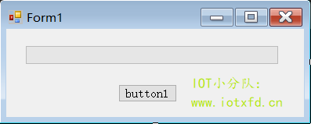 


### 在主线程更新ProgressBar

双击按钮生成`button1_Click`事件，在代码窗口输入如下代码：

```c
private void button1_Click(object sender, EventArgs e)
{
    int percent = 0;
    while (percent <= 100)
    {
        progressBar1.Value = percent;
        Thread.Sleep(TimeSpan.FromSeconds(0.5));
        percent += 5;
    }
}
```

运行程序，点击按钮，程序正常运行，但这时如果用鼠标试图拖动窗体，是没办法移动窗体的。你在进度条更新期间无法做任何事，因为所有行为都在主线程发生，刷新进度条当然就不能同时接收鼠标事件了。解决这个问题的办法就是将进度条更新放在一个工作线程内，当两个线程同时工作，当然就可以同一时间做两件事了。

### 在工作线程中更新ProgressBar

更改代码如下：

```c
private void button1_Click(object sender, EventArgs e)
{
    Thread t = new Thread(DoSomeWork);
    t.Start();
}
void DoSomeWork()
{
    int percent = 0;
    while (percent <= 100)
    {   //在线程中访问ProgressBar控件
        progressBar1.Value = percent;
        Thread.Sleep(TimeSpan.FromSeconds(0.5));
        percent += 5;
    }
}
```

运行程序，单击按钮，结果抛出异常，如下图所示：

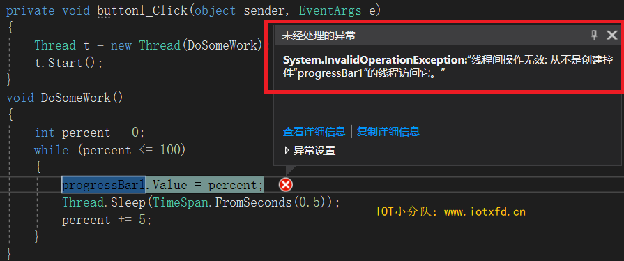 

我们不能在工作线程上访问主线程上创建的UI控件。要解决这个问题，可以把访问UI这件事包装在委托内，然后由窗体调用这个委托。也就是由窗体自己去更新UI控件，这样就没问题了。

### 使用委托方式在工作线程中更新ProgressBar

更新代码如下：

```c
private void button1_Click(object sender, EventArgs e)
{
    Thread t = new Thread(DoSomeWork);
    t.Start();
}
//委托
delegate void SetProgressBarDelegate(int percent);
//委托所对应的方法
void SetProgressBar(int percent) 
{
    progressBar1.Value = percent;
}
void DoSomeWork()
{
    int percent = 0;
    while (percent <= 100)
    {
        this.BeginInvoke(new SetProgressBarDelegate(SetProgressBar), percent);
        Thread.Sleep(TimeSpan.FromSeconds(0.5));
        percent += 5;
    }
}
```

运行程序，在进度条更新时移动窗口就没有任何问题了。当然根据《[Lambda表达式 - 委托进化史](http://iotxfd.cn/article/CSharp Reference/[01]delegate evolution.html)》这篇文章所学的lambda表达式知识，我们可以把程序写得更简单些：

```c
private void button1_Click(object sender, EventArgs e)
{
    Thread t = new Thread(DoSomeWork);
    t.Start();
}
void DoSomeWork()
{
    int percent = 0;
    while (percent <= 100)
    {
        this.BeginInvoke(new Action<int>(p =>
            progressBar1.Value = percent
        ), percent);
        Thread.Sleep(TimeSpan.FromSeconds(0.5));
        percent += 5;
    }
}
```

这个程序是有bug的，当你在进度条更新期间关闭窗体，会引发一个异常。我们会在本文稍后部分解决这个问题。


### 向线程池中放入异步操作

以下所有程序都可以在Visual Studio Code内进行调试运行，继续使用Visual Studio也没有问题。运行以下代码：

```c
static void Main(string[] args)
{
    const int x = 1;
    const int y = 2;
    const string lambdaState = "lambda state 2";

    ThreadPool.QueueUserWorkItem(AsyncOperation);
    Thread.Sleep(TimeSpan.FromSeconds(1));

    ThreadPool.QueueUserWorkItem(AsyncOperation, "async state");
    Thread.Sleep(TimeSpan.FromSeconds(1));

    ThreadPool.QueueUserWorkItem( state => {
            Console.WriteLine("Operation state: {0}", state);
            Console.WriteLine("Worker thread id: {0}", Thread.CurrentThread.ManagedThreadId);
            Thread.Sleep(TimeSpan.FromSeconds(2));
        }, "lambda state");

    ThreadPool.QueueUserWorkItem( _ =>
    {
        Console.WriteLine("Operation state: {0}, {1}", x+y, lambdaState);
        Console.WriteLine("Worker thread id: {0}", Thread.CurrentThread.ManagedThreadId);
        Thread.Sleep(TimeSpan.FromSeconds(2));
    });

    Thread.Sleep(TimeSpan.FromSeconds(2));
}

private static void AsyncOperation(object state)
{
    Console.WriteLine("Operation state: {0}", state ?? "(null)");
    Console.WriteLine("Worker thread id: {0}", Thread.CurrentThread.ManagedThreadId);
    Thread.Sleep(TimeSpan.FromSeconds(2));
}
```

运行结果如下：

```
Operation state: (null)
Worker thread id: 3
Operation state: async state
Worker thread id: 4
Operation state: lambda state
Worker thread id: 5
Operation state: 3, lambda state 2
Worker thread id: 6
```

此例演示了`QueueUserWorkItem`的四种使用方法。其中`state ?? "(null)"`这句代码表示：当`state`的值为空时返回`??`右边的值。`??`叫空合并运算符。

首先定义了AsyncOperation方法，其接受单个object类型的参数。然后使用QueueUserWorkItem方法将该方法放到线程池中。接着再次放入该方法，但是这次给方法调用传入了一个状态对象。该对象将作为状态参数传递给AsyncOperation方法。

在操作完成后让线程睡眠一秒钟，从而让线程池拥有为新操作重用线程的可能性。如果注释掉所有的Thread.Sleep调用，那么所有打印出的线程ID多半是不一样的。如果ID是一样的，那很可能是前两个线程被重用来运行接下来的两个操作。

首先将一个lambad表达式放置到线程池中。这里没什么特别的。我们使用了lambda表达式语法，从而无须定义一个单独的方法。lambad表达式语法刚开始看很难受，多看，多做，慢慢习惯就好了。

然后，我们使用**闭包**机制，从而无须传递lambda表达式的状态。闭包更灵活，允许我们向异步操作传递一个以上的对象而且这些对象具有静态类型。所以之前介绍的传递对象给方法回调的机制即冗余又过时。在C#中有了闭包后就不再需要使用它了。

下来面解释最后一次异步操作中的箭头表达式前面的`_`符号。`QueueUserWorkItem`的函数原型是：

```c
public static bool QueueUserWorkItem(WaitCallback callBack);
```

继续往下挖，`WaitCallback`的函数原型为：

```
public delegate void WaitCallback(object state);
```

也就是说`QueueUserWorkItem`里面使用的lambda表达式必须带一个object类型的参数。而如果我现在不想使用这个参数，那么就在箭头表达式前面用`_`符号来代替这个参数。


### 线程池与并行度

本节将展示线程池如何工作于大量的异步操作，以及它与创建大量单独的线程的方式有何不同。

运行以下代码：

```c
using System;
using System.Threading;
using System.Diagnostics;

namespace Sync
{
    class Program
    {
        static void UseThreads(int numberOfOperations)
        {
            using (var countdown = new CountdownEvent(numberOfOperations))
            {
                Console.WriteLine("创建线程：");
                for (int i = 0; i < numberOfOperations; i++)
                {   //创建200条线程工作
                    var thread = new Thread(() =>
                      {
                          Console.Write("{0},", Thread.CurrentThread.ManagedThreadId);
                          Thread.Sleep(TimeSpan.FromSeconds(0.1));
                          countdown.Signal();
                      });
                    thread.Start();
                }
                countdown.Wait();//等待200个信号完成
                Console.WriteLine();
            }
        }

        static void UseThreadPool(int numberOfOperations)
        {
            using (var countdown = new CountdownEvent(numberOfOperations))
            {
                Console.WriteLine("使用线程池：");
                for (int i = 0; i < numberOfOperations; i++)
                {   //通过调用线程池的线程来工作
                    ThreadPool.QueueUserWorkItem(_ =>
                    {
                        Console.Write("{0},", Thread.CurrentThread.ManagedThreadId);
                        Thread.Sleep(TimeSpan.FromSeconds(0.1));
                        countdown.Signal();
                    });
                }
                countdown.Wait();//等待200个信号完成
                Console.WriteLine();
            }
        }

        static void Main(string[] args)
        {
            const int numberOfOperations = 200;
            var sw = new Stopwatch();
            sw.Start();//计时开始
            UseThreads(numberOfOperations);
            sw.Stop();//计时结束
            Console.WriteLine("花费时间 : {0}", sw.ElapsedMilliseconds);

            sw.Reset();//重新计时
            sw.Start();//计时开始
            UseThreadPool(numberOfOperations);
            sw.Stop();//计时结束
            Console.WriteLine("花费时间 : {0}", sw.ElapsedMilliseconds);
        }
    }
}
```

运行结果：

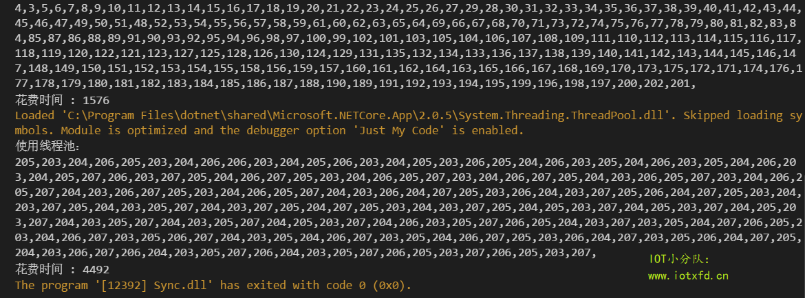

当主线程启动时，创建了很多不同的线程，每个线程都运行一个操作。该操作打印出线程ID并阻塞线程100毫秒。结果我们创建了200条线程，全部并行运行这些操作。虽然在我的机器上总耗时是1235毫秒，但是所有线程消耗了大量的操作系统资源。

然后我们使用了执行同样的任务，只不过不为每个操作创建一个线程，而将它们放入到线程池中。然后线程池开始执行这些操作。从结果看一共只创建了5条线程，但花费了更多的时间，在我的机器上是4574毫秒。我们为操作系统节省了内存和线程数，但是为此付出了更长的执行时间。


### 实现一个取消选项

之前我们讨论过使用`Thread.Abort`方法终止线程是非常危险的，这一节演示如何使用正确方法来终止线程。

```c
static void AsyncOperation1(CancellationToken token)
{
    Console.WriteLine("开始第一个任务");
    for (int i = 0; i < 5; i++)
    {
        if (token.IsCancellationRequested)
        {
            Console.WriteLine("第一个任务已经取消.");
            return;
        }
        Thread.Sleep(TimeSpan.FromSeconds(1));
    }
    Console.WriteLine("第一个任务已经成功完成");
}

static void AsyncOperation2(CancellationToken token)
{
    try
    {
        Console.WriteLine("开始第二个任务");
        for (int i = 0; i < 5; i++)
        {
            token.ThrowIfCancellationRequested();
            Thread.Sleep(TimeSpan.FromSeconds(1));
        }
        Console.WriteLine("第二个任务已经成功完成");
    }
    catch (OperationCanceledException)
    {
        Console.WriteLine("第二个任务已经取消.");
    }
}

static void AsyncOperation3(CancellationToken token)
{
    bool cancellationFlag = false;
    token.Register(() => cancellationFlag = true);
    Console.WriteLine("开始第三个任务");
    for (int i = 0; i < 5; i++)
    {
        if (cancellationFlag)
        {
            Console.WriteLine("第三个任务已被取消.");
            return;
        }
        Thread.Sleep(TimeSpan.FromSeconds(1));
    }
    Console.WriteLine("第三个任务已经成功完成");
}

static void Main(string[] args)
{
    using (var cts = new CancellationTokenSource())
    {
        CancellationToken token = cts.Token;
        ThreadPool.QueueUserWorkItem(_ => AsyncOperation1(token));
        Thread.Sleep(TimeSpan.FromSeconds(2));
        cts.Cancel(); //发送取消信号
    }

    using (var cts = new CancellationTokenSource())
    {
        CancellationToken token = cts.Token;
        ThreadPool.QueueUserWorkItem(_ => AsyncOperation2(token));
        Thread.Sleep(TimeSpan.FromSeconds(2));
        cts.Cancel();
    }

    using (var cts = new CancellationTokenSource())
    {
        CancellationToken token = cts.Token;
        ThreadPool.QueueUserWorkItem(_ => AsyncOperation3(token));
        Thread.Sleep(TimeSpan.FromSeconds(2));
        cts.Cancel();
    }

    Thread.Sleep(TimeSpan.FromSeconds(2));
}
```

简而言之，正确终止线程的方法应该发送一个取消信号，在线程中每做一个操作之前都判断是否收到取消信号，如果收到，则自行关闭。

本节中介绍了`CancellationTokenSource`和`CancellationToken`两个新类。它们在.NET4.0被引入，目前是实现异步操作的取消操作的事实标准。由于线程池已经存在了很长时间，并没有特殊的API来实现取消标记功能，但是仍然可以对线程池使用上述API。

在本程序中使用了三种方式来实现取消过程。

第一个是来检查`CancellationToken.IsCancellationRequested`属性。如果该属性为true，则说明操作需要被取消，我们必须放弃该操作。

第二种方式是抛出一个`OperationCanceledException`异常。这允许在操作之外控制取消过程，即需要取消操作时，通过操作之外的代码来处理。

最后一种方式是注册一个回调函数。当操作被取消时，在线程池将调用该回调函数。这允许链式传递一个取消逻辑到另一个异步操作中。


### 修复进度条更新程序bug

在之前【多线程访问UI】这一节中，我们做更新进度条例子时留了个尾巴。当你在更新进度条期间如果关闭程序，会引发异常。如下图所示：

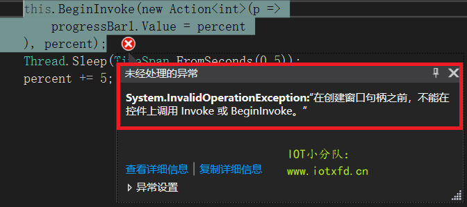 

窗体已经被释放，还试图调用窗体的方法，自然不行。

现在我们学会了如何取消线程，正好拿来练练手。要解决这个问题，可以在窗体关闭事件里发信号，让线程自行结束。生成窗体的`FormClosing`事件，然后将程序代码更改如下：

```c
CancellationTokenSource cts;
private void button1_Click(object sender, EventArgs e)
{
    cts = new CancellationTokenSource();
    CancellationToken token = cts.Token;
    Thread t = new Thread(() => DoSomeWork(token));
    t.Start();
}
void DoSomeWork(CancellationToken token)
{
    int percent = 0;
    while (percent <= 100)
    {
        if (token.IsCancellationRequested)
        {
            return;
        }
        this.BeginInvoke(new Action<int>(p =>
            progressBar1.Value = percent
        ), percent);
        Thread.Sleep(TimeSpan.FromSeconds(0.5));
        percent += 5;
    }
    cts.Dispose();
    cts = null;
}

private void Form1_FormClosing(object sender, FormClosingEventArgs e)
{
    if (cts != null)
    {
        cts.Cancel();
    }
}
```

现在在更新进度条时关闭窗体，就没有问题了。


### 在线程池中使用等待事件处理器及超时

```
static void Main(string[] args)
{
    RunOperations(TimeSpan.FromSeconds(5));
    RunOperations(TimeSpan.FromSeconds(7));
}

static void RunOperations(TimeSpan workerOperationTimeout)
{
    using (var evt = new ManualResetEvent(false))
    using (var cts = new CancellationTokenSource())
    {
        Console.WriteLine("注册超时操作...");
        var worker = ThreadPool.RegisterWaitForSingleObject(evt,
            (state, isTimedOut) => WorkerOperationWait(cts, isTimedOut), null, workerOperationTimeout, true);

        Console.WriteLine("开始长时间操作...");

        ThreadPool.QueueUserWorkItem(_ => WorkerOperation(cts.Token, evt));

        Thread.Sleep(workerOperationTimeout.Add(TimeSpan.FromSeconds(2)));
        worker.Unregister(evt);
    }
}

static void WorkerOperation(CancellationToken token, ManualResetEvent evt)
{
    for(int i = 0; i < 6; i++)
    {
        if (token.IsCancellationRequested)
        {
            return;
        }
        Thread.Sleep(TimeSpan.FromSeconds(1));
    }
    evt.Set();
}

static void WorkerOperationWait(CancellationTokenSource cts, bool isTimedOut)
{
    if (isTimedOut)
    {
        cts.Cancel();
        Console.WriteLine("超时并取消.");
    }
    else
    {
        Console.WriteLine("成功完成.");
    }
}
```

运行结果：

```
注册超时操作...
开始长时间操作...
超时并取消.
注册超时操作...
开始长时间操作...
成功完成.
```


线程池还有一个有用的方法：`ThreadPool.RegisterWaitForSingleObject`。该方法允许我们将回调函数放入线程池中的队列中。当提供的等待事件处理器收到信号或发生超时时，该回调函数将被调用。这允许我们为线程池中的操作实现超时功能。

RegisterWaitForSingleObject的原型为：

```c
public static RegisteredWaitHandle RegisterWaitForSingleObject
(
    WaitHandle waitObject, 
    WaitOrTimerCallback callBack, 
    object state, 
    TimeSpan timeout, 
    bool executeOnlyOnce
);
```

参数解析：

- **waitObject**：注册的`System.Threading.WaitHandle`，应使用`System.Threading.WaitHandle`而不是`System.Threading.Mutex`。此参数使用的是一个同步信号类，在此例中，我们使用的是`ManualResetEvent`类，它是`WaitHandle`的子类。当通过`ManualResetEvent.Set`方法发送信号时，会调用RegisterWaitForSingleObject方法中注册的委托。
- **callBack**：`System.Threading.WaitOrTimerCallback`委托，当`waitObject`参数收到信号，会调用此委托。`WaitOrTimerCallback`函数原型为：

```
public delegate void WaitOrTimerCallback(object state, bool timedOut);
```

此例中的`WorkerOperationWait`方法就是按照此委托打造的。其中的第一个参数用于取消线程。

- **state**：传递给委托的对象。此例未通过此参数传递CancellationTokenSource，而是通过闭包的方式传递。
- **timeout**：由System.TimeSpan表示。如果设置为0，则立即返回；如果设置为-1则表示永远不会到期。在此例中，第一次调用`RunOperations`传递的参数是5秒，5秒过后，会触发委托，并将委托中的`isTimedOut`参数设置为`true`表示超时了，从而在执行委托方法`WorkerOperationWait`时发送取消信号导致线程提前终止。因为线程需要6秒钟方能执行完毕。第二次调用`RunOperations`传递的参数是7秒，而在6秒过后线程中的`evt.Set()`这句代码发送了一个信号，RegisterWaitForSingleObject中的`waitObject`在接收到信号后，触发委托，并将委托中的`isTimedOut`参数设置为`false`表示线程已经完成。
- **executeOnlyOnce**：设置为`true`时表示在委托被超时调用后线程不再等待`waitObject`参数的信号；设置为`false`时表示每次`waitObject`操作完成后都会重启计时器，直到`waitObject`被注销（Unregister）。


当有大量的线程必须处于阻塞状态中等待一些多线程事件发信号时，以上方式非常有用。借助于线程池的基础设施，我们无需阻塞所有这样的线程。可以释放这些线程直到信号事件被设置。在服务器端应用程序中这是个非常重要的应用场景，因为服务器端应用程序要求高伸缩性及高性能。

### 使用计时器

本节将描述如何使用System.Threading.Timer对象来在线程池中创建周期性调用的异步操作。使用如下代码：

```c
using System;
using System.Threading;
using System.Diagnostics;

namespace Sync
{
    class Program
    {
        static Timer _timer;
        static void Main(string[] args)
        {
            Console.WriteLine("输入 'Enter' 键来停止计时器...");
            DateTime start = DateTime.Now;
            _timer = new Timer(_ => TimerOperation(start),null, TimeSpan.FromSeconds(1), TimeSpan.FromSeconds(2));
            Thread.Sleep(TimeSpan.FromSeconds(6));
            _timer.Change(TimeSpan.FromSeconds(1), TimeSpan.FromSeconds(4));
            Console.ReadLine();
            _timer.Dispose();
        }

        static void TimerOperation(DateTime start)
        {
            TimeSpan elapsed = DateTime.Now - start;
            Console.WriteLine("运行时间：{0} 秒，线程ID {1}", elapsed.Seconds,
                Thread.CurrentThread.ManagedThreadId);
        }
    }
}
```

如果在vscode内运行此程序不会自动停止，需手动关闭。如果希望按回车键结束程序，请参考《[线程同步](http://iotxfd.cn/article/Thread Basic/[02]Thread Synchronization.html)》这篇文章中的【使用Mutex类】这一节来生成`.exe`文件运行。

运行结果：

```
输入 'Enter' 键来停止计时器...
运行时间：1 秒，线程ID 4
运行时间：3 秒，线程ID 4
运行时间：5 秒，线程ID 4
运行时间：7 秒，线程ID 4
运行时间：11 秒，线程ID 4
运行时间：15 秒，线程ID 4
运行时间：19 秒，线程ID 4
运行时间：23 秒，线程ID 4
```

首先我们看看计时器`System.Threading.Timer`的构造函数原型：

```c
public Timer(TimerCallback callback, object state, TimeSpan dueTime, TimeSpan period);
```

参数解析：

- **callback**：将要被执行的方法委托，原型为：

```c
public delegate void TimerCallback(object state);
```

此委托需要一个object对象作为参数。此例中的`TimerOperation`方法即为此委托的实现。表示计时器每隔指定周期所要执行的方法。

- **state**：一个object对象,包含callback方法所需使用的信息，可以设置为null。此例中关没有使用此参数给委托传递参数，而是使用了闭包的方式获取所需值。
- **dutTime**：在`callback`参数调用方法前所需延迟的时间，如果设置为0，则计时器启动后立即执行方法。
- **period**：调用周期，每隔这么多时间调用一次方法。

我们首先创建了一个Timer实例。第一个参数量个lambda表达式，将会 在线程池中被执行。之后等待6秒后修改计时器。在调用`_timer.Change`方法一秒后启动`TimerOperation`，然后每隔4秒再次运行。

**计时器还可以更复杂**
可以以更复杂的方式使用计时器。比如，可以通过`Timeout.Infinet`值提供给计时器一个间隔参数来只允许计时器操作一次。然后在计时器异步操作内，能够设置下一次计时器操作将被执行的时间。具体时间取决于自定义业务逻辑。


### 使用BackgroundWorker组件

本节实例演示了另一种异步编程的方式，即使用BackgroundWorker组件。借助于该对象，可以将异步代码组织为一系列事件及事件处理器。你将学会如何使用该组件进行异步编程。

使用以下代码：

```c
using System;
using System.Threading;
using System.ComponentModel;

namespace Sync
{
    class Program
    {
        static void Main(string[] args)
        {
            var bw = new BackgroundWorker();
            bw.WorkerReportsProgress = true;
            bw.WorkerSupportsCancellation = true;

            bw.DoWork += Worker_DoWork;
            bw.ProgressChanged += Worker_ProgressChanged;
            bw.RunWorkerCompleted += Worker_Completed;

            bw.RunWorkerAsync();

            Console.WriteLine("按 c 以取消工作");
            do
            {
                if (Console.ReadKey(true).KeyChar == 'c')
                {
                    bw.CancelAsync();
                }
            }
            while (bw.IsBusy);
        }

        static void Worker_DoWork(object sender, DoWorkEventArgs e)
        {
            Console.WriteLine("线程池中的线程ID: {0}", Thread.CurrentThread.ManagedThreadId);
            var bw = (BackgroundWorker)sender;
            for (int i = 1; i <= 100; i++)
            {

                if (bw.CancellationPending)
                {
                    e.Cancel = true;
                    return;
                }

                if (i % 10 == 0)
                {
                    bw.ReportProgress(i);
                }

                Thread.Sleep(TimeSpan.FromSeconds(0.1));
            }
            e.Result = 42;
        }

        static void Worker_ProgressChanged(object sender, ProgressChangedEventArgs e)
        {
            Console.WriteLine("完成{0}% ， 线程池中的线程ID: {1}", e.ProgressPercentage,
                Thread.CurrentThread.ManagedThreadId);
        }

        static void Worker_Completed(object sender, RunWorkerCompletedEventArgs e)
        {
            Console.WriteLine("完成的线程ID: {0}", Thread.CurrentThread.ManagedThreadId);
            if (e.Error != null)
            {
                Console.WriteLine("发生异常： {0}", e.Error.Message);
            }
            else if (e.Cancelled)
            {
                Console.WriteLine("操作被取消");
            }
            else
            {
                Console.WriteLine("结果是: {0}", e.Result);
            }
        }
    }
}
```

要想获取完整演示效果，请参考《[线程同步](http://iotxfd.cn/article/Thread Basic/[02]Thread Synchronization.html)》这篇文章中的【使用Mutex类】这一节来生成`.exe`文件运行。否则无法按**c**键中断程序。

```
按 c 以取消工作
线程池中的线程ID: 3
完成10% ， 线程池中的线程ID: 4
完成20% ， 线程池中的线程ID: 5
完成30% ， 线程池中的线程ID: 5
完成40% ， 线程池中的线程ID: 5
完成50% ， 线程池中的线程ID: 5
完成60% ， 线程池中的线程ID: 4
完成70% ， 线程池中的线程ID: 5
完成80% ， 线程池中的线程ID: 4
完成90% ， 线程池中的线程ID: 5
完成100% ， 线程池中的线程ID: 4
完成的线程ID: 5
结果是: 42
```

可以运行过程中按下**c**键取消工作。

`BackgroundWorker`使用的是事件机制来实现异步编程，这种方式被称为**基于事件的异步模式**（Event-based Asynchronous Pattern，简称EAP）。这是历史上第二种用来构造异步程序的方式，现在更推荐使用TPL，会在后面的文章中描述。

关于**事件**，可以参考我的《C#语言参考视频》，里面有详细讲解，这里不再讨论。本例实现了`BackgroundWorker`的三个事件：

- **DoWork**：对应的函数为`Worker_DoWork`，它在调用BackgroundWorker.RunWorkerAsync时被触发，里面放的是工作的主体内容。
- **ProgressChanged**：对应的函数为`orker_ProgressChanged`，它在调用BackgroundWorker.ReportProgress时被触发，可通过此函数传递一个int值，并在事件中通过访问事件参数`e.ProgressPercentage`来获取此int值。
- **RunWorkerCompleted**：对应函数为`Worker_Completed`，它在DoWork事件所对应的方法执行结束时触发。通过访问此事件的参数`e`可获取线程状态，如访问`e.Error`判断线程是否出错，访问`e.Cancelled`访问线程是否被取消。

可以线程运行的过程中使用 BackgroundWorker.CancelAsync() 方法发信号终止线程，在线程中通过 BackgroundWorker.CancellationPending 来判断是否收到此信号，从而决定是否取消线程。

BackgroundWorker组件实际上被用于Windows窗体应用程序（Windows Forms Applications，简称WPF）中。该实现通过后台工作事件处理器的代码可以直接与UI控制器交互。与线程池中的线程与UI控制器交互的方式相比较，使用BackgroundWorker组件的方式更加自然和好用。


## 4.使用任务并行库

总算走到这了，最新并行编程使用的都是Task，前面的知识可以蜻蜓点水，从这篇文章开始就要认真学了。

### 简介

我们在之前的章节中学习了什么是线程，如何使用线程，以及为什么需要线程池。使用线程池可以使我们在减少并行度花销时节省操作系统资源。我们可以认为线程池是一个**抽象层**，其向程序员隐藏了使用线程的细节，使我们专心处理程序逻辑，而不是各种线程问题。

然而使用线程池也相当复杂。从线程池的工作线程中获取结果并不容易。我们需要实现自定义方式来获取结果，而且万一有异常发生，还需将异常正确地传播到初始线程中。除此以外，创建一组相关的异步操作，以及实现当前操作执行完成后下一操作才会执行的逻辑也不容易。

在尝试解决这些问题的过程中，创建了异步编程模型及基于事件的异步模式。之前提到过基于事件的异步模式。这些模式使得获取结果更容易，传播异常也更轻松，但是组合多个异步操作仍需大量工作，需要编写大量的代码。

为了解决所有问题，.NET Framework4.0引入了一个新的关于异步操作的API。它叫做任务并行库（**Task Parallel library，简称TPL**）。.Net framework 4.5版对该API进行了轻微的改进，使用更简单。在本文的项目中将使用最新版的TPL，即.Net Framework 4.5版中的API。TPL可被认为是线程池之上的又一个抽象层，其对程序员隐藏了与线程池交互的底层代码，并提供了更方便的细粒度API。

TPL的核心概念是任务。一个任务代表了一个异步操作，该操作可以通过多种方式运行，可以使用或不使用独立线程运行。在本章中将探究任务的所有使用细节。

> **提示：**
> 默认情况下，程序员无须知道任务实际上是如何执行的。TPL通过向用户隐藏任务的实现细节从而创建一个抽象层。遗憾的是，有些情况下这会导致诡秘的错误，比如试图获取任务的结果时程序被挂起。本章有助于理解TPL底层的原理，以及如何避免不恰当的使用方式。

一个任务可以通过多种方式和其他任务组合起来。例如，可以同时启动多个任务，等待所有任务完成，然后运行一个任务对之前所有任务的结果进行一些计算。TPL与之前的模式相比，其中一个关键优势是其具有用于组合任务的便利的API。

处理任务中的异常结果有多种方式。由于一个任务可能会由多个其他任务组成，这些任务也可能依次拥有各自的子任务，所以有一个AggregateException的概念。这种异常可以捕获底层任务内部的所有异常，并允许单独处理这些异常。

而且，C# 5.0已经内置了对TPL的支持，允许我们使用新的await和async关键字以平滑的、舒服的方式操作任务。在之后的文章会讨论该主题。

在本章中我们将学习使用TPL来执行异步操作。我们将学习什么是任务，如何用不同的方式创建任务，以及如何将任务组合在一起。我们会讨论如何将遗留的APM和EAP模式转换为使用任务，还有如何正确地处理异常，如何取消任务，以及如何使用多个任务同时执行。另外，还将讲述如何在Windows GUI应用程序中正确地使用任务。

### 创建任务

运行以下代码：

```c
using System;
using System.Threading;
using System.Threading.Tasks;
using System.ComponentModel;

namespace Sync
{
    class Program
    {
       static void Main(string[] args)
		{
			var t1 = new Task(() => TaskMethod("Task 1"));
			var t2 = new Task(() => TaskMethod("Task 2"));
			t2.Start();
			t1.Start();
			Task.Run(() => TaskMethod("Task 3"));
			Task.Factory.StartNew(() => TaskMethod("Task 4"));
			Task.Factory.StartNew(() => TaskMethod("Task 5"), TaskCreationOptions.LongRunning);
			Thread.Sleep(TimeSpan.FromSeconds(1));
		}

		static void TaskMethod(string name)
		{
			Console.WriteLine("Task {0} 正在运行， 线程id：{1}，是否线程池线程: {2}",
				name, Thread.CurrentThread.ManagedThreadId, Thread.CurrentThread.IsThreadPoolThread);
		}
    }
}
```

运行结果：

```
Task Task 3 正在运行， 线程id：6，是否线程池线程: True
Task Task 4 正在运行， 线程id：5，是否线程池线程: True
Task Task 2 正在运行， 线程id：3，是否线程池线程: True
Task Task 5 正在运行， 线程id：7，是否线程池线程: False
Task Task 1 正在运行， 线程id：4，是否线程池线程: True
```

当程序运行时，我们使用Task的构造函数创建了两个任务。我们传入一个lambda表达式作为Action委托。这可以使我们给`TaskMethod`提供一个string参数。然后使用`Start`方法运行这些任务。

> 请注意只有调用了这些任务的`Start`方法，才会执行任务。很容易忘记真正启动任务。

然后使用`Task.Run`和`Task.Factory.StartNew`方法来运行来运行另外两个任务。与使用Task构造函数的不同之处在于这两个被创建的任务会立即开始工作，所以无需显式地调用这些任务的`Start`方法。从Task 1到Task 4的所有任务都被放置在线程池的工作线程中并以未指定的顺序运行。如果多次运行该程序，就会发现任务的执行顺序是不确定的。

`Task.Run`方法只是`Task.Factory.StartNew`的一个快捷方式，但是后者有附加的选项。通常如果无特殊需求，则可使用前一个方法，如 Task 5 所示。我们标记该任务为长时间运行，结果该任务将不会使用线程池，而在单独的线程中运行。然而，根据运行该任务的当前的**任务调度程序**(task scheduler)，运行方式有可能不同。稍后会讲解什么是任务调试程序。


### 使用任务执行基本的操作

本节将描述如何从任务中获取结果值。我们将通过几个场景来了解在线程池中和主线程中运行任务的不同之处。

```
static void Main(string[] args)
{
	TaskMethod("主线程Task");
	Task<int> task = CreateTask("Task 1");
	task.Start();
	int result = task.Result;//这一句会导致程序阻塞
	Console.WriteLine("结果为: {0}", result);

	task = CreateTask("Task 2");
	task.RunSynchronously();
	result = task.Result;
	Console.WriteLine("结果为: {0}", result);

	task = CreateTask("Task 3");
	Console.WriteLine(task.Status);
	task.Start();

	while (!task.IsCompleted)
	{
		Console.WriteLine(task.Status);
		Thread.Sleep(500);
	}

	Console.WriteLine(task.Status);
	result = task.Result;
	Console.WriteLine("结果为: {0}", result);
}

static Task<int> CreateTask(string name)
{
	return new Task<int>(() => TaskMethod(name));
}

static int TaskMethod(string name)
{
	Console.WriteLine("{0} 正在运行，线程 id {1}，是否线程池线程: {2}",
		name, Thread.CurrentThread.ManagedThreadId, Thread.CurrentThread.IsThreadPoolThread);
	Thread.Sleep(TimeSpan.FromSeconds(2));
	return 42;
}
```

```
主线程Task 正在运行，线程 id 1，是否线程池线程: False
Task 1 正在运行，线程 id 3，是否线程池线程: True
结果为: 42
Task 2 正在运行，线程 id 1，是否线程池线程: False
结果为: 42
Created
Task 3 正在运行，线程 id 3，是否线程池线程: True
Running
Running
Running
Running
RanToCompletion
结果为: 42
```

首先直接运行`TaskMethod`方法，这是在主线程中执行，肯定没线程池什么事。id为1的线程就是主线程。

然后我们运行了`Task 1`，使用`Start`方法启动该任务并等待结果。该任务会被放置在线程池中。需要注意的是调用`task.Result`会导致主线程等待，直到任务返回前一直处于阻塞状态。

`Task 2`和`Task 1`类似，除了`Task 2`是通过`RunSynchronously()`方法运行的。该任务会运行在主线程中，该任务的输出与第一个例子中直接同步调用`TaskMethod`的输出完全一样。**这是个非常好的优化，可以避免使用线程池来执行非常短暂的操作。**

我们用以运行`Task 1`相同的方式来运行`Task 3`。但这次在阻塞主线程前打印出任务状态。

### 组合任务

本节将展示如何设置相互依赖的任务。我们将学习如何创建一个任务，使其在父任务完成后才被运行。另外，将探寻为非常短暂的任务节省线程开销的可能性。

```
static void Main(string[] args)
{
	var firstTask = new Task<int>(() => TaskMethod("First Task", 3));
	var secondTask = new Task<int>(() => TaskMethod("Second Task", 2));
	//此后续任务在线程池中运行
	firstTask.ContinueWith(
		t => Console.WriteLine("第一个结果是 {0}. 线程 id {1}, 是否线程池线程: {2}",
			t.Result, Thread.CurrentThread.ManagedThreadId, Thread.CurrentThread.IsThreadPoolThread),
		TaskContinuationOptions.OnlyOnRanToCompletion);

	firstTask.Start();
	secondTask.Start();

	Thread.Sleep(TimeSpan.FromSeconds(4));
	//此后续任务在主线程中运行
	Task continuation = secondTask.ContinueWith(
		t => Console.WriteLine("第二个结果是 {0}. 线程 id {1}, 是否线程池线程: {2}",
			t.Result, Thread.CurrentThread.ManagedThreadId, Thread.CurrentThread.IsThreadPoolThread),
		TaskContinuationOptions.OnlyOnRanToCompletion | TaskContinuationOptions.ExecuteSynchronously);
	//这是后续任务的后续任务
	continuation.GetAwaiter().OnCompleted(
		() => Console.WriteLine("Continuation Task 已完成! 线程 id {0}, 是否线程池线程: {1}",
			Thread.CurrentThread.ManagedThreadId, Thread.CurrentThread.IsThreadPoolThread));

	Thread.Sleep(TimeSpan.FromSeconds(2));
	Console.WriteLine();

	firstTask = new Task<int>(() =>
	{
		//firstTask里嵌套的子任务
		var innerTask = Task.Factory.StartNew(() => TaskMethod("Second Task", 5), TaskCreationOptions.AttachedToParent);
		//子任务的后续任务
		innerTask.ContinueWith(t => TaskMethod("Third Task", 2), TaskContinuationOptions.AttachedToParent);
		//下面这句代码也会在线程池内完成
		return TaskMethod("First Task", 2);
	});

	firstTask.Start();

	while (!firstTask.IsCompleted)
	{
		Console.WriteLine(firstTask.Status);
		Thread.Sleep(TimeSpan.FromSeconds(0.5));
	}
	Console.WriteLine(firstTask.Status);

	Thread.Sleep(TimeSpan.FromSeconds(10));
}

static int TaskMethod(string name, int seconds)
{
	Console.WriteLine("{0} 正在运行，线程id {1}，是否线程池线程: {2}",
		name, Thread.CurrentThread.ManagedThreadId, Thread.CurrentThread.IsThreadPoolThread);
	Thread.Sleep(TimeSpan.FromSeconds(seconds));
	return 42 * seconds;
}
```

```
Second Task 正在运行，线程id 4，是否线程池线程: True
First Task 正在运行，线程id 3，是否线程池线程: True
第一个结果是 126. 线程 id 5, 是否线程池线程: True
第二个结果是 84. 线程 id 1, 是否线程池线程: False
Continuation Task 已完成! 线程 id 3, 是否线程池线程: True

Running
Second Task 正在运行，线程id 5，是否线程池线程: True
First Task 正在运行，线程id 3，是否线程池线程: True
Running
Running
Running
WaitingForChildrenToComplete
WaitingForChildrenToComplete
WaitingForChildrenToComplete
WaitingForChildrenToComplete
WaitingForChildrenToComplete
WaitingForChildrenToComplete
Third Task 正在运行，线程id 3，是否线程池线程: True
WaitingForChildrenToComplete
WaitingForChildrenToComplete
WaitingForChildrenToComplete
WaitingForChildrenToComplete
RanToCompletion
```

这程序设计得真够复杂，就快晕倒了。

当主程序启动时，我们创建了两个任务，并为第一个任务设置了一个后续操作（continuation，一个代码块，会在当前任务完成后运行）。然后启动这两个任务并等待4秒，这个时间足够两个任务完成。然后给第二个任务运行另一个后续操作，并通过指定`TaskContinuationOptions.ExecuteSynchronously`选项来尝试同步执行该后续操作。如果后续操作耗时非常短暂，使用以上方式是非常有用的，因为放置在主线程中运行比放置在线程池中运行要快。可以实现这一点是因为第二个任务恰好在那一刻完成。如果注释掉4秒的`Thread.Sleep`方法，将会看到该代码放置到线程池中，这是因为还未从之前的任务中得到结果。

最后我们为之前的后续操作也定义了一个后续操作，但这里使用了一个稍微不同的方式，即使用了新的`GetAwaiter`和`OnCompleted`方法。这些方法是 C# 5.0 语言中异步机制中的方法。以后会讨论。

本节示例的最后部分与父子线程有关。我们创建了一个新任务，当运行该任务时，通过提供一个`TaskContinuationOptions.AttachedToParent`选项来运行一个所谓的子任务。

> 注意：子任务必须在父任务运行时创建，并正确的附加给父任务！

这意味着只有所有子任务结束工作，父任务才会完成。通过提供一个`TaskContinuationOptions`选项也可以在子任务上运行后续操作。该后续操作也会影响父任务，并且直到最后一个子任务结束后它才会运行完成。


### 实现取消选项

本节是关于如何给基于任务的异步操作实现取消流程。我们将学习如何正确的使用取消标志，以及在任务真正运行前如何得知其是否被取消。

```
private static void Main(string[] args)
{
	var cts = new CancellationTokenSource();
	var longTask = new Task<int>(() => TaskMethod("Task 1", 10, cts.Token), cts.Token);
	Console.WriteLine(longTask.Status);
	cts.Cancel(); //还未运行就被取消了
	Console.WriteLine(longTask.Status);
	Console.WriteLine("第一个 task 在运行前被取消");
	cts = new CancellationTokenSource();
	longTask = new Task<int>(() => TaskMethod("Task 2", 10, cts.Token), cts.Token);
	longTask.Start();
	for (int i = 0; i < 5; i++)
	{
		Thread.Sleep(TimeSpan.FromSeconds(0.5));
		Console.WriteLine(longTask.Status);
	}
	cts.Cancel(); //中途取消
	for (int i = 0; i < 5; i++)
	{
		Thread.Sleep(TimeSpan.FromSeconds(0.5));
		Console.WriteLine(longTask.Status);
	}

	Console.WriteLine("task 已结束，返回结果 {0}.", longTask.Result);
}

private static int TaskMethod(string name, int seconds, CancellationToken token)
{
	Console.WriteLine("Task {0} 正在运行，线程 id {1}. 是否线程池线程: {2}",
		name, Thread.CurrentThread.ManagedThreadId, Thread.CurrentThread.IsThreadPoolThread);
	for (int i = 0; i < seconds; i++)
	{
		Thread.Sleep(TimeSpan.FromSeconds(1));
		if (token.IsCancellationRequested) return -1;
	}
	return 42 * seconds;
}
```

```
Created
Canceled
第一个 task 在运行前被取消
Task Task 2 正在运行，线程 id 3. 是否线程池线程: True
Running
Running
Running
Running
Running
RanToCompletion
RanToCompletion
RanToCompletion
RanToCompletion
RanToCompletion
task 已结束，返回结果 -1.
```

之前已经讨论过取消标志概念，你已经相当熟悉了。而本节又是一个关于为TPL任务实现取消选项的简单例子。

首先仔细看看longTask的创建代码。我们将给底层任务传递一次取消标志，然后给任务构造函数再传递一次。为什么需要提供取消标志两次呢？

答案是如果在任务实际启动前取消它，该任务的TPL基础设施有责任处理该取消操作，因为这些代码根本不会执行。通过得到的第一个任务的状态可以知道它被取消了。如果尝试对该任务调用Start方法，将会得到的第一个任务的状态可以知道它被取消了。如果尝试对该任务调用STart方法，将会得到InvalidOperationException异常。

然后需要自己写代码来处理取消过程。这意味着我们对取消过程全权负责，并且在取消任务后，任务的状态仍然是RanToCompletion，因为从TPL的视角来看，该任务正常完成了它的工作。辨别这两种情况是非常重要的，并且需要理解每种情况下职责的不同。


### 处理任务中的异常

本节将描述异步任务中处理异常这一重要的主题。我们将讨论任务中抛出异常的不同情况，以及如何获取这些异常信息。

```
static void Main(string[] args)
{
	Task<int> task;
	try
	{
		task = Task.Run(() => TaskMethod("Task 1", 2));
		int result = task.Result;
		Console.WriteLine("结果: {0}", result);
	}
	catch (Exception ex)
	{
		Console.WriteLine("捕获了异常: {0}", ex);
	}
	Console.WriteLine("----------------------------------------------");
	Console.WriteLine();

	try
	{
		task = Task.Run(() => TaskMethod("Task 2", 2));
		int result = task.GetAwaiter().GetResult();
		Console.WriteLine("结果: {0}", result);
	}
	catch (Exception ex)
	{
		Console.WriteLine("捕获了异常: {0}", ex);
	}
	Console.WriteLine("----------------------------------------------");
	Console.WriteLine();

	var t1 = new Task<int>(() => TaskMethod("Task 3", 3));
	var t2 = new Task<int>(() => TaskMethod("Task 4", 2));
	var complexTask = Task.WhenAll(t1, t2);
	var exceptionHandler = complexTask.ContinueWith(t =>
			Console.WriteLine("捕获了异常: {0}", t.Exception),
			TaskContinuationOptions.OnlyOnFaulted
		);
	t1.Start();
	t2.Start();

	Thread.Sleep(TimeSpan.FromSeconds(5));
	Console.ReadLine();
}

static int TaskMethod(string name, int seconds)
{
	Console.WriteLine("Task {0} 正在运行，线程 id {1}. 是否线程池线程: {2}",
		name, Thread.CurrentThread.ManagedThreadId, Thread.CurrentThread.IsThreadPoolThread);
	Thread.Sleep(TimeSpan.FromSeconds(seconds));
	throw new Exception("Boom!");
	return 42 * seconds;
}
```

本代码需要生成`.exe`文件方能完整运行。请参考《[线程同步](http://iotxfd.cn/article/Thread Basic/[02]Thread Synchronization.html)》这篇文章中的【使用Mutex类】这一节来生成`.exe`文件运行。

运行结果:

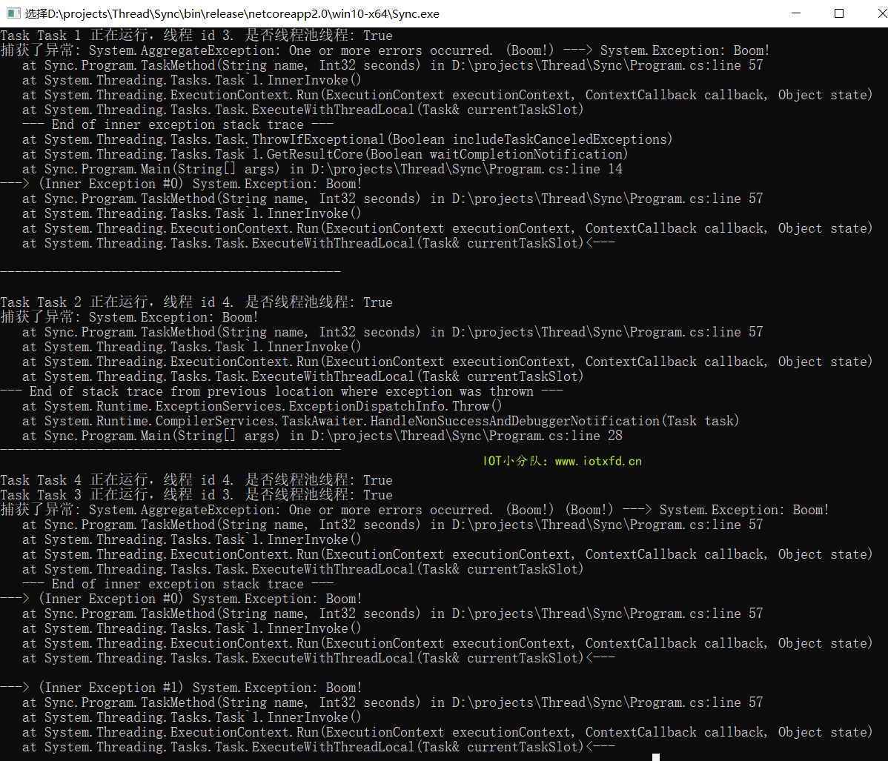

之前在《[线程基础](http://iotxfd.cn/article/Thread Basic/[01]Threading Basics.html)》这篇文章中的【处理异常】这一节中，我们知道，异常应当在工作线程中捕捉，而不是放到主线程中捕捉。但TPL中的工作线程会将异常封闭并传递给主线程捕获。

当程序启动时，创建了一个任务并尝试同步获取任务结果。`Result`属性的`Get`部分会使当前线程等待直到该任务完成，并将异常传播给当前线程。在这种情况下，通过catch代码块可以很容易地捕获异常，但是该异常是一个被封装的异常，叫做`AggregateException`。在本例中，它里面包含一个异常，因为只有一个任务抛出了异常。可以访问`InnerException`属性来得到底层异常。

第二个例子与第一个非常相似，不同之处是使用`GetAwaiter`和`GetResult`方法来访问任务情况。这种情况下无需封装异常，因为TPL基础设施会提取该异常。如果只有一个底层任务，那么一次只能获取一个原始异常，这种设计非常合适。

最后一个例子展示了两个任务抛出异常的情形。现在使用后续操作来处理异常。只有之前的任务完成前有异常时，该后续操作才会被执行。通过给后续操作传递`TaskContinuationOptions.OnlyOnFaulted`选项可以实现该行为。结果打印出了`AggregateException`，其内部封闭了两个任务抛出的异常。`Task.WhenAll(t1, t2)`表示当`t1`和`t2`都执行完毕后才执行`complexTask`。

由于任务可以以非常不同的方式连接，因此结果的`AggregateException`异常可能包含他内部包含普通异常的聚合异常。这些内部的聚合异常自身也可包含其他的聚合异常。

为了摆脱这些对异常的封闭，欠可以使用根聚合异常的`Flatten`方法。它将返回一个集合。该集合包含以层级结构中每个子聚合异常中的内部异常。


### 并行运行任务

本节展示了如何同时运行多个异步任务。我们将学习当所有任务都完成或任意一个任务完成了工作时，如何高效地得到通知。

使用以下命名空间:

```c
using System;
using System.Threading;
using System.Threading.Tasks;
using System.Collections.Generic;
```

添加如下代码：

```c
static void Main(string[] args)
{
	var firstTask = new Task<int>(() => TaskMethod("First Task", 3));
	var secondTask = new Task<int>(() => TaskMethod("Second Task", 2));
	var whenAllTask = Task.WhenAll(firstTask, secondTask);

	whenAllTask.ContinueWith(t =>
		Console.WriteLine("第一个任务结果为 {0}, 第二个任务结果为 {1}", t.Result[0], t.Result[1]),
		TaskContinuationOptions.OnlyOnRanToCompletion
		);

	firstTask.Start();
	secondTask.Start();

	Thread.Sleep(TimeSpan.FromSeconds(4));

	var tasks = new List<Task<int>>();
	for (int i = 1; i < 4; i++)
	{
		int counter = i;
		var task = new Task<int>(() => TaskMethod(string.Format("Task {0}", counter), counter));
		tasks.Add(task);
		task.Start();
	}

	while (tasks.Count > 0)
	{
		var completedTask = Task.WhenAny(tasks).Result;
		tasks.Remove(completedTask);
		Console.WriteLine("一个任务已完成，结果为 {0}.", completedTask.Result);
	}

	Thread.Sleep(TimeSpan.FromSeconds(1));
}

static int TaskMethod(string name, int seconds)
{
	Console.WriteLine("{0} 正在运行，线程 id {1}. 是否线程池线程: {2}",
		name, Thread.CurrentThread.ManagedThreadId, Thread.CurrentThread.IsThreadPoolThread);
	Thread.Sleep(TimeSpan.FromSeconds(seconds));
	return 42 * seconds;
}
```

```
Second Task 正在运行，线程 id 4. 是否线程池线程: True
First Task 正在运行，线程 id 3. 是否线程池线程: True
第一个任务结果为 126, 第二个任务结果为 84
Task 1 正在运行，线程 id 4. 是否线程池线程: True
Task 2 正在运行，线程 id 3. 是否线程池线程: True
Task 3 正在运行，线程 id 6. 是否线程池线程: True
一个任务已完成，结果为 42.
一个任务已完成，结果为 84.
一个任务已完成，结果为 126.
```

当程序启动时，创建了两个任务。然后借助于`Task.WhenAll`方法，创建了第三个任务，该任务将会在所有任务完成后运行。该任务的结果提供了一个结果数组，第一个元素是第一个任务的结果，第二个元素是第二个任务的结果，以此类推。

然后我们创建了另外一系列任务，并使用`Task.WhenAny`方法等待这些任务中的人任何一个完成。当有一个任务完成后，从列表中移除该任务并继续等待其他任务完成，直到列表为空。获取任务的完成进展情况或在运行任务时使用超时，都可以使用`Task.WhenAny`方法。例如，我们等待一组任务运行，并且使用其中一个任务用来记录是否超时。如果该任务先完成，则只需取消掉其他还未完成的任务。


### 使用 TaskScheduler 配置任务的执行

本节将描述处理任务的另一个重要方面，即通过异步代码与UI正确地交互。我们将学习什么是任务调度程序，为什么它如此重要，它如何损害应用程序，以及如何在使用避免错误。

此例需要在Visual Studio中使用Windows窗体应用程序编写代码。

打开Visual Studio，新建一个【Windows窗体应用】，在窗体中放一个【TextBox】控件，三个【Button】控件，如下图所示：

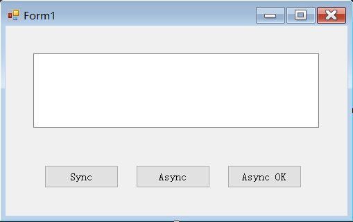 

三个按钮分别命名为：`btnSync`、`btnAsync`、`btnAsyncOK`，TextBox命名为`ContentTextBlock`。

分别双击三个按钮生成事件方法，引入命名空间：`System.Threading`。最终输入代码如下：

```c
private void btnSync_Click(object sender, EventArgs e)
{
	ContentTextBlock.Text = string.Empty;
	try
	{
		//string result = TaskMethod(TaskScheduler.FromCurrentSynchronizationContext()).Result;
		//同步运行方法
		string result = TaskMethod().Result;
		ContentTextBlock.Text = result;
	}
	catch (Exception ex)
	{
		ContentTextBlock.Text = ex.InnerException.Message;
	}
}

private void btnAsync_Click(object sender, EventArgs e)
{
	ContentTextBlock.Text = string.Empty;
	this.Cursor = Cursors.WaitCursor;
	//此处最终使用的是TaskScheduler.Default，使得Task在线程池中运行，无法访问UI
	Task<string> task = TaskMethod();
	task.ContinueWith(t => {
		//此处使用的是TaskScheduler.FromCurrentSynchronizationContext
		//使得Task在UI线程中运行，从而可以将异常打印到UI内
		ContentTextBlock.Text = t.Exception.InnerException.Message;
		this.Cursor = Cursors.Arrow;
	},
		CancellationToken.None,
		TaskContinuationOptions.OnlyOnFaulted,
		TaskScheduler.FromCurrentSynchronizationContext());//此选项使得方法在UI线程中运行
}

private void btnAsyncOk_Click(object sender, EventArgs e)
{
	ContentTextBlock.Text = string.Empty;
	this.Cursor = Cursors.WaitCursor;
	//以下task全部运行于UI线程，可以在UI打印结果
	Task<string> task = TaskMethod(TaskScheduler.FromCurrentSynchronizationContext());
	task.ContinueWith(t => this.Cursor = Cursors.Arrow,
		CancellationToken.None,
		TaskContinuationOptions.None,
		TaskScheduler.FromCurrentSynchronizationContext());
}

Task<string> TaskMethod()
{
	return TaskMethod(TaskScheduler.Default);
}

Task<string> TaskMethod(TaskScheduler scheduler)
{
	Task delay = Task.Delay(TimeSpan.FromSeconds(5));

	return delay.ContinueWith(t =>
	{
		string str = string.Format("Task 运行中，线程 id {0}. 是否线程池线程: {1}",
				Thread.CurrentThread.ManagedThreadId, Thread.CurrentThread.IsThreadPoolThread);
		ContentTextBlock.Text = str;
		return str;
	}, scheduler);
}
```

运行程序，结果如下图所示。蓝框表示运行时所点击的按钮：

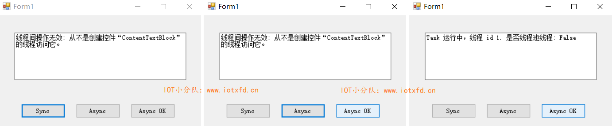

TaskScheduler是一个非常重要的抽象。该组件实际上负责如何执行任务。默认的任务调度程序将任务放置到线程池找作线程中。这是非常见的场景，所以TPL将其作为默认选项并不奇怪。我们已经知道了如何同步运行任务，以及如何将任务附加到父任务上，从而一起运行。现在让我们看看使用任务的其他方式。

当程序启动时，创建了一个包含三个按钮的窗口。第一个按钮调用了一个同步任务的执行。该代码被放置在`btnAsync_Click`方法中。当任务运行时，我们甚至无法移动应用程序窗口。当用户界面线程忙于运行任务时，整个用户界面被完全冻结，在任务完成前无法响应任何消息循环。对于GUI窗口程序来说这是一个相当不好的实践，我们需要找到一个方式来解决该问题。

第二个问题是我们尝试从其他线程访问UI控制器。图形用户界面控制器从没有被设计为可被多线程使用，并且为了避免可能的错误，不允许从创建UI线程之外的线程中访问UI组件。当我们尝试这样做时，得到了一个异常，该异常信息5秒后打印到了主窗口中。

为了解决第一个问题，我们尝试异步运行任务。第二个按钮就是这样做的。该代码被放置在`btnAsync_Click`方法中。当使用调试模式运行该任务时，将会看到该任务被放置在线程池中，最后将得到同样的异常。然而，当任务运行时用户界面一直保持响应。这是好事，但是我们仍需要除掉异常。

给`TaskScheduler.FromCurrentSynchronizationContext`选项提供一个后续操作用于输出错误信息。如果不这样做，我们将无法看到错误信息，因为可能会得到在任务中产生的相同异常。该选项驱使TPL基础设施给UI线程的后续操作中放入代码，并借助UI线程消息循环来异步运行该代码。这解决了从其他线程访问UI控制器并仍保持UI处于响应状态的问题。

为了检查是否真的是这样，可以按下最后一个按钮来运行`btnAsyncOk_Click`方法中的代码。与其余例子不同之处在于我们将UI线程任务调度程序提供给了该任务。你将看到任务以异步方式运行在UI线程中。UI依然保持响应。甚至尽管等待光标处于激活状态，你仍可以按下另一个按钮。

然而使用UI线程运行任务有一些技巧。如果回到同步任务代码，取消对使用UI线程任务调度程序获取结果的代码行的注释，我们将永远得不到任何结果。这是一个经典的死锁情况：我们在UI线程队列中调度了一个操作，UI线程等待该操作完成，但当等待时，它又无法运行该操作，这将永不会结束（甚至永不会开始）。如果在任务中调用`Wait`方法也会发生死锁。为了避免死锁，绝对不要通过任务调度程序在UI线程中使用同步操作，请使用C# 5.0中的`ContinueWith`或`async/await`方法。

## 5.使用C# 6.0

之前的文章，并没有使用C#的最新语法，因为机房安装的是VS2012。估计我上课也不会讲到这里，所以从这篇文章开始，全部使用C#最新语法，如果开发窗体应用，也会使用VS2017。

### 简介

到现在为止，我们学习了任务并行库，这是微软提供的最新的异步编程基础设施。它允许我们以模块化的方式设计程序，来组合不同的异步操作。

遗憾的是，当阅读此类程序时仍然非常难理解程序的实际执行顺序。在大型程序中将会有许多相互依赖的任务和后续操作，用于运行其他后续操作的后续操作，处理异常的后续操作，并且它们都出现在程序代码中不同的地方。因此了解程序的先后执行变成了一个极具挑战性的问题。

另一个需要关注的问题是，能够接触用户界面控制器的每个异步任务是否得到了正确的同步上下文。程序只允许通过UI线程使用这些控制器，否则将会得到多线程访问异常。

说到异常，我们不得不使用单独的后续操作任务来处理在之前的异步操作中发生的错误。这又导致了分散在代码的不同部分的复杂的处理错误的代码，逻辑上无法相互关联。

为了解决这些问题，C# 5.0引入了新的语言特性，称为**异步函数**（asynchronous function）。它是TPL之上的更高级别的抽象，真正简化了异步编程。正如在之前提到的，抽象隐藏了主要的实现细节，使得程序员无须考虑许多重要的事情，从而使异步编程更容易。了解异步函数背后的概念是非常重要的，有助于我们编写健壮的高扩展性的应用程序。

要创建一个异步函数，首先需要用 async 关键字标一个方法。如果不先做这个，就不可能拥有 async 属性或事件访问方法和构造函数。代码如下所示：

```c
async Task<string> GetStringAsync()
{
    await Task.Delay(TimeSpan.FromSeconds(2));
    return "Hello, World!";
}
```

**另一个重要的事实是，异步函数必须返回 Task 或 Task 类型**。可以使用 async void 方法，但是更推荐使用 async Task 方法。使用 async void 方法的唯一合理的地方是在程序中使用顶层UI控制器事件处理器的时候。

使用 async 关键字标注的方法内部，可以使用 await 操作符。该操作符可与TPL的任务一起工作，并获取该任务中异步操作的结果。在本章中稍后会讲述细节。在 async 方法外不能使用 await 关键字，否则会有编译错误。另外，异步函数在其代码中至少要拥有一个 await 操作符。然而，如果没有只会导致编译警告，而不是编译错误。

需要注意的是，在执行完 await 调用的代码行后该方法会立即返回。如果是同步执行，执行线程将会阻塞两秒然后返回结果。这里当执行完 await 操作后，立即将工作者线程放回线程池的过程中，我们会异步等待。2秒后，我们又一次从线程池中得到工作者线程并继续运行其中剩余的异步方法。这允许我们在等待2秒时重用工作者线程做些其他事，这对提高应用程序的可伸缩性非常重要借助于异步函数我们拥有了线性的程序控制流，但它的执行依然是异步的。这虽然好用，但是难以理解。本章将帮助你学习异步函数所有重要的方面。

以我的自身经验而言，如果程序中有两个连续的 await 操作符，此时程序如何工作有一个常见的误解。很多人认为如果在另一个异步操作之后使用 await 函数，它们将会并行运行。然而，事实上它们是顺序运行的，即第一个完成后第二个才会开始运行。记住这一点很重要，在本章中稍后会覆盖该细节。

关联 async 和 await 有一定的限制。例如，在C# 5.0中，不能把控制台程序的 Main 方法标记为 async。不能在 catch、finally、lock 或 unsafe 代码块中使用 await 操作符。不允许对任何异步函数使用 ref 或 out 参数。还有其他微妙的地方，但是以上已经包括了主要的需要注意的地方。C# 6.0 去除了其中一些限制，由于编译器内部进行了改进，可以在 catch 和 finally 代码块中使用 await 关键字。

异步函数会被C#编译器在后台编译成复杂的程序结构。这里我不会说明该细节。生成的代码与另一个 C# 构造很类似，称为**迭代器**。生成的代码被实现为一种状态机。尽管很多程序员几乎开始为每个方法使用 async 修饰符，我还是想强调如果本来无需异步或并行运行，那么将该方法标注为 async 是没有道理的。调用 async 方法会有显著的性能损失，通常的方法调用比使用 async 关键字的同样的方法调用要快上40~50倍。请注意这一点。

在本章中我们将学习如何使用 C# 中的 async 和 await 关键字实现异步操作。本章将讲述如何使用 await 按顺序或并行地执行异步操作，还将讨论如何在 lambda 表达式中使用 await，如果处理异常，以及在使用 async void 方法时如何避免陷阱。在本章结束前，我们会深入探究同步上下文传播机制并学习如何创建自定义的 awaitable 对象，从而无需使用任务。

### 使用 await 操作符获取异步任务结果

本节将讲述使用异步函数的基本场景。我们将比较使用 TPL 和使用 await 操作符获取异步操作结果的不同之处。

在Visual Studio Code中引入以下命名空间：

```c
using System;
using System.Threading;
using System.Threading.Tasks;
```

运行以下代码：

```c
static void Main(string[] args)
{
    Task t = AsynchronyWithTPL();
    t.Wait();

    t = AsynchronyWithAwait();
    t.Wait();
}

static Task AsynchronyWithTPL()
{
    Task<string> t = GetInfoAsync("Task 1");
    Task t2 = t.ContinueWith(task => Console.WriteLine(t.Result),TaskContinuationOptions.NotOnFaulted);
    Task t3 = t.ContinueWith(task => Console.WriteLine(t.Exception.InnerException),TaskContinuationOptions.OnlyOnFaulted);

    return Task.WhenAny(t2, t3);
}

static async Task AsynchronyWithAwait()
{
    try
    {
        string result = await GetInfoAsync("Task 2");
        Console.WriteLine(result);
    }
    catch (Exception ex)
    {
        Console.WriteLine(ex);
    }
}

static async Task<string> GetInfoAsync(string name)
{
    await Task.Delay(TimeSpan.FromSeconds(2));
    //throw new Exception("Boom!");
    return
        $"Task {name} is running on a thread id {Thread.CurrentThread.ManagedThreadId}." +
        $" Is thread pool thread: {Thread.CurrentThread.IsThreadPoolThread}";
}
```

运行结果：

```
Task Task 1 is running on a thread id 4. Is thread pool thread: True
Task Task 2 is running on a thread id 4. Is thread pool thread: True
```

当程序运行时运行了两个异步操作。其中一个是标准的TPL模式的代码，第二个使用了 C# 的新特性 async 和 await。`AsynchronyWithTPL`方法启动了一个任务，运行两秒后返回关于工作者线程信息的字符串。然后我们定义了一个后续操作，用于在异步操作完成后打印出该操作结果，还有另一个后续操作，用于万一有错误发生时打印出异常的细节。最终，返回了一个代表其中一个后续操作任务的任务（正常返回`t2`，出现异常返回`t3`），并等待其在 Main 函数中完成。

在`AsynchronyWithAwait`方法中，我们对任务使用 await 并得到了相同的结果。这和编写通常的同步代码风格一样，即我们获取任务的结果，打印出结果，如果任务完成时带有错误则捕获异常。关键不同的是这实际上是一个异步程序。**使用 await 后，C#立即创建了一个任务，其有一个后续操作任务，包含了 await 操作符后面的所有剩余代码**。**这个新任务也处理了异常传播。然后，将该任务返回到主方法中并等待其完成。**

> 请注意根据底层异步操作的性质和当前异步的上下文，执行异步代码的具体方式可能会不同。稍后在本章中会解释这一点。

因此可以看到程序的第一部分和第二部分在概念上是等同的，但是在第二部分中 C# 编译器隐式地处理了异步代码。事实上，第二部分比第一部分更复杂，接下来我们将讲述细节。

请记住在 Windows GUI 或 ASP.NET 之类的环境中不推荐使用`Task.Wait`和`Task.Result`方法。如果程序员不是百分百地清楚代码在做什么，很可能导致死锁。

取消对`GetInfoAsync`方法的`throw new Exception`代码行的注释，并在`Main`方法的最后加上`Console.ReadLine();`来测试异常处理是否工作。请生成`.exe`文件运行，结果如下图所示：

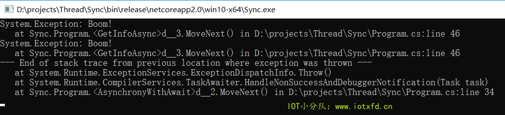 


### 在lambda表达式中使用 await 操作符

本节将展示如何在 lambda表达式中使用 await。我们将编写一个使用了 await 的匿名方法，并且获取异步执行该方法的结果。

运行以下程序：

```c
static void Main(string[] args)
{
    Task t = AsynchronousProcessing();
    t.Wait();
}

static async Task AsynchronousProcessing()
{
    Func<string, Task<string>> asyncLambda = async name =>
    {
        await Task.Delay(TimeSpan.FromSeconds(2));
        return
            $"Task {name} 运行中，线程 id {Thread.CurrentThread.ManagedThreadId}." +
            $" 是否线程池线程: {Thread.CurrentThread.IsThreadPoolThread}";
    };

    string result = await asyncLambda("async lambda");
    Console.WriteLine(result);
}
```

```
Task async lambda 运行中，线程 id 4. 是否线程池线程: True
```

首先，由于不能在 Main 方法中使用 async，我们将异步函数移到了`AsynchronousProcessing`方法中。然后使用 async 关键字声明了一个 lambda 表达式。由于任何 lambda 表达式的类型都不能通过 lambda 自身来推断，所以不得不显式向 C# 编译器指定它的类型。在本例中，该类型说明该 lambda 表达式接受一个字符串参数，并返回一个`Task<string>`对象。

接着，我们定义了 lambda 表达式体。有个问题是该方法被定义为返回一个`Task<string>`对象，但实际上返回的是字符串，却没有编译错误！这是因为 C# 编译器自动产生一个任务并返回给我们。

最后一步是等待异步 lambda 表达式执行并打印出结果。

### 对连续的异步任务使用 await 操作符

本节将展示当代码中有多个连续的 await 方法时，程序的实际流程是怎样的。我们将学习如何阅读有 await 方法的代码，以及理解为什么 await 调用的是异步操作。

```
static void Main(string[] args)
{
    Task t = AsynchronyWithTPL();
    t.Wait();

    t = AsynchronyWithAwait();
    t.Wait();
}

static Task AsynchronyWithTPL()
{
    var containerTask = new Task(() => { 
        Task<string> t = GetInfoAsync("TPL 1");
        t.ContinueWith(task => {
            Console.WriteLine(t.Result);
            Task<string> t2 = GetInfoAsync("TPL 2");
            t2.ContinueWith(innerTask => Console.WriteLine(innerTask.Result),
                TaskContinuationOptions.NotOnFaulted | TaskContinuationOptions.AttachedToParent);
            t2.ContinueWith(innerTask => Console.WriteLine(innerTask.Exception.InnerException),
                TaskContinuationOptions.OnlyOnFaulted | TaskContinuationOptions.AttachedToParent);
            },
            TaskContinuationOptions.NotOnFaulted | TaskContinuationOptions.AttachedToParent);

        t.ContinueWith(task => Console.WriteLine(t.Exception.InnerException),
            TaskContinuationOptions.OnlyOnFaulted | TaskContinuationOptions.AttachedToParent);
    });

    containerTask.Start();
    return containerTask;
}

static async Task AsynchronyWithAwait()
{
    try
    {
        string result = await GetInfoAsync("Async 1");
        Console.WriteLine(result);
        result = await GetInfoAsync("Async 2");
        Console.WriteLine(result);
    }
    catch (Exception ex)
    {
        Console.WriteLine(ex);
    }
}

static async Task<string> GetInfoAsync(string name)
{
    Console.WriteLine($"Task {name} 开始!");
    await Task.Delay(TimeSpan.FromSeconds(2));
    if(name == "TPL 2")
        throw new Exception("Boom!");
    return
        $"Task {name} 正在运行，线程id {Thread.CurrentThread.ManagedThreadId}." +
        $" 是否线程池线程: {Thread.CurrentThread.IsThreadPoolThread}";
}
```

当程序运行时，与上节一样运行了两个异步操作。然而这次从`AsynchronyWithAwait`方法讲起。它看起来仍然像平常的同步代码，唯一不同之处是使用了两个 await 声明。最重要的一点是该代码依然是顺序执行的，`Async 2` 任务只有等之前的任务完成后才会开始执行。当阅读该代码时，程序流很清晰，可以看到什么先运行，什么后运行。但该程序如何是异步程序呢？首先，它不总是异步的。当使用 await 时如果一个任务已经完成，我们会异步地得到该任务结果。否则，当在代码中看到 await 声明时，通常的行为是方法执行到该 await代码行时将立即返回，并且剩下的代码将会在一个后续操作任务中运行。因此等待操作结果时并没有阻塞程序执行，这是一个异步调用。当`AsynchronyWithAwait`方法中的代码在执行时，除了在 Main 方法中调用`t.Wait`外，我们可以执行任何其他任务。然而，主线程必须等待直到所有异步操作完成，否则主线程完成后所有运行异步操作的后台线程会停止运行。

`AsynchronyWithTPL`方法模仿了`AsynchronyWithAwait`的程序流。我们需要一个容器任务来处理所有相互依赖的任务。然后启动主任务，给其加了一组后续操作。当该任务完成后，会打印出其结果。然后又启动了一个任务，在该任务完成后会依次运行更多的后续操作。为了测试对异常的处理，当运行第二个任务时故意抛出一个异常，并打印出异常信息。这组后续操作创建了与第一个方法中一样的程序流。如果用它与 await 方法比较，可以看到空更容易阅读和理解。唯一的技巧是请记住异步并不总是意味着并行执行。

### 对并行执行的异步任务使用 await 操作符

本节将学习如何使用 await 来并行地运行异步任务，而不是采用常用的顺序执行。

```
static void Main(string[] args)
{
    Task t = AsynchronousProcessing();
    t.Wait();
}

static async Task AsynchronousProcessing()
{
    Task<string> t1 = GetInfoAsync("Task 1", 3);
    Task<string> t2 = GetInfoAsync("Task 2", 5);

    string[] results = await Task.WhenAll(t1, t2);
    foreach (string result in results)
    {
        Console.WriteLine(result);
    }
}

static async Task<string> GetInfoAsync(string name, int seconds)
{
    await Task.Delay(TimeSpan.FromSeconds(seconds));
    //await Task.Run(() => Thread.Sleep(TimeSpan.FromSeconds(seconds)));
    return
        $"Task {name} 正在运行，线程 id {Thread.CurrentThread.ManagedThreadId}." +
        $" 是否线程池线程: {Thread.CurrentThread.IsThreadPoolThread}";
}
```

运行结果：

```
Task Task 1 正在运行，线程 id 4. 是否线程池线程: True
Task Task 2 正在运行，线程 id 4. 是否线程池线程: True
```

这里定义了两个异步任务，分别运行3秒和5秒。然后使用`Task.WhenAll`辅助方法创建了另一个任务，该任务只有在所有底层任务完成后才会运行。之后我们等待该组合任务的结果。5秒后，我们获取了所有结果，说明了这些任务是同时运行的。

然而这里观察到一个有意思的现象。当运行该程序时，你可能注意到这两个任务似乎是被线程池中的同一个工作线程执行的。当我们并行运行任务时怎么可能发生这样的事情呢？为了让事情更有趣，我们来注释掉`GetInfoAsync`方法中的`await Task.Delay`代码行，并解除对`await Task.Run`代码行的注释，然后再次运行程序。结果如下：

```
Task Task 1 正在运行，线程 id 3. 是否线程池线程: True
Task Task 2 正在运行，线程 id 5. 是否线程池线程: True
```

我们会看到该情况下两个任务会被不同的工作者线程执行。不同之处是`Task.Delay`在幕后使用了一个计时器，过程如下：从线程池中获取工作者线程，它将等待`Task.Delay`方法返回结果。然后`Task.Delay`方法启动计时器并指定一块代码，该代码会在计时器时间到了`Task.Delay`方法中指定的秒数后被调用。之后立即将工作者线程返回到线程池中。当计时器事件运行时，我们又从线程池中任意获取一个可用的工作者线程（可能就是运行一个任务时使用的线程）并运行计时器提供给它的代码。

当使用`Task.Run`方法时，从线程池中获取了一个工作者线程并将其阻塞几秒，具体秒数由`Thread.Sleep`方法提供。然后获取了第二个工作者线程并且也将其阻塞。在这种场景下，我们消费了两个工作者线程，而它们绝对什么事没做，因为在它们等待时不能执行任何其他操作。

我们将在之后讨论第一个场景的细节。到时会讨论用大量的异步操作进行数据输入和输出。尽可能地使用第一种方式是创建高伸缩性的服务器程序的关键。


# c#socket编程


## socket多线程编程

我们留下了很多问题。今天先解决服务无法侦听第二个连接的问题。想要解决这个问题，当然需要使用多线程了。这里我们先使用最原始的线程 Thread 来解决这问题。即使 Thread 已经被淘汰，但我觉得在这个场景下使用 Thread 还是挺好的，首先长线程不适合使用线程池，其次结构清晰，明了，易于理解，算是将来使用更高级异步网络编程的一个基础吧。


### 服务器接收多个客户端连接

首先来看上篇文章中最后一个服务器程序的流程图：

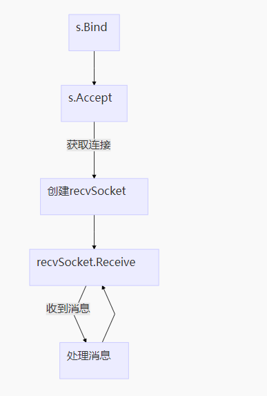 

由图可知`s.Accept`会阻塞进程，一旦调用，服务器就无法做其它的事了。所以这里需要专门开一个线程用于`s.Accept`。流程变成如下形式：

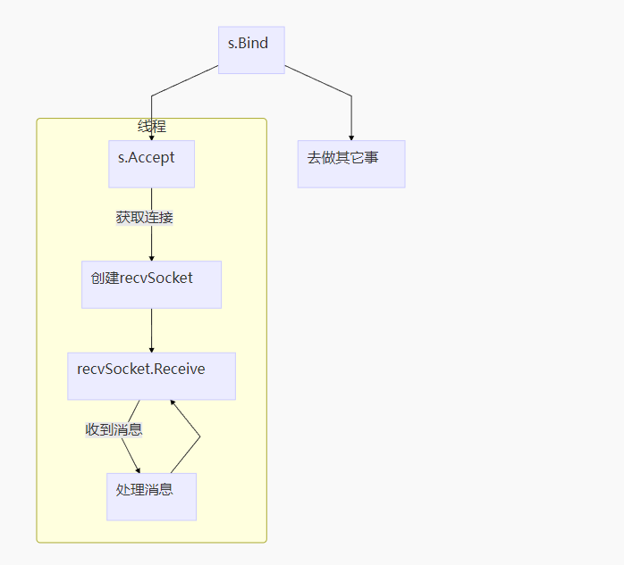 

现在我们专门开了一个线程去执行`s.Accept`并处理接收消息，服务器在等待连接的同时，可以去做其它的事情了。

新的问题来了，看上图可知程序一旦接收到连接，会继续往下执行，就再也无法再回到`s.Accept`去接收新的连接了。而且`recvSocket.Receive`也会阻塞程序，也就是说`recvSocket.Receive`和`s.Accept`是无法在同一个线程里同时工作的。这里就需要在接收到新客户端连接时，专门再开一个线程去处理这个客户端的事情。如下图所示：

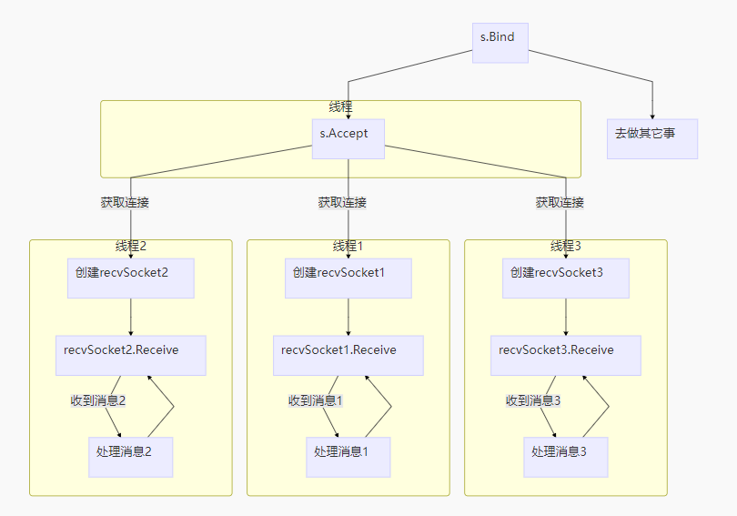 

现在终于可以同时处理多个连接请求了，而且每个请求互不干扰。下面按照这个想法把代码写出来。直接在上一篇文章的基础上修改代码。

添加以下命名空间：

```c
using System.Threading;
```

```
static void Main(string[] args)
{
    IPAddress ip = IPAddress.Parse("127.0.0.1");
    IPEndPoint point = new IPEndPoint(ip, 5000);
    Socket s = new Socket(AddressFamily.InterNetwork, SocketType.Stream, ProtocolType.Tcp);

    s.Bind(point);
    s.Listen(5);
    Console.WriteLine("服务器开始侦听...");
    //创建线程去监听客户端连接
    Thread listenThread = new Thread(() => ListenConnect(s));
    listenThread.IsBackground = true; //一定要设置为后台线程，否则程序无法关闭
    listenThread.Start();

    Console.ReadLine();
}
//监听客户端连接的线程方法
static void ListenConnect(Socket s)
{
    while (true)
    {
        Socket recvSocket = s.Accept();
        Console.WriteLine("获取一个来自{0}的连接", recvSocket.RemoteEndPoint.ToString());
        //创建专门的线程去监听客户端发送信息请求
        Thread receiveThread = new Thread(() => ReceiveMessage(recvSocket));
        receiveThread.IsBackground = true;
        receiveThread.Start();
    }
}
//接收指定客户端发送信息的线程
static void ReceiveMessage(Socket recvSocket)
{
    string ip = recvSocket.RemoteEndPoint.ToString();
    byte[] buff = new byte[1024]; //创建一个接收缓冲区
    try
    {
        while (true)
        {
            int count = recvSocket.Receive(buff, buff.Length, SocketFlags.None);
            string recvStr = Encoding.Unicode.GetString(buff, 0, count);
            Console.WriteLine("接收到来自{0}数据：{1}", ip, recvStr);
        }
    }
    catch (Exception e)
    {
        Console.WriteLine(e.Message);
    }
    finally
    {
        recvSocket.Close();//客户端关闭时会引发异常，此时关闭此连接
        Console.WriteLine("{0} 已退出连接。", ip);
    }
}
```

先运行服务器，然后找到上篇文章最后的客户端程序所生成的`.exe`文件，打开多个客户端，运行效果如下：

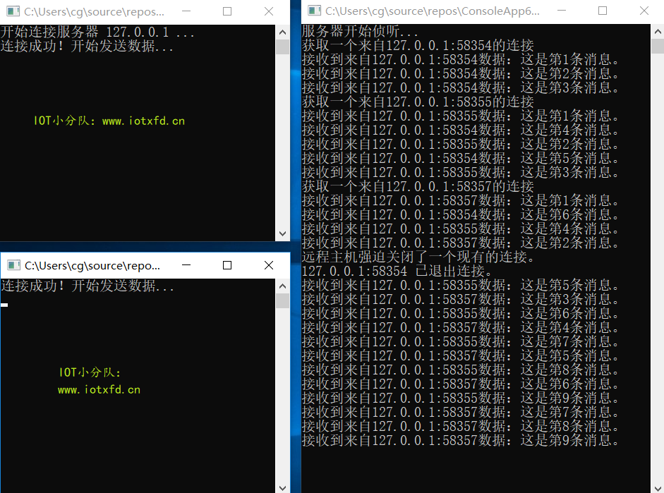 

我是先后打开三个客户端，然后提前关闭了第一个打开的客户端。

### 控制台版聊天程序

学了这么多，来练练手，做个控制台版聊天程序。当然，第一个聊天程序，一切重简，只允许一个服务器和一个客户端之间进行在聊天，任何一端即可发信息，也可收信息。

#### 服务器程序

由于服务器只接收一个客户端连接，所以无需专门开一个线程专门侦听客户端连接。在侦听到连接之后，由于接收消息会阻塞程序运行，则需要开一个线程接收消息，开另一个线程发送消息。

修改服务器端代码如下：

```c
static void Main(string[] args)
{
    IPAddress ip = IPAddress.Parse("127.0.0.1");
    IPEndPoint point = new IPEndPoint(ip, 5000);
    Socket s = new Socket(AddressFamily.InterNetwork, SocketType.Stream, ProtocolType.Tcp);
    s.Bind(point);
    s.Listen(5);
    Console.WriteLine("服务器开始侦听...");
    Socket subSocket = s.Accept();
    Console.WriteLine("获取来自{0}的连接", subSocket.RemoteEndPoint.ToString());
    //接收消息线程
    Thread tRecv = new Thread(() => ReceiveMessage(subSocket));
    tRecv.Start();
    //发送消息线程
    Thread tSend = new Thread(() => SendMessage(subSocket));
    tSend.Start();
}
//接收消息的线程方法
static void ReceiveMessage(Socket recvSocket)
{
    string ip = recvSocket.RemoteEndPoint.ToString();
    byte[] buff = new byte[1024]; //创建一个接收缓冲区
    try
    {
        while (true)
        {
            int count = recvSocket.Receive(buff, buff.Length, SocketFlags.None);
            string recvStr = Encoding.Unicode.GetString(buff, 0, count);
            Console.WriteLine("接收到来自{0}数据：{1}", ip, recvStr);
        }
    }
    catch (Exception e)
    {
        Console.WriteLine(e.Message);
    }
    finally
    {
        recvSocket.Close();
        Console.WriteLine("{0} 已退出连接。", ip);
    }
}
//发送消息的线程方法
static void SendMessage(Socket subSocket)
{
    while (true)
    {
        string sendStr = Console.ReadLine();
        byte[] sendBuff = Encoding.Unicode.GetBytes(sendStr);
        subSocket.Send(sendBuff, sendBuff.Length, SocketFlags.None);
    }
}
```

这里需要注意的是线程不能设置为后台线程，否则程序会提前退出。现在的处理方法也不完善，仅作为演示。

#### 客户端代码

客户端代码除了连接部分不一样，其余和服务器端代码类似。

修改客户端代码如下：

```c
static void Main(string[] args)
{
    //获取服务器端IP地址
    IPAddress ip = IPAddress.Parse("127.0.0.1");
    try
    {
        Socket s = new Socket(AddressFamily.InterNetwork, SocketType.Stream, ProtocolType.Tcp);
        s.Connect(ip, 5000); //向服务器发起连接
        Console.WriteLine("开始连接服务器 {0} ...", ip.ToString());
        if(s.Connected)
        {
            Console.WriteLine("连接成功！");
        }
        //发送消息线程
        Thread tSend = new Thread(() => SendMessage(s));
        tSend.Start();
        //接收消息线程
        Thread tRecv = new Thread(() => ReceiveMessage(s));
        tRecv.Start();
    }
    catch(Exception e)
    {
        Console.WriteLine(e.Message);
    }
}
//发送消息线程方法
static void SendMessage(Socket s)
{
    while (true)
    {
        string sendStr = Console.ReadLine();
        byte[] sendBuff = Encoding.Unicode.GetBytes(sendStr);
        s.Send(sendBuff, sendBuff.Length, SocketFlags.None);
    }
}
//接收消息线程方法
static void ReceiveMessage(Socket s)
{
    byte[] recvBuff = new byte[1024];
    try
    {
        while (true)
        {
            int count = s.Receive(recvBuff, recvBuff.Length, SocketFlags.None);
            string recvStr = Encoding.Unicode.GetString(recvBuff, 0, count);
            Console.WriteLine("收到服务器信息：{0}", recvStr);
        }
    }
    catch(Exception e)
    {
        Console.WriteLine(e.Message);
    }
    finally
    {
        s.Close();
        Console.WriteLine("服务器已经退出连接。");
    }
}
```

先运行服务器代码，再运行客户端代码，效果如下：

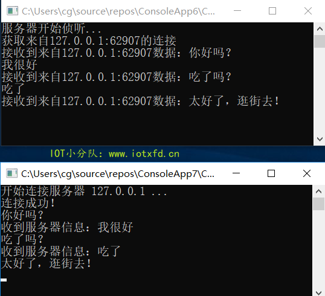 


## Socket异步编程之 Begin/End 模式

上篇文章，我们讲解了使用最原始 Thread 进行编程，但 Thread 实际上现在已经很少使用了。用得比较多的是 Begin/End,即使现在查微软的网络编程文档，介绍的还是这种编程模型。它并不是最新的网络编程模型，而且使用和理解起来还比较困难、麻烦。但想到现在大多数项目用的都是这个模型，学习还是很有必要的。另外此处不再是授课内容，将使用最新 C# 语法。

### 建立连接

之前我们在 Thread 编程中需要自己手动创建线程做一系列操作，**Begin/End 编程模型则不再需要你去创建线程，它会在内部使用线程完成一系列操作，最重要的是它使用的是线程池。**在 Thread 编程模型中，我们使用`Socket.Accept()`方法接收连接，然后创建线程去处理这些连接。如果在短时间内有成百上千的连接，对这些连接一一创建线程显然会耗费大量服务器资源，而使用线程池当然是一个很好的选择。**在异步模式下，服务器可以使用`BeginAccept`方法和`EndAccept`方法来接受客户端连接的任务，在客户端则通过`BeginConnect`方法和`EndConnect`方法来实现向服务器的连接请求。**


#### 单次连接

先来个最简单的，服务器只接受一个客户端连接。

##### 服务器程序

在 Visual Studio 中新建一个控制台应用程序，使用如下命名空间：

```
using System;
using System.Net;
using System.Net.Sockets;
```

```
static void Main(string[] args)
{
    IPAddress ip = IPAddress.Parse("127.0.0.1");
    IPEndPoint point = new IPEndPoint(ip, 5000);
    Socket listener = new Socket(AddressFamily.InterNetwork, SocketType.Stream, ProtocolType.Tcp);
    try
    {
        listener.Bind(point);
        listener.Listen(5);
        listener.BeginAccept(new AsyncCallback(AcceptCallback), listener);//开始侦听连接
        Console.WriteLine("服务器开始侦听...");
    }
    catch(Exception e)
    {
        Console.WriteLine(e.Message);
    }
    Console.ReadLine();
}
//成功收到连接请求后调用的回调函数
static void AcceptCallback(IAsyncResult ar)
{
    Socket listener = (Socket)ar.AsyncState; //将参数ar还原为Socket
    Socket handler = listener.EndAccept(ar); //EndAccept对应BeginAccept，它会阻塞线程，直到收到连接后解除阻塞，并结束一个侦听周期，
    Console.WriteLine($"侦听到来自{handler.RemoteEndPoint.ToString()}的连接请求");
}
```

`listener.BeginAccept()`方法用于开始侦听客户端连接，它会去线程池开一个线程用于侦听服务，然后立即返回，继续执行下面的代码打印出`服务器开始侦听...`，这点在之后运行程序的结果中可验证。当有客户端发送连接请求后，则会自动调用`AcceptCallback`回调函数。

`BeginAccept`方法原型为：

```c
public IAsyncResult BeginAccept(AsyncCallback callback, object state);
```

- callback：为回调函数委托，原型为：

  ```c
    public delegate void AsyncCallback(IAsyncResult ar);
  ```

  参数ar是一个IAsyncResult接口实例，用于表示线程状态

- **state**：为一个 object 对象，方法内部会将它传递给`callback`参数`ar`的`AsyncState`属性，在此处应传递侦听 Socket 的实例，以便使用此 Socket 进行后续操作。

`BeginAccept`和`EndAccept`需要成对使用，本例在主线程中开始侦听时使用`BeginAccept`；在接收到连接后调用的回调函数中使用`EndAccept`阻塞工作线程，并在收到一个连接后解除阻塞，从而结束一个侦听周期。

从代码可知，这种编程机制已经非常古老，使用的还是最原始的委托。现在可以使用lambda表达式将回调函数直接写在`BeginAccept()`方法中：

```
listener.BeginAccept(new AsyncCallback((ar)=> {
    Socket s = (Socket)ar.AsyncState;
    Socket handler = s.EndAccept(ar);
    Console.WriteLine($"侦听到来自{handler.RemoteEndPoint.ToString()}的连接请求");
}), listener);
```

甚至可以使用闭包机制，直接调用主线程 Socket，不再需要参数传递：

```c
listener.BeginAccept(new AsyncCallback((ar)=> {
    Socket handler = listener.EndAccept(ar);
    Console.WriteLine($"侦听到来自{handler.RemoteEndPoint.ToString()}的连接请求");
}), null);
```

以上两种方式测试可以使用，但实际使用时闭包会不会出问题，不得而知。之后的代码还是老老实实按照微软文档的方式，使用委托。

##### 客户端程序

新建一个控制台应用程序，使用如下命名空间：

```c
using System;
using System.Net;
using System.Net.Sockets;
```

使用如下代码：

```c
static void Main(string[] args)
{
    IPAddress ip = IPAddress.Parse("127.0.0.1");
    try
    {
        Socket s = new Socket(AddressFamily.InterNetwork, SocketType.Stream, ProtocolType.Tcp);
        IPEndPoint point = new IPEndPoint(ip, 5000);
        s.BeginConnect(point, new AsyncCallback(ConnectCallback), s); //向服务器发起连接
        Console.WriteLine($"开始连接服务器 {ip.ToString()} ...");
    }
    catch(Exception e)
    {
        Console.WriteLine(e.Message);
    }
    Console.ReadLine();
}
//连接成功后的回调函数
static void ConnectCallback(IAsyncResult ar)
{
    try
    {
        Socket s = (Socket)ar.AsyncState;
        s.EndConnect(ar);//连接结束
        Console.WriteLine($"成功连接服务器 {s.RemoteEndPoint.ToString()} ");
    }
    catch(Exception e)
    {
        Console.WriteLine(e.Message);
    }
}
```

理解了`BeginAccept`和`EndAccept`，也就理解了`BeginConnect`和`EndConnect`。两者使用上没什么分别，都是成对出现，一个开始，一个结束，甚至使用的委托都完全相同。

运行效果如下图所示：

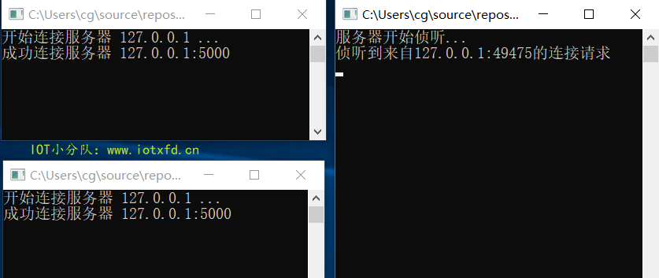 

从运行结果可知，开第一个客户端，服务器收到连接，但开第二个客户端，服务器就没有收到连接了。这是因为一个`BeginConnect`只能接收一个连接，而程序只执行了一次`BeginConnect`。要想重复接收，只能象之前处理的一样，使用`while(true)`不断循环执行`BeginConnect`。


#### 多客户端连接

由于`BeginConnect`并不阻塞程序，直接套`while(true)`肯定是行不通的，瞬间开几万条线程是分分钟的事。所以只能手动阻塞，微软示例中使用的是`ManualResetEvent`。这个类我们在多线程相关文章中并没有讲到，但它的使用方法和`ManualResetEventSlim`一样，请参考《[线程同步](http://iotxfd.cn/article/Thread Basic/[02]Thread Synchronization.html)》这篇文章。

`ManualResetEvent`的机制是发一个信号可以允许多条等待线程通过：

- WaitOne方法：阻塞线程，等待其它线程调用了 Set 方法方能继续运行。
- Set方法：开门，允许调用了 Wait 的所有 ManualResetEvent 类通过
- Reset方法：关门

更改服务器代码如下：

```c
public static ManualResetEvent allDone = new ManualResetEvent(false);//线程信号

static void Main(string[] args)
{
    IPAddress ip = IPAddress.Parse("127.0.0.1");
    IPEndPoint point = new IPEndPoint(ip, 5000);
    Socket listener = new Socket(AddressFamily.InterNetwork, SocketType.Stream, ProtocolType.Tcp);
    try
    {
        listener.Bind(point);
        listener.Listen(5);
        Console.WriteLine("服务器开始侦听...");
        while (true)
        {
            allDone.Reset();//关门
            listener.BeginAccept(new AsyncCallback(AcceptCallback), listener);//开始侦听连接
            allDone.WaitOne();//阻塞主线程
        }
    }
    catch (Exception e)
    {
        Console.WriteLine(e.Message);
    }
    Console.ReadLine();
}
//成功收到连接请求后调用的回调函数
static void AcceptCallback(IAsyncResult ar)
{
    allDone.Set();//开门
    Socket listener = (Socket)ar.AsyncState;
    Socket handler = listener.EndAccept(ar);
    Console.WriteLine($"侦听到来自{handler.RemoteEndPoint.ToString()}的连接请求");
}
```

运行程序并直接使用上例中的客户端程序，多开几个，运行效果如下：

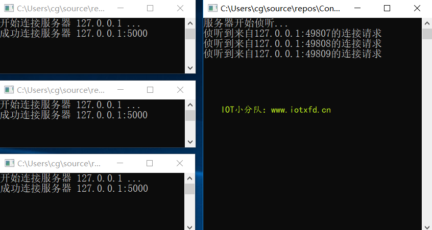 

现在可以接收多个客户端的连接了。

画张图演示程序运行过程
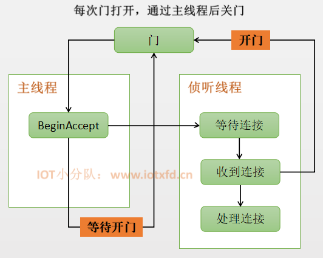 

虽然 ManualResetEvent 一次允许多条线程通过，但这里只有主线程调用，所以每次只会有主线程一条线程通过。所以执行过程如图所示：`BeginAccept`执行时会到线程池取线程进行侦听，同时到门口等着门打开，当客户端有连接请求时，在处理连接的同时会把门打开，使得主线程通过大门进入到下一个 Accept 周期，同时大门关闭。

从这段代码可知，虽然`BeginAccept`另外开了一条线程进行监听，但主线程还是会被`allDone.WaitOne()`阻塞住的，所以在实际应用中，还得要专门开一个线程来处理侦听连接。这就比之前用用线程处理同步的`Accept`多一个线程了，使用起来还是相对麻烦的。当然，这里用到线程池以及专门的机制，对I/O密集型操作当然更好，出错的几率更低。


### 数据的发送和接收

#### 服务器程序

数据的接收与 Accept 和 Connect 机制类似，也是使用`BeginReceive`和`EndReceive`配对使用。

首先来看看`BeginReceive`方法原型：

```c
public IAsyncResult BeginReceive(byte[] buffer, int offset, int size, SocketFlags socketFlags, AsyncCallback callback, object state);
```

其中：

- **buffer**：接收缓区
- **offset**：缓冲中所接收数据的存储位置，该位置从零开始计数
- **size**：缓冲区长度
- **socketFlags**：指定 Socket 的发送和接收行为
- **callback**：回调函数委托，前面已经介绍过
- **object**：用户定义的对象，其中包含有关接收操作的信息。 当操作完成时，此对象会被传递给 `EndReceive`

这些参数后两个本文之前已经提到过。而前面的四个参数除了 offset 相信大家在上篇文章中全都使用过，只是在这里需要作为参数传递而已。offset 一般情况下设置为0即可。

更改服务器代码如下：

```c
public class StateObject //将BeginReceive需要的的参数包装在此类中进行传递
{
    public Socket workSocket = null;
    public const int BufferSize = 1024;//缓冲区大小
    public byte[] buffer = new byte[BufferSize];//接收缓冲
}

public static ManualResetEvent allDone = new ManualResetEvent(false);//线程信号

static void Main(string[] args)
{
    IPAddress ip = IPAddress.Parse("127.0.0.1");
    IPEndPoint point = new IPEndPoint(ip, 5000);
    Socket listener = new Socket(AddressFamily.InterNetwork, SocketType.Stream, ProtocolType.Tcp);
    try
    {
        listener.Bind(point);
        listener.Listen(5);
        Console.WriteLine("服务器开始侦听...");
        while (true)
        {
            allDone.Reset();//关门
            listener.BeginAccept(new AsyncCallback(AcceptCallback), listener);//开始侦听连接
            allDone.WaitOne();//阻塞主线程
        }
    }
    catch (Exception e)
    {
        Console.WriteLine(e.Message);
    }
    Console.ReadLine();
}
//成功收到连接请求后调用的回调函数
static void AcceptCallback(IAsyncResult ar)
{
    allDone.Set();//开门
    Socket listener = (Socket)ar.AsyncState;
    Socket handler = listener.EndAccept(ar);
    Console.WriteLine($"侦听到来自{handler.RemoteEndPoint.ToString()}的连接请求");

    StateObject state = new StateObject();
    state.workSocket = handler;
    handler.BeginReceive(state.buffer, 0, StateObject.BufferSize, SocketFlags.None,
        new AsyncCallback(ReadCallback), state);
}
//收到 socket 发送的信息后触发的接收回调函数
static void ReadCallback(IAsyncResult ar)
{
    try
    {
        StateObject state = (StateObject)ar.AsyncState;
        Socket handler = state.workSocket;
        int count = handler.EndReceive(ar);//这句会阻塞程序，直接接收到数据为止
        string recvStr = Encoding.Unicode.GetString(state.buffer, 0, count);
        Console.WriteLine($"收到{handler.RemoteEndPoint.ToString()}发来的信息：{recvStr}");
        //进入到下一个等待接收周期
        handler.BeginReceive(state.buffer, 0, StateObject.BufferSize, SocketFlags.None,
            new AsyncCallback(ReadCallback), state);
    }
    catch(Exception e)
    {
        Console.WriteLine(e.Message);
    }
}
```

本例使用了一个内部类`StateObject`将`BeginReceive`所需参数包装起来并方便在回调函数中进行传递。

另外，我们也注意到，跟上一篇文章中的同步接收进行对比，这里没有使用`while(true)`循环接收数据，而是直接在回调函数内再一次调用`BeginReceive`而进入到下一个接收周期。然后本线程结束，接力棒交到下一个`ReadCallback`。有点递归的感觉。流程如下图所示：

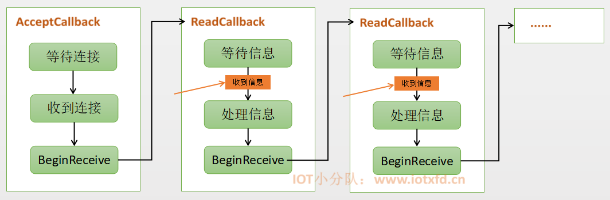


#### 客户端程序

数据的发送使用`BeginSend`和`EndSend`配对使用。

```c
public IAsyncResult BeginSend(byte[] buffer, int offset, int size, SocketFlags socketFlags, AsyncCallback callback, object state);
```

参数和之前的`BeginReceive`完全一样，这里就不再赘述了。

将客户端代码更改如下：

```c
private static ManualResetEvent connectDone = new ManualResetEvent(false);//控制连接
private static ManualResetEvent sendDone = new ManualResetEvent(false);//控制发送
static void Main(string[] args)
{
    IPAddress ip = IPAddress.Parse("127.0.0.1");
    try
    {
        Socket s = new Socket(AddressFamily.InterNetwork, SocketType.Stream, ProtocolType.Tcp);
        IPEndPoint point = new IPEndPoint(ip, 5000);
        s.BeginConnect(point, new AsyncCallback(ConnectCallback), s); //向服务器发起连接
        Console.WriteLine($"开始连接服务器 {ip.ToString()} ...");
        connectDone.WaitOne();//等待连接成功

        Console.WriteLine("开始发送信息");
        for (int i = 0; i < 10; i++)
        {
            byte[] sendBuff = Encoding.Unicode.GetBytes($"消息 {i}");
            s.BeginSend(sendBuff, 0, sendBuff.Length, SocketFlags.None,
                new AsyncCallback(SendCallback), s);
            sendDone.WaitOne();//等待发送成功
            Thread.Sleep(1000);//挂起1秒，稍后删掉
        }
    }
    catch (Exception e)
    {
        Console.WriteLine(e.Message);
    }
    Console.ReadLine();
}
//连接成功后的回调函数
static void ConnectCallback(IAsyncResult ar)
{
    try
    {
        Socket s = (Socket)ar.AsyncState;
        s.EndConnect(ar);
        Console.WriteLine($"成功连接服务器 {s.RemoteEndPoint.ToString()} ");
        connectDone.Set();//开门，通知主线程连接完成
    }
    catch (Exception e)
    {
        Console.WriteLine(e.Message);
    }
}
//发送回调函数
static void SendCallback(IAsyncResult ar)
{
    try
    {
        Socket s = (Socket)ar.AsyncState;
        int count = s.EndSend(ar);
        sendDone.Set();//开门，通知主线程继续发送信息
    }
    catch (Exception e)
    {
        Console.WriteLine(e.Message);
    }
}
```

由于`BeginSend`是异步操作，为避免多条信息同时发送，使用`sendDone`控制顺序发送，使得一条信息发送完毕后再发送下一条。运行程序，效果如下图所示：

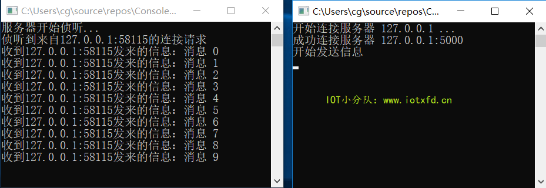 

另外，使用`connectDone`等待连接成功，如果注释掉 Main 方法中的`sendDone.WaitOne();`，将会看到先打印发送消息，然后再打印连接成功。

#### 粘包问题

将上例代码中的客户端 Main 方法中的`Thread.Sleep(1000);`这句代码删除，再次运行，结果如下图所示：

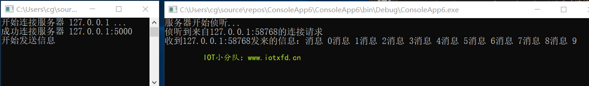

对比上例运行结果，我们发现发送的消息全连在一起了。这是因为发送速度太快，旧的数据还未接收，新的数据已经压入缓冲。这种现象叫粘包，前面讲的使用同步接收也会出现同样的问题，只是当时每发送一条消息后，都会停顿一段时间，所以没出现而已。要解决这类问题，只能手动划定边界了。

在客户端发消息时，在每条消息后面加一个’\n’作为结束标记，然后在服务器端解析消息时，以’\n’为界，将取出的字符串分段打印。

客户端发消息的`for`循环改为：

```c
for (int i = 0; i < 1000; i++)
{   //给每条消息后面加一个'\n'作为结束标记
    byte[] sendBuff = Encoding.Unicode.GetBytes($"消息 {i}"+"\n");
    s.BeginSend(sendBuff, 0, sendBuff.Length, SocketFlags.None,
        new AsyncCallback(SendCallback), s);
    sendDone.WaitOne();
}
```

服务器端的`ReadCallback`方法代码改为：

```c
static void ReadCallback(IAsyncResult ar)
{
    try
    {
        StateObject state = (StateObject)ar.AsyncState;
        Socket handler = state.workSocket;
        int count = handler.EndReceive(ar);
        string recvStr = Encoding.Unicode.GetString(state.buffer, 0, count);
        int i = 0, pos = 0;
        //以'\n'为界，取出每段字符
        while (i < recvStr.Length)
        {
            if (recvStr[i] == '\n')
            {
                string s = recvStr.Substring(pos, i - pos);
                Console.WriteLine(s);
                pos = i + 1;
            }
            i++;
        }
        //进入到下一个等待接收周期
        handler.BeginReceive(state.buffer, 0, StateObject.BufferSize, SocketFlags.None,
            new AsyncCallback(ReadCallback), state);
    }
    catch (Exception e)
    {
        Console.WriteLine(e.Message);
    }
}
```

运行程序，这里只贴出服务端结果：

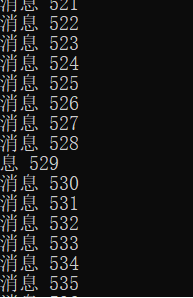 

结果看似没问题，但浏览全部收到的消息，可以发现，每隔一段就会出现字符丢失的情况。这是因为缓冲区满时，一条消息可能会被分成两段，第一段在这次发送，第二段在下次发送。使用当前算法使得第一段丢失。所以需要改进算法，将第一段保存下来，留到下次接收时接上。继续更改服务器代码：

更改`StateObject`类代码如下：

```c
public class StateObject
{
    public Socket workSocket = null;
    public const int BufferSize = 1024;//缓冲区大小
    public byte[] buffer = new byte[BufferSize];//接收缓冲
    public string remainStr = ""; //上次接收的消息解析后的剩余部分
}
```

更改`ReadCallback`代码如下：

```c
static void ReadCallback(IAsyncResult ar)
{
    try
    {
        StateObject state = (StateObject)ar.AsyncState;
        Socket handler = state.workSocket;
        int count = handler.EndReceive(ar);
        string recvStr = Encoding.Unicode.GetString(state.buffer, 0, count);
        int i = 0, pos = 0;
        //找到第一个结束标记，将第一段字符串取出跟上次剩余的字符串合并
        while (recvStr[i] != '\n')
        {
            i++;
        }
        Console.WriteLine($"{state.remainStr}{recvStr.Substring(0, i)}");
        pos = ++i;
        //以'\n'为界，取出每段字符
        while (i < recvStr.Length)
        {
            if (recvStr[i] == '\n')
            {
                string s = recvStr.Substring(pos, i - pos);
                Console.WriteLine(s);
                pos = i + 1;
            }
            i++;
        }
        //剩余的无'\n'结尾的字符存入state.remainStr供下次使用
        state.remainStr = recvStr.Substring(pos, i - pos);
        //进入到下一个等待接收周期
        handler.BeginReceive(state.buffer, 0, StateObject.BufferSize, SocketFlags.None,
            new AsyncCallback(ReadCallback), state);
    }
    catch (Exception e)
    {
        Console.WriteLine(e.Message);
    }
}
```

现在再运行程序，就不会有字符丢失了。

Begin/End 就介绍到这吧，也不做例子了。因为这并不是最新的编程模型，了解即可，以后看别人的源码可能会用到。


## Socket异步编程之 Async 模式

之前讲的 Begin/End 模式是 .NET Framework 2.0 时候出的基于 APM 的 Socket 异步编程模型。之后的 .NET Framework 3.5 出现了新的 Socket 编程模型。由`BeginXXX`/`EndXXX`对变为`XXXAsync`，使用超级复杂，当然对于高并发来说，性能肯定提升较高。现在 .NET Core 都出来了，也没看见有新的 Socket 编程模型。所以，这算是最新的了吧，重点讲解。郁闷的是微软官网网络编程文档使用的还是 Begin/End 模型。新模型仅有一个示例代码，只能上网找其它资料，关键是网上的资料孰优孰劣，一时很难辨别，只能硬着头皮上了。

**新模型使用的是`SocketAsyncEventArgs`，此类专为高性能网络服务器应用程序而设计。它是 Begin/End 模式的一个增强版本，它的主要作用主要是解决之前异步过程时创建不可复用的异步对象而产生的。**主要是在高并发下节省大量对象重分配和同步相关问题，从而实现在高并发吞吐下更少的资源损耗。`SocketAsyncEventArgs`实现了服务器网络编程中最先进的IOCP模型（Input Output Completion Port,又称I/O完成端口），关于 IOCP，大家可以上网进行了解。由于是专为服务器而设计的，我就主要拿它写服务器程序吧。为省事，部分客户端还是用回原来的模型。


### 建立连接

先来看看`SocketAsyncEventArgs`是怎么个玩法。

#### 单次连接

先来服务端程序，在 Visual Studio 中新建一个控制台应用程序，使用如下命名空间：

```c
using System;
using System.Net;
using System.Net.Sockets;
```

代码如下：

```c
static void Main(string[] args)
{
    IPAddress ip = IPAddress.Parse("127.0.0.1");
    IPEndPoint point = new IPEndPoint(ip, 5000);
    Socket listener = new Socket(AddressFamily.InterNetwork, SocketType.Stream, ProtocolType.Tcp);
    try
    {
        listener.Bind(point);
        listener.Listen(100);
        SocketAsyncEventArgs acceptEventArg = new SocketAsyncEventArgs();
        acceptEventArg.Completed += new EventHandler<SocketAsyncEventArgs>(OnAccept);//将OnAccept方法加入acceptEventArg事件

        Console.WriteLine("开始侦听...");
        if(!listener.AcceptAsync(acceptEventArg))//异步侦听连接，如果返回true，则异步调用OnAccept
        {   //如果返回false，则同步调用OnAccept
            OnAccept(null, acceptEventArg);
        }
    }
    catch (Exception e)
    {
        Console.WriteLine(e.Message);
    }
    Console.ReadLine();
}
//收到连接后触发的接收事件原型
static void OnAccept(object sender, SocketAsyncEventArgs e)
{
    Socket handler = e.AcceptSocket; //专为新连接创建的socket
    Console.WriteLine($"侦听到来自{handler.RemoteEndPoint.ToString()}的连接请求");
}
```

所有对 Windows 应用程序编程熟悉的同学都不会对 EventArgs 这个单词感到陌生，所有的事件里的参数 `e` 的数据类型都是以它结尾的。`SocketAsyncEventArgs`类正是用于事件，也就是说最新的网络编程模型是基于事件的。

侦听使用的是`AcceptAsync()`方法，它接收一个`SocketAsyncEventArgs`参数，而事件方法（OnAccept）就包装在这个参数内，在收到一个连接后会触发这个事件方法（OnAccept），而为新连接创建的新 Socket 则被包装在`OnAccept`的参数`e`之内。**之前的 Begin/end 模型中，我们通过`IAsyncResult`来传递状态和 Socket。同样地，这里通过`SocketAsyncEventArgs`来进行传递，只是`SocketAsyncEventArgs`传递的东西更多而已。**

客户端程序来个之前使用过的最简单的程序：

```c
static void Main(string[] args)
{
    IPAddress ip = IPAddress.Parse("127.0.0.1");
    try
    {
        Socket s = new Socket(AddressFamily.InterNetwork, SocketType.Stream, ProtocolType.Tcp);
        s.Connect(ip, 5000); //向服务器发起连接
        Console.WriteLine("开始连接服务器 {0} ...", ip.ToString());
        if (s.Connected)
        {
            Console.WriteLine("连接成功！");
        }
    }
    catch (Exception e)
    {
        Console.WriteLine(e.Message);
    }
    Console.ReadLine();
}
```

运行结果：
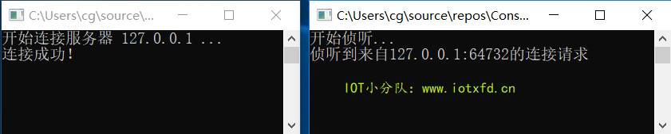

不错，有了一个好的开始，现在我们了解了事件机制。其实看着挺顺眼，比委托舒服。大家可能觉得这也不难嘛。别急，事情没这么简单。

如何接收多个连接？是不是如之前一样在`AcceptAsync()`外面加个`While(true)`循环调用？游戏不是这么玩的！之前的 Begin/End 模式使用`While(true)`导致频繁创建`IAsyncResult`，在高并发访问时，增加了垃圾回收的压力。现在的这套玩法是共用一个`SocketAsyncEventArgs`对象，改为垃圾回收再利用。再利用听起来很美，但实现起来就要多费些周折了。

#### 多客户端连接

首先，要实现再利用，必须在用完`e.AcceptSocket`后将其值设置为`null`。然后还要把`AcceptAsync`包装在一个方法内，以实现在其它地方再调用。

更改服务器代码如下：

```
static Socket listener;
static void Main(string[] args)
{
    IPAddress ip = IPAddress.Parse("127.0.0.1");
    IPEndPoint point = new IPEndPoint(ip, 5000);
    listener = new Socket(AddressFamily.InterNetwork, SocketType.Stream, ProtocolType.Tcp);
    try
    {
        listener.Bind(point);
        listener.Listen(100);
        SocketAsyncEventArgs acceptEventArg = new SocketAsyncEventArgs();
        acceptEventArg.Completed += new EventHandler<SocketAsyncEventArgs>(OnAccept);
        StartAccept(acceptEventArg);//开始第一个侦听周期
        Console.WriteLine("开始侦听...");

    }
    catch (Exception e)
    {
        Console.WriteLine(e.Message);
    }
    Console.ReadLine();
}
//开始侦听，将AcceptAsync包装在此方法内
static void StartAccept(SocketAsyncEventArgs e)
{
    if (!listener.AcceptAsync(e))//异步侦听连接
    {
        OnAccept(null, e);
    }
}
//收到连接后触发的事件
static void OnAccept(object sender, SocketAsyncEventArgs e)
{
    Socket handler = e.AcceptSocket;	
    e.AcceptSocket = null;//为重复利用e，必须使用此句代码
    Console.WriteLine($"侦听到来自{handler.RemoteEndPoint.ToString()}的连接请求");
    StartAccept(e);//进入下一个侦听周期，注意，参数e是上一个StartAccept传递过来的
}
```

更改客户端代码如下：

```c
static void Main(string[] args)
{
    IPAddress ip = IPAddress.Parse("127.0.0.1");
    try
    {
        Socket s;
        //向服务端发送99个连接
        for (int i = 1; i < 100; i++)
        {
            s = new Socket(AddressFamily.InterNetwork, SocketType.Stream, ProtocolType.Tcp);
            s.Connect(ip, 5000); //向服务器发起连接
            Console.WriteLine("开始连接服务器 {0} ...", ip.ToString());
            if (s.Connected)
            {
                Console.WriteLine("连接成功！");
            }
        }
    }
    catch (Exception e)
    {
        Console.WriteLine(e.Message);
    }
    Console.ReadLine();
}
```

客户端开了99条向服务发起请求的连接。

运行结果：
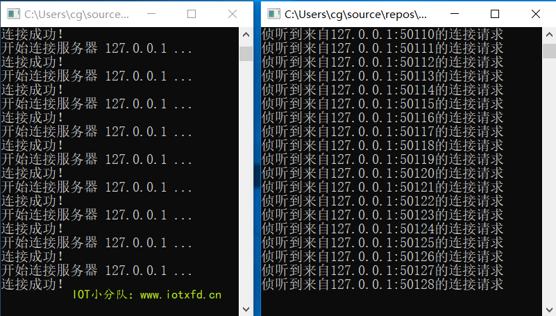

下图展示了AcceptAsync运行机制

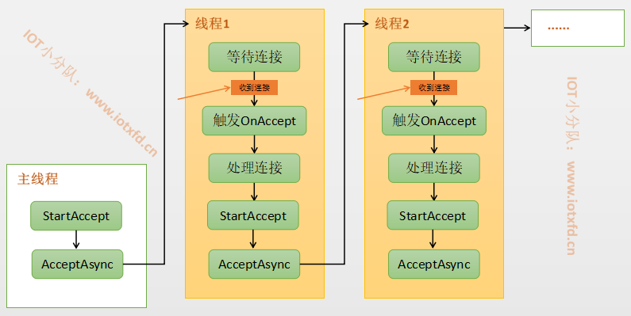 

这次把`AcceptAsync`包装在`StartAccept`方法中，并把`SocketAsyncEventArgs`作为参数进行传递；在收到连接请求后，`AcceptAsync`触发`OnAccept`并将参数传递进去；`OnAccept`处理完连接后，又将收到的参数传递给下一个`StartAccept`。从而完成了`SocketAsyncEventArgs`参数循环再利用。需要注意的是，在`OnAccept`，必须要把`SocketAsyncEventArgs.AcceptSocket`设置为`null`，才能再次使用它。


### 数据的接收

数据的读取和侦听连接的机制基本相同，不同之处仅在于不再需要将`e.AcceptSocket`的值设置为`null`。

#### 服务器程序

更改服务器代码如下：

```c
static Socket listener;
static void Main(string[] args)
{
    IPAddress ip = IPAddress.Parse("127.0.0.1");
    IPEndPoint point = new IPEndPoint(ip, 5000);
    listener = new Socket(AddressFamily.InterNetwork, SocketType.Stream, ProtocolType.Tcp);
    try
    {
        listener.Bind(point);
        listener.Listen(100);
        SocketAsyncEventArgs acceptEventArg = new SocketAsyncEventArgs();
        acceptEventArg.Completed += new EventHandler<SocketAsyncEventArgs>(OnAccept);
        StartAccept(acceptEventArg);//开始第一个侦听周期
        Console.WriteLine("开始侦听...");

    }
    catch (Exception e)
    {
        Console.WriteLine(e.Message);
    }
    Console.ReadLine();
}
//开始接收，将AcceptAsync包装在此方法内
static void StartAccept(SocketAsyncEventArgs e)
{
    if (!listener.AcceptAsync(e))//异步侦听连接
    {
        OnAccept(null, e);
    }
}
//收到连接后触发的事件
static void OnAccept(object sender, SocketAsyncEventArgs e)
{
    Socket handler = e.AcceptSocket;
    Console.WriteLine($"侦听到来自{handler.RemoteEndPoint.ToString()}的连接请求");

    //为新连接开启一个异步读取消息进程
    SocketAsyncEventArgs receiveArg = new SocketAsyncEventArgs();//专为读取消息新建一个SocketAsyncEventArgs
    receiveArg.Completed += new EventHandler<SocketAsyncEventArgs>(OnRead);//加入读取事件
    receiveArg.SetBuffer(new byte[1024], 0, 1024);//设置读取缓存
    receiveArg.AcceptSocket = e.AcceptSocket;//此处的AcceptSocket参数仅用于传递读取Socket
    StartRead(receiveArg);

    e.AcceptSocket = null;//为重复利用e，必须使用此句代码
    StartAccept(e);//进入下一个侦听周期，注意，参数e是上一个StartAccept传递过来的
}
//开始读取消息，将ReceiveAsync包装在此方法内
static void StartRead(SocketAsyncEventArgs e)
{
    if(!e.AcceptSocket.ReceiveAsync(e))//返回true，则会触发OnRead事件进行异步读取
    {   //返回false则同步读取
        OnRead(null, e);
    }
}
//收到消息后触发的事件
static void OnRead(object sender,SocketAsyncEventArgs e)
{
    if(e.BytesTransferred>0 && e.SocketError==SocketError.Success)
    {
        string sendStr = Encoding.Unicode.GetString(e.Buffer, e.Offset, e.BytesTransferred);
        Console.WriteLine($"收到来自{e.AcceptSocket.RemoteEndPoint.ToString()}的信息：{sendStr}");
        //进入下一个读取周期，参数e被循环利用
        StartRead(e);
    }
}
```

读取消息的机制如下图所示：
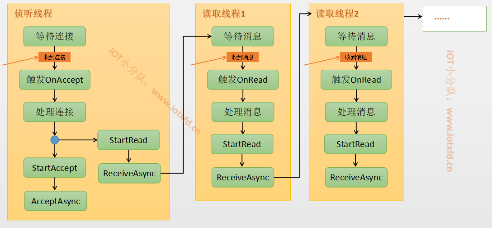
在侦听 Socket 收到一个新连接后，立即为此新连接创建读取专用的`SocketAsyncEventArgs`，然后设置读取事件，缓存，并利用`AcceptSocket`属性传递此连接专用的 Socket，然后调用`ReceiveAsync`方法异步等待读取信息。当完成一个读取后，会触发`OnRead`事件对接收到的消息进行处理。处理完毕则再次调用`ReceiveAsync`方法进入下一个等待读取周期。

#### 客户端程序

这次我们使用 Task 来创建线程，引入如下命名空间：

```c
using System;
using System.Net;
using System.Net.Sockets;
using System.Text;
using System.Threading.Tasks;
using System.Threading;
```

代码如下：

```c
static void Main(string[] args)
{
    IPAddress ip = IPAddress.Parse("127.0.0.1");
    try
    {
        //向服务端发送99个连接
        for (int i = 1; i < 100; i++)
        {
            Socket s = new Socket(AddressFamily.InterNetwork, SocketType.Stream, ProtocolType.Tcp);
            s.Connect(ip, 5000); //向服务器发起连接
            Console.WriteLine("开始连接服务器 {0} ...", ip.ToString());
            if (s.Connected)
            {
                Console.WriteLine("连接成功！");
            }
            //使用Task让多个线程同时向服务发送消息
            Task.Run(() => SendMessage(s));
        }
    }
    catch (Exception e)
    {
        Console.WriteLine(e.Message);
    }
    Console.ReadLine();
}
//每个连接发送100条消息
static void SendMessage(Socket s)
{
    for (int j = 0; j < 100; j++)
    {
        byte[] sendBuff = Encoding.Unicode.GetBytes($"消息{j}");
        s.Send(sendBuff, sendBuff.Length, SocketFlags.None);
        Thread.Sleep(100);
    }
    s.Shutdown(SocketShutdown.Both);
    s.Close();
}
```

之前的文章我们从来没有用过`s.Shutdown`，这是微软官方推荐关闭 Socket 的正确方式。先 Shutdown 关闭连接，再 Close 套接字。

这次我们创建了99个 Socket 同时向服务器发送消息，每 Socket 隔0.1秒发送一条消息，共发送100条消息。

运行结果：

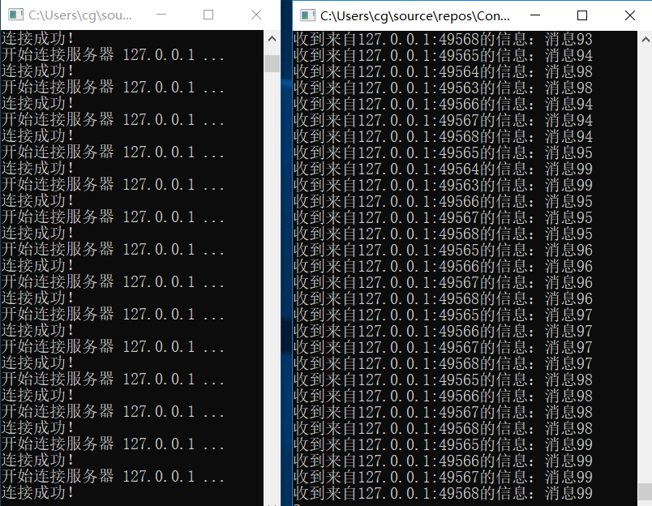 

有意思的是，如果使用 Thread 而不是 Task 创建线程，你会发现消息的发送速度会快很多，使用 Task 甚至慢到不会出现粘包现象。而使用 Thread 则依然存在少数粘包现象。编写服务器程序，Task 肯定是首先，但如果仅仅编写客户端，而且线程不多，那么就需要根据实际情况来确定使用哪个机制了。


#### 服务器关闭连接

上述程序还有一个比较严重的问题，服务器未对 Socket 有可能出现的错误进行相应处理，如果客户端中途退出，那么为此客户端创建的100个 Socket 还是存在于服务器，并没有关闭，所以还需要继续修改代码。

将服务器的`OnRead`方法代码更改如下：

```c
Socket s = e.AcceptSocket;
if(e.BytesTransferred>0 && e.SocketError==SocketError.Success)
{
    string sendStr = Encoding.Unicode.GetString(e.Buffer, e.Offset, e.BytesTransferred);
    Console.WriteLine($"收到来自{s.RemoteEndPoint.ToString()}的信息：{sendStr}");
    //进入下一个读取周期，参数e被循环利用
    StartRead(e);
}
else
{
    string epStr = s.RemoteEndPoint.ToString();
    try
    {
        s.Shutdown(SocketShutdown.Both);
    }
    catch(Exception ex)
    {       
        Console.WriteLine(ex.Message);
    }
    s.Close();
    Console.WriteLine($"已关闭{epStr}连接");
}
```

再次运行程序，客户端在运行期间中途关闭，可以看到，100个连接同时被关闭。


### 数据的发送

数据的发送机制与数据接收类似，但又有所不同。接收是被动的，需要侦听等待，而发送是主动的。

#### 服务器程序

修改服务器代码如下：

```c
static Socket listener;
static void Main(string[] args)
{
    IPAddress ip = IPAddress.Parse("127.0.0.1");
    IPEndPoint point = new IPEndPoint(ip, 5000);
    listener = new Socket(AddressFamily.InterNetwork, SocketType.Stream, ProtocolType.Tcp);
    try
    {
        listener.Bind(point);
        listener.Listen(100);
        SocketAsyncEventArgs acceptEventArg = new SocketAsyncEventArgs();
        acceptEventArg.Completed += new EventHandler<SocketAsyncEventArgs>(OnAccept);
        StartAccept(acceptEventArg);//开始第一个侦听周期
        Console.WriteLine("开始侦听...");

    }
    catch (Exception e)
    {
        Console.WriteLine(e.Message);
    }
    Console.ReadLine();
}
//开始接收，将AcceptAsync包装在此方法内
static void StartAccept(SocketAsyncEventArgs e)
{
    if (!listener.AcceptAsync(e))//异步侦听连接
    {
        OnAccept(null, e);
    }
}
//收到连接后触发的事件
static void OnAccept(object sender, SocketAsyncEventArgs e)
{
    Socket handler = e.AcceptSocket;
    Console.WriteLine($"侦听到来自{handler.RemoteEndPoint.ToString()}的连接请求");

    //为新连接开启一个异步发送消息进程
    SocketAsyncEventArgs sendArg = new SocketAsyncEventArgs();//专为发送消息新建一个SocketAsyncEventArgs
    sendArg.Completed += new EventHandler<SocketAsyncEventArgs>(OnSend);//加入发送事件          
    sendArg.AcceptSocket = e.AcceptSocket;//此处的AcceptSocket参数仅用于传递发送Socket
    sendArg.UserToken = 1; //UserToken专为用户存放数据，这里存放发送次数
    StartSend(sendArg);

    e.AcceptSocket = null;//为重复利用e，必须使用此句代码
    Console.WriteLine("进入下一个等待周期");
    StartAccept(e);//进入下一个侦听周期，注意，参数e是上一个StartAccept传递过来的
}
//开始读取消息，将ReceiveAsync包装在此方法内
static void StartSend(SocketAsyncEventArgs e)
{
    int i = (int)e.UserToken;
    if (i > 5)
    {
        return;
    }
    byte[] sendBuff = Encoding.Unicode.GetBytes($"服务器消息：{e.UserToken}");//发送缓存
    e.SetBuffer(sendBuff, 0, sendBuff.Length);//设置发送缓存
    e.UserToken = i + 1;
    if (!e.AcceptSocket.SendAsync(e))//返回true，则会触发OnSend事件进行异步读取
    {   //返回false则同步发送
        OnSend(null, e);
    }
}
//收到消息后触发的事件
static void OnSend(object sender, SocketAsyncEventArgs e)
{
    Socket s = e.AcceptSocket;
    if (e.SocketError == SocketError.Success)
    {
        Console.WriteLine($"成功向{s.RemoteEndPoint.ToString()}发送信息");
        Thread.Sleep(500);
        StartSend(e);//进入下一个发送周期
    }
    else
    {
        s.Shutdown(SocketShutdown.Send);
        s.Close();
    }
}
```

服务器每收到一个连接，便向此连接客户端每隔0.5秒发一条信息，共发5条。

发送流程和读取基本一样，`UserToken`属性专门用于存放用户数据。坑爹的是微软示例里它是`AsyncUserToken`，但此类型已被废弃，示例却不改。搞到我到处查资料查不到，费了一翻周折。现在`UserToken`是`Object`类型，随便你设计放什么都可以。只是用起来需要类型转换，有点麻烦。

#### 客户端程序：

命名空间：

```c
using System;
using System.Net;
using System.Net.Sockets;
using System.Text;
using System.Threading.Tasks;
```

程序代码：

```c
static void Main(string[] args)
{
    IPAddress ip = IPAddress.Parse("127.0.0.1");
    try
    {
        for (int i = 0; i < 5; i++)
        {
            Socket s = new Socket(AddressFamily.InterNetwork, SocketType.Stream, ProtocolType.Tcp);
            s.Connect(ip, 5000); //向服务器发起连接
            Console.WriteLine("开始连接服务器 {0} ...", ip.ToString());
            if (s.Connected)
            {
                Console.WriteLine("连接成功！");
            }
            Task.Run(() => ReceiveMessage(s));
        }
    }
    catch (Exception e)
    {
        Console.WriteLine(e.Message);
    }
    Console.ReadLine();
}
static void ReceiveMessage(Socket recvSocket)
{
    string ip = recvSocket.RemoteEndPoint.ToString();
    byte[] buff = new byte[1024]; //创建一个接收缓冲区
    try
    {
        while (true)
        {
            int count = recvSocket.Receive(buff, buff.Length, SocketFlags.None);
            string recvStr = Encoding.Unicode.GetString(buff, 0, count);
            Console.WriteLine("接收到来自{0}数据：{1}", ip, recvStr);
        }
    }
    catch (Exception e)
    {
        Console.WriteLine(e.Message);
    }
    finally
    {
        recvSocket.Close();//客户端关闭时会引发异常，此时关闭此连接
        Console.WriteLine("{0} 已退出连接。", ip);
    }
}
```

客户端开了5条连接。然后等待服务器发信息。

运行结果：
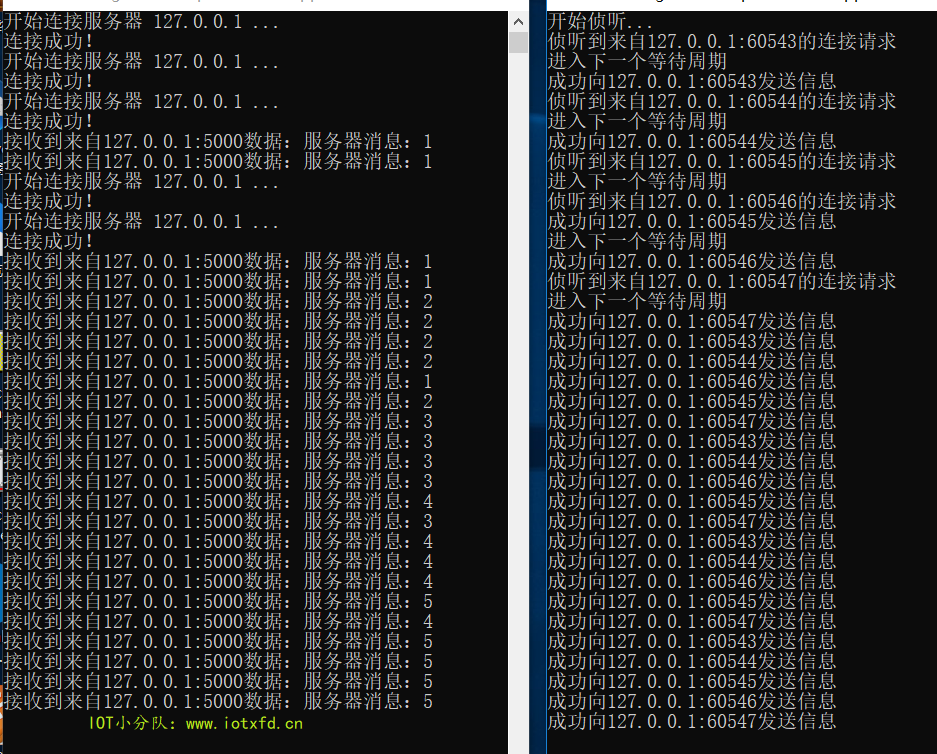

写这程序调试了挺久，得出一个血的教训，不要去尝试手动关闭发送 Socket，会导致可怕的结果。大家可以试试，将服务器代码中的`StartSend`方法代码更改如下：

```c
static void StartSend(SocketAsyncEventArgs e)
{
    int i = (int)e.UserToken;
    if (i > 5)
    {
        e.AcceptSocket.Close();
        return;
    }
    byte[] sendBuff = Encoding.Unicode.GetBytes($"服务器消息：{e.UserToken}");//发送缓存
    e.SetBuffer(sendBuff, 0, sendBuff.Length);//设置发送缓存
    e.UserToken = i + 1;
    if (!e.AcceptSocket.SendAsync(e))//返回true，则会触发OnSend事件进行异步读取
    {   //返回false则同步发送
        OnSend(null, e);
    }
}
```

其实，正确的用法是接收和发送共用一个`SocketAsyncEventArgs`，一般不会发生我这个程序里发生的问题。需要注意的是，千万不要象这篇文章一样去使用`SocketAsyncEventArgs`，正确的使用方法并不是这样的。我这样写只是为了让大家先更容易地理解它的机制，然后再深入学习。下一篇文章介绍正确的使用方法。


## Socket异步编程之Async模式优化

上篇文章我们讲了 Socket 异步编程 SAEA 模式的使用方法，那篇文章仅仅是帮助你理解 SAEA 侦听、数据接收和发送的流程，并非正确使用方法。本文深入讨论如何使用 SAEA

SAEA 面向的是高性能，高并发网络服务器，因此它将资源的循环利用做到了极致。上篇文章我们写的代码有三处可改进的地方：

- 第一是`SocketAsyncEventArgs`对象的共用。当服务器侦听到一个连接后，便会创建一个新的`SocketAsyncEventArgs`对象，然后将此对象传递给数据接收和发送进程，这是我们上篇文章已经实现了的。但是，数据的接收和发送进程亦可以共享这一个`SocketAsyncEventArgs`对象。这样就实现所一个连接的收发操作共享一个`SocketAsyncEventArgs`对象。
- 第二`SocketAsyncEventArgs`对象的重用。很多时候，客户端和服务器并非保持长久连接，而是连接一次，数据交换，然后断开，需要再次连接时则重复这一过程，典型如 HTTP。当服务器每天有大量的这种瞬时访问时，则会产生无数`SocketAsyncEventArgs`对象的碎片，这显然会增加服务器的负担。解决方案是建立 SAEA 对象池，当一个`SocketAsyncEventArgs`对象使用完毕后，将它扔进池里，下次有连接需要使用时则从池里捞一个来用。
- 第三是接收和发送缓存的重用，上篇文章中，我们在每次创建新 SAEA 时都会`new`一个长度为1024的字节数组作为接收缓存，用完就扔，发送也一样。这样的设计在服务器瞬时访问量高时肯定是会有问题的。解决方案是分配一个大块的内存做为缓存池，供所有的 SAEA 使用。一个 SAEA 在创建时从池中指定一块区域作为缓存，用完后，将它归还池子，以便下次有新的 SAEA 创建时可以重新利用这块内存区域，以防止内存碎片化。

### 建立 SAEA 对象池

本来只需要一个栈就可以直接存储并循环使用 SAEA 对象，可以直接使用，但考虑到栈不支持多线程，使用时需要上锁，所以需要包装一层。

在服务器程序中新建一个`SocketAsyncEventArgsPool`类，使用如下命名空间：

```c
using System;
using System.Collections.Generic;
using System.Net.Sockets;

internal class SocketAsyncEventArgsPool
{
    Stack<SocketAsyncEventArgs> saeaPool;//saea池，使用栈存储

    internal SocketAsyncEventArgsPool(int capacity)
    {
        saeaPool = new Stack<SocketAsyncEventArgs>(capacity);
    }

    internal void Push(SocketAsyncEventArgs item)
    {
        if (item == null)
        {
            throw new ArgumentNullException("传入的SocketAsyncEventArgs对象不能为空！");
        }
        lock (saeaPool)
        {   //压入一个SocketAsyncEventArgs
            saeaPool.Push(item);
        }
    }

    internal SocketAsyncEventArgs Pop()
    {
        lock (saeaPool)
        {   //取出一个SocketAsyncEventArgs
            return saeaPool.Pop();
        }
    }

    internal int Count
    {
        get { return saeaPool.Count; }
    }
}
```

服务器在初始化时，将创建好的 SAEA `Push`进池里。当连接需要使用 SAEA 时从池里`Pop`一个，用完再`Push`进去。从而实现循环利用。

### 建立缓存池

在服务器程序中新建一个`BufferManager`类，使用如下命名空间：

```c
using System;
using System.Collections.Generic;
using System.Net.Sockets;

class BufferManager
{
    int totalSize; //缓存池总长度（字节为单位）
    byte[] bufferBlock; //缓存池所在内存空间
    Stack<int> IndexPool; //此栈记录缓存池中处于回收状态的缓存
    int usedIndex;//缓存池从最小索引值开始使用，此变量记录曾经使用到的最大值
    int buffSize;//单个缓存的长度（字节为单位）

    public BufferManager(int totalSize, int buffSize)
    {
        this.totalSize = totalSize;
        usedIndex = 0;
        this.buffSize = buffSize;
        IndexPool = new Stack<int>();
    }
    //初始化缓存池
    internal void InitBuffer()
    {
        bufferBlock = new byte[totalSize];
    }
    //为作为参数传递进来的saes划分缓存空间
    internal bool SetBuffer(SocketAsyncEventArgs saea)
    {
        if (IndexPool.Count > 0) //如果存在处于回收状态的缓存
        {   //从栈中取出缓存地址并赋予saea
            saea.SetBuffer(bufferBlock, IndexPool.Pop(), buffSize);
        }
        else //没有处于回收状态的缓存
        {   //如果缓存池空间不够则返回false
            if ((totalSize - buffSize) < usedIndex)
            {
                return false;
            }
            saea.SetBuffer(bufferBlock, usedIndex, buffSize);//分配缓存池中的新空间
            usedIndex += buffSize;//指定缓存池中新空间和旧空间的分界点
        }
        return true;
    }
    //释放saea所使用的缓存空间
    internal void FreeBuffer(SocketAsyncEventArgs saea)
    {
        IndexPool.Push(saea.Offset);//将saea中用完的缓存地址压入栈中
        saea.SetBuffer(null, 0, 0);
    }
}
```

这也算是一个小小的数据结构吧，微软实现，精简、漂亮。它划分了一块大的内存空间（大小为`totalSize`）给所有 SAEA 共同使用。这块内存空间会被划分为一个个小块，每个 SAEA 使用一块，需要注意的是这些小块空间必须容量相同（大小为`buffSize`），这也是此数据结构能够这样实现的前提。在 Socket 连接释放时，将相应 SAEA 所使用的小块空间释放回缓存池，以便新的 SAEA 再次使用。

这段代码已经注释得很清楚了，下面画张图演示它的动作过程吧，以方便各位理解。

首先是缓存池中的三块缓存依次被使用

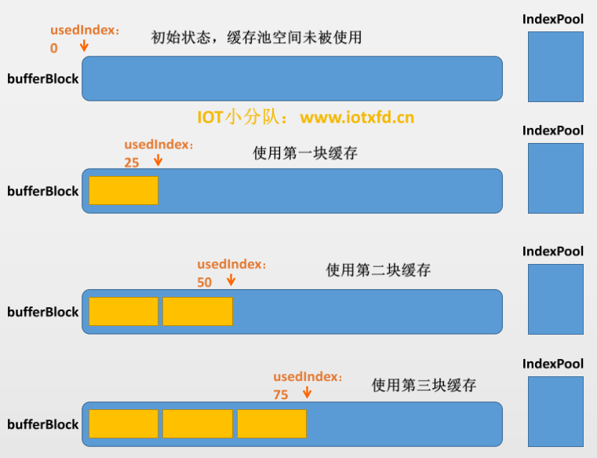 

接下来还回第一块缓存和第二块缓存，它们的地址先后入栈。当新 SAEA 申请使用缓存时，从栈中`Pop`出地址25，将其对应的第二块缓存分配给新 SAEA 使用。

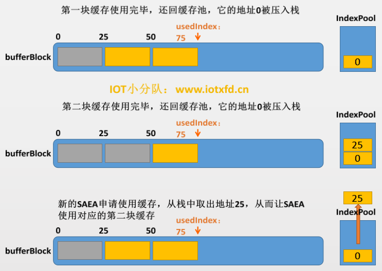 

### 服务器程序

准备工作完毕，下面可以开始改服务器程序了。这一块微软的示例程序好象是有点问题的，花了精力写了一个先进的网络编程模型，却没有写相应文档，只有API帮助，而且示例程序还有问题。真不知道微软在想啥。只能自己改了。

命名空间：

```c
using System;
using System.Net;
using System.Net.Sockets;
using System.Text;
using System.Threading;
```

Main()方法：

```c
static Socket listener;
static BufferManager bm;//缓存池
static SocketAsyncEventArgsPool saeaPool;//saea对象池
static int connectCount = 20; //最大连接数
static int bufferSize = 25; //缓存大小，25个字节
static SemaphoreSlim acceptLimit;//用于控制同时访问线程数的信号量

static void Main(string[] args)
{
    //初始化缓存池
    bm = new BufferManager(connectCount * bufferSize, bufferSize);//缓存池
    bm.InitBuffer();
    //初始化saea对象池，将100个设置好的saea加入对象池
    saeaPool = new SocketAsyncEventArgsPool(connectCount);//saea对象池
    SocketAsyncEventArgs saea;
    for (int i = 0; i < connectCount; i++)
    {
        saea = new SocketAsyncEventArgs();
        saea.Completed += new EventHandler<SocketAsyncEventArgs>(OnIOCompleted);//给新建saea对象指定事件方法
        bm.SetBuffer(saea);//给saea分配缓存
        saeaPool.Push(saea);//将saea压入saea对象池
    }

    acceptLimit = new SemaphoreSlim(connectCount, connectCount);//用于控制同时访问线程数的信号量

    IPAddress ip = IPAddress.Parse("127.0.0.1");
    IPEndPoint point = new IPEndPoint(ip, 5000);
    listener = new Socket(AddressFamily.InterNetwork, SocketType.Stream, ProtocolType.Tcp);
    try
    {
        listener.Bind(point);
        listener.Listen(connectCount);
        SocketAsyncEventArgs acceptEventArg = new SocketAsyncEventArgs();//所有侦听共用此saea
        acceptEventArg.Completed += new EventHandler<SocketAsyncEventArgs>(OnAccept);
        StartAccept(acceptEventArg);//开始第一个侦听周期
        Console.WriteLine("开始侦听...");

    }
    catch (Exception e)
    {
        Console.WriteLine(e.Message);
    }
    Console.ReadLine();
}
```

接收模块：

```c
//开始接收，将AcceptAsync包装在此方法内
static void StartAccept(SocketAsyncEventArgs e)
{
    acceptLimit.Wait();
    if (!listener.AcceptAsync(e))//异步侦听连接
    {
        OnAccept(null, e);
    }
}
//收到连接后触发的事件
static void OnAccept(object sender, SocketAsyncEventArgs e)
{
    Socket handler = e.AcceptSocket;
    Console.WriteLine($"侦听到来自{handler.RemoteEndPoint.ToString()}的连接请求");

    //为新连接开启一个异步发送消息进程
    SocketAsyncEventArgs saea = saeaPool.Pop();//从saea对象池获取一个SocketAsyncEventArgs    
    bm.SetBuffer(saea);//重新设置缓存
    saea.AcceptSocket = e.AcceptSocket;//此处的AcceptSocket参数仅用于传递发送Socket
    StartReceive(saea);

    e.AcceptSocket = null;//为重复利用e，必须使用此句代码
    StartAccept(e);//进入下一个侦听周期，注意，参数e是上一个StartAccept传递过来的
}
```

接收和发送共享事件方法：

```c
static void OnIOCompleted(object sender, SocketAsyncEventArgs e)
{   //根据不同的动作分配不同的操作
    switch (e.LastOperation)
    {
        case SocketAsyncOperation.Receive: //为接收操作时
            ProcessReceive(e);
            break;
        case SocketAsyncOperation.Send: //为发送操作时
            ProcessSend(e);
            break;
        default:
            throw new ArgumentException("OnIOCompleted事件错误！");
    }
}
```

这里是跟上篇文章中最大的不同，接收和发送共享一个事件，通过判断 Socket 的最后一个动作来决定分配处理方法。

接收消息模块：

```c
//开始读取消息，将ReceiveAsync包装在此方法内
static void StartReceive(SocketAsyncEventArgs e)
{
    if (!e.AcceptSocket.ReceiveAsync(e))//返回true，则会触发OnRead事件进行异步读取
    {   //返回false则同步读取
        ProcessReceive(e);
    }
}
//收到消息后的处理方法
static void ProcessReceive(SocketAsyncEventArgs e)
{
    if (e.BytesTransferred > 0 && e.SocketError == SocketError.Success)
    {
        string sendStr = Encoding.Unicode.GetString(e.Buffer, e.Offset, e.BytesTransferred);
        Console.WriteLine($"收到来自{e.AcceptSocket.RemoteEndPoint.ToString()}的信息：{sendStr}");
        //将收到的消息回发
        e.SetBuffer(e.Offset, e.BytesTransferred);
        StartSend(e);
    }
    else
    {
        CloseSocket(e);
    }
}
```

发送消息模块：

```c
//开始读取消息，将ReceiveAsync包装在此方法内
static void StartSend(SocketAsyncEventArgs e)
{
    if (!e.AcceptSocket.SendAsync(e))//返回true，则会触发OnSend事件进行异步读取
    {   //返回false则同步发送
        ProcessSend(e);
    }
}
//收到消息后触发的事件
static void ProcessSend(SocketAsyncEventArgs e)
{
    Socket s = e.AcceptSocket;
    if (e.SocketError == SocketError.Success)
    {
        e.SetBuffer(0, bufferSize); //将offset指针指回开始处
        StartReceive(e);//进入下一个接收周期
    }
    else
    {
        CloseSocket(e);
    }
}
```

关闭消息模块：

```c
static void CloseSocket(SocketAsyncEventArgs e)
{
    Socket s = e.AcceptSocket;
    string epStr = s.RemoteEndPoint.ToString();
    try
    {
        s.Shutdown(SocketShutdown.Send);
    }
    catch (Exception ex)
    {
        Console.WriteLine(ex.Message);
    }
    s.Close();
    acceptLimit.Release();//释放信号量
    bm.FreeBuffer(e); //释放缓存
    saeaPool.Push(e); //将saea回收至对象池
    Console.WriteLine($"已关闭{epStr}连接");
}
```

整个服务器的逻辑是：侦听连接–>收到连接后创建 Socket --> 进入异步接收消息状态 --> 收到消息后将消息回发 --> 进入异步发送状态 --> 发送完毕后，继续进入异步接收消息状态。服务器的最大连接数设置为20，缓存大小设置为25个字节。


### 客户端程序

怎么少事怎么来，继续用 Thread。代码如下：

```c
const int SEND_TIME= 10;
static void Main(string[] args)
{
    //获取服务器端IP地址
    IPAddress ip = IPAddress.Parse("127.0.0.1");
    try
    {
        for (int i = 1; i <= 50; i++)
        {
            Socket s = new Socket(AddressFamily.InterNetwork, SocketType.Stream, ProtocolType.Tcp);
            s.Connect(ip, 5000); //向服务器发起连接
            Console.WriteLine("开始连接服务器 {0} ...", ip.ToString());
            if (s.Connected)
            {
                Console.WriteLine("连接成功！");
            }
            //发送消息线程
            Thread tSend = new Thread(() => SendMessage(i, s));
            tSend.IsBackground = true;
            tSend.Start();
            //接收消息线程
            Thread tRecv = new Thread(() => ReceiveMessage(i, s));
            tRecv.IsBackground = true;
            tRecv.Start();
            Thread.Sleep(1000);
        }
    }
    catch (Exception e)
    {
        Console.WriteLine(e.Message);
    }
    Console.ReadLine();
}
//发送消息线程方法
static void SendMessage(int threadId, Socket s)
{
    for (int i = 1; i <= SEND_TIME; i++)
    {
        string sendStr = $"线程{threadId}-消息{i}";
        byte[] sendBuff = Encoding.Unicode.GetBytes(sendStr);
        s.Send(sendBuff, sendBuff.Length, SocketFlags.None);
        Thread.Sleep(500);
    }
}
//接收消息线程方法
static void ReceiveMessage(int threadId, Socket s)
{
    byte[] recvBuff = new byte[25];
    try
    {
        int i = 0;
        while (i < SEND_TIME)
        {
            int count = s.Receive(recvBuff, recvBuff.Length, SocketFlags.None);
            string recvStr = Encoding.Unicode.GetString(recvBuff, 0, count);
            Console.WriteLine($"线程{threadId}收到服务器信息：{recvStr}");
            i++;
        }
    }
    catch (Exception e)
    {
        Console.WriteLine(e.Message);
    }
    finally
    {
        s.Close();
        Console.WriteLine($"线程{threadId}退出连接。");
    }
}
```

客户端每隔 1 秒开一条连接，共开50条连接。每条连接每隔半秒向服务器发送一条消息，发完 5 条后结束，在收到服务器应答的 5 条消息后关闭连接。

运行效果：
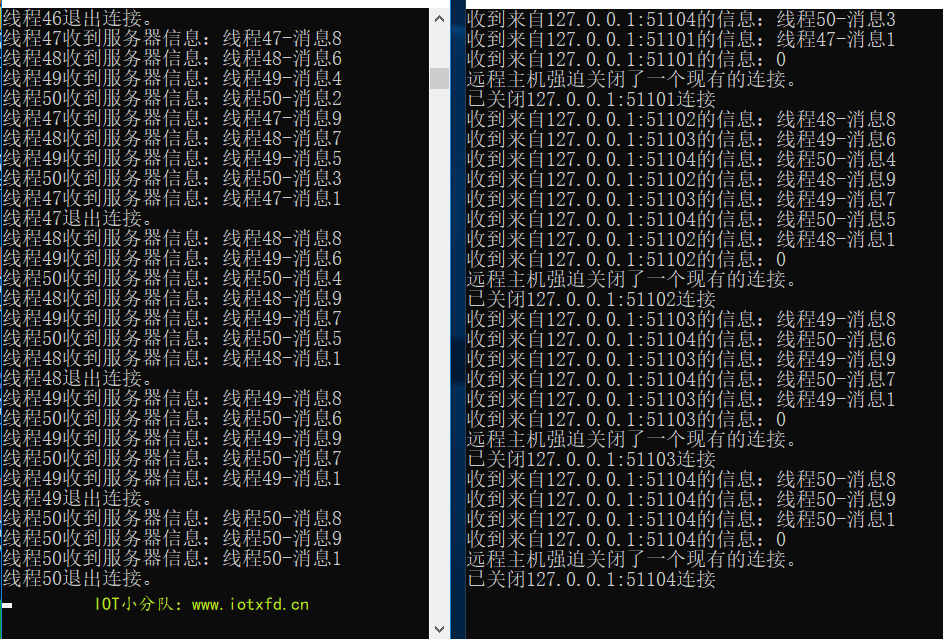


### 存在的问题

这回我们使用之前《[Socket多线程编程](http://iotxfd.cn/article/Network programming/[01-01]Program by Thread.html)》这篇文章中的【控制台版聊天程序】这一节中的客户端代码：

```c
static void Main(string[] args)
{
    //获取服务器端IP地址
    IPAddress ip = IPAddress.Parse("127.0.0.1");
    try
    {
        Socket s = new Socket(AddressFamily.InterNetwork, SocketType.Stream, ProtocolType.Tcp);
        s.Connect(ip, 5000); //向服务器发起连接
        Console.WriteLine("开始连接服务器 {0} ...", ip.ToString());
        if (s.Connected)
        {
            Console.WriteLine("连接成功！");
        }
        //发送消息线程
        Thread tSend = new Thread(() => SendMessage(s));
        tSend.Start();
        //接收消息线程
        Thread tRecv = new Thread(() => ReceiveMessage(s));
        tRecv.Start();
    }
    catch (Exception e)
    {
        Console.WriteLine(e.Message);
    }
}
//发送消息线程方法
static void SendMessage(Socket s)
{
    while (true)
    {
        string sendStr = Console.ReadLine();
        byte[] sendBuff = Encoding.Unicode.GetBytes(sendStr);
        s.Send(sendBuff, sendBuff.Length, SocketFlags.None);
    }
}
//接收消息线程方法
static void ReceiveMessage(Socket s)
{
    byte[] recvBuff = new byte[1024];
    try
    {
        while (true)
        {
            int count = s.Receive(recvBuff, recvBuff.Length, SocketFlags.None);
            string recvStr = Encoding.Unicode.GetString(recvBuff, 0, count);
            Console.WriteLine("收到服务器信息：{0}", recvStr);
        }
    }
    catch (Exception e)
    {
        Console.WriteLine(e.Message);
    }
    finally
    {
        s.Close();
        Console.WriteLine("服务器已经退出连接。");
    }
}
```

使用这个程序连接服务器，得到如下结果：
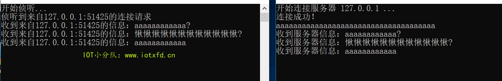
为什么会出现乱码呢？这是因为缓存长度为25，我们发送的信息长度超过了25，被截断分开发送。而我们以 Unicode 进行发送，Unicode 格式的每个编码占2个字节，这时第13个字每的编码的上半部份第一次发送，而下半部分到了第二次发送，从而导致整个编码错乱。所以切记，如果发送格式每字符占两个字节，缓存长度必须为偶数。我们将服务器缓存长度设置为26，再运行程序就没问题了。更改服务器代码：

```c
static int bufferSize = 26; //缓存大小，26个字节
```

运行结果：
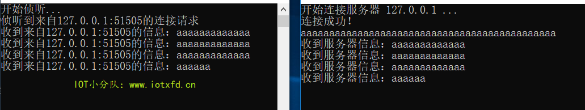
另外就是信息过长被截断的问题，解决办法第一是加长接收缓存长度，但长度设得太长，整个缓存池会占用大量内存。这个缓存长度需要根据实际情况来设置。第二是在客户端限定发送的信息长度。第三是手动分界，在服务端拼接信息。拼接信息这块我在之前的文章已经演示过，这里就不再多讲了。这样，整个 SAEA 模式我们也讲完了。需要注意的是这次的服务器的使用场景是一应一答的模式，可以接收和发送共享缓存和 saea ，其它情况下不一定行得能，这点是需要注意的。


# c#杂谈


## Sokcet


### Socket.Shutdown()

`Socket.Shutdown()` 方法是用于关闭 `Socket` 的一部分功能，而不是关闭整个 `Socket` 连接。

在网络编程中，`Socket` 类通常用于在计算机之间进行通信，而 `Shutdown` 方法可以用于关闭连接的一端的发送或接收功能，或者同时关闭两者。

#### 1)关闭发送功能：

 通过调用 `Shutdown(SocketShutdown.Send)`，可以关闭 `Socket` 的发送功能。这意味着在调用这个方法后，不能再使用 `Socket` 发送数据，但仍然可以接收数据。这对于表示不再发送数据的情况很有用，但仍然需要接收对方发送的数据。

```
// 关闭发送功能
socket.Shutdown(SocketShutdown.Send);
```

#### **2)关闭接收功能：**

 通过调用 `Shutdown(SocketShutdown.Receive)`，可以关闭 `Socket` 的接收功能。这意味着在调用这个方法后，不能再使用 `Socket` 接收数据，但仍然可以发送数据。

```
// 关闭接收功能
socket.Shutdown(SocketShutdown.Receive);
```

#### **3)关闭发送和接收功能：** 

通过调用 `Shutdown(SocketShutdown.Both)`，可以关闭 `Socket` 的发送和接收功能，等效于关闭整个 `Socket` 连接。在调用这个方法后，不能再使用 `Socket` 发送或接收数据。

```
// 关闭发送和接收功能，等效于关闭整个 Socket 连接
socket.Shutdown(SocketShutdown.Both);
```

需要注意的是，一旦调用了 `Shutdown` 方法，就不能再使用 `Socket` 进行相应功能的操作。如果需要关闭整个 `Socket` 连接，通常建议在调用 `Shutdown` 后紧接着调用 `Close` 方法来释放相关资源。

```
// 关闭发送和接收功能，并关闭整个 Socket 连接
socket.Shutdown(SocketShutdown.Both);
socket.Close();
```

#### 4)注意

你可以直接调用 `Close` 方法来关闭 `Socket` 连接，而不调用 `Shutdown` 方法。在许多情况下，直接调用 `Close` 方法就足够了，因为 `Close` 方法会自动关闭连接的发送和接收功能，并释放相关的资源。

```
// 直接关闭 Socket 连接
socket.Close();
```

这行代码将关闭 `Socket` 连接并释放相关资源。在这种情况下，系统会默认关闭发送和接收功能，因此你不必显式调用 `Shutdown` 方法。

然而，如果你有特殊需求，例如想在关闭连接之前显式地关闭发送或接收功能，你可以使用 `Shutdown` 方法来实现更精确的控制。通常情况下，对于简单的用例，直接调用 `Close` 就足够了。


### Sokcet.Close()

`socket.Close()` 是用于关闭 `Socket` 连接的方法。当调用这个方法时，它会执行以下操作：

1. **关闭连接：** 关闭 `Socket` 连接，使其不能再进行数据的发送和接收。
2. **释放资源：** 释放与 `Socket` 相关的资源，包括操作系统资源。这包括套接字使用的文件描述符或句柄等资源。

在网络编程中，调用 `Close` 方法通常是在你确定不再需要该 `Socket` 连接时进行的。这可能是因为通信已经完成，或者发生了错误，需要关闭连接等情况。

示例代码如下：

```
// 关闭 Socket 连接并释放资源
socket.Close();
```

在调用 `Close` 方法之后，应该避免再次使用该 `Socket` 对象，因为它已经被关闭。如果需要重新建立连接，你可能需要创建一个新的 `Socket` 实例。

需要注意的是，`Close` 方法可能会抛出异常，例如在关闭时发生错误。因此，通常建议使用 `try...catch` 块来处理可能的异常。

```
try
{
    // 关闭 Socket 连接并释放资源
    socket.Close();
}
catch (Exception ex)
{
    // 处理异常
    Console.WriteLine($"Error closing socket: {ex.Message}");
}

```


#### 关闭时发生错误

在调用 `socket.Close()` 方法时，可能会发生各种错误，这些错误通常是由于底层操作系统或网络库的特定情况引起的。一些可能的错误包括：

1. **Socket 已关闭：** 如果你尝试关闭一个已经关闭的 `Socket`，可能会抛出 `ObjectDisposedException`。这表示你试图对已经被释放的资源执行操作。
2. **Socket 正在使用中：** 如果在关闭之前仍在进行读取或写入操作，可能会导致 `SocketException`。在关闭之前确保所有的读写操作都已完成是一个好的实践。
3. **底层操作系统错误：** 由于网络编程涉及底层的操作系统调用，因此在关闭连接时可能会发生与网络或操作系统相关的错误，这可能导致 `SocketException` 的抛出。

为了更好地处理可能的异常，可以使用 `try...catch` 块来捕获并处理异常。例如：

```
try
{
    // 关闭 Socket 连接并释放资源
    socket.Close();
}
catch (SocketException ex)
{
    Console.WriteLine($"SocketException: {ex.ErrorCode}, {ex.Message}");
}
catch (ObjectDisposedException ex)
{
    Console.WriteLine($"ObjectDisposedException: {ex.Message}");
}
catch (Exception ex)
{
    Console.WriteLine($"An unexpected error occurred: {ex.Message}");
}
```

在捕获异常时，你可以根据异常的类型和属性进行适当的处理，以便记录错误信息、进行调试或采取其他必要的措施


## IOCP


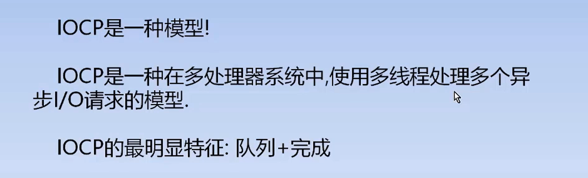

它内部创建了一个队列，这个队列所有的**io请求的数据结果**，当这个输入放入队列的时候起始是已经完成了读写操作了，所以我们称之为完成端口，实际上这里我们应该把它理解为完成队列，这是它最明显的特征。


**关键概念**

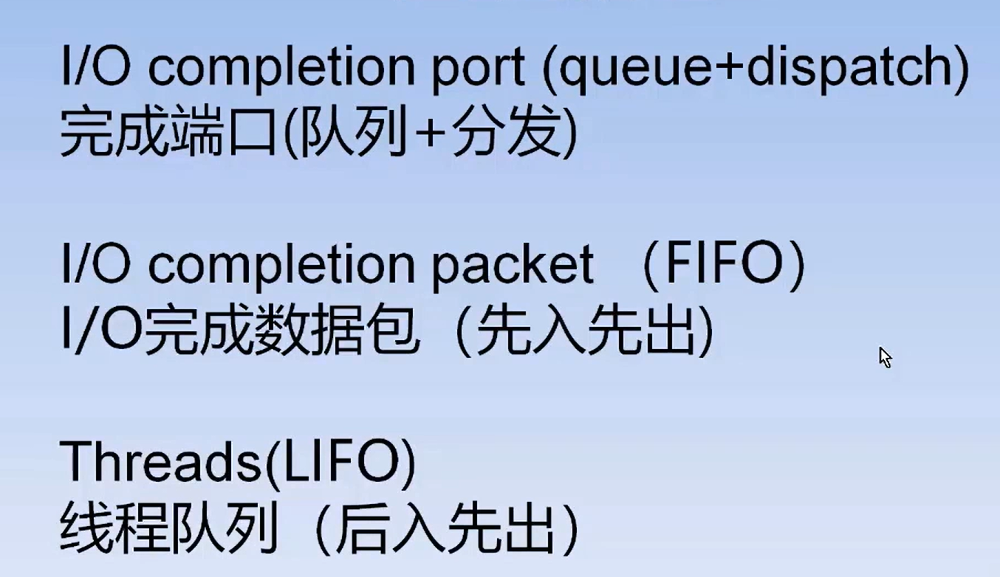 


**模型图**

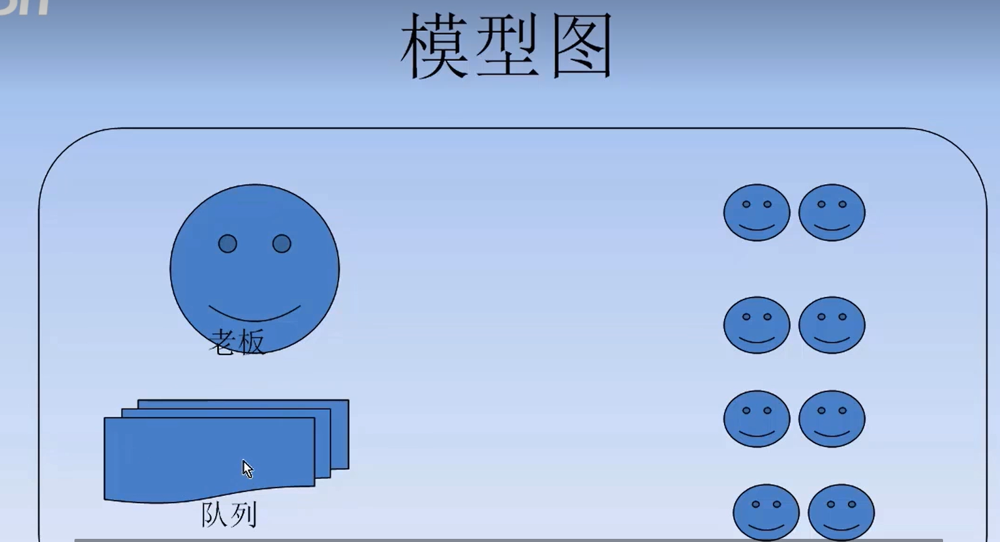 


**完成端口**相当于老板

**队列**就需要放入一个个已经的工作任务（）

**线程池**就是我们的员工


当一个工作任务到来的时候，老板首先将其加入队列，然后对其进行分发。

如何进行分发？他不是随机找一个员工，而是最近查询过，向老板汇报过，手头中没有任务，是清闲的员工，那么老板就把这个任务交给它。  这样的好处是避免带来不必要的线程切换开销。所以对于这个线程池的调度是一个后进先出的一个策略。


### 1.网络io都在干什么？

 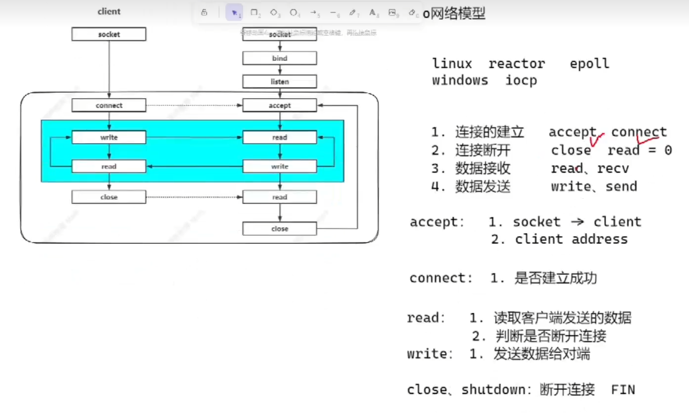

上面这些个函数都是同步io的操作。

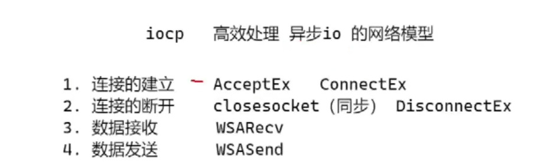 

比如说我们调用这个异步函数AcceptEx的时候，这个函数返回的时候，这个io并没有完成，我们只是投递了一个请求，投递到iocp里面，

接着iocp它会帮我们建立连接，然后再来通知我们，通知完成的结果。

接着我们需要准备一个线程，异步地接收iocp的完成通知。


### 2.完成端口怎么理解

**完成**：应用程序向系统发起一个io操作，系统会在操作结束后，讲io操作完成结果通知应用程序

我们是一个异步io，我们会向操作系统发起一个io操作，此时操作不会立刻完成，操作系统在内部会帮我们完成这个io操作，当完成的时候操作系统会通知我们。

**端口：**机制，操作系统给我们提供的一个功能/机制，这个机制用来处理异步io


### 3.重叠io又怎么理解

Overlapped

针对一个socket可以发起多个io操作，无需等待上一个io完成

尽管调用io操作是按顺序的，但是io操作完成通知是随机无序的


### 4.iocp工作原理

 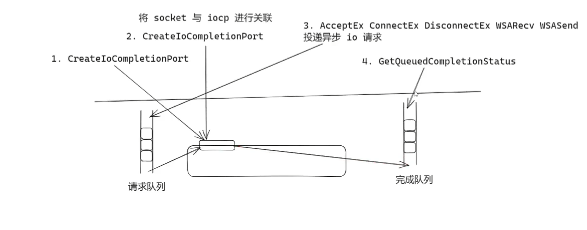


1.CreateIoCompletionProt

创建一个完成端口，操作系统就会打开这个机制，返回一个句柄

2.CreateIoCompletionProt

将一些socket与iocp进行关联，相当于将socekt交给了iocp帮我们管理。

3.使用这些异步io给iocp投递请求，放到iocp的请求队列当中

4.iocp 帮我们处理完io操作后就会将结果放入完成队列中，我们需要用GetQueuedCompletionStatus来获取，这里我们可以使用线程池来处理这些完成通知。


**IOCP（Input/Output Completion Port）是 Windows 操作系统提供的一种高效的异步 I/O 模型。**它主要用于实现高性能的输入输出操作，特别是在网络编程和文件 I/O 中广泛应用。

**IOCP 的核心思想是将输入/输出操作的完成通知异步处理，而不是采用传统的同步阻塞模型。这种模型非常适用于需要处理大量并发连接或文件操作的情况。**

以下是 IOCP 的一些关键概念和特点：

1. **异步操作：** IOCP 支持异步 I/O 操作，允许应用程序发起一个 I/O 操作，并在操作完成时得到通知。这样可以在等待 I/O 操作完成的过程中继续执行其他任务，提高系统的并发性和吞吐量。

2. **Completion Port：** IOCP 使用一个称为 Completion Port 的内核对象来管理异步操作的完成。当一个异步操作完成时，操作系统将通知相关的 Completion Port，应用程序可以通过监听 Completion Port 来得知操作完成的事件。

3. **事件驱动：** IOCP 是基于事件驱动的模型，应用程序可以注册回调函数（回调函数通常称为完成例程）来处理异步操作完成的事件。这样的设计使得应用程序可以更有效地利用系统资源。

4. **高性能：** 由于采用了异步模型和事件驱动，IOCP 在处理大量并发连接时表现出色，适用于高性能的网络服务器和文件服务器。

在 C# 中，Socket 类的 `BeginReceive`、`BeginSend`、`BeginConnect` 等方法，以及 .NET 中的异步 I/O 操作，都可以基于 IOCP 实现。使用 IOCP 时，应用程序通过异步操作发起 I/O 请求，然后通过回调函数处理完成的事件，而无需显式地创建和管理线程。

需要注意的是，IOCP 是 Windows 操作系统上的一种实现，对于其他操作系统，可能采用不同的异步 I/O 模型，如 epoll 在 Linux 上的应用。


## epoll和IOCP之比较

总结：IOCP ：我的打印文件放在店里面排队，轮到我打印了，店长帮我打印一下，打印好了通知我来拿

​            Epoll ：我的打印文件放在店里面排队，轮到我叫我一下，我自己来打印。

直入正题：
Epoll 是Linux系统下的模型；IOCP 是Windows下模型；
Epoll 是当事件资源满足时发出可处理通知消息；
IOCP 则是当事件完成时发出完成通知消息；
从应用程序的角度来看， Epoll 是同步非阻塞的；IOCP是异步操作；

举例说明，更加清晰透彻：

有一个打印店，有一台打印机，好几个人在排队打印。
普通打印店，正常情况是：

1、你准备好你的文档，来到打印店;
2、排队，等别人打印完;
3、轮到你了，打印你的文档;
4、你取走文档，做后面的处理。

这种方式，你会浪费很多等待时间，非常低效。
于是, Linux和windows都提出了自己最优的模型。

Linux的epoll模型，则可以描述如下：
1、你准备好你的文档，来到打印店;
2、告诉店小二说，我先排队在这位置，轮到我了通知一声(假定你来回路上不耗时);
3、你先去忙你的事情去了;
4、轮到你了，店小二通知你(假定你来回路上不耗时);
5、你获得打印机使用权了，开始打印;
6、打印完了拿走。

你会发现，你节省了排队的时间，等到你能获得打印机资源的时候，告诉你来处理。但是这里，就浪费了一点时间，就是你自己打印。这就是epoll的同步非阻塞。

windows的IOCP模型，则可以描述如下：
1、你准备好你的文档，来到打印店;
2、告诉店小二说，我先排队，轮到我了帮打印下，好了通知我(也假定你来回路上不耗时);
3、你先去忙你的事情去了;
4、轮到你的文档了，店小二直接帮你打印好了，通知你;
5、你来了,直接取走文档。

你会发现，你不但节省了排队时间，你连打印时间都节省了, 完全异步操作。

很显然，IOCP简直是太完美了，可以称得上是最高性能的服务器网络模型了。


## await 和  async


### 例子1：

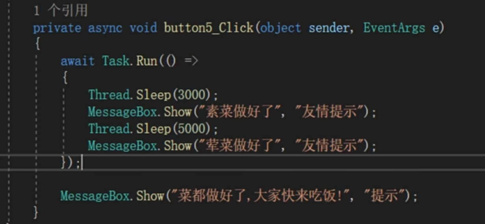

这个例子中，await会等待Task完成之后，再执行后面的ui代码（菜都做好了）

当在函数中使用await 会标识这个方法是一个异步方法，所以要加上async标记


[C#基础教程 多线程编程入门 Thread/Task/async/await 简单秒懂!_哔哩哔哩_bilibili](https://www.bilibili.com/video/BV16G4y1c72R/?spm_id_from=333.788&vd_source=ff929fb8407b30d15d4d258e14043130)


### 例子2：

从网站中下载文件的例子

[C# Async/Await: 让你的程序变身时间管理大师_哔哩哔哩_bilibili](https://www.bilibili.com/video/BV1b54y1J72M/?spm_id_from=333.337.search-card.all.click&vd_source=ff929fb8407b30d15d4d258e14043130)


### 例子3：

```
private void button1_Click(object sender, EventArgs e)
{
    Console.WriteLine("111 balabala. My Thread ID is :" + Thread.CurrentThread.ManagedThreadId);
    AsyncMethod();
    Console.WriteLine("222 balabala. My Thread ID is :" + Thread.CurrentThread.ManagedThreadId);
}

private async Task AsyncMethod()
{
    var ResultFromTimeConsumingMethod = TimeConsumingMethod();
    string Result = await ResultFromTimeConsumingMethod + " + AsyncMethod. My Thread ID is :" + 	Thread.CurrentThread.ManagedThreadId;
    Console.WriteLine(Result);
    //返回值是`Task`的函数可以不用`return`，或者将`Task`改为void
}

//这个函数就是一个耗时函数，可能是`IO`操作，也可能是`cpu`密集型工作。
private Task<string> TimeConsumingMethod()
{            
    var task = Task.Run(()=> {
        Console.WriteLine("Helo I am TimeConsumingMethod. My Thread ID is :" + Thread.CurrentThread.ManagedThreadId);
        Thread.Sleep(5000);
        Console.WriteLine("Helo I am TimeConsumingMethod after Sleep(5000). My Thread ID is :" + Thread.CurrentThread.ManagedThreadId);
        return "Hello I am TimeConsumingMethod";
    });
    return task;
}

```

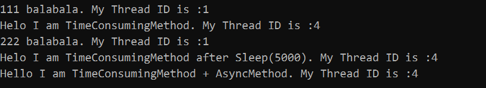 


[C# 彻底搞懂async/await - 五维思考 - 博客园 (cnblogs.com)](https://www.cnblogs.com/zhaoshujie/p/11192036.html#!comments)

**await之前是在之前的线程，之后的依然是在新的线程里继续执行。**

[对于 《C# 彻底搞懂async/await》 一文中的观点，提出自己的修正观点。 - 金尘 - 博客园 (cnblogs.com)](https://www.cnblogs.com/jinchentech/p/14908750.html)


## Task调度和await（残缺）

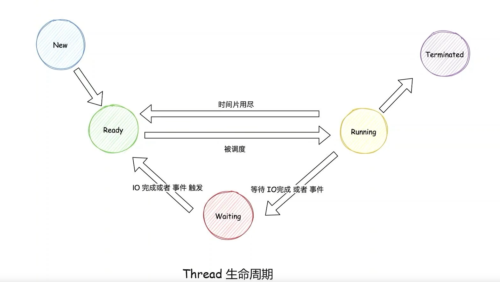

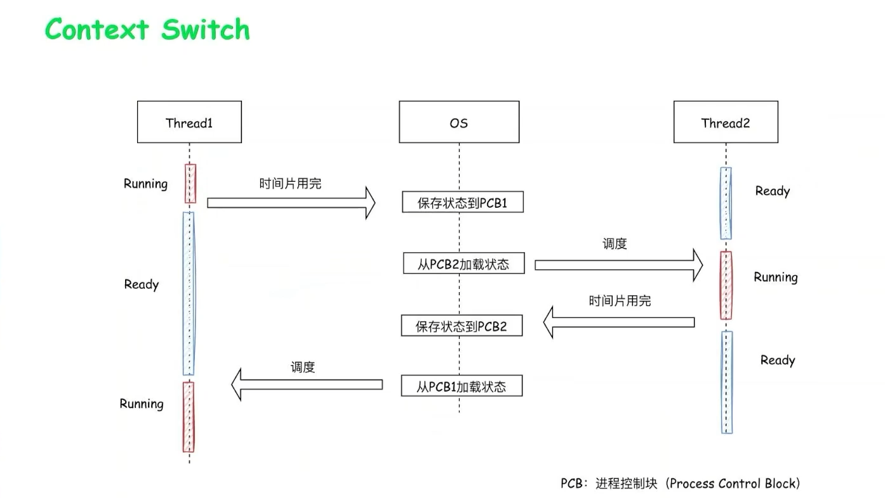

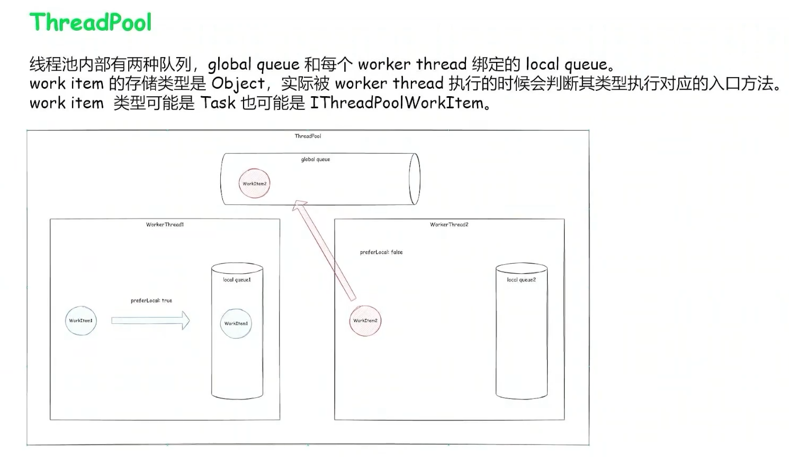

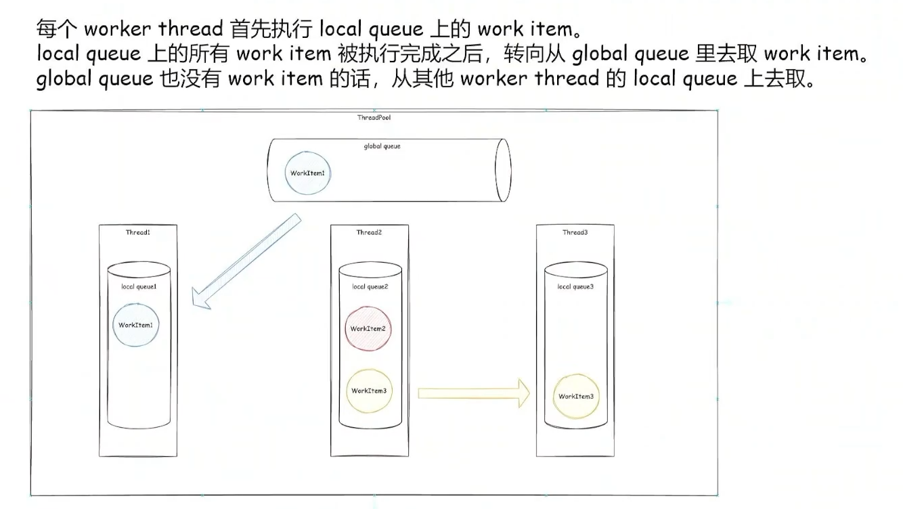

 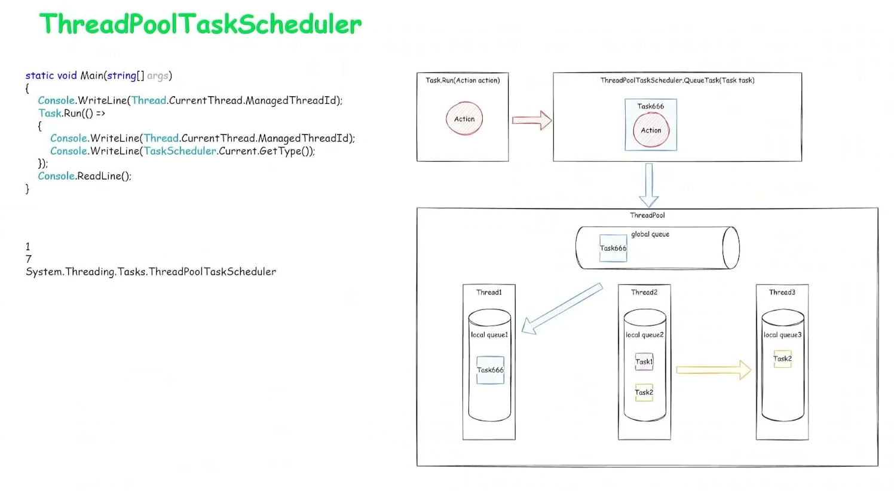

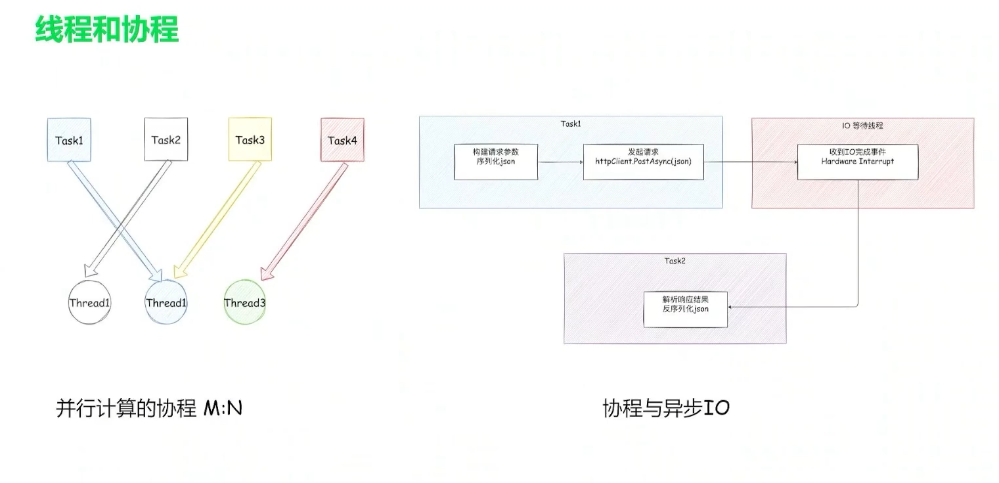

我的任务调度到线程上执行，这个任务就是协程


`await` 关键字确保在异步操作完成之前，其后的代码不会被执行。当 `await` 执行时，控制权会立即返回给调用者，不会等待异步操作完成之前的代码继续执行。

在下面的例子中，当 `SomeAsyncOperation` 方法启动异步操作后，`await` 之后的代码不会立即执行，而是会让出控制权。只有当异步操作完成后，方法才会从 `await` 之后的位置继续执行。

```
    using System;
using System.Threading;
using System.Threading.Tasks;

    class Program
    {
            static async Task Main()
            {
                //Console.WriteLine("111111");
                Console.WriteLine($"[Main] BTID: {Thread.CurrentThread.ManagedThreadId}, IsThreadPoolThread: {Thread.CurrentThread.IsThreadPoolThread}");
                await MyAsyncMethod();
                //Console.WriteLine("4444444");

                Console.WriteLine($"[Main]  ATID: {Thread.CurrentThread.ManagedThreadId}, IsThreadPoolThread: {Thread.CurrentThread.IsThreadPoolThread}");
                
                Console.ReadLine();
            }

        static async Task MyAsyncMethod()
        {
            //Console.WriteLine("222222");
            Console.WriteLine($"MyAsyncMethod BTID: {Thread.CurrentThread.ManagedThreadId}, IsThreadPoolThread: {Thread.CurrentThread.IsThreadPoolThread}");
            await SomeAsyncOperation();
            Console.WriteLine($"MyAsyncMethod ATID: {Thread.CurrentThread.ManagedThreadId}, IsThreadPoolThread: {Thread.CurrentThread.IsThreadPoolThread}");
            //Console.WriteLine("3333333");
        }

        static async Task SomeAsyncOperation()
        {
            Console.WriteLine($"SomeAsyncOperation BTID: {Thread.CurrentThread.ManagedThreadId}, IsThreadPoolThread: {Thread.CurrentThread.IsThreadPoolThread}");
            await Task.Delay(1000);
            Console.WriteLine($"SomeAsyncOperation ATID: {Thread.CurrentThread.ManagedThreadId}, IsThreadPoolThread: {Thread.CurrentThread.IsThreadPoolThread}");
        }


}

```

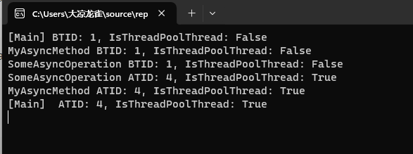 


## APM和BAP

APM（Asynchronous Programming Model）和 TAP（Task-based Asynchronous Pattern）都是 C# 中用于异步编程的模式，但它们在设计和使用上有一些差异。

**APM 模式（Asynchronous Programming Model）**

APM 模式是 .NET Framework 初始引入的一种异步编程模型。它基于回调函数，使用 `IAsyncResult` 接口和两个方法：`Begin` 和 `End`。一般来说，异步方法以 `Begin` 开头，而对应的完成方法以 `End` 开头。

```csharp
public class SomeAsyncClass
{
    // 开始异步操作
    public IAsyncResult BeginSomeOperation(AsyncCallback callback, object state)
    {
        // 异步操作的实现
        // 返回 IAsyncResult 对象
    }

    // 结束异步操作
    public void EndSomeOperation(IAsyncResult result)
    {
        // 处理异步操作的结果
    }
}
```

使用 APM 模式的代码通常是这样的：

```csharp
SomeAsyncClass asyncObject = new SomeAsyncClass();

// 开始异步操作
IAsyncResult result = asyncObject.BeginSomeOperation(callback, state);

// 主线程可以继续执行其他操作

// 等待异步操作完成
asyncObject.EndSomeOperation(result);
```

**TAP 模式（Task-based Asynchronous Pattern）**

TAP 模式是 .NET Framework 4.5 引入的，它基于 `Task` 类型和异步方法的返回类型。TAP 模式更为直观和灵活，使用 `async` 和 `await` 关键字，使得异步编程更加清晰和易读。

```csharp
public class SomeAsyncClass
{
    // 异步操作
    public async Task<int> SomeOperationAsync()
    {
        // 异步操作的实现
        // 返回异步结果
    }
}
```

使用 TAP 模式的代码通常是这样的：

```csharp
SomeAsyncClass asyncObject = new SomeAsyncClass();

// 异步调用
int result = await asyncObject.SomeOperationAsync();

// 主线程可以继续执行其他操作
```

相较于 APM 模式，TAP 模式的优势包括：

1. **清晰性：** 使用 `async` 和 `await` 关键字的代码更容易理解和维护。
2. **异常处理：** 异常处理更为自然，可以直接使用 `try/catch` 包裹异步代码块。
3. **任务组合：** 可以使用 `Task.WhenAll` 和 `Task.WhenAny` 等方法更方便地组合多个任务。

总的来说，TAP 模式是目前推荐的异步编程模式，除非你需要与老的异步 API 交互，否则应该优先选择使用 TAP 模式。


## c# 迭代器


### 迭代器

迭代器（Iterator）通过持有迭代状态可以获取当前迭代元素并且识别下一个需要迭代的元素，从而可以遍历集合中每一个元素而不用了解集合的具体实现方式；


### **IEnumerable**和**IEnumerator**


#### 概要

下面我们先看**IEnumerable**和**IEnumerator**两个接口的语法定义。


其实**IEnumerable**接口非常简单，只包含一个抽象的方法GetEnumerator()，它返回一个可用于循环访问集合的IEnumerator对象。


那**IEnumerator**对象有什么呢？其实，它是一个真正的集合访问器，没有它，就不能使用foreach语句遍历数组或集合，因为只有IEnumerator对象才能访问集合中的项，假如连集合中的项都访问不了，那么进行集合的循环遍历是不可能的事情了。

再让我们看看IEnumerator接口又定义了什么东西。看下图我们知道IEnumerator接口定义了一个Current属性，MoveNext和Reset两个方法，这是多么的简约。既然IEnumerator对象是一个访问器，那至少应该有一个Current属性，来获取当前集合中的项吧。

MoveNext方法只是将游标的内部位置向前移动（就是移到一下个元素而已），要想进行循环遍历，不向前移动一下怎么行呢？


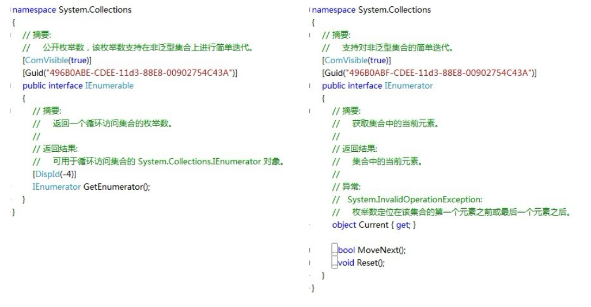 


#### **详细讲解：**

##### 简要

说到IEnumerable总是会和IEnumerator、foreach联系在一起。

C# 支持关键字foreach，允许我们遍历任何数组类型的内容：

```
//遍历数组的项
int[] myArrayOfInts = {10,20,30,40};

foreach(int i in my myArrayOfInts)

{
    Console.WirteLine(i);
}
```

虽然看上去只有数组才可以使用这个结构，其实任何支持GetEnumerator()方法的类型都可以通过foreach结构进行运算。

```csharp
public class Garage
{
    Car[] carArray = new Car[4];  //在Garage中定义一个Car类型的数组carArray,其实carArray在这里的本质是一个数组字段
    //启动时填充一些Car对象
    public Garage()
    {
        //为数组字段赋值
        carArray[0] = new Car("Rusty", 30);
        carArray[1] = new Car("Clunker", 50);
        carArray[2] = new Car("Zippy", 30);
        carArray[3] = new Car("Fred", 45);
    }
}
```

理想情况下，与数据值数组一样，使用foreach构造迭代Garage对象中的每一个子项比较方便：

```csharp
//这看起来好像是可行的
class Program
{
    static void Main(string[] args)
    {
        Console.WriteLine("*********Fun with IEnumberable/IEnumerator************\n");
        Garage carLot = new Garage();

        //交出集合中的每一Car对象吗
        foreach (Car c in carLot)
        {
            Console.WriteLine("{0} is going {1} MPH", c.CarName, c.CurrentSpeed);
        }

        Console.ReadLine();
    }
}
```

让人沮丧的是，编译器通知我们Garage类没有实现名为GetEnumerator()的方法（显然用foreach遍历Garage对象是不可能的事情，因为Garage类没有实现GetEnumerator()方法，Garage对象就不可能返回一个IEnumerator对象，没有IEnumerator对象，就不可能调用方法MoveNext()，调用不了MoveNext，就不可能循环的了）。

这个方法是有隐藏在System.collections命名空间中的IEnumerable接口定义的。（特别注意，其实我们循环遍历的都是对象而不是类，只是这个对象是一个集合对象）

支持这种行为的类或结构实际上是宣告它们向调用者公开所包含的子项：

```
//这个接口告知调方对象的子项可以枚举

public interface IEnumerable

{
    IEnumerator GetEnumerator();
}
```

可以看到，GetEnumerator方法返回对另一个接口System.Collections.IEnumerator的引用。这个接口提供了基础设施，调用方可以用来移动IEnumerable兼容容器包含的内部对象。

```
//这个接口允许调用方获取一个容器的子项
public interface IEnumerator
{
    bool MoveNext();             //将游标的内部位置向前移动
    object Current{get;}       //获取当前的项（只读属性）
    void Reset();                 //将游标重置到第一个成员前面
}
```

所以，要想Garage类也可以使用foreach遍历其中的项，那我们就要修改Garage类型使之支持这些接口，可以手工实现每一个方法，不过这得花费不少功夫。虽然自己开发GetEnumerator()、MoveNext()、Current和Reset()也没有问题，但有一个更简单的办法。

**因为System.Array类型和其他许多类型（如List）已经实现了IEnumerable和IEnumerator接口，你可以简单委托请求到System.Array**,如下所示：

```
namespace MyCarIEnumerator
{
    public class Garage:IEnumerable
    {
        Car[] carArray = new Car[4];
 
        //启动时填充一些Car对象
        public Garage()
        {
            carArray[0] = new Car("Rusty", 30);
            carArray[1] = new Car("Clunker", 50);
            carArray[2] = new Car("Zippy", 30);
            carArray[3] = new Car("Fred", 45);
        }
        public IEnumerator GetEnumerator()
        {
            return this.carArray.GetEnumerator();
        }
    }
}
//修改Garage类型之后，就可以在C#foreach结构中安全使用该类型了。
```

```
//除此之外，GetEnumerator()被定义为公开的，对象用户可以与IEnumerator类型交互： 
namespace MyCarIEnumerator
{
    class Program
    {
        static void Main(string[] args)
        {
            Console.WriteLine("*********Fun with IEnumberable/IEnumerator************\n");
            Garage carLot = new Garage();
 
            //交出集合中的每一Car对象吗
            //之所以遍历carLot，是因为carLot.GetEnumerator()返回的项时Car类型，这个十分重要
            foreach (Car c in carLot)  
            {
                Console.WriteLine("{0} is going {1} MPH", c.CarName, c.CurrentSpeed);
            }
 
            Console.WriteLine("GetEnumerator被定义为公开的，对象用户可以与IEnumerator类型交互，下面的结果与上面是一致的");
            //手动与IEnumerator协作
            IEnumerator i = carLot.GetEnumerator();
            while (i.MoveNext())
            { 
                Car myCar = (Car)i.Current;
                Console.WriteLine("{0} is going {1} MPH", myCar.CarName, myCar.CurrentSpeed);
            }
            Console.ReadLine();
        }
    }
}
 
```


##### **下面我们来看看手工实现IEnumberable接口和IEnumerator接口中的方法：**

```csharp
namespace ForeachTestCase
{
      //继承IEnumerable接口，其实也可以不继承这个接口，只要类里面含有返回IEnumberator引用的GetEnumerator()方法即可
    class ForeachTest:IEnumerable     {
        private string[] elements;  //装载字符串的数组
        private int ctr = 0;  //数组的下标计数器
 
        /// <summary>
        /// 初始化的字符串
        /// </summary>
        /// <param name="initialStrings"></param>
        ForeachTest(params string[] initialStrings)
        { 
            //为字符串分配内存空间
            elements = new String[8];
            //复制传递给构造方法的字符串
            foreach (string s in initialStrings)
            {
                elements[ctr++] = s; 
            }
        }
 
        /// <summary>
        ///  构造函数
        /// </summary>
        /// <param name="source">初始化的字符串</param>
        /// <param name="delimiters">分隔符，可以是一个或多个字符分隔</param>
        ForeachTest(string initialStrings, char[] delimiters) 
        {
            elements = initialStrings.Split(delimiters);
        }
 
        //实现接口中得方法
        public IEnumerator GetEnumerator()
        {
            return  new ForeachTestEnumerator(this);
        }
 
        private class ForeachTestEnumerator : IEnumerator
        {
            private int position = -1;
            private ForeachTest t;
            public ForeachTestEnumerator(ForeachTest t)
            {
                this.t = t;
            }
 
            #region 实现接口
 
            public object Current
            {
                get
                {
                    return t.elements[position];
                }
            }
 
            public bool MoveNext()
            {
                if (position < t.elements.Length - 1)
                {
                    position++;
                    return true;
                }
                else
                {
                    return false;
                }
            }
 
            public void Reset()
            {
                position = -1;
            }
 
            #endregion
        }
        static void Main(string[] args)
        {
            // ForeachTest f = new ForeachTest("This is a sample sentence.", new char[] { ' ', '-' });
            ForeachTest f = new ForeachTest("This", "is", "a", "sample", "sentence.");
            foreach (string item in f)
            {
                System.Console.WriteLine(item);
            }
            Console.ReadKey();
        }
    }
}
```


##### **IEnumerable<T>接口**

实现了IEnmerable<T>接口的集合，是强类型的。它为子对象的迭代提供类型更加安全的方式。

```csharp
public  class ListBoxTest:IEnumerable<String>
{
    private string[] strings;
    private int ctr = 0;

    #region IEnumerable<string> 成员
    //可枚举的类可以返回枚举
    public IEnumerator<string> GetEnumerator()
    {
        foreach (string s in strings)
        {
            yield return s;
        }
    }
    #endregion

    #region IEnumerable 成员
    //显式实现接口
    System.Collections.IEnumerator System.Collections.IEnumerable.GetEnumerator()
    {
        return GetEnumerator();
    }
    #endregion

    //用字符串初始化列表框
    public ListBoxTest(params string[] initialStrings)
    { 
        //为字符串分配内存空间
        strings = new String[8];
        //复制传递给构造方法的字符串
        foreach (string s in initialStrings)
        {
            strings[ctr++] = s; 
        }
    }

    //在列表框最后添加一个字符串
    public void Add(string theString)
    { 
        strings[ctr] = theString;
        ctr++;
    }

    //允许数组式的访问
    public string this[int index]
    {
        get {
            if (index < 0 || index >= strings.Length)
            { 
                //处理不良索引
            }
            return strings[index];
        }
        set { 
            strings[index] = value;
        }
    }

    //发布拥有的字符串数
    public int GetNumEntries()
    {
        return ctr;
    }
}
```


```
  class Program
    {
        static void Main(string[] args)
        {
            //创建一个新的列表框并初始化
            ListBoxTest lbt = new ListBoxTest("Hello", "World");
 
            //添加新的字符串
            lbt.Add("Who");
            lbt.Add("Is");
            lbt.Add("Douglas");
            lbt.Add("Adams");
 
            //测试访问
            string subst = "Universe";
            lbt[1] = subst;
 
            //访问所有的字符串
            foreach (string s in lbt)
            {
                Console.WriteLine("Value:{0}", s);
            }
            Console.ReadKey();
        }
    }
```

 综上所述，一个类型是否支持foreach遍历，必须满足下面条件：

方案1：让这个类实现IEnumerable接口

方案2：这个类有一个public的GetEnumerator的实例方法，并且返回类型中有public 的bool MoveNext()实例方法和public的Current实例属性。


### yield 

Yield Return关键字的作用就是退出当前函数，并且会保存当前函数执行到什么地方，也就上下文。你发现没下次执行这个函数上次跑来的代码是不会重复执行的


**例子1：**

```
List<int> MyFun1(){
	nums = {1,2,3,...,100};
	List<int>res = new();
	for(var i in nums){
		//do some else
		res.add(i);
	}
	return res;
}

main{
	foreach(var item in MyFun1()){
		print(item);
	}
}
```

MyFun1是直接返回一个集合，然后在main函数中对集合进行遍历。

**例子2：**

```
IEnumerator MyFun2(){
	nums = {1,2,3,...,100};
	foreach(var i in nums){
		//do some else
		yield return i;
	}
}

main{
	foreach(var item in MyFun2()){
		print(item);
	}
}
```

MyFun2是返回一个迭代器，main函数中对迭代器的每次遍历都会让MyFun2函数在上次yield退出处恢复运行，然后再次通过yield返回相应的元素并且跳出函数。

**好处：**是显而易见的，我们遍历某个集合的时候也许并不需要它全部的元素。


**问题：所以通过MyFun2获得的IEnumerator包含这MyFun2函数的信息？上次yield退出函数的位置？**

yield退出的时候这个语法糖肯定是记录了当前退出的地址，然后构造一个迭代器对象返回出去，下次调用者就可以通知这个迭代器再次进来这地址里面来了。

```
IEnumerator{
	info[];		//记录上次yield退出的地址。
	hasnext();	
	next();
}
```


### 参考文献：

[详解C#迭代器 - Minotauros - 博客园 (cnblogs.com)](https://www.cnblogs.com/minotauros/p/10439094.html)

[迭代器 - C# | Microsoft Learn](https://learn.microsoft.com/zh-cn/dotnet/csharp/iterators)

[IEnumerable和IEnumerator 详解-CSDN博客](https://blog.csdn.net/byondocean/article/details/6871881)

[彻底搞懂C#之Yield Return语法的作用和好处-CSDN博客](https://blog.csdn.net/qq_33060405/article/details/78484825)


## 程序集Assembly

程序集是代码进行编译是的一个逻辑单元，把相关的代码和类型进行组合，然后生成PE文件。程序集只是逻辑上的划分，一个程序集可以只由一个文件组成，也可由多个文件组成。不管是单文件程序集还是多文件程序集，它们都由固定的结构组成


### **常见的两种程序集：**

可执行文件（.exe文件）和 类库文件（.dll文件）。

在VS开发环境中，一个解决方案可以包含多个项目，而每个项目就是一个程序集。


### **应用程序结构：**

　　包含 应用程序域（AppDomain），程序集（Assembly），模块（Module），类型（Type），成员（EventInfo、FieldInfo、MethodInfo、PropertyInfo） 几个层次

他们之间是一种从属关系，也就是说，一个AppDomain能够包括N个Assembly，一个Assembly能够包括N个Module，一个Module能够包括N个Type，一个Type能够包括N个成员。他们都在System.Reflection命名空间下。

【[公共语言运行库CLR](https://baike.baidu.com/item/公共语言运行库/2882128?fr=aladdin)】加载器 管理 应用程序域，这种管理包括 将每个程序集加载到相应的应用程序域 以及 控制每个程序集中类型层次结构的内存布局。

从【应用程序结构】中不难看出程序集Assembly的组成：

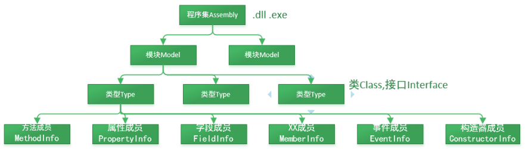

MemberInfo 该类是一个基类，它定义了EventInfo、FieldInfo、MethodInfo、PropertyInfo的多个公用行为 

一个程序运行起来以后，有一个应用程序域（AppDomain），在这个应用程序域（AppDomain）中放了我们用到的所有程序集（Assembly）。我们所写的所有代码都会编译到【程序集】文件（.exe .dll）中，并在运行时以【Assembly对象】方式加载到内存中运行，每个类（Class Interface）以【Type对象】方式加载到内存，类的成员（方法，字段，属性，事件，构造器）加载到内存也有相应的对象。


### **程序集的结构：**

程序集元数据，类型元数据，MSIL代码，资源。

**①程序集元数据**，程序集元数据也叫清单，它记录了程序集的许多重要信息，是程序集进行自我说明的核心文档。当程序运行时，CLR 通过这份清单就能获取运行程序集所必需的全部信息。清单中主要主要包含如下信息：**标识信息**（包括程序集的名称、版本、文化和公钥等）；**文件列表**（程序集由哪些文件组成）；**引用程序集列表**（该程序集所引用的其他程序集）；**一组许可请求**（运行这个程序集需要的许可）。

**②类型元数据**，类型元数据列举了程序集中包含的类型信息，**详细说明了程序集中定义了哪些类**，每个类包含哪些属性和方法，每个方法有哪些参数和返回值类型，等等。

**③MSIL代码**，程序集元数据和类型元数据只是一些辅助性的说明信息，它们都是为描述MSIL代码而存在的。MSIL 代码是程序集的真正核心部分，正是它们实现了程序集的功能。比如在“Animals”项目中，五个动物类的C#代码最终都被转换为MSIL 代码，保存在程序集Animals.dll 中，当运行程序时，就是通过这些MSIL 代码绘制动物图像的。

**④资源**，程序集中还可能包含图像、图标、声音等资源。


### 私有程序集和共享程序集

私有程序集是仅供单个软件使用的程序集，安装很简单，只需把私有程序集复制到软件包所在文件夹中即可。而那些被不同软件共同使用的程序就是共享程序集，.NET类库的程序集就是共享程序集，共享程序集为不同的程序所共用，所以它的部署就不像私有程序集那么简单，必须考虑命名冲突和版本冲突等问题。解决这些问题的办法是把共享程序集放在系统的一个特定文件夹内，这个特定文件夹称为全局程序集高速缓存（GAC）。这个过程可用专门的.NET 工具完成


### 程序集的特性

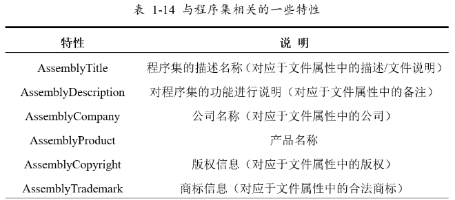 

```
// 将 ComVisible 设置为 false 使此程序集中的类型对 COM 组件不可见。如果需要从 COM 访问此程序集中的类型，则将该类型上的 ComVisible 属性设置为 true。
[assembly: ComVisible(false)]

// 如果此项目向 COM 公开，则下列 GUID 是用于类型库的 ID
[assembly: Guid("816a1507-8ca5-438d-87b4-9f3bef5b2481")]

// 程序集的版本信息由下面四个值组成:主版本、次版本、内部版本号、修订号
[assembly: AssemblyVersion("1.0.0.0")]
[assembly: AssemblyFileVersion("1.0.0.0")]
```

程序集的属性信息是由特性实现的，与普通特性的不同的是，描述程序集的特性前要添加前缀“assembly：”


### Assembly 程序集对象

**Assembly 是一个抽象类，我们用的都是RuntimeAssembly的对象。**

**获得程序集的方式：**

- 获得当前程序域中的所有程序集
  - Assembly[] ass = AppDomain.CurrentDomain.GetAssemblies();
  - 所有用到过得aessembly。如果只是add ref了，没有在程序中用到，AppDomain.CurrentDomain.GetAssemblies()中没有。用到时才被JIT加载到内存。
  - 每个app都有一个AppDomain，OS不允许其他app访问这个程序的AppDomain
- 获得当前对象所属的类所在的程序集
  - this.GetType().Assembly;
  - Type对象肯定在一个assembly对象中
  - 可以通过Type对象得到程序集

- 根据路径加载程序集
  - Assembly.LoadFrom(assPath);

```
Assembly assembly = Assembly.LoadFrom(@"E:\Work\VSCode\ConsoleApp1\ClassLibrary1\bin\Debug\netstandard2.0\ClassLibrary1.dll");
Type[] allTypes = assembly.GetTypes();
Type stu = assembly.GetType("ClassLibrary1.Student");
object stu1 = Activator.CreateInstance(stu);
Console.WriteLine(stu1);
```


### Type 类型对象

**Type 是一个抽象类，我们用的都是TypeInfo类的对象。**

程序运行时，一个class对应一个Type类的对象。通过Type对象可以获得类的所有信息。

**获得Type对象的方式：**

- 通过类获得对应的Type
  - Type t1 = typeof(Person);
- 通过对象获得Type用assembly对象，通过类的full name类获得type对象
  - Type t2 = person.GetType();  
  - this.GetType();
  - Type stu = assembly.GetType("ClassLibrary1.Student");

- 获得程序集中定义的所有的public类
  - Type[] allPublicTypes = ass1.GetExportedTypes();
- 获得程序集中定义的所有的类
  - Type[] allTypes = ass1.GetTypes();

#### Type类的属性：

- t.Assembly; 获取t所在的程序集
- t.FullName; 获取t所对应的类的full name
- t.Name; 获取t所对应的类的 name
- t.IsArray; 判断t是否是一个数组类
- t.IsEnum; 判断t是否是一个枚举类
- t.IsAbstract; 判断t是否是一个抽象类
- t.IsInterface; 判断t是否是一个interface

#### Type类的方法：

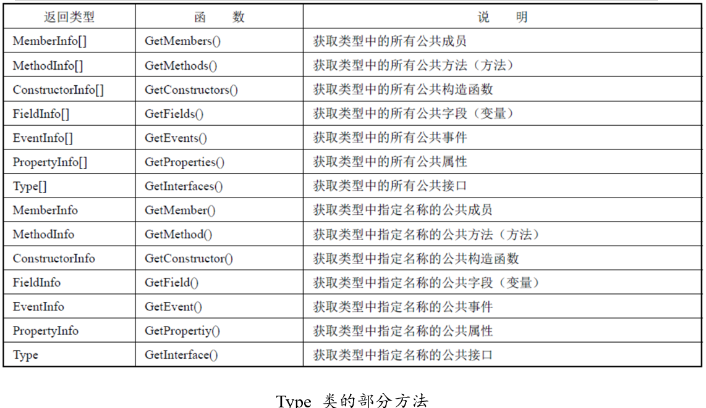

- notebookInterfaceType.IsAssignableFrom(Type t);判断t是否实现了 notebookInterfaceType 接口
- t.IsSubclassOf(Type parent); t是否是parent的子类
- t.IsInstanceOfType(object o); o是否是t类的对象
- t.GetFields();  //method, property  得到所有的public的fields，methods，properties


#### Type类示例：

 View Code

```
static void TypeTest1()
        {
            Person p = new Person { Name = "NaNa", Age = 5 };
            Type typePerson = p.GetType();

            //搜索具有指定名称的公共属性
            PropertyInfo pf = typePerson.GetProperty("Name");
            pf.SetValue(p, "LiLi", null);
            Console.WriteLine(p.Name);

            //返回所有公共属性
            PropertyInfo[] props = typePerson.GetProperties();
            StringBuilder builder = new StringBuilder(30);
            foreach (PropertyInfo item in props)
            {
                builder.Append(item.Name + "=" + item.GetValue(p, null) + "\n");
            }
            builder.Append("----------------------\n");

            //返回所有公共字段
            FieldInfo[] fieIds = typePerson.GetFields();
            foreach (FieldInfo item in fieIds)
            {
                builder.Append(item.Name + "=" + item.GetValue(p) + "\n");
            }
            builder.Append("----------------------\n");

            //返回所有公共方法
            MethodInfo[] methods = typePerson.GetMethods();
            foreach (MethodInfo item in methods)
            {
                builder.Append(item + "\n");
            }
            builder.Append("----------------------\n");
            Console.WriteLine(builder);

            //返回所有公共构造函数
            ConstructorInfo[] cons = typePerson.GetConstructors();
            foreach (ConstructorInfo item in cons)
            {
                //Name都是 .ctor  
                Console.WriteLine(item.Name + "\n");
                //构造函数的参数个数  
                Console.WriteLine(item.GetParameters().Length + "\n");

                ParameterInfo[] parames = item.GetParameters();
                foreach (var pars in parames)
                {
                    Console.WriteLine(pars.Name+"："+pars.ParameterType);
                }
            } 
        }
```


### 参考文献

[C# 程序集（Assembly） - 智者见智 - 博客园 (cnblogs.com)](https://www.cnblogs.com/zhaoyl9/p/12036037.html)


## JIT


### 什么是JIT？

 一些其他解释的网站：http://www.sohu.com/a/169704040_464084

1、***动态编译*（dynamic compilation）**指的是“在运行时进行编译”；与之相对的是**事前编译（ahead-of-time compilation，简称AOT）**，也叫*静态编译*（static compilation）。

2、***JIT*编译（just-in-time compilation）**狭义来说是当某段代码即将第一次被执行时进行编译，因而叫“即时编译”。*JIT编译是动态编译的一种特例*。JIT编译一词后来被*泛化*，时常与动态编译等价；但要注意广义与狭义的JIT编译所指的区别。
3、*自适应动态编译*（adaptive dynamic compilation）也是一种动态编译，但它通常执行的时机比JIT编译迟，先让程序“以某种式”先运行起来，收集一些信息之后再做动态编译。这样的编译可以更加优化。


### JVM运行原理

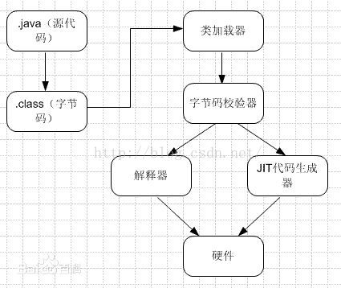 

在部分商用虚拟机中（如HotSpot），Java程序最初是通过解释器（Interpreter）进行解释执行的，当虚拟机发现某个方法或代码块的运行特别频繁时，就会把这些代码认定为“*热点代码*”。为了提高热点代码的执行效率，在运行时，虚拟机将会把这些代码编译成与本地平台相关的机器码，并进行各种层次的优化，完成这个任务的编译器称为*即时编译器*（Just In Time Compiler，下文统称JIT编译器）。

即时编译器并不是虚拟机必须的部分，Java虚拟机规范并没有规定Java虚拟机内必须要有即时编译器存在，更没有限定或指导即时编译器应该如何去实现。但是，即时编译器编译性能的好坏、代码优化程度的高低却是衡量一款商用虚拟机优秀与否的最关键的指标之一，它也是虚拟机中最核心且最能体现虚拟机技术水平的部分。

由于Java虚拟机规范并没有具体的约束规则去限制即使编译器应该如何实现，所以这部分功能完全是与虚拟机具体实现相关的内容，如无特殊说明，我们提到的编译器、即时编译器都是指Hotspot虚拟机内的即时编译器，虚拟机也是特指HotSpot虚拟机。


### 为什么HotSpot虚拟机要使用解释器与编译器并存的架构？

尽管并不是所有的Java虚拟机都采用解释器与编译器并存的架构，但许多主流的商用虚拟机（如HotSpot），都同时包含解释器和编译器。解释器与编译器两者各有优势：当程序需要*迅速启动和执行*的时候，解释器可以首先发挥作用，省去编译的时间，立即执行。在程序运行后，随着时间的推移，编译器逐渐发挥作用，把越来越多的代码编译成本地代码之后，可以获取*更高的执行效率*。当程序运行环境中*内存资源限制较大*（如部分嵌入式系统中），可以使用*解释器执行节约内存*，反之可以使用*编译执行来提升效率*。此外，如果编译后出现“罕见陷阱”，可以通过逆优化退回到解释执行。

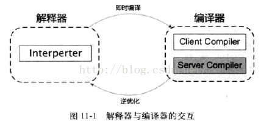 


#### 编译的时间开销

解释器的执行，抽象的看是这样的：
*输入的代码 -> [ 解释器 解释执行 ] -> 执行结果
*而要JIT编译然后再执行的话，抽象的看则是：
*输入的代码 -> [ 编译器 编译 ] -> 编译后的代码 -> [ 执行 ] -> 执行结果
*说JIT比解释快，其实说的是“执行编译后的代码”比“解释器解释执行”要快，并不是说“编译”这个动作比“解释”这个动作快。
JIT编译再怎么快，至少也比解释执行一次略慢一些，而要得到最后的执行结果还得再经过一个“执行编译后的代码”的过程。
所以，对“只执行一次”的代码而言，解释执行其实总是比JIT编译执行要快。
怎么算是“只执行一次的代码”呢？粗略说，下面两个条件同时满足时就是严格的“只执行一次”
1、只被调用一次，例如类的构造器（class initializer，<clinit>()）
2、没有循环
对只执行一次的代码做JIT编译再执行，可以说是得不偿失。
对只执行少量次数的代码，JIT编译带来的执行速度的提升也未必能抵消掉最初编译带来的开销。

*只有对频繁执行的代码，JIT编译才能保证有正面的收益。*


#### 编译的空间开销

对一般的Java方法而言，编译后代码的大小相对于字节码的大小，膨胀比达到10x是很正常的。同上面说的时间开销一样，这里的空间开销也是，只有对执行频繁的代码才值得编译，如果把所有代码都编译则会显著增加代码所占空间，导致“代码爆炸”。

*这也就解释了为什么有些JVM会选择不总是做JIT编译，而是选择用解释器+JIT编译器的混合执行引擎。*


### 为何HotSpot虚拟机要实现两个不同的即时编译器？

HotSpot虚拟机中内置了两个即时编译器：Client Complier和Server Complier，简称为C1、C2编译器，分别用在客户端和服务端。目前主流的HotSpot虚拟机中默认是采用解释器与其中一个编译器直接配合的方式工作。程序使用哪个编译器，取决于虚拟机运行的模式。HotSpot虚拟机会根据自身版本与宿主机器的硬件性能自动选择运行模式，用户也可以使用“-client”或“-server”参数去强制指定虚拟机运行在Client模式或Server模式。

用Client Complier获取更高的*编译速度*，用Server Complier 来获取更好的*编译质量*。为什么提供多个即时编译器与为什么提供多个垃圾收集器类似，都是为了适应不同的应用场景。


### 哪些程序代码会被编译为本地代码？如何编译为本地代码？

程序中的代码只有是热点代码时，才会编译为本地代码，那么什么是*热点代码*呢？

运行过程中会被即时编译器编译的“热点代码”有两类：
1、被多次调用的方法。

2、被多次执行的循环体。

两种情况，编译器都是以整个方法作为编译对象。 这种编译方法因为编译发生在方法执行过程之中，因此形象的称之为栈上替换（On Stack Replacement，OSR），即方法栈帧还在栈上，方法就被替换了。


### 如何判断方法或一段代码或是不是热点代码呢？

要知道方法或一段代码是不是热点代码，是不是需要触发即时编译，需要进行Hot Spot Detection（热点探测）。

目前主要的热点探测方式有以下两种：
**（1）基于采样的热点探测**
采用这种方法的虚拟机会周期性地检查各个线程的栈顶，如果发现某些方法经常出现在栈顶，那这个方法就是“热点方法”。这种探测方法的好处是实现简单高效，还可以很容易地获取方法调用关系（将调用堆栈展开即可），缺点是很难精确地确认一个方法的热度，容易因为受到线程阻塞或别的外界因素的影响而扰乱热点探测。
**(2)基于计数器的热点探测**

采用这种方法的虚拟机会为每个方法（甚至是代码块）建立计数器，统计方法的执行次数，如果执行次数超过一定的阀值，就认为它是“热点方法”。这种统计方法实现复杂一些，需要为每个方法建立并维护计数器，而且不能直接获取到方法的调用关系，但是它的统计结果相对更加精确严谨。

### HotSpot虚拟机中使用的是哪钟热点检测方式呢？

在HotSpot虚拟机中使用的是第二种——基于计数器的热点探测方法，因此它为每个方法准备了两个计数器：*方法调用计数器*和*回边计数器*。在确定虚拟机运行参数的前提下，这两个计数器都有一个确定的阈值，当计数器超过阈值溢出了，就会触发JIT编译。


#### 方法调用计数器

顾名思义，这个计数器用于统计方法被调用的次数。
当一个方法被调用时，会先检查该方法是否存在被JIT编译过的版本，如果存在，则优先使用编译后的本地代码来执行。如果不存在已被编译过的版本，则将此方法的调用计数器值加1，然后判断方法调用计数器与回边计数器值之和是否超过方法调用计数器的阈值。如果超过阈值，那么将会向即时编译器提交一个该方法的代码编译请求。
如果不做任何设置，执行引擎并不会同步等待编译请求完成，而是继续进行解释器按照解释方式执行字节码，直到提交的请求被编译器编译完成。当编译工作完成之后，这个方法的调用入口地址就会系统自动改写成新的，下一次调用该方法时就会使用已编译的版本。

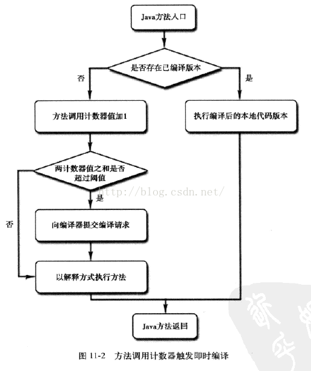

#### 回边计数器

它的作用就是统计一个方法中*循环体*代码执行的次数，在字节码中遇到控制流向后跳转的指令称为“回边”。

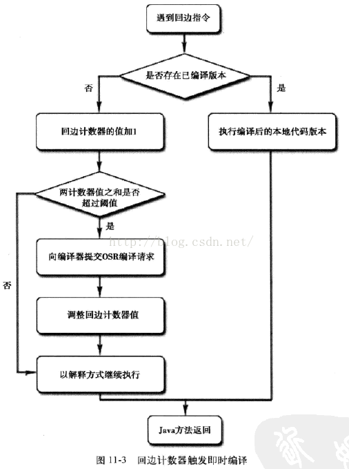


### 参考文献

[什么是JIT，写的很好 - ddzh2020 - 博客园 (cnblogs.com)](https://www.cnblogs.com/dzhou/p/9549839.html)


## 委托，事件，Action，Func区别

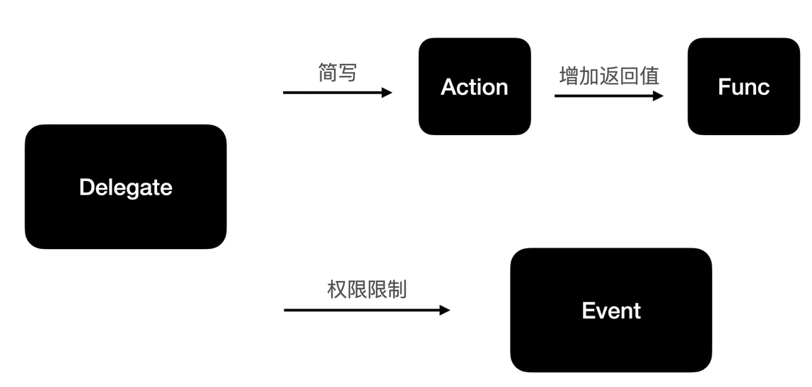 

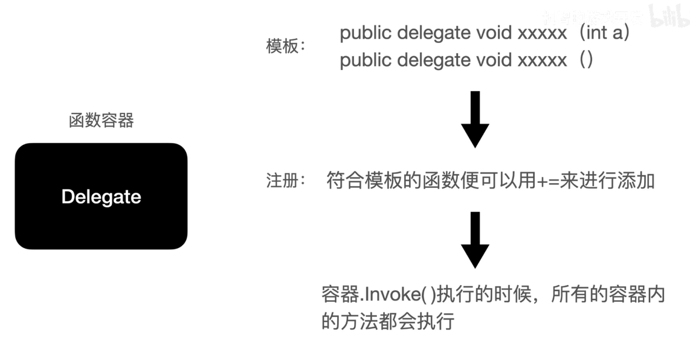 


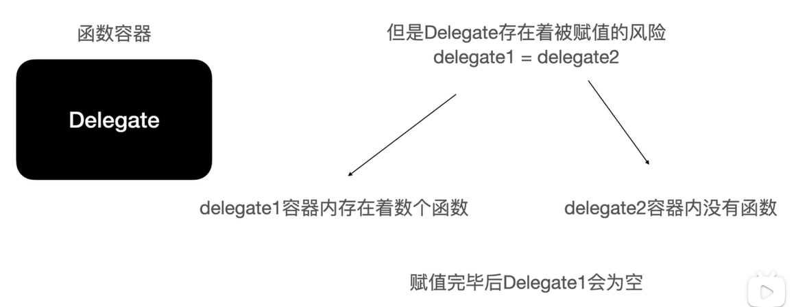 

写成Event这个赋值操作就不会发生

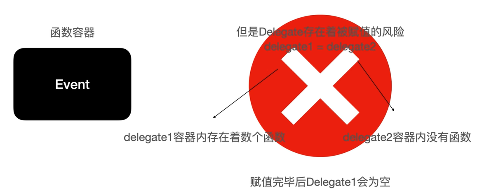 

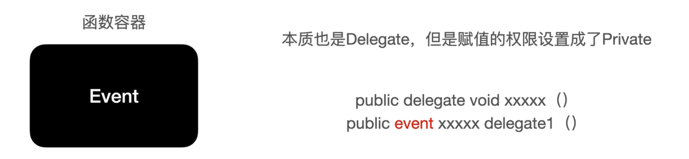


Action是Delegate的简写，c#为我们封装好的，当然它也会有像委托那样被覆盖的风险。

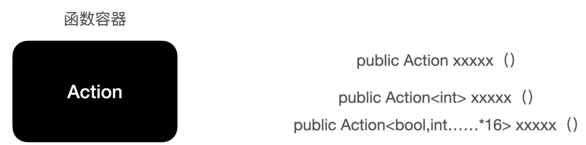

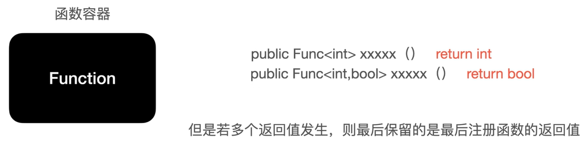

## IDisposable

### 什么是 `Dispose`？

`Dispose` 是一种 **显式资源管理** 的方法，通常用来释放占用的资源（如文件、数据库连接等）。当你使用完某个对象后，你可以手动调用它的 `Dispose()` 方法来释放它占用的资源。

```csharp
using (var obj = new MyClass())
{
    // 使用 obj
} // 离开作用域时会自动调用 obj.Dispose()
```

如果你忘了调用 `Dispose()`，那么资源可能不会及时释放。为了解决这种情况，C# 提供了一个 **终结器（析构函数）** 来作为一种后备机制。

###  什么是终结器（析构函数）？

终结器（`~MyChildClass()`）是 C# 中的一种特殊方法，它会在对象**被垃圾回收**时自动调用。你不需要显式地调用终结器，垃圾回收器会在清理对象时调用它。

- **什么时候调用终结器？**
  当对象没有被显式地销毁（没有手动调用 `Dispose()` 方法）时，垃圾回收器会自动调用终结器以清理资源。

###  为什么要调用 `Dispose(false)`？

在 `Dispose()` 方法中，我们通常会分为两种情况：
1. **`Dispose(true)`**：表示由 **用户手动调用**，这时需要释放所有资源（包括托管资源和非托管资源）。
2. **`Dispose(false)`**：表示由 **终结器调用**，只释放非托管资源（因为托管资源会自动由垃圾回收器处理）。


**托管资源 vs. 非托管理资源**

- **托管资源**：由 .NET 运行时自动管理的资源（如内存、普通对象），你不用担心这些资源会被泄漏，垃圾回收器会自动处理。
- **非托管资源**：由操作系统管理的资源（如文件句柄、数据库连接、网络连接），需要手动释放。如果不释放它们，可能会导致资源泄漏。

###  终结器的作用

当用户忘记调用 `Dispose()` 时，终结器提供了一个保险机制。通过调用 `Dispose(false)`，终结器可以清理非托管资源，防止泄漏。

###  为什么要用 `GC.SuppressFinalize(this)`？

如果你手动调用了 `Dispose()` 方法，那么不再需要垃圾回收器去调用终结器。所以我们使用 `GC.SuppressFinalize(this)` 来告诉垃圾回收器：“已经处理好了，不用再调用终结器了”，这样可以提高性能。

### 例子解释

假设你有一个 `MyChildClass` 类，它需要清理资源。

```csharp
public class MyChildClass : SingletonNonMono<MyChildClass>
{
    private SomeResource _resource; // 非托管资源

    public MyChildClass()
    {
        _resource = new SomeResource(); // 分配资源
    }

    // 子类的 Dispose 实现
    protected override void Dispose(bool disposing)
    {
        if (disposing)
        {
            // 如果是显式调用 Dispose，清理托管和非托管资源
            if (_resource != null)
            {
                _resource.Dispose();  // 清理子类特有的资源
                _resource = null;
            }
        }

        // 非托管资源的清理（无论是 Dispose 还是终结器，都要清理）
        base.Dispose(disposing);
    }

    // 终结器
    ~MyChildClass()
    {
        Dispose(false);  // 在终结器中仅清理非托管资源
    }
}
```

### 工作流程：
1. **手动调用 `Dispose()`**：
   - 用户调用 `Dispose()`，传递 `true`，会清理 **托管资源** 和 **非托管资源**。
   - 调用 `GC.SuppressFinalize(this)`，防止垃圾回收器再调用终结器。
   
2. **垃圾回收器调用终结器**：
   - 如果用户忘记调用 `Dispose()`，垃圾回收器最终会调用终结器 `~MyChildClass()`。
   - 终结器调用 `Dispose(false)`，只清理 **非托管资源**。

这样，即使用户忘了调用 `Dispose()`，非托管资源也能通过终结器清理掉，避免资源泄漏。

### 总结

- **`Dispose(true)`**：当用户手动调用 `Dispose()` 时，清理托管和非托管资源。
- **`Dispose(false)`**：当垃圾回收器调用终结器时，只清理非托管资源。
- **终结器 `~MyChildClass()`**：是垃圾回收器的后备机制，防止忘记调用 `Dispose()` 时资源泄漏。

通过终结器，你可以确保即使用户忘了调用 `Dispose()`，对象的非托管资源也能得到清理。


# unity杂谈


## unity 怎么编译c#？


### 1.简要

- 编译器的工作流水线：源代码-词法分析-语法分析-语义分析-目标代码-链接-可执行文件 （现代编译器会更复杂，比如优化）
- 虚拟机执行中间代码的方式分为 2 种：**解释执行(Interpreted Execution)**和 **即时编译(Just-In-Time Compilation)**。解释执行即逐条执行每条指令，JIT 则是先将中间代码在开始运行的时候编译成机器码，然后执行机器码。
- C# 编译 **CIL语言**，放到**CLR虚拟机**内执行 （CIL，Common Intermediate Language，也叫 MSIL）（CLR Common Language Runtime）
- **.Net Framework定义**：通常我们把 C#、CIL、CLR，再加上微软提供的一套基础类库称为 .Net Framework
- **Mono 是跨平台的 .Net Framework 的实现**。Mono 做了一件很了不起的事情，将 CLR 在所有支持的平台上重新实现了一遍，将 .Net Framework 提供的基础类库也重新实现了一遍。
- 理论上，你创造了一门语言，并且实现了所有平台下的编译器，就能跨语言了。


**为什么 Unity3D 可以运行 C#，C# 和 Mono 是什么关系，Mono 和 .Net Framework 又是什么关系？我们深入的来聊一聊这个话题！**


### 2.从编译原理说起

一句话介绍编译器：编译器是将用某种程式语言写成的源代码（源语言），转换成另一种程式语言（目标语言）等价形式的程序。通常我们是将某种高级语言（如C、C++、C# 、Java）转换成低级语言（汇编语言、机器语言）。
编译器以流水线的形式进行工作，分为几个阶段：源代码 → 词法分析 → 语法分析 → 语义分析 → 目标代码 → 链接 → 可执行文件。
**链接（linking）解释：**上一步骤的结果可能会引用外部的函数，把外部函数的代码（通常是后缀名为.lib和.a的文件），添加到可执行文件中，这就叫做链接。——两种，静态链接（编译时）和动态链接（runtime）。

现代编译器还会更复杂，中间会增加更多的处理过程，比如预处理器，中间代码生成，代码优化等。

 

### 3.虚拟机是什么

虚拟机（VM），简单理解，就是可以执行特定指令的一种程序。为了执行指令，还需要一些配套的设施，如寄存器、栈等。虚拟机可以很复杂，复杂到模拟真正的计算机硬件，也可以很简单，简单到只能做加减乘除。
在编译器领域，虚拟机通常执行一种叫中间代码的语言，中间代码由高级语言转换而成，以 Java 为例，Java 编译后产生的并不是一个可执行的文件，而是一个 ByteCode （字节码）文件，里面包含了从 Java 源代码转换成等价的字节码形式的代码。Java 虚拟机（JVM）负责执行这个文件。
**虚拟机执行中间代码的方式分为 2 种：解释执行和 JIT（即时编译）。**

- 解释执行即逐条执行每条指令。
- JIT 则是先将中间代码在开始运行的时候编译成机器码，然后执行机器码。

**由于执行的是中间代码，所以，在不同的平台实现不同的虚拟机，都可以执行同样的中间代码，也就实现了跨平台。**

```
int run(context* ctx, code* c) {
    for (cmd in c->cmds) {
        switch (cmd.type) {
            case ADD:
            // todo add            break;
            case SUB:
            // todo subtract            break;
            // ...        }
    }
    return 0;
}
```

总结一下，虚拟机本身并不跨平台，而是语言是跨平台的，对于开发人员来说，只需要关心开发语言即可，不需要关心虚拟机是怎么实现的，这也是 Java 可以跨平台的原因，C# 也是同样的。推而广之，理论上任何语言都可以跨平台，只要在相应平台实现了编译器或者虚拟机等配套设施。


### 4.C# 是什么，IL 又是什么

C# 是微软推出的一种基于 .NET 框架的、面向对象的高级编程语言。微软在 2000 年发布了这种语言，希望借助这种语言来取代Java。

C# 是一个语言，微软给它定制了一份语言规范，提供了从开发、编译、部署、执行的完整的一条龙的服务，每隔一段时间会发布一份最新的规范，添加一些新的语言特性。从语法层面来说，C# 是一个很完善，写起来非常舒服的语言。

C# 和 Java 类似，C# 会编译成一个中间语言（CIL，Common Intermediate Language，也叫 MSIL），CIL 也是一个高级语言，而运行 CIL 的虚拟机叫 CLR（Common Language Runtime）。通常我们把 C#、CIL、CLR，再加上微软提供的一套基础类库称为 .Net Framework。

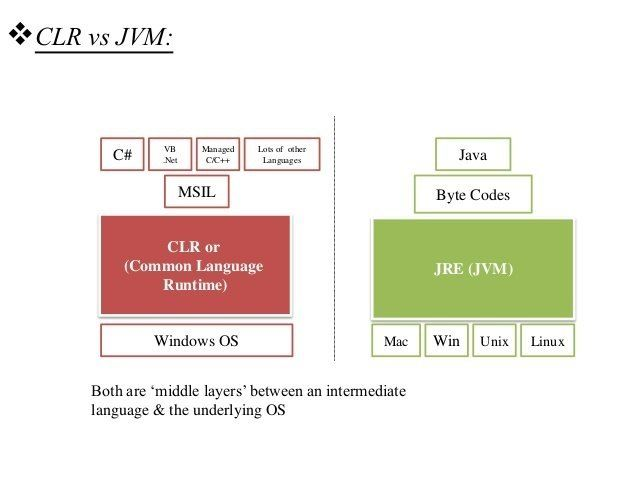 

C# 天生就是为征服宇宙设计的，不过非常遗憾，由于微软的封闭，这个目标并没有实现。当然 C# 现在还过得很好，因为游戏而焕发了新的活力，因为 Unity3D，因为 Mono。


**IL科普**
IL的全称是 Intermediate Language，很多时候还会看到**CIL**（特指在.Net平台下的IL标准）。翻译过来就是中间语言。
它是一种属于通用语言架构和.NET框架的低阶的人类可读的编程语言。
CIL类似一个面向对象的汇编语言，并且它是完全基于堆栈的，它运行在虚拟机上（.Net Framework, Mono VM）的语言。


### 4.Mono

Mono 是跨平台的 .Net Framework 的实现。Mono 做了一件很了不起的事情，将 CLR 在所有支持的平台上重新实现了一遍，将 .Net Framework 提供的基础类库也重新实现了一遍。
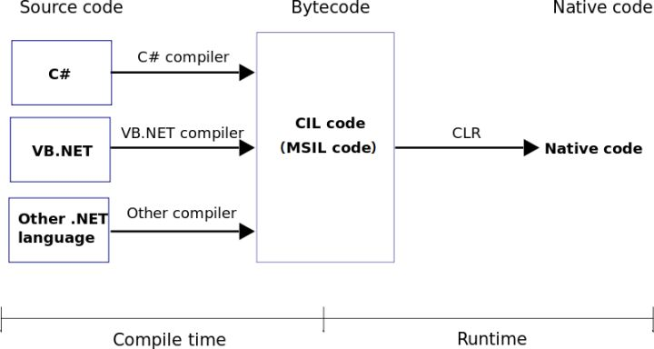

以上，Compile Time 的工作实际上可以直接用微软已有的成果，只要将 Runtime 的 CLR 在其他平台实现，这个工作量不仅大，而且需要保证兼容，非常浩大的一个工程，Mono 做到了，致敬！

Unity3D 中的 C#
**Unity3D 内嵌了一个 Mono 虚拟机**，从上文可以知道，当实现了某个平台的虚拟机，那语言就可以在该平台运行，所以，严格的讲，**Unity3D 是通过 Mono 虚拟机，运行 C# 编译器编译后生成的 IL 代码。**

Unity3D 默认使用 C# 作为开发语言，除此之外，还支持 JS 和 BOO，因为 Unity3D 开发了相应的编译器，将 JS 和 BOO 编译成了 IL。

C# 在 Windows 下，是通过微软的 C# 编译器，生成了 IL 代码，运行在 CLR 中。
C# 在除 Windows 外的平台下，是通过 Mono 的编译器，生成了 IL 代码，运行在 Mono 虚拟机中，也可以直接运行将已经编译好的 IL 代码（通过任意平台编译）。
理论上，你创造了一门语言，并且实现了某一平台下的编译器，然后实现了所有平台下符合语言规范的虚拟机，你的语言就可以运行在任意平台啦。


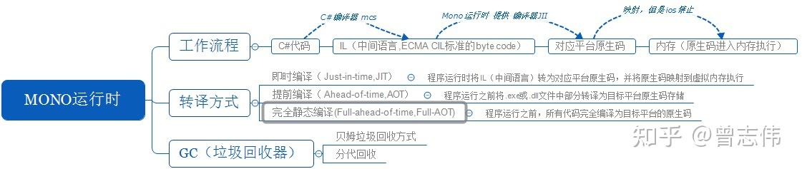

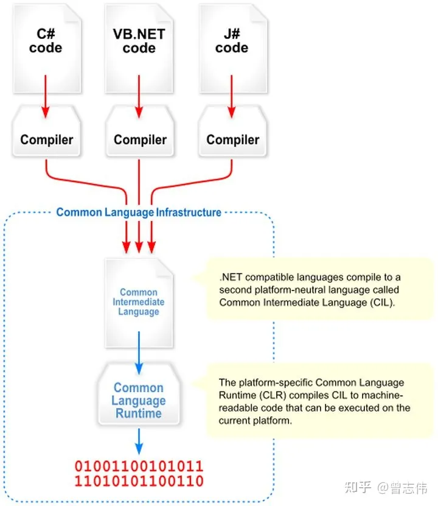 


**优点**

1. 构建应用非常快
2. 由于Mono的JIT(Just In Time compilation ) 机制, 所以支持更多托管类库
3. 支持运行时代码执行
4. 必须将代码发布成托管程序集(.dll 文件 , 由mono或者.net 生成 )
5. Mono VM在各个平台移植异常麻烦，有几个平台就得移植几个VM（WebGL和UWP这两个平台只支持 IL2CPP）
6. Mono版本授权受限，C#很多新特性无法使用
7. iOS仍然支持Mono , 但是不再允许Mono(32位)应用提交到Apple Store

**Unity 2018 mono版本仍然是mono2.0、unity2020的版本更新到了mono 5.11。**


### IL2CPP， IL2CPP VM

本文的主角终于出来了：IL2CPP。有了上面的知识，大家很容易就理解其意义了：**把IL中间语言转换成CPP文件。**


#### **IL2CPP【AOT编译】**

> IL2CPP分为两个独立的部分：
>
> 1. AOT（静态编译）编译器：把IL中间语言转换成CPP文件
> 2. 运行时库：例如**垃圾回收、线程/文件获取（独立于平台，与平台无关）、内部调用直接修改托管数据结构的原生代码**的服务与抽象


#### **AOT编译器**

> IL2CPP AOT编译器名为il2cpp.exe。
> 在Windows上，您可以在`Editor \ Data \ il2cpp`目录中找到它。
> 在OSX上，它位于Unity安装的`Contents / Frameworks / il2cpp / build`目录中
> il2cpp.exe 是由C#编写的受托管的可执行程序，它接受我们在Unity中通过Mono编译器生成的托管程序集，并生成指定平台下的C++代码。


#### **IL2CPP工具链：**

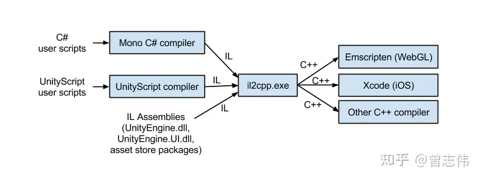 


#### **运行时库，IL2CPP VM**

> IL2CPP技术的另一部分是运行时库（libil2cpp），用于支持IL2CPP虚拟机的运行。
> 这个简单且可移植的运行时库是IL2CPP技术的主要优势之一！
> 通过查看我们随Unity一起提供的libil2cpp的头文件，您可以找到有关libil2cpp代码组织方式的一些线索
> 您可以在Windows的`Editor \ Data \ PlaybackEngines \ webglsupport \ BuildTools \ Libraries \ libil2cpp \ include`目录中找到它们
> 或OSX上的`Contents / Frameworks / il2cpp / libil2cpp`目录。

说是虚拟机，还不如说是一个库，用于提供服务。

服务：gc、Thread

运行时：unity = IL2CPP 技术编译出来的二进制指令 + IL2CPP runtime的环境(GC,Thread等)


#### 转换cpp的原因

大家如果看明白了上面动态语言的 CLI(Common Language Infrastructure)， IL以及VM，再看到IL2CPP一定心中充满了疑惑。现在的大趋势都是把语言加上动态特性，哪怕是c++这样的静态语言，也出现了适合IL的c++编译器，为啥Unity要反其道而行之，把IL再弄回静态的CPP呢？这不是吃饱了撑着嘛。

根据本文最前面给出的Unity官方博客所解释的，原因有以下几 个：

1. 运行效率快

> 根据官方的实验数据，换成IL2CPP以后，程序的运行效率有了1.5-2.0倍的提升。

2. Mono VM在各个平台移植，维护非常耗时，有时甚至不可能完成

> Mono的跨平台是通过Mono VM实现的，有几个平台，就要实现几个VM，像Unity这样支持多平台的引擎，Mono官方的VM肯定是不能满足需求的。所以针对不同的新平台，Unity的项目组就要把VM给移植一遍，同时解决VM里面发现的bug。这非常耗时耗力。这些能移植的平台还好说，还有比如WebGL这样基于浏览器的平台。要让WebGL支持Mono的VM几乎是不可能的。

3. 可以利用**现成的在各个平台的C++编译器**对代码执行**编译期优化**，这样可以进一步**减小最终游戏的尺寸并提高游戏运行速度**。

4. 由于动态语言的特性，他们多半无需程序员太多关心内存管理，所有的内存分配和回收都由一个叫做GC（Garbage Collector）的组件完成。虽然通过IL2CPP以后代码变成了静态的C++，但是内存管理这块还是遵循C#的方式，这也是为什么最后还要有一个 **IL2CPP VM**的原因：**它负责提供诸如GC管理，线程创建这类的服务性工作。**但是由于去除了**IL加载和动态解析**的工作，**使得IL2CPP VM可以做的很小**，**并且使得游戏载入时间缩短**。

5. Mono版本授权受限

   大家有没有意识到Mono的版本已经更新到3.X了，但是在Unity中，C#的运行时版本一直停留在2.8，这也是Unity社区开发者抱怨的最多一 条：很多C#的新特性无法使用。这是因为Mono 授权受限，导致Unity无法升级Mono。如果换做是IL2CPP，IL2CPP VM这套完全自己开发的组件，就解决了这个问题。


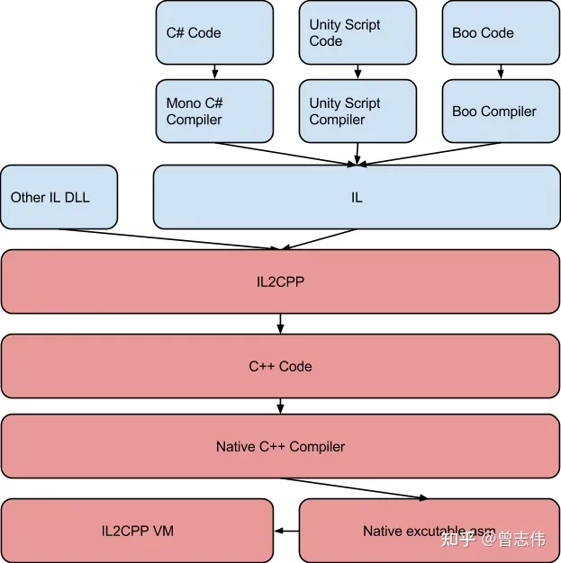 


### Mono与IL2CPP的区别

IL2CPP比较适合开发和发布项目 ，但是为了提高版本迭代速度，可以在开发期间切换到Mono模式（构建应用快）。


**mono和IL2CPP**编译区别

使用Mono的时候，脚本的编译运行如下图所示：

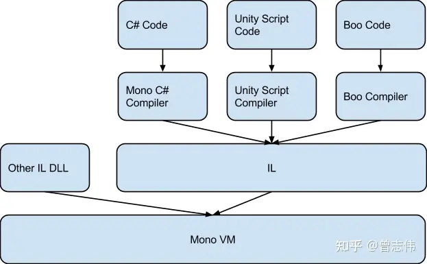 

3大脚本被编译成IL，在游戏运行的时候，IL和项目里其他第三方兼容的DLL一起，放入Mono VM虚拟机，由虚拟机解析成机器码。

并且执行IL2CPP做的改变由下图红色部分标明：

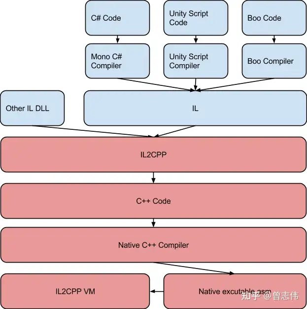 

在得到中间语言IL后，使用IL2CPP将他们重新变回C++代码，然后**再由各个平台的C++编译器直接编译成能执行的原生汇编代码。**


**优点**

1. 相比Mono, 代码生成有很大的提高
2. 可以调试生成的C++代码
3. 可以启用引擎代码剥离(Engine code stripping)来减少代码的大小
4. 程序的运行效率比Mono高，运行速度快
5. 多平台移植非常方便
6. 相比Mono构建应用慢
7. 只支持AOT(Ahead of Time)编译


### 参考文献

[Unity - 深度理解C# 的执行原理及Unity跨平台 - 笔记 - 天山鸟 - 博客园 (cnblogs.com)](https://www.cnblogs.com/Jaysonhome/p/13218403.html)

[【Unity游戏开发】Mono和IL2CPP的区别 - 知乎 (zhihu.com)](https://zhuanlan.zhihu.com/p/352463394)


## struct和class区别？

在许多编程语言中，包括C#，`struct` 和 `class` 都是用于定义自定义数据类型的关键字，但它们有一些重要的区别：

1. **内存分配**：
   - `class` 是引用类型，它的实例在堆上分配内存。当你创建一个类的实例时，实际上创建的是一个引用（或者说指向实例的引用），而这个实例存储在堆上的一个内存块中。多个引用可以指向同一个实例。
   - `struct` 是值类型，它的实例在栈上分配内存。当你创建一个结构体的实例时，实际上创建的是该结构体的一个完整副本，它直接存储在栈上。因此，每个结构体实例是独立的，修改一个实例不会影响其他实例。

2. **继承**：
   - `class` 支持继承，一个类可以派生自另一个类，从而可以通过继承实现代码重用和抽象。
   - `struct` 不支持继承，它们不能作为其他结构体或类的基类。它们通常用于定义简单的数据类型，而不是用于建模具有复杂行为和层次结构的对象。

3. **默认访问修饰符**：
   - 类中的字段和方法默认为私有访问修饰符（`private`），而结构体中的字段和方法默认为公共访问修饰符（`public`）。这是因为结构体通常用于存储数据，而类则用于封装数据和行为。

4. **性能**：
   - 由于结构体是值类型，它们通常比类更高效。因为结构体存储在栈上，而且在内存布局上更加紧凑，因此在某些情况下，使用结构体可以减少内存占用和提高性能。
   - 但在某些情况下，如果结构体较大，频繁地进行复制和传递结构体的副本可能会导致性能下降。在这种情况下，使用类可能更合适。

结构体和类都有各自的适用场景，通常情况下，你应该根据具体情况来选择使用哪种类型。如果你需要表示一个复杂的对象，并且需要继承、多态等面向对象的特性，那么使用类会更合适。如果你只是需要存储一些简单的数据，并且不需要进行继承，那么使用结构体可能更合适。


- 


## unity 协程(Coroutine)

### 前言

[协程](https://so.csdn.net/so/search?q=协程&spm=1001.2101.3001.7020)在`Unity`中是一个很重要的概念，我们知道，在使用`Unity`进行游戏开发时，一般（注意是一般）不考虑[多线程](https://so.csdn.net/so/search?q=多线程&spm=1001.2101.3001.7020)，那么如何处理一些在主任务之外的需求呢，`Unity`给我们提供了协程这种方式


**为啥在Unity中一般不考虑多线程**

- 因为在`Unity`中，只能在主线程中获取物体的组件、方法、对象，如果脱离这些，`Unity`的很多功能无法实现，那么多线程的存在与否意义就不大了


**既然这样，线程与协程有什么区别呢：**

- 对于协程而言，同一时间只能执行一个协程，而线程则是并发的，可以同时有多个线程在运行
- 两者在内存的使用上是相同的，共享堆，不共享栈

其实对于两者最关键，最简单的区别是微观上线程是并行（对于多核CPU）的，而协程是串行的，如果你不理解没有关系，通过下面的解释你就明白了


### 关于协程

### 1，什么是协程

协程，从字面意义上理解就是协助程序的意思，我们在主任务进行的同时，需要一些分支任务配合工作来达到最终的效果

稍微形象的解释一下，想象一下，在进行主任务的过程中我们需要一个对资源消耗极大的操作时候，如果在一帧中实现这样的操作，游戏就会变得十分卡顿，这个时候，我们就可以通过协程，在一定帧内完成该工作的处理，同时不影响主任务的进行

### 2，协程的原理

首先需要了解协程不是线程，协程依旧是在主线程中进行

**然后要知道协程是通过迭代器来实现功能的**，通过关键字`IEnumerator`来定义一个迭代方法，

注意使用的是`IEnumerator`，而不是`IEnumerable`：

两者之间的区别：

- `IEnumerator`：是一个实现迭代器功能的接口
- `IEnumerable`：是在`IEnumerator`基础上的一个封装接口，有一个`GetEnumerator()`方法返回`IEnumerator`

在迭代器中呢，最关键的是`yield` 的使用，这是实现我们协程功能的主要途径，通过该关键方法，可以使得协程的运行暂停、记录下一次启动的时间与位置等等：

由于`yield` 在协程中的特殊性，与关键性，我们到后面在单独解释，先介绍一下协程如何通过代码实现

### 3、协程的使用

首先通过一个迭代器定义一个返回值为`IEnumerator`的方法，然后再程序中通过`StartCoroutine`来开启一个协程即可：

在正式开始代码之前，需要了解StartCoroutine的两种重载方式：

- StartCoroutine（string methodName）：这种是没有参数的情况，直接通过方法名（字符串形式）来开启协程

- StartCoroutine（IEnumerator routine）：通过方法形式调用
- StartCoroutine（string methodName，object values):带参数的通过方法名进行调用

协程开启的方式主要是上面的三种形式

```
 	//通过迭代器定义一个方法
 	IEnumerator Demo(int i)
    {
        //代码块

        yield return 0; 
		//代码块
       
    }

    //在程序种调用协程
    public void Test()
    {
        //第一种与第二种调用方式,通过方法名与参数调用
        StartCoroutine("Demo", 1);

        //第三种调用方式， 通过调用方法直接调用
        StartCoroutine(Demo(1));
    }

```

在一个协程开始后，同样会对应一个结束协程的方法`StopCoroutine`与`StopAllCoroutines`两种方式，但是需要注意的是，两者的使用需要遵循一定的规则，在介绍规则之前，同样介绍一下关于`StopCoroutine`重载：

- `StopCoroutine（string methodName）`：通过方法名（字符串）来进行
- `StopCoroutine（IEnumerator routine）`:通过方法形式来调用
- `StopCoroutine(Coroutine routine)`：通过指定的协程来关闭

刚刚我们说到他们的使用是有一定的规则的，那么规则是什么呢，答案是前两种结束协程方法的使用上，如果我们是使用StartCoroutine（string methodName）来开启一个协程的，那么结束协程就只能使用StopCoroutine（string methodName）和StopCoroutine(Coroutine routine)来结束协程，可以在文档中找到这句话：
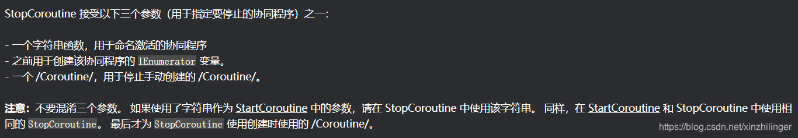

### 4、关于yield

在上面，我们已经知道`yield` 的关键性，要想理解协程，就要理解`yield`

如果你了解`Unity`的脚本的生命周期，你一定对`yield`这几个关键词很熟悉，没错，`yield` 也是脚本生命周期的一些执行方法，不同的`yield` 的方法处于生命周期的不同位置，可以通过下图查看：

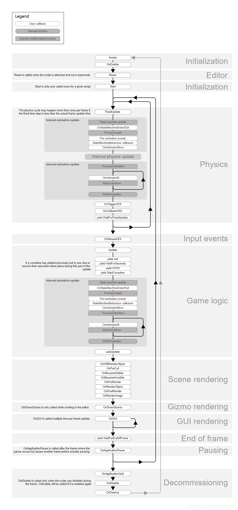

通过这张图可以看出大部分`yield`位置`Update`与`LateUpdate`之间，而一些特殊的则分布在其他位置，这些`yield` 代表什么意思呢，又为啥位于这个位置呢

首先解释一下位于Update与LateUpdate之间这些yield 的含义：

yield return null; 暂停协程等待下一帧继续执行

yield return 0或其他数字; 暂停协程等待下一帧继续执行

yield return new WairForSeconds(时间); 等待规定时间后继续执行

yield return StartCoroutine("协程方法名");开启一个协程（嵌套协程)


在了解这些yield的方法后，可以通过下面的代码来理解其执行顺序：

```
 void Update()
    {
        Debug.Log("001");
        StartCoroutine("Demo");
        Debug.Log("003");

    }
    private void LateUpdate()
    {
        Debug.Log("005");
    }

    IEnumerator Demo()
    {
        Debug.Log("002");

        yield return 0;
        Debug.Log("004");
    }

```

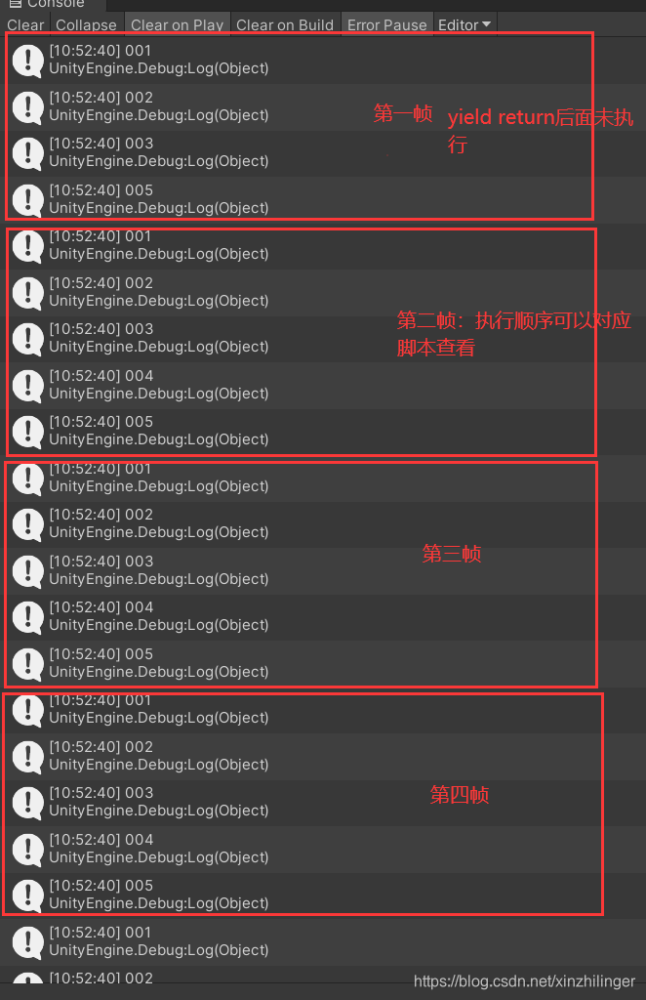


可以很清晰的看出，协程虽然是在`Update`中开启，但是关于`yield return null`后面的代码会在下一帧运行，并且是在Update执行完之后才开始执行，但是会在`LateUpdate`之前执行

接下来看几个特殊的yield，他们是用在一些特殊的区域，一般不会有机会去使用，但是对于某些特殊情况的应对会很方便

yield return GameObject; 当游戏对象被获取到之后执行
yield return new WaitForFixedUpdate()：等到下一个固定帧数更新
yield return new WaitForEndOfFrame():等到所有相机画面被渲染完毕后更新
yield break; 跳出协程对应方法，其后面的代码不会被执行

通过上面的一些`yield`一些用法以及其在脚本生命周期中的位置，我们也可以看到关于协程不是线程的概念的具体的解释，所有的这些方法都是在主线程中进行的，只是有别于我们正常使用的`Update`与`LateUpdate`这些可视的方法

### 5、协程几个小用法

#### **5.1、将一个复杂程序分帧执行：**

如果一个复杂的函数对于一帧的性能需求很大，我们就可以通过`yield return null`将步骤拆除，从而将性能压力分摊开来，最终获取一个流畅的过程，这就是一个简单的应用

举一个案例，如果某一时刻需要使用`Update`读取一个列表，这样一般需要一个循环去遍历列表，这样每帧的代码执行量就比较大，就可以将这样的执行放置到协程中来处理：

```
public class Test : MonoBehaviour
{
    public List<int> nums = new List<int> { 1, 2, 3, 4, 5, 6 };


    private void Update()
    {
        if(Input.GetKeyDown(KeyCode.Space))
        {
            StartCoroutine(PrintNum(nums));
        }
    }
	//通过协程分帧处理
    IEnumerator PrintNum(List<int> nums)
    {
        foreach(int i in nums)
        {
            Debug.Log(i);
            yield return null;
                 
        }

    }
}

```

上面只是列举了一个小小的案例，在实际工作中会有一些很消耗性能的操作的时候，就可以通过这样的方式来进行性能消耗的分消

#### **5.2、进行计时器工作**

当然这种应用场景很少，如果我们需要计时器有很多其他更好用的方式，但是你可以了解是存在这样的操作的，要实现这样的效果，需要通过`yield return new WaitForSeconds()`的延时执行的功能：

```
	IEnumerator Test()
    {
        Debug.Log("开始");
        yield return new WaitForSeconds(3);
        Debug.Log("输出开始后三秒后执行我");
    }
```


#### **5.3、异步加载等功能**

只要一说到异步，就必定离不开协程，因为在异步加载过程中可能会影响到其他任务的进程，这个时候就需要通过协程将这些可能被影响的任务剥离出来

常见的异步操作有：

- `AB`包资源的异步加载
- `Reaources`资源的异步加载
- 场景的异步加载
- `WWW`模块的异步请求

这些异步操作的实现都需要协程的支持


这里以场景加载为例子：


### 参考文献

[Unity 协程(Coroutine)原理与用法详解_unity coroutine-CSDN博客](https://blog.csdn.net/xinzhilinger/article/details/116240688)

[迭代器 - C# | Microsoft Learn](https://learn.microsoft.com/zh-cn/dotnet/csharp/iterators)

[Unity 场景异步加载（加载界面的实现）_unity异步加载场景-CSDN博客](


## yield

### 概要

在 Unity 中，协程允许你编写在多帧之间暂停的代码，常用于等待某个条件达成（如等待几秒钟或等待异步操作完成）再继续执行。


**示例：在协程中使用 `yield`**

```
using UnityEngine;
using System.Collections;

public class Example : MonoBehaviour
{
    void Start()
    {
        StartCoroutine(MyCoroutine());
    }

    IEnumerator MyCoroutine()
    {
        Debug.Log("协程开始");
        
        // 等待 2 秒钟
        yield return new WaitForSeconds(2f);
        
        Debug.Log("2 秒钟后继续执行");
        
        // 等待下一帧
        yield return null;
        
        Debug.Log("下一帧继续执行");
    }
}

```


### **常见的 `yield return` 表达式**

- `yield return new WaitForSeconds(seconds);`
  暂停协程一段时间（`seconds` 秒）。
- `yield return null;`
  暂停协程直到下一帧。
- `yield return new WaitForEndOfFrame();`
  暂停协程，直到当前帧结束。
- `yield return new WaitForFixedUpdate();`
  暂停协程，直到下一次物理帧（FixedUpdate）。
- `yield return StartCoroutine(AnotherCoroutine());`
  等待另一个协程完成。


### **yield break**

在迭代器或协程中，可以使用 `yield break` 来提前终止迭代或协程。

**示例：使用 `yield break`**

```
IEnumerator MyCoroutine()
{
    Debug.Log("协程开始");
    
    if (someCondition)
    {
        yield break; // 提前终止协程
    }

    yield return new WaitForSeconds(2f);
    
    Debug.Log("这行代码不会执行，如果之前调用了 yield break");
}

```


###  **`yield return` 异步方法**


在 Unity 的协程中，如果你使用 `yield return` 来等待一个异步方法（例如返回 `Task` 的方法），实际情况取决于你如何实现和处理这个异步方法。Unity 的协程系统不原生支持 `Task` 类型，因此直接使用 `yield return` 来等待 `Task` 不会如预期那样正常工作。

**具体行为**

如果你直接 `yield return` 一个异步方法返回的 `Task`，Unity 的协程系统不会自动等待它完成。这是因为 Unity 的协程系统预期 `yield return` 的类型是 Unity 能理解的类型，如 `WaitForSeconds`、`WaitForEndOfFrame`、`IEnumerator`，而不是 `Task`。


**示例：**

假设你有以下异步方法：

```csharp
async Task LoadDataAsync()
{
    await Task.Delay(2000); // 模拟一个耗时操作
    Debug.Log("数据加载完成！");
}
```

如果你在协程中这样使用它：

```csharp
IEnumerator MyCoroutine()
{
    Debug.Log("协程开始");

    yield return LoadDataAsync(); // 直接使用 Task 是无效的

    Debug.Log("这行代码会立即执行，不会等待 LoadDataAsync 完成");
}
```


**发生的事情：**

- **立即继续执行**: 协程中的代码会在 `yield return LoadDataAsync();` 之后立即继续执行，而不会等待 `LoadDataAsync` 完成。
- **无法等待**: 由于 `Task` 不是 Unity 协程系统支持的等待类型，因此协程不会自动等待异步操作完成。


**正确处理方式**

要在协程中等待 `Task` 完成，你需要使用一个包装器，将 `Task` 转换为 Unity 协程可以理解的格式。例如，你可以使用一个 `IEnumerator` 方法来轮询 `Task` 的状态：

```csharp
IEnumerator MyCoroutine()
{
    Debug.Log("协程开始");

    // 使用帮助方法等待 Task 完成
    yield return WaitForTask(LoadDataAsync());

    Debug.Log("数据加载完成，继续执行协程");
}

IEnumerator WaitForTask(Task task)
{
    while (!task.IsCompleted)
    {
        yield return null; // 等待下一帧
    }

    if (task.IsFaulted)
    {
        throw task.Exception ?? new Exception("Task Faulted");
    }
}
```

在这个例子中，`WaitForTask` 是一个协程，它会不断检查 `Task` 是否完成。如果 `Task` 失败了，它会抛出异常。

**总结**

- **直接 `yield return` `Task`**: 在 Unity 协程中直接使用 `Task` 作为 `yield return` 的值不会如预期般等待 `Task` 完成。
- **解决方案**: 使用一个 `IEnumerator` 包装器来等待 `Task` 完成，使协程能够有效地等待异步操作完成。


### 协程调用的控制流

对的，当一个协程调用另一个协程时，控制流会转移到被调用的协程。这个过程的工作方式如下：

1. **调用另一个协程**:
   - 当一个协程调用另一个协程时（通过 `yield return`），调用者协程的执行会暂停，直到被调用的协程完成。

2. **控制流转移**:
   - 调用者协程暂停后，控制流会转移到被调用的协程中。被调用的协程开始执行，并在其内部的 `yield return` 或其他等待条件满足之前，继续进行。

3. **等待和恢复**:
   - 如果被调用的协程中有 `yield return` 语句（例如 `yield return null`、`yield return new WaitForSeconds(seconds)`、`yield return someAsyncOperation`），它会让控制流在满足条件之前暂停，直到满足条件后，协程才会继续执行。

4. **恢复调用者协程**:
   - 一旦被调用的协程完成（即它的执行完毕或者 `yield return` 条件被满足），控制流会返回到调用者协程，并从 `yield return` 语句后的位置继续执行。

**示例**

```csharp
IEnumerator CallerCoroutine()
{
    Debug.Log("调用者协程开始");

    // 调用另一个协程并等待它完成
    yield return CalledCoroutine();

    Debug.Log("调用者协程继续执行，CalledCoroutine 已经完成");
}

IEnumerator CalledCoroutine()
{
    Debug.Log("被调用的协程开始");

    // 等待 2 秒钟
    yield return new WaitForSeconds(2f);

    Debug.Log("被调用的协程完成");
}
```

在这个例子中：

1. **`CallerCoroutine`** 启动并调用 **`CalledCoroutine`**。
2. **`CallerCoroutine`** 的执行会暂停在 `yield return CalledCoroutine();`，等待 **`CalledCoroutine`** 完成。
3. **`CalledCoroutine`** 开始执行，并在 `yield return new WaitForSeconds(2f);` 处暂停 2 秒钟。
4. 2 秒钟后，**`CalledCoroutine`** 继续执行并完成。
5. 控制流返回到 **`CallerCoroutine`**，从 `yield return CalledCoroutine();` 之后的位置继续执行。

**总结**

- **调用者协程** 在调用另一个协程时会暂停，直到被调用的协程完成。
- **被调用的协程** 在内部的 `yield return` 语句处会控制暂停，直到满足条件或完成。
- 一旦被调用的协程完成，控制流会返回到调用者协程，并继续执行后续代码。

这种协程嵌套的机制使得 Unity 的协程系统能够处理复杂的异步操作和等待逻辑，同时保持代码的简洁性和可读性。

## UniTask

[Cysharp/UniTask: Provides an efficient allocation free async/await integration for Unity.](https://github.com/Cysharp/UniTask)

用于解决异步操作

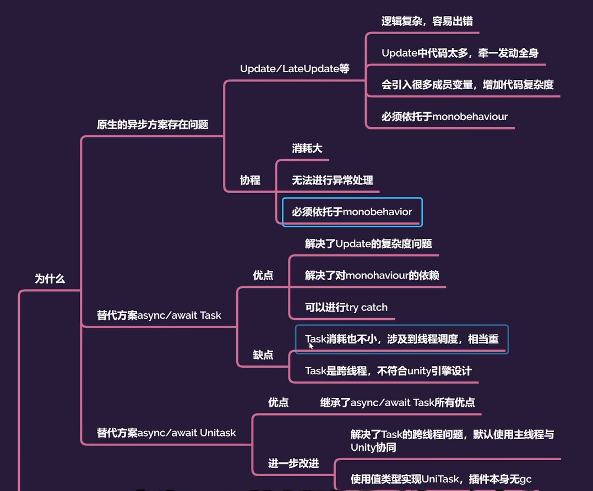 

async/await也是运行在主线程中的


# unity中的目录结果和特殊文件

## unity工程文件夹里的目录结构


### 1、特殊文件夹


Unity工程[根目录](https://so.csdn.net/so/search?q=根目录&spm=1001.2101.3001.7020)下，有三个特殊文件夹：Assets、Library、ProjectSettings


#### Assets

Unity工程中所用到的所有Asset都放在该文件夹中，是资源文件的根目录，很多[API](https://so.csdn.net/so/search?q=API&spm=1001.2101.3001.7020)都是基于这个文件目录的，查找目录都需要带上Assets，比如AssetDatabase。


#### Library

Unity会把Asset下支持的资源导入成自身识别的格式，以及编译代码成为DLL文件，都放在Library文件夹中。


#### ProjectSettings

编辑器中设置的各种参数

下面都是存在Assets目录下的文件的了。


#### Editor

为Unity编辑器扩展程序的目录，可以在根目录下，也可以在子目录下，只要名字叫“Editor”，而且数量不限。Editor下面放的所有资源文件和脚本文件都不会被打进包中，而且脚本只能在编辑器模式下使用。一般会把扩展的编辑器放在这里，或只是编辑器程序用到的dll库，比如任务编辑器、角色编辑器、技能编辑器、战斗编辑器……以及各种小工具。


#### Editor Default Resources

名字带空格，必须在Assets目录下，里面放编辑器程序用到的一些资源，比如图片，文本文件等。不会被打进包内，可以直接通过EditorGUIUtility.Load去读取该文件夹下的资源。


#### Gizmos

Gizmos.DrawIcon在场景中某个位置绘制一张图片，该图片必须是在Gizmos文件夹下。

```
void OnDrawGizmos() {
    Gizmos.DrawIcon(transform.position, “0.png”, true);
}
```

OnDrawGizmos是MonoBehaviour的生命周期函数，但是只在编辑器模式下每一帧都会执行。Gizmos类能完成多种在场景视图中绘制需求，做编辑器或调试的时候经常会用到，比如在场景视图中绘制一条辅助线。（用Debug.DrawLine，Debug.DrawRay也可以绘制简单的东西）


#### Plugins

该文件夹一般会放置几种文件，第三方包、工具代码、sdk。
plugin分为两种：Managed plugins and Native plugins
Managed plugins：就是.NET编写的工具，运行于.NET平台（包括mono）的代码库，可以是脚本文件，也可以本身是DLL。NGUI源码就放在该文件夹下面的。
Native plugins：原生代码编写的库，比如第三方sdk，一般是dll、so、jar等等。
该文件夹下的东西会在standard compiler时编译（最先编译），以保证在其它地方使用时能找到。


#### Resources

存放资源的特殊文件夹，可以在根目录下，也可以在子目录下，只要名字叫“Resources”就行，比如目录：/xxx/xxx/Resources 和 /Resources 是一样的，而且可有多个叫Resources的文件夹。Resources文件夹下的资源不管用还是不用都会被打包进.apk或者.ipa，因为Unity无法判断脚本有没有访问了其中的资源。需要注意的是项目中可以有多个Resources文件夹，所以如果不同目录的Resources存在同名资源，在打包的时候就会报错。
Resources中全部资源会被打包成一个缺省的AssetBundle（resources.assets）。
在该文件夹下的资源，可以通过Resources类进行加载使用。API地址


#### Standard Assets

存放导入的第三方资源包。


#### StreamingAssets

该文件夹也会在打包的时候全部打进包中，但它是“原封不动”的打包进去（直接拷贝到的包里）。**游戏运行时只能读不能写。**
不同的平台最后的路径也不同，可以使用unity提供的Application.streamingAssetsPath，它会根据平台返回正确的路径，如下：

```
Mac OS or Windows：path = Application.dataPath + “/StreamingAssets”;
IOS：path = Application.dataPath + “/Raw”;
Android：path = “jar:file://” + Application.dataPath + “!/assets/”;
```

我们一般会把初始的AssetBundle资源放在该文件夹下，并且通过WWW或AssetBundle.LoadFromFile加载使用。


#### Hide Assets

隐藏文件夹和文件
以".“开头
以”~“结尾
名字为"cvs”
扩展名为".tmp"


### 2.一些通常的Asset类型


#### Image：

支持绝大多数的image type，例如BMP、JPG、TIF、TGA、PSD

#### Model：

eg、.max、.blend、.mb、.ma，它们将通过FBX插件导入。或者直接在3D app导出FBX放到unity project中
Mesh and Animations：unity支持绝大多数流行的3D app的model（Maya、Cinema 4D、3ds Max、Cheetah3D、Modo、Lightwave、Blender、SketchUp）

#### Audio Files：

如果是非压缩的audio，unity将会根据import setting压缩导入（更多）


#### Other：

##### Asset Store

里面有很多免费和收费的插件，可以供开发者下载使用。
下载的第三方工具是以package文件存在，导入package：
package.png

##### 导入

unity会自动导入Asset目录下的资源，可以是unity支持的，也可以是不支持的，而在程序中用到的（比如二进制文件）。
当在Asset下进行保存、移动、删除等修改文件的操作，unity都会自动导入。

##### 自定义导入

导入外界的unity可识别的Asset时，可以自定义导入设置，在工程中点击资源文件，然后Inspector视图中就会看到相应的设置：

##### 导入结果

导入资源之后，除了要生成.meta文件，unity并不是直接使用这些资源的，而是在导入的过程中，生成了unity内部特定的格式（unity可识别）文件在游戏中使用，储存在Library目录下，而原始资源不变，仍然放在原来位置。当然，每次修改原始文件，unity都会重新导入一次，才能在unity中看到改过之后的样子。
正因为Library存放了导入资源的结果，所以每次删除Library或里面某个文件，都会让unity重新导入相应的资源（生成内部格式），但对工程没有影响。

##### .meta文件

Asset中的所有文件、文件夹，经过unity的导入过程后，会为每个都生成一个.meta文件，这个文件是unity内部管理文件的重要内容，里面记录着一些信息。
你知道unity是怎么管理资源依赖关系的吗？可以试着更改一个挂在prefab上的脚本的目录或者名字，而这些prefab依然可以正常的调用那些脚本。
unity在第一次导入新文件的时候，会生成一个Unique ID，用来标志这个asset，它就是unity内部用来区分asset的。Unique ID是全局唯一的，保存在.meta文件中。
在unity中资源间的依赖关系引用都是用Unique ID来实现的，如果一个资源丢失了.meta文件，那依赖它的资源就找不到它了。
.meta文件内容如下，包括Unique ID和Import Setting的内容
meta.png


### 3.脚本

unity支持三种脚本语言，分别是C#、JavaScript、Boo，最常用的是前两种，当然还有后来扩展的支持Lua脚本的库（slua、ulua）。
生成的对应的工程.png

#### 1.编译顺序

编译顺序的原则是在第一个引用之前编译它，参考官网文档可以知道，Unity中的可以将脚本代码放在Assets文件夹下任何位置，但是不同的位置会有不同的编译顺序。规则如下：
(1) 首先编译**Standard Assets，Pro Standard Assets，Plugins文件夹**（除Editor，可以是一级子目录或是更深的目录）下的脚本；
(2) 接着编译**Standard Assets，Pro Standard Assets，Plugins文件夹**下(可以是一级子目录或是更深的目录)的**Editor**目录下的脚本；
(3) 然后编译Assets文件夹下，不在Editor目录的所有脚本；
(4) 最后编译Editor下的脚本（不在Standard Assets，Pro Standard Assets，Plugins文件夹下的）；
基于以上编译顺序，一般来说，我们直接在Assets下建立一个Scripts文件夹放置脚本文件，它处于编译的“第三位”。

#### 2.编译结果：

项目工程文件夹中会生成类似如下几个文件， 按顺序分别对应着上述四个编译顺序：（GameTool是项目名称）
GameTool.CSharp.Plugins.csproj
GameTool.CSharp.Editor.Plugins.csproj
GameTool.CSharp.csproj
GameTool.CSharp.Editor.csproj
所有脚本被编译成几个DLL文件，位于工程根目录 / Library / ScriptAssemblies。
生成如下三个dll：
Assembly-CSharp-Editor.dll：包含所有Editor下的脚本
Assembly-CSharp-firstpass.dll：包含Standard Assets、Pro Standard Assets、Plugins文件夹下的脚本
Assembly-CSharp.dll：包含除以上两种，在Assets目录下的脚本。


#### Plugins（doc）

内容包括了Plugin导入设置、怎样创建使用两种Plugin、怎样利用底层渲染接口以及一些基础知识。
在打包的时候，会把plugin里面的各种库，拷贝到包体中相应的位置（不同平台不一样，具体在可以把工程分别打成几个平台的包）
win平台
这是win32平台的包，Managed里面放置的托管库，Mono里面放的是mono的库，Plugins是平台库（native plugin）

分平台打包，就需要对不同平台的plugin区分，方法是在Plugins目录下建立相应平台的文件夹，unity在为不同平台打包的时候，除了会将相应平台的plugin里的脚本编译成Assembly-CSharp-firstpass.dll，还会把已经是dll、so等库直接拷贝到包内相应位置。
Plugins/x86：win32位平台plugin
Plugins/x86_64：win64位平台plugin
Plugins/Android：Android平台
Plugins/iOS：iOS平台


#### Object

UnityEngine.Object是所有类的基类，它描述了Asset上使用的所有resource的序列化数据，它有几个重要的派生类：GameObject，Component，MonoBehaviour


#### GameObject

GameObject是组件的容器，所有Component都在可以挂在上面，Unity以组价化思想构建，所有功能拆分成各个组件，需要某个功能只需挂上相应的组件，组件之间相互独立，逻辑互补交叉。当然组件式开发也有最大的弊端就是组件之间的交互。


#### Component

Component作为组件的基类，unity中有大量的组件，Transform、Renderer、Collider、MeshFilter都是组件。


#### MonoBehaviour

开发时创建的脚本，需要挂在GameObject上的脚本都是继承自MonoBehaviour。


#### ScriptableObject

自定义可被Unity识别的资源类型，可打成AssetBundle，可通过Resources or AssetBundle加载。


#### 序列化

Asset和Object的关系
Object作为Asset的序列化数据，比如以Texture导入一张图片，那么就用Texture对象记录描述了该图片。
Asset可能有多个Object，比如prefab的GameObject上挂着多个组件，这样Asset和Object就是一对多的关系。那么问题来了，同一个Object怎么区分分别挂在不同GameObject上的对象的？等等，这里是一定要区分的，因为它们要包含序列化数据（在Inspector视图设置的），而不是在游戏运行中再new。


#### Class ID 和 File ID（object id）

先梳理一下关系，unity通过guid找到asset，其中asset上可能又挂了很多组件，每个组件又对应着一个class，而在序列化的时候是对象。Class ID是unity定义好的（传送），File ID是为对象生成的id，也就是说，我用guid + (class id 可有) + file id 就能确定某个资源上的组件对象。


#### YMAL

是一种标记语言，如果不了解语言格式可以看网站。


#### Text-Based Scene Files

和二进制文件一样，unity还提供了基于文本的场景文件，使用YAML标记语言，通过文本描述了asset和object组件之间的关系是怎么关联、保存数据等。
通过设置Edit -> Project Setting -> Editor -> Asset Serialization -> Force Text，我们可以查看所有Object信息了。


## unity pc打包后目录的结构

当你使用 Unity 将项目打包为 PC 平台的可执行文件时，Unity 会生成一个包含多个文件和文件夹的目录结构。这些文件和文件夹对于游戏的运行至关重要。以下是常见的目录结构及其说明：

1. **游戏名称.exe**：

   - 这是你游戏的可执行文件。双击此文件即可运行你的游戏。

2. **游戏名称_Data**

   这是游戏的资源文件夹。它包含了所有的游戏资源，如场景、脚本、图像、音频、材质和其他所有 Unity 打包的内容。

3. **游戏名称_Data**\Managed 文件夹：

   - 包含游戏使用的所有 .NET 程序集 (DLL)，其中包括 Unity 的标准库和你的 C# 脚本编译后的程序集

4. **游戏名称_Data\Plugins** 文件夹：

   - 存放原生插件（通常是 .dll 或 .so 文件），这些插件提供了特定平台的功能或是用来调用一些原生的系统库。

5. **游戏名称_Data\Resources** 文件夹：

   - 如果你在项目中有使用 `Resources` 文件夹，这里会包含所有通过 `Resources.Load` 加载的资源。此文件夹下的资源在游戏启动时会被加载。

6. **游戏名称_Data\StreamingAssets** 文件夹：

   - 这里包含你在 Unity 项目中的 `StreamingAssets` 文件夹中的所有文件。这些文件不会被 Unity 处理成特定格式，而是会以原始形式包含在内，通常用于需要在运行时直接读取的文件。

7. **MonoBleedingEdge** 文件夹：

   - 如果项目使用了 Unity 的 Mono 运行时，你可能会看到这个文件夹。它包含 Mono 虚拟机和一些基础的 .NET 库。

8. **UnityCrashHandler64.exe**：

   - 这是 Unity 内置的崩溃处理程序，当游戏崩溃时它会运行并生成崩溃日志。

9. **UnityPlayer.dll**：

   - 这是 Unity 游戏引擎的核心运行库，它包含了 Unity 运行时的主要功能。每个使用 Unity 构建的游戏都会有这个文件。

10. **baselib.dll**

   `baselib.dll` 是 Unity 引擎中的一个基础库动态链接库（DLL）文件，提供了许多底层的功能和服务，供 Unity 以及你的游戏在运行时使用。

   `baselib.dll` 的作用：

   - **底层服务**：`baselib.dll` 提供了一些底层的系统服务和抽象，帮助 Unity 引擎与操作系统进行交互。这可能包括内存管理、线程处理、文件操作、网络通信等基本功能。
   - **跨平台支持**：`baselib.dll` 是 Unity 为了简化跨平台开发而引入的一个库，它封装了不同平台的系统调用，使得开发者不必处理各个平台的差异性。

   不能删除 `baselib.dll` 的原因：

   - **游戏依赖性**：尽管 `baselib.dll` 的功能相对底层且不直接暴露给开发者使用，但它是 Unity 引擎正常运行不可缺少的一部分。删除它会导致游戏在运行时缺少关键的基础功能，从而无法正常工作。
   - **引擎集成**：Unity 引擎依赖于 `baselib.dll` 来执行许多低级别的操作，这些操作对游戏的稳定性和性能至关重要。

   总结

   `baselib.dll` 是 Unity 项目中必不可少的文件，在游戏发布时不能删除。它提供了关键的底层功能，确保游戏在目标平台上正常运行。与其他重要的 DLL 文件一样，`baselib.dll` 应该包含在你发布的游戏版本中。

11. **配置文件**（可选）：

   - 可能会有一个 `.cfg` 或 `.ini` 文件，用于存储与游戏启动相关的配置，如窗口大小、分辨率、音量等。


**其他注意事项：**

- 游戏打包出来的目录结构是 Unity 打包过程自动生成的，你通常不需要手动修改这些文件或文件夹，除非你对打包流程非常了解并且知道自己在做什么。
- 游戏的资源通常会被 Unity 序列化和打包成专有格式，你不能简单地在这些文件夹中直接编辑游戏内容。

**通过理解这个目录结构，你可以更好地管理和发布你的 Unity 游戏，确保所有必要的文件都包含在内以保证游戏的正常运行。**


**MMOGame_BackUpThisFolder_ButDontShipItWithYourGame**

`MMOGame_BackUpThisFolder_ButDontShipItWithYourGame` 文件夹是在 Unity 项目打包时自动生成的，它的作用是备份一些与项目打包和运行无关的文件。这些文件通常是用于调试或开发时的工具、缓存、日志等内容，因此在最终的游戏发布版本中不需要包含这些文件。

这个文件夹中的内容可能包括以下几类文件：

1. **调试信息**：如编译时的临时文件、日志文件、符号文件等，帮助开发者在开发和调试过程中追踪问题。

2. **缓存数据**：编译或打包过程中生成的一些临时数据，可能加快后续的编译过程。

3. **开发工具**：如编辑器扩展或调试工具生成的文件，这些文件不属于最终的游戏内容。

这个文件夹通常只在本地开发环境中有用，在将项目发布或分享给其他人时，可以忽略或删除它。正如文件夹的名字所提示的那样，它不应该包含在游戏的最终发布版本中。


**MMOGame_BurstDebugInformation_DoNotShip**

`MMOGame_BurstDebugInformation_DoNotShip` 文件夹是在使用 Unity 的 Burst 编译器时生成的，里面包含了 Burst 编译器用于调试的相关信息。

Burst 编译器是 Unity 提供的一个高性能编译器，专门用来优化性能关键的 C# 代码，特别是与 Unity 的 Jobs 系统结合使用时。`BurstDebugInformation` 文件夹中的内容主要包括以下内容：

1. **调试信息文件**：这些文件帮助开发者在使用 Burst 编译器时进行调试，例如查看在特定平台上如何优化代码的细节。

2. **符号文件**：这些文件包含与 Burst 编译的代码相关的符号信息，通常用于调试优化后的代码。

与 `BackUpThisFolder_ButDontShipItWithYourGame` 文件夹类似，`BurstDebugInformation_DoNotShip` 文件夹中的内容不应包含在最终发布的游戏版本中。它们仅供开发和调试时使用，因此可以在发布游戏时安全地忽略或删除。


**`.pdb` 文件**

在发布游戏的最终版本时，通常可以删除 `.pdb` 文件，因为它们主要用于调试，不是游戏运行所必需的。然而，是否应该删除所有 `.pdb` 文件，取决于你的具体需求：

**可以删除 `.pdb` 文件的情况：**

- **发布最终版本**：发布给用户的游戏版本通常不需要包含 `.pdb` 文件，因为这些文件包含调试符号，用于在开发和调试过程中帮助开发者理解崩溃报告或调试代码。
- **减少文件大小**：删除 `.pdb` 文件可以显著减小游戏安装包的大小。
- **保护代码隐私**：`.pdb` 文件中包含详细的代码信息，删除它们可以防止反向工程和代码泄露。

**不建议删除 `.pdb` 文件的情况：**

- **内部测试和调试**：如果你或你的测试团队仍在对游戏进行调试，那么保留 `.pdb` 文件可以帮助你快速定位问题。
- **崩溃报告分析**：有时在分析用户的崩溃报告时，`.pdb` 文件可以提供有用的信息。如果你打算在发布后继续支持游戏并修复错误，保留 `.pdb` 文件（至少是备份）可能是一个好主意。

**建议**

- **发布版本中删除**：在最终发布的游戏版本中，删除 `.pdb` 文件是一个常见的做法，以减少文件大小并保护代码。
- **备份 `.pdb` 文件**：即使从发布版本中删除，建议你在本地或版本控制系统中备份这些文件，以便将来需要时使用。

总结来说，除非你有特定的调试需求，通常可以在发布版本中删除所有 `.pdb` 文件。


## .meta文件

`.meta` 文件通常是由 Unity 引擎创建的，用于存储项目中文件的元数据。每个资产（如脚本、材质、场景、预制件等）都会有一个对应的 `.meta` 文件。

### `.meta` 文件的作用

1. **唯一标识符 (GUID)**：每个 `.meta` 文件中都包含一个唯一的 GUID (Globally Unique Identifier)，Unity 使用这个 GUID 来跟踪项目中的资源，即使资源被重命名或移动，Unity 依然能够通过 GUID 识别该资源。

2. **Import 设置**：对于一些特定类型的文件（如图片、模型等），`.meta` 文件中会存储一些导入设置（import settings），如压缩选项、分辨率等。

3. **文件依赖关系**：`.meta` 文件还可以存储文件之间的依赖关系，比如一个预制件依赖的材质文件，Unity 会在 `.meta` 文件中跟踪这些依赖关系。

4. **版本控制**：如果你使用版本控制系统（如 Git）管理 Unity 项目，`.meta` 文件是需要一并提交到版本库中的，以确保在不同开发环境中资源不会丢失或错乱。

### 示例

一个简单的 `.meta` 文件可能看起来如下：

```plaintext
fileFormatVersion: 2
guid: d73a8efc6c6e431eab0b4f23f111c776
TextureImporter:
  spritePivot: {x: 0.5, y: 0.5}
  spritePixelsPerUnit: 100
  mipmaps:
    enableMipMap: 0
```

在这个例子中，`.meta` 文件中包含了资源的 `guid` 和一些与纹理导入相关的设置。

### 注意事项

- 请勿手动编辑 `.meta` 文件，除非你完全了解它的结构和作用。
- 如果不小心删除了 `.meta` 文件，Unity 会重新生成，但这可能会导致引用错误或丢失资源关联。


## PlayerPrefs 

`PlayerPrefs` 在游戏打包后会根据平台不同，将数据存储在不同的位置。以下是常见平台的存储位置：

### 1. **Windows**
存储位置为注册表（Registry）：
- 路径: `HKEY_CURRENT_USER\Software\[CompanyName]\[ProductName]`
  

可以通过 Unity 的 `PlayerSettings` 来设置 `CompanyName` 和 `ProductName`，这两个字段会决定实际的存储路径。

### 2. **macOS**
存储位置为 `plist` 文件：
- 路径: `~/Library/Preferences/unity.[CompanyName].[ProductName].plist`

### 3. **Linux**
存储在 `prefs` 文件中：
- 路径: `~/.config/unity3d/[CompanyName]/[ProductName]/prefs`

### 4. **Android**
在 Android 平台上，`PlayerPrefs` 数据会存储在应用的内部存储中，通常在沙盒文件系统内：
- 路径: `/data/data/[package name]/shared_prefs/[package name].xml`

需要 `root` 权限才能访问该文件。

### 5. **iOS**
在 iOS 平台上，`PlayerPrefs` 数据会存储在 `NSUserDefaults` 中：
- 路径: `~/Library/Preferences/[bundle identifier].plist`

### 6. **WebGL**
对于 WebGL 构建，`PlayerPrefs` 使用浏览器的 `localStorage` 进行存储。


比如

在 Windows 平台上，`PlayerPrefs` 数据存储在注册表中。要查找它，可以按照以下步骤进行操作：

### 步骤 1: 打开注册表编辑器

1. 按下 `Win + R` 键，打开“运行”对话框。
2. 输入 `regedit`，然后按下 `Enter` 键。

### 步骤 2: 导航到 `PlayerPrefs` 存储位置

在注册表编辑器中，导航到以下路径：

```
plaintext


复制代码
HKEY_CURRENT_USER\Software\[CompanyName]\[ProductName]
```

- **`[CompanyName]`**: 这是你在 Unity 项目中设置的公司名称，对应于 `PlayerSettings` 中的 **Company Name**。
- **`[ProductName]`**: 这是你在 Unity 项目中设置的产品名称，对应于 `PlayerSettings` 中的 **Product Name**。

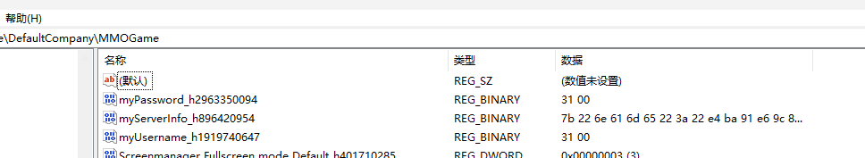 


# 项目杂谈


## 网络游戏服务器技术栈

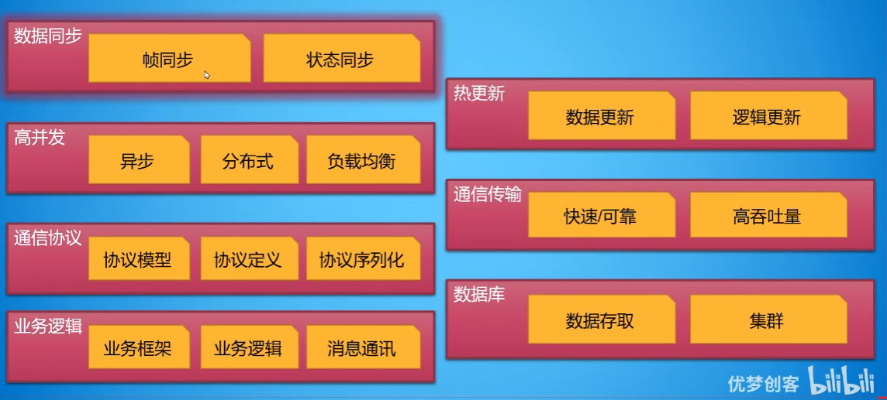


### 状态同步和帧同步

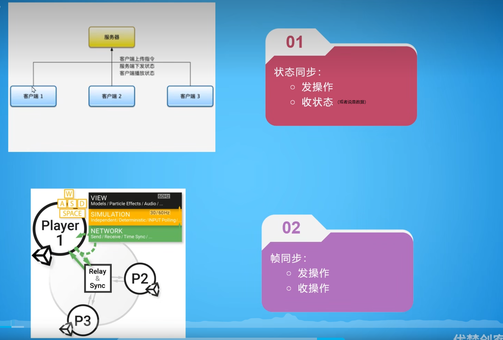


**状态同步：**

比如说你现在要向一个npc购买商品，此时客户端就会向服务端发送这个购买商品的操作（携带playerId，NpcId,ItemId）,然后服务器经过系列的逻辑操作，来给你返回状态数据（比如说你背包里面多了什么少了什么）。

优点：安全性比较好，因为逻辑操作都是在服务端上完成的，客户端没法作弊。

缺点：因为服务端返回的状态的数据可能会很大（同步的数据量比较大）


**帧同步：**

比如说：你在游戏中按下了'WASD'键位来控制角色的方向，我们客户端给服务端发送的就是这些操作指令‘wasd’，服务端不会对这些操作做任何的运算，他就把这些操作之间发给其他玩家了（以这种广播的形式）。

我们把这个网络数据收下来，然后我们要按照一定的频率去模拟收到的数据产生的操作。也就是说如果是一个前进，客户端它每一帧应该前进几个单位，前进到什么位置去。

优点：运算十分简洁，就好像做一个客户端工作一样，服务器并没有做很多其他的操作。


### 思考：如何控制100个游戏单位移动？


1.状态同步和帧同步分布要发送什么数据到服务器？

2.服务器要做什么运算？

3.服务器会给客户端发送什么数据包，该数据包多大？

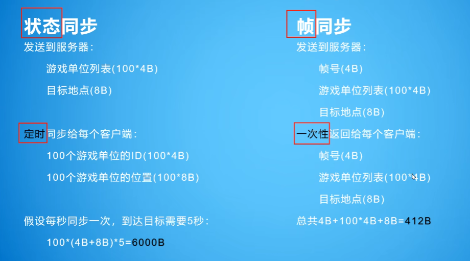


### 状态同步vs帧同步

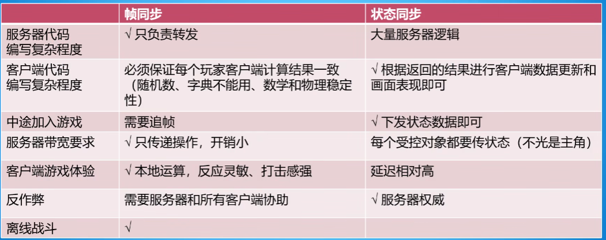


字典是无序的列表，所以不能用

 数学和物理都会涉及到一些浮点数，浮点数具有不稳定性和不精确性。所以我们不能使用传统uinity中实现的数学库，要自己去实现。  


**追帧：**需要在游戏开始的状态一直去做运算，算到游戏当前是什么状态。 

就比如说一个不能拉动进度条的视频，假如你看到30分钟的时候你中途退出了，再次进入你需要重新从第0秒开始看到30分钟才能恢复这个中途退出的状态。


### 采用不同同步方案的商业游戏

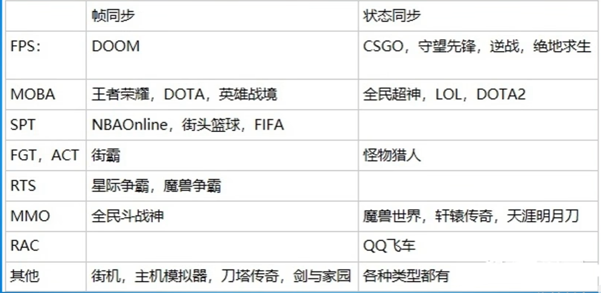


### 什么游戏使用帧同步？

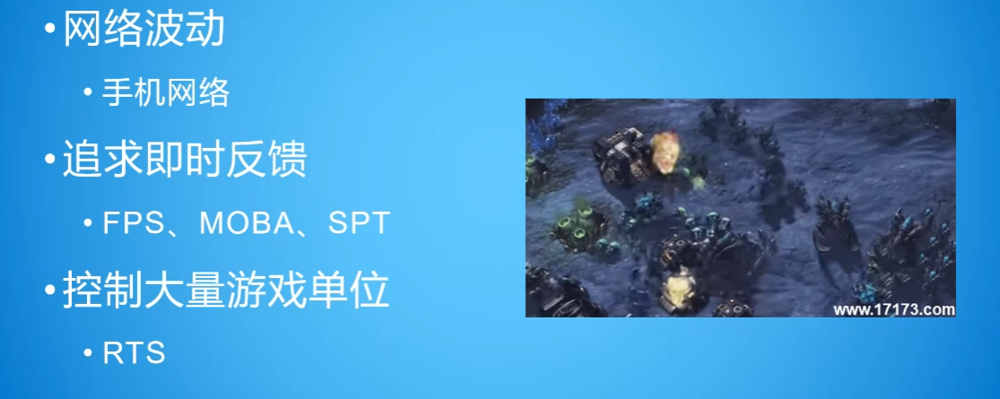


### 帧同步的原理和实现


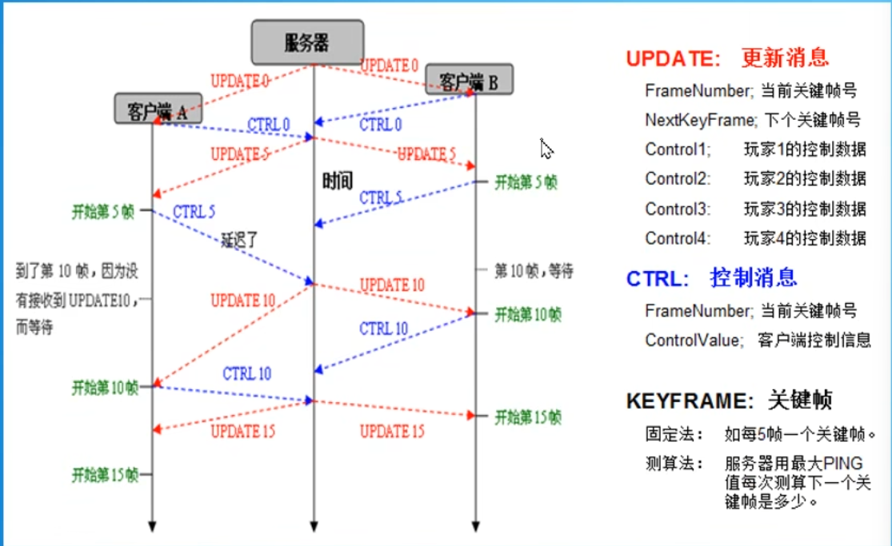


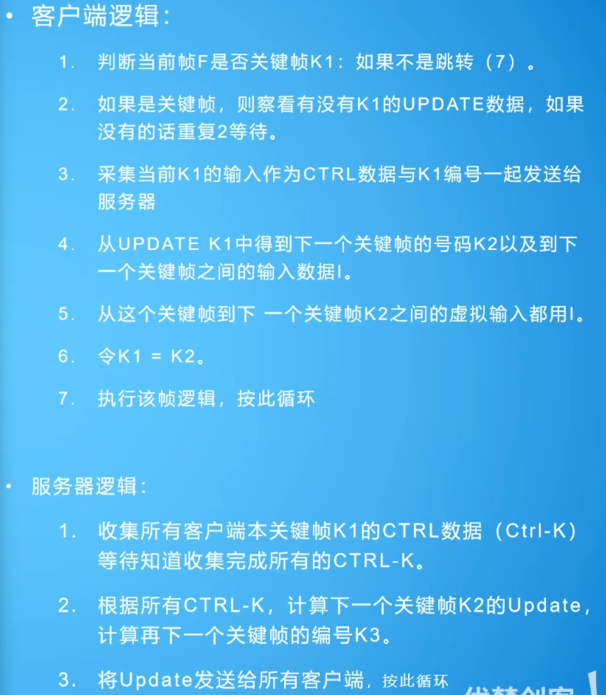


### 一套完整的帧同步游戏框架要实现什么？


#### 1.可靠UDP

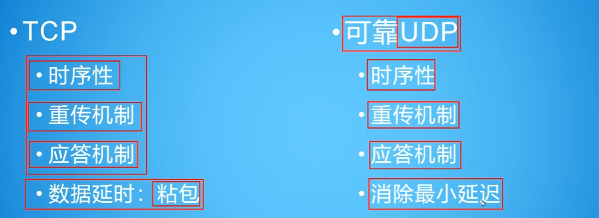


#### 2.确定性的数学和物理运算库


解决方法


#### 3.断线重连


#### 4.比赛回放  

服务器记录关键帧

下放客户端进行回放


#### 5.反作弊

重演

仲裁


#### 6.避免等待


### 王室战争中的帧同步

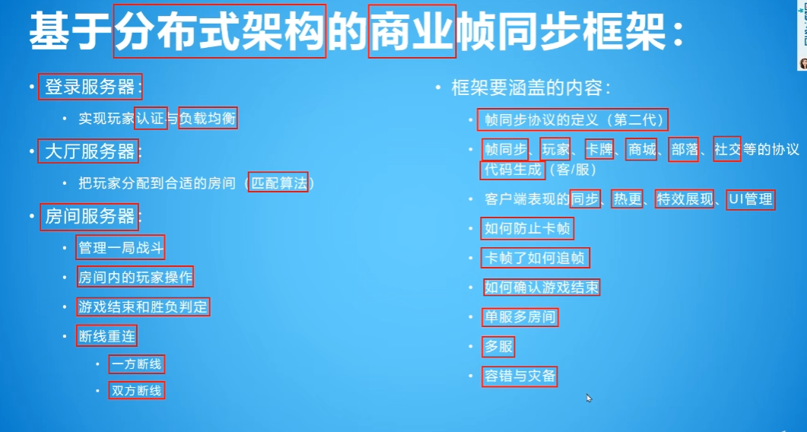


## protobuf哪里快了？

.proto文件中某个message

```
message Person {
  optional int32 id = 1;
  optional string name = 2;
  optional string email = 3;
}
```

- 更小的数据量：
- 更快的序列化和反序列化速度：
- 跨语言：基于二进制编码的，转换由protobuf来做当然能实现啦
- .proto文件的易于维护可扩展

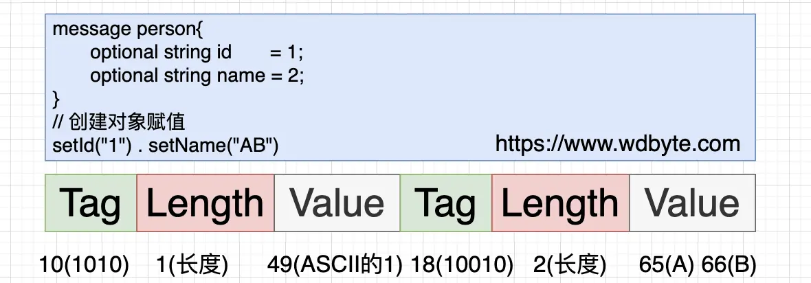


### 参考文献

[Protobuf: 高效数据传输的秘密武器 - 程序猿阿朗 - 博客园 (cnblogs.com)](https://www.cnblogs.com/niumoo/p/17390027.html)


## [思考：问到本项目的问题]


##### **1.在游戏服务器中，我们要获取某个角色周围的敌人，除了遍历当前场景的所有角色，我们还有什么好的方法来获取？**

在游戏服务器中，获取某个角色周围的敌人通常涉及到处理网络同步和优化性能的问题。以下是一些常见的方法，特别适用于游戏服务器环境：

1. **区域兴趣（Interest Management）：** 引入区域兴趣系统，该系统在服务器上负责跟踪和维护玩家周围的对象。当玩家移动到新区域时，服务器只需通知客户端或服务器更新该区域的信息，而不需要遍历整个场景。
2. **空间分割和空间索引：** 使用空间分割方法，如八叉树（Octree）或四叉树（Quadtree），将场景划分为空间单元。当需要查找周围的敌人时，只需检查相邻的空间单元，而不是整个场景。这样可以大大提高查找效率。
3. **索引数据结构：** 使用索引数据结构，如哈希表或空间网格，来存储场景中的对象信息。这样可以通过直接查找索引而不是遍历来获取所需的对象。
4. **消息系统：** 使用消息系统，允许对象在特定事件发生时广播消息。当敌人进入或离开某个区域时，它可以向周围的对象发送消息，通知它们进行相应的处理。
5. **服务器端碰撞检测：** 在服务器上执行碰撞检测，以确定角色周围的敌人。这通常涉及使用服务器端物理引擎或其他碰撞检测算法来处理对象之间的碰撞。


##### **2.你这个项目有使用到多线程吗？**

在我们的项目中很多地方都使用到了c#的ThreadPool，每个CLR都有一个线程池实例。（Common Language Runtime）


main线程,最后阻塞在这里了，因为我们使用了控制台。后面会改写为守护进程

```
        static void Main(string[] args)
        {	
        	....
            Console.ReadKey();//防止进程结束
        }
```


比如说：MessageRouter.Start()

```
        public void Start(int ThreadCount)
        {
            if (running) return;

            running = true;
            this.ThreadCount = Math.Min(Math.Max(1, ThreadCount),10);


            for(int i = 0; i < this.ThreadCount; i++)
            {
                //创建线程
                ThreadPool.QueueUserWorkItem(new WaitCallback(MessageWork));
            }
            //等待一会,让全部线程
            while (WorkerCount < this.ThreadCount)
            {
                Thread.Sleep(100);
            }
        }
```

Scheduler.Start()中Timer的实现也是从ThreadPool中获取线程的

```
        public void Start()
        {
            if (timer != null) return;
            //系统线程池中拿一个来用的
            timer = new Timer(new TimerCallback(Execute), null, 0, 1);//每隔一毫秒触发
        }
```

NetService中的心跳检测的timer

```
public void Start()
{
    //启动网络监听
    tcpServer.Start();

    //启动消息分发器
    MessageRouter.Instance.Start(Config.Server.WorkerCount);

    //订阅心跳事件
    MessageRouter.Instance.Subscribe<HeartBeatRequest>(_HeartBeatRequest);

    //定时检查心跳包的情况
    Timer timer = new Timer(TimerCallback, null, TimeSpan.Zero, TimeSpan.FromSeconds(HEARTBEATQUERYTIME));

}
```

SessionManager中的的session会话超时检测的timer

```
        public SessionManager()
        {
            //创建一个计时器,1秒触发
            var timer = new Timer(1000);
            timer.Elapsed += (sender, e) => CheckSession();
            timer.Start();
        }


```


##### **3.你的服务器是怎么处理socket请求的，一个socket对应一个线程？**

我使用的是c#给我们提供的**异步io编程模型**iocp   APM  TAP

在异步 I/O 模型中，底层系统会负责管理异步操作的执行，并在操作完成时通知相关的回调函数。这种方式可以有效地利用系统资源，而无需为每个异步操作创建一个新的线程。

比如说：`Socket.BeginAccept` 和 `Socket.EndAccept` 方法是用于异步接受连接请求的一对方法。以下是它们的基本流程：

`BeginAccept` 方法启动异步操作，开始监听传入的连接**请求**。

异步操作在后台进行，而不会阻塞主线程。

当有连接请求到达时，系统会调用你提供的回调函数。

在回调函数内，你调用 `Socket.EndAccept` 方法来完成异步操作，并获取新建立的连接的 `Socket` 对象。

对于`Socket.BeginAccept`和`Socket.EndAccept`，异步操作的实现通常基于I/O完成端口（I/O Completion Port）等底层机制，而不是简单地创建一个新线程来处理。这允许系统在没有创建新线程的情况下，有效地处理多个异步操作。（内核线程池）

在Windows操作系统上，I/O完成端口（IOCP）是一种高效的异步I/O机制，它使用线程池来管理异步操作的执行。但重要的是要理解，线程池并不是为每个异步操作都创建一个新线程，而是通过重用池中的现有线程来提高效率。


`Socket.AcceptAsync` 方法是.NET Framework中引入的更现代的异步模型的一部分，它属于TAP（Task-based Asynchronous Pattern）模式。与传统的`Socket.BeginAccept`和`Socket.EndAccept` APM 模式不同，`Socket.AcceptAsync` 返回一个 `Task<Socket>`，使得异步代码更加清晰和易于管理。

`Socket.AcceptAsync` 不会创建新线程来处理异步操作，而是通过底层的异步I/O机制（例如，I/O完成端口）来实现异步操作。这样可以更高效地利用系统资源，而不必为每个异步操作都分配一个新的线程。


##### **4.既然你的messageRouter使用了多线程，那么你的character中的信息存在线程并发问题吗？**

在这些个战斗场景中产生的数据，在处理的时候我们都会使用队列来缓存某个时间段收集到的数据包，然后在一起处理这些数据包。

也就是说，处理这些例如：character属性变更  我们是使用单个线程来处理的，所以是不存在一个并发的问题。

```
    public class FightManager
    {
        private Space space;

        //等待处理的技能施法队列：收集来自各个客户端的施法请求
        //这个队列维持了actor属性的同步，比如说hp的计算是单线程的。
        public ConcurrentQueue<CastInfo> castInfoQueue = new ConcurrentQueue<CastInfo>();


        public void OnUpdate(float deltaTime)
        {
            //处理施法请求
            while(castInfoQueue.TryDequeue(out var cast))
            {
                RunCast(cast);
            }
```


##### **5.既然你的服务器通过一个timer每隔n秒进行对character的一些属性进行保存的话，那么它和messageRouter会有并发问题吗？**

```
        private void SaveCharacterInfo()
        {
            foreach (var chr in characterDict.Values)
            {
                //更新位置
                chr.Data.X = chr.Position.x;
                chr.Data.Y = chr.Position.y;
                chr.Data.Z = chr.Position.z;
                chr.Data.Hp = (int)chr.Hp;
                chr.Data.Mp = (int)chr.Mp;
                chr.Data.SpaceId = chr.SpaceId;
                chr.Data.Knapsack = chr.knapsack.InventoryInfo.ToByteArray();
                chr.Data.Level = chr.Level;
                chr.Data.Exp = chr.Exp;
                //保存进入数据库
                repo.UpdateAsync(chr.Data);//异步更新
            }
        }
```

其实并不会有问题，因为我们保存到数据库其实是读取操作，并发问题是指多个线程修改同一个数据造成的脏读、幻读、不可重复读


##### 6.为什么使用TCP而不是UDP,如果使用UDP该怎么实现？

不考虑性能原因外，因为TCP在传输层为我们提供了可靠的通信信道，我们拿起来用更加简单。

如果使用UDP的话我们还需要自己去定制可靠性机制。


# Git

## .gitignore


### 概述

什么是 .gitignore 文件？.gitignore 文件是用来做什么的？

在任何当前工作的 Git 仓库中，每个文件都是这样的：

追踪的（tracked）- 这些是 Git 所知道的所有文件或目录。这些是新添加（用 git add 添加）和提交（用 git commit 提交）到主仓库的文件和目录。
未被追踪的（untracked） - 这些是在工作目录中创建的，但还没有被暂存（或用 git add 命令添加）的任何新文件或目录。
被忽略的（ignored） - 这些是 Git 知道的要全部排除、忽略或在 Git 仓库中不需要注意的所有文件或目录。

**本质上，这是一种告诉 Git 哪些未被追踪的文件应该保持不被追踪并且永远不会被提交的方法。**

所有被忽略的文件都会被保存在一个 .gitignore 文件中。

.gitignore 文件是一个纯文本文件，包含了项目中所有指定的文件和文件夹的列表，这些文件和文件夹是 Git 应该忽略和不追踪的。

在 .gitignore 中，你可以通过提及特定文件或文件夹的名称或模式来告诉 Git 只忽略一个文件或一个文件夹。你也可以用同样的方法告诉 Git 忽略多个文件或文件夹。

通常，一个 `.gitignore` 文件会被放在仓库的根目录下。根目录也被称为父目录和当前工作目录。根目录包含了组成项目的所有文件和其他文件夹。

也就是说，你可以把它放在版本库的任何文件夹中。你甚至可以有多个 `.gitignore` 文件。


### 在 .gitignore 文件中应包括什么？

**你应该考虑添加到 .gitignore 文件中的文件类型是任何不需要被提交的文件。**

你可能出于安全原因不想提交它们，或者因为它们是你的本地文件，因此对与你在同一项目上工作的其他开发者来说是不必要的。

其中一些可能包括：

- **操作系统文件**。每个操作系统（如 macOS、Windows 和 Linux）都会生成系统特定的隐藏文件，其他开发者不需要使用这些文件，因为他们的系统也会生成这些文件。例如，在 macOS 上，Finder 会生成一个 .DS_Store 文件，其中包括用户对文件夹的外观和显示的偏好，如图标的大小和位置。
- **由代码编辑器和 IDE（IDE 代表集成开发环境）等应用程序生成的配置文件**。这些文件是为你、你的配置和你的偏好设置定制的。
- **从你的项目中使用的编程语言或框架自动生成的文件**，以及编译后的代码特定文件，如 .o 文件。
- **由软件包管理器生成的文件夹**，如 npm 的 node_modules 文件夹。这是一个用于保存和跟踪你在本地安装的每个软件包的依赖关系的文件夹。
- **包含敏感数据和个人信息的文件**。这类文件的一些例子是含有你的凭证（用户名和密码）的文件和含有环境变量的文件，如 .env 文件（.env 文件含有需要保持安全和隐私的 API 密钥）。
- **运行时文件，如 .log 文件**。它们提供关于操作系统的使用活动和错误的信息，以及在操作系统中发生的事件的历史。


### 在 Git 中忽略一个文件和文件夹


#### 1.忽略根路径下的文件

如果你想只忽略一个特定的文件，你需要提供该文件在项目根目录下的完整路径。

例如，如果你想忽略位于根目录下的 `text.txt` 文件，你可以做如下操作：

```
/text.txt
```


#### 2.忽略根路径下的文件夹下的文件

而如果你想忽略一个位于根目录下的 `test` 目录中的 `text.txt` 文件，你要做的是：

```
/test/text.txt
你也可以这样写上述内容：
test/text.txt
```


#### 3.忽略所有特定名称的文件

如果你想忽略所有具有特定名称的文件，你需要写出该文件的字面名称。

例如，如果你想忽略任何 `text.txt` 文件，你可以在 `.gitignore` 中添加以下内容：

```
text.txt
```

在这种情况下，你不需要提供特定文件的完整路径。这种模式将忽略位于项目中任何地方的具有该特定名称的所有文件。


#### 4.忽略所有特定名称的目录

要忽略整个目录及其所有内容，你需要包括目录的名称，并在最后加上斜线 `/`：

```
test/
```

这个命令将忽略位于你的项目中任何地方的名为 `test` 的目录（包括目录中的其他文件和其他子目录）。

需要注意的是，如果你只写一个文件的名字或者只写目录的名字而不写斜线 `/`，那么这个模式将同时匹配任何带有这个名字的文件或目录：

```
# 匹配任何名字带有 test 的文件和目录
test
```


#### 5.忽略以某某开头的文件和目录

如果你想忽略任何以特定单词开头的文件或目录怎么办？

例如，你想忽略所有名称以 `img` 开头的文件和目录。要做到这一点，你需要指定你想忽略的名称，后面跟着 `*` 通配符选择器，像这样：

```
img*
```

这个命令将忽略所有名字以 `img` 开头的文件和目录。


#### 6.忽略特定单词结尾的文件或目录

但是，如果你想忽略任何以特定单词结尾的文件或目录呢？

如果你想忽略所有以特定文件扩展名结尾的文件，你需要使用 * 通配符选择器，后面跟你想忽略的文件扩展名。

例如，如果你想忽略所有以 .md 文件扩展名结尾的 markdown 文件，你可以在你的 .gitignore 文件中添加以下内容：

```
*.md
```

这个模式将匹配位于项目中任何地方的以 `.md` 为扩展名的任何文件。


前面，你看到了如何忽略所有以特定后缀结尾的文件。当你想做一个例外，而有一个后缀的文件你不想忽略的时候，会发生什么？

假设你在你的 `.gitignore` 文件中添加了以下内容：

```
.md
```

这个模式会忽略所有以 `.md` 结尾的文件，但你不希望 Git 忽略一个 `README.md` 文件。

要做到这一点，你需要使用带有感叹号的否定模式，即 `!`，来排除一个本来会被忽略的文件：

```
# 忽略所有 .md 文件
.md

# 不忽略 README.md 文件
!README.md
```

在 `.gitignore` 文件中使用这两种模式，所有以 `.md` 结尾的文件都会被忽略，除了 `README.md` 文件。


假设在一个 `test` 文件夹内，你有一个文件，`example.md`，你不想忽略它。

你不能像这样在一个被忽略的目录内排除一个文件：

```
# 忽略所有名字带有 test 的目录
test/

# 试图在一个被忽略的目录内排除一个文件是行不通的
!test/example.md
```


### 如何忽略以前提交的文件

当你创建一个新的仓库时，最好的做法是创建一个 `.gitignore` 文件，包含所有你想忽略的文件和不同的文件模式–在提交之前。

Git 只能忽略尚未提交到仓库的未被追踪的文件。

如果你过去已经提交了一个文件，但希望没有提交，会发生什么？

比如你不小心提交了一个存储环境变量的 `.env` 文件。

你首先需要更新 `.gitignore` 文件以包括 `.env` 文件：

```
# 给 .gitignore 添加 .env 文件
echo ".env" >> .gitignore
```

现在，你需要告诉 Git 不要追踪这个文件，把它从索引中删除：

```
git rm --cached .env
```

`git rm` 命令，连同 `--cached` 选项，从版本库中删除文件，但不删除实际的文件。这意味着该文件仍然在你的本地系统和工作目录中作为一个被忽略的文件。

`git status` 会显示该文件已不在版本库中，而输入 `ls` 命令会显示该文件存在于你的本地文件系统中。

如果你想从版本库和你的本地系统中删除该文件，省略 `--cached` 选项。

接下来，用 `git add` 命令将 `.gitignore` 添加到暂存区：

```
git add .gitignore
```

最后，用 `git commit` 命令提交 `.gitignore` 文件：

```
git commit -m "update ignored files"
```


### 通用模板

```
# 编译器生成的文件
*.o
*.obj
*.exe
*.dll
*.pdb
*.lib
*.so
*.dylib

# 编译器/IDE生成的文件
out/
bin/
obj/

# 包文件
*.zip
*.rar
*.gz
*.tar
*.7z

# 日志和临时文件
*.log
*.tmp
*.bak
*.swp

# Visual Studio生成的文件和文件夹
[Dd]ebug/
[Rr]elease/
*.suo
*.user
*.sln.docstates
*.suo
*.cache
*.csproj.user
.vs/

# macOS/OS X专用文件
*.DS_Store

```


## git的全局设置

### 设置用户信息

```
git config --global user.name "itcast"
git config --global user.email "hello@qq.com"
```

### 查看配置信息

```
git config --list
```

### 注意：

上面的username和Email不是github上面的用户名和邮箱，我们可以随意设置

## 本地仓库的操作

```
[初始化]
git init

[提交修改到暂存区]
git add .		 # 添加所有更改的文件
git add <文件名>  # 添加指定文件

[提交]
git commit -m "提交信息"
git commit --amend -m "更新后的提交信息"
--amend：修改最近一次的提交。如果你在提交后发现遗漏了某些更改或提交信息有误，可以使用此选项

[已暂存的更改撤回到工作区]
git reset #全部
git reset <文件名>

[状态查看]
git status
它帮助你掌握哪些文件已经修改、哪些文件暂存、哪些文件未被 Git 跟踪，为下一步操作（如提交、恢复、更改等）提供指导。
```


## 远程仓库的操作

```
[添加远程仓库]
git remote add origin <远程仓库的URL>

[移除远程仓库]
git remote remove <name>

[查看远程关联信息]
git remote -v

[推送本地代码到远程仓库]
git push --set-upstream origin master  #首次推送
--set-upstream 或 -u: 设置本地分支与远程分支之间的关联关系。
这样，你可以在以后的推送或拉取操作中省略远程仓库名称和分支名称。
origin: 这是默认的远程仓库名称，通常用于指向你克隆或关联的远程仓库。
master: 本地分支名称。将这个分支的更改推送到远程仓库中相应的分支。

git push 							   #后续可以直接使用这个命令进行推送。

[远程仓库拉取到本地仓库]
git pull [remote name] [branch name]


```


## 提交撤销

使用 `git reset` 命令只会影响本地仓库，不会直接影响远程仓库。如果你希望将更改推送到远程仓库，撤销远程仓库中的提交，需要进一步操作。

具体步骤如下：

1. **本地撤销提交：**

    ```bash
    这里的 --soft 选项表示重置到上一个提交（HEAD~1），但保留所有更改在暂存区（staging area）。
    git reset --soft HEAD~1
    如果你想保留修改内容，但不保留在暂存区，可以使用：
    git reset --mixed HEAD~1
    ```

2. **强制推送到远程仓库：**

    ```bash
    git push origin main --force
    ```

   注意：这里的 `main` 是你的主分支的名称，如果你的主分支名称不同，请替换为相应的名称。使用 `--force` 选项会强制更新远程分支，将其重置为与你本地仓库一致。

强制推送操作需要谨慎，因为它会覆盖远程仓库的历史记录，可能会影响其他团队成员的工作。确保你已经与团队其他成员沟通，并确认这种操作不会带来意外问题。

如果你不确定，或者不希望影响其他人的工作流，可以考虑使用 `git revert`，它会创建一个新的提交来撤销之前的更改，而不是直接修改提交历史：

```bash
git revert <commit-hash>
git push origin main
```

这样，远程仓库会保持完整的提交历史，同时撤销指定的更改。


## 移除已追踪的文件

如果你已经在 `.gitignore` 文件中添加了对 `Bundles` 目录的忽略规则，但 Git 仍然在处理这个目录下的文件，可能是因为这些文件已经被 Git 追踪过。Git 的 `.gitignore` 文件只对未追踪的文件有效，如果文件已经被添加到版本控制中，`.gitignore` 就不会忽略它们。

### 解决方法
你需要从 Git 的索引中移除这些已经被追踪的文件，而不删除它们在本地的实际文件。

#### 1. 从 Git 中移除已追踪的 `Bundles` 文件
使用以下命令从 Git 索引中移除 `Bundles` 目录，但保留本地文件：

```bash
git rm -r --cached Bundles/
```

这个命令会从 Git 的索引中移除 `Bundles` 目录及其所有内容，但文件仍然会保留在你的工作目录中。

#### 2. 提交更改
然后，你需要提交这些更改，以便将这些文件的移除记录到版本控制中：

```bash
git commit -m "Remove Bundles directory from version control"
```

#### 3. 确保 `.gitignore` 正常工作
确认 `.gitignore` 文件中包含了以下规则：

```plaintext
/Bundles/
```

提交之后，Git 将不再追踪 `Bundles` 目录中的文件，并且它们将不会出现在未来的提交中。

### 验证
你可以通过以下命令验证 `.gitignore` 是否工作：

```bash
git status
```

如果 `Bundles` 目录中的文件不再显示在未追踪文件列表中，说明 `.gitignore` 配置已经生效。


# 网络同步在游戏历史长的变化发展


## 一、网络同步概念理解 

网络游戏是电子游戏中一个极为重要的品类，自网络诞生以来，游戏行业就没有停止过对多 人游戏玩法的探索。但是随着技术的发展，我们发现游戏服务器的架构发展却与通常的 WEB服务器架构渐行渐远。在我看来，导致二者差异化的一个重要原因就是现代游戏服务器（更准确的说是游戏逻辑服务器）对网络同步有着很高的即时性要求

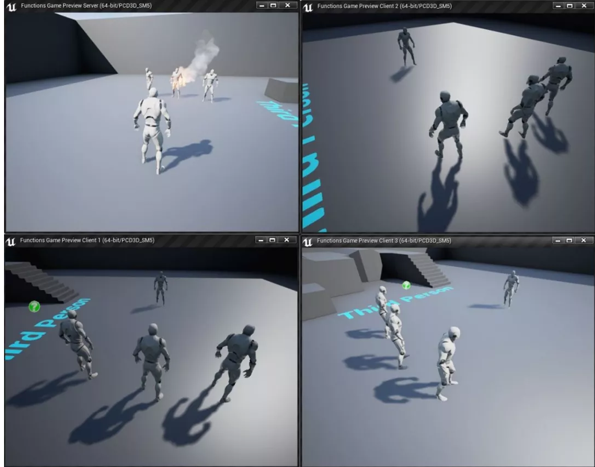 

​									图1-1 游戏中的网络同步效果

那什么是网络同步呢？虽说是游戏中常用的概念，但其实任何与互联网有关的技术都需要网 络同步，我这里会尝试用通俗易懂的方式循序渐进的给大家讲解其原理和概念。在其他领 域，我们也许可以称他为“数据同步”，比如说用户A用他的手机点击按钮注册了一个QQ 账号，那么他的手机号等个人信息就会被存储到服务器上面，这就是一个数据同步的过程。 在这个过程中，数据由A的手机流向了QQ的官方服务器。对于游戏来说，其实原理也是一 样，不过由于游戏中玩家关注的是游戏的视觉效果，所以我们不仅要同步数据，还要同步表 现。可以简单认为，网络同步 = 数据同步+表现同步，数据同步是后端操作，而表现同步 就是让前端对后端同步过来的数据进行进一步的处理从而达到表现上的一致。所以这样看 来，不仅是游戏，任何拥有前端的产品都是这样的，比如浏览器、各种手机App，当你点击 登录的时候，服务器就会要同步的个人信息发给你，并显示在界面上，你用任何一款手机显 示的内容都是一样的。 

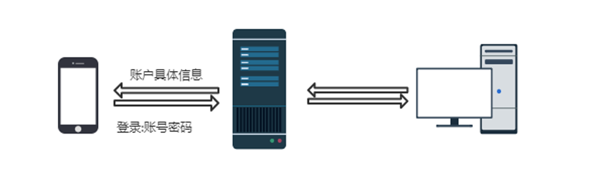 

​							图1-2 一般应用中的数据


​	不过一般Web服务器只是单纯的从服务器向客户端进行数据同步，不会把其他客户端的数 据都发给你。而在游戏里面，你需要让N个客户端的显示看起来一模一样（由于网络延迟， 同一时刻不可能完全一样），所以需要把其他玩家的一些数据也发给你，不能说A玩家跳了 一下，B玩家看到A却趴下了，那样游戏就没法玩了。对于大部分的互联网产品，针对的都 是个人用户的，并不需要两个用户之间进行交互，所以也就不需要不同用户的客户端界面保 持一致。也行讲到这里，你会拍案而起，“浏览器不久是这样的么？我们所有人看一个网页 都是一样的”。没错，最早期的一批网络游戏就是在BBS上进行的，那时候以文字交流的模 式进行多人交互，效果本质上和很多页游是非常相似的。假如XXX知乎大佬的页面是一个棋 盘的样子，每个人都可以在其首页上面下一枚围棋，那么这不就是一个可以全民参与的围棋 游戏么？页游大概就是这么一个原理。

​	然而，前面我们还忽略了一个游戏中非常重要的需求（尤其是在MMO、FPS这种类型的网游中）——那就是实时性。你可以容忍微信点进去一个文章要花2秒钟，但是你不可能接受 你的子弹要2秒后才打到敌人。实际上，在各种电子竞技里面，0.1秒的延迟就足以让整个游戏的局势发生逆转。像浏览器这种页面显示都吞吞吐吐的应用，如何用他流畅的玩FPS和 MOBA呢？（关于云游戏这里先不谈）

​	到这里，我们再次梳理一下网络同步的概念**。可以认为 网络同步 = 实时的多端数据同步 +实时的多端表现同步。从计算机的角度来描述，网络同步是一个网络IO与CPU计算同样密集的游戏功能，他对主机CPU的性能要求较高，且单核的性能比并发更为重要**。当然，游戏同步还有一些其他的特点，比如数据一般不要求存储、允许一定程度的丢失等，这里我们 就不再进一步讨论

​	了解以上网络同步的特点后，我们就可以进一步展开细节来说，比如传输的数据内容有哪 些？数据的传递流向是什么样子的？我们平时口中常谈的“帧同步”，“状态同步”如何理 解？为了能以一个更全面更权威的视角来讲解网络同步，笔者阅读了大量的论文和资料，对 同步技术的发展和细节有了更为清晰的认识（很多内容与网上参差不齐的博客描述并不相同）。由于同步本身与服务器架构无法剥离，文章还会涉及到一些游戏网络架构的发展历 史


## 二、网络架构与传统同步


### 1.网络游戏架构的发展

​	1973年夏天，高中暑期实习生在美国加利福尼亚州NASA的研究中心首次撰写了游戏《迷 宫战争》[1]。通过使用串行电缆 连接两台算机，增加了两人游戏功能。由于涉及两台对等 的计算机，可以使用相同的格式化协议包相互发送信息，因此可以认为这是第一个P2P架构 的电子游戏。在那个时代，并没有多人在线游戏，互联网也没有诞生，网络同步一词更是无 人知晓。不过当两台计算机上的数据进行传递时，最最最简单的同步模型就已经悄无声息的 出现了，A把操作信息通过电缆发给B，B收到数据后处理，在把自己的操作数据通过电缆发 送给A。比较有意思的一点是，计算机技术的发展或多或少都与电子游戏有着紧密的联系， 甚至很多技术的诞生就是源于对游戏交互方式的探索

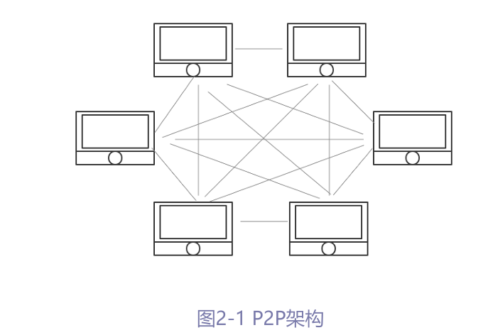 

​	1978年，Roy Trubshaw编写了世界上第一个MUD程序《MUD1》，后来又在此基础上诞 生了开源的 MudOS（1991），成为众多网游的鼻祖。MUDOS使用单线程无阻塞套接字 来服务所有玩家，所有玩家的请求都发到同一个线程去处理，主线程每隔1秒钟更新一次所 有对象。这时候所谓的同步，就是把玩家控制台的指令发送到专有的服务器，服务器按顺序 处理后再发送给其他所有玩家（几乎没有什么验证逻辑），这是最早的CS架构。当时PC图 形化还不成熟，MUD早期的系统只有着粗糙的纯文字界面，由于也没有物理引擎等游戏技 术，所以对网络延迟、反馈表现要求并不高

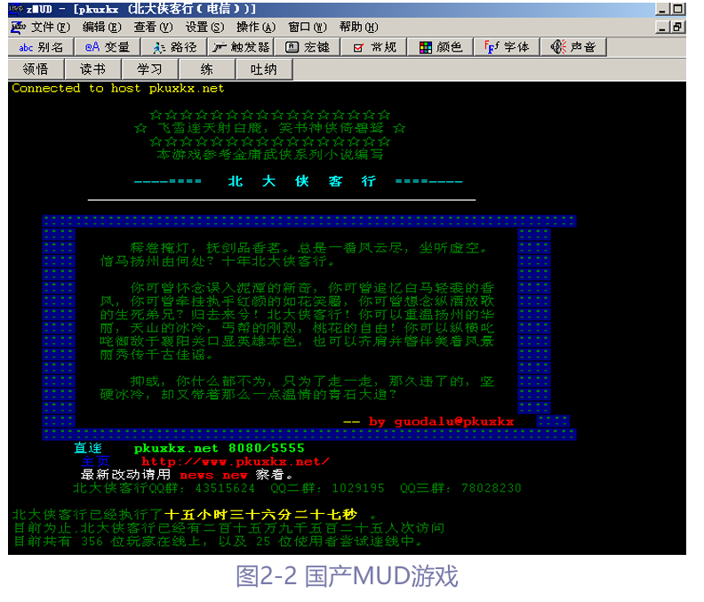 

 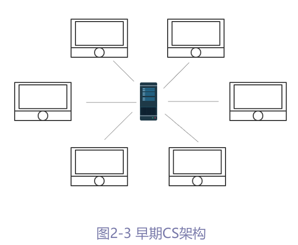 

​	

​	大概在上世纪90年代，在P2P架构的基础上，很自然地诞生了以某个客户端为Host主机 （或叫做ListenServer）的CS架构，这样的架构不需要单独都维护一个服务器，任何一个客 户端都可以是Sever，能够比较方便的支持局域网内对战，也能节省服务器的运行与开发成 本。不过，虽说也是CS架构，如果Host主机不做任何server端的校验逻辑，那么其本质上 还是P2P模型，只不过所有的客户端可以把消息统一发送到一个IP，Host再进行转发，这种 方式我们称其为Packet Server。

 

​	

​	后来一些游戏团队（比如id software）又对CS架构做了进一步调整，先是将大部分的逻辑 处理移到服务器上（服务器可能是一个独立的无窗口的后台程序），客户端只负责渲染。随 后为了对抗网络延迟提升客户端的流畅性，又把一部分逻辑交回给客户端本地预执行，最终 成为很多经典游戏和引擎的架构方式。

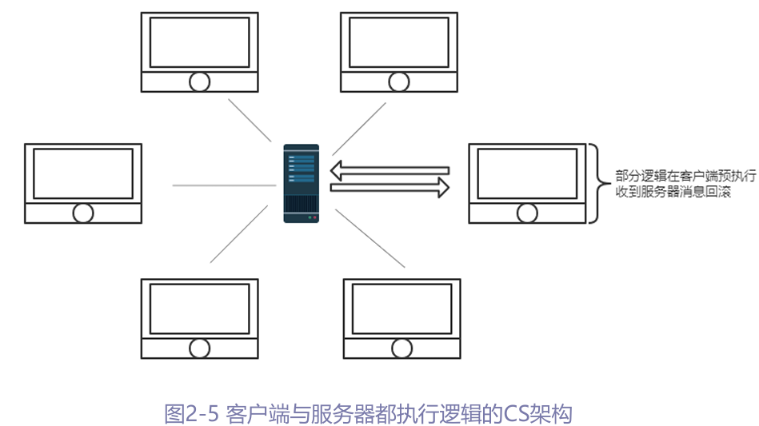


​	在2000年后，Eric Cronin的团队在传统多服务器的架构上[2]提出来镜像服务器模型[3]。这 种模型提供了多个服务器的拷贝，避免单点崩溃影响到所有玩家的问题。类似CDN，玩家 还可以选择就近的服务器进行通信，降低了通信延迟。不过，这种方式增加了服务器的租用 和维护成本，在后续的游戏网络架构中并没有被大量使用，倒是WEB服务器广泛采用这种 模型并不断将其发扬光大。

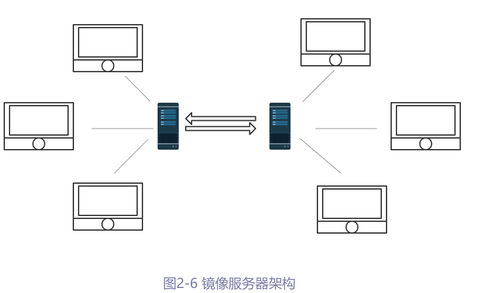


​	再后来，游戏服务器架构不断发展。游戏存储负载和网络连接负载随后从逻辑服上拆分出 来，形成独立的服务；玩家数量增多后，又将游戏拆分成多个平行世界，出现了分服和跨 服；游戏逻辑进一步复杂后，又开始按照功能去划分成网关服务器、场景服务器、非场景服 务器等。我们今天讨论的网络同步几乎都是在逻辑服务器（基本上无法拆分）上进行的，所 以后续的这些架构方式与网络同步的关系并不是很大，这里就不再赘述。

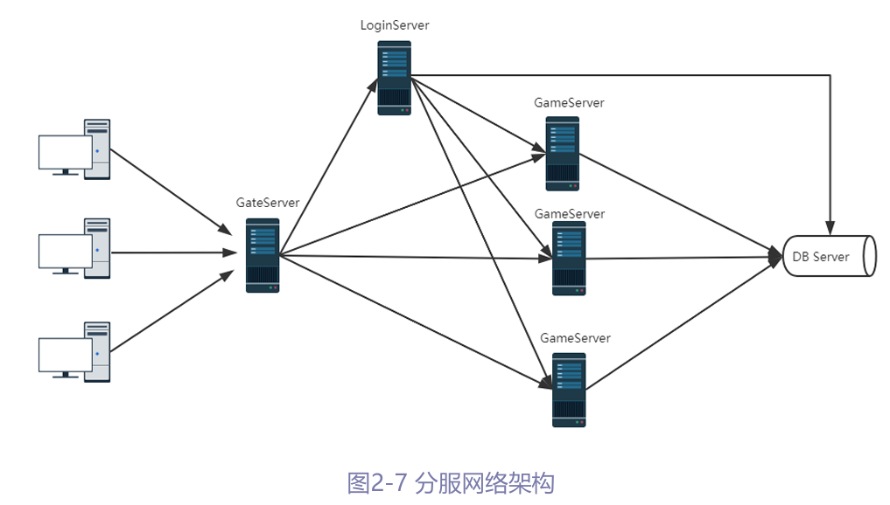


### 2.传统同步面临的问题

​	大部分的网络同步技术最早并不是诞生在游戏中，而是出现在各种计算机模拟仿真系统中。 在70，80年代就有很多实验室针对Computer Simulation研究各种复杂且有效的同步手段 （interactive simulation），我们后面提到的很多游戏同步算法[11]都是由这些早期的研 究发展过来的。

​	网络游戏刚出现的时候，大部分还属于弱交互游戏，可以将其简单理解为一种回合制游戏。 在每个回合开始时，所有玩家一同思考并把相关操作指令信息发送给其他玩家，其他玩家收 到了别人的消息后就会在本地处理然后结束当前回合，如果没有收到就会进入无限期的等 待。由于每个回合有比较长的思考和操作时间，所以网络延迟可以忽略不计，只要保证在回 合结束的时候，所有玩家的状态的数据保存一致即可。这种游戏采用的同步方式与计算机网 络中的停等协议（stop-and-wait-type）非常相似，是一种很自然也很简单的同步模型。 不过由于当时网络同步并没有形成体系，所以这种同步方式也没有名字。在局域网盛行以及 玩家数量较少的条件下，这种同步方式与架构都是可行的。

​	然而，随着游戏的种类和玩法复杂性的提升，传统的同步方法面对的问题也接踵而来。

- 在CS架构下逻辑在客户端执行还是在服务器执行？如果逻辑都在服务器执行，那 么客户端的操作都会被发送到服务器运算，服务器计算出结果后通知客户端，客户端 拿到结果后再做表现，这样的好处是所有的逻辑由服务器处理和验证，客户端无法作 弊，但坏处是会造成客户端的资源被浪费，服务器运算压力过大。如果逻辑在各个客 户端执行，那么玩家可以在本地计算后再把本地得到的结果告知服务器，服务器只进 行简单的转发，这样的好处是玩家的本地表现很流畅，但坏处是很容易在本地进行作 弊。而对于P2P架构，反作弊更是一个严重的问题，我连一个权威服务器都没有，根 本无法验证其他客户端消息的真伪，怎么知道其他玩家有没有作弊？
-   我们要发送什么数据来进行同步？如果发送每个对象当前的状态，那么如果一个游 戏里面有大量的角色，就会大规模的占用网络带宽，造成数据拥塞、丢包等等问题。 如果发送玩家指令，那这个指令是要服务器执行还是服务器转发？而且对于大型多人 在线游戏又没必要处理所有不相关的玩家信息，同样浪费网络资源。 
- 面对日益成熟的计算机网络协议，我们选择哪种来进行同步？TCP、UDP还是 Http？


​	这时，游戏开发者们需要面对“发什么数据”，“在哪计算”，“发给谁”等细节问题，他 们开始考虑引入更多的其他相关领域的技术（比如计算机模拟仿真）来解决游戏中的同步问 题，网络同步概念初见端倪。


## 三、锁步同步 lockstep（帧同步）

​	Lockstep就是我们口中常说的“帧同步”。但严格来说，Lockstep并不应该翻译成帧同步，而是——锁步同步算法。（LockStep由军事语境引入，用来表示齐步行军，队伍中的 所有人都执行一致的动作步伐）首次引入计算机领域[4]，应该是用于计算机容错系统， 即“使用相同的、冗余的硬件组件在同一时间内处理相同的指令，从而保持多个CPU、内存精确的同步”，所以一开始与游戏并没有任何关系。


### 1.早期的Lockstep

​	不过，早在1994年，FPS鼻祖Doom就已经采用了类似Lockstep的方式进行网络同步[5]。 Doom采用P2P架构，每个客户端本地运行着一个独立的系统， 该系统每0.02秒钟对玩家的 动作 (鼠标操作和键盘操作，包括前后移动、使用道具、开火等) 采样一次得到一个 tick command 并发送给其他所有玩家，每个玩家都缓存来自其他所有玩家的 tick commands，当某个玩家收到所有其他玩家的 tick commands 后，他的本地游戏状态会 推进到下一帧。在这里， tick command的采集与游戏的推进是相互独立的

​	其实当时并没有Lockstep这个说法，doom的整篇论文里面也没有出现过这个词。不过后 面概念逐渐清晰后我们会发现，Doom采用的同步方式就是我们常说的原始版本的 Lockstep——“确定性锁步同步（Deterministic Lockstep）”


### 2.Bucket Synchronization 

​	1999年，Christophe Diot和Laurent Gautier的团队开发了一款基于互联网的页游—— MiMaze，基于传统的Time Bucket Synchronization[6]他们在发布的论文里面提出了改进 后的Bucket Synchronization同步方法[7]。Bucket Synchronization把时间按固定时长划 分为多个Bucket，所有的指令都在Bucket里面执行。考虑到网络延迟的情况，每个玩家在 本地的命令不会立刻执行而是会推迟一个时延（该时延的长度约等于网络延迟），用来等待 其他玩家的Bucket的到来。如果超过延迟没有到达，既可以选择放弃处理，也可以保存起 来用于外插值（Extrapolation）或者使用前面的指令重新播放。在这种方式下，每个玩家 不需要按照Lockstep的方式严格等待其他玩家的命令在处理，可以根据网络情况顺延到后 面的bucket再执行。Bucket Synchronization可以认为是我们常说的“乐观帧锁定”算 法。

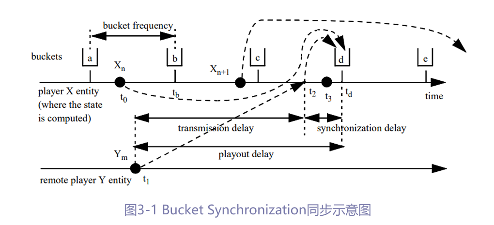


### 3.锁步同步协议 Lockstep protocol 

​	前面提到的Deterministic Lockstep虽然简单，但是问题却很多，包括浮点数跨平台的同步 问题、玩家数量增长带来的带宽问题以及显而易见的作弊问题（在P2P架构下几乎没有任何 反作弊能力）。说到作弊这里不妨先简单谈一下游戏外挂，外挂这个东西原本是指为增加程 序的额外功能而追加的内容，但随着网络游戏的诞生就开始与游戏绑定起来。针对不同的游 戏类型有着各式各样的外挂工具，包括游戏加速、透视、自动瞄准、数据修改等。从技术上 来讲，有些外挂是无法做到完全避免的。在CS架构下，因为大部分核心逻辑都是在服务器 上面计算，很多作弊手段无法生效。但是P2P架构下作弊却变得异常简单，甚至不需要很复 杂的修改工具。比如客户端A使用了外挂工具，每次都将自己的操作信息推迟发送，等到看 到了别人的决策后再决定执行什么，这种外挂称为lookahead cheats。（或者假装网络信 号不好丢弃第K步的操作，第K+1步再发送

​	因此，在2001年，Nathaniel Baughman和Brian Neil Levine在IEEE上发表了论文，提出 锁步同步协议 Lockstep protocol [8]来对抗lookahead cheat类型的外挂。这可能是第一 次“Lockstep”一词被正式的用于游戏网络同步的描述中。不过要注意的是，这里的 Lockstep protocol并不是我们前面提到的Deterministic Lockstep ，相比之前的在第K步 （第K个Tick Command间隔）就直接发送第K+1步的明文操作信息，Lockstep protocol 每一步都分两次发送信息。大概的流程如下：

- 先针对要发送的明文信息进行加密，生成“预提交单向哈希（secure one-way commitment hash）”并发送给其他客户端。 
- 待本地客户端收到所有其他客户端的第K步预提交哈希值之后，再发送自己第K 步的明文信息 
- 等到收到所有其他客户端的第K步明文信息后，本地客户端会为所有明文信息逐 个生成明文哈希并和预提交的哈希值对比，如果发现XXX客户端的明文哈希值和预提 交哈希值不相等，则可以判定该客户端是外挂。反之，游戏正常向前推进。

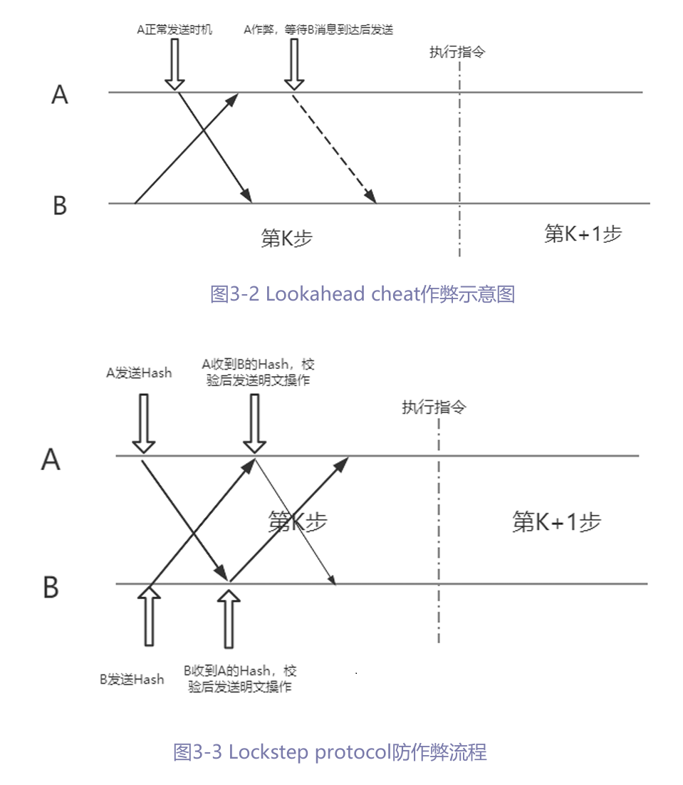 

​	这种协议的虽然可以对抗外挂，但是很明显带来了带宽以及性能的浪费，而且网络条件好的 客户端会时刻受到网络差的客户端的影响。所以他们又在此基础上提出异步的 Lockstep（asynchronous Synchronization lockstep）。大体的思路是利用玩家角色的 SOI（Spheres of Influence，和AOI概念差不多），两个玩家如果相距很远互不影响，就 采用本地时钟向前推进（非Lockstep方式同步），如果互相靠近并可能影响到对方就变回 到严格的LockStep同步，这里并不保证他们的帧序列是完全一致的。

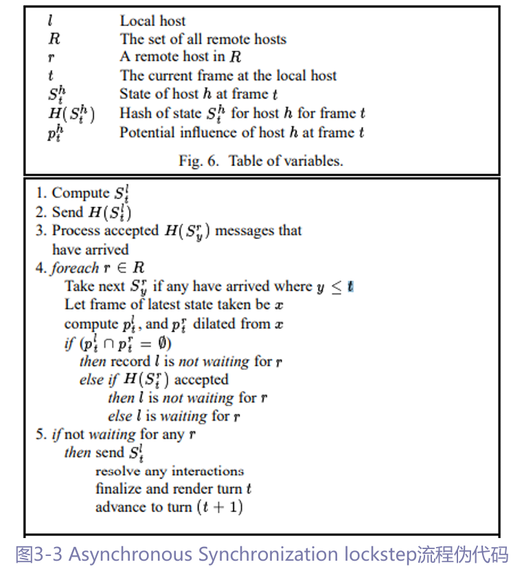

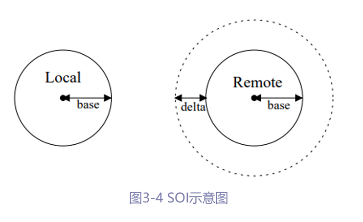


### 4.RTS中的Lockstep

​	同一年，2001的GDC大会上，“帝国时代”的开发者Mark Terrano和Paul Bettner针对 RTS游戏提出了优化版的锁步协议[9]。早在1996年他们就开始着手于帝国时代1的开发，不 过很快就发现在RTS游戏中的网络同步要比其他类型游戏（比如FPS）复杂的多，一是游戏 中可能发生位置变化的角色非常多，必须要合理的减少网络同步带宽，二是玩家对同步频率 极为敏感，每一秒的疏忽都可能影响局势。所以，他们在传统 Lockstep（当时仍然没有 Deterministic Lockstep这个概念）的基础上做了优化，首先保持每一步只同步玩家的操作 数据，然后对当前的所有命令延迟两帧执行的方法来对抗延迟。具体来说，就是第K步开始 检测到本地命令后会推迟到第K+2步进行发送和执行，K+1步收集到的其他客户端命令会推 迟到K+3步去执行，每K步执行前会去判断本地是否有前两步的命令，如果有就继续推进。 （关于具体的推进策略，论文里面写的不是很清楚，这里加入了作者自己的判断

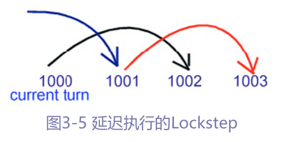

​	此外，为了避免高性能机器受低性能机器的影响而变“卡”，“帝国时代”里面每一步（称 为一个turn）的长度是可以调整的，并且完全与渲染分开处理。每个客户端会根据自身的机 器性能与网络延迟情况来动态调整步长时间，如果性能优良但是延迟高就会拉长每个turn的 时间（由于是非严格的帧锁定，多出的时间用于正常进行多个帧的渲染以及Gameplay的处 理，虽然可能有误差），如果性能差但是网络正常就会把大部分的时间用于每个turn的渲 染，在这种条件下每个客户端相同的turn执行的本地时间虽然不同，但是执行的内容是完全 一致的

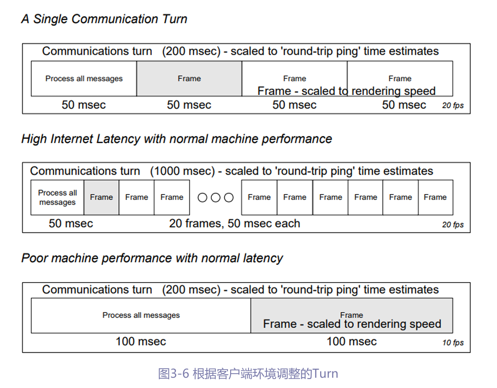


### 5.Pipelined Lockstep protocol

​	流水线操作是一种高效的数据传输模型，在计算机技术里面随处可见（比如计算机存储系统 中主存与Cache的交互）。2003年，Ho Lee、Eric Kozlowski等人对Bucket synchronization、Lockstep protocol等协议进一步分析并针对存在的缺点进行优化，提 出了Pipelined Lockstep protocol[10]。他们发现只有当前玩家的指令行为不与其他人产 生冲突，就可以连续的发送的自己的指令而不需要等待其他人的消息。举个例子，假如一个 游戏只有7个格子，玩家A和B分别站在左右两边，每次的指令只能向前移动一格。那么A和 B至少可以连续发送三个指令信息而不需要等待对面玩家的数据到来。 Pipelined Lockstep protocol基于Lockstep protocol，为了防止cheatahead外挂同样需 要提前发送hash，这种操作同步、不等待超时玩家的确定性锁步的特性逐渐成 为“Lockstep”的标准，被广泛应用于网络同步中。

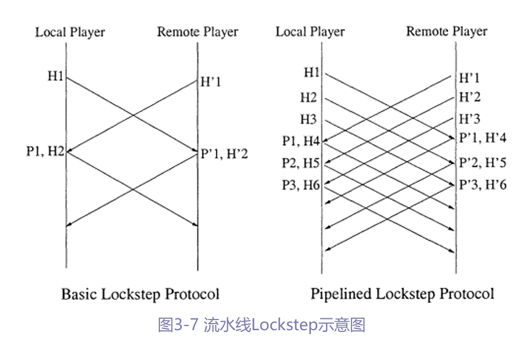


### 6.TimeWarp 

​	TimeWarp原本是指科幻小说中的时间扭曲，其实早在1982年就被D Jefferson等人引入计 算机仿真领域[11]，后续又被Jeff S. Steinrnan进行优化和调整[6][12]。TimeWrap算法基 本思路是多个物体同时进行模拟，当一个物体收到了一个过去某个时刻应该执行的事件时， 他应该回滚到那个时刻的状态，并且回滚前面所有的行为与状态

​	前面提到的Pipelined Lockstep protocol可以流畅的处理玩家互相不影响的情况，但是却 没有很好的解决状态冲突与突发的高延迟问题。参考TimeWarp这种思路，我们可以将本地 执行过的所有操作指令进行保存同时把对应时刻的游戏世界状态存储成一个快照 （Snapshot），本地按照Pipelined Lockstep protocol的规则进行推进，如果后期收到了 产生冲突的指令，我们可以根据快照回滚到冲突指令的上一个状态，然后把冲突后续执行过 的事件全部取消并重新将执行正确的指令。 这样如果所有玩家之间没有指令冲突，他们就 可以持续且互不影响的向前推进，如果发生冲突则可以按照回退到发生冲突前的状态并重新 模拟，保持各个端的状态一致。


### 7.Lockstep与"帧"同步

​	前面提到了那么多lockstep的算法，但好像没有一个算法使用到“帧”这个概念。其实“帧 同步”可能属于一个翻译上的失误，宽泛一点来讲“帧同步”是指包含各种变形算法的 Lockstep，严格来讲就是指最基本的Deterministic Lockstep。我猜测国内在引入这个概 念的时候已经是2000年以后（具体时间没有考证），lockstep算法已经有很多变形，时间 帧的概念也早已诞生，所以相关译者可能就把“lockstep”翻译成了“帧同步”。当然也可 能是引入的时候翻译成了“按帧锁定同步”，后来被大家以简化的方式（帧同步）传递开 来。但不管怎么说，“帧”在实际应用中更多的是指画面渲染的频率，lockstep里面 的“step”概念要更宽泛一些才是。

​	了解游戏的朋友，都知道游戏是有帧率（FPS）的，每一帧都会运行相当复杂的运算（包括 逻辑和渲染），如果运算规模达到一定程度就会拉长这一帧的时间，帧率也就会随之下降。 所有影视作品的画面都是由一张张图构成的，每一个画面就是一帧，一秒能放多少个画面， 就是有多少帧。在游戏里面，渲染器会不停的向渲染目标输出画面，并在帧与帧之间游戏处 理各种逻辑，逻辑会改变游戏世界对象的行为，这些行为又会影响游戏画面的变化，这就是 游戏的核心框架。早期的lockstep里面渲染和逻辑都是放在一个帧里面去处理的，这样一旦 命令受到网络延迟的影响，玩家本地就会卡在一个画面直到消息的到来。为了解决这个问 题，有一些游戏（比如帝国时代、王者荣耀）会将逻辑和渲染分开处理（分为逻辑帧和渲染 帧），逻辑帧每隔固定的时间（如66ms）去处理所有逻辑事件，而渲染帧可以每15ms执行 一次。在不是严格锁帧的情况下，你本地即使没有收到网络数据也可以继续维持高频率的渲 染，同时渲染帧执行时可以在不影响玩法的前提下对渲染对象进行插值处理 （正在移动的 对象不会由于短暂的延迟而静止不动）。这里面的逻辑帧就是lockstep里面的“Step”， 也可以叫做“turn”，“bucket”或者“步”。


### 8.Lockstep小结

​	了解了Lockstep的发展历程，最后我们再总结梳理一下。网络同步，其目标就是时刻保证 多台机器的游戏表现完全一致。由于网络延迟的存在，时刻保持相同是不可能的，所我们要 尽可能在一个回合（turn）内保持一致，如果有人由于某些原因（如网络延迟）没有同步推 进，那么我们就需要等他——这就是Lockstep（或者说一种停等协议）[19][20]。 LockStep其实是很朴素的一种思想，很早就被用于计算机仿真模拟、计算机数据同步等领 域。后来网络游戏发展起来后，也很自然的被开发者们拿到了系统设计中。

​	早期lockstep被广泛用于局域网游戏内（延迟基本可以保持在50ms以内），所以这种策略 是很有效的。lockstep每个回合的触发，并不是由收到网络包驱动，也不是由渲染帧数驱动 （当然渲染帧率稳定的话也可以以帧为单位，每N帧一个回合），而是采用客户端内在的时 钟稳定按一定间隔（ 比如100ms） 的心跳前进。游戏的一开始，玩家在本地进行操作，操 作指令会被缓存起来。在回合结束前（网络延迟在50ms以内），我们会收到所有其他客户 端的指令数据，然后和前面缓存的指令一同执行并推进到下一个回合。如果玩家在一个回合 开始到50ms（网络延迟的一半）都没有任何操作，我们可以认为玩家发出了一个Idle指 令，打包发给其他客户端[13][14]。

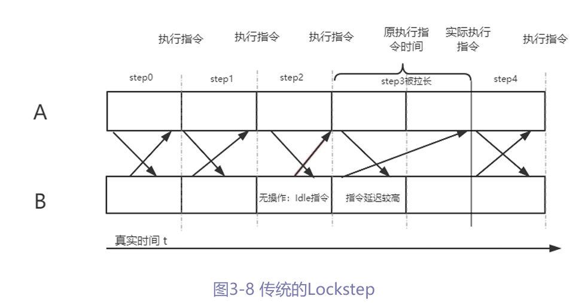

​	换个角度来看，假如一场游戏持续了20分钟，不考虑延迟的情况下整场游戏就是12000个 回合（所有客户端都是如此）。现在我们反过去给每个回合添加指令，确保每个回合都收集 到所有玩家的指令，那么就可以严格保证所有客户端每个回合的表现都是一样的。假如我们 再把这些指令都存储起来，那么就推演出整场比赛，这也是为什么lockstep为什么做回放系 统很容易。

​	至于lockstep为什么要发送指令而不是状态，其实是与当时的网络带宽有关。很多游戏都有 明确的人数限制（一般不超过10个人），玩家在每个回合能做的操作也有限甚至是不操 作，这样的条件下所有玩家的指令一共也占用不了多少带宽。如果换成同步每个角色的状态 数据，那么数据量可能会膨胀10倍不止。从原则上说，锁步数据既可以是游戏角色的状态 信息也可以是玩家的操作指令，只不过由于各种原因没有采取状态数据罢了。在下一章，我 还会对状态同步做进一步的讲解，他与lockstep的发展是相辅相成的，也不是网上常说的那 种对立关系。

```
//lockstep操作指令的结构体
struct Input
 {
 bool up;
 bool down;
 bool left;
 bool right;
 bool space;
 bool Z;
 };
```

​	仔细分析一下lockstep，其实就能发现不少缺点。首当其冲的就是网络条件较差的客户端很 容易影响其他玩家的游戏体验。为了尽可能保证所有玩家的游戏体验，开发者们不断的对游 戏进行更深一步的分析，先后提出了各种优化手段和算法，包括使用乐观帧锁定，把渲染与 同步逻辑拆开，客户端预执行，将指令流水线化，操作回滚等。关于回滚还有很多细节[16] [18]，我会在下个章节里面进行更详细的阐述。

​	其次，lockstep的另一个问题就是很难保证命令一致的情况下，所有客户端的计算结果完全 一致，只要任何一个回出现了一点点的误差就可能像蝴蝶效应一样导致两个客户端后面的结 果截然不同。这个问题听起来容易，实际上执行起来却有很多容易被忽略的细节，比如RPC 的时序，浮点数计算的偏差，容器排序的不确定性，随机数值计算不统一等等。浮点数的计 算在不同硬件（跨平台更是如此）上很难保持一致的，可以考虑转换为定点数，随机计算保 持各个端的随机种子一定也可以解决，但是具体实现起来可能还有很多问题，需要踩坑之后 才能真正解决。


## 四、状态同步 State Synchronization 

​	上一篇我们曾提到，国内对“Lockstep”的翻译经常会引起一些初学者的误解。但好在网 上的参考文献和资料比较丰富的，查证起来还比较容易。反倒是当我开始仔细研究大家都耳 熟能详的“状态同步”时[21]，我竟然一时半会难以追溯其发展来源。可能是因为早期的技 术领域里面好像并没有这个概念，笔者能找到最早的关于状态同步的资料源于上世界90年 代的防火墙产品——FireWalls-1[22][23][24]。这款产品出自公司Check Point，是第一个 使用状态检测（stateful inspection）的商业防火墙软件。其中的stateful inspection表示 让多个防火墙共享各自状态表中包含的信息，这种信息传递的方式与我们游戏中的状态同步 非常相似。由此可见，状态同步与Lockstep一样，也是经历了一个相对漫长的时间才发展 成如今我们熟知的模样。


在二十年前，相比于使用帧同步（为了方便描述，后续的文章中以帧同步代替Lockstep） 还是状态同步，开发者们更关心的是网络架构的实现方式（P2P/CS)。换句话讲，在当时业 内看来，P2P架构的同步模型虽然减少了延迟，但由于作弊、跨平台、难以维护大型网络游戏等问题，人们更希望用CS架构来取代P2P。同时，开发者们虽然可以继续在CS架构下使 用逻辑比较简洁的帧同步，但有不少开发者都认为刚刚诞生的状态同步貌似更符合CS架构 的同步理念。

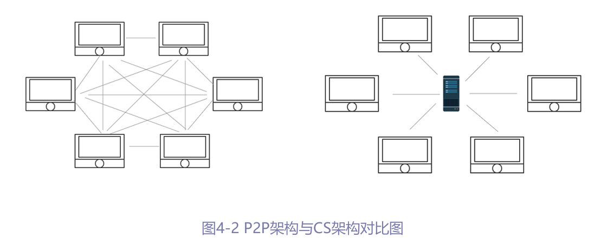

​	需要强调的是，帧同步与状态同步并不是一个简单的对立概念，其中的差异包括“数据格式 与内容”，“逻辑的计算位置”，“是否有权威服务器”等 。随着时间的推进，两种算法 互相借鉴互相发展，早已不是当年的样子。网上存在很多概念模糊的文章，包括一些大佬对 同步的概念理解也有偏差，这些都很容易对新手产生误导。所以笔者建议，如果你想真正的 了解或者学习网络同步，不妨跟着这篇文章去了解二者的发展历史，相信看过后的你一定能 更深刻的理解到帧同步与状态同步的异同。（文末同上篇一样贴出了大量的文献内容）


### 1.雷神之锤与快照同步（Quake and Snapshot）

​	快照是一个通用的行业术语，即在任何给定时刻记录设备的状态并在设备出现故障时进行还 原。快照技术常用于计算机的各种存储系统，例如逻辑卷管理、数据库、文件系统等。在游 戏领域中，快照的含义更像是照片一样，将当前场景所有的信息保存起来。严格来说，快照 同步应该属于状态同步的前身，虽然思想相似但是具体实现却有不小的差异。

​	1996年，在doom发行不久后，Id software就公开了新作——雷神之锤（Quake）。在 Quake里他们舍弃了之前的P2P而改用CS架构，同时也舍弃了lockstep的同步方式。新的 架构下，客户端就是一个纯粹的渲染器(称为Dumb Client)，每一帧玩家所有的操作信息都 会被收集并发送到服务器，然后服务器将计算后的结果压缩后发给客户端来告知他们有哪些 角色可以显示，显示在什么位置上。

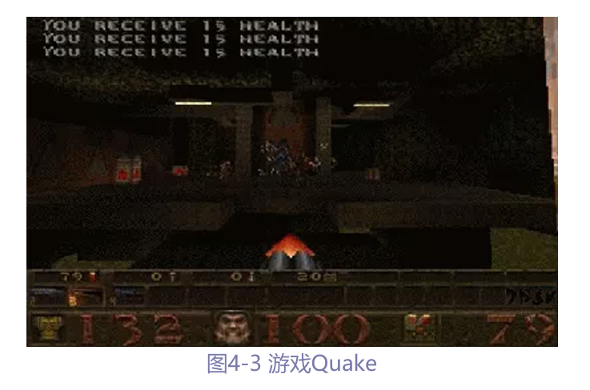 

​	上述的这个过程就是我们所说的快照同步，即服务器每帧接受客户端的输入来计算整个世界的状态，然后将结果快照发送给所有客户端。Quake这里所谓的快照，就是把整个游戏世 界里面所有对象的状态做一次临时保存（他更强调的是对象的可视化状态，比如位置和旋转 等）。通过这个快照，我们可以还原出这一刻世界的状态应该是什么样子的。

​	Quake运行时，逻辑帧率与渲染帧率是保持一致的。由于所有的核心逻辑都是在服务器进行，所以也不需要通过锁步来避免客户端不同步的问题，只要在收到服务器消息后执行渲染 就好了。当然，对于性能以及网络环境较差的玩家来说，游戏体验仍然很糟糕。因为你按下 一个按钮后，可能很长时间都没有反应，当收到服务器的快照消息后，你可能已经被网络好 的玩家击杀了。

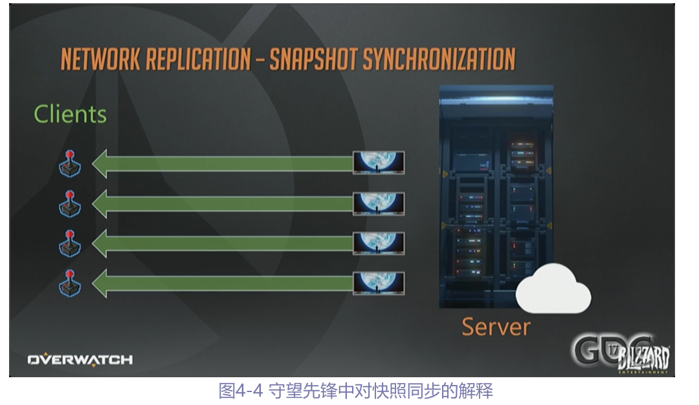


### 2.《星际围城：部落》引擎中的网络架构  （The TRIBES Engine Networking Model）

IdSoftware自2012年以来已经陆续把Quake以及Doom相关的源码上传到了GitHub上面 [25]。如果你看过其中Quake的源码，会发现整个网络的架构还是比较简单清晰的，博主 FABIEN SANGLARD就在网上分享了关于Quake源码的剖析[26]（还有很多其他项目的源 码剖析）。

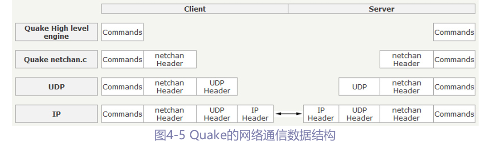


​	但Quake里面由于客户端只是一个简单的渲染器，同步过程中会出现很多明显的问题，比 如延迟过大，客户端性能浪费，服务器压力大等。而其中最明显的问题就是对带宽的浪费， 对于一个物体和角色比较少的游戏，可以使用快照将整个世界的状态都存储并发送，但是一旦物体数量多了起来，带宽占用就会直线上升。所以，我们希望不要每帧都把整个世界的数 据都发过去，而是只发送那些产生变化的对象数据（可以称为增量快照同步）。更进一步 的，我们还希望将数据拆分的更细一些，并根据客户端的特点来定制发送不同的数据。基于 这种思想，《星际部落：围攻》团队的开发者们开始对网络架构进行抽象和分层，构造出来 一套比较完善的"状态同步"系统并以此开发出了Tribe游戏系列。 The TRIBES Engine可以认为是第一个实现状态同步的游戏引擎，《星际部落：围攻》也可 以认为是第一个比较完美的实现了状态同步的游戏。

```
//client
WinMain{
  while (1)
  {
  	newtime = Sys_DoubleTime ();
  	time = newtime ‐ oldtime;
  	Host_Frame (time){
  		setjmp
  		Sys_SendKeyEvents
  		IN_Commands
  		Cbuf_Execute
  		/* Network */
  		CL_ReadPackets
  		CL_SendCmd
        /* Prediction//Collision */
        CL_SetUpPlayerPrediction(false)
        CL_PredictMove
        CL_SetUpPlayerPrediction(true)
        CL_EmitEntities
        /* Rendition */
        SCR_UpdateScreen
  	}
  oldtime = newtime;
  }
}
```

​	但Quake里面由于客户端只是一个简单的渲染器，同步过程中会出现很多明显的问题，比 如延迟过大，客户端性能浪费，服务器压力大等。而其中最明显的问题就是对带宽的浪费， 对于一个物体和角色比较少的游戏，可以使用快照将整个世界的状态都存储并发送，但是一 旦物体数量多了起来，带宽占用就会直线上升。所以，我们希望不要每帧都把整个世界的数 据都发过去，而是只发送那些产生变化的对象数据（可以称为增量快照同步）。更进一步 的，我们还希望将数据拆分的更细一些，并根据客户端的特点来定制发送不同的数据。基于 这种思想，《星际部落：围攻》团队的开发者们开始对网络架构进行抽象和分层，构造出来 一套比较完善的"状态同步"系统并以此开发出了Tribe游戏系列。 The TRIBES Engine可以认为是第一个实现状态同步的游戏引擎，《星际部落：围攻》也可 以认为是第一个比较完美的实现了状态同步的游戏。

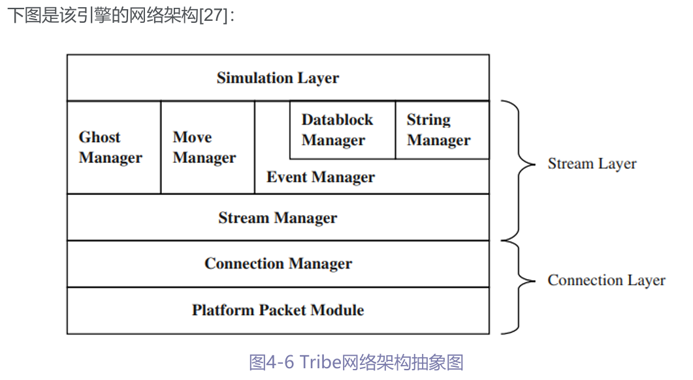

平台数据包模块（Platform Packet Module）可以理解成被封装的Socket模块，连接管理 器（Connection Manager）处理多个客户端与服务器的连接，流管理器（Stream Manager）负责将具体的数据分发到上面的三个高级管理器。

- Ghost管理器：负责向客户端发送需要同步对象的状态信息，类似属性同步。 
- 事件管理器：维护事件队列，每个事件相当于一个的RPC。 
- 移动管理器：本质上与事件管理器相同，但是由于移动数据的需要高频的捕捉和 发送，所以单独封装成一个特殊的管理器。


### 3.客户端预测与回滚（Client-side prediction and Rollback）

​	《毁灭公爵》是上世纪90年代一个经典的FPS游戏系列，首部作品的发布时间与Doom几乎 相同，网络架构也极为相似。在1996年发布的《毁灭公爵3D》里面，为了提高客户端的表 现与响应速度，他放弃了“Dumb客户端”的方案并首次采用客户端预测来进行优化（这里 主要指移动预测）[28]。即在服务器确认输入并更新游戏状态之前，让客户端立即对用户输 入进行本地响应。由于这种方式可以大大的降低网络延迟所带来的困扰，很快的Quake也 开始参考对网络架构进行的大刀阔斧的修改。在1997年发布的更新版本QuakeWorld里面 [29] [30]，Quake添加了对互联网对战的支持以及客户端预测等新的内容。

​	关于预测，其实就是本地先执行，所以并不需要什么特别的算法，反倒是预测后的客户端与 服务器的同步处理有很多值得优化的地方。由于玩家的行为是没办法完全预测的，所以你不 知道玩家会在什么时候突然停下或者转弯，所以经常会发生预测失败的情况。

​	如果玩家本地的预测结果与服务器几乎一致，那么我们认为预测是成功且有效的，玩家不会 受到任何影响，可以继续操作。反之，如果客户端结果与服务器不一致，我们应该如何处理 呢？这里分为两种情况。

​	一.在没有时间戳的条件下，收到了一条过时的服务器位置数据。你在本地的行为相比服务 器是超前的，假如你在time=10ms的和time=50ms时候分别发送了一条指令。由于网络延 迟的存在，当你已经执行完第二个指令的时候才收到服务器对第一条指令的位置同步。很明 显，我们不应该让过时的服务器数据来纠正你当前的逻辑。解决方法就是在每个指令发出的 时候带上他的时间戳，这样客户端收到服务器反馈的时候就知道他处理的是哪条指令信息。

​	二.假如我们在指令里面添加了时间戳的信息，并收到了一条过时的服务器位置数据。在上 一篇文章里我们提到了TimeWarp算法，即当一个对象收到了一个过去某个时刻应该执行的 事件时，他应该回滚到那个时刻的状态，并且回滚前面所有的行为与状态（包括取消之前行 为所产生的事件）。这个时候我们可以用类似的方法在本地进行纠正，大体的方案就是把玩 家本地预执行的指令都记录好时间戳并存放到一个MOVE BUFFER列表里（类似一个滑动窗 口）。如果服务器的计算结果与你本地预测相同，可以回复你一个ACKMOVE。如果服务器 发现你的某个移动位置有问题时，会把该指令的时间戳以及正确的位置打包发给你。当你收 到ACKMOVE的时候，你可以把MOVE BUFFER里面的数据从表里面移除，而当你收到错误 纠正信息时就需要本地回滚到服务器指定的位置同时把错误时刻后面MOVE BUFFER里面的 指令重新执行一遍。这里读者可能会产生一个疑问——为什么不直接拉回？因为这时候他 想纠正的是之前的错误而不是现在的错误，如果简单的拉回就会让你觉得被莫名其妙的拉回 到以前的一个位置。同时，考虑到已经在路上的指令以及后续你要发送的预测指令，会让服 务器后续的校验与纠正变得复杂且奇怪，具体流程细节可以参考下图。另外，Gabriel Gambetta博主在他的文章中，也对这种情况进行了简单的分析[31]。

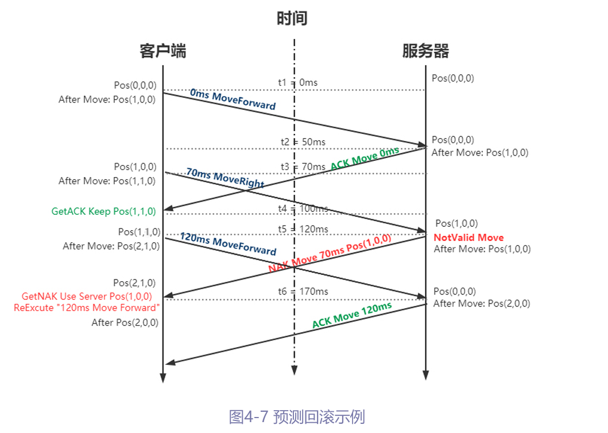

关于TimeWarp算法的补充：Timewarp技术最早出现于仿真模拟中[32]，我们可以认为这 些仿真程序中采用的是“以事件驱动的帧同步”。也就是说，给出一个指令，他就会产生并 触发多个事件，这些事件可能进而触发更多的事件来驱动程序，同理取消一个过去发生的事 件也需要产生一个新的取消事件才行。这样造成的问题就是回滚前面的N个操作，就需要产 生N个新的对抗事件，而且这N个事件还需要发送到所有其他的客户端执行。如果这N个事 件又产生了新的事件，那么整个回滚的操作就显得复杂了很多。换成前面移动的例子来解释 一下，就是客户端收到服务器的纠正后，他会立刻发送回滚命令告诉（P2P架构下）所有其 他客户端，我要取消前面的操作，然后其他客户端在本地也执行回滚。而在如今的CS架构 状态同步的方式下，服务器可能早就拒绝了客户端的不合法行为，所以并不需要处理回滚 （同理，其他客户端也是）。所以严格来说，TimeWarp技术以及优化后的 BreathTimeWarp技术[33]都是针对“以事件驱动的帧同步”，并不能与预测回滚这套方案 完全等价。当然，随着时间的推移，很多概念也变的逐渐宽泛一些，我们平时提到的时间回 溯TimeWarp技术大体上与快照回滚是一个意思的。


### 4.事件锁定与时钟同步(Event Locking and Clock Synchronization)

1997年，Jim Greer与Zack Booth Simpson在开发出了他们第一款基于CS架构的RTS游戏 ——”NetStorm：Island at war“。随后在发布的文章中又提出了“事件锁定”这一概念[34]，相 比帧同步会受到其他客户端延迟的影响，事件锁定是基于事件队列严格按序执行的，客户端 只管发消息然后等待服务器的响应即可，其他时候本地正常模拟，不需要等待。在目前常见 的游戏中，我们很少会听说到事件锁定这种同步方式，因为事件锁定的本质就是通过RPC产 生事件从而进行同步（也就是排除属性同步的状态同步）。事件锁定在CS架构上是非常自 然的，相比帧同步，可以定义并发送更灵活的信息，也不必再担心作弊的问题。

不过，由于事件中经常会含有时间相关的信息（比如在X秒进行开火）以及服务器需要对客 户端的不合法操作进行纠正，所以我们需要尽可能的保持客户端与服务器的时钟同步。实现 时钟同步最常见且广泛的方式就是网络时间协议（Network Time Protocol，简称NTP） [35]，NTP属于应用层协议下层采用UDP实现，1979年诞生以来至今仍被应用在多个计算 机领域里，包括嵌入式系统时间、通信计费、Windows时间服务以及部分游戏等。NTP使 用了一种树状、半分层的网络结构来部署时钟服务器，每个UDP数据包内包含多个时间戳 以及一些标记信息用来多次校验与分析，

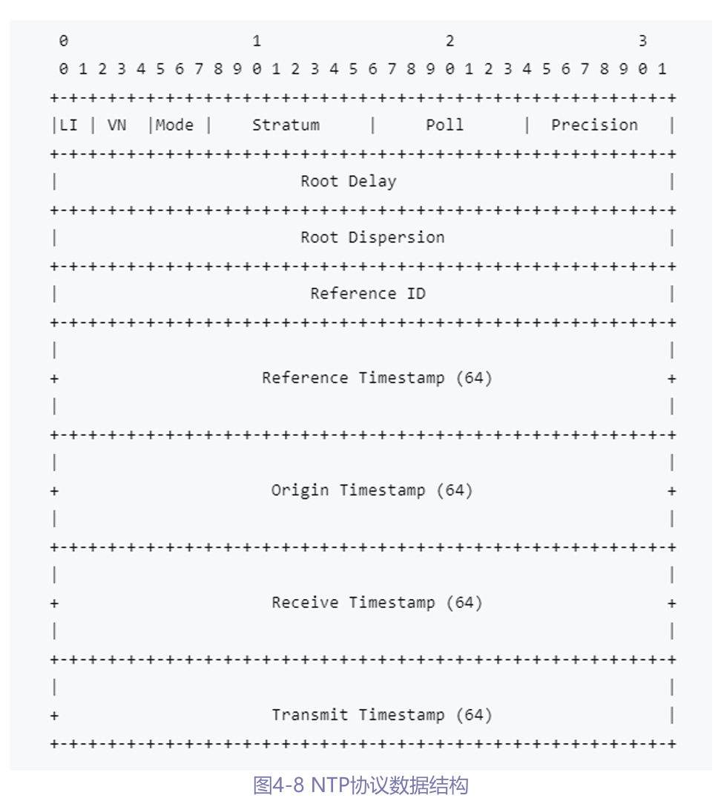 

整个时钟同步的具体算法涉及到非常多的细节，我们这里只考虑他的时钟同步算法（其他的 内容请参考历年的RFC）：

假如一个服务器与客户端通信，客户端在t 0向服务器发送数据，服务器在 t 1收到数据， t 2 响应并回包给客户端，最后客户端在 t 3时间收到了服务器的数据。

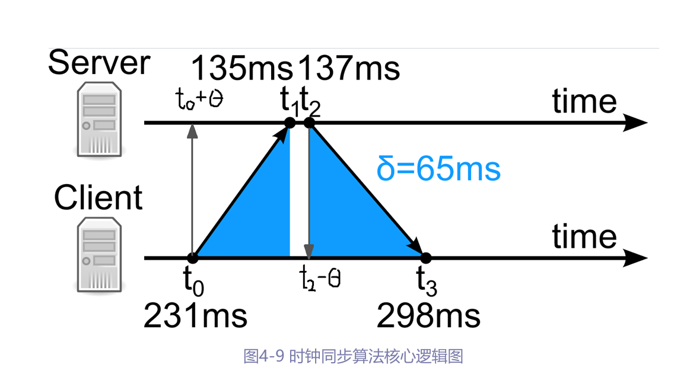

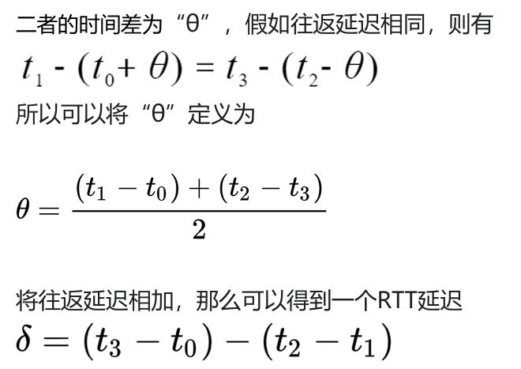 

当然，该操作不会只执行一次，客户端会同时请求多个服务器，然后对结果进行统计分析、 过滤，并从最好的三个剩余候选中估算时间差，然后调整时钟频率来逐渐减小偏移。如果我 们的系统对精度要求不是非常高，我们还可以使用简化版的SNTP(Simple Network Time Protocal），时钟同步算法与NTP是相同的，不过简化了一些流程。

不过无论是NTP还是SNTP，对于游戏来说都过于复杂（而且只能用UDP实现）。因此Jim Greer等人提出了“消除高阶的流式时间同步”，流程如下：

- 客户端把当前本地时间附在一个时间请求数据包上，然后发送给服务器 2
- .服务器收到以后，服务器附上服务器时间戳然后发回给客户端 
- 客户端收到之后，用当前时间减去发送时间除以2得到延迟。再用当前时间减去服 务器时间得到客户端和服务端时间差，再加上半个延迟得到正确的时钟差异 delta= (Currenttime - senttime)/2 
- 第一个结果应该立刻被用于更新时钟，可以保证本地时间和服务器时间大致一致
- 客户端重复步骤1至3多次，每次间隔几秒钟。期间可以继续发送其他数据包的， 但是为了结果精确应该尽量少发 
- 每个包的时间差存储起来并排序，然后取中位数作为中间值 7. 丢弃和中间值偏差过大（超出一个标准偏差，或者 超过中间值1.5倍）的样例，然 后对剩余样例取算术平均

上述算法精髓在于丢弃和中间值偏差超过一个标准偏差的数值。其目的是为了去除TCP中重 传的数据包。举例来说，如果通过TCP发送了10个数据包，而且没有重传。这时延迟数据将 集中在延迟的中位数附近。假如另一个测试中，如果其中第10个数据包被重传了，重传将 导致这次的采样在延迟柱状图中极右端，处于延迟中位数两倍的位置。通过直接去掉超出中 位数一个标准偏差的样例，可以过滤掉因重传导致的不准确样例。（排除网络很差重传频繁 发生的情况）


### 5.插值技术 （Interpolation and Extrapolation ）

插值技术在早期的帧同步就被应用到游戏里面了。或者说更早的时候就被应用到军事模拟， 路径导航等场景中。插值分为内插值[36]（ interpolation ）以及外插值[37] （extrapolation，或者叫外推法）两种。内插值是一种通过已知的、离散的数据点，在范 围内推求新数据点的方法（重建连续的数据信息），常见于各种信号处理和图像处理。在这 篇文章中，我们指根据已知的离散点在一定时间内按照一定算法去模拟在点间的移动路径。 内插值具体的实现方法有很多，如

- 片段插值（Piecewise constant interpolation） 
- 线性插值（Linear interpolation） 
- 多项式插值（Polynomial interpolation） 
- 样条曲线插值（Spline interpolation） 
- 三角内插法（trigonometric interpolation） 
- 有理内插（rational interpolation） 
- 小波内插（wavelets interpolation）

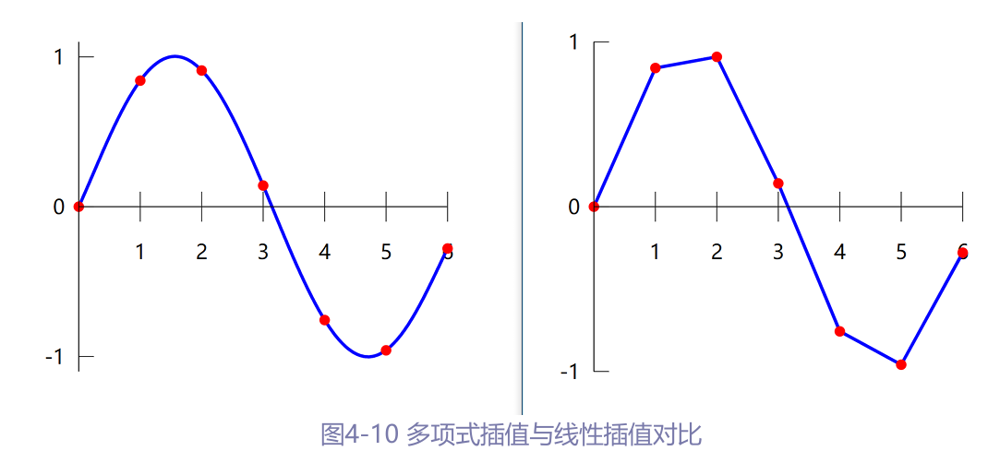

外插值，指从已知数据的离散集合中构建超出原始范围的新数据的方法，也可以指根据过去 和现在的发展趋势来推断未来，属于统计学上的概念。与外插值还有一个相似的概念称为 DeadReckoning（简称DR），即导航推测。DR是一种利用现在物体位置及速度推定未来 位置方向的航海技术，属于应用技术方向的概念。DR的概念更贴近游戏领域，即给定一个 点以及当前的方向等信息，推测其之后的移动路径，外推的算法也有很多种，

- 线性外推（Linear extrapolation） 
- 多项式外推（Polynomial extrapolation） 
- 锥形外推 （Conic extrapolation） 
- 云形外推 （French curve extrapolation）

在游戏中，一般按照线性外推或匀变速直线运动推测即可。不过，对于比较复杂的游戏类 型，我们也可以采用三次贝塞尔曲线、向心Catmull-Rom曲线等模拟预测。

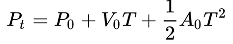 

总之，无论是内插值还是外插值，考虑到运算的复杂度以及表现要求，游戏中以线性插值、 简单的多项式插值为主。


插值技术的应用：

早期的lockstep算法中，在一个客户端在收到下一帧信息前，为了避免本地其他角色静止卡 顿，会采用外插值来推断其接下来一小段时间的移动路径[38] [39]。普通DR存在一个问题 （参考下图），t0时刻其他客户端收到了主机的同步信息预测向虚线的方向移动，不过主机 客户端却开始向红色路径方向移动，等其他客户端在t1时刻收到同步信息后会被突然拉倒 t1'的位置，这造成了玩家不好的游戏体验。为了解决从预测位置拉扯到真实位置造成的视 觉突变，我们会增加一些相应的算法来将预测对象平滑地移动到真实位置。

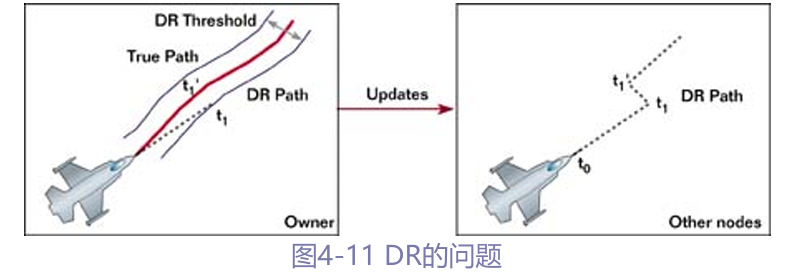

在状态同步中，由于客户端每次收到的是其他的角色的位置信息，为了避免位置突变，本地 会采用内插值来从A点过度到B点。插值的目的很简单，就是为了保证在同步数据到来之前 让本地的角色能有流畅的表现。


### 6.延迟补偿（Lag Compensation）

2001年，Valve的新作《半条命》发布，打破了传统FPS游戏玩法。不久之后，其Mod《反 恐精英》更是火遍了全球并作为独立游戏发布出去。 由于半条命是基于“QuakeII引擎修改的GoldSrc引擎”开发，所以游戏同样采用了CS架构 以及状态同步。不过，为了能达到他们心中理想的效果，半条命在网络同步上做出了不小的 改动。首先，半条命也采用了客户端预测逻辑来保证本地玩家能够有流畅的手感，同时为了 让客户端提高预测准确率（保证客户端与服务器上的代码逻辑一致），所以半条命里面他们 让客户端与服务器执行的是同一套代码。其次，考虑到本地玩家的时间总是领先服务器，玩 家开枪的时间到服务器执行时就一定会被延迟，所以为了尽量减小延迟所带来的问题，他们 提出了一种名为延迟补偿的技术。

所谓**延迟补偿**[40]，就是弥补客户端到服务器同步延迟的一项技术，该技术的核心是服务器 在指定时刻对玩家角色进行位置的回滚与计算处理。假如客户端到服务器的延迟为Xms。当 客户端玩家开枪时，这个操作同步会在Xms后到达服务器，服务器这时候计算命中就已经出 现了延迟。为了得到更准确的结果，服务器会在定时记录所有玩家的位置，当收到一个客户 端开枪事件后，他会立刻把所有玩家回退到Xms前的位置并计算是否命中（注意：计算后服 务器立刻还原其位置），从而抵消延迟带来的问题。

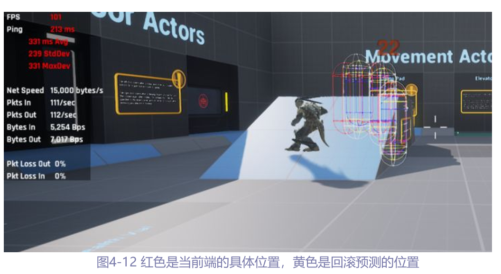

​	不过，延迟补偿并不是一个万能的优化方式，采用与否应该由游戏的类型与设计决定。考虑 一个ACT类型的网游，玩家A延迟比较低、玩家B延迟比较高。在A的客户端上，玩家A在T1 时间靠近B，而后立刻执行了一个后滚操作，发送到服务器。在B的客户端上，同样在T1时 间发起进攻，然后发送命令到服务器。由于A的延迟低，服务器先收到了A的指令，A开始 后滚操作，这时候A已经脱离了B的攻击范围。然后当B的指令到达服务器的时候，如果采用 延迟补偿，就需要把A回滚到之前的位置结果就是A收到了B的攻击，这对A来说显然是不公 平的。如果该情况发生在FPS里面，就不会有很大的问题，因为A根本不知道B什么时候瞄准 的A。

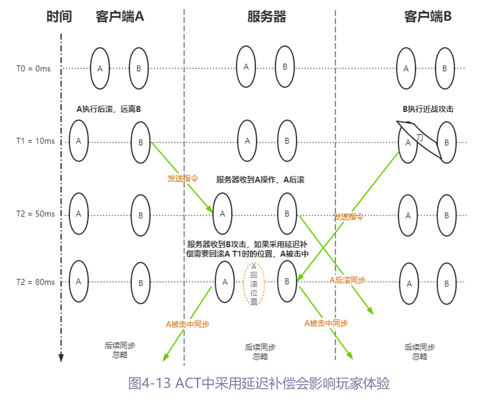


### 7.Trailing state synchronization

 2004年，Eric Cronin等人在传统的Timewrap的回滚方式上提出了Trailing state synchronization算法[41]（TSS）。在他们看来，TimeWarp需要频繁的生成游戏快照进而 占用大量内存（每次发送命令前都要生成一份），而且每次遇到过期信息就立刻回滚并可能 产生大量的对冲事件（anti-message）。这种同步方式是不适合Quake这种类型的FPS游 戏的。

在TSS算法中，游戏的快照不是随每个命令产生，而是以某种延迟(比如100ms)间隔为单位 对游戏做快照。他事先保存了N个完整的游戏状态（快照）以及命令链表，让这N个状态以 不同的延迟去模拟推进。游戏中延迟最低且被采用的状态称为Leading State，其他的称为 Trailing State，每个状态都记录着一个命令链表（执行的以及未执行的），各个状态的延 迟间隔由开发者设定。Leading State向前推进的时候会不断的收到其他端的指令并添加到 PendingCommands里面，如果某个命令的执行时间小于当前已经推进到的时间（比如图 4-14 CommandB指令在时间225ms才被Leading State执行），就会放在表的最前面立刻 执行，这时候其实我们已经知道这个命令已经由于延迟错过正常执行时间，可能要进行回滚 操作了。但是对于后续的Trailing State，这些过期Commands是可以被放到正确的位置 的。当Trailing State执行到某个命令且发现Leading State在对应的位置没有这个命令的 话，他就会触发回滚（如果该命令对当前游戏无影响，其实也可以不回滚），将当前 Trailing State的状态信息拷贝到Leading State里面，然后设置错误命令时间至当前本地执 行时间的所有命令为pending状态，触发这些状态的重新执行。

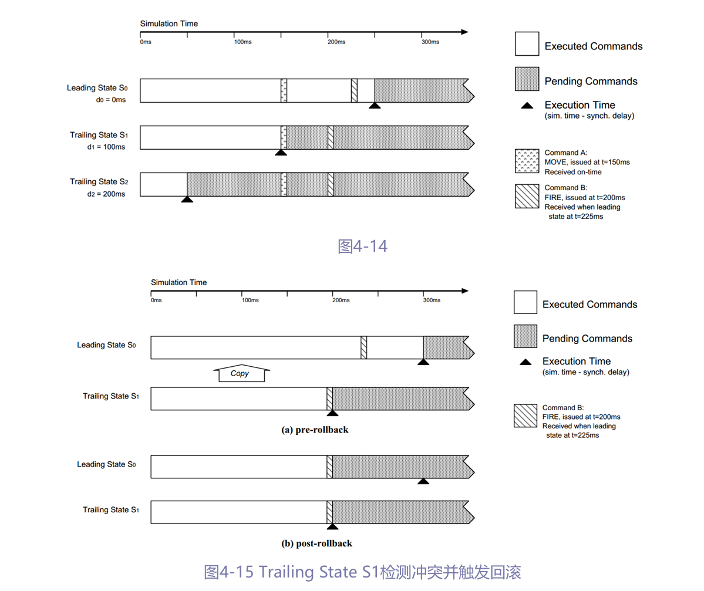

TSS相比TimeWarp，最大的优势就是大大降低了快照的记录频率（由原来的按事件记录改 为按延迟时间分开记录），同时他可以避免由于网络延迟造成的连续多次指令错误而不断回 滚的问题（Leading State不负责触发回滚，Trailing State检测并触发）。 不过TSS同时维护了多个游戏世界的快照，也无形中增加了逻辑的复杂度，在最近几年的网 络游戏中也并没有看到哪个游戏使用了这种同步算法。在我看来，其实我们不必将整个世界 的快照都记录，只要处理好移动的快照同时使用服务器状态同步就可以满足大部分情况了。


### 8.状态同步框架的演变

在2011年的GDC上，光环（Halo）项目的网络技术负责人David Aldridge就其网络同步框 架发表了一次演讲。通过视频[42]，可以看到David同样借鉴了TribeEngine的网络架构并 在此基础上进行更多细节的调整

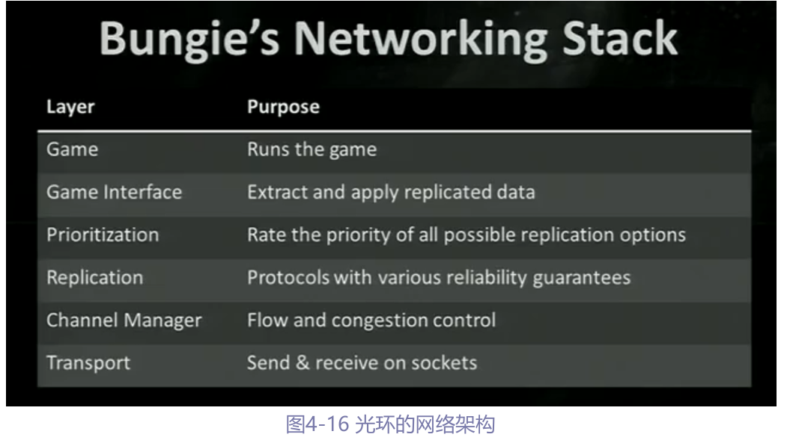

光环项目的网络架构同样被分层，但相比Tribe却更加简洁和精炼。上图的Replication层是 Gameplay开发中比较重视的，他决定了我们逻辑上层可用的同步手段。Halo里面有三种基 本协议，State Data、Event、ControlData，分别是指“基于对象的属性同步”、“通过 调用产生的事件同步”以及“玩家的输入信息同步”，其中移动同步归类于ControlData协 议。 

2015年，游戏业内著名的商业引擎——Unreal Engine正式开源，其中内置了一套非常完 善的网络同步架构[43]。

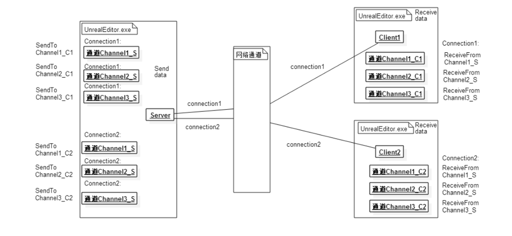

图4-17 UE4的网络通信架构

虚幻引擎的前身是FPS游戏——“虚幻竞技场”。该游戏早在1998年就发布，当时与 Quake属于同类型的竞品。虚幻本身也是基于CS架构的状态同步，不过由于无法查找到当 时的资料，笔者认为一开始可能也是与Quake非常相似的同步架构。后来在参考Tribe引擎 的基础上，进行调整和优化，形成了如今的Netdriver/Connection/Channel/Uobject的模 型，以及RPC和属性同步两种同步方式，这已经是网络同步发展至今非常典型且完善的状态 同步方案了（后面要提到的OverWatch与其有很多相似之处）。作为一款游戏引擎，虚幻 并没有将所有常见的同步手段都集成到引擎里面，只是将移动相关的优化方案（包括预测回 滚、插值等）集成到了移动组件里面。其他的诸如延迟补偿，客户端预测等，他们放到了特 定的Demo以及插件（GameplayAbility）当中。有兴趣的朋友可以去阅读一些Unreal的源 码，看看最近几年其网络架构的发展变化。

[使用虚幻引擎4年，我想再谈谈他的网络架构【经验总结】 - 知乎 (zhihu.com)](https://zhuanlan.zhihu.com/p/105040792)

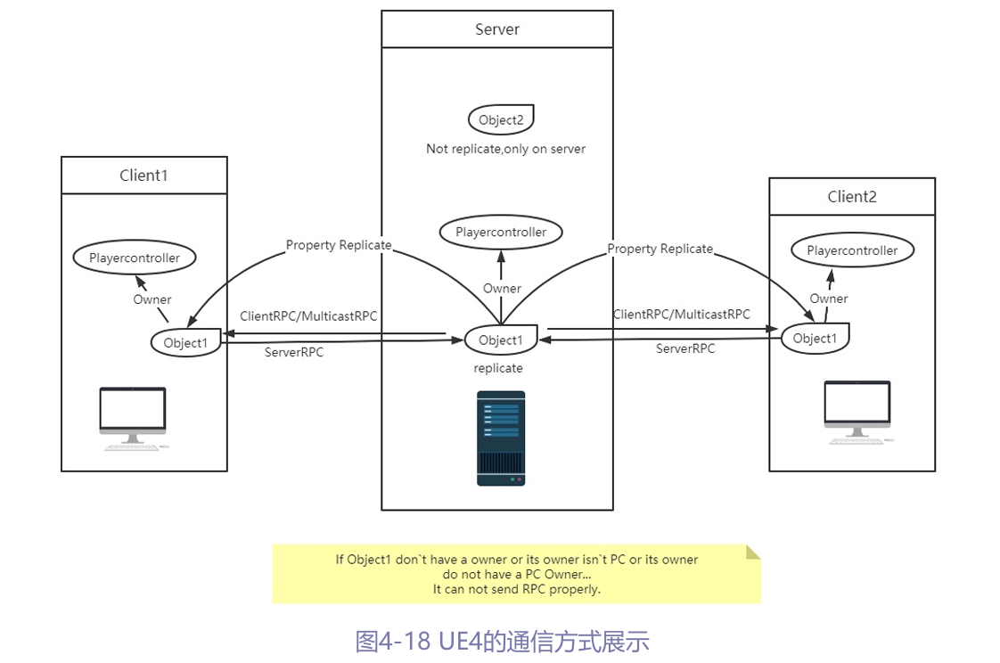


### 9.守望先锋与ECS架构

守望先锋可以说是近年来将网络同步优化到极致的FPS游戏，其中涵盖了我们可以用到的大 部分同步优化技术。在2018年的GDC上，来自守望先锋的Gameplay程序TimFord分享了 整个游戏的架构以及网络同步的实现方式[45]。 虽然OverWatch基于CS架构，但是却同时用到了帧同步（逻辑帧概念）以及状态同步包含 的多种技术手段。为了实现确定性，他们固定了更新周期为16毫秒（电竞比赛时7毫秒）， 每个周期称为一个“命令帧”（等同于Lockstep中的“Turn”、“Bucket”）。在所有与 客户端预表现和玩家行为有关的操作不会放在Update而是放在固定周期的UpdateFixed里 更新，方便客户端预测与回滚。不过，整个游戏同步的核心还是状态同步，玩家也并不需要 等待其他客户端的行为。

**先用一句话来简单概括，守望先锋采用的是基于ECS架构的带有预测回滚的增量状态同步。**

我们先从Gameplay层面去分析一下。在守望里面，网络同步要解决的问题被分为三部分， 分别是玩家移动，技能行为以及命中检测。 

**移动模块**，客户端本地会不断读取输入并立刻进行角色移动的模拟，他会在客户端记录一个 缓冲区来保存历史的运动轨迹（即运动快照），用于后续与服务器纠正数据进行对比以及回 滚。 

**技能行为模块**，客户端添加了一个buffer来存储玩家的输入操作（带有命令帧的序号），同 时保留历史的技能快照。一旦服务器发现客户端预测执行失败，就会让客户端先通过快照回 滚到错误时刻（包括移动和技能），然后把错误时刻到当前时间的所有输入都重执行一遍。

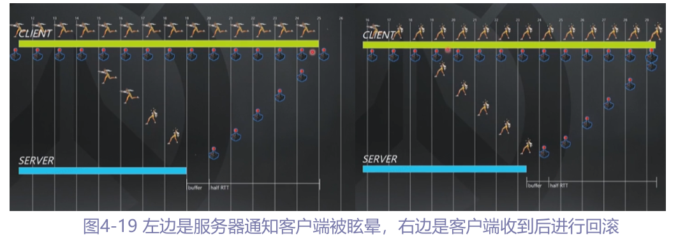

命中模块，伤害计算在服务器，但是命中判定是在客户端处理（所以可能存在一些误差）。 延迟补偿技术也被采用，但是不是在服务器回滚所有玩家的位置，而是检测当前玩家的准星 与附近敌人的逻辑边界（bounding volumes）是否有交集，没有的话不需要回滚。

为了增强玩家的游戏体验，游戏还对不同ping的玩家进行了逻辑的调整。ping值会影响本 地的预测行为，一旦PING值超过220毫秒，我们就会延后一些命中效果，也不会再去预测 了，直接等服务器回包确认。PING为0的时候，对弹道碰撞做了预测，而击中点和血条没有 预测，要等服务器回包才渲染。

当PING达到300毫秒的时候，碰撞都不预测了，因为射击目标正在做快读的外插，他实际 上根本没在这里，这里也用到了前面提到的DR（Dead Reckoning）外推算法。

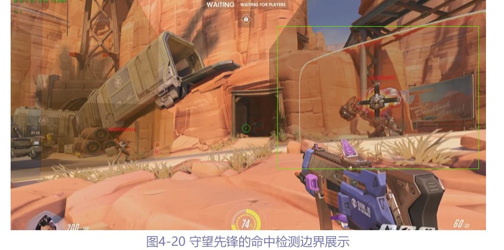

谈完Gameplay，我们可以再考虑一下他的状态同步是如何实现的。同样在2018年的GDC 上，来自Overwatch服务器团队的开发工程师Phil Orwig分享了有关回放与同步的相关技 术细节[46]。

客户端玩家操作后，这些指令会立刻发给服务器，同时本地开始执行预测。随后，服务器会 将这一帧收到的所有玩家的输入进行处理和计算。在服务器上，每个对象产生的变化都会被 记做一个Delta，并且会持续累积所有对象状态的变化并保存到一个临时的“每帧脏数据集 合”(per frame dirty set)里。同时，服务器会对给每个客户端（每个Connection）也会维 护一个对应的“脏数据集合”，这个集合可能保存一些之前没有发送出去的信息（如下图的 C1是到客户端1的，C2是到客户端2的）。每帧结束时，所有客户端对应的“脏数据集 合”会与当前脏集合F合并，随后当前脏集合F会被清空。


同一个Tick的后期，这些对应不同客户端连接的脏集合（C1、C2等）会被序列化并发送给 对应的客户端，同时从脏集合中移除。这里的序列化并不是完全使用原生的状态数据，而是 维护了一个经客户端确认收到的状态数据的历史记录（比如我们服务器上已经记录了玩家的 大部分信息，每次位置变化只序列化位置信息就可以了），这样我们就可以使用“增量编 码”来改善带宽模型，即减少带宽的占用。

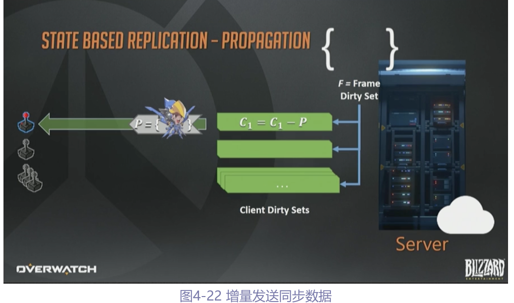

通过前面的分析，我们可以了解到整个网络同步的逻辑是很复杂的，细节也非常多。所以， 我们也需要考虑是否能从底层和框架上做一些调整和优化。在守望先锋里面，他们并没有采 用常见的面向对象模型（OOP），而是使用了数据与操作行为分离的ECS架构[47]。Entity 代表一个空的实体、Component代表一个只包含数据的组件、System代表一个处理数据 的系统。在这个架构下，我们将面向对象编程转为面向数据编程，游戏的不同模块可以划分 成不同的系统，每个模块只关心自己需要的数据（Component），这种模式下可以方便我 们处理快照与回滚的逻辑。ECS系统看起来有着缓存友好、逻辑解耦等优点，但是操作起来 问题也不少，其中最难处理的一个问题就是如何控制System 运作的次序。

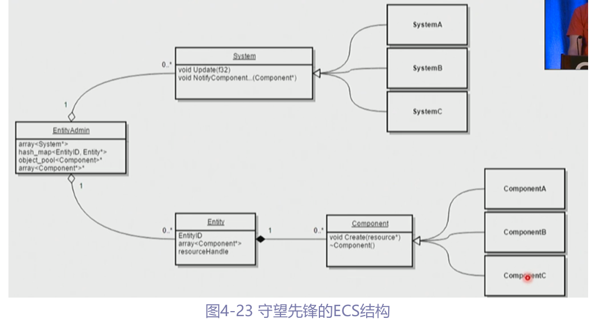

最后，简单说一下底层的一些优化。为了提高通信效率，守望也采用定制的可靠UDP，因 此会有不可避免的丢包情况。为了对抗丢包，每一帧的数据包包含的是最近N帧的数据，即 使某一个数据包丢了也没什么影响。除此之外，他们还在服务器添加了一个缓冲区，记录玩 家的输入信息。缓冲区越大，就能容忍越多的丢包，但是也意味着同步延迟越大。所以，在 网络条件良好的情况下，他们会尽力减小这个缓冲区的大小，而一旦客户端丢包，那么就可 以提高客户端发送数据频率，进而服务器收到更多的包，缓存更多的数据用于抵消丢包。

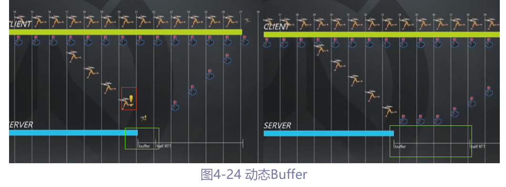


### 10.状态同步小结

状态同步大概在上世纪末就已经诞生（相比帧同步要晚一些），然而至今却没有一个完整的 定义。不过单从名字上看，我们也能猜到“状态同步”同步的是对象的状态信息，如角色的 位置、生命值等。

在Quake诞生前，其实也存在直接传输游戏对象状态的游戏，但是那时候游戏都比较简 单，相关的概念也并不清晰。当时的架构模型以P2P为主，考虑搭配带宽限制等原因，军事 模拟、FPS等游戏都采用了“Lockstep”的方式进行同步。

不过由于作弊问题日益严重、确定性实现困难重重等因素，CS架构逐渐代替P2P走向主流。 我们也发现似乎所有的游戏状态信息都可以保存在服务器上，客户端只需要接受服务器同步 过来的状态并渲染就可以了。按照这种思路，Quake诞生了，他抛弃了Doom的架构并带 着状态同步的方式进入我们的视野。这时候的状态同步还只是简单的快照同步，每次同步前 服务器都需要把整个游戏世界的状态信息打包发送给客户端。

然而，快照同步太浪费带宽了，不同的玩家在一段时间内只能在很小的范围内活动，根本没 有必要知道整个世界的状态。同时，每次发送的快照都与之前的快照有相当多重复的内容， 确实过于奢侈。因此，星际围城：部落的开发团队构建出了一个比较完善的状态同步系统， 用于对同步信息进行分类和过滤。

后来，光环、虚幻竞技场、守望先锋、Doom等游戏都在Tribe Engine的基础上不断完善状 态同步，形成了如今的架构模型。

如今距离状态同步的诞生已经20余年，当我们现在再讨论状态同步时，到底是指什么呢？ 我认为，如今的状态同步是指包含增量状态同步、RPC（事件同步）两种同步手段，并且可 以在各个端传递任何游戏信息（包括输入）的一种同步方式。

目前的状态同步多用于CS架构，客户端通过RPC向服务器发送指令信息，服务器通过属性 同步（增量状态同步）向客户端发送各个对象的状态信息。我们可以采用预测回滚、延迟补 偿、插值等优化方式，甚至也可以采用“命令帧”的方式对同步做限制。不过在这个过程 中，传递的内容以状态信息（即计算后的结果）为主，收到信息的另一端只需要和解同步过 来的状态即可，不需要在本地通过处理其他端的Input信息来进行持续的模拟。

最后，再次拿出虚幻引擎的网络同步模型来展示当今的状态同步。


## 五、物理同步

### 1.概念与理解

所谓“物理同步”，字面上讲就是“带有物理状态对象的网络同步”，严格上来说它并不是 一个标准的技术名词，而是大家约定俗成的一个概念。按照我的个人理解，可以进一步解释 为“在较为复杂的物理模拟环境或有物理引擎参与计算的游戏里，如何对持有物理状态信息 的对象做网络同步”。在英文中，我们可以使用Replicate physics-simulated objects 或 者Networked physics来表示类似的概念


不过，考虑到并不是所有物理现象都交给物理引擎处理，而且有物理引擎参与的网游也并不 一定需要对同步做任何处理，所以我们常说的物理同步更多的是指“在网络游戏中，如果玩 家的位置或者与玩家交互对象的位置需要经过物理引擎的模拟处理来得到结果，那么其中涉 及到网络同步技术就可以称为物理同步”。（这里的物理模拟一般指整个对象完全交给物理 引擎去计算碰撞、位置、约束等，很多情况下可以等价为对Ragdoll的模拟）

备注：物理一词涉及的范围非常广，在游戏里面应用的场景也很多，但是并不一定需要进行网络同 步，比如简单的抛物线运动，射线检测，与玩法无关的场景破碎等。

早在上世纪70年代，就诞生了许多围绕物理特性产生玩法的游戏，不过由于当时计算机系 统算力有限，涉及到的物理计算都非常简单（比如乒乓球游戏中小球的移动模拟[48]）。随 着计算机性能的飞速提升，开发者们考虑将环境中的所有对象都交由统一的物理模块驱动， 由此慢慢的催生出了通用的物理引擎[49]。很快的，各个游戏开发商逐渐将物理引擎集成进 来，将更多更复杂的物理模拟过程应用到游戏中，制作出了诸如极品飞车、FIFA、NBA、 愤怒的小鸟等围绕物理特性进行玩法设计的游戏。另一方面，随着计算机网络的发展，游戏 中的网络同步技术愈加成熟，网络游戏的品质也不断向单机游戏靠拢，我们也得以将传统的 单机游戏拓展成多人游戏。物理模拟作为提升游戏趣味性的一大技术也自然逐渐被纳入其 中，物理同步变得重要起来。

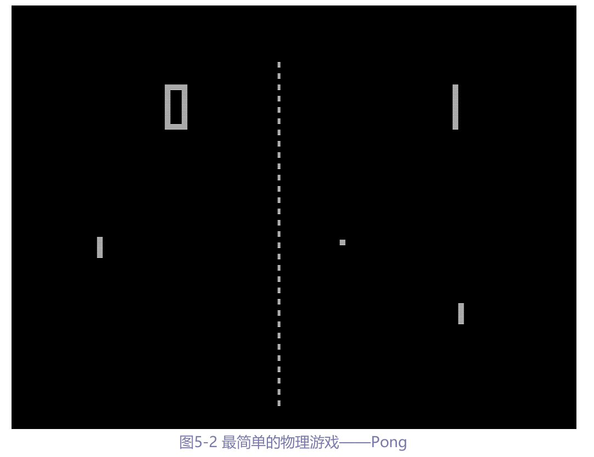


###  2.面临的问题与解决方案

正如所前面解释的那样，物理同步并不是一种特殊的同步方式，而是在物理引擎和网络同步 技术共同发展的条件下而诞生的一种综合行性解决方案，其核心手段还然是我们熟悉的帧同 步或者状态同步。使用帧同步技术我们需要每帧把玩家的Input信息发送出去，然后让另一 端的物理引擎根据输入去模拟结果。如果使用状态同步我们则需要本地模拟好数据并把物理 位置、旋转等关键信息发送到其他的客户端，然后其他客户端可以根据情况决定是否再执行 本地的物理模拟（如果是快照同步，由于拿到的就是最终的结果，那么就不需要本地再进行 模拟了）。

这样看来，物理同步好像与常规的同步也没什么本质上的区别，那么为什么他却是一个难题 呢？

我认为原因有以下两点： 

- 物理引擎的不确定性 
- 在物理引擎参与模拟的条件下，网络同步的微小误差很容易被迅速放大

**a.物理引擎的确定性问题**

首先，我们谈谈物理引擎的确定性问题。很不幸，目前所有的物理引擎严格来说都不是确定 性的，因为想保证不同平台、编译器、操作系统、编译版本的指令顺序以及浮点数精度完全 一致几乎是不可能的。关于物理确定性的讨论有很多[50]，核心问题大致可以归类为以下几 点： 1.编译器优化后的指令顺序 2.约束计算的顺序 3.不同版本、不同平台浮点数精度问题[51] [52]

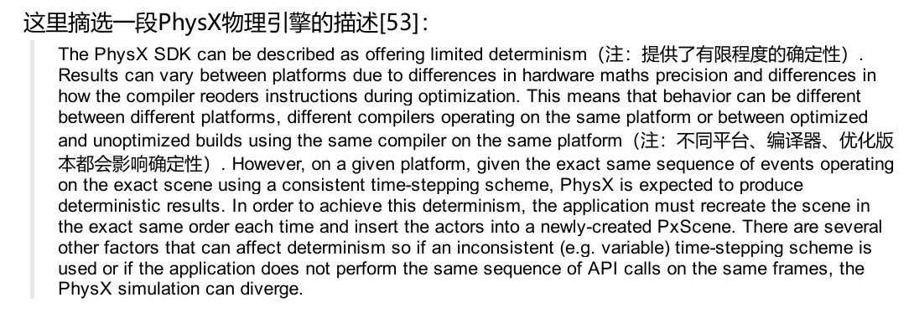

如果游戏只是单个平台上发行，市面上常见的物理引擎（Havok，PhysX，Bullet）基本上 都可以保证结果的一致性。因为我们可以通过使用同一个编译好的二进制文件、在完全相同 的操作系统上运行来保证指令顺序并解决浮点数精度问题，同时打开引擎的确定性开关来保 证约束的计算顺序（不过会影响性能），这也是很多测试者在使用Unity等商业引擎时发现 物理同步可以完美进行的原因。当然，这并不是说我们就完全放弃了跨平台确定性的目标， 比如Unity新推出的DOTS架构[54][55]正在尝试解决这个问题（虽然注释里面仍然鲜明的写 着“Reserved for future”）。

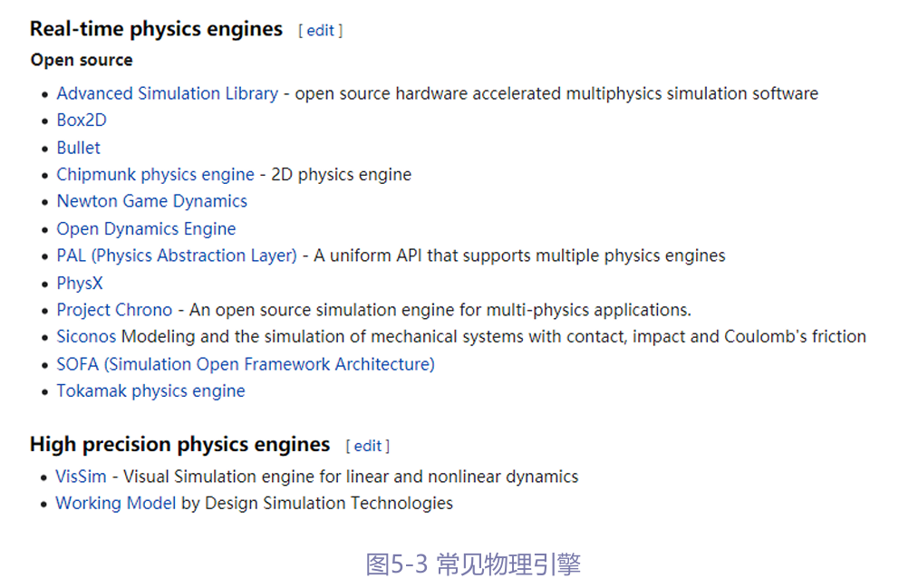

考虑到物理引擎的确定性问题，我们可以得出一个初步的结论——完全使用帧同步做物理 同步是不合适的（或者说做跨平台游戏是行不通的）。而对于状态同步，我们可以定时地去 纠正位置信息来避免误差被放大。如果一定要使用帧同步去做跨平台同步，那么只能选择放 弃物理引擎自己模拟或者用定点数来改造物理引擎，这可能是得不偿失的。

下面不妨先排除掉一致性的问题，来看看如何实现所谓的“物理同步”。实际上，无论是优 化手段还是实现方式与前两篇提到的方案是几乎一致的，帧同步、快照同步、状态同步都可 以采用，增量压缩、Inputbuffer等优化手段也一样可以用于物理同步的开发中。Network Next的创始人Glenn Fiedler在2014年撰写了一系列的物理同步相关的文章[56]，使用一个 同步的Demo非常详细地阐述了同步技术是如何应用以及优化的。涉及到的技术点大致如 下，涵盖了网络同步的大部分的知识细节：

- 如何确保物理引擎的确定性 
- 如何实现物理帧同步 
- Inputbuffer如何改善帧同步 
- 为什么用UDP替代TCP 
- 如何实现快照同步 
- 怎样用插值解决网络抖动 
- 如何通过快照压缩减少网络流量 
- 如何实现增量压缩 如何实现状态同步

另外，在2018年的GDC上，Glenn也对物理同步进行一次演讲分享[57]，具体的细节建议 大家移步到Glenn Fiedler的网站以及GitHub[58]去看

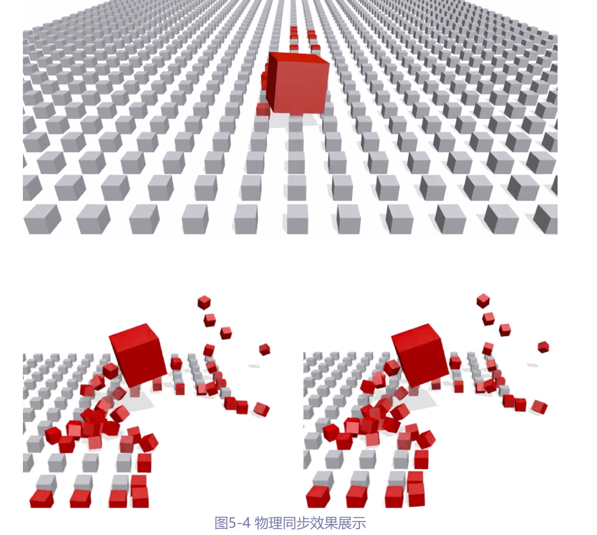

**b.同步误差如何被物理引擎放大** 

接下来，我们再来谈谈第二个难点，即网络同步的误差是如何被物理模拟迅速放大的（尤其 在多人交互的游戏中）。我们在前面的章节里也谈过，为了保证本地客户端的快速响应，通 常会采取预测回滚的机制（Client prediction，即本地客户端立刻相应玩家操作，服务器后 续校验决定是否合法）。这样我们就牺牲了事件顺序的严格一致来换取主控端玩家及时响应 的体验，在一般角色的非物理移动同步时，预测以及回滚都是相对容易的，延迟比较小的情 况位置的误差也可以几乎忽略。然而在物理模拟参与的时候，情况就会变得复杂起来。

主控（Autonomous/Master）即当前角色是由本地玩家控制的，模拟（Simulate/Replica）即当 前角色是由其他玩家控制的

假如在一个游戏中（带有预测，也就是你本地的对象一定快于远端）你和其他玩家分别控制 一个物理模拟的小车朝向对方冲去，他们相互之间可能发生碰撞而彼此影响运动状态，就会 面临下面的问题。

1.由于网络同步的误差无法避免，那么你客户端上的发生碰撞的位置一定与其他客户端的不 同

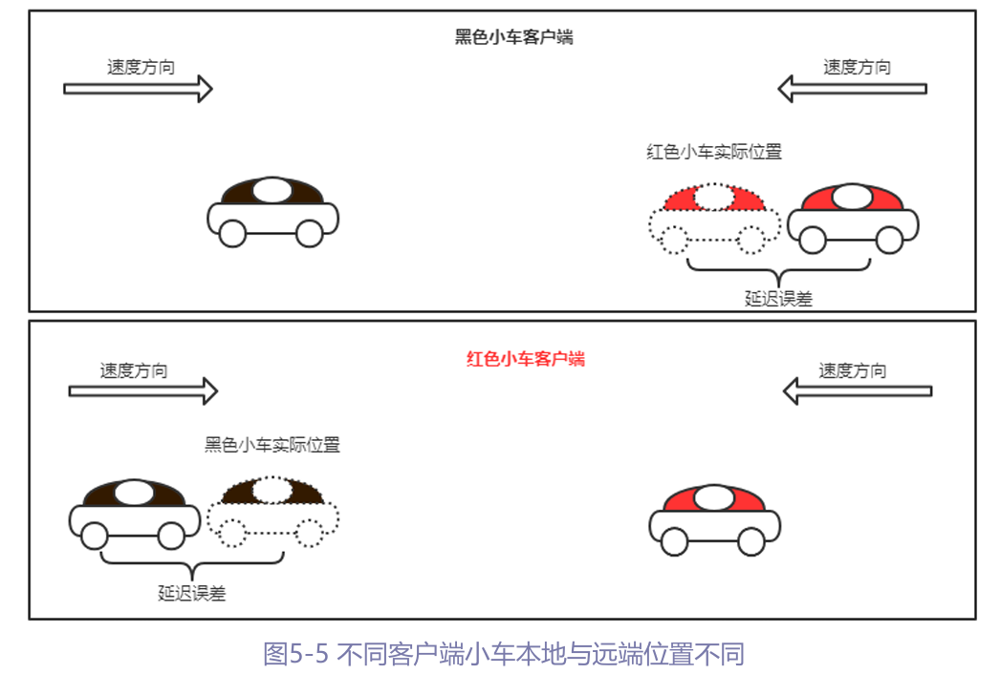

2.其次，对于本地上的其他模拟小车，要考虑是否在碰撞时完全开启物理模拟 （Ragdoll）。如果不开启物理，那么模拟小车就会完全按照其主控端同步的位置进行移 动，即使已经在本地发生了碰撞他可能还是会向前移动。如果开启碰撞，两个客户端的发生 碰撞的位置会完全不同。无论是哪种情况，网络同步的误差都会在物理引擎的“加持”下迅 速被放大进而导致两端的结果相差甚远。

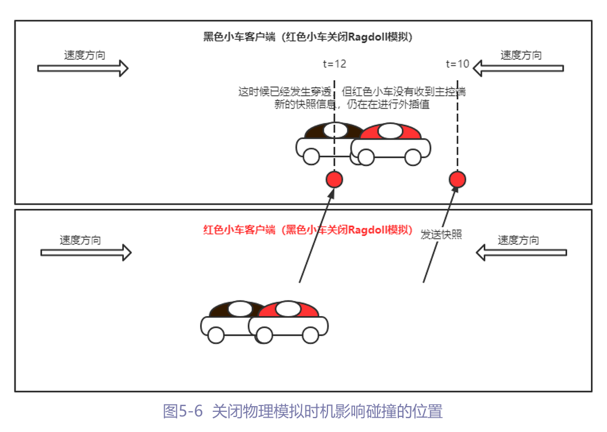

其实对于一般角色的非物理移动同步，二者只要相撞就会迅速停止移动，即使发生穿透只要 做简单的位置“回滚”即可。然而在物理模拟参与的时候，直接作位置回滚的效果会显得非 常突兀并出现很强的拉扯感，因为我们几乎没办法在本地准确的预测一个对象的物理模拟路 径。如果你仔细阅读了前面Glenn Fiedler的文章（或者上面总结的技术点），你会发现里 面并没有提到常见的预测回滚技术，因为他只有一个主控端和一个用于观察结果的模拟端， 并不需要回滚。

c.《看门狗2》的载具同步 在2017年的GDC上，来自育碧的技术负责人Matt Delbosc就《看门狗2》中的载具同步进 行了演讲[59]，详细的分析了多个主控端控制不同对象发生碰撞时应该如何处理。 《看门狗2》的网络模型是基于状态同步的P2P，主控角色预测先行而模拟对象会根据快照 （snapshot，即模拟对象在其主控端的真实位置）使用Projective Velocity Blengding做 内插值，他们在制作时也面临和上面描述一样的问题。假如两个客户端各控制一个小车撞向 对方，由于延迟问题，敌人在本地的位置一定是落后其主控端的。那么就可能发生你开车去 撞他时，你本地撞到了他的车尾，而他的客户端什么都没有发生。

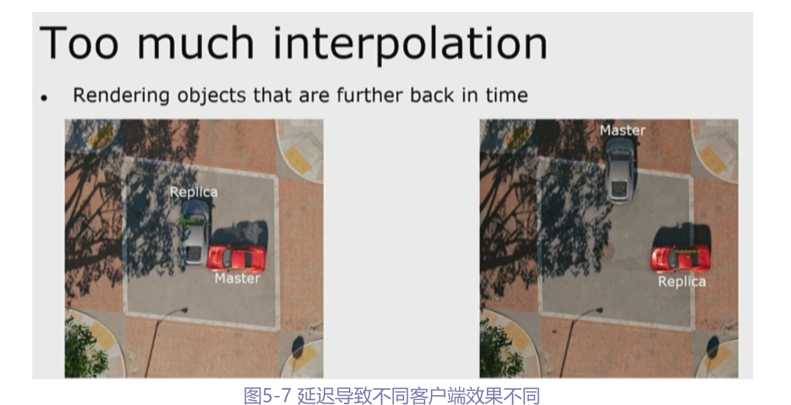

所以，首先要做的就是尽量减少不同客户端由于延迟造成的位置偏差，Matt Delbosc引入 了一个TimeOffset的概念，根据当前时间与TimeOffset的差值来决定对模拟对象做内插值 还是外插值，有了合适的外插值后本地的模拟对象就可以做到尽量靠近敌方的真实位置。

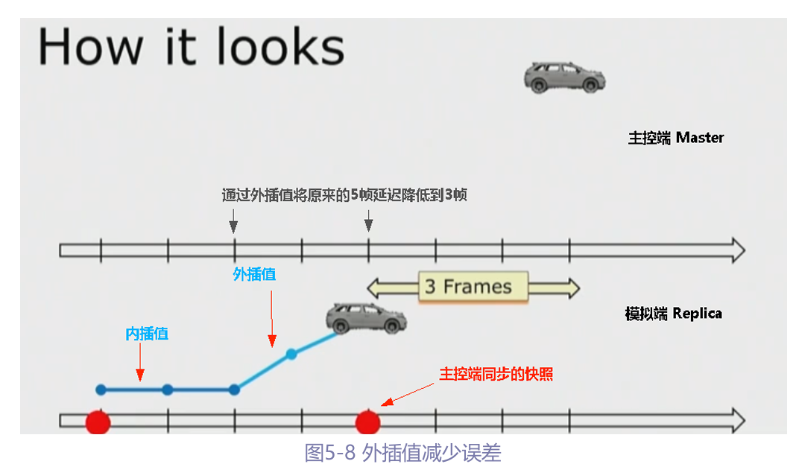

而关于碰撞后位置的误差问题，他们采用了Physics Simulation Blending技术，即发生碰 撞前开启模拟对象的RigidBody并设置位置权重为1（快照位置的权重为0），然后在碰撞 发生后的一小段时间内，不断减小物理模拟的权重增大快照位置的权重使模拟对象的运动状 态逐渐趋于与其主控端，最终消除不一致性，腾讯的吃鸡手游就采用了相似的解决方案 [60]。

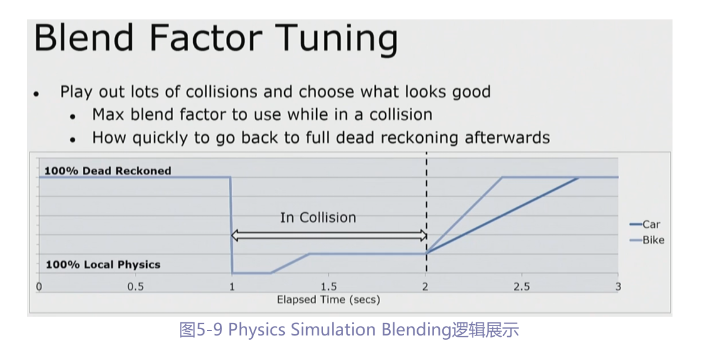

不过实际上， Matt团队遇到的问题远不止这些，还有诸如如何用插值解决旋转抖动问题， 人物与载具相撞时不同步怎么办等等，知乎上有一篇译文可以参考[61]。

可能有些朋友会问，如果我不使用预测回滚技术是不是就没有这个问题呢？答案依然是否定的，假 如你在运行一个车辆的中间突然变向，而这个操作被丢包或延迟，只要服务器不暂停整个游戏来等 待你的消息，那么你本地的结果依然与其他客户端不同进而产生误差。也就是说除非你使用最最原 始的“完全帧同步”（即客户端每次行动都要等到其他客户端的消息全部就绪才行），否则由于网 络同步的延迟无法避免，误差也必定会被物理模拟所放大。

《火箭联盟》的核心玩法是“用车踢球”，每个玩家控制一个汽车，通过撞击足球来将 其“踢”进敌方的球门。由于是多人竞技游戏，所以一定要有一个权威服务器来避免作弊， 最终的结果必须由服务器来决定。相比于《看门狗》，他们遇到的情况明显更复杂，除了不 同玩家控制不同的小车，还有一个完全由服务器操控的小球。按照常规的同步方式，本地的 主控玩家预测先行，其他角色的数据由服务器同步下发做插值模拟。但是在这样一个延迟敏 感且带有物理模拟的竞技游戏中，玩家的Input信息的丢失、本地对象与服务器的位置不统 一都会频繁的带来表现不一致的问题，而且FPS中常见的延迟补偿策略并不适合当前的游戏 类型（简单来说就是延迟大的玩家会影响其他玩家的体验，具体原因我们在上一篇延迟补偿 的章节也有讨论）。

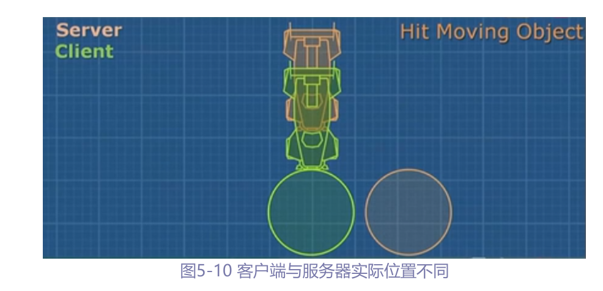

为了解决这些问题，Jared Cone团队采用了“InputBuffer”以及“客户端全预测”两个核 心方案。InputBuffer，即服务器缓存客户端的Input信息，然后定时的去buffer里面获取 （buffer大小可以动态调整），这样可以减少网络延迟和抖动带来的卡顿问题。

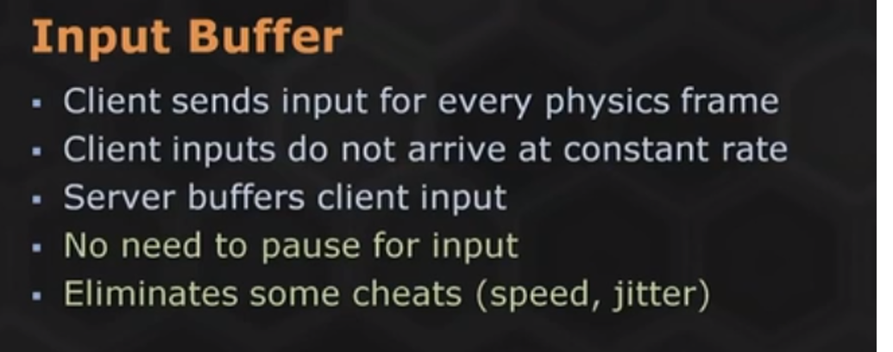

客户端全预测，即客户端上所有可能产生移动的对象（不仅仅是主控对象）全部会在本地预 测先行，这样本地在预测成功时所有对象的位置都是准确的，客户端与服务器的表现也会高 度一致，当然预测失败的时候自然会也要处理位置回滚。

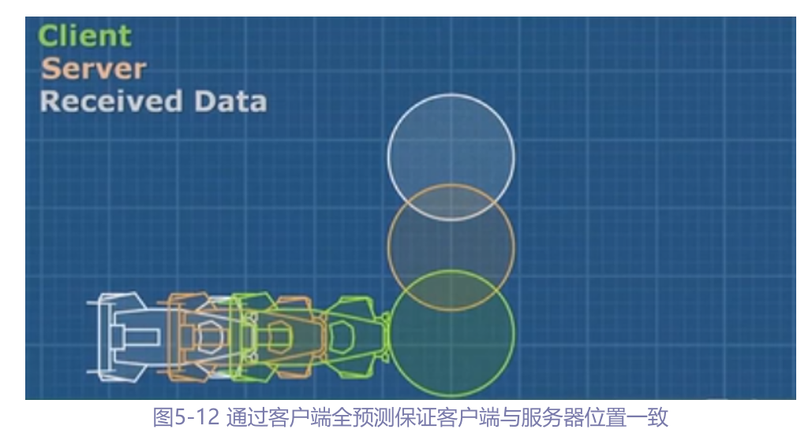

仔细分析这两款游戏，你会发现他们采用都是“状态同步+插值+预测回滚”的基本框架， 这也是目前业内上比较合适的物理同步方案。

除了同步问题，物理引擎本身对系统资源（CPU/GPU）的消耗也很大。比如在UE4引擎里 面，玩家每一帧的移动都会触发物理引擎的射线检测来判断位置是否合法，一旦场景内的角 色数量增多，物理引擎的计算量也会随之增大，进而改变Tick的步长，帧率降低。而帧率降 低除了导致卡顿问题外，还会进一步影响到物理模拟，造成更严重的结果不一致、模型穿透 等问题，所以我们需要尽量减少不必要的物理模拟并适当简化我们的计算模型。


## 六、TCP VS UDP

网络同步本质是数据的传输，当逻辑层面优化已经不能满足游戏的即时性要求时，我们就不 得不考虑更深一层协议上的优化，而这件事开发者们从上世纪90年代就开始尝试了。

按照OSI模型（Open System Interconnection Model），我们可以将计算机网络分为 七层。一般来说，我们在软件层面（游戏开发）最多能干涉的到协议就是传输层协议了，即 选择TCP还是UDP。网上关于TCP和UDP的文章与讨论有很多[63]，这里会再帮大家梳理一 下。

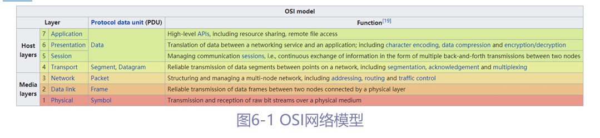

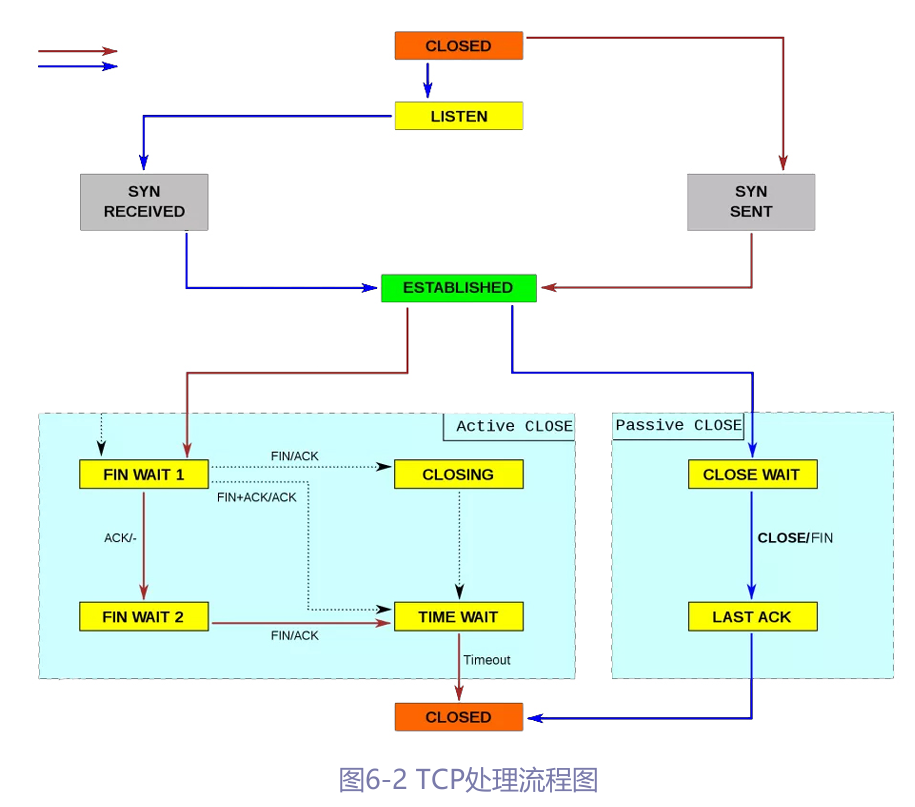

TCP（Transmission Control Protocol），即传输控制协议，是一种面向连接的、可靠 的、基于字节流的传输层通信协议[64]。该协议早在1974年就被提出并被写进 RFC（Request for Comments）中，自发布几十年来一直被不断优化和调整，如今已 经是一个包含“可靠传输”，“拥塞控制”等多个功能的协议了（RFC 2581 中增加）。

在21世纪早期，我们因特网上的数据包有大约95%的包都使用了TCP协议，包括 HTTP/HTTPS，SMTP/POP3/IMAP、FTP等。当然，也包括一大部分网络游戏。我们如此 偏爱于TCP就是因为他从协议层面上提供了许多非常重要的特性，如数据的可靠性、拥塞控 制、流量控制等。这些可以让软件应用的开发者们无需担心数据丢失、重传等细节问题。

然而在游戏开发中，这些特性却可能是网络同步中的负担。在FPS游戏中，玩家每帧都在移 动，我们期望这些数据在几毫秒内就能送达，否则就会对玩家产生干扰、影响游戏体验。因 此对于FPS、RTS这种要求及时响应的游戏，TCP协议那些复杂的机制看起来确实有点华而 不实。

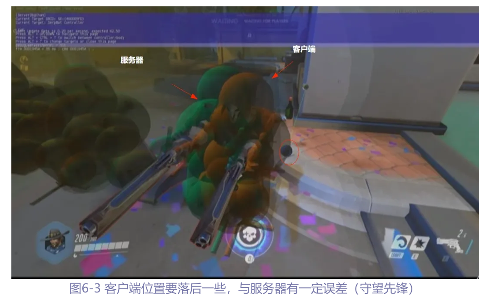

考虑到TCP协议非常复杂，这里只从几个关键的点来谈谈他的问题[65]。

\1. 在TCP中，数据是通过字节流的方式发送的，但由于建立在IP协议上必须将字节流 拆分成不同的包，默认情况下协议会将你的数据包缓冲，到达一定值才会发送。这样 可能会出现在游戏某个阶段你最后几个包明明已经执行了发送逻辑，但是由于缓冲机 制被限制而无法到达。不过好在我们可以通过TCP_NODELAY 来设置TCP立即刷新写 入它的所有数据。

\2. 其次，TCP的可靠数据传输响应并不及时。一旦数据包发生丢失或乱序，那么接收 方就会一直等待这个数据的到来，其他新收到的数据只会被缓存在协议层，你在应用 层根本获取不到任何数据也无法做任何处理。这个时候你可能要等超时重传机制响应 后才能拿到重发的数据包，这时候可能已经过了几十毫秒。即使TCP拥有快速重传机 制，仍然达不到理想的延迟效果。

\3. 拥塞控制和流量控制不可控。TCP在网络环境比较差的条件下，会通过调整拥塞控 制窗口大小来减少包的发送来降低吞吐量，这对于延迟敏感的游戏完全是无法接受 的。同样，我们在应用层上面也无能为力。

\4. 其他的还有一些的小问题，比如每个TCP的报头都需要包含序列号、确认号、窗口 等数据结构，无形中增加了流量大小；TCP需要在端系统中维护连接状态，包括接收 与发送缓存、拥塞控制参数等，在处理大量连接的消息时也更为繁琐和耗时。

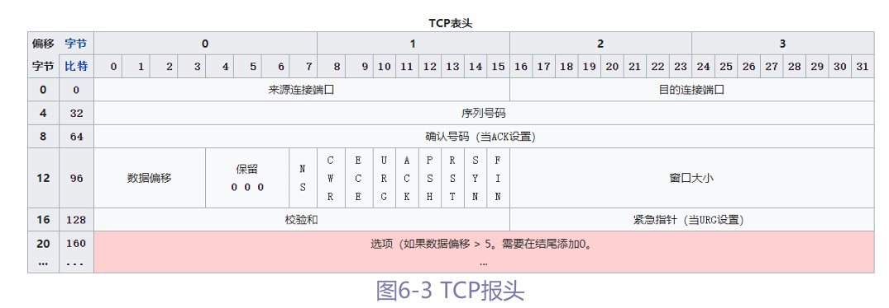

那么这些问题能解决么？也许能，但是从协议层面我们无能为力，因为TCP协议设计之初就 不是为了及时响应，而另一个运输层协议UDP看起来比较符合我们的理念。

UDP(User Datagram Protocol)，即用户数据包协议，是一个简单的面向数据报通信的 协议[66]。该协议由David P. Reed在1980年设计并写入RFC 768 中。顾名思义，UDP设计 之初就是为了让用户可以自由的定义和传输数据，不需要建立链接、没有流量控制也没有拥 塞控制，但是会尽可能快的将数据传输到目的IP和端口。

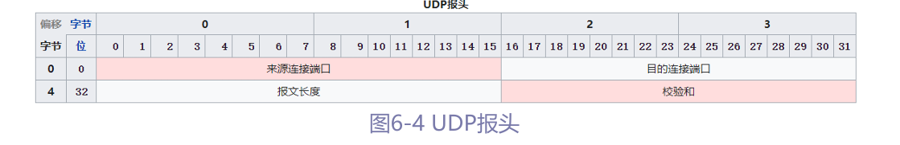

在上世纪90年代，Quake等游戏就开始使用UDP协议取代TCP进行数据同步，结果也很理 想。除了游戏外，其他诸如视频、语音通信等领域也在广泛使用UDP，开发者们开始基于 UDP创建自定义的Reliable UDP通信框架（QUIC、WbRTC、KCP、UDT等[67]），一些 游戏引擎（如UE4）也将RUDP集成进来。随着网络带宽的提高，使用UDP代替TCP目测是 一个趋势（参考Http3[68]）。

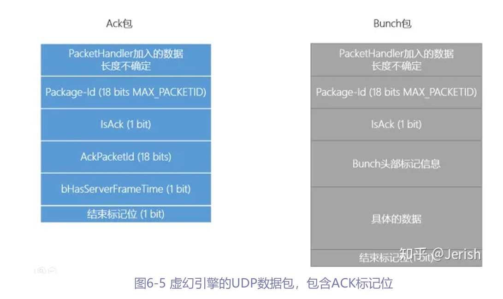

虽然UDP很自由，但是需要开发者们自己写代码完善他。我们需要自己去写服务器客户端 建立链接的流程，我们需要手动将数据分包，我们还需要自己实现应用层面的可靠数据传输 机制。另外，UDP还有一个传输上的小劣势——当路由器上的队列已满时，路由器可以根 据优先级决策在丢弃TCP数据包前先丢失UDP，因为他知道TCP数据丢失后仍然会进行重传。

总的来说，对于那些对延迟很敏感的游戏，UDP的传输模式更加适合而且弹性很大，同时 他也可以胜任那些同步频率比较低的游戏，但是UDP的开发难度比较高，如果是自己从零 开发确实有相当多的细节需要考虑，所以建议大家在已有的RUDP框架上进行优化。


## 七、常见同步优化技术

梳理完同步的发展历史，我们最后再来总结一下常见的网络同步优化技术。首先，提出一个 问题，网络同步优化到底是在优化什么？

在单机游戏中，从我们按下按键到画面的响应中间经历了输入采样延迟、渲染流水线、刷新 延迟、显示延迟等。而在一个网络游戏中，从我们按下按键到另一个机器收到指令，则会经 历一个极为耗时的网络延迟（相比之下，单机的延迟可以忽略不计）。网络延迟其实也包括 处理延迟、传输延迟（主要延迟）、排队延迟以及传播延迟，一般我们会将这些延迟统称为 网络延迟，我们优化的目的就是想尽各种办法降低或是抵消掉这个延迟。

数据从客户端传输到服务器的一个来回称为一个RTT。在CS架构下，其实每个客户端的行为 一直是领先于服务器1/2个RTT的，数据从客户端发送到服务器有一个1/2的RTT延迟，服务 器处理后通知客户端又有一个1/2的RTT延迟。P2P架构下，由于没有权威服务器，我们可 以省去1/2的 RTT延迟，但是在目前的网络游戏中，为了对抗作弊行为以及容纳更多的玩 家，我们不得不采用CS架构。

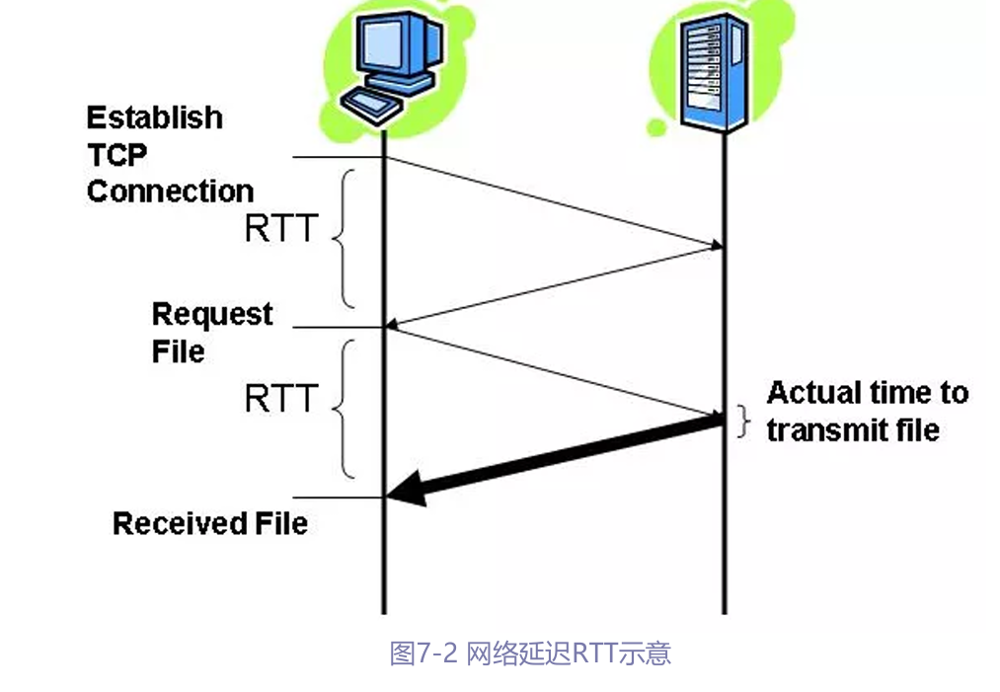

由于在网络游戏中，延迟是不可避免的，所以我们的优化手段就是如何减小这个延迟以及如 何让玩家感受不到延迟。下面我会从表现优化、延迟对抗、丢包对抗、带宽优化以及帧率优 化这几个方面来做一下总结，


### 1.表现优化（弱化玩家对延迟的感受）：

#### a.插值优化

通过内插值解决客户端信息离散更新的突变问题，通过外插值解决网络延迟过大收不到数据 而卡顿的问题，两种方案并不冲突，可以同时采用。在具体应用时，我们可以使逻辑帧与渲 染帧分离，这样在客户端没有收到数据的时候还可以继续更新渲染，也可以在二者不分离的 情况只对渲染的模型进行插值，客户端收到权威数据后再进行整个对象的移动。

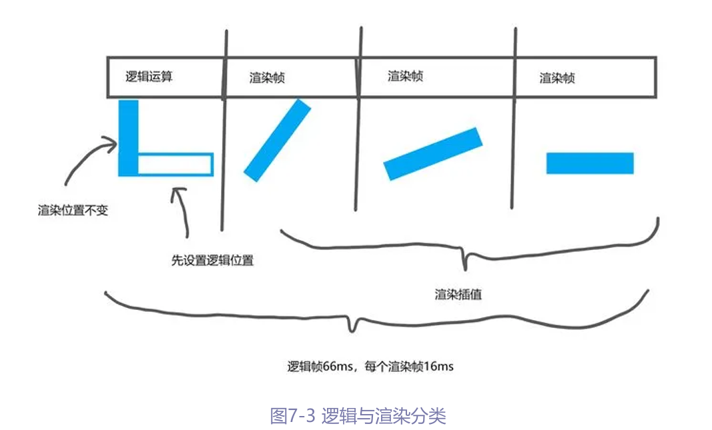


#### b.客户端预先执行+回滚

预测的目的是让玩家能在本地操作后立刻收到反馈，提升游戏体验，回滚是为了保证服务器 的权威性。客户端预测包括位置预测以及行为预测两种，位置预测需要高频率的执行，因为 移动在每帧都可能发生，而其他行为预测则相对低频一些，包括开枪、扔手雷、释放技能 等。另外，对于延迟不太敏感的游戏（比如MMO），可以放宽校验条件（超过一定误差再 纠正），这样即使降低服务器帧率客户端也不会有什么感觉。

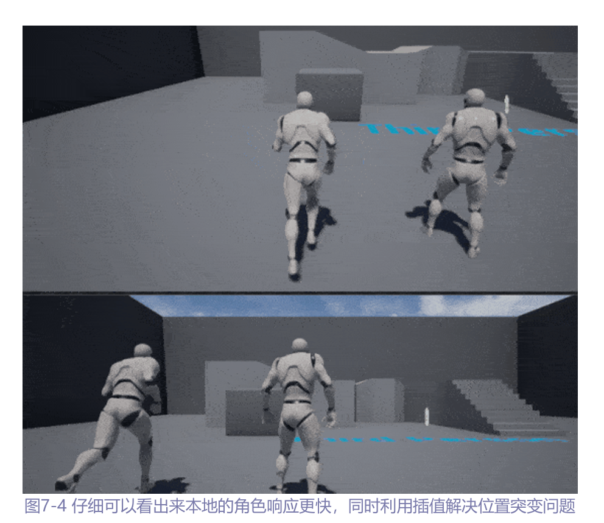


### 2.延迟对抗（弱化玩家对延迟的感受）：

#### a.延迟补偿

服务器（注意是服务器而不是客户端）记录一段时间内所有玩家的位置历史，在发生伤害计 算时根据延迟对所有玩家角色进行位置的回滚与处理，可以尽量还原当时的场景。

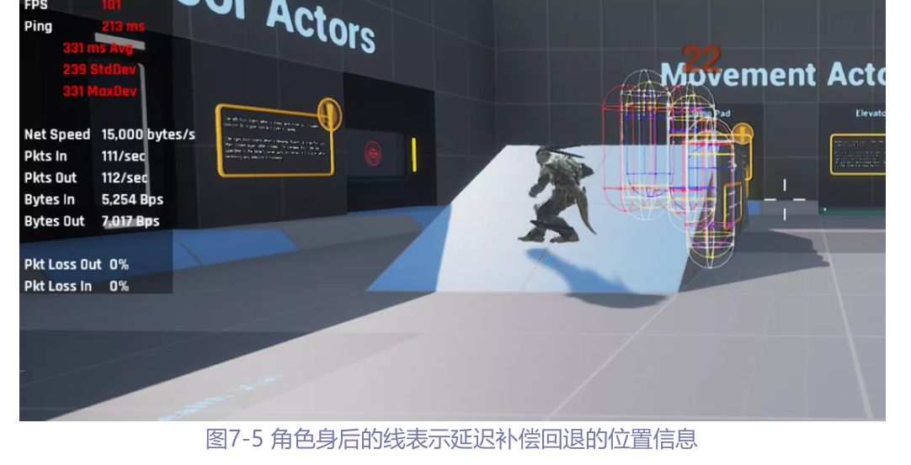

#### b.命令缓冲区 

把远端的数据缓存在一个buffer里面，然后按照固定频率从buffer里面取，可以解决客户端 卡顿以及网络抖动问题。不过缓冲区与延迟是有冲突的，缓冲区越大，证明我们缓存的远端 数据就越多，延迟就越大。

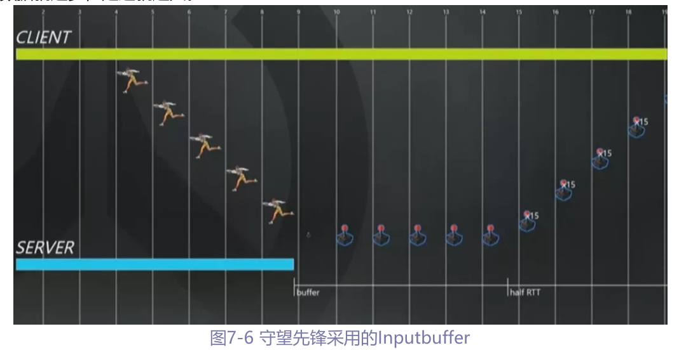


####  c.从具体实现的技巧上对抗延迟

操作加一个前幺时间，客户端释放技能等行为前有一个时间来抵消掉RTT的延迟。如无敌状 态做一个过度动画，客户端播放动画后进入无敌，但是服务器可以在收到指令后直接进入无 敌状态从而抵消延迟。在游戏Halo中，有很多类似的例子。比如在客户端玩家扔手雷的时 候，我们可以在本地立刻播放扔手雷的动画并发送请求到服务器，然后服务器收到后不需要 播放动画立刻生成手雷并同步，这样客户端真正扔出手雷的表现就是0延迟的。

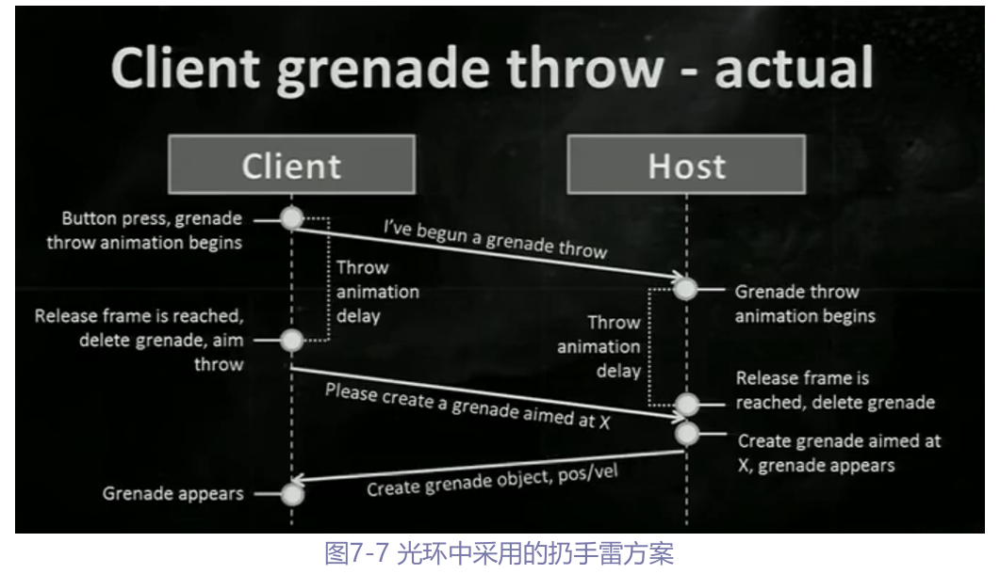


### 3.丢包对抗（弱化玩家对延迟的感受）：


#### a.使用TCP而不是UDP 

由于TCP不会丢包，对于延迟不敏感的游戏还是优先采取TCP来对抗丢包

#### b.冗余UDP数据包 

一次性发送多个帧的数据来对抗丢包。UDP同步数据时经常容易丢包，我们虽然可以使用 上层实现UDP的可靠性，但是像帧同步这种同步数据量比较小的游戏可以采用冗余UDP的 方案，即后续的UDP包会冗余一定量的前面已发送的UDP包，这样即使丢失了部分包我们 也能保证拿到完整的远端数据。

注：王者荣耀、守望先锋、火箭联盟等等游戏都使用类似的方案，该方案不仅仅适用于帧同 步


### 4.带宽优化（减小延迟）：

带宽优化的目的是减小客户端以及服务器的同步压力，避免大量数据同时传输造成处理不过 来，排队甚至是丢失。带宽优化是非常灵活且多变的，我们需要根据游戏的玩法来调整我们 的优化行为。

#### a.同步对象裁剪 

核心目的是根据相关性剔除那些不需要同步的对象（这里都是指在同一个服务器内），比如 一个玩家距离我很远，我们的行为彼此不会影响，所以就不需要互相同步对方的数据。裁剪 方式有非常多，常见的SOI（Spheres of Influence），静态区域（把场景划分为N个小区 域，不在一个区域不同步），视锥裁剪（更多用于渲染），八叉树裁剪等。相关性还可能会 涉及到声音等其他因素，需要根据自己项目来决定。

这里着重提一点AOI ( Area Of Interest [69] [70]) ，即根据玩家的位置维护一个动态的视野 列表，视野外的对象会被完全忽略（能大幅的减少同步对象的遍历与比较）。其基本思想也 是判断相关性，实现方式有很多，其中基于格子的空间划分算法是网络游戏中常见的实现方 案。在虚幻引擎中，大世界同步框架ReplicationGraph[71]的核心思想也是如此。不过要 注意的是，对于MMO这种可能有大量角色同时进行连续移动的游戏，视野列表频繁的增删 查操作也可能对服务器造成一定的压力。


#### b.分区，分房间 

对于大型MMO来说，这是常见的手段，将不同的玩家分散到不同的场景内（不同的服务 器），这样减小服务器处理数据的压力，减小延迟。对于大世界游戏而言，不同服务器可能 接管同一个地图不同区域的服务，其中的跨服数据同步比较复杂。


#### c.数据压缩与裁剪 

坐标与旋转是我们常见的同步内容，但是很多数据其实是不需要同步的。比如对于大部分 3D游戏角色的Pitch以及Roll是不会改变的，我们只要同步Yaw值即可。对于非第一人称游 戏，我们可以接着把四个字节float类型的Yaw压缩到两个字节的uint16里面，玩家根本不 会有什么体验上的差异。类似的方法可以应用到各种同步数据里面。


#### d.减少遍历以及更细力度的优化

在Halo以及虚幻引擎里面都会对同步对象做优先级划分，发送频率调整等。在状态同步 中，我们还需要合适的手段来快速定位发生变化的数据，如属性置脏、利用发射减少非同步 属性的遍历等。进一步的，我们还可以根据客户端的类型以及信息作出更细致的同步信息过 滤以及设置优先级，比如对同步属性进行优先级划分等（目前还没有见到过粒度如此细致 的，但理论上是可行的）。


### 5.帧率优化（减小延迟）：

帧率优化是一个重要且复杂的难题，涉及到方方面面的技术细节，这里主要针对网络同步相 关内容做一些分析。相比单机游戏，网游需要同时考虑客户端与服务器的帧率，这并不是单 纯地提升帧率的问题，如何优化与平衡是一个很微妙的过程。


#### a.提升帧率

这个不用多说，帧率低就意味着卡顿，玩家的体验就会很差。不同游戏的性能瓶颈都可能不 一样，包括内存问题（GC、频繁的申请与释放）、IO（资源加载、频繁的读写文件，网络 包发送频率过大，数据库读取频繁）、逻辑问题（大量的遍历循环，无意义的Tick，频繁的 创建删除对象，过多的加锁，高频率的Log）、AI（寻路耗时[72]）、物理问题（复杂模 拟，碰撞次数过多）、语言特性（脚本语言比较费时）等，客户端相比服务器还有各种复杂 的渲染问题（Drawcall太多，半透明，动态阴影等）。这些问题需要长期的测试与调试， 每个问题涉及到的具体细节可能都有所不同，需要对症下药才行。

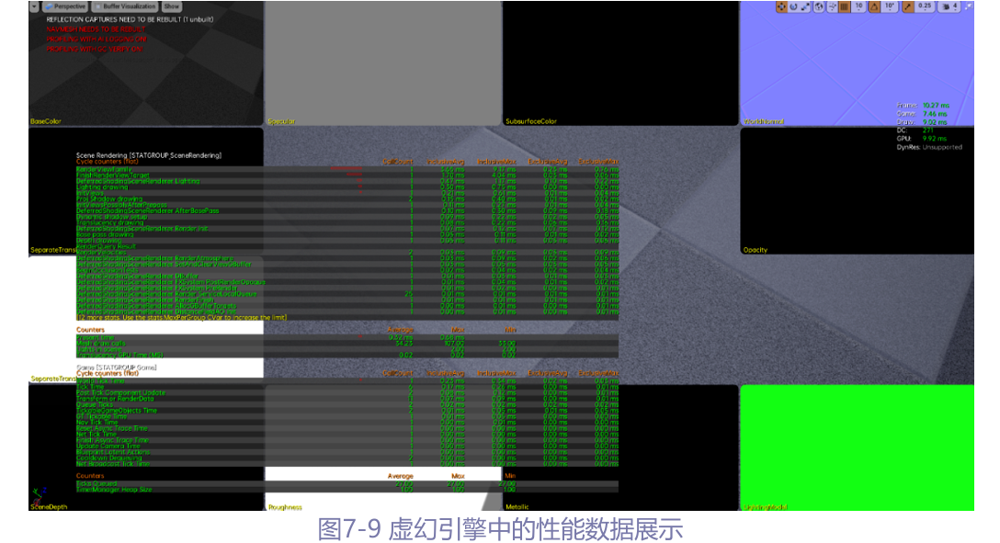


#### b.保持帧率稳定与匹配

假如你的客户端与服务器帧率已经优化到极致，你也不能任其自由变化。首先，要尽量保持 服务器的帧率稳定（减少甚至是消除玩家比赛时的所有潜在的卡顿问题），考虑一款对延迟 比较敏感的射击游戏，如果你的客户端在开枪时遇到了服务器卡顿，那么就可能造成校验失 败，导致客户端看到的行为与服务器行为不一致。其次，还要保持客户端与服务器的帧率匹 配。对于延迟不敏感的游戏，考虑到玩家的体验以及服务器的压力，客户端的帧率可以高于 服务器多倍，但是这个比例是需要通过实际的测试来调整。而对于延迟敏感的游戏，我们一 般需要尽量让服务器的帧率接近客户端，这样服务器才能更及时的相应，减少延迟带来的误 差。此外，我们也不能让客户端的帧率无限提高，对于某些同步算法，客户端与服务器过高 的帧率差异可能造成不断的拉回卡顿。所以，很多游戏会采取锁帧的方式来保证游戏的稳定 性。


#### c.计算压力分担

对于MMO这种服务器压力比较大的游戏，我们通常会考虑把一部分计算资源转交给客户端 去计算（甚至是计算后再返还给服务器），比如物理运算、自动寻路、AI逻辑计算等。其实 将这种方式使用到极致的例子就是帧同步，服务器只做一些简单的校验即可。

总的来说，网络同步优化是一个长期的不断试错的过程，我们需要合理的利用计算机资源， 把最重要的资源用在最重要的功能上面，减少重复的计算与流程，并需要配合一些经验和技 巧来规避那些不好解决的问题。


## 八、总结

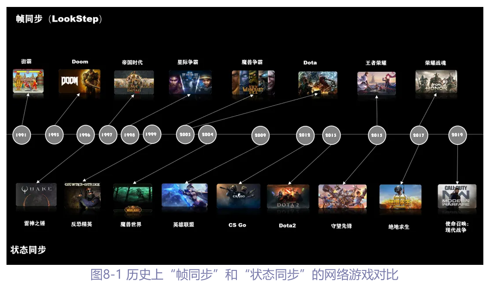

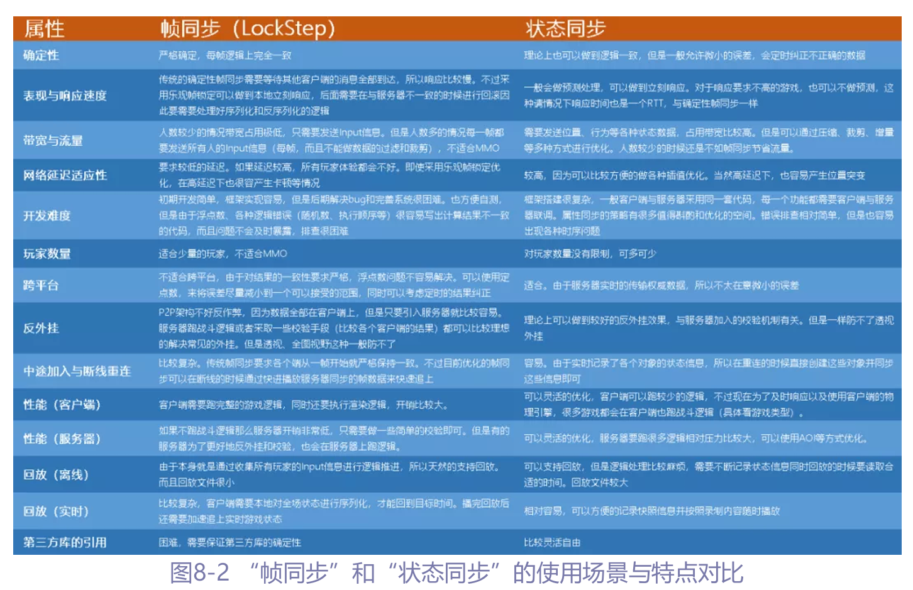

我们从最开始的网络游戏架构谈起，按照时间线梳理了近几十年“帧同步”与“状态同 步”的发展历程，并讲述了各种同步技术以及优化方案。虽然网络同步是游戏中的技术，但 其本质还是计算机数据的同步。无论是Lockstep还是TimeWarp，最初都是用于计算机系 统通信的技术，只不过应用场景从一台机器的内部通信转变为多台机器的通信，从传统的应 用转移到网络游戏上面。 游戏的类型会影响到网络同步的解决方案，也会影响到项目的整体架构，所以我们在制作一 款网络游戏前要事先做好需求分析并确定网络同步方案。同时也要意识到，网络同步延迟是 不可消除的，除了算法层面的优化外还可以从实现技巧上来规避一些难题。


## 参考

网络同步在游戏历史中的发展变化 作者：Jerish


# ============================


# [在linux环境下部署环境]


## 1.ubuntu下安装mysql服务


### **1.1安装 MySQL-Server**

通过 apt 包管理器安装 MySQL

```
sudo apt update
sudo apt install mysql-server
```


### **1.2启动mysql服务,并确定active**

```
systemctl start mysql
```

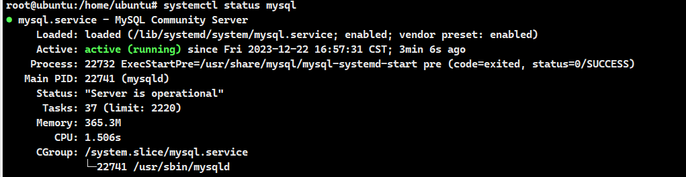


### **1.3验证 MySQL-Server**

你可以通过运行以下命令来验证安装结果，该命令将输出系统中所安装的 MySQL 版本和发行版。

```
mysql --version
```

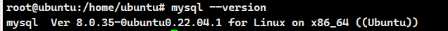 


### **1.4保护加固 MySQL**

MySQL 安装文件附带了一个名为`mysql_secure_installation`的脚本，它允许你很容易地提高[数据库服务](https://cloud.tencent.com/product/dbexpert?from_column=20065&from=20065)器的安全性。

不带参数运行这个脚本：

```
sudo mysql_secure_installation
```

你将会被要求配置`VALIDATE PASSWORD PLUGIN`，它被用来测试 MySQL 用户密码的强度，并且提高安全性：

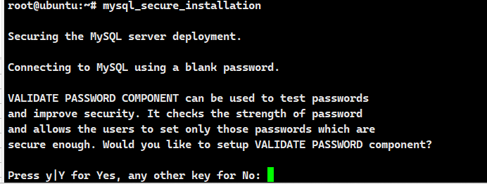 

看着按吧。


### **1.5以root身份登录并调整用户身份验证**

MySQL Server 带有一个客户端实用程序，可以从 Linux 终端访问数据库并与之交互。

通常，未做任何配置时，在 Ubuntu 上全新安装 MySQL 后，访问服务器的用户将使用 auth_socket 插件进行身份验证。

auth_socket 的使用会阻止服务器使用密码对用户进行身份验证。它不仅会引发安全问题，而且还会使用户无法借助外部程序（如 phpMyAdmin）访问数据库。因此我们需要将身份验证方法从 auth_socket 更改为使用 mysql_native_password。

为此需要打开 MySQL 控制台，并在 Linux 终端上运行以下命令。

```
mysql
```

现在，我们需要检查数据库对不同用户使用的身份验证方法。你可以通过运行以下命令来执行此操作。

```
SELECT user,authentication_string,plugin,host FROM mysql.user;
```

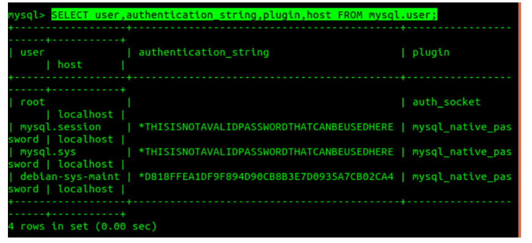 

从上图中，我们可以确认 root 用户确实使用 auth_socket 进行了身份验证。我们需要使用下面的“ALTER USER”命令切换到密码验证的使用。另外需要注意的是，确保使用较强的安全密码（应超过 8 个字符，结合数字、字符串和特殊符号等），因为它将替换你在执行上述命令“sudo mysql_secure_installation” 时设置的密码。运行以下命令。

```
ALTER USER 'root'@'localhost' IDENTIFIED WITH mysql_native_password BY 'your_password';
```

现在，我们需要重新加载授权表并将更改更新到 MySQL 数据库。通过执行以下命令来执行此操作。

```
FLUSH PRIVILEGES;
```

完成后，我们需要确认 root 用户不再使用 auth_socket 进行身份验证。通过再次运行以下命令来执行此操作。

```
SELECT user,authentication_string,plugin,host FROM mysql.user;
```

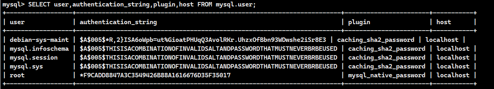

从上图中，我们看到 root 身份验证方法已从“auth_socket”更改为“mysql_native_password”。

由于我们更改了 root 的身份验证方法，因此我们无法使用之前使用的相同命令打开 MySQL 控制台。即“sudo mysql”。我们需要包括用户名和密码参数，如下所示。

```
mysql -u root -p
```

“-u”表示用户，这里是“root”，“-p”代表“password”，一旦你按下 Enter 键，服务器就会提示你输入密码。


### **1.6创建新用户**

一切都设置好后，你可以创建一个新用户，并授予该用户适当的权限。我们将创建一个用户 'PyDataStudio' 并分配对所有数据库表的权限以及更改、删除和添加用户权限的权限。逐行执行下面的命令。

```
CREATE USER 'PyDataStudio'@'localhost' IDENTIFIED BY 'strong_password';

GRANT ALL PRIVILEGES ON *.* TO 'PyDataStudio'@'localhost' WITH GRANT OPTION;
```

第一个命令将创建新用户，第二个命令分配所需的权限。

我们现在可以通过运行以下命令来测试我们的新用户。

```
mysql -u PyDataStudio -p
```

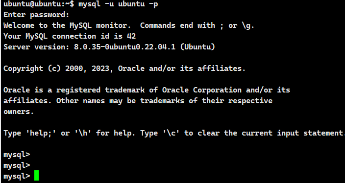 


### **1.7服务器上的配置**

在 Ubuntu 服务器上安装 MySQL-server 与上述步骤没有太大区别。但是，由于服务器是远程访问的，我们还需要为服务器启用远程访问。

安装成功后，需要启用远程访问。从逻辑上讲，我们需要在 Ubuntu 服务器防火墙上打开一个端口，以便 MySQL 数据库进行通信。默认情况下，MySQL 服务在 3306 端口上运行。执行以下命令。

```
sudo ufw enable
sudo ufw allow mysql
```

为了增强 MySQL 数据库的可靠性和可访问性，可以将 MySQL-server 服务配置为在启动时开始运行。执行以下命令。

```
sudo systemctl enable mysql
```

现在需要配置服务器的接口，从而服务器能够侦听远程可访问的接口。我们需要编辑“mysqld.cnf”文件。运行以下命令。

```
sudo nano /etc/mysql/mysql.conf.d/mysqld.cnf
```

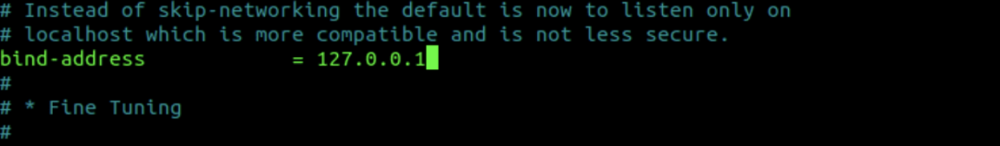

默认情况下，绑定地址为“127.0.0.1”。为公网接口添加绑定地址，为服务网络接口添加另一个绑定地址。你可以将所有 IP 地址的绑定地址配置为“0.0.0.0”。


### **bug**

如果你在选择密码规则的时候不小心选择了2，也就是数字、大小写字母、特殊符号和字典文件的组合。这时候设置密码会出现如下提示：

```
Your password does not satisfy the current policy requirements.
```

这时候重新运行`mysql_secure_installation`也不会再给你机会重新设置了。手动微笑，mmp。

**解决方案如下：**

使用命令`mysql -uroot`登陆，执行：

```
set global validate_password.policy = 0;
#将密码规则设置为LOW，就可以使用纯数字纯字母密码
```

```
set global validate_password_length=4;  
#最低位数为4位
```

这个时候重新运行`mysql_secure_installation`就可以安心设置了。

**相关参数**

```
validate_password_dictionary_file：插件用于验证密码强度的字典文件路径。

validate_password_length：密码最小长度。

validate_password_mixed_case_count：密码至少要包含的小写字母个数和大写字母个数。

validate_password_number_count：密码至少要包含的数字个数。

validate_password_policy：密码强度检查等级，0/LOW、1/MEDIUM、2/STRONG。

validate_password_special_char_count：密码至少要包含的特殊字符数。
```


### 卸载


#### 1.查看 **MySQL** 依赖

```
dpkg --list|grep mysql
```

#### 2.卸载 mysql-common

```
sudo apt remove mysql-common
```

#### 3.卸载 mysql-server

```
sudo apt autoremove --purge mysql-server
```

#### 4.清除残留数据

```
dpkg -l|grep ^rc|awk '{print $2}'|sudo xargs dpkg -P
```

如果还有残留就继续删除

```
dpkg --list|grep mysql
sudo apt autoremove --purge mysql-apt-config
```


### 导入sql文件

```
进入mysql某个数据库中
source /path/file.sql
```


## 2.部署c#运行环境


**云服务器需要dotnet环境**

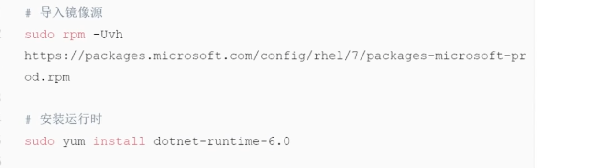

```
# 导入镜像源
sudo rpm -Uvh https://packages.microsoft.com/config/centos/7/packages-microsoft-prod.rpm

# 安装net6环境
sudo yum install dotnet-sdk-6.0

# 查看是否安装成功
dotnet --info
```


**云服务器端口放行**


**linux主机防火墙端口放行**


在 Ubuntu 中，你可以使用 `ufw`（Uncomplicated Firewall）工具来管理防火墙规则。以下是一些基本的步骤，可以帮助你放行端口：

1. **检查防火墙状态：** 在终端中输入以下命令，检查防火墙的当前状态：

   ```
   bashCopy code
   sudo ufw status
   ```

2. **启用防火墙：** 如果防火墙没有启用，可以使用以下命令启用它：

   ```
   bashCopy code
   sudo ufw enable
   ```

3. **放行端口：** 使用以下命令放行特定端口（例如，假设你要放行端口 80）：

   ```
   bashCopy code
   sudo ufw allow 80
   ```

   如果你的应用程序使用其他端口，替换 `80` 为你实际使用的端口号。

4. **重新加载防火墙：** 重新加载防火墙规则，以确保更改生效：

   ```
   bashCopy code
   sudo ufw reload
   ```

5. **验证更改：** 最后，再次运行 `sudo ufw status` 来确认端口已经被正确放行。


## 3.启动服务器程序

**服务器的ip使用内网ip或者 0.0.0.0**

**客户端连接服务器的ip使用云服务器的ip**

云服务器中只有一个内网网卡，外网地址不是直接配置在服务器中的，而是配置在服务器外层的网关上，做了一层映射转发。程序是无法绑定公网ip地址的


选择release  Any Cpu

 

选择你要发布的项目，右键重写生成

 

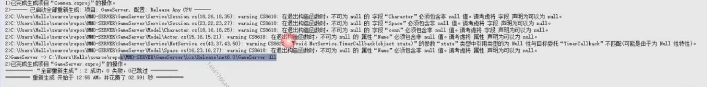

可以看到重写生成的文件在这个目录下

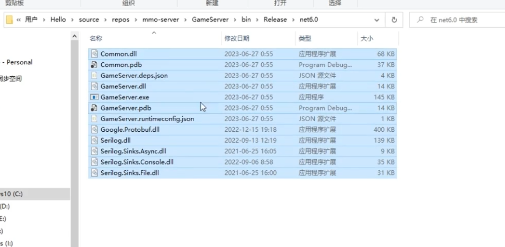


 .exe就是在windows下面运行的，  .dll就是在linux下面运行的

然后我们可以通过xshell进行传输


下面这样启动当前shell关闭的时候，服务器进程也会一起关闭的，因为它在shell下启动，所以我们需要将进程设置为守护进程

```
dotnet GameServer.dll  就能运行了
```

**1、安装screen**

```
# 在Ubuntu上安装并使用screen
sudo apt update  # 更新包列表
sudo apt install screen  # 安装screen工具
```

**2、新建窗口**

```
# 创建一个新的窗口
screen -S test
```

**3、执行文件**

```
# 进入窗口后 执行文件
python test.py > output.log 2>&1
```

**4、退出该窗口**

```
# 退出当前窗口
ctrl+a+d   （方法1：保留当前窗口）
screen -d  （方法2：保留当前窗口）


screen -list   查看存在的窗口
screen -X -S sessionID quit		关闭某个窗口，包括它允许的进程

```

**5、查看程序输出文件（output.log）**

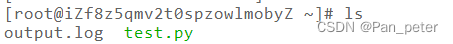 

**6、停止程序**

```
# 1、重新连接窗口
screen -r id或窗口名称
 
# 示例：
screen -r 344 
screen -r test
 
# 2、按 Ctrl + C 停止程序运行
```

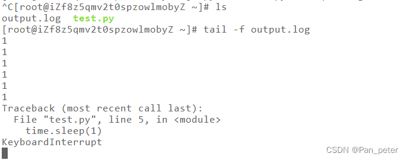 

> **实在不行，就查看程序的运行状态，也可以通过 `ps` 命令来查看程序是否在运行**


## server相关的一些注意事项


### 1.服务器的配置文件


**为什么要使用配置文件呢？**

我们将来要把项目打包部署到云服务器上面，总不能改一点信息就回来重新改代码吧。

比如说：

- server端的ip和port
- 数据库信息。
- 工作线程数


**常用的配置文件：**

- txt,配置解析麻烦
- json，不能写注释
- xml，结构啰嗦
- yml


**我们使用yaml文件来做配置文件**

**config.yaml**

```
database:
  host: 127.0.0.1
  port: 3306
  username: root
  password: root
  dbName: MMORPG

server:
  ip: 127.0.0.1
  port: 8888
  MessageRouteworkCount: 2
```

- 用两个空格代表缩进，来区分层级
- 使用冒号加空格代码赋值


**我们使用第三方扩展库 YamlDotNet，将配置文件进行解析**

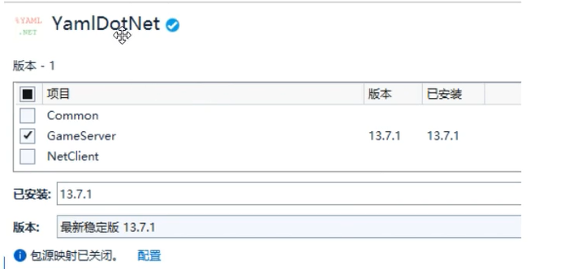 


**GameServer/Utils/Config.cs**

```
public static void Init(string filePath = "config.yaml")
{
    // 读取配置文件,当前项目根目录
    var yaml = File.ReadAllText(filePath);
    Log.Information("LoadYamlText:\n {Yaml}", yaml);

    // 反序列化配置文件
    var deserializer = new DeserializerBuilder().Build();
    _config = deserializer.Deserialize<AppConfig>(yaml);
}
```

注意：File.ReadAllText(filePath)  使用相对路径时是以当前工作目标为根目录的，也就是说必须再debug目录或者release目标中有才能读取

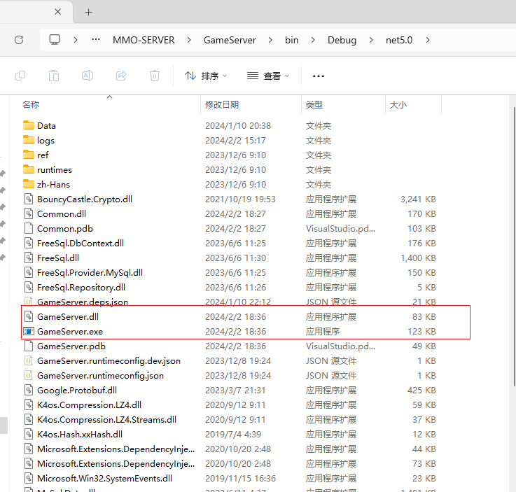 

我们可以把Config配置文件从项目中复制一份过来，但是每次修改都有复制也太麻烦了。。

可以使用以下方法来解决这个问题：

GameServer.csproj里面要有这段配置，配置文件回自动复制到运行目录

```
	<!--将文件复制到输出目录中 -->
	<ItemGroup>
		<None Update="config.yaml">
			<CopyToOutputDirectory>PreserveNewest</CopyToOutputDirectory>
		</None>
	</ItemGroup>		
```


### 2.来自客户端的数据

不要相信来自客户端的数据，如果要使用请做好检测


## 宝塔面板

```
bt
```


## 监测网络流量

1M的游戏服务器能带多少玩家，多人在线需要多大的带宽，如何测试带宽占用情况

可以使用火绒自带的流量监控软件


假设现在每个服务端1秒发送的数据包有300byte

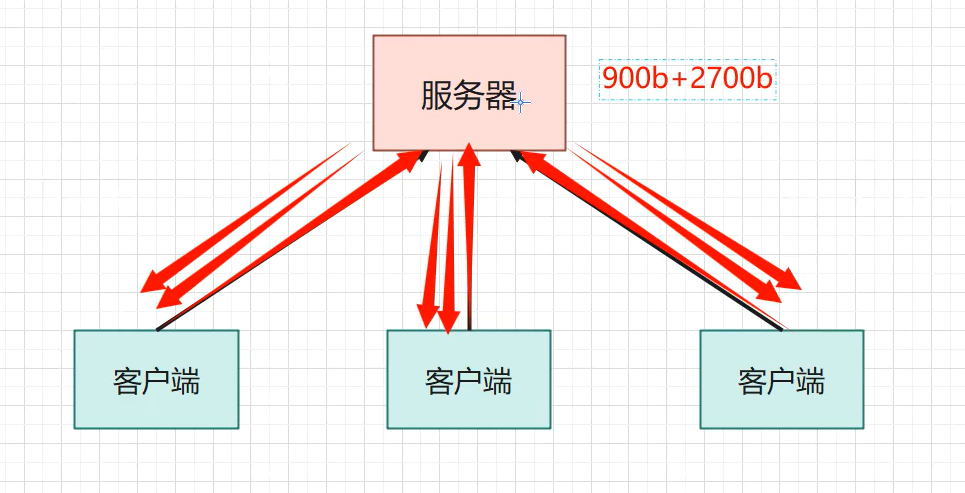

那么，3个客户端就一共发送900个byte

服务器需要对接收的每一个数据包向每一个客户端进行转发，这里有3个也就是3*300=900byte

一共转发3个数据包也就是3*900=2700byte

服务器的压力就是900+2700byte


如果我们在添加一个客户端

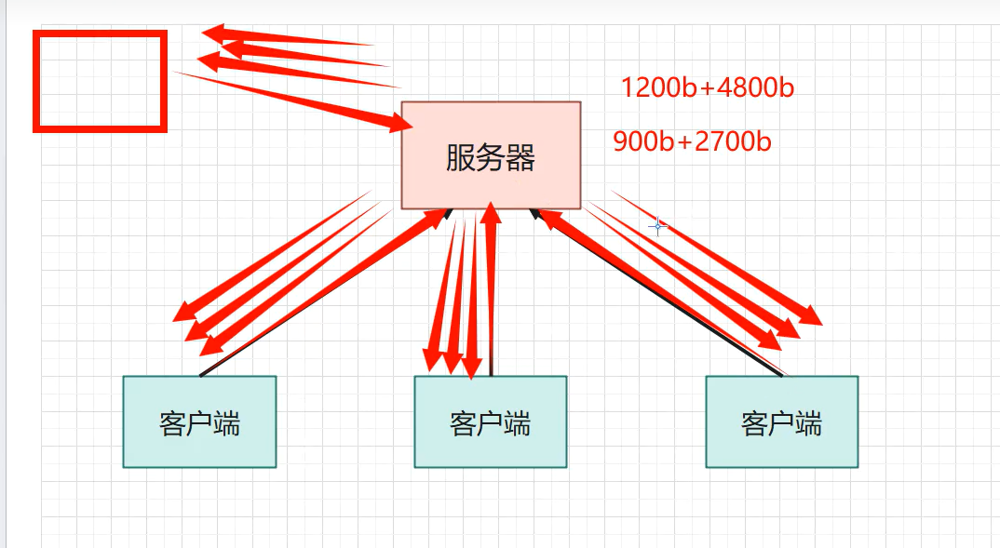

可以看到，每多一个人服务器的压力提高地很快。

我们可以得出结论：

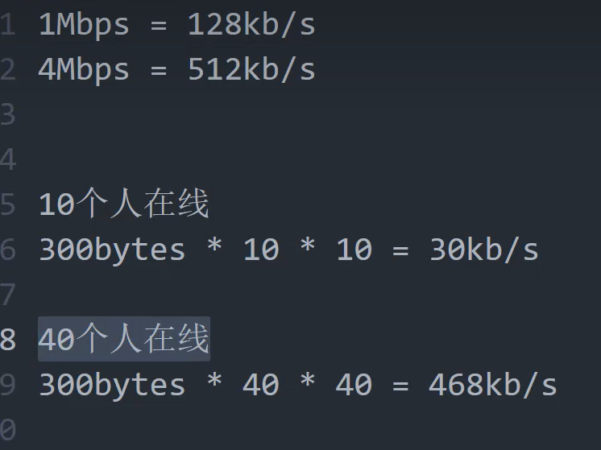

如果不在同一个场景里面可以同时在线的人数更多，因为不同的场景中不涉及到广播


# [Client项目结构说明]

Resources

​	这个文件里面的东西，在打包的时候都会打进exe中.

Scenes

Scripts

- projectBase

ArtRes


# [Server项目结构说明]


# [遇到的奇奇怪怪的BUG]


## **哎，有没有可能你复制代码的时候有些东西忘记改了啊？哈哈哈**


## start和awake问题

一些事件的绑定最好放到awake中去绑定

调用就放到start中调用，这样可以保证事件在被调用的时候已经绑定了。


## unity中乱码问题

将这个文件放到unity项目的根目录

.editorconfig

```
[*]
end_of_line = lf
charset = utf-8
trim_trailing_whitespace = true
insert_final_newline = true
indent_style = space
indent_size = 4
```

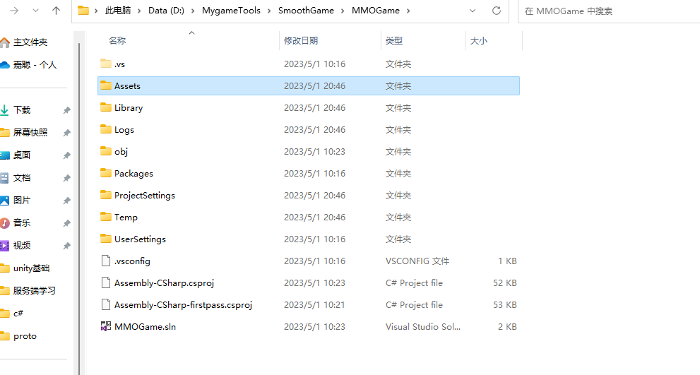


## 缓存问题

Unity的缓存问题可能表现为以下一些情况：

- 资源更新后仍然显示旧的内容
- 游戏运行过程中出现卡顿或卡死
- 卸载应用后再次安装仍然存在旧的缓存数据

以下是解决Unity缓存问题的几种方法：

1. 清理Unity缓存 在Unity编辑器中，可以通过选择菜单Edit -> Preferences -> Cache Server -> Purge Cache，清理掉Unity的缓存。这可以清除Unity编辑器的缓存，包括Assets的元数据、脚本编译输出等等。
2. 删除旧缓存文件 有时候旧的缓存文件仍然被保留在计算机中，可以在Unity项目的目录下手动删除缓存文件。通常，可以在Unity项目的Library文件夹中找到缓存文件，删除该文件夹中的所有文件并重新启动Unity编辑器。
3. 禁用缓存 可以在Unity编辑器中禁用缓存，可以通过选择菜单Edit -> Preferences -> Cache Server，然后将“Enable Cache Server”选项取消勾选来禁用缓存。
4. 使用其他的缓存管理工具 也可以使用其他的缓存管理工具来管理Unity的缓存，例如CCleaner等。这些工具可以扫描计算机中的缓存文件并删除过期的文件，以便释放磁盘空间。
5. 使用版本控制工具 可以使用版本控制工具来管理Unity项目的缓存文件。版本控制工具可以记录每次更改并跟踪每个文件的状态，从而避免出现缓存问题。

以上是解决Unity缓存问题的几种方法，**没有尝试过解决问题，有用程度待定**


## 场景切换问题

背景是服务端发送数据给本地的角色进行创建本地的实体和远程的实体

当场景中有其他远程实体，我们再进入游戏。

流程：进入游戏时候接收服务端响应会创建本地实体和进行场景切换，然后是接收服务端响应创建远程实体

这两个响应的顺序不能乱，否则会导致场景切换会导致实体被销毁。

解决方法：可以选择使用DontDestroyOnLoad，让实体切换场景时不销毁

## 客户端已断开服务器却收不到

**异常情况：丢包、系统蓝屏、客户端崩溃、unity后台异步任务没结束 ，这些情况服务器是无法知道的**


基于控制台的客户端，关闭时会触发系统关闭消息，会执行socket.Close();

在unity中停止调试的时候，主线程已经关闭了，但是负责网络连接的子线程异步任务没有关闭，	

处理方法：

**在客户端退出调试的时候关闭socket即可，OnApplicationQuit是unity内置的函数，重写即可。**

```
    private void OnApplicationQuit()
    {
        NetClient.Close();
    }
    
     public static void Close()
    {
        try
        {
            conn?.Close();
        }
        catch
        {

        }
    }
```


## 服务器控制台点击时会卡住

在c#的控制台应用程序中，当用户选中控制台中的文本时，标准输出流就会被暂停，这会影响程序的输出

解决方法：

1.摁F5刷新或者敲回车就可以正常运行了

2.使用异步的输出，程序就不会因为打印日志而阻塞正常运行

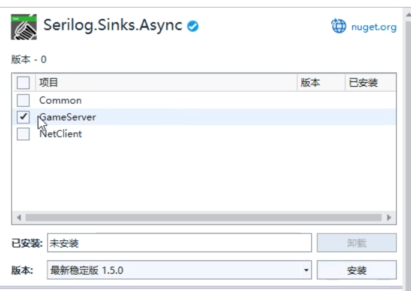

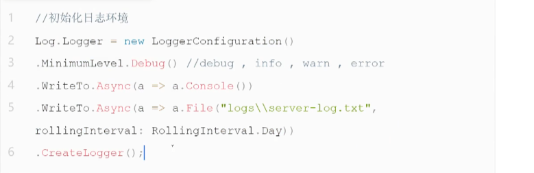


## 注意客户端的场景切换问题

可能会导致某些信息在场景切换后丢失了


## 技能被吞问题和ai表现抽搐问题

**1.skill系统问题**，ai追逐玩家释放技能，短时间内释放了多次技能，当施法消息传送到客户端的时候，由于客户端的技能表现是由状态机推动的且在技能active状态下不可打断，所以会有技能被吞的问题，释放了两个技能但是只打出1个技能。

解决方法：优化了skill的生命周期，添加后摇时间，给客户端的状态机保持一个缓冲的时间。

```
    public enum Stage
    {
        None,               //无状态
        Intonate,           //吟唱
        Active,             //已激活
        PostRock,           //后摇
        Colding             //冷却中
    }
```


**2.服务端怪物ai的问题**，原本追击玩家的流程是：巡逻->追击->攻击

追击的时候不断调整ai的位置，逐渐靠近玩家，当达到怪物攻击范围的时候，停下来不移动，然后攻击。

如果按照这样的流程，客户端ai在攻击玩家的时候就会出现一个抖动的问题（行走+不断挥刀，但是没有产生伤害），目前还没解决这个问题。正常来说服务器skill并没有影响怪物ai，初步判断应该是服务器ai的状态机和客户端的状态机的问题，存在一个攻击状态被打断的一个问题。

idle->attack/move   

attack->move/attack

很可能就是idle和move动作之间的抖动，到达攻击范围停下脚步（idle），判断能否攻击（发现不可以），然后继续靠近target(move)

重复上面，攻击范围上限浮动的时候，就会出现这个抖动。

推动怪物ai的是entitymanager，场景中技能的推动也是entitymanager，也就是中心计时器，

场景中推动战斗管理器也是这个中心计时器，说明这几个东西是单个线程处理的。

但是skill使用的时候，需要将的施法请求放到下一帧处理，会不会就是因为这一帧的时间，导致原来满足攻击的距离现在变得不满足了，所以idle->move...，这个时间太短了。。。。。

**临时方法**：当达到怪物攻击范围的时候，直接攻击，去处理停下来这个动作。倒是客户端展现的时候会出现一个攻击时滑步的问题。

**问题未解决**：将方法1修复之后，这个现象没有复现了，估计也是这个攻击频率的问题，需要给一个缓冲时间，否则一个时间段内，客户端短时间接收到多次attack的施法请求可能会产生问题。

**问题未解决：**

这是客户端的施法响应，它没有判断就一股脑将skill.use，而技能的推动会导致状态机的状态切换

这里没问题，不用改了，甚至状态机切换的active状态下不能中断也需要删除，因为客户端只是一个显示用的view层次。

```
    private void _SpellCastResponse(Connection conn, SpellCastResponse msg)
    {

        foreach (CastInfo item in msg.List)
        {
            var caster = EntityManager.Instance.GetEntity<Actor>(item.CasterId);
            var skill = caster.skillManager.GetSkill(item.SkillId);
            if (skill.IsUnitTarget)
            {
                var target = EntityManager.Instance.GetEntity<Actor>(item.TargetId);
                skill.Use(new SCEntity(target));
            }
            else if (skill.IsPointTarget)
            {

            }else if (skill.IsNoneTarget)
            {
                skill.Use(new SCEntity(caster));
            }

        }
    }
```


状态机的共有属性skill可能会受到覆盖的影响，导致后续的技能使用skill的时候导致空指针异常。

这里改为有null就不能使用use。

```
        /// <summary>
        /// 使用技能
        /// </summary>
        /// <param name="target"></param>
        public void Use(SCObject target)
        {
            //只有本机玩家才会用到这个值
            if (Owner.EntityId == GameApp.character.EntityId)
            {
                GameApp.CurrSkill = this;
            }
            _sco = target;
            RunTime = 0;

            Owner.StateMachine.parameter.skill = this;

            //技能阶段从none切换到蓄气阶段
            Stage = SkillStage.Intonate;
            OnIntonate();
        }
```

**问题解决：**其实这个抖动就是用混合书导致idle和walk之间不断切换的抖动，因为切换不平滑。捣鼓半天还是这两个抖动我就知道。

现在只能接收滑步攻击这个小问题了。。。。。，后面再修改吧。


## 2024.脚本生命周期问题

关于awake和start的问题

当你在某些场景下，比如两个对象都在start中修改了同一东西，这就会导致修改后的状态不符合预期。

因为我们确定不了这两个对象谁先执行，这就导致了我以为setactive(bool)实现，其实并没有失效，就是结果被覆盖了。

因为我一直将awake里写获取组件  ，start中设置变量值的


## 背包逻辑错误问题

**关于背包打开没有数据。**

```
    protected  override void Start()
    {
        base.Start();

        //监听一些个事件
        Kaiyun.Event.RegisterOut("UpdateCharacterKnapsackData", this, "RefreshKnapsackUI");
        Kaiyun.Event.RegisterOut("UpdateCharacterKnapsackPickupItemBox", this, "RefreshPickUpBox");
        Kaiyun.Event.RegisterOut("GoldChange", this, "UpdateCurrency");
        Kaiyun.Event.RegisterOut("UpdateCharacterEquipmentData", this, "RefreshEquipsUI");

        Init();

    }
```

原本是先进行init()然后在进行事件监听的，我们先初始化，里面会向服务器拉取背包数据，响应的时候就会通过事件来进行回调刷新ui。但是响应的速度很快，我们没来得及监听事件，就已经到达了，所以就会导致第一次刷新会不成功的问题。

**解决方法**：1.调整监听的位置，如上面的代码

​					2.在角色上线的时候我们就拉取背包数据


**每次上线背包中第0个位置的物品消失问题。**

我们的装备系统在穿戴装备的时候，会将背包中对应的位置的物品移除。0位也是背包合理位置

我们粗心讲武器的pos属性设置为0，所以导致每次穿戴的时候，都将背包中第0位的物品移除。

**解决方法：**

​	将物品的pos属性默认置为-1，-1是背包中不合理的位置


## unity控制台error停止问题

unity控制台中的error pause 遇到错误打印就停止。导致我以为是我的热更代码有问题。浪费我一下午。


## 2024.7.25

使用热更新之后，打包出来的游戏，会有游戏对象脚本组件丢失的问题。而在编辑器里面是没有任何问题的。

使用Resource.load加载资源的

我们换成使用yoo的异步加载就好了。


## 2024.8.28

技能飞行物打到monster的时候会，服务器会给客户端发送moster离开场景的数据包

```
                targets = AreaEntitiesFinder.GetEntitiesInCircleAroundEntity(target, Define.MissileEffectRadius, true).ToList();
```

关键代码MissileEffectRadius的大小问题，我们将其*0.001f时，这会影响到十字链表查询范围entity的时间，初步猜测就是刚刚好这么点时间，发生了线程并发的问题。


# 服务器架构

## 参考

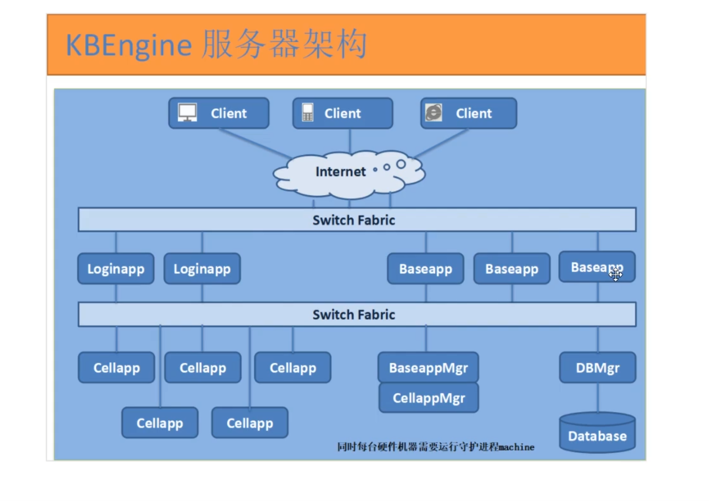

Switch Fabric:交换机结构，用于区分不同的请求，送入到不同的服务器当中进行处理

Loginapp:登录服务器，会有几台服务器来处理用户的登录请求 ，等你登录成功后就会进入Baseapp

Baseapp:基础服务器，想一些不需要空间坐标，像一些工会、拍卖行这些都可以用baseapp进行处理

如果涉及到空间坐标的,就会用到Cellapp:地图服务器


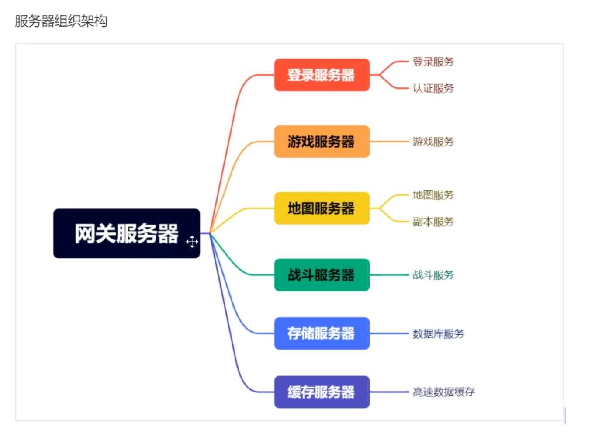

**网关服务器**：用于与外界进行沟通，比如说我们游戏登录以后要选择后一个服，例如广东一区连接进去 ，它实际上连接的就是网关服务器，它有一个固定的ip地址，让客户端能直接找到它连接。

连接网关服务器以后，他会跟你你要干的事情进行转发，比如说你要登录的话，他就会给你转发到**登录服务器**，在这里处理你的登录服务和认证服务（qq这种第三方认证）

等你登录成功了，就可以通过**游戏服务器**去加载一些没有三维坐标的，没有空间坐标的东西，包括你的个人信息，游戏角色角色列表，工会，拍卖行，世界频道。

如果你涉及到了空间坐标的，你要做不同的场景，一个主城城镇，这时候就可以使用**地图服务器**，连接地图服务器，使用里面的地图服务。

**战斗服务器**：提供战斗服务，比如说你的生命值，你扣多少血，你身上有多少技能，技能冷却。

**存储服务器**：数据库，存放数据

**缓存服务器**：将常用的数据放到这 


以上其实称为：**分布式远程调用**


## MMO系统设计

mmo:Massively Multiplayer Online大型多人在线游戏

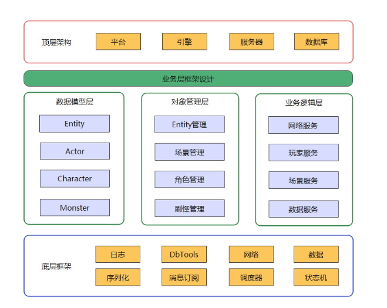


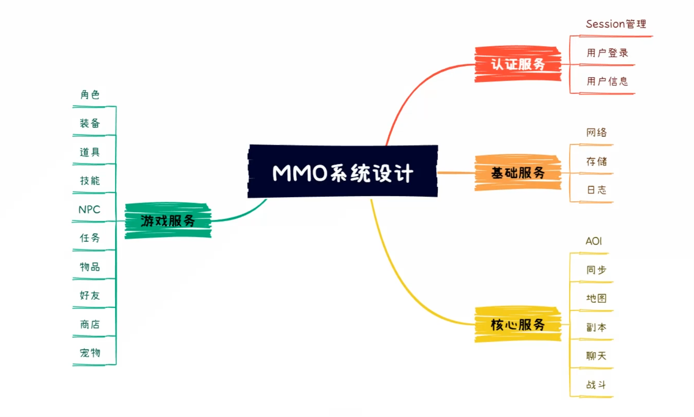

网络：服务器如何进行通信，要开发客户端服务端 

存储：用户的信息啊，...

日志：记录异常信息，特殊信息，方便出问题时查找定位


AOI：Area Of Interest 一个很大的地图当中，你不能把所有的信息都同步给玩家，它只需要得到他视野附近的人就可以了，不需要将全部人都加载进来 

同步：同步基本信息，位置，方向角度，动画

地图：每个玩家都是共享的

副本：

聊天：私聊，世界频道

战斗：角色属性，角色状态：死亡


**上面这些都是都是网游都有的功能**


## 项目模块

将代码封装好我们就可以事半功倍


### 1.通用模块

例如：封装一个json数据，数据转换，一些经常用到的，写什么功能都能够直接去调用它，直接拿来用


### 2.网络模块

数据通信的东西将其封装好，我们只关注数据发过去和接收回来，不考虑底层实现


### 3.数据加载

就比如说是一些技能数据，常用的一些表格加载到游戏当中


### 4.配置解析

比如说一些屏幕分辨率，音量，一些常见的属性，我们都可以放到配置里面

配置如何解析呢？我们也可以封装成一个模块可以拿过来直接用。


### 5.DB模块

服务端可以快速地连接到数据库，对数据库进行增删改查。


# 网络模块

## 概要

NetService：网络服务，启动端口监听，接收Socket连入，建立连接，启动路由，

NetConnection：网络连接，代表客户端，负责消息接收与发送

MessageRouter：消息路由，负责订阅与消息转发

LengthFieldDecoder：消息解码器

后续主要用到： NetConnection 发送消息，MessageRouter订阅消息


## 服务端工作原理


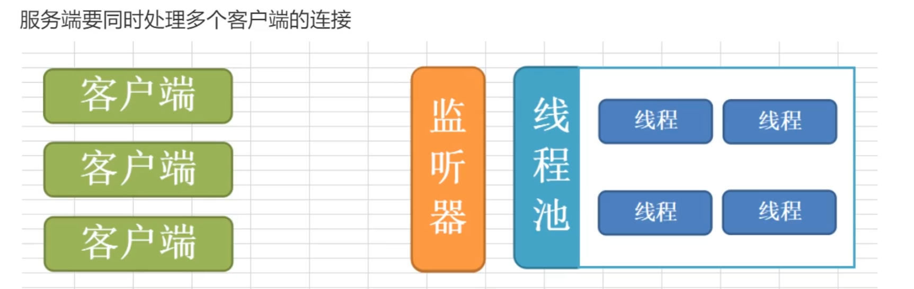

并且连接不能断掉，如果连接断了，就说明这个人掉线了。


 **监听器**：它要绑定在一个端口上，客户端连接的时候就是通过ip和端口号直接连接过来，连接到监听器之后，监听器是不给你处理数据的，它只是在这里监听等着你连接进来而已，然后监听器会将连接交个线程进行处理。

**线程池**：监听器将接收的连接交给某个线程（哪一个空闲就给哪个，如果都在忙就稍后再处理 ），所以说是由线程池和客户端保持联系，进行数据通信。 如果你cup有8个线程，那么同一时间就只能有8个线程运行。


## 异步连接

### 同步和异步

当我们使用Socket进行网络通信时，我们需要发送和接收数据，这些操作可以使用同步方式和异步方式进行。

在**同步模式**下，发送和接收数据的操作是阻塞的，也就是说程序会一直等待操作完成之后才会执行下一条语句。例如，当我们使用 `Socket.Send` 方法发送数据时，程序会一直等待数据发送完毕之后才会执行下一条语句。同样地，在接收数据时，程序会一直等待数据接收完毕之后才会执行下一条语句。这种方式下，程序会被阻塞，直到操作完成。

在**异步模式**下，发送和接收数据的操作是非阻塞的，也就是说程序不会等待操作完成就会继续执行后续代码。例如，在使用 `Socket.BeginSend` 方法发送数据时，程序会立即返回，而不会等待数据发送完毕。同时，程序会通过回调函数或事件来通知操作的完成情况。这种方式下，程序不会被阻塞，可以继续执行其他操作。

需要注意的是，使用异步方式进行网络通信需要编写异步回调函数或者使用异步事件，相对于同步方式来说，它更加复杂。但是，异步方式在高并发和网络延迟较高的情况下，可以提高程序的性能和响应速度。

综上所述，同步和异步方式是指数据的传输方式，而不是代码的执行方式。在Socket编程中，通常使用异步方式进行网络通信。


### 两种异步方式

C#异步接收有两套API，分别是：

1、 AcceptAsync

无论循环接收多少次，都是重复利用同一个对象（SocketAsyncEventArgs）

2、Begin+End模式 

每次循环都会创建新的异步结果对象(IAsyncResult)


### 相关api

#### SocketAsyncEventArgs

`SocketAsyncEventArgs` 是 C# 中用于异步套接字操作的类，属于 `System.Net.Sockets` 命名空间。它是一个高效的异步套接字编程工具，通常用于处理大量并发连接的高性能网络应用程序。

##### 主要功能
`SocketAsyncEventArgs` 提供了一个事件驱动的模型来处理异步网络操作，如连接、发送、接收数据等。它的设计目的是避免在每个异步操作中创建新的对象，减少内存分配和回收的开销，从而提高性能。

##### 常用属性和方法
- **SocketAsyncEventArgs.SocketError**：获取或设置与异步操作相关的错误信息。
- **SocketAsyncEventArgs.Buffer**：获取或设置数据缓冲区，用于存储接收到的数据或将要发送的数据。
- **SocketAsyncEventArgs.RemoteEndPoint**：获取或设置远程终结点，用于表示连接的目标。
- **SocketAsyncEventArgs.Completed**：用于订阅操作完成时的事件处理程序。
  
##### 常用异步操作
以下是几种常见的异步操作及其对应的使用方法：

1. **连接（ConnectAsync）**
   
   ```csharp
   SocketAsyncEventArgs connectEventArgs = new SocketAsyncEventArgs();
   connectEventArgs.RemoteEndPoint = new IPEndPoint(IPAddress.Loopback, 8080);
   connectEventArgs.Completed += (sender, e) => {
       if (e.SocketError == SocketError.Success) {
           Console.WriteLine("Connected successfully.");
       } else {
           Console.WriteLine($"Error: {e.SocketError}");
       }
   };
   socket.ConnectAsync(connectEventArgs);
   ```
   
2. **发送数据（SendAsync）**
   ```csharp
   SocketAsyncEventArgs sendEventArgs = new SocketAsyncEventArgs();
   sendEventArgs.SetBuffer(buffer, 0, buffer.Length);
   sendEventArgs.Completed += (sender, e) => {
       if (e.SocketError == SocketError.Success) {
           Console.WriteLine("Data sent successfully.");
       } else {
           Console.WriteLine($"Error: {e.SocketError}");
       }
   };
   socket.SendAsync(sendEventArgs);
   ```

3. **接收数据（ReceiveAsync）**
   ```csharp
   SocketAsyncEventArgs receiveEventArgs = new SocketAsyncEventArgs();
   receiveEventArgs.SetBuffer(new byte[1024], 0, 1024);
   receiveEventArgs.Completed += (sender, e) => {
       if (e.SocketError == SocketError.Success) {
           Console.WriteLine($"Received {e.BytesTransferred} bytes.");
       } else {
           Console.WriteLine($"Error: {e.SocketError}");
       }
   };
   socket.ReceiveAsync(receiveEventArgs);
   ```

##### 优点
- **高性能**：通过减少对象分配和垃圾回收，提高网络程序的性能。
- **事件驱动模型**：`SocketAsyncEventArgs` 提供了事件驱动的异步操作处理方式，便于管理操作完成后的逻辑。
- **可重用**：同一个 `SocketAsyncEventArgs` 实例可以被多个异步操作重复使用，降低了内存开销。

##### 适用场景
- 高并发的服务器端应用程序，如游戏服务器、Web 服务器或实时数据处理服务器。
- 需要高效处理网络通信的场合。

`SocketAsyncEventArgs` 适合开发那些对性能要求很高，并且需要处理大量并发连接的网络应用。


## 自定义报文

双方通信需要遵循协议，按照规定的方式发送和接收才可以完成数据通信。

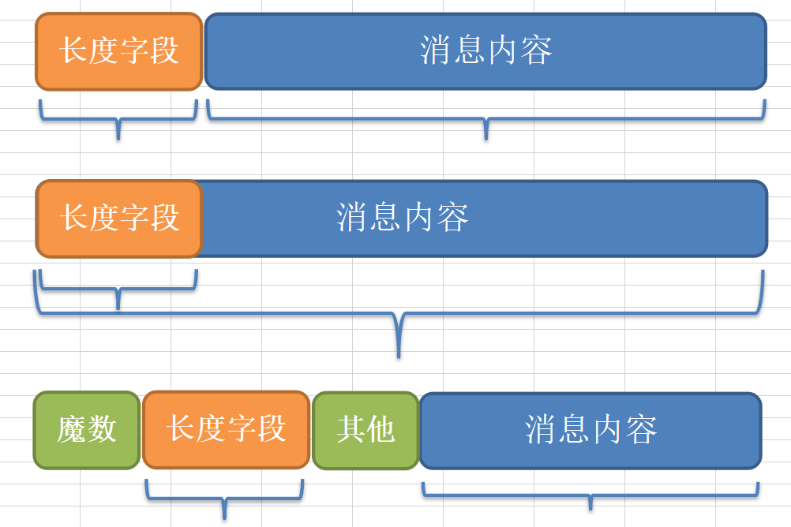


魔数：魔法值（检验值） ，规定一个值比如说是1314（两个字节），如果这个检验值不是1314就证明这个包不是我们发的，可能是有人试图攻击我们的服务器，直接返回即可。


### 大小端问题

#### 什么是大小端

**Little-Endian** 数据的低位字节位存放在内存的低地址端，高位字节存放在内存的高地址端。

**Big-Endian** 数据的高位字节位存放在内存的低地址端，低位字节存放在内存的高地址端。

举个栗子：

比如十六进制数字0x12345678，它占4个字节，每个字节（0x00~0xFF）。

这个数据的内存布局为：

**大端模式**

低地址---------------高地址

0x12 | 0x34 | 0x56 | 0x78

**小端模式（intel模式）**

低地址---------------高地址

0x78 | 0x56 | 0x34 | 0x12


#### 常见的大小端

Intel的x86系列芯片是小端芯片，ARM架构默认采用小端，也可以切换为大端。另外，对于大小端的处理也和编译器的实现有关，在C语言中，默认是小端（但也有例外，C51单片机就是大端实现），Java是平台无关的，默认是大端。

**在网络上传输数据普遍采用的都是大端模式。**


#### 判断大小端

```
bool IsLittleEndian() {
    int a = 0x1234;
    char c = *(char *)&a;
    if (c == 0x34) {
        return true;
    }
    return false;
}
```

#### 网络相关的

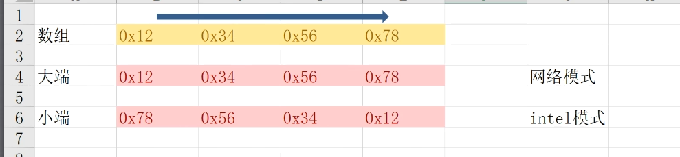

所以你需要判断你的系统平台是一个大端模式还是小端模式。

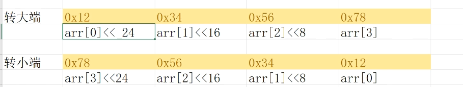

读取大端模式的int32值

```
//获取大端模式int值
private int GetInt32BE(byte[] data, int index)
{
    return (data[index] << 0x18) | (data[index + 1] << 0x10) | (data[index + 2] << 8) | (data[index + 3]);
}
//获取小端模式int值
private int GetInt32LE(byte[] data, int index)
{
    return (data[index] | (data[index + 1] << 8) | (data[index + 2] << 0x10) | (data[index + 3] << 0x18);
}
```


```
 //如果系统是小端模式就反转为大端模式
  if (BitConverter.IsLittleEndian) Array.Reverse(lenBytes);
```


### 粘包和分包

Sticky  unpacking 

是利用socket在tcp协议下内部的优化机制(等缓冲区满了在打包发送)

粘包：可能会将几条消息打包成一条消息，但是客户端只会接收一条消息

分包：当数据量很大的时候就可能会将一条消息分为几条消息发送

最终会产生以下四种情况：

 


#### 解决方法

1.固定长度，比如100字节大小，如果不足100字节可以通过补0或空等，进行填充到指定长度。通常不用

**2.末尾固定分隔符**，例如：\r\n。如果发生拆包需要等待多个包发生过来之后再找到其中的\r\n进行合并

 **3.将消息分为头部和消息体**，头部中保存整个消息的长度，只是读取到足够长度的消息后才算是读到一个完整的消息。最常用

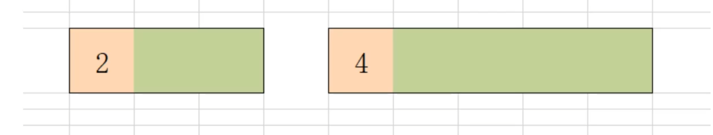

其中头部占用的空间长度是固定的，例如说4个字节作为消息头。


#### 用到的api

**字节转换**

1.字符串转换成字节数组：

```
System.Text.Encoding.UTF8.GetBytes; 
```

2.Int32转换成字节数组BitConverter.GetBytes（int）;//变为对应类型长度的byte[],这里变位4个字节长度的

​										BitConverter.ToInt32//取字符数组中前4个字节

3.从字符数组转换string

```
string s = Encoding.UTF8.GetString(dataBuffer, 12,count-8);
```


**byte[]合并**

CopyTo

```
        public static byte[] addBytes(byte[] data1, byte[] data2)
        {
            byte[] data3 = new byte[data1.Length + data2.Length];
            data1.CopyTo(data3, 0);
            data2.CopyTo(data3, data1.Length);
            return data3;
        }
```

Array.Copy

```
byte[] byteAll = new byte[bytes1.Length + bytes2.Length];
Array.Copy(bytes1, 0, byteAll, 0, bytes1.Length);
Array.Copy(bytes2, 0, byteAll,bytes1.Length, bytes2.Length);
```

Concat

```
using System.Linq;

byte[] data1 = new byte[8000];
byte[] data2 = new byte[2000];
data1 = data1.Concat(data2).ToArray();
```


**输出字符数组**

```
Console.WriteLine(BitConverter.ToString(head));
```


### **长度字段解码器**

（异步接收的操作在这里完成）

lengthFieldOffset	长度字段的位置下标

lengthFieldLength	长度字段本身的长度，只推荐 1, 2, 4, 8

lengthAdjustment	偏移位，长度字节和内容中间隔了几个字节，可为负数。

initialBytesToStrip	表示获取完一个完整的数据包之后，舍弃前面的多少个字节


**这个类的作用就是异步接收来自客户端的信息，然后将消息内容byte[]返回给我们**


### 消息解析

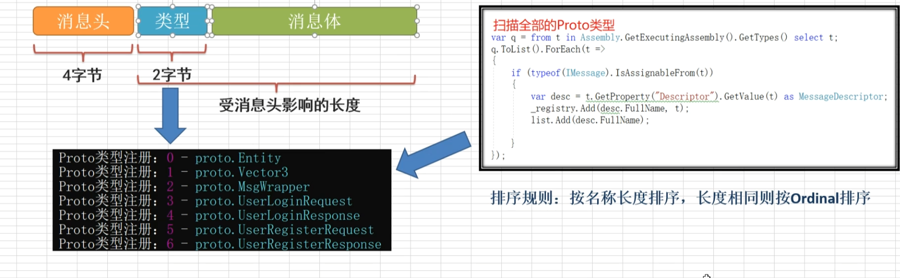


### Varints数值压缩编码

varint是一种对正整数进行可变长字节编码的方法，大多数情况下可起到数据压缩的作用。通常，一个int型整数占4个字节，若该整数的数值小于256，显然一个字节的空间就能存储，浪费了3个字节的空间，而varint就起到了压缩数据的作用。整数数值越小，需要存储的字节数就越少。

#### varint原理


```
uint32_t = 1;
// 原码：0000 0000 0000 0000 0000 0000 0000 0001
// 补码：0000 0000 0000 0000 0000 0000 0000 0001
// varints编码：0|000 0001(0x01)
//

// 整数1的variant解码
// 读取到0x01, msb位为0, 说明读取结束，该数就只占一个字节.
// 读到7bits值为000 0001的补码，显然其原码是000 0001,也就是数值1
// 如此，便将variant编码的整数1解码出来了。而0x01只用到了一个字节哦！
```

```
uint32_t = 665;
// 原码：0000 0000 0000 0000 0000 0010 1001 1001
// 补码：0000 0000 0000 0000 0000 0010 1001 1001
// 按照7bit一组，0000 ... 0000101 0011001
// 从低位往高位依次取7bit,重新编码,注意是反转排序，全0的bit舍弃
// 0011001 0000101
// 再加上msb，每7bit组 组成一个字节
// varints编码即为：
// 1|0011001 0|0000101
// 0x99       0x05
// 如此，即将整数665编码成0x99 0x05,将原来的4个字节压缩成2个字节

// 再来看看解码过程
// 编码为 0x99 0x05, 第一个字节的msb位为1，表示继续读取下一个字节；第二个字节的msb为0，读取结束。
// 读出两个字节的内容后，去掉msb，还原成2组 7bits组，即 0011001 0000101
// 再将两组7bits反转，即 0000101 0011001 (补码)
// 由于是整数，所以得到原码 0010 1001 1001，即665

```


我们知道variant是可变长的编码方式，但是，它总得知道要读取多少个字节结束啊，总不能一直读下去吧。通常我们需要指定length信息，而variant编码天然包含了length，也就是通过msb位来识别，如果某个数的variant编码的字节的msb位为1，就意味着还要继续读取，没有结束，直到后面的某个字节的msb为0。正是msb的存在可以让数值小的数占用更少的空间，提高了空间利用率。由于每个字节都拿出一个bit做为msb，那么，4个字节最大额能表示的数为2^28而不是2^32。在实际情况下，大于2^28的数很少出现，所以在实际工程中并不会影响高效性。


#### 缺点

```
int32_t val = -1 // 4字节
// 原码：1000 0000 0000 0000 0000 0000 0000 0001
// 补码：1111 1111 1111 1111 1111 1111 1111 1111
// 按照variant的编码规则，7bit一组，低位在前
// 补码的4个字节，共32bit，按7bit分组，可分为4组，这4组的msb均为1；余下的4bit在第5组，msb为0，其余位补0
// 1111111 1111111 1111111 1111111 1111
// 1|1111111 1|1111111 1|1111111 1|1111111 0|0001111
//   0xFF      0xFF      0xFF     0xFF       0x0F
// 所以，-1的varint编码为 0xff 0xff 0xff 0xff 0xf 共5字节
```


从上例来看，原本占4字节的-1，经variant编码后，占了5个字节。并没有压缩呀！这就是variant编码的缺陷：**variant编码对负数编码效率低**。通常可使用zigzag编码将负数转为正数，然后再用variant编码

从上例来看，原本占4字节的-1，经variant编码后，占了5个字节。并没有压缩呀！这就是variant编码的缺陷：**variant编码对负数编码效率低**。通常可使用zigzag编码将负数转为正数，然后再用variant编码


#### 编码规则

1. 将整数的二进制补码按7bit分组，然后按照小端排序
2. 除最后一组的msb位置0，其他组的msb置1；

已知编码规则，解码就是反向的过程，一是要去掉msb重新组合7bit组，二是7bit组要反序存储。


#### 代码


##### 1.压缩

```
public static byte[] VarintEncode(ulong value)
{
    var list = new List<byte>();
    while (value > 0)
    {
        byte b = (byte)(value & 0x7f); // 获取 value 的最低 7 位
        value >>= 7; // 将 value 右移 7 位，相当于除以 128
        if (value > 0)
        {
            b |= 0x80; // 如果还有剩余的位需要编码，将 b 的最高位设置为 1
        }
        list.Add(b); // 将 b 添加到列表中
    }
    return list.ToArray(); // 将列表转换为字节数组并返回
}
```

函数使用一个 while 循环，每次从 value 中获取最低的 7 位，将其存储到一个字节中，并将 value 右移 7 位。如果 value 的值还不为 0，则说明还有需要编码的位，需要继续循环。如果最后一个字节不足 7 位，则最高位为 0，否则最高位为 1，表示后面还有更多字节需要编码。

例如，如果 value 的值为 300，它的二进制表示为 100101100，编码过程如下：

- 第一次循环：b = 1001011，value = 4
- 第二次循环：b = 0000100，value = 0

最终得到的字节数组为 { 0x8C, 0x02 }。其中第一个字节的二进制表示为 10001100，表示最高位为 1，后面还有一个字节需要编码，低 7 位表示整数的一部分。第二个字节的二进制表示为 00000010，表示最高位为 0，这是最后一个字节，低 7 位表示整数的最高部分。

**注意：**

```
返回的数组：低位在前，高位在后处理
```


##### 2.解压

```
public static ulong VarintDecode(byte[] buffer)
{
    ulong value = 0; // 初始化 value 的值为 0
    int shift = 0; // 初始化 shift 的值为 0
    int len = buffer.Length; // 获取 buffer 的长度
    for (int i = 0; i < len; i++)
    {
        byte b = buffer[i]; // 获取 buffer 中的一个字节
        value |= (ulong)(b & 0x7F) << shift; // 将字节中的低 7 位左移 shift 位，并与 value 进行按位或运算
        if ((b & 0x80) == 0) // 判断字节中的最高位是否为 0
        {
            break; // 如果最高位为 0，则表示该字节是最后一个字节，跳出循环
        }
        shift += 7; // 如果最高位为 1，则表示后面还有字节需要解码，将 shift 增加 7
    }
    return value; // 返回解码后的整数值
}
```

函数使用一个 for 循环，每次从 buffer 中获取一个字节，将字节中的低 7 位左移 shift 位，并与 value 进行按位或运算。如果字节的最高位为 0，则表示该字节是最后一个字节，跳出循环并返回解码后的整数值。如果字节的最高位为 1，则表示后面还有字节需要解码，将 shift 增加 7，继续循环解码。

例如，如果要解码的字节数组为 { 0x8C, 0x02 }，解码过程如下：

- 第一次循环：b = 10001100，低 7 位为 1001011，shift = 0，value = 1001011
- 第二次循环：b = 00000010，低 7 位为 0000010，shift = 7，value = 100101100

最终得到的无符号整数的值为 300，与编码时的值相同。


**注意：**

```
先处理的低位，放在ulong的最低位（也就是最右边），然后下一个字节是左移7位的，也就是高位（左边的）。这就是为什么左移的原因
```


## Protobuf


### 1.简介

protobuf是Google公司的一种轻便高效的数据存储格式，常用于处理结构化数据，具有语言无关、平台无关、可扩展性特性，常用于通讯协议、服务端数据交换场景。

**性能高效**：与XML相比，protobuf更小（3 ~ 10倍）、更快（20 ~ 100倍）、更为简单。

**语言无关、平台无关**：支持Java、C++、Python、C#、Go等多种语言，不与系统直接交互。

**扩展性强、兼容性强**：描述简单，更新消息结构时过程简单，且不会破坏原有的程序。

缺点：不够xml和json直观


**序列化：把程序对象转化为字节或文字。**

**反序列化：把存储的字节或者文字转化为程序对象。**


### 2.proto3语法


#### 定义一个 Message

首先我们来定义一个 Search 请求，在这个请求里面，我们需要给服务端发送三个信息：

- query：查询条件
- page_number：你想要哪一页数据
- result_per_page：每一页有多少条数据

于是我们可以这样定义：

```
// 指定使用proto3，如果不指定的话，编译器会使用proto2去编译
syntax = "proto3";
 
message SearchRequests {
    // 定义SearchRequests的成员变量，需要指定：变量类型、变量名、变量Tag
    string query = 1;
    int32 page_number = 2;
    int32 result_per_page = 3;
}
```

#### 定义多个message 类型

一个 proto 文件可以定义多个 message ，比如我们可以在刚才那个 proto 文件中把服务端返回的消息结构也一起定义：

```
message SearchRequest {
    string query = 1;
    int32 page_number = 2;
    int32 result_per_page = 3;
}
 
message SearchResponse {
    repeated string result = 1;
}
```

message 可以嵌套定义，比如 message 可以定义在另一个 message 内部

```
message SearchResponse {
    message Result {
        string url = 1;
        string title = 2;
        repeated string snippets = 3;
    }
    repeated Result results = 1;
}
```

定义在 message 内部的 message 可以这样使用：

```
message SomeOtherMessage {
    SearchResponse.Result result = 1;
}
```


#### 定义变量类型

在刚才的例子之中，我们使用了2个`标准值类型`： string 和 int32，除了这些标准类型之外，变量的类型还可以是复杂类型，比如自定义的`枚举`和自定义的 `message`

这里我们把标准类型列举一下[protobuf](https://so.csdn.net/so/search?q=protobuf&spm=1001.2101.3001.7020)内置的标准类型以及跟各平台对应的关系：

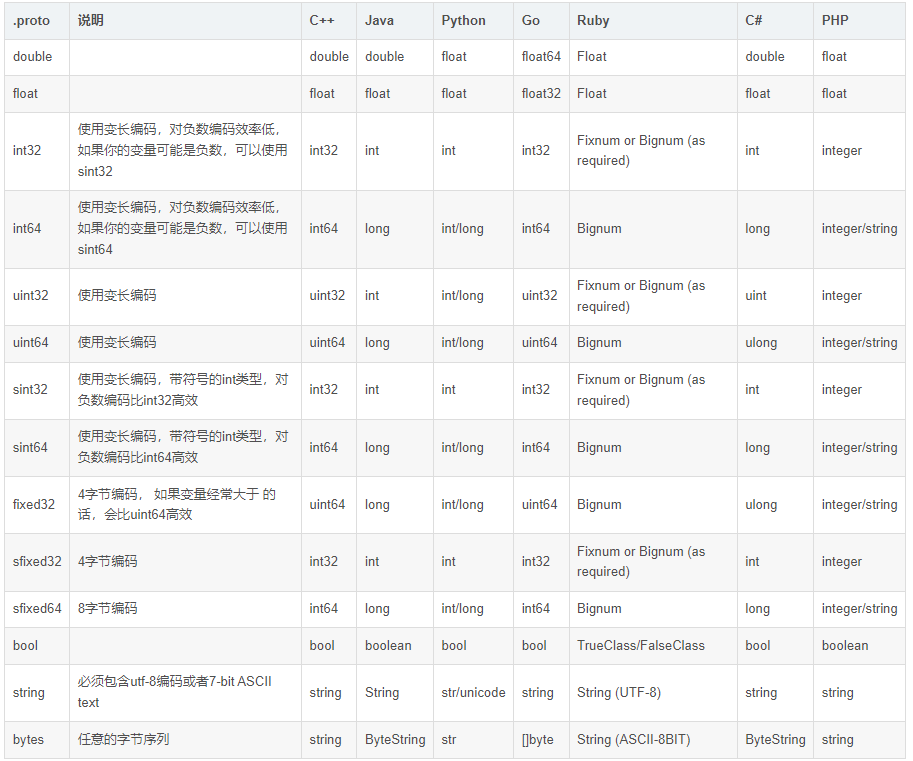


#### 分配Tag

每一个变量在message内都需要自定义一个**唯一的数字Tag**，protobuf会根据Tag从数据中查找变量对应的位置，具体原理跟protobuf的二进制数据格式有关。Tag一旦指定，以后更新协议的时候也不能修改，否则无法对旧版本兼容。

Tag的取值范围最小是1，最大是-1，但 19000~19999 是 protobuf 预留的，用户不能使用。

虽然 Tag 的定义范围比较大，但不同 Tag 也会对 protobuf 编码带来一些影响：

1 ~ 15：单字节编码
16 ~ 2047：双字节编码
使用频率高的变量最好设置为1 ~ 15，这样可以减少编码后的数据大小，但由于Tag一旦指定不能修改，所以为了以后扩展，也记得为未来保留一些 1 ~ 15 的 Tag

```
message SearchRequest {
    string query = 1;
    int32 page_number = 2;
    int32 result_per_page = 3;
}

上面的1、2、3不是赋值，而是一个属性的标记
```


#### 指定变量规则

在 proto3 中，可以给变量指定以下两个规则：

- singular：0或者1个，但不能多于1个

- repeated：任意数量（包括0）

当构建 message 的时候，build 数据的时候，会检测设置的数据跟规则是否匹配

在proto2中，规则为：

- required：必须有一个
- optional：0或者1个
- repeated：任意数量（包括0）

```
message SearchRequest {
    singular string query = 1;
    singular int32 page_number = 2;
    singular int32 result_per_page = 3;
}
不过正常情况下用不上
```


#### 注释

用`//`表示注释开头，如

```
message SearchRequest {
    string query = 1;
    int32 page_number = 2; // Which page number do we want
    int32 result_per_page = 3; // Number of results to return per page
}
```


#### 保留变量不被使用

上面我们说到，一旦 Tag 指定后就不能变更，这就会带来一个问题，假如在版本1的协议中，我们有个变量：

```
int32 number = 1；
```

在版本2中，我们决定废弃对它的使用，那我们应该如何修改协议呢？注释掉它？删除掉它？如果把它删除了，后来者很可能在定义新变量的时候，使新的变量 Tag = 1 ，这样会导致协议不兼容。那有没有办法规避这个问题呢？我们可以用 reserved 关键字，当一个变量不再使用的时候，我们可以把它的变量名或 Tag 用 reserved 标注，这样，当这个 Tag 或者变量名字被重新使用的时候，编译器会报错

```
message Foo {
    // 注意，同一个 reserved 语句不能同时包含变量名和 Tag 
    reserved 2, 15, 9 to 11;
    reserved "foo", "bar";
}
```


#### 默认值

当解析 message 时，如果被编码的 message 里没有包含某些变量，那么根据类型不同，他们会有不同的默认值：

- string：默认是空的字符串
- byte：默认是空的bytes
- bool：默认为false
- numeric：默认为0
- enums：定义在第一位的枚举值，也就是0
- messages：根据生成的不同语言有不同的表现，参考generated code guide

注意，收到数据后反序列化后，对于标准值类型的数据，比如bool，如果它的值是 false，那么我们无法判断这个值是对方设置的，还是对方压根就没给这个变量设置值。


#### 定义枚举Enumerations

在 protobuf 中，我们也可以定义枚举，并且使用该枚举类型，比如：

```
message SearchRequest {
    string query = 1;
    int32 page_number = 2; // Which page number do we want
    int32 result_per_page = 3; // Number of results to return per page
    enum Corpus {
        UNIVERSAL = 0;
        WEB = 1;
        IMAGES = 2;
        LOCAL = 3;
    }
    Corpus corpus = 4;
}
```

枚举定义在一个消息内部或消息外部都是可以的，如果枚举是 定义在 message 内部，而其他 message 又想使用，那么可以通过 MessageType.EnumType 的方式引用。定义枚举的时候，我们要保证第一个枚举值必须是0，枚举值不能重复，除非使用 option allow_alias = true 选项来开启别名。如：

```
enum EnumAllowingAlias {
    option allow_alias = true;
    UNKNOWN = 0;
    STARTED = 1;
    RUNNING = 1;
}
```

枚举值的范围是32-bit integer，但因为枚举值使用变长编码，所以不推荐使用负数作为枚举值，因为这会带来效率问题。


### 3.使用


**引入protobuf库**

通过vs中 工具-NuGet管理器-管理解决方案的NuGet程序包  安装 Google.Protobuf 3.21.12 程序包

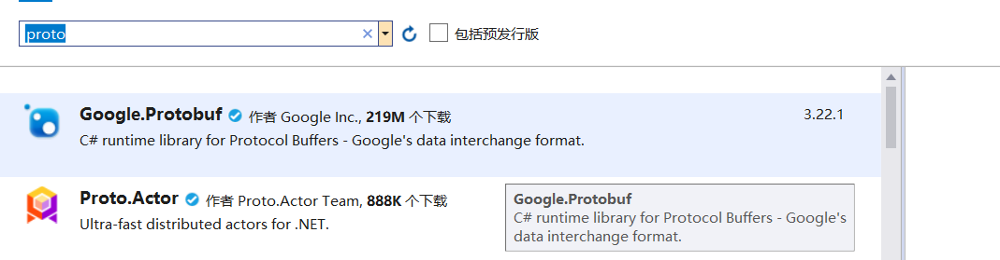

**安装完成后就可以看见**

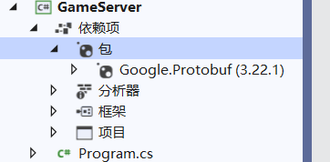


编辑你的protos文件，然后生成cs文件，在output中可以找到。

然后将这个cs文件放入项目当中使用。


**proto文件参考**

```
syntax = "proto3";//指定版本信息，不指定会报错

message Person //message为关键字，作用为定义一种消息类型
{
    int32 id = 2;       //id
    string name = 1;    //姓名
    string email = 3;   //邮件
}

message AddressBook
{
    repeated Person people = 1;
}
```


**protoc命令参考**

用于生成proto对应的cs类

```
::查看版本
protoc --version
::生成代码
protoc --csharp_out=. demo.proto
protoc --java_out=. demo.proto
protoc --go_out=. test.proto
protoc --cpp_out=. test.proto
protoc --python_out=. test.proto
protoc --php_out=. test.proto
```


**还可以把protoc配置到环境变量，达到全局可调用的效果**

1.把protoc复制到纯英文目录，例如 D:\programs\protoc-21.12-win64

2.创建环境变量 PROTOC_HOME=D:\programs\protoc-21.12-win64

3.在系统任何位置都可以调用 

%PROTOC_HOME%/bin/protoc --csharp_out=. message.proto


### **ProtobufTool**

#### 序列化与反序列化工具类

```
using System.Collections;
using System.Collections.Generic;
using Google.Protobuf;
using System.IO;
using System;

namespace Summer
{
    /// <summary>
    /// Protobuf序列化与反序列化
    /// </summary>
    public class ProtobufTool
    {
        /// <summary>
        /// 序列化protobuf
        /// </summary>
        /// <param name="msg"></param>
        /// <returns></returns>
        public static byte[] Serialize(IMessage msg)
        {
            using (MemoryStream rawOutput = new MemoryStream())
            {
                msg.WriteTo(rawOutput);
                byte[] result = rawOutput.ToArray();
                return result;
            }
        }
        /// <summary>
        /// 解析
        /// </summary>
        /// <typeparam name="T"></typeparam>
        /// <param name="dataBytes"></param>
        /// <returns></returns>
        public static T Parse<T>(byte[] dataBytes) where T : IMessage, new()
        {
            T msg = new T();
            msg = (T)msg.Descriptor.Parser.ParseFrom(dataBytes);
            return msg;
        }
    }
}
```


1.**使用 Protobuf 消息类型的 WriteTo() 方法将消息对象序列化到 MemoryStream 中，然后通过 MemoryStream 的 ToArray() 方法获取序列化后的字节数组。这种方法可以避免创建中间缓冲区，适用于对内存占用有要求的场景。**

```
using Google.Protobuf;
using System.IO;

MyMessage message = new MyMessage();
// 填充 message 对象的字段

// 创建一个 MemoryStream 对象
MemoryStream stream = new MemoryStream();

// 将 MyMessage 对象序列化到 MemoryStream 中
message.WriteTo(stream);

// 获取 MemoryStream 中的字节数组
byte[] bytes = stream.ToArray();

```

**2.使用 Protobuf 消息类型的 ToByteArray() 方法将消息对象序列化为字节数组。这种方法会创建一个中间缓冲区来存储序列化后的字节数组，适用于对性能要求更高的场景。例如，下面是一个将 Protobuf 消息对象序列化为字节数组的示例：**

```
using Google.Protobuf;

MyMessage message = new MyMessage();
// 填充 message 对象的字段

// 将 MyMessage 对象序列化为字节数组
byte[] bytes = message.ToByteArray();

```


#### **获取全部IMessage类型**

```
var q = from t in Assembly.GetExecutingAssembly().GetTypes() select t;
q.ToList().ForEach(t =>
{
    if (typeof(Google.Protobuf.IMessage).IsAssignableFrom(t))
    {
        protoTypeList.Add(t);
    }
});
```

具体来说，它首先执行之前提到的LINQ查询语句，获取程序集中所有的类型，并将它们存储在`q`变量中。然后，它使用`ToList()`方法将查询结果转换为`List<Type>`，并对列表中的每个类型执行一个操作。该操作使用`typeof(Google.Protobuf.IMessage).IsAssignableFrom(t)`判断当前类型是否实现了`Google.Protobuf.IMessage`接口，如果是，则将该类型添加到`protoTypeList`列表中。

这段代码通常用于在运行时动态查找并加载实现了`Google.Protobuf.IMessage`接口的类型，以便进行序列化和反序列化等操作。


### tostring

imessage类型的tostring会将类的信息转化为json格式


## 消息队列

### 概要

服务器不能一次性去处理全部同时发过来的数据，我们需要将这些消息保存起来，并且不影响客户端和服务端的网络通信。

收到之后保存起来，然后一条一条处理。注意：需要考虑多线程并发的问题

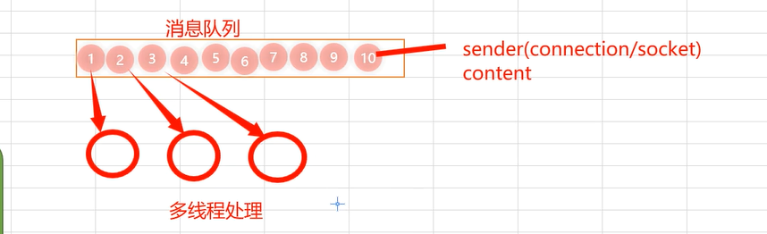

### MessageRouter

设置一个队列,消息来的时候入队,使用多线程分发(线程池)

订阅（将某个消息发给某个模块），

退订

触发订阅（找到一个消息并且转发了出去）

消息频道,用户模块，角色模块，物品模块，地图模块，战斗模块

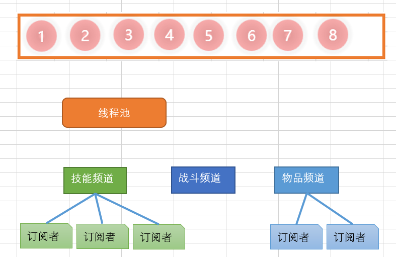


### 注意

#### Interlocked

Interlocked.Increment

Interlocked.Decrement

在C#中，`Interlocked` 类提供了一组原子操作方法，这些方法可以以线程安全的方式对内存中的变量进行操作。在多线程编程中，当多个线程同时访问同一个变量时，可能会出现一些问题，例如竞争条件（race condition）、死锁（deadlock）等等。`Interlocked` 类提供了一些方法来解决这些问题，使得多个线程可以安全地对同一个变量进行读写操作。

`Interlocked` 类的方法包括：

- `Increment`：原子地将指定的变量加 1，并返回新的值。
- `Decrement`：原子地将指定的变量减 1，并返回新的值。
- `Exchange`：原子地交换指定变量的值，并返回原始值。
- `CompareExchange`：比较指定变量的值与给定值，如果相等则替换，并返回原始值。

这些方法使用了底层硬件级别的同步机制来确保操作的原子性和线程安全性。使用`Interlocked` 类可以避免一些常见的多线程编程错误，使得多个线程之间可以安全地共享数据。


#### AutoResetEvent

在C#中，`AutoResetEvent` 是一个同步原语，用于协调线程之间的执行顺序。`AutoResetEvent` 可以使一个或多个线程等待另一个线程发出信号后再继续执行，从而实现线程之间的同步。

#### MemoryStream

**使用流的速度通常比直接操作文件或网络资源要快，因为流可以在内存中缓冲数据，从而避免了频繁的磁盘或网络操作。**


可以使用 MemoryStream 将 Protobuf 对象序列化为字节数组。在 C# 中，可以通过 Google.Protobuf 框架提供的 extension 方法 ToByteArray() 来实现。

例如，假设我们有一个名为 MyMessage 的 Protobuf 消息类型，并已经创建了一个 MyMessage 对象 message。可以使用以下代码将 MyMessage 对象序列化为字节数组：

```
using Google.Protobuf;
using System.IO;

MyMessage message = new MyMessage();
// 填充 message 对象的字段

// 创建一个 MemoryStream 对象
MemoryStream stream = new MemoryStream();

// 将 MyMessage 对象序列化到 MemoryStream 中
message.WriteTo(stream);

// 获取 MemoryStream 中的字节数组
byte[] bytes = stream.ToArray();

```

在上面的代码中，首先创建了一个 MemoryStream 对象 stream。然后，将 MyMessage 对象 message 序列化到 MemoryStream 中，最后通过 stream.ToArray() 方法获取 MemoryStream 中的字节数组。

需要注意的是，上述代码中的 MyMessage 类型需要事先通过 Protobuf 的代码生成工具生成。生成的代码中包含了 MyMessage 类型的序列化和反序列化方法，以及一些辅助方法。在使用之前需要引用 Protobuf 的命名空间，并在代码中实例化 MyMessage 对象并设置其字段。


#### using

在大多数情况下，建议使用 using 语句块来管理 MemoryStream 对象，这样可以确保在使用完毕后自动释放资源，避免出现内存泄漏的问题。例如：

```
byte[] data;
using (MemoryStream stream = new MemoryStream())
{
    // 写入数据到 stream 中
    data = stream.ToArray();
}
// 在 using 语句块结束后，stream 对象会被自动释放

```

如果你不想使用 using 语句块，也可以显式地调用 Close() 或 Dispose() 方法来释放 MemoryStream 对象。这两个方法的作用是相同的，都可以用于释放资源。不过需要注意的是，调用 Close() 或 Dispose() 方法后，就不能再对 MemoryStream 对象进行操作了。如果你需要再次使用该对象，需要重新创建一个新的 MemoryStream 对象。

总的来说，使用 using 语句块来管理 MemoryStream 对象是最安全和方便的方法，它能够确保在使用完毕后自动释放资源，而不需要显式地调用 Close() 或 Dispose() 方法。


需要注意的是，由于 C# 的垃圾回收机制，一般情况下不需要显式地调用 Close() 或 Dispose() 方法来释放 MemoryStream 对象，系统会自动回收这些对象并释放它们所占用的资源。但是在一些特殊情况下，比如在处理大量数据时，显式地调用 Close() 或 Dispose() 方法可以帮助及时释放资源，避免出现内存泄漏的问题。


## 心跳包

1.让通信双方都知道对方还活着。

客户端每隔xx时间给服务端发送消息，服务端收到之后记录最后心跳包的时间，然后给客户端响应。

2.还有一个好处：根据心跳包的往返，我们可以记录到客户端和服务器之间的网络延迟。

```
message HeartBeatRequest{
	//心跳请求
}

message HeartBeatResponse{
	//心跳响应
}
```


## session

通过连接connection来获取的就是一个session

然后把相关联的属性我们都放到session里面


## 服务器选择


1.服务器选择的配置文件，我们使用json格式

```
{
    "ServerList":[
        {
            "name":"本地服务器",
            "host":"127.0.0.1",
            "port":6666,
            "state":0
        },
        {
            "name":"云服务器",
            "host":"49.7.227.178",
            "port":32510,
            "state":0
        }
    ]
```

2.将其上传到我们的资源服务器上面

 

3.通过web请求拉取json文件，然后进行解析即可。


# 同步核心

## 角色设计

1.一个玩家可以选择不同的角色，所以创建一个角色类

2.管理一个场景，将里面的资源发放给全部玩家，所以需要一个场景类来管理

3.基础的角色类

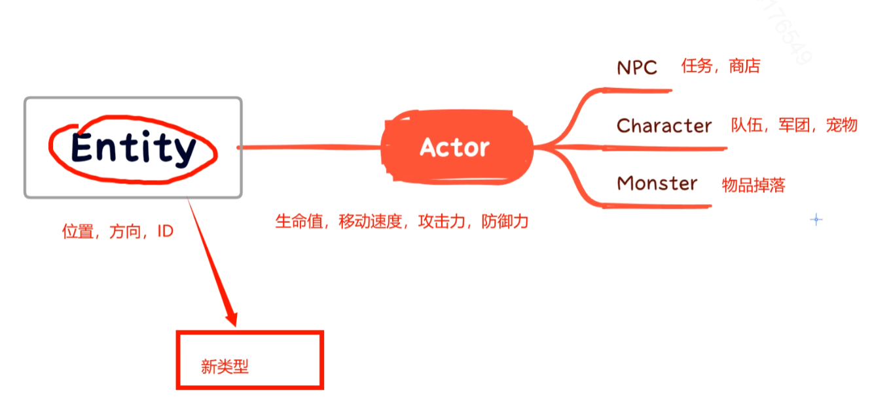


属性

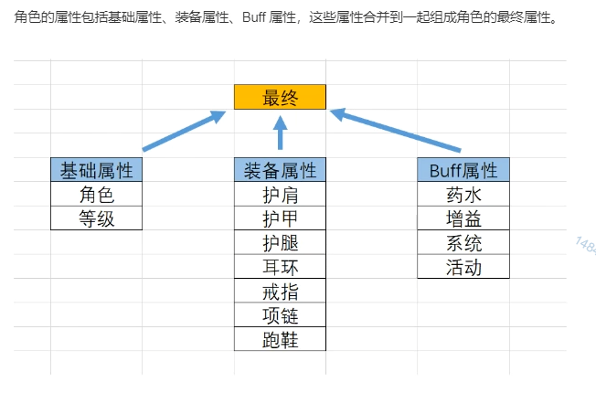

 

战斗属性：

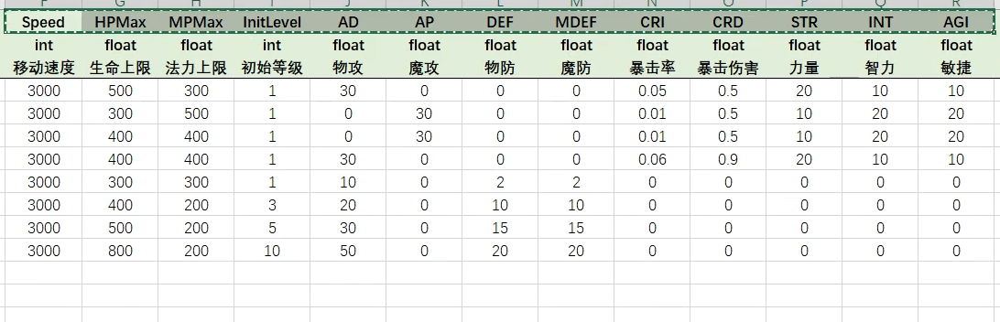


## 同步逻辑


### 位置同步

使用的是状态->状态这种模式，server只转发


a.客户端需要开启一个协程定时的给服务器发送entity的同步信息

b.服务端收到这些entity同步信息就将其保存到服务器的容器当中，然后給全部服务端广播这些同步信息。

c.客户端收到这些同步信息，通过之前保存的字典中的gameobject进行对这些对象的更新

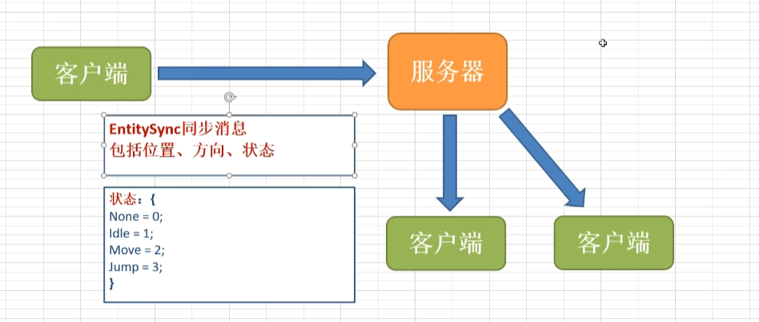

注意：

e.本机控制的角色---->位置更新是由我们自己来控制的，通过协程不断往服务器发送本机角色的位置信息。

本机其他玩家的角色，由服务器下发位置信息进行更新

f.注意的是需要控制同步的频率，频率过高会占用过高的带宽，这样会导致同步的人数会降低。

过低也会导致延迟卡顿，所以要找到这个平衡的点。

这里我们使用每一秒同步10次。


#### **使用插值算法让移动更平滑**

在多人网络游戏中，同步玩家位置是一个比较重要的问题。如果同步频率过低，可能会导致玩家位置的不同步和卡顿；如果同步频率过高，可能会导致网络负载过大。因此，需要在合适的同步频率下，使用合适的同步算法来实现玩家位置的同步。


#### 动画上的同步问题

在网络游戏开发中，**一般推荐使用 In-Place 动画**而不是根动画（Root Motion），尤其是在涉及到网络同步的情况下。以下是两者的优缺点分析：

##### **In-Place 动画**

**优点：**
1. **更好的同步控制**：所有角色的移动和旋转都是由代码控制的，这样可以确保不同客户端上角色的移动一致性。
2. **节省带宽**：不用频繁地同步根运动的速度和方向变化，可以只同步角色的输入和目标位置/方向，减少网络传输数据量。
3. **更简单的预测与修正**：可以根据玩家输入和服务器逻辑来预测角色位置，一旦有偏差可以更容易修正。

**缺点：**
1. 需要更复杂的运动逻辑代码来处理角色的位移和物理模拟。
2. 动画效果可能需要更多调整，因为需要手动匹配动画与移动速度。

##### **根动画（Root Motion）**
**优点：**

1. **动画驱动的运动**：可以更自然地表现复杂的动作，比如跑步、跳跃等，因为动画控制着角色的位移。
2. 可以减少动画与物理逻辑不同步的情况，因为位移是动画直接产生的。

**缺点：**
1. **同步复杂度高**：根运动需要频繁地同步角色的位置和方向，这对带宽的消耗较高，而且客户端之间的动画帧可能会有差异。
2. **预测和修正难度大**：如果使用根动画，当网络延迟较高或丢包时，预测角色位置变得更加复杂。

##### **总结**
通常，**In-Place 动画更适合网络游戏**，因为它能够减少同步的复杂性和带宽消耗，并且更容易处理网络延迟和丢包等问题。而根动画则更适合单机游戏或者局域网游戏，这样可以更好地利用动画来驱动角色的行为。

在需要表现复杂动作的场合，可以考虑结合两者。例如：角色的主要移动使用 In-Place 动画，而特殊动作（如某些技能动画）可以使用根动画。


### 死亡的同步

1.server中计算到actor死亡

2.将本actor的状态设置为死亡，并且同步给aoi区域内的全部chr（）

3.client接受到信息后，就会调用状态机转换死亡状态。


### skill同步

使用了指令->状态这种模式

- client首先向server发送释放技能的请求
- 如果可以释放，server就向aoi范围内的全部acotr(如果actor是chr的话也要包括它自己)广播施法信息
- server中维持着skill的生命周期
- 当client接受到施法请求的时候就会将actor切换到skill状态进行一些动画、粒子、声音的展示。


## Space

### 游戏场景切换设计

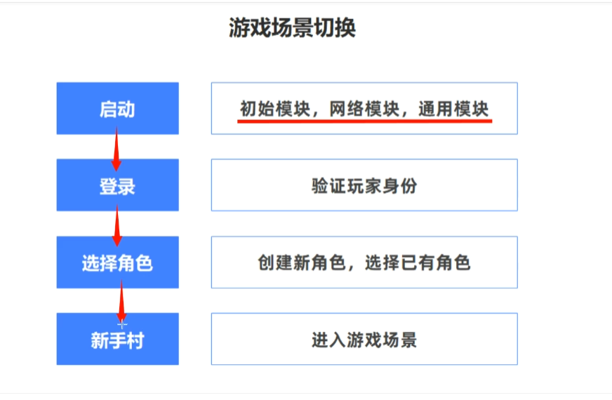

注意初始的模块、网络模块、通用模块都是唯一的不会被销毁，所以要设置位don‘t destory


### 刷怪管理

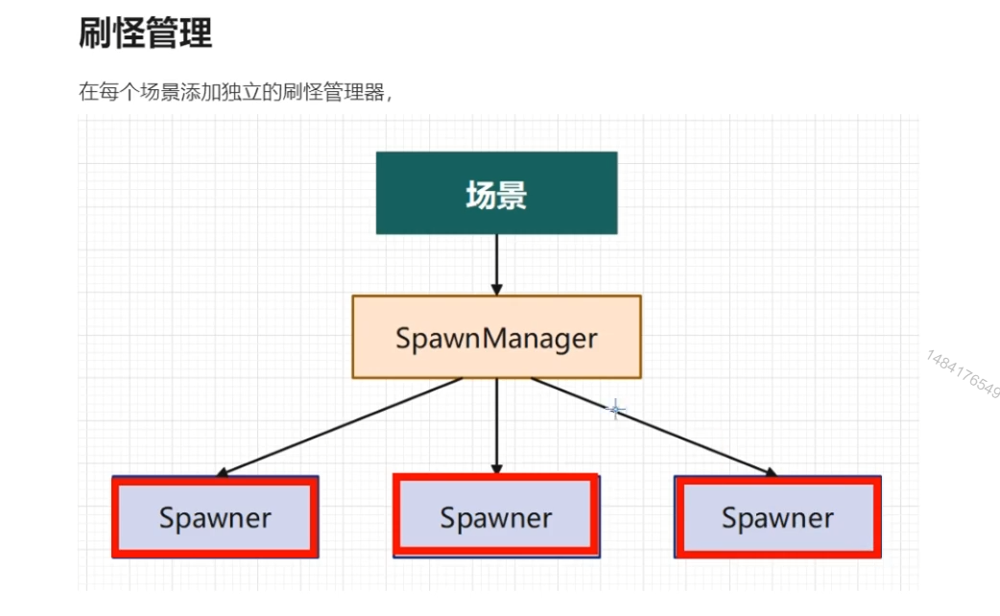

将每一个怪物的信息存放到json文件中，由datamanager进行读取，转换为dict；

每个space中有个spawnmanager，spawnmanager通过datamanager读取相对应的space中的刷怪信息，然后生成对应的spawner

spawner是刷怪对象，负责怪物的刷新。


## 中心计时器

模拟unity的调度系统,将我们的游戏时间活起来

**此外这个计时器存在的目的就是为了定时执行一些任务**

比如说：我们需要定时存放角色的位置信息，下次角色上线能找到位置，我们可以定时2秒保存一次


# 持久化

## 概要

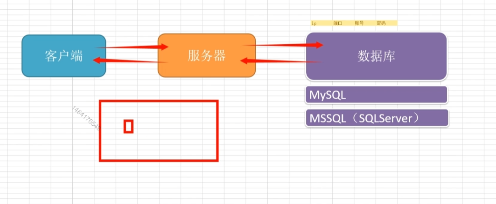


**安全性**

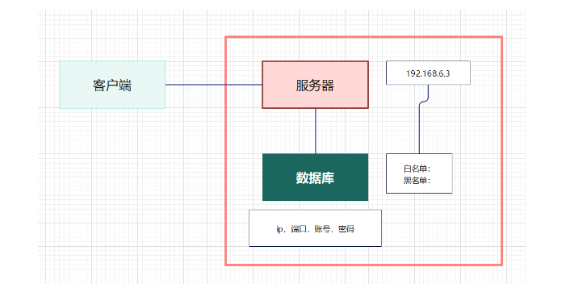

为了保证数据安全性，数据库通常不允许通过互联网访问，只能通过服务器内网访问，并且设置黑名单和白名单。严禁客户端直接访问数据库服务器。


## ORM框架FreeSql


什么是框架?

可复用的程序集，软件包，程序集，工具，组件，引擎


官网地址：

前置技能：至少会一种关系型数据库SQLServer，MySQL，SQLite，会基本的SQL也算会。

ORM框架，可以用面向对象的代码去直接操作数据库。

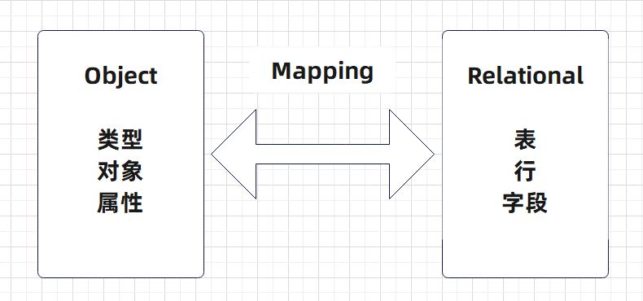


### **快速上手**

[入门 | FreeSql 官方文档](https://freesql.net/guide/getting-started.html)


#### 安装驱动

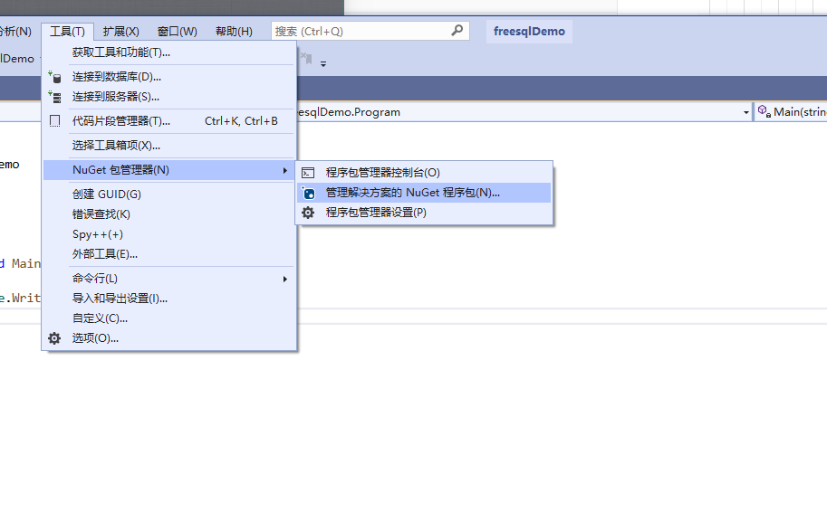

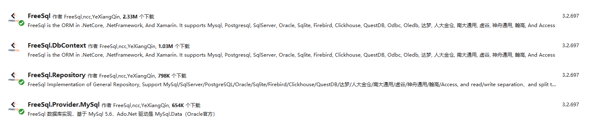


安装freesql和 freesql.provider.mysql的  还有repository


#### 案例

Program.cs

```c#
var connectionString = "Data Source=127.0.0.1;Port=3306;User ID=root;Password=root;" +
    "Initial Catalog=game;Charset=utf8;SslMode=none;Max pool size=10";

IFreeSql fsql = new FreeSql.FreeSqlBuilder()
    .UseConnectionString(FreeSql.DataType.MySql, connectionString)
    .UseAutoSyncStructure(true) //自动同步实体结构到数据库
    .Build(); //请务必定义成 Singleton 单例模式

Topic topic = new Topic() { Title="震惊，1分钟竟然等于60秒",Clicks=100};
fsql.Insert(topic).ExecuteIdentity();


```

Entity.cs

```
using FreeSql.DataAnnotations;
/// <summary>
/// 模型类
/// </summary>
class Topic
{
    [Column(IsIdentity = true, IsPrimary = true)]
    public int Id { get; set; }
    public int Clicks { get; set; }
    public string Title { get; set; }
    public DateTime CreateTime { get; set; }
}
```


## 数据定时存放进数据库

如果你存放都在服务器内存中的话，到最后才保存到数据库中，万一服务器宕机了，数据也就没有了。


# 游戏业务系统


## 概要


### 1.游戏系统开发中遇到的问题？

1.不知道如何下手，先做什么？再做什么？

2.功能好像实现了，但是不知道好不好？

3.提交后，bug频发，修不完？

4.过了几个月，自己的代码不认识了。


### 2.设计的作用

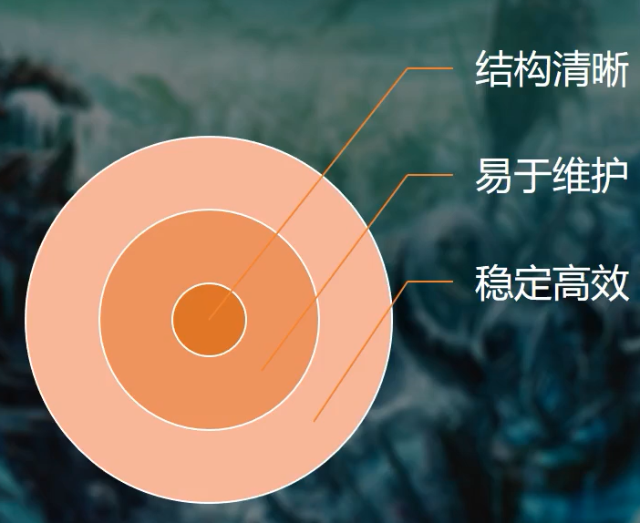 


### 3.设计到底是在讲什么？

解决问题


## 频道聊天系统

涉及到社交，对于游戏是很重要的。

**需求分析---->设计**


### 1.需求分析

最重要的一环

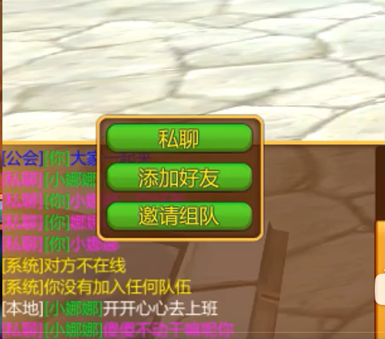 

上图：首先是一个聊天框用来显示消息，然后有一排按钮，用来切换频道的。这样起码我们知道ui可以怎么拼了

有个特殊的需求：就是彩色的文本框，而且中间还能点击。

​                    

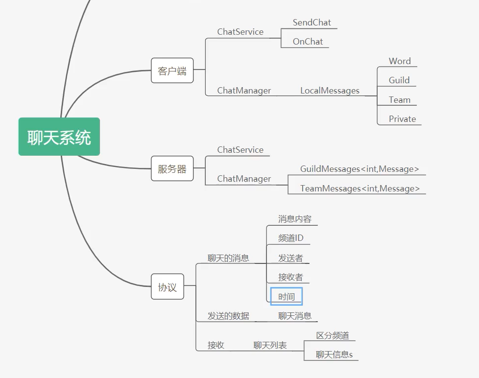 

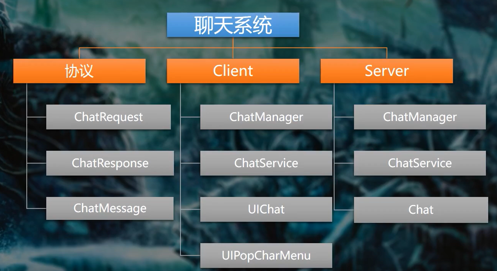 


### 2.proto协议


chat_channel

```
enum CHAT_CHANNEL{
	ALL = 0;				
	LOCAL = 1;
	WORLD = 2;
	SYSTEM = 4;
	PRIVATE = 8;
	TEAM = 16;
	GUILD = 32;
}
这些数值这样设计的目的，是因为有的游戏可以自由定制筛选频道，这个频道只显示队伍和私聊......
这种按bit位的方式来进行存储是最方便的，可以用一个整型来存储任意多个频道的自由组合
给将来来提供拓展性
```


ChatMessage

```
message ChatMessage{
	CHAT_CHANNEL channel = 1;
	int32 id = 2;
	int32 from_id = 3;
	string from_name = 4;			//假设两个玩家在不同的地图私聊，因为客户端只记录本地图的玩家信息，所以找不到name。
									//也可以拿着这个id去问服务端，但是这样会加大服务端的压力
	int32 to_id = 5;
	sting to_name = 6;
	string message = 7;
	double time = 8;				//时间，来拿做判断啊。比如说排序，聊天时能拿最近5分钟的消息....
}
```


ChatRequest

```
message ChatRequest{
	ChatMessage message = 1;
}
```


ChatResponse

```
message ChatResponse{
	Result result = 1;			//响应码，错误码
	string errormsg = 2;
	repeated ChatMessage localMessages = 3;
	repeated ChatMessage worldMessages = 4;
	repeated ChatMessage systemMessages = 5;
	repeated ChatMessage privateMessages = 6;
	repeated ChatMessage teamMessages = 7;
	repeated ChatMessage guildMessages = 8;
}
```


大部分游戏的proto都是这样设计的，这是为什么？

```
NetMessage{
	NetMessageRequest{
		...
		ChatRequest = 30;
		...
	}
	NetMessageResponse{
		...
		ChatResponse = 30;
		...
	}
}
```

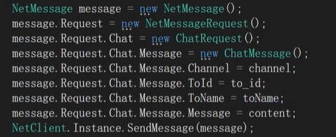 


### 3.Client

ChatService  主要负责消息的发送与接收（在我们mmorpg项目中其实是与messagRouter来通信


### 4.server


### 5.UI

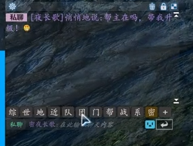 


 


## 背包系统

当我们谈论游戏开发中的角色扮演游戏（RPG）或冒险游戏时，背包系统往往是不可或缺的一部分。无论是在探索未知世界、击败怪兽，还是在积累各种宝贵资源，背包系统都扮演着重要的角色。它是游戏中管理物品、装备和资源的关键工具，为玩家提供了储存、组织和使用游戏中各种物品的便捷方式。

市面上绝大多数技术教程，讲背包系统，只讲最简单：拾取+收纳功能，我认为是有失偏颇的。

在我看来，设计一个背包系统，其背后的：**MVC架构模式、数据存储、表格配置、UI交互处理才是更为重要的部分**。因此，这次我挑选了大家最为熟悉的 原神 背包系统进行分析。


### 1.案例：原神背包系统需求分析

需求分析，简而言之就是把你想做的事情罗列清楚。一般情况下，这部分内容是策划同学负责的。但是作为独立游戏开发者，几乎得什么都会。核心目标，就是把自己想做的玩法写清楚，这里我用xmind进行梳理。

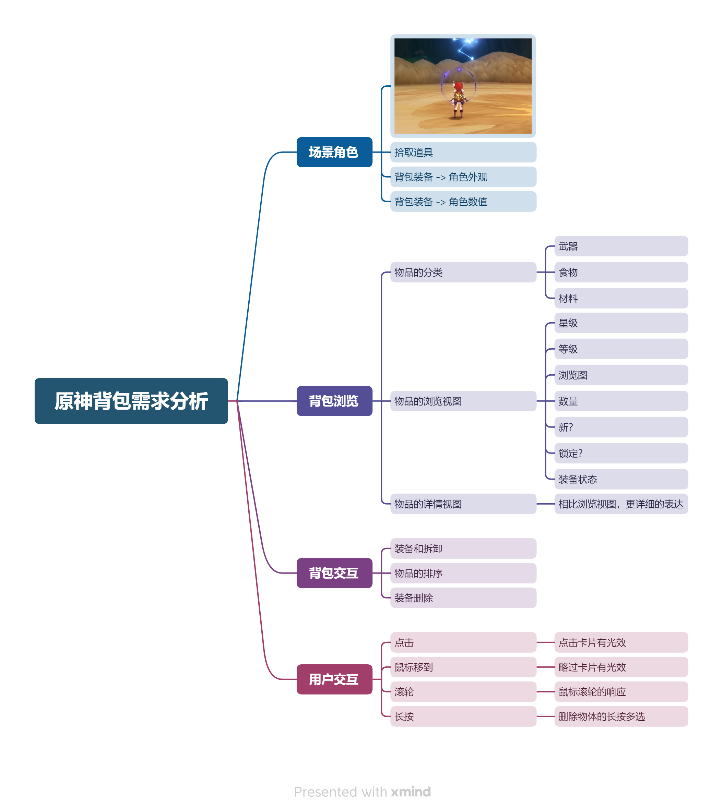

#### 场景角色

场景中的角色可以通过拾取场景中的物体来增加背包的东西 

（按键F拾取鸟蛋）

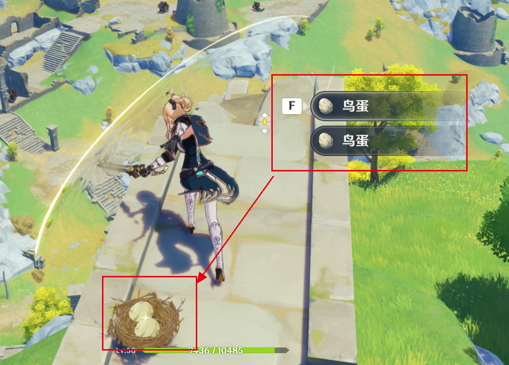 

而背包中的物体装备后又会在场景角色中展示

 

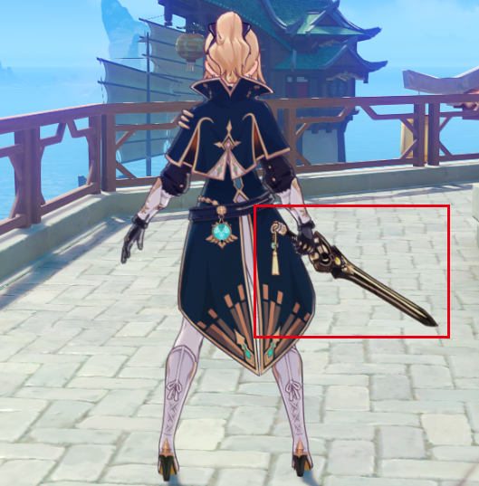 


#### 背包浏览

(整体浏览)

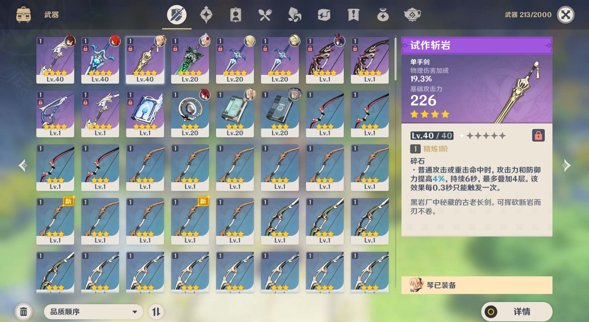 


背包页签：分为多个页签（装备、食物、材料），点击不同页签，展示不同物品。

 


简略视图（全局）

在全局视图下，可以看到所有物品的简略图，放在一个滚动容器中，可以通过滚轮进行上下滑动。


具体的每一个简略图下，又包含有多重状态，比如：

1. 星级
2. 等级
3. 数量
4. 锁定
5. 新（是否是新获得）
6. 装备状态（谁装备了）


在ui右侧，还有每个物体的详细介绍，这里基本是对简略视图的一个拓展

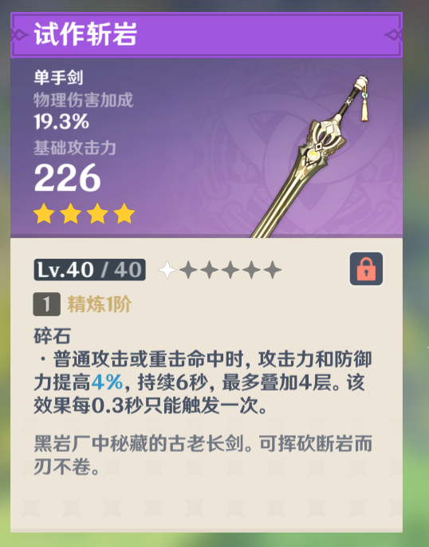  


#### 背包交互

在背包系统中，可以对物体进行的一些操作，这些操作是用户输入后才会发生的变化。


主要集中在ui下方，包括

1. 删除物体
2. 对物体进行排序
3. 物体的装备、强化、精炼


#### 用户交互

那么在原神的背包系统中，用到了哪些交互方式呢？

 点击（点击卡片有加强的光效） 

 


鼠标移到（略过卡片有光效） 

 


滚轮（拖拽滑条和鼠标滚轮的响应） 

 


长按（删除物体的长按多选） 


### 2.技术分析

需求是站在产品的角度思考问题，技术分析则是站在程序的角度分析解决方案。

下面我还是使用xmind来梳理整个设计逻辑：

（事实上，真正熟练之后不一定每次都要画图，比如我一看到这个需求，脑海里就已经有一个大体的框架了，可能就直接去写代码了。前期还是多画图~）

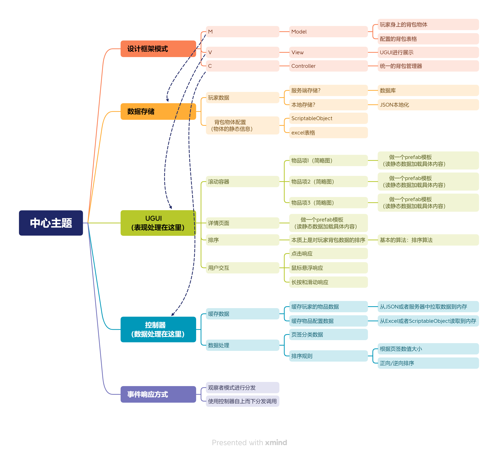


### 3.设计框架模式

这里我采用了MVC的程序设计框架，将数据、表现、逻辑进行分离，即降低耦合性，又可提高逻辑的复用性。


#### Model

其中Model指的是数据，我们的背包系统包含两部分数据，一是静态数据（即固定不变的数据，比如武器的描述文本），另一部分是动态数据（即玩家拥有几把武器、几个食品，分别是什么武器、什么食品，这里应该要会随着玩家拾取道具进行变化）。

静态数据，可以采用ScriptableObject，或者采用excel配置后导出的方式，二者的区别是excel可视化更强，但是需要多一步导出操作。

动态数据，如果存储在远端服务器，需要先请求协议拉取数据。如果存储在本地，比如以JSON文本存储，则可以使用我之前写过的JSON存储框架。


#### View

View指的是视图，在Unity中我们可以使用UGUI来进行展示。为了实现原神的背包系统，可以预见的，我们要使用到的一些UGUI功能是：滚动容器、UI预制件、UI交互（点击、悬浮、长按）。


#### Controller

Controller指的是逻辑脚本，这里就像所有数据和逻辑的中枢，一般我喜欢将其做成单例类方便使用。所有关于数据的逻辑处理最好都放在这里，这样方便表现层复用这些逻辑。当然，为了方便使用，我们的动态数据、静态数据加载完毕后，都会在这里有一份缓存，方便下次使用，而不是每次都需要重新加载，消耗IO性能。


### 4.事件分发和处理

事件的分发和处理，当玩家的一个命令发出时：比如销毁某件武器，那么有多个地方会收到这个命令的影响，比方说：

- 场景中的角色，如果装备了该武器，那么就会处于无装备的情况

- 滚动容器中的简略视图，应该要销毁掉这一件武器，而不应让他继续出现在玩家视野

- 如果这件武器正好是选中的武器，那么详情视图也应该关闭掉，或者展示其他武器。

- 等等

也就是说，会有多个关心这个事件的地方。如果到每个地方都写一堆if else显然是耦合的、冗余的、不够优美的。

因此我们可以用到事件系统（观察者模式）来帮助我们解决这个难题。


### 5.UI制作

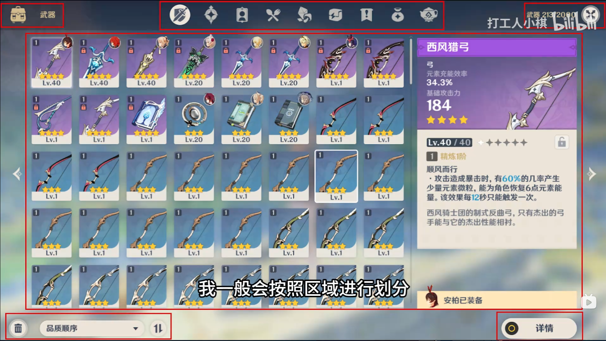

划分6个区域


### 6.存储框架设计


**静态数据**

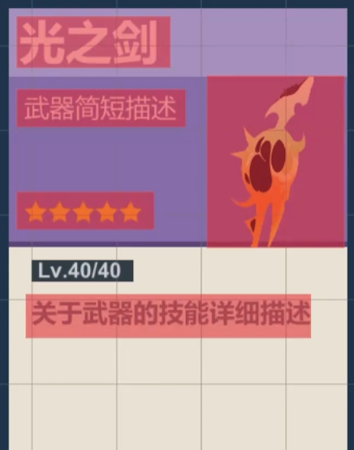 

1.使用Excel表格进行配置

- 可视化好

2.使用unity内置的scripttableObjcet配置


**动态数据**

 

数量、玩家是否拥有这个武器这都是动态的

- 存储在服务器上，登录的时候从服务器拉取数据
- 使用json保存在json


### 其他的背包UI设计思路

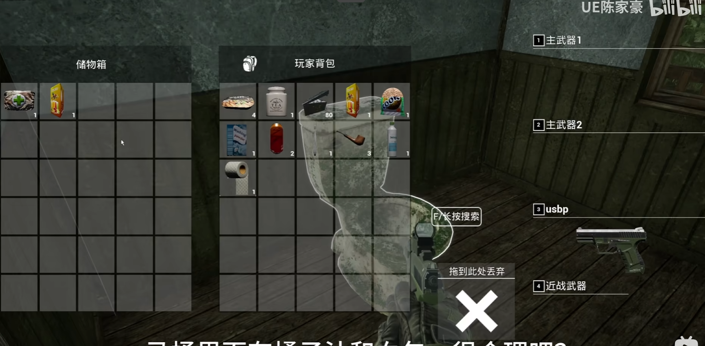


## 等级经验系统


### 1.data处理

其实和我们的hp mp差不多啊，我们可以同时属性更新来实现这个功能

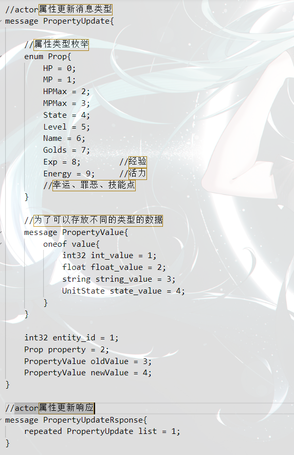 

客户端只需要处理我们这个服务端发出来的属性更新响应即可


升级所需要的经验，我们用一个excel表来存储即可

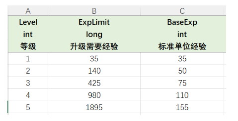 


在服务器这边，我们用等级经验表来存储这些动态的信息

- characterId 
- level
- exp


### 2.ui设计


#### 获得经验时的ui和特效

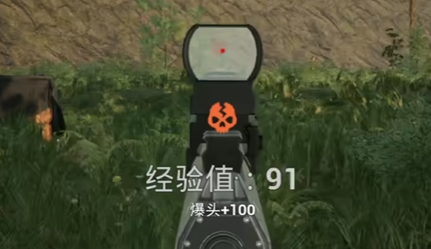 


#### 升级时的ui和特效


#### 经验条


## User系统


### 断线重连

当tcp连接断开之后，可以为玩家角色保留60秒，如果这段时间客户端重新连接，则可以继续游戏。

客户端：当前连接不可用，每隔5秒发起新的Socket请求

服务器：展示缓存离线消息(谁谁谁给你发消息，哪个野怪砍了你一下)，重连之后发给客户端

如何证明是你：在登陆的时候给客户端分配session对象，把唯一的sessionid发给客户端作为身份标识

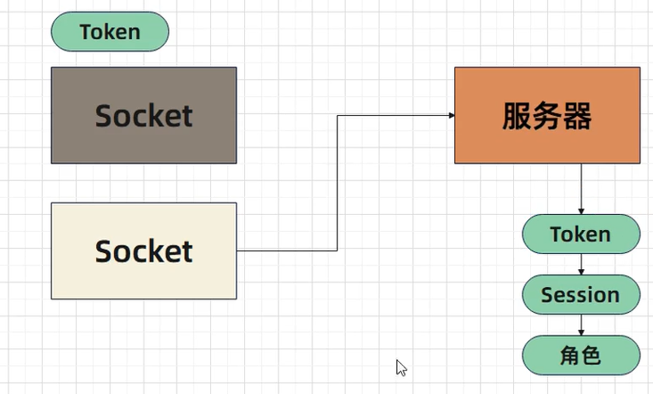 


**sessionid的生成**

```
var sessionid = Guid.NewGuid().ToString();
```


**客户端的重连响应**

1.玩家未登录

没有建立session，重新连接就重新跳回登录界面就行了。

2.玩家已登录，但是没有选择角色

此时已经建立session了，跳转到选择角色的列表当中

3.玩家已经登录，已经选择游戏在游戏中

回到场景中就可以了。

```
message  ReconnectResponse{
	bool success = 1;
	int32 entityId = 2;//重连的角色，0代表为选择角色
}
```


## AOI系统

AOI（Area of Interest，兴趣区域），服务器根据玩家当前位置动态更新周围玩家和NPC的信息，以减少不必要的数据传输和计算，提高游戏性能和效率。

**AOI的理念：视野之外的角色不传输**

AOI系统的基本原理是将游戏世界划分为多个区域，玩家或NPC只能看到和与其所在区域内的实体进行交互。当玩家移动到新区域时，服务器会通知周围区域内的玩家和NPC，并更新它们的可见范围，同时隐藏超出视野范围的实体。

**AOI系统的优点包括：**

减少网络通信量、减少不必要的计算


### 九宫格算法


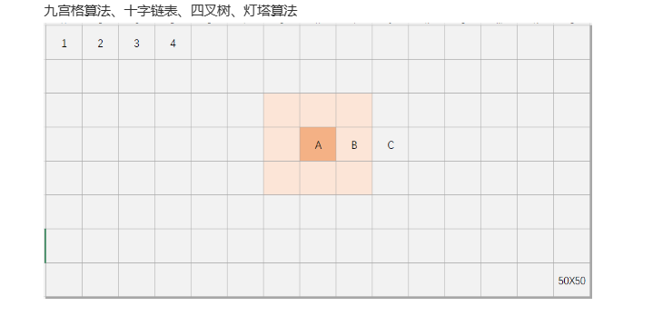    

ABC问题：

A和C相互看不见，如果C使用技能打B，A是看不见C是怎么打B的，A只能看见B掉血了，其实这样已经足够了，因为每一个格子很大，离得很远看不看得见已经无所谓了，因为只是一个小黑点。

我们保证核心数据同步就行了(血、蓝)

特效不同步也没关系了，因为不重要。


**由于我们的伤害数据包是按照帧来发送的，所以我们需要解决重复发送的问题。**

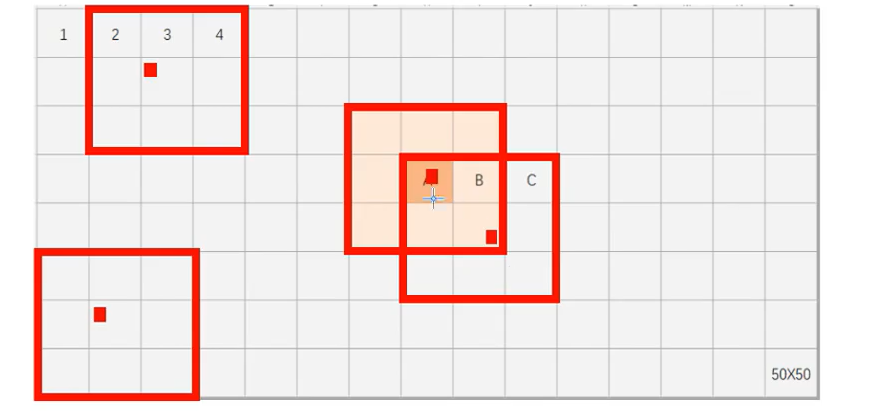 


### 十字链表法

九宫格算法只考虑了三维世界中x轴和z轴，并没有考虑y轴，现在我们就来解决这个问题

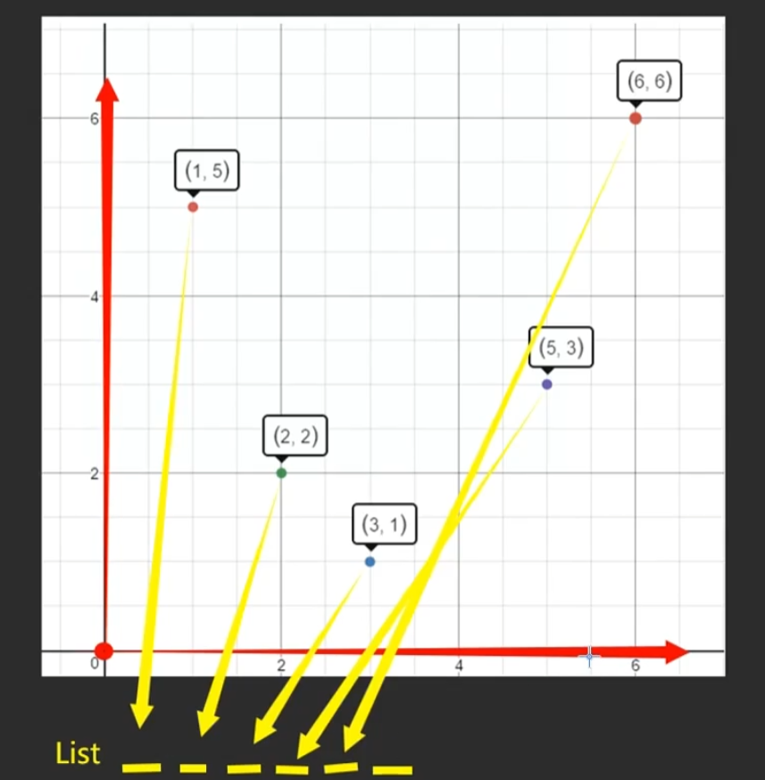 

list-x根据其x坐标里原点的远近来进行链接

同理，list-y

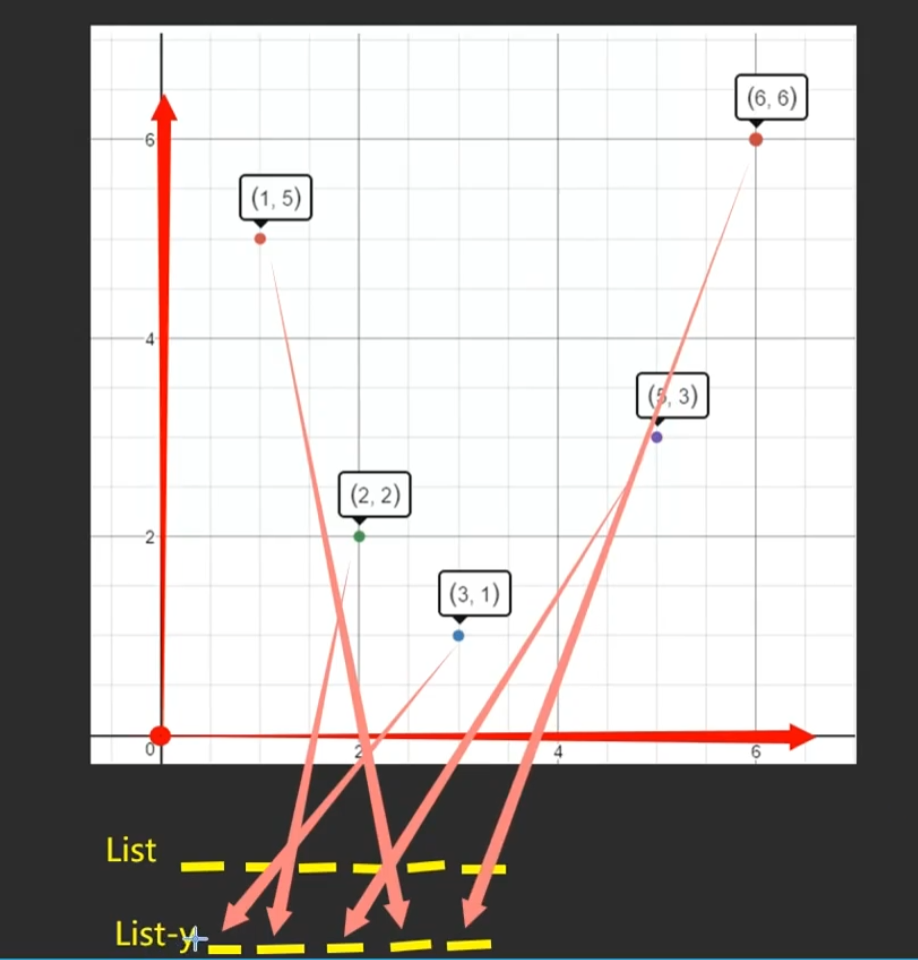 


当一个游戏对象位置发生变化时，两个list也会随之变化

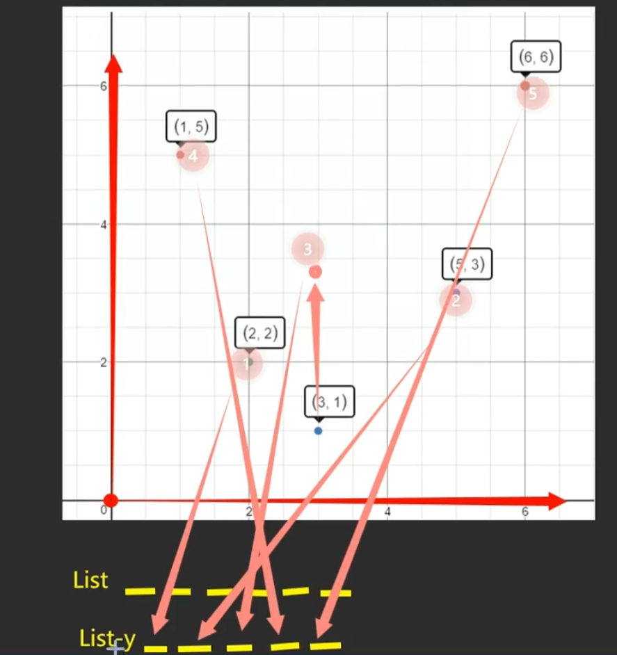 


如果我们想寻找某个范围内的游戏对象，我们就可以通过这两个链表来查找

 


## 组队系统


## 服务器寻路系统


## 安全模块

### 密码传输

比如说一些敏感信息，需要加密传输；

登录密码，保险箱密码等

持久化是密码这些敏感信息也需要加密存储。


### 限制角色的移动，防止作弊

判断依据是： 记录到客户端的位置和上次更新位置的时间，通过计算预测它再时间间隔内内能走多远，如果你超出这个范围，你大概率是作弊了 。


## 日志模块

**一个自制的输出到控制台。**

Common.Log


**一个用别人写好的日志框架输出到文件中**

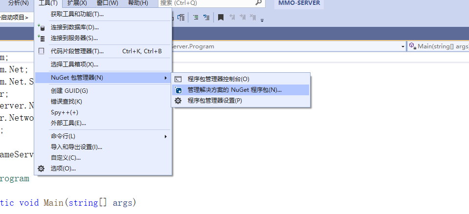


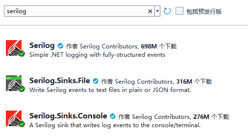

将这三个包安装加入依赖，后面的两个分别是对第一个的扩展


### 使用

```
//初始化日志环境，这里可以设置你的日志输出到哪里，怎么输出，是按天输出还是月输出
Log.Logger = new LoggerConfiguration()
.MinimumLevel.Debug()										//最小日志级别
.WriteTo.Console()											//结果输出到控制台
.WriteTo.File("logs\\log.txt", rollingInterval: RollingInterval.Day)//结果输出到文件，以天为单位
.CreateLogger();					

//输出日志
Log.Debug("服务器启动完成");
Log.Information("用户登录：{0} , {1}", name, pwd);
Log.Warning("警告信息");
Log.Error("错误信息");

```

**注意需要先初始化，不然没有显示**


### 生成的日志

**生成的日志文件在debug目录下**

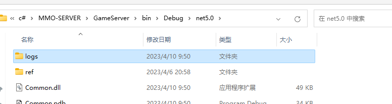


# HSFramework


## UI管理器


## 事件系统

其实这玩意也就是相当于观察者模式

事件系统可以提高代码的灵活性、可维护性和可扩展性，降低模块之间的耦合度。

需要在主线程Update里调用 Tick方法

```
//主线程调用
void Update()
{
    Kaiyun.Event.Tick();
}

//注册，触发
//方向：in，out（主线程）
```


## 资源加载系统


## 定时器系统

### 正文

本来这个框架的第五篇内容是对象池模块的，但是在处理对象池模块时发现自动回收类的资源需要在未来某个时间点触发回收事件，未来某个时间点触发事件是一个很通用的操作，因此这里插入一章来阐述这个延时任务调度模块。

在游戏开发过程中我们经常会碰到延时任务，比如敌人还有3秒到达战场，红蓝Buff还有25刷新，大龙还有1分钟刷新，任务还有3分钟更新等等。如果在每个处理延时任务的地方都自己编写一段计时的代码，那将是会非常痛苦的，不仅加大了业务的复杂度，并且**在规模较大时可能会导致出现性能问题**，此外，在一些**时间点挨得很近且强调调用先后顺序**的地方甚至会出现调用顺序不一致的情况。因此，我们需要有一个东西来将这些延时任务统一管理调配，确保执行顺序没有问题，并简化系统逻辑，提升程序性能。

### 设计思路

不难看出，前面说的这些种种，抽象来看都是在某个时间点到了后做某件事，因此我们可以将这里的计时逻辑与触发逻辑抽离出来，业务这边只负责注册任务与任务执行的时间，注册时调度器为这些任务**做好排序**，并在时间更新的时候轮询判断是否要执行任务。由于在调度器这边做了排序，因此可以确保任务执行顺序是没毛病的。

再深入思考一下，如果时间`T1`的任务没有执行，那任意大于`T1`的时间`T`对应任务也不应该被执行，且不用去判断。我们前面已经得到了一个有序的列表，那我们时间更新时**仅需判断有序列表的第一个位置上任务是否要执行**，如果当前时间比第一个位置任务执行时间小，那后续的时间都不需要判断了。如果第一个位置任务需要执行，则继续此判断，直到没有任务或者当前时间比第一个位置任务执行时间小。

由于我们加入了一个排序操作，这使得我们在添加新任务以及移除现有任务时开销变得比之前大，并且在执行任务时需要将后续任务移动到列表前面来，如果使用链表，移动操作消耗减少了，但随之而来的是节点前后指针的内存占用问题。**为了平衡新增任务、移除任务和执行任务的代价，可以加入优先队列**(其实就是最小堆或者最大堆)，这样三个操作的代价都降低了。同时，我们可以加入**区间划分**，将同一个时间区间内的任务放到一起，这样在排序时，可以对时间区间做排序，然后区间内自行排序，借此来降低排序对象的数量。在本文完成之际，从New Bing这边得知了一种更高效的**时间轮算法**，这种算法思路和区间划分有点类似，不过更为巧妙，不仅内存占用更少，并且三种操作执行代价也更小，感兴趣的童鞋可以自行查阅学习。

### 实现方案简述

下面就不多BB了，直接上本文的实现方案：

本文使用了优先队列+区间划分的思路来实现任务存储，优先队列是为了快速取到最接近当前时间的一个任务，在插入新任务时，调整的代价是O(logN)，每次判断时代价是O(1)，移除任务时找到移除的元素代价是O(N)，实际移除后调整的代价是O(LogN)，执行任务时调整的代价是Log(N)。本文区间划分单位是1，因此只是把同一个时间点的任务划分在了一起，借此来减少队列的元素规模。下图是一个简单的例子，当没有做区间划分时，队列中元素个数为8，做完区间划分后队列中元素个数为3。通过简单的区间划分，有效减少了队列的长度。（队列中的元素顺序可能不满足优先队列的标准，由于时间关系没有仔细构造数据了，希望没有对大家理解思路造成困扰）

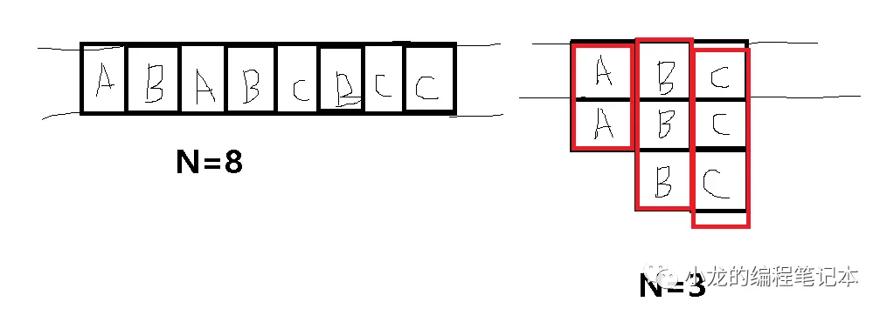

当然，在很多时候，我们的任务时间并不会这么密集，所以可以根据实际情况来修改区间划分长度与要划分的区间层数。如下图，可以增加了初始队列的区间划分长度，将[20-29]内的任务都放在了第一个元素中。在每个元素中，我们又对齐做了长度为1的区间划分，将AA放在一个元素，BBB放在一个元素。这样在每次插入和移除时，我们初始队列以及实际内部的队列调整代价规模都比较小。PS.多区间划分本文暂时没有处理，仅给出思路抛砖引玉。

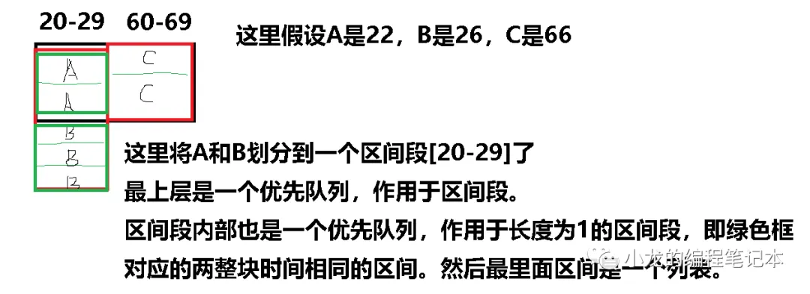

### Show Code

该模块核心部分是调度类`DelayedTaskModule`、延时任务列表类`DelayedTaskList`和延时任务数据类`DelayedTaskData`。`TimerUtil`类提供两个获取时间的接口，`Heap`类用来实现优先队列提高检测的效率，避开了消息轮询判断。

调度类`DelayedTaskModule`负责对外提供相关的操作接口，比如注册延时任务的方法，回收延时任务的方法。并在内部提供一个更新当前时间的方法，在更新时间时去判断是否需要触发对应任务。

延时任务列表类`DelayedTaskList`存储了某个确定时间点注册的延时任务数据。

延时任务数据类`DelayedTaskData`存储了一个时间，一个到点触发的任务和一个被提前移除的任务。

**具体设计**

堆的代码比较长，这里就不贴了，感兴趣可以去这里

`https://github.com/tang-xiaolong/MapGridInUnity/blob/main/Assets/LMapModule/LDataStruct/Heap.cs`看。堆内部根据外界传入的最小最大枚举值来确定比较方法，比较方法会调用堆内元素的`CompareTo`方法来比较，因此这也是`DelayedTaskList`需要实现`IComparable`的原因。

数据类比较简单，内部只有几个变量负责存储必要的数据。

```
DelayedTaskData.CS
public class DelayedTaskData
{
    public long Time;
    public Action Action;
    public Action EarlyRemoveCallback;
}
```

列表类也比较简单，里面存了一个列表，存储时间点注册的所有任务数据。类实现了`IComparable`是为了后续可以放入优先队列中对所有时间点对应的列表进行排序，避免每次更新时间都遍历所有列表。

```
DelayedTaskList.CS
public class DelayedTaskList : IComparable, IEnumerable<DelayedTaskData>, IDisposable
{
    private bool _disposed = false;
    public long Time;
    public List<DelayedTaskData> DelayedTaskDataList;

    public int CompareTo(object obj)
    {
        if (obj == null)
            return 1;
        return CompareTo((DelayedTaskList)obj);
    }

    public int CompareTo(DelayedTaskList obj)
    {
        return Time.CompareTo(obj.Time);
    }

    IEnumerator<DelayedTaskData> IEnumerable<DelayedTaskData>.GetEnumerator()
    {
        return DelayedTaskDataList.GetEnumerator();
    }

    public IEnumerator GetEnumerator()
    {
        return DelayedTaskDataList.GetEnumerator();
    }

    public void Dispose()
    {
        Dispose(true);
        GC.SuppressFinalize(this);
    }

    private void Dispose(bool disposing)
    {
        if (_disposed)
            return;
        if (disposing)
        {
            DelayedTaskDataList.Clear();
            DelayedTaskDataList = null;
        }
        _disposed = true;
    }

    ~DelayedTaskList()
    {
        Dispose(false);
    }
}
```

调度类内部有一个字典`_delayedTaskDict`，Key是注册过的时间点，Value是这个时间点对应的任务列表。`_delayedTaskQueue`是一个使用最小堆实现的优先队列，**队列中存储了每个任务点注册的任务列表**，即每个元素都是一个列表对象。

`UpdateTime`方法更新时间：

先更新当前的时间，并判断当前时间是否大于等于队列最前面的元素的时间，如果大于等于了，说明需要触发这个时间点对应列表里的所有任务了，先将这个元素从队列中移除并遍历任务列表依次触发注册的任务，处理完任务后继续判断，**直到队列为空或者是队列头元素的时间大于当前时间**。

`AddDelayedTask`方法注册任务：

外界传入一个毫秒级别的时间戳，如果是一个过时的时间，直接结束。如果没注册过这个时间戳，则创建一个任务列表，并将任务列表加入到字典里。最后将新任务保存到一个新的任务对象中并加入到这个时间戳对应的任务列表，并返回新创建的这个任务对象给调用方，使得调用方可以持有任务对象做移除操作。

`RemoveDelayedTask`方法移除任务：

传入一个任务对象，如果判断存在这个任务，则将其从列表中移除。如果列表移除对象后数量为0，则将列表也从字典中移除。

PS. 需要注意的是，在不同的项目中，计算时间和更新时间的方法不尽相同，**需要根据自己项目来修改**。本项目是直接获取的UTC毫秒级别的时间戳，并在Update方法中调用更新时间的方法。

```
DelayedTaskScheduler.CS
/// <summary>
/// 延时任务调度器
/// </summary>
[DefaultExecutionOrder(1)]
public class DelayedTaskScheduler : MonoBehaviour, IDisposable
{
    private Dictionary<long, DelayedTaskList> _delayedTaskDict = new Dictionary<long, DelayedTaskList>();
    private Heap<DelayedTaskList> _delayedTaskQueue = new Heap<DelayedTaskList>(10, HeapType.MinHeap);
    private bool _disposed = false;
    [SerializeField] private long CurrentTime;
    public static DelayedTaskScheduler Instance { get; private set; }

    #region 时间事件管理

    /// <summary>
    /// 增加一个时间事件对象
    /// </summary>
    /// <param name="time">毫秒数</param>
    /// <param name="action"></param>
    public DelayedTaskData AddDelayedTask(long time, Action action, Action earlyRemoveCallback = null)
    {
        if (time < CurrentTime)
        {
            Debug.LogError($"The time is pass. Time is {time} CurrentTime is {CurrentTime}");
            return null;
        }

        if (!_delayedTaskDict.TryGetValue(time, out var delayedTaskList))
        {
            delayedTaskList = ObjectPoolFactory.Instance.GetItem<DelayedTaskList>();
            delayedTaskList.Time = time;
            delayedTaskList.DelayedTaskDataList = ObjectPoolFactory.Instance.GetItem<List<DelayedTaskData>>();
            delayedTaskList.DelayedTaskDataList.Clear();
            _delayedTaskQueue.Insert(delayedTaskList);
            _delayedTaskDict.Add(time, delayedTaskList);
        }

        var newEventData = ObjectPoolFactory.Instance.GetItem<DelayedTaskData>();
        newEventData.Time = time;
        newEventData.Action = action;
        newEventData.EarlyRemoveCallback = earlyRemoveCallback;
        delayedTaskList.DelayedTaskDataList.Add(newEventData);
        return newEventData;
    }

    /// <summary>
    /// 移除一个时间事件对象
    /// </summary>
    /// <param name="delayedTaskData"></param>
    /// <exception cref="Exception"></exception>
    public void RemoveDelayedTask(DelayedTaskData delayedTaskData)
    {
        if (delayedTaskData == null)
            return;
        if (_delayedTaskDict.TryGetValue(delayedTaskData.Time, out var delayedTaskList))
        {
            bool removeSuccess = delayedTaskList.DelayedTaskDataList.Remove(delayedTaskData);
            if (removeSuccess)
                delayedTaskData.EarlyRemoveCallback?.Invoke();
            if (delayedTaskList.DelayedTaskDataList.Count == 0)
            {
                _delayedTaskDict.Remove(delayedTaskData.Time);
                if (_delayedTaskQueue.Delete(delayedTaskList))
                {
                    ObjectPoolFactory.Instance.RecycleItem(delayedTaskList.DelayedTaskDataList);
                    ObjectPoolFactory.Instance.RecycleItem(delayedTaskList);
                    ObjectPoolFactory.Instance.RecycleItem(delayedTaskData);
                }
                else
                {
                    ObjectPoolFactory.Instance.RecycleItem(delayedTaskData);
                    throw new Exception("DelayedTaskScheduler RemoveDelayedTask Error");
                }
            }
        }
        else
        {
            ObjectPoolFactory.Instance.RecycleItem(delayedTaskData);
        }
    }

    /// <summary>
    /// TODO:根据自己游戏的逻辑调整调用时机
    /// </summary>
    /// <param name="time"></param>
    public void UpdateTime(long time)
    {
        CurrentTime = time;
        while (_delayedTaskQueue.Count > 0 && _delayedTaskQueue.GetHead().Time <= time)
        {
            long targetTime = _delayedTaskQueue.GetHead().Time;
            _delayedTaskDict.Remove(targetTime);
            var delayedTaskList = _delayedTaskQueue.DeleteHead();
            foreach (DelayedTaskData delayedTaskData in delayedTaskList)
            {
                delayedTaskData.Action?.Invoke();
                ObjectPoolFactory.Instance.RecycleItem(delayedTaskData);
            }

            //回收时记得把列表清空，防止下次使用时出现问题！！！！！不要问我为什么这么多感叹号 
            delayedTaskList.DelayedTaskDataList.Clear();
            ObjectPoolFactory.Instance.RecycleItem(delayedTaskList.DelayedTaskDataList);
            ObjectPoolFactory.Instance.RecycleItem(delayedTaskList);
        }
    }

    #endregion

    #region Mono方法与测试的设置时间代码

    private void Awake()
    {
        Instance = this;
        UpdateTime(TimerUtil.GetTimeStamp(true));
    }

    public void Update()
    {
        UpdateTime(TimerUtil.GetTimeStamp(true));
    }

    private void OnDestroy()
    {
        Dispose();
    }

    #endregion

    #region Dispose

    public void Dispose()
    {
        Dispose(true);
        GC.SuppressFinalize(this);
    }

    private void Dispose(bool disposing)
    {
        if (!_disposed)
        {
            if (disposing)
            {
                _delayedTaskQueue?.Dispose();
                Instance = null;
            }

            _disposed = true;
        }
    }

    ~DelayedTaskScheduler()
    {
        Dispose(false);
    }

    #endregion
}
```

### 使用范例

在下面的例子中，我们在Start方法中注册了两个任务，让其在1.5秒后和4.5秒后执行打印的方法。并在Update中设置了通过按键来创建一个随机时间注册任务，以及通过按键移除随机创建的任务。

打开测试场景后，执行了Start方法里注册的任务，按下`C`键也执行了一个随机时间任务，再次按下`C`键并提前按下`R`键，将这个任务提前移除了，并且打印执行的方法没有再执行。

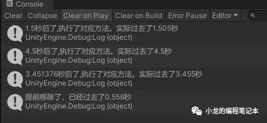

```
TestDelayTask.CS
public class TestDelayTask : MonoBehaviour
{
    private void Start()
    {
        AddLaterExecuteFunc(1.5f);
        AddLaterExecuteFunc(1.5f);
        AddLaterExecuteFunc(1.5f);
        AddLaterExecuteFunc(4.5f);
        AddLaterExecuteFunc(4.5f);
        AddLaterExecuteFunc(4.5f);
    }
    
    public int forceTestCount = 100000;
    List<DelayedTaskData> futureEventDataList = new List<DelayedTaskData>(100000);
    List<long> testTimes = new List<long>(100000);
    
    [ContextMenu("暴力测试")]
    public void ForceTest()
    {
        testTimes.Clear();
        for (int i = 0; i < forceTestCount; i++)
        {
            testTimes.Add(TimerUtil.GetLaterMilliSecondsBySecond(UnityEngine.Random.Range(1, 15.0f)));
        }
        futureEventDataList.Clear();

        Stopwatch stopwatch = new Stopwatch();
        stopwatch.Start();
        for (int i = 0; i < forceTestCount; i++)
        {
            futureEventDataList.Add(DelayedTaskScheduler.Instance.AddDelayedTask(testTimes[i], TestFunc));
        }

        for (int i = 0; i < forceTestCount; i++)
        {
            DelayedTaskScheduler.Instance.RemoveDelayedTask(futureEventDataList[i]);
        }
        
        stopwatch.Stop();
        Debug.Log($"暴力测试完成，共耗时{stopwatch.ElapsedMilliseconds / 1000.0f}秒");
    }

    void TestFunc()
    {
        Debug.Log("测试方法执行了");
    }

    private DelayedTaskData AddLaterExecuteFunc(float time, Action completeAction = null, Action earlyRemoveAction = null)
    {
        var pressTime = Time.time;
        Stopwatch stopwatch = ObjectPoolFactory.Instance.GetItem<Stopwatch>();
        stopwatch.Restart();
        return DelayedTaskScheduler.Instance.AddDelayedTask(TimerUtil.GetLaterMilliSecondsBySecond(time),
            () =>
            {
                stopwatch.Stop();
                ObjectPoolFactory.Instance.RecycleItem(stopwatch);
                // Debug.Log($"{time}秒后了,执行了对应方法。实际过去了{Time.time - pressTime}秒");
                Debug.Log($"{time}秒后了,执行了对应方法。实际过去了{stopwatch.ElapsedMilliseconds / 1000.0f}秒");
                completeAction?.Invoke();
            }, () =>
            {
                earlyRemoveAction?.Invoke();
                stopwatch.Stop();
                Debug.Log($"提前移除了，已经过去了{stopwatch.ElapsedMilliseconds / 1000.0f}秒");
                ObjectPoolFactory.Instance.RecycleItem(stopwatch);
            });
    }

    DelayedTaskData _delayedTaskData;

    void RecycleDelayedTask()
    {
        if (_delayedTaskData != null)
        {
            DelayedTaskScheduler.Instance.RemoveDelayedTask(_delayedTaskData);
            _delayedTaskData = null;
        }
    }

    private void Update()
    {
        //持续按下时不断创建和回收
        if (Input.GetKey(KeyCode.C))
        {
            RecycleDelayedTask();
            _delayedTaskData = AddLaterExecuteFunc(UnityEngine.Random.Range(1, 5.0f), () => _delayedTaskData = null);
        }

        if (Input.GetKeyDown(KeyCode.R))
        {
            RecycleDelayedTask();
        }
    }
}
```

### 总结

在本文中，我们使用C#语言实现了一个毫秒级别的延时任务调度器，为游戏中通用的延时行为提供管理调度，**加入排序思想，来保证任务按顺序执行；使用优先队列快速索引对象，以及减少各个操作带来的消耗；使用区间划分来减少优先队列中元素数量**。这个调度器在客户端已经基本够用了，但是如果想拓展到服务器那边使用，我们还需要继续优化算法来减少各个操作的时间以及内存占用，感兴趣的童鞋可以继续深入研究，后续有时间我也会将多轮区间划分和时间轮算法整合进这个延时任务调度模块中，欢迎大家与我交流


## 特效管理器

- 指定坐标的特效
- 跟随角色的特效
- 设置特效的生命周期


## 音频管理器

音频管理也是个比较复杂的东西，现在市场上也有一些比较有名的音频管理插件，比如Wwise、FMod等等，不过对于我们轻量开发而言，没有必要使用这些东西，使用自带的音频组件已经可以实现一些比较好的效果了。


### 需要关注的名词

在开发过程中，我们主要需要关注下面这几个组件和资源类型：

**Audio Listener**：这相当于你的耳朵，用来接收声音的，通常我们直接把这个组件挂到主相机上，相当于你走到哪都把耳朵带着的。

**Audio Source**：音频的来源，在这个组件里配置要播放的声音，以及播放的设置，比如是否循环播放，音频的优先级，音量大小以及立体音等等。

**Audio Clip**：这是Unity对音频资源的一个封装物，包含了音频资源本体和关于这个音频资源的设置。Audio Clip将被放到Audio Source中使用。其中Unity支持.aif, .wav, .mp3和 .ogg格式的音频，我用的较多的一般是wav和mp3。

**Audio Mixer**：字面翻译就是混音器，在更高的层面上设置音频信息并处理输出的声音。比如给**音频分组**，每个组单独设置属性，然后在播放的时候给音频指定混音器，使得声音在进入耳朵前被加工一次。**通常我使用这个东西来对游戏内不同类型的声音做管理，分别控制它们的音量和效果。**


### 设计思路

有了上面这几个东西后，我们已经可以在游戏里播放声音了，把音频资源拖入Unity，在场景中创建一个物体并挂上Audio Source组件，设置要播放的音频，然后调用播放的方法即可。不过，既然有这篇文章，我们肯定不会只这么简单粗暴地处理。设计思路及过程且听我一一道来。

在很多游戏里，我们可以直接调节背景音乐和游戏音效的音量，如果直接使用Audio Source来控制音量，那么在调节音量时，我们需要遍历场景里的Audio Source去一一设置，可以但没必要。前面提到过，我们可以通过Audio Mixer来做一个中间加工厂，对那些进入到我们耳朵的声音先处理一波，所以我的做法是**为不同类型的声音创建单独的Audio Mixer Group**，在播放声音时就指定Audio Source的Output，让它从指定的Group过一遍。在调节音量时，我我们直接控制对应Audio Mixer Group的音量即可。因为Audio Mixer是一个资源文件，其内部并不会保存我们运行时修改的音量，因此，在修改音量时，我们可以将这个音量存储到本地，每次进入游戏时从本地读取音量并设置好即可。

前面提到过，声音播放时有一些设置，这些设置不可能在每个播放声音的地方都各自设置一遍。对于某个固定的声音，它们的设置往往是一样的。因此，我们可以采取**配置化**的方法。在配置表中配置某个声音的设置。这样运行时，当播放某个声音时，去读取对应的配置并设置上即可。

播放声音这个行为在游戏中会很频繁，我们如果每个地方都像下面这样手写音频名字，那很容易出问题。因此我采取的措施是**定义一个音频的枚举类**。播放声音时，通过类名来获取具体的字段，以减少出错的概率。

 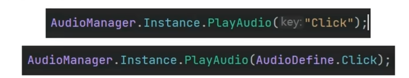  

除此之外，游戏中经常会需要进行资源迭代，这个过程往往是手动的。例如，音频组的同学可能会误删某个音频文件，而我们的QA同学只有在某一天需要播放这个音频，并恰好留意到其播放情况时，才能察觉出问题。这导致问题被发现的时间被推迟到很晚。同时，我们自行维护这个枚举类，也容易导致出现问题。例如，在修改资源名称时，需要同步修改这个文件，找到对应的字段并修改内容，这增加了出错的可能性。因此，我们需要在资源变更时，自动维护这个枚举类。我采取的做法是**通过遍历编辑器中对应的文件夹中的所有音频文件，来自动生成这个枚举类**。这样，如果某个音频被误删，生成枚举类后，以前使用这个音频的地方就会直接报错，从而及时暴露问题并修复。

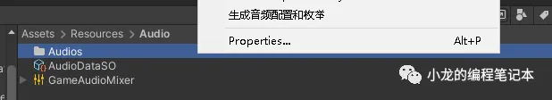 

上面自动生成的工具这里可以看到，我不止是生成了枚举，还生成了音频配置，这里的音频配置指的是每个音频对应哪个Audio Mixer Group，以及这个音频是否需要循环等等。音频对应的Group我是通过文件夹来决定的，**相对于这个根目录的文件夹路径即为这个音频所属的Group**。像背景音乐这种需要循环的音乐，**命名则直接以_Loop结尾，表示这个音频是需要循环播放的**，不需要在播放完毕被回收掉。**对于非循环播放的声音，在播放时即可计算音频的长度，然后添加一个延迟的任务将这个音频回收。[前几节中的延时任务处理模块和对象池模块]**

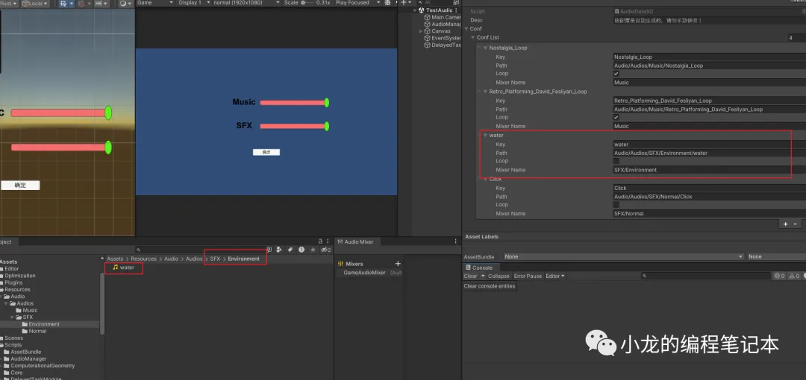 

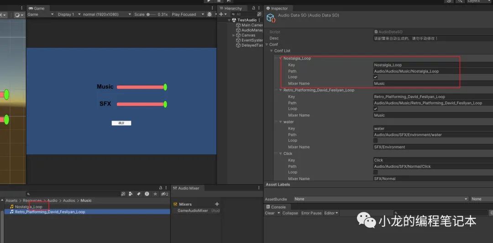 

对于3D游戏来说，音频播放往往需要随着物体的移动而移动，因此**可以在播放音效时指定该音效跟随的物体**。例如，呼啸的子弹可以在发射时给子弹挂载一个呼啸的Audio Source，这样声音就会随着子弹移动了。

上面就是我对游戏音频的管理方式了，简单说就是**配置化简化调用，自动化减少出错概率，池化提升游戏性能。**


### 参考文献

[tang-xiaolong/SimpleGameFramework (github.com)](https://github.com/tang-xiaolong/SimpleGameFramework?tab=readme-ov-file)


## 对象池


### 概要

下面这个图来源于游戏《吸血鬼幸存者》，在游戏中会存在满屏的怪物、子弹、伤害飘字等等，它们被创建，被销毁，爽感十足。

 

但是CPU吐槽道：你倒是爽了，有没有考虑过我的感受？？？为啥它要吐槽呢？因为你每次创建一个对象时，它都需要到内存里去为它找到一块没人用且连续的区间，为它做初始化工作，最后把这个对象丢给你，然后你为这个对象设置一些信息并展示出来，你这个对象用完了其实也没有告诉它说你不用了，它可能要等到后面做清理时才会知道这个对象真的没用了，然后把这块连续的区间拿回去。

**创建一个对象可以简单地分为这几个步骤：**

1、找到并分配对象所需要的内存。

2、对象做原始的初始化工作。

3、对象本身设置信息。

这里主要是前两个步骤比较费（3也有可能费，但是这与业务有关，这里不讨论），找到内存其实在正常情况下是不费的，但是由于你疯狂地索要内存，还是不一样的东西，杂乱无章，即使你不用了，但是它还是不能简单把这个内存拿回去重新分配给其他地方(判断内存是否被使用代价大)，这个期间你要分配新的内存，就不得不继续往后找，找到一个合适的地方。直接这么说可能大家不是很理解，接下来我来给大家举个🌰类比一下。


### 示例：摆摊占位

比如去市场上摆摊，每个人摆摊所需要的空间大小不同，当你需要1米的摊位时，你走到街头一看，欸这两米被人占了，继续走，这里只有70厘米不够用，为啥后面的人要跨着占摊位导致这里有个小空间呢？？？噢原来他想把摊位摆到某个店旁边方便吃饭。

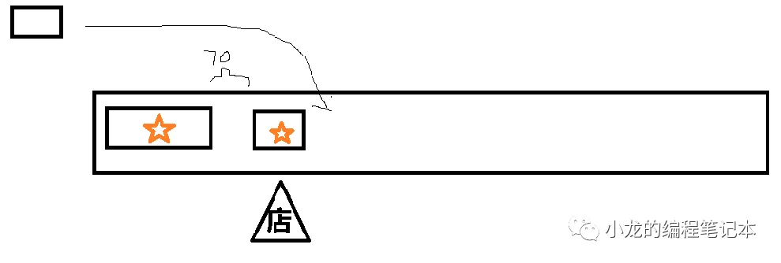 

继续往前走咯，终于找到了一个位置把东西放下，在这里贴一个条。

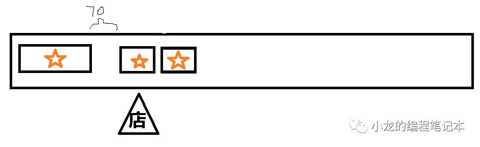 

有些人东西少，很快就卖完走了，但是他**也没打招呼说自己不用这个摊位了**，条还在上面贴着呢，有的人卖完一批**回店里又去拿新的过来卖**。所以后面再有人来找位置，也不敢就在这个贴了条但没人的地方摆，只能继续往后找。很快这条街就都被占满了，再有新的人过来摆摊，会发现没地方可以摆，只能找管理员问了，说前面有这么多没人的摊位，是不是可以清理一下给我摆呀？

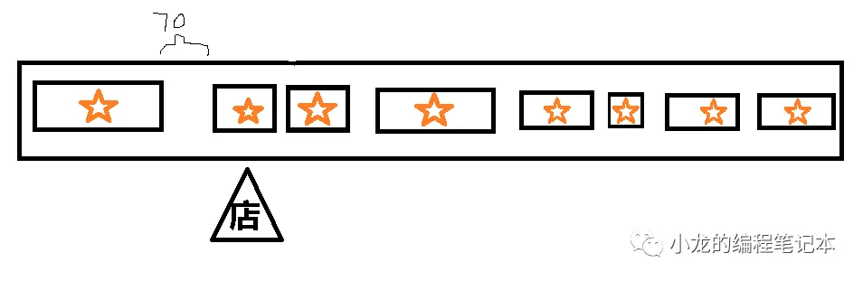 

管理员就屁颠屁颠去帮忙查看，**看那些摊位是不是真的没人了，他可能是打电话，可能是去找人确认**，总之记住，这个步骤比较麻烦，所以管理员也不会轻易帮你这么做。经过一顿猛操作后，终于给腾出来一些空闲摊位了，把上面的条撕掉表示这里真没人了。

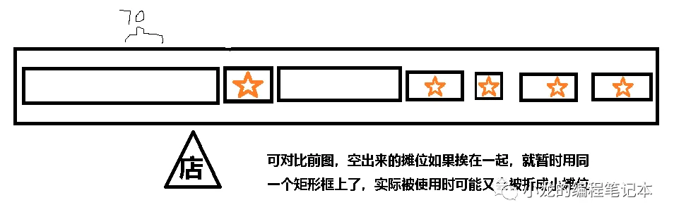 

### 面临的问题

从上面的步骤不难看出，由于大家摊位都不一样，并且需求也不同，所以很容易导致出现这种小的空间，加上大家摊位用完也不会说一声，所以你也没法简单直到某个空位是不是可以摆，只能往后找没贴条的空位。在内存中其实也是一样的，大家需要使用的内存大小不同，用完也不会告知这块内存用完了，分配时也会面临**空隙太小不够用**以及**空白内存不敢用**的情况。

你可能要说了，那大家用完把条撕了不就行了？那你这就对摆摊的人提出了较高的要求，并且肯定会有人忘记这么做，那这个摊位就会被一直占着了。在内存分配时，我们通常会由内存系统来为大家分配内存，并且在内部通过一些手段管理分配的内存，不需要大家用完告知(当然你也可以动态分配内存，这里不细讨论)。


### 解决方案——对象池技术

前面铺垫了这么长，抛出了两个问题，我们要怎么解决这个问题呢？摊主们自发组织了一个会议，决定大家直接申请一段较长的街道，并培养自己用完就撕条的习惯。由于1米的摊位**使用量很大**，并且**卖的东西不多，很快就能卖完走人**，而卖鱼的摊位设备**布置麻烦，带走也麻烦**，大家直接把一块长10米和长15米的连续空地都贴上条，约定了某个特殊标记表示摊位不用了，要用摊位时直接根据这个标记来识别。

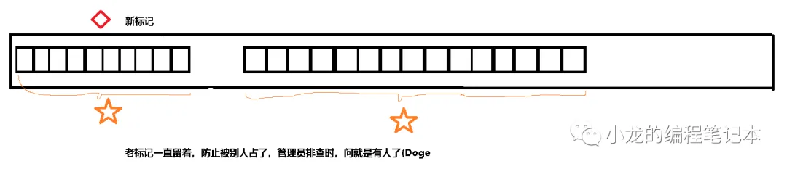

于是情况就变成这样了：一个参会过且摊位是1米的人过来了，他直接来到这10米摊位这里，被分配了一个摊位，另一个是摊位1米的人来了，发现这剩下的9米都被占了，因为不认识那个特殊标记，所以就往后走找其他摊位了。经过一段时间，某些参会过且摊位是1米的人用完了，把特殊标记还原回来走了，后面参会过且摊位是1米的人就知道，这个摊位虽然贴了条，但是实际没人用所以自己可以用。最后市场可能就是下图这样的，**特殊标记不连续可能是有些人用完走了把标记抹了。**

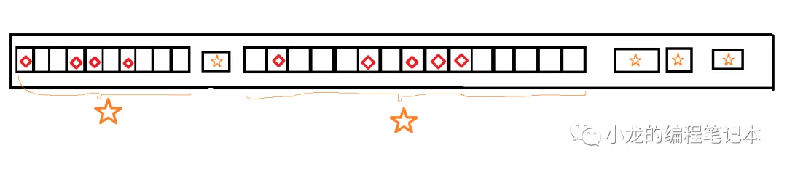

通过这种方式，**减少了呼叫管理员的次数(用完改标记，复用率高了)，也不要求所有人都有用完撕条的意识，仅仅针对使用量大，且摊主更替比较频繁的摊位使用者**。这其实就是对象池思路的一种应用，当然**实际情况会比例子要稍微复杂一点，这里略去了一些细节**，比如当有特殊标记的摊位满了怎么办？管理员真的只是沟通后把这些没人的摊位腾出来，会让其他人挪位置吗等等，感兴趣的可以自行探索下内存怎么分布的，系统怎么管理内存怎么做GC的。


### 对象池


#### 概念

前面都是半讲故事的形式解释对象池技术，现在我们回归正题来给它一个标准定义，对象池技术是一种很常用的优化方法，它可以有效地减少内存的分配和回收。它适用于那些被频繁创建与销毁的物体、创建或销毁时开销很大的对象，文章开头图中的子弹与怪物无疑满足这个要求。

对象池技术的基本思想是，当需要创建一个新的对象时，先从一个预先创建好的对象集合中查找是否有可用的对象，如果有，就直接使用它，如果没有，就创建一个新的对象，并将它加入到对象集合中。当一个对象不再使用时，不是立即销毁它，而是将它标记为闲置状态，放回到对象集合中，等待下次使用。

 


#### 优点

对象池技术有以下几个优点：

- 减少了内存的分配和回收，避免了内存碎片化和垃圾回收带来的性能损耗。
- 减少了对象的创建和销毁的开销，提高了游戏的运行效率。
- 方便了对象的管理和复用，提高了代码的可读性和可维护性。


#### 缺点

那对象池技术有什么缺点吗？再回到我们前面的示例，当我们有了这个制度后，**需要购买更多的贴纸**来作为特殊标记，同时，摊主**需要掌握额外的知识**，了解特殊标记的含义，最后，如果参会人**忘记把特殊标记改回来，那这个摊位就永远被占用了**，因为后续使用者不会去找管理员核对，只会无条件相信特殊标记，摊主们形成了自己的一套判定标准，使得管理员没法通过原来的方式来维护这些空间了。另外，前面提到了划分10米空地给1米的摊主，那如果每次都只有五个1米的摊主同时在卖东西，剩下的5米岂不是就**白占浪费**了吗？因此我们可以总结出对象池技术的缺点：

- 需要额外的内存空间来存储对象集合，可能会占用较多的内存资源。
- 需要维护对象集合的状态，可能会增加逻辑的复杂度和出错的风险。
- 需要使用者严格遵循使用规则，使用对象池破坏了原有的内存管理方式，只用不还会导致内存泄漏，还了还用会导致逻辑错误。
- 需要根据不同的场景和需求来设计合适的对象池策略，可能会增加开发的难度和工作量，池子大小分配不合理可能导致内存浪费。


#### 需要注意的点


##### 设置初始数量

为对象池设置初始数量，并在某个时机提前创建好一定数量的对象便于某些系统可以直接拿去用，这样可以避开内存分配高峰从而减少卡顿。比如在进入战斗前读条时，我们事先创建好五十个子弹，实际战斗时则可获得子弹去显示，无需在复杂战斗场景中还进行开销比较大的创建行为。

##### 设置最大数量

设置合适的最大数量一方面可以避免占用过多内存却不使用（一般会先创建一个能容纳最大数量对象的池），另一方面也避免了部分系统无限制索要内存使得卡顿。在达到最大数量后，继续从池中获取对象时，如果没有可用的对象，通常需要采取一定措施，比如：

- 比较重要的对象池可以设置一个很大的最大数量；
- 一些对象创建出来不太显眼，可以选择不创建；
- 一些对象创建后可以掩盖现有的对象，可以对现有的对象做清理，提前进入回收环节。

由于设置最大数量具备主观性，我们还可以考虑增加一些机制来对对象池做检查，如果某些对象池池中有很多对象，但实际游戏中往往只有几个对象会被使用，则可以动态调整对象池大小，减少其占用的内存。

##### 做好清理工作

同一个池中的对象可能用在不同地方，在其他地方使用时可能会残留一些数据，干扰到新使用的地方，因此需要做好清理工作。比如我们建立了一个Vector3的列表池，在某个系统中我们从池中拿到了一个列表，并把寻路的结果存进去。如果这个时候忘记做清理工作，可能在列表中已经存在几个Vector3的数据了，从而导致寻路出问题。

##### 避免用完不还，还完还(hai)用

如果某个对象从池中取出后不用了，但是没有归还，会导致对象池一直以为这个对象被使用，从而无法再回收这个对象让其他人用。如果一个对象还了又继续使用，可能导致其他地方的数据出问题，别人已经在用这个对象了，你又继续修改对象内容。


#### 实现

本文旨在实现一个通用的对象池和一个Unity的对象池，前者用于创建通用的对象，后者用于创建Unity的对象。文章中的代码均已上传到Github，感兴趣的可以看看，觉得有用也不妨给个Star~ [https://github.com/tang-xiaolong/SimpleGameFramework]

由于对象池可能会存在很多个，我们不可能在每个使用的地方都事先去创建一个对象池，然后再从对应池中取需要的对象，因此本文提供了对象池的工厂类，当需要获取一个对象时，不直接与对象池交互，而是直接与工厂交互，由工厂来维护对象池，对象池本身来维护对象。

在游戏开发过程中，经常会有一些需要自动回收的资源，比如某个粒子播放时长是3s，那它可能就是需要在3秒后回收，因此本文提供了一个自动回收的设置，让某些对象可以在创建后被对象池自动回收，自动回收任务是使用了前一节中的延时任务调度模块实现的，在本节中使用的延时任务调度模块已做了改进，为任务增加了唯一Id使得任务不会被错误使用，改进目的与方案后续会出文章来阐述，本文不赘述。

在处理Unity Object对象时，无可避免需要加载游戏资源，本文提供一个简单的资源加载类，实际放入项目中应该是接入项目的资源加载类。


#### 对象池模块的主要脚本及功能

下面列举对象池模块的主要脚本以及功能，具体使用请下载项目查看，这里不做说明了，后续也会有专门的视频来解读。

##### 资源加载

`TestAssetLoad`负责加载资源，内部实现了一个资源加载的方法。

##### 自动回收

`AutoRecycleConfigItem`配置了每个回收的对象名字和回收时间。

`AutoRecycleConfig`负责在解析时临时保存`AutoRecycleConfigItem`配置。

`AutoRecycleConf`负责维护自动回收的配置，内部配置使用字典形式保存。

`AutoRecycleItem`是运行时自动回收对象实例，当存在一个自动回收对象时，会创建一个自动回收的任务，任务的uid保存在这个类中。

##### 对象池

`IObjectPool`定义了对象池的几种行为，包括获取对象，回收对象，清理对象，进池离池处理。

`ObjectPool`是一个通用的对象池，其实现了`IObjectPool`定义的行为。

`ObjectPoolFactory`是通用对象池的工厂类，负责对外提供不同的对象，**外界通过工厂类直接取得产品，由工厂类来创建生产产品的对象池并维护行为。**

`UnityObjectPool`是一个Unity Object对象池，实现了`IObjectPool`定义的行为。

`UnityObjectPoolFactory`是Unity Object对象池的工厂类，负责对外提供Unity Object的产品。在此类中还维护了自动回收配置的读取，自动回收任务的创建与销毁。实际资源的加载通过外界设置的资源加载方法加载。


### 参考文献

[tang-xiaolong/SimpleGameFramework (github.com)](https://github.com/tang-xiaolong/SimpleGameFramework?tab=readme-ov-file)


## 单例模块

使某个对象唯一存在、减少重复代码的编写、

### client

#### 不带mono

```c#
public abstract class SingletonNonMono<T> where T : class,new()
{
    private static T _instance;
    private static object _lock = new object();

    public static T Instance
    {
        get
        {
            if (_instance == null)
            {
                lock (_lock)
                {
                    _instance ??= new T();
                }
            }
            return _instance;
        }
    }
}
```

#### 带mono

```
public abstract class Singleton<T> : MonoBehaviour where T : Singleton<T>
{
    private static T _instance;
    private static object _lock = new object();

    public static T Instance
    {
        get
        {
            if (_instance == null)
            {
                lock (_lock)
                {
                    _instance = FindObjectOfType<T>() as T; //先去场景中找有没有这个类
					//如果没有，那么我们自己创建一个Gameobject然后给他加一个T这个类型的脚本，并赋值给instance;
                    if (_instance == null)
                    {
                        GameObject go = new GameObject(typeof(T).Name);
                        _instance = go.AddComponent<T>();
                    }
                }
            }
            return _instance;
        }
    }


    protected  virtual void Awake()
    {
        if (_instance == null)
        {
            _instance = (T)this;
            DontDestroyOnLoad(gameObject);
        }
        else
        {
        	//销毁这个新来的
            Destroy(gameObject);
        }
    }

    private void OnApplicationQuit()//程序退出时，将instance清空
    {
        _instance = null;
    }
    
}
```


### Server

```
	public class Singleton<T> where T : new()
	{
		private static T instance;
		private static object lockObj = new object();
		public static T Instance
		{
			get
			{
				if (instance != null) return instance;
                lock (lockObj)
                {
					if(instance == null)		//防止极端情况
                    {
						instance = new T();
                    }
                }
				return instance;
			}
		}
	}
```

泛型弄出了很多个不同的Singleton类，所以多个子类来继承这个Singleton的时候并不会发生使用同一个static属性的问题


## 可设置键位的输入系统


我们这里配合input system来完成这个功能

[【unity小技巧】新输入系统InputSystem重新绑定控制按键（最全最完美解决方案）_untiy显示inputsystem表示设置的按键代码-CSDN博客](https://blog.csdn.net/qq_36303853/article/details/140584753)


### input system


**InputAction**

`InputAction`是Unity输入系统中的核心类，用于定义一个输入动作。一个输入动作代表一个具体的输入行为，比如“跳跃”或“攻击”。每个`InputAction`可以绑定到一个或多个输入设备的特定输入事件（例如，键盘上的空格键，手柄上的按钮等）。

**InputActionReference**

`InputActionReference`是一个引用类型，用于引用`InputAction`资产。它允许你在多个地方引用同一个`InputAction`，而不需要在每个脚本中重复定义和配置相同的输入动作。


# 战斗系统

## 操作控制

**目前这个控制操作是产生了一个比较大的分歧**

1.类似原神/永劫无间的操作方式：鼠标左右键位都是攻击的，特点就是技能比较少，依赖于普通攻击，也就是依赖鼠标。

2.逆水寒操作方式，鼠标左是选中人或者是寻路，鼠标右键是旋转视野的，技能和普通攻击全部依赖于键盘。


目前我们的人物控制使用有限状态机来切换，但是考虑到大状态：

- stand：拳脚攻击或者无法攻击
- 有武器：武器攻击。
- 载具：骑马/游泳/骑车/开坦克/开飞机/御剑飞行/浩浩乎如冯虚御风

所以我们考虑使用分层有限状态机来实现这个功能，利用组合模式，将状态机也当成一个状态，也就是说状态机里面的状态可是是状态和子状态机。


## 普通攻击锁敌机制


### 永劫无间


1.人物周围有一个sphere的检测，当检测圆内有敌人就必须锁定一个。当超出检测范围的时候，锁定取消。

 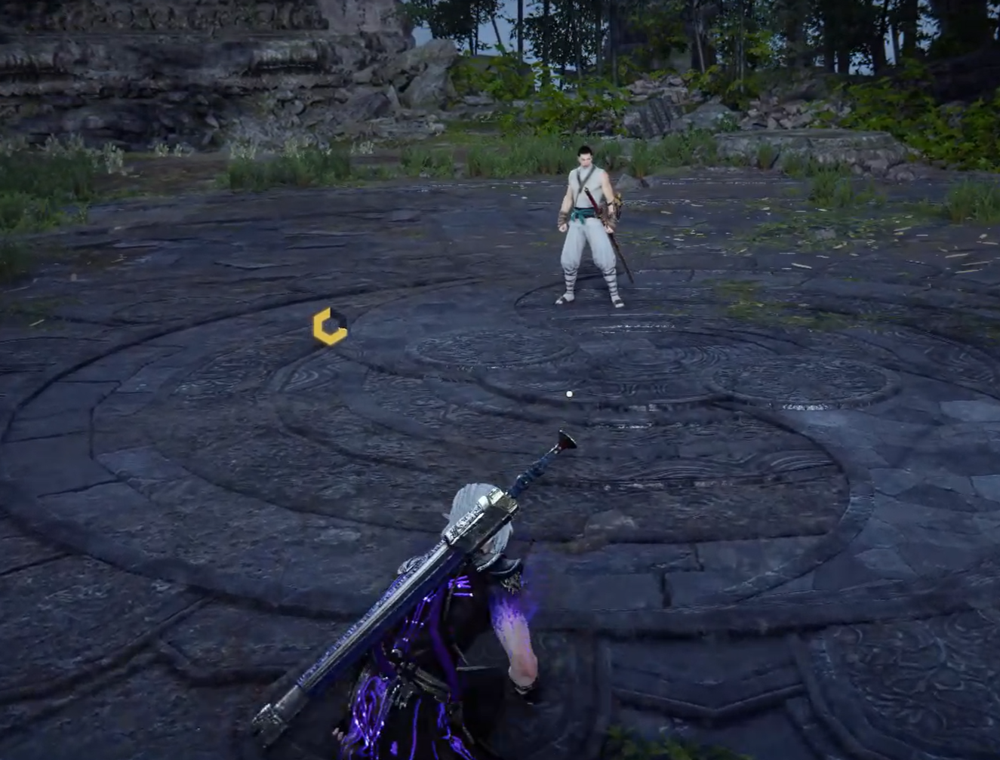

 

 


**2.检测圆内有多名敌人的时候按照距离索敌**

 

 


**3.检测圆内有多名敌人的时候也可通过鼠标执行的方向的一个扇形区域内切换敌人**，这个检测优先级高于距离

 

 


4.永劫无间的人物在中间偏左的位置

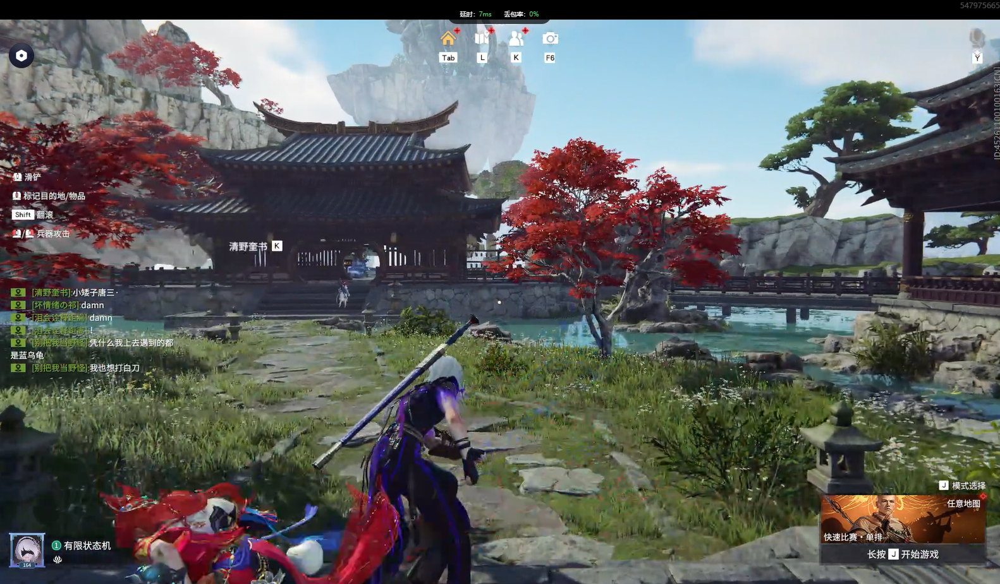


### 其他参考


## 技能编辑器

用timeLine实现的，貌似性能不太好？


## 连招分析

## 技能分析

蓄力/前摇阶段

技能伤害阶段：可能有多段

​	start

​	stop

强制后摇阶段

取消后摇阶段


## 伤害检测

使用碰撞体

逻辑的范围检测


## 位置修正


## **技能系统**

### **技能的设计理念**

开发一个 MMORPG 游戏的技能系统是一个复杂而又重要的任务。下面是一些你可以考虑的技能系统设计和实现方案：


\1. 技能分类：将技能分为不同的类别，如攻击技能、辅助技能等，可以让玩家更加容易理解和学习技能；技能施放目标（单位、点、无目标）

\2. 技能效果：每个技能应有独特的效果，其中包括直接伤害、控制效果、增益效果等；

\3. 技能等级：每个技能应该有对应的等级，随着技能等级的提升，技能的效果和威力也应该相应增强；

\4. 技能升级：玩家可以通过使用技能来提升技能等级，或者通过消耗游戏内资源来升级技能；

\5. 技能冷却时间：每个技能都应有冷却时间，这样可以防止玩家过于频繁地使用技能，从而保持游戏的平衡性；

\6. 技能组合：不同的技能可以组合使用，产生更加强大的效果和能力，玩家需要根据实际情况进行组合使用以获得最佳效果；

\7. 技能书或技能符：玩家可以通过购买或者掉落的方式获取技能书或技能符，学习新的技能或提升已有技能的等级。

需要注意的是，在设计一个 MMORPG 的技能系统时，应该考虑到游戏整体的平衡性，防止某些技能过于强大或者过于弱小。同时，技能系统应该有足够的深度和复杂度，以满足不同类型玩家的需求。最后，为了保证游戏平衡性，技能系统的实现也需要不断地进行调整和平衡，以确保游戏体验的公正性和爽快感。


### **技能参数**

根据提供的技能属性信息，以下是对应功能和作用的解释：

\1. 编号：技能在系统中的唯一标识符。

\2. 单位类型：适用该技能的单位类型，例如角色、怪物等。

\3. 技能码：用于区分不同的技能，同一个技能的不同等级他们的技能码相同。

\4. 技能名称：技能的名称，用于显示和玩家交互。

\5. 技能描述：对技能功能和效果的文字描述，用于向玩家解释技能的作用。

\6. 技能等级：技能的当前等级。

\7. 技能上限：技能可以达到的最高等级。

\8. 类别：技能所属的分类，如攻击型、防御型、辅助型等。

\9. 技能图标：技能在界面上显示的图标。

\10. 目标类型：技能可作用的目标类型，如单体、群体、敌方、友方等。

\11. 冷却时间：技能使用后需要等待的冷却时间，单位为秒。

\12. 施法距离：施法者与目标之间的最大距离。

\13. 施法前摇：技能使用前的准备时间，通常以秒为单位。

\14. 魔法消耗：使用技能所需的魔法值消耗。

\15. 施法动作：技能使用时的特定动作或动画。

\16. 等级要求：使用该技能所需的最低等级限制。

\17. 投射物：技能释放后是否有物体或者投射物飞出。

\18. 投射速度：投射物飞行的速度。

\19. 击中效果：技能击中目标后产生的效果，如伤害、状态移除等。

\20. 影响区域：技能的作用范围或影响区域，如圆形范围、扇形范围等。

\21. 命中时间：技能命中目标的时间点。

\22. 附加效果：技能额外带有的其他效果，如减速、治疗、提升属性等。

\23. 物理攻击：技能造成的物理伤害值。

\24. 法术攻击：技能造成的法术伤害值。

\25. 物攻加成：技能使用时对物理攻击的加成效果。

\26. 法攻加成：技能使用时对法术攻击的加成效果。

这些属性提供了对技能的详细描述，可以根据这些属性设计和调整技能的效果和功能，以满足游戏的需求和平衡性。请注意在设计时要考虑技能之间的相互作用和整体平衡，以确保游戏的公平性和可玩性。


### **开发思路**

客户端和服务器都有Define数据，所以我们并不需要将技能信息完整的传输，只需要通过网络同步技能的id即可，其他属性都可以通过Define计算得出。

技能阶段：开始-前摇-激活-结束

技能状态：

```
public enum SkillState
{
    None, Casting, Active
}
```


角色和技能的关系：

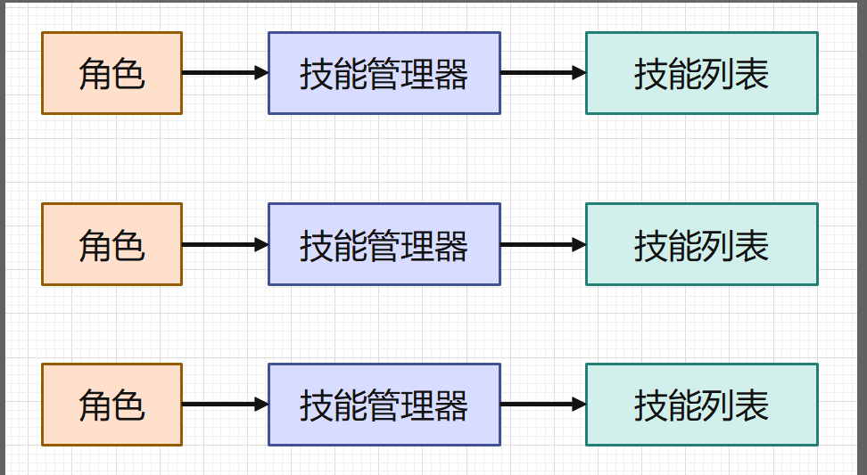 


### 技能释放请求与结果

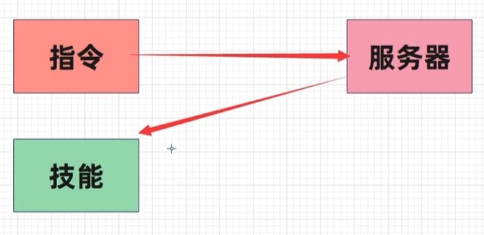 


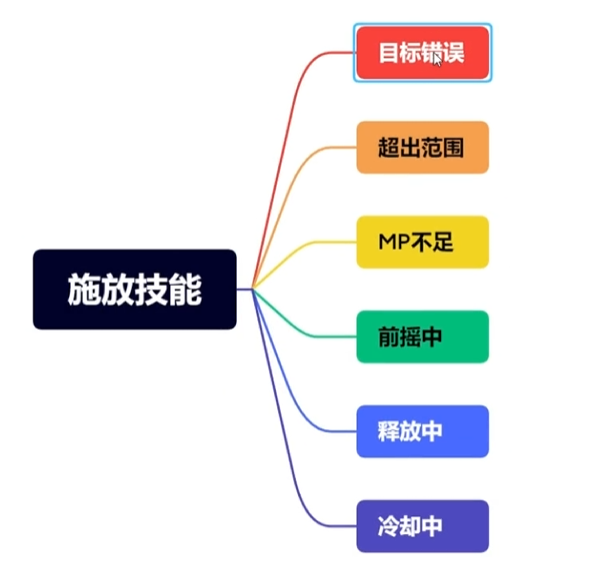 


### 技能释放的流程

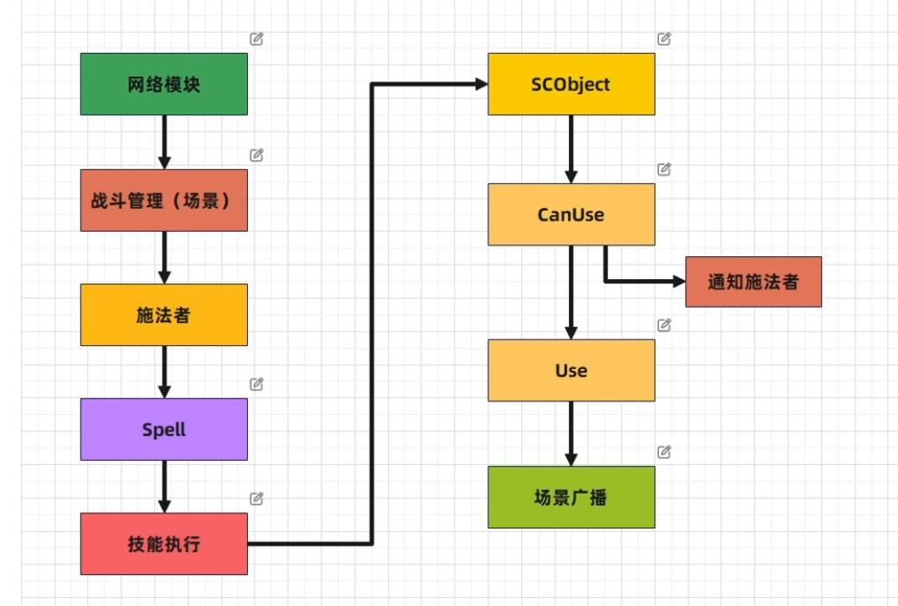

1.网络模块：接收释放请求，然后转交给场景

2.场景就会就会转交给施法者

3.施法者调用自己的Spell技能释放器来释放技能

4.Spell ：分别处理 单位类型，点类型，无类型 三种技能，技能前的必要条件处理

5.SCObject : Server-Client-Object,用于代理（单位与点）

6.CanUse: 技能是否能够执行，例如冷却 距离 道具 buff之类的。将结果通知施法者

7.Use:真正运行技能

8.广播给场景中的其他玩家：让其他玩家知道某个单位施法了技能


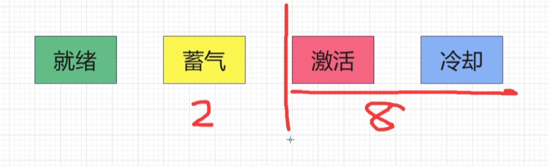

我们的冷却从激活的时候（因为激活这个状态时间很短，所以就把它并在一起了）才开始进行，所以说蓄气的时候不进入冷却


### **技能伤害**

设计伤害消息

在设计`Damage`消息结构时，是否需要加入其他属性取决于您的游戏逻辑和设计需求。以下是一些可能考虑加入的额外属性：


\1. **伤害类型**：可以通过枚举（enum）来定义不同的伤害类型，如物理、魔法、真实伤害等，以便在游戏逻辑中进行区分处理。

\2. **伤害来源**：除了技能，伤害可能来自多种来源，如陷阱、道具、环境效果等。添加一个字段来标识伤害来源可能有助于处理复杂的游戏逻辑。

\3. **时间戳**：记录伤害发生的具体时间点，对于解决网络延迟引起的同步问题或者回放系统中的事件重现可能非常有用。

\4. **位置信息**：如果游戏中位置信息很重要，可能需要记录伤害发生时攻击者和目标的位置。

\5. **连击信息**：如果游戏中有连击机制，记录连击数或者连击的特殊效果也许是必要的。

\6. **状态效果**：某些技能可能会附带状态效果，如减速、眩晕等，可以加入相关信息来描述这些效果。

\7. **护盾穿透**：如果游戏中有护盾机制，可能需要记录伤害是否穿透护盾以及穿透的量。

\8. **伤害减免**：记录目标因装备或技能效果而减免的伤害量，对于后续的游戏数据分析可能很有帮助。

\9. **伤害反射**：如有伤害反射机制，记录反射的伤害量和反射给谁也许是必要的。

\10. **溢出伤害**：如果目标的生命值低于伤害量，记录溢出的伤害量可能对于某些游戏机制来说很重要。

\11. **攻击者和目标的状态**：在造成伤害时，攻击者和目标的状态（如增益/减益效果）可能会影响最终的伤害计算，这些信息可能需要被记录下来。

\12. **技能等级**：如果技能伤害随着技能等级提升而增加，那么技能等级可能是一个重要的属性。

\13. **随机元素**：如果伤害计算中包含随机性，可能需要记录用于计算伤害的随机种子，以保证结果的可复现性。

请根据您的具体需求和游戏设计来决定是否需要加入这些额外的属性。记得在添加新的属性时，也要考虑到消息的大小、性能影响以及向后兼容性。


### **计算伤害数值**

**减法公式**

**伤害 = 攻击[攻] - 防御[守]**

**好处**：直观

**缺陷**：假设你的攻击力低于对方的防御，此时你打对方伤害为0

那你不断提升攻击力，但是还是达不到对方的防御力，那么你的提升就是0；因为打不出伤害.

差距过大的情况下，提升看不出效果


**英雄联盟（乘法公式）**

**伤害 = 攻击[攻] × ( 1 - 护甲[守] / ( 护甲[守] + 100 ) )**

**100 这个值是防御修正，你可以改变这个值，使得多少的护甲是百分之50的减伤，在低于这个防御修正之前，提升是非常快的**

10护甲=伤害减免9%

100护甲=伤害减免50%

200护甲=伤害减免66.66%

300护甲=伤害减免75%

400护甲=伤害减免80%

1000护甲=减免90%

好处：改善了减法公式的缺点

缺陷：一开始我们有100护甲的时候，伤害减免已经50%了

​			随着我们的护甲堆到1000，伤害减免也才90%。越往后堆护甲的收益越来越低

对于英雄联盟这种装备有限的游戏来说可以这样用。

但是对于mmo这种游戏来说就不行了，随着等级的不同，装备属性也会提升。因为我们出来300护甲的装备就已经减伤50%后面根本就没必要换装备了。

这时候游戏动力就没有了。


**魔兽世界（乘法公式）**

**伤害 = 攻击[攻] × ( 1 - 护甲[守] / ( 护甲[守] + 400 + 85 × 等级[敌人] ) )**

防御修正这个值不再是固定的值了，它会随着等级变化

你面对的敌人等级越高，你就需要堆更多的护甲才能达到百分之50的减伤


# 热更新


## 知识概要


### 一、什么是热更新？

 **热更新** 是一种App软件开发者常用的更新方式。简单来说，就是在用户通过下载安装APP之后，打开App时遇到的即时更新。

**游戏热更新** 是指在不需要重新编译打包游戏的情况下，在线更新游戏中的一些非核心代码和资源，比如活动运营和打补丁。

（1）游戏上线后，在运营过过程中，如果需要更换UI显示，或者修改游戏的逻辑行为。传统的更新模式下，需要重新打包游戏，让玩家重新下载包体，造成用户体验不佳的情况。

 （2）热更新允许在不重新下载游戏客户端的情况下，更新游戏内容。


**热更新分为 资源热更新 和 代码热更新 两种**，代码热更新实际上也是把代码当成资源的一种热更新，但通常所说的热更新一般是指代码热更新。

- **资源热更新** 主要通过AssetBundle来实现，在Unity编辑器内为游戏中所用到的资源指定AB包的名称和后缀，然后进行打包并上传[服务器](https://cloud.tencent.com/act/pro/promotion-cvm?from_column=20065&from=20065)，待游戏运行时动态加载服务器上的AB资源包。
- **代码热更新** 主要包括Lua热更新、ILRuntime热更新和C#直接反射热更新等。由于ILRuntime热更新还不成熟可能存在一些坑，而C#直接反射热更新又不支持IOS平台，因此目前大多采用更成熟的、没有平台限制的Lua热更新方案。


### 二、热更新必要性作用

  一个游戏中有个很最重要的部分就是要想方设法的留住用户，如果每次游戏内容发生变化时(这在网游中经常会发生)，都需要用户去重新下载一个安装包(客户端)，这无疑是对游戏用户的留存产生了一个极大的威胁。

**热更新作用**：能够缩短用户取得新版客户端的流程，改善用户体验。

-  没有热更新情况： 
  - pc用户：下载客户端->等待下载->安装客户端->等待安装->启动->等待加载->玩 
  - 手机用户：商城下载APP->等待下载->等待安装->启动->等待加载->玩 
-  有了热更新情况： 
  - pc用户：启动->等待热更新->等待加载->玩 
  - 有独立loader的pc用户：启动loader->等待热更新->启动游戏->等待加载->玩 
  - 手机用户：启动->等待热更新->等待加载->玩

 通过对比就可以看出，有没有热更新对于用户体验的影响还是挺大的，主要就是省去用户自行更新客户端的步骤。

尤其手游是快节奏的应用，功能和资源更新频繁，特别是重度手游安装包常常接近1个G，如果不热更新，哪怕改动一行代码也要重新打个包上传到网上让玩家下载。 

 对于IOS版本的手游包IPA，要上传到苹果商店进行审核，周期漫长，这对于BUG修复类操作是个灾难。

所以说就需要热更新技术的出现来解决这个问题。


### 三、热更新原理

​	游戏中一些UI界面和某些模型等等的显示都是通过去加载相应的素材来实现的，当我们只把对应的素材资源进行替换就可以界面和模型发生变化，这个时候我们可以让客户端通过资源对比后从而进行相关资源的下载就可以实现热更新

  比如在一个游戏中的某些资源我们是放在服务器中的，当我们需要更换游戏中的某些资源时(如UI界面，某个英雄数值需要调整)。 我们只需要把这些新的资源与旧的资源进行替换，而不需要重新下载整个安装包就可以完成一个游戏版本的更迭，就相当于实现了一次热更新。

- **C#热更原理**：将需要频繁更改的逻辑部分独立出来做成DLL，在主模块调用这些DLL，主模块代码是不修改的，只有作为业务（逻辑）模块的DLL部分需要修改。游戏运行时通过反射机制加载这些DLL就实现了热更新。
- **lua热更原理**：逻辑代码转化为脚本，脚本转化为文本资源，以更新资源的形式更新程序。


**为什么实现热更新一般都是用Lua，而不是C#？**

既然游戏需要热更新，那么我们既然使用了 `Unity引擎`，为什么不能直接使用 `C#` 脚本去进行游戏热更新，反而大多都是使用Lua语言去实现热更新呢？

  这就不得不提一下C#语言的特性了，热更新本身对于资源热更新是非常容易的，Unity自带的AB包就可以轻松解决，难的是代码热更新，因为Unity中的C#是**编译型语言**，Unity在打包后，会将C#编译成一种中间代码，再由Mono虚拟机编译成汇编代码供各个平台执行，它打包以后就变成了二进制了，会跟着程序同时启动，就无法进行任何修改了。

所以直接使用C#进行热更新显然是不可行的，但是也不是说一点办法也没有。在安卓上可以通过C#的语言特性-反射机制实现动态代码加载从而实现热更新。

C#的编译流程：写好的代码->编译成.dll扩展程序（UnityEditor完成）->运行于Unity 

**C#热更具体做法**：将需要频繁更改的逻辑部分独立出来做成DLL，在主模块调用这些DLL，主模块代码是不修改的，只有作为业务（逻辑）模块的DLL部分需要修改。游戏运行时通过反射机制加载这些DLL就实现了热更新。

但苹果对反射机制有限制，不能实现这样的热更。为了安全起见，不能给程序太强的能力，因为反射机制实在太过强大，会给系统带来安全隐患。

其中 `ILRuntime` 就是使用C#进行的热更新(后边主流热更新方案中会讲到，这里先提一下)。

  而 `LUA` 则是**解释型语言**，并不需要事先编译成块，而是运行时动态解释执行的。这样LUA就和普通的游戏资源如图片，文本没有区别，因此可以在运行时直接从WEB服务器上下载到持久化目录并被其它LUA文件调用。

Lua热更新解决方案是通过一个Lua热更新插件（如ulua、slua、tolua、xlua等）来提供一个Lua的运行环境以及和C#进行交互。

**lua热更原理**：逻辑代码转化为脚本，脚本转化为文本资源，以更新资源的形式更新程序。


### 四、热更新流程

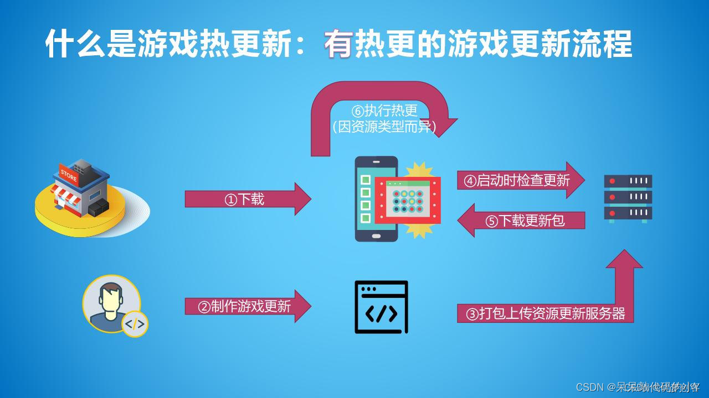


热更的基本流程可以分成2部分：

- 第一步：导出热更新所需资源
- 第二步：游戏运行后的热更新流程


**第一步、导出热更新所需资源**

1. 打包热更资源的对应的md5信息（涉及到增量打包）
2. 上传热更对应的ab包到热更服务器
3. 上传版本信息到版本服务器


**第二步、游戏运行后的热更新流程**

1. 启动游戏
2. 根据当前版本号，和平台号去版本服务器上检查是否有热更
3. 从热更服务器上下载md5文件，比对需要热更的具体文件列表
4. 从热更服务器上下载需要热更的资源，解压到热更资源目录
5. 游戏运行加载资源，优先到热更目录中加载，再到母包资源目录加载


 更新注意： 

- 要有下载失败重试几次机制； 
- 要进行超时检测； 
- 要记录更新日志，例如哪几个资源时整个更新流程失败。


### 五、目前主流热更新方案

下面举例了目前市面上比较主流的几种热更新方案，后面会针对这几种热更新方案都做一个比较详细的介绍，看一看各自的优缺点。

- LUA热更(xLua/toLua等)（LUA与C#绑定，方案成熟）
- ILRuntime热更
- puerts
- HyBridCLR（原huatuo）


#### 5.1 LUA热更(XLua/ToLua)（LUA与C#绑定，方案成熟）

`Lua热更`原理：逻辑代码转化为脚本，脚本转化为文本资源，以更新资源的形式更新程序 

Lua系解决方案: 内置一个Lua虚拟机,做好UnityEngine与C#框架的Lua导出。典型的框架有xLua, uLua,大体都差不多。

  Lua热更新解决方案是通过一个Lua热更新插件（如ulua、slua、tolua、xlua等）来提供一个Lua的运行环境以及和C#进行交互。xLua是腾讯开源的热更新插件，有大厂背书和专职人员维护，插件的稳定性和可持续性较强。

  由于Lua不需要编译，因此Lua代码可以直接在Lua虚拟机里运行，Python和JavaScript等脚本语言也是同理。而xLua热更新插件就是为Unity、.Net、Mono等C#环境提供一个Lua虚拟机，使这些环境里也可以运行Lua代码，从而为它们增加Lua脚本编程的能力。

借助xLua，这些Lua代码就可以方便的和C#相互调用。这样平时开发时使用C#，等需要热更新时再使用Lua，等下次版本更新时再把之前的Lua代码转换成C#代码，从而保证游戏正常运营。


#### 5.2 ILRuntime热更

 `ILRuntime` 项目是掌趣科技开源的热更新项目，它为基于C#的平台（例如Unity）提供了一个纯C#、快速、方便和可靠的IL运行时，使得能够在不支持JIT的硬件环境（如iOS）能够实现代码热更新。 ILRuntime项目的原理实际上就是先用VS把需要热更新的C#代码封装成DLL（动态链接库）文件，然后通过Mono.Cecil库读取DLL信息并得到对应的IL中间代码（IL是.NET平台上的C#、F#等高级语言编译后产生的中间代码，IL的具体形式为.NET平台编译后得到的.dll动态链接库文件或.exe可执行文件），最后再用内置的IL解译执行虚拟机来执行DLL文件中的IL代码。

  由于ILRuntime项目是使用C#来完成热更新，因此很多时候会用到反射来实现某些功能。而反射是.NET平台在运行时获取类型（包括类、接口、结构体、委托和枚举等类型）信息的重要机制，即从对象外部获取内部的信息，包括字段、属性、方法、构造函数和特性等。我们可以使用反射动态获取类型的信息，并利用这些信息动态创建对应类型的对象。

ILRuntime中的反射有两种：

- 一种是在热更新DLL中直接使用C#反射获取到System.Type类对象；
- 另一种是在Unity主工程中通过appdomain.LoadedTypes来获取继承自System.Type类的IType类对象，因为在Unity主工程中无法直接通过System.Type类来获取热更新DLL中的类。


#### 5.3 puerts（普洱TS）

git地址：[https://github.com/Tencent/puerts](https://cloud.tencent.com/developer/tools/blog-entry?target=https%3A%2F%2Fgithub.com%2FTencent%2Fpuerts&source=article&objectId=2239496)

`puerts` 解决方案: 内置一个JavaScript/TypeScript解释器，解释执行TypeScript代码。

- 强大的生态 引入Node.js以及JavaScript生态众多的库和工具链，结合专业商业引擎的渲染能力，快速打造游戏。
- 拥有静态检查的脚本 相比游戏领域常用的lua脚本，TypeScript的静态类型检查有助于编写更健壮，可维护性更好的程序
- 高效/高性能 支持反射Binding，无需额外（生成代码）步骤即可开发。也支持静态Binding，兼顾了高性能的场景。


#### 5.4 HyBridCLR（原huatuo）

官方地址：[https://focus-creative-games.github.io/hybridclr/about/#%E6%96%87%E6%A1%A3](https://cloud.tencent.com/developer/tools/blog-entry?target=https%3A%2F%2Ffocus-creative-games.github.io%2Fhybridclr%2Fabout%2F%23%E6%96%87%E6%A1%A3&source=article&objectId=2239496)

`HybridCLR(代号wolong)` 是一个特性完整、零成本、高性能、低内存的近乎完美的Unity全平台原生c#热更方案。

  HybridCLR扩充了il2cpp的代码，使它由纯AOT (opens new window) runtime变成‘AOT+Interpreter’ 混合runtime，进而原生支持动态加载assembly，使得基于il2cpp backend打包的游戏不仅能在Android平台，也能在IOS、Consoles等限制了JIT的平台上高效地以AOT+interpreter混合模式执行。从底层彻底支持了热更新。   HybridCLR开创性地实现了 Differential Hybrid Execution(DHE) 差分混合执行技术。即可以对AOT dll任意增删改，会智能地让变化或者新增的类和函数以interpreter模式运行，但未改动的类和函数以AOT方式运行，让热更新的游戏逻辑的运行性能基本达到原生AOT的水平。

个人觉得HyBridCLR最大的优点就是对Unity开发者们非常友好，在使用前搭建好各种配置之后，热更新方面的操作就不需要我们下功夫了，按照之前的开发正常进行就好，只要更换对应的dll文件就可以自动实现热更新功能，恐怖如斯~


### 六 AssetBundle


#### 什么是AssetBundle？

 `AssetBundle`(简称AB包)是一个资源压缩包，可以包含模型、贴图、音频、预制体等。如在网络游戏中需要在运行时加载资源，而AssetBundle可以将资源构建成 AssetBundle 文件。

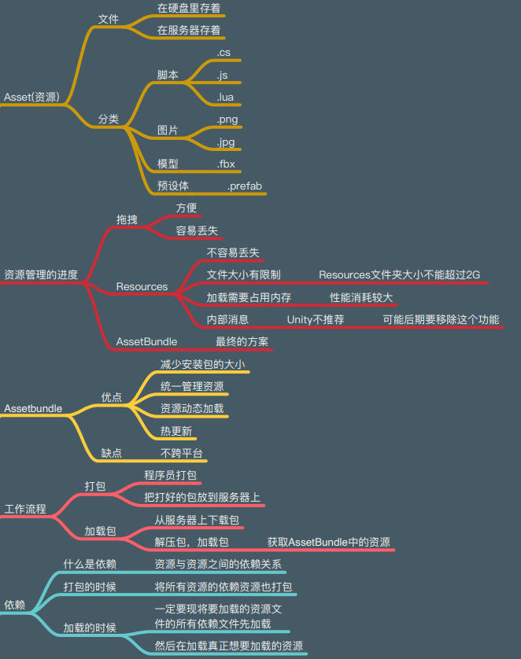 


#### AssetBundle作用

1、AssetBundle是一个压缩包包含模型、贴图、预制体、声音、甚至整个场景，可以在游戏运行的时候被加载； 

2、AssetBundle自身保存着互相的依赖关系； 

3、压缩包可以使用LZMA和LZ4压缩算法，减少包大小，更快的进行网络传输； 

4、把一些可以下载内容放在AssetBundle里面，可以减少安装包的大小；


#### AssetBundle三种压缩格式

AssetBundle 提供了三种压缩格式：

1. 不压缩（BuildAssetBundleOptions.UncompressedAssetBundle）：优点是需要加载资源时速度非常快，缺点是构建的 AssetBundle 资源文件会比较大。
2. LZMA压缩（BuildAssetBundleOptions.None）：unity中默认的压缩方式，优点是会将文件压缩的非常小，缺点是每次使用都需要将压缩的文件全部解压，非常耗费时间，可能会造成游戏的卡顿，不推荐在项目中使用。
3. **LZ4压缩**（BuildAssetBundleOptions.ChunkBasedCompression）：是LZMA和不压缩之间的折中方案，构建的 AssetBundle 资源文件会略大于 LZMA 压缩，但是在加载资源时不需要将所有的资源都加载下来，所以速度会比 LZMA 快。建议项目中使用它。


#### AB打包流程

1. 设置资源AssetBundle名称
2. BuildPipeline,BuildAssetBundles打包
3. 处理打包后的文件
4. Ab包依赖描述

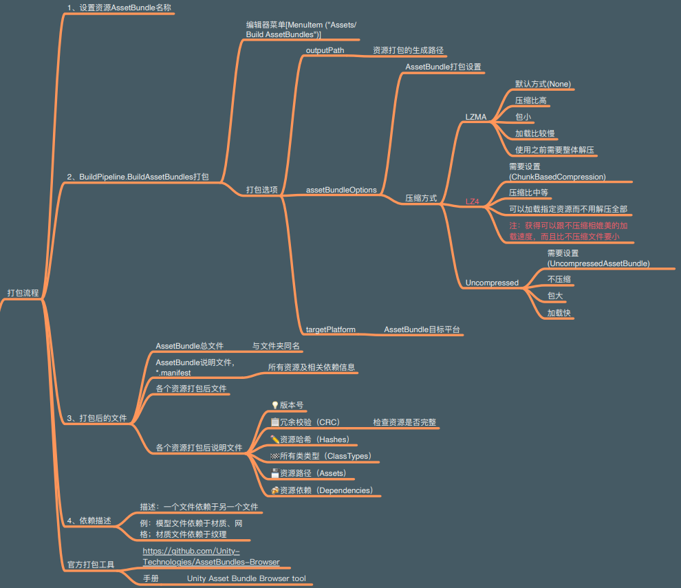


#### AB包具体使用方式


#### AssetBundle Browser


#####  1.官方提供的打包工具：AssetBundle Browser


下载官方提供的打包工具，两种下载方式：

1. git地址：[https://github.com/Unity-Technologies/AssetBundles-Browser](https://cloud.tencent.com/developer/tools/blog-entry?target=https%3A%2F%2Fgithub.com%2FUnity-Technologies%2FAssetBundles-Browser&source=article&objectId=2240554)
2. 在资源管理器中打开Packages的manifest.json文件，在"dependencies": {}中添加一行代码：“com.unity.assetbundlebrowser”: “1.7.0”,

下载之后导入Unity工程即可，如遇报错可以删掉Test文件夹即可。

打开方式：`Windows -> AssetBundle Browser` 启动打包除窗口。 

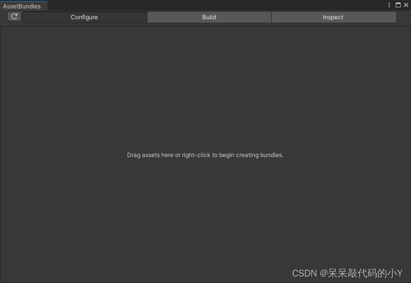 


##### 2 将对象保存为预制体并为预制体设置AB包信息

在场景中新建几个游戏对象做测试，将其拖到Resources下当做预制体。

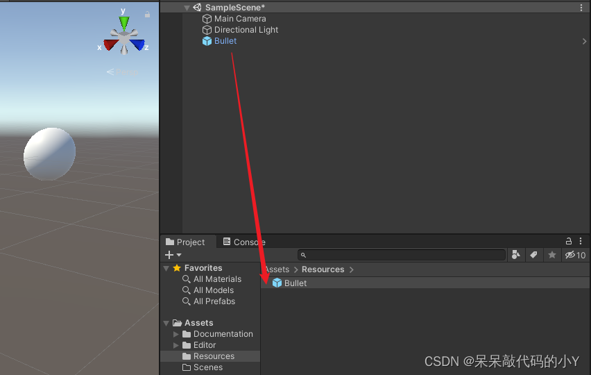 

然后在监视器面板中设置AB包的信息，选中该物体，在右下角设置AB包名称。

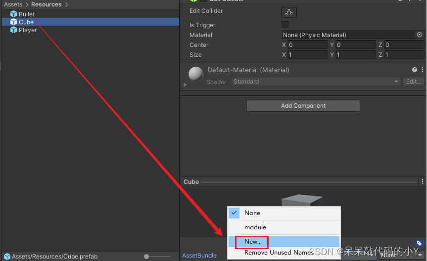

这样就可以在面板中看到我们设置的AB包信息了。设置的时候会根据AB包不同名称分别打到不同的包中。

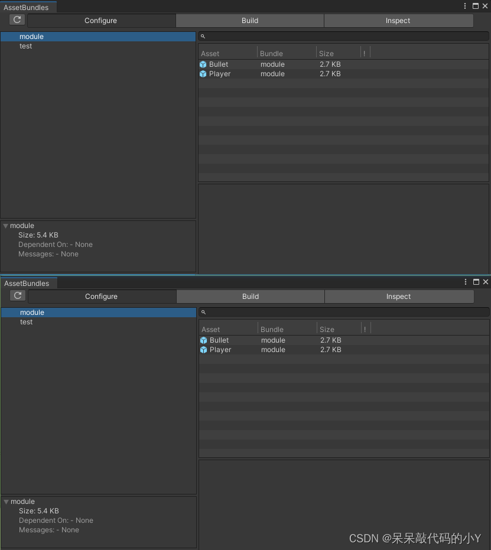


##### 3 执行打包方法

选择对应的平台及输出路径，然后根据情况选择其他配置。

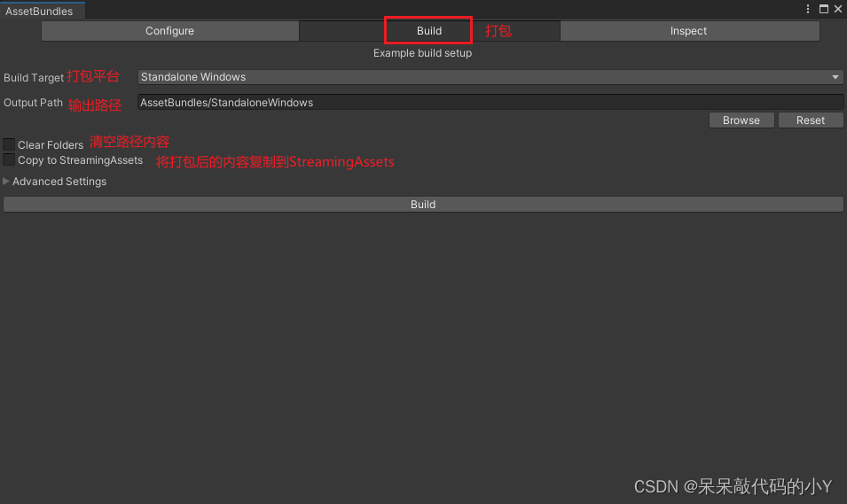

参数含义如下

- Build Target：打包平台选择
- Output Path ：文件输出路径
- Clear Folders：清空路径内容
- Copy to StreamingAssets：将打包后的内容复制到Assets/StreamingAssets文件夹下
- Advanced Settings
  - Exclude Type Infomation：在资源包中 不包含资源的类型信息
  - Force Rebuild：重新打包时需要重新构建包 和ClearFolder不同，他不会删除不再存在的包
  - Ignore Type Tree Changes：增量构建检查时，忽略类型数的修改
  - Apped Hash：将文件哈希值附加到资源包名上
  - Strict Mode：严格模式，如果打包报错了，则打包直接失败无法成功
  - Dry Run Build：运行时构建


点击Build后会执行打包方法，等待打包完成即可获得对应的AB包文件。

若是上面选择了 Copy to StreamingAssets，则会打包出来两份资源。 

 一个与Asset同级目录，另一个则是在Assets/StreamingAssets文件夹下。

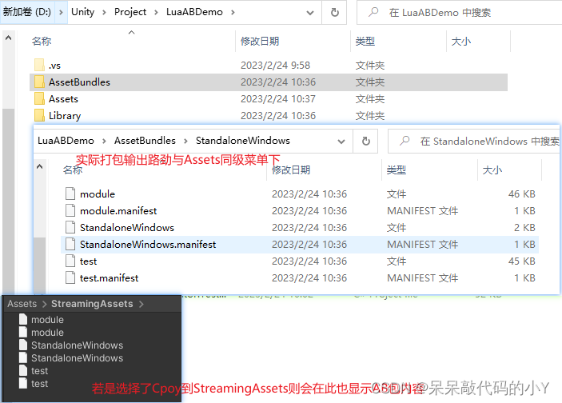

其中有一个主包文件和对应的AB包资源文件。

内容大致为以下几个部分：

- AB包文件：资源文件
- manifest文件：AB包文件信息（资源信息，依赖关系，版本信息等等）
- 关键AB包（与打包目录名相同的包）：主包文件，包含AB包依赖的关键信息

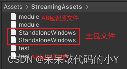 

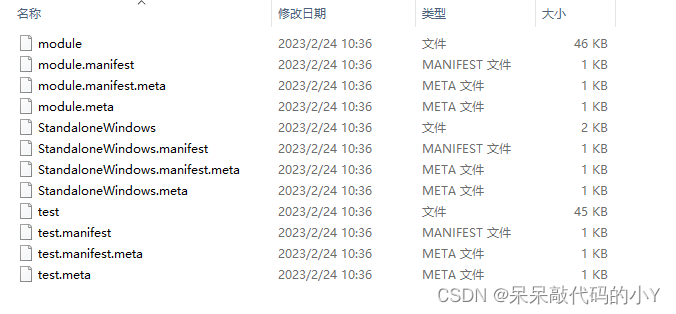 


##### 4 加载AB包，并使用其中的资源文件

上面已经讲到了打包AB包的方法，下面就是学习怎样加载我们打包好的AB包，并使用其中的资源。

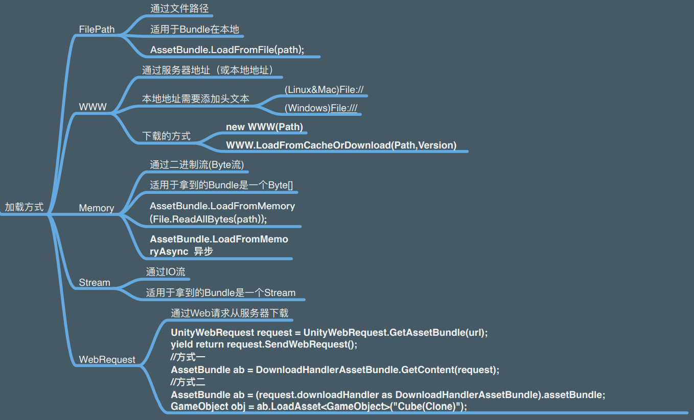

下面直接使用`LoadFromFile()`方法进行AB包的加载及使用，代码如下：

1.使用同步加载方法 LoadFromFile()

```javascript
using System.Collections;
using System.Collections.Generic;
using UnityEngine;
using UnityEngine.UI;

public class ABLoadDemo : MonoBehaviour
{
    public Button LoadAb_Btn;
    private string LoadPath;//AB包路径

    private void Awake()
    {
        LoadPath = Application.streamingAssetsPath;
        LoadAb_Btn.onClick.AddListener(LoadAB);
    }

    /// <summary>
    /// 同步加载
    /// </summary>
    private void LoadAB()
    {
        //第一步：加载AB包
        AssetBundle ab = AssetBundle.LoadFromFile(LoadPath + "/"+"module");
        //第二步：加载AB包中的资源
        //GameObject abGO = ab.LoadAsset<GameObject>("bullet");//方法一：使用LoadAsset<>泛型加载
        //GameObject abGO = ab.LoadAsset("bullet") as GameObject;//方法二：使用LoadAsset名字加载（不推荐，会出现同名不同类型的对象无法区分的问题）
        GameObject abGO = ab.LoadAsset("bullet", typeof(GameObject)) as GameObject;//方法三：使用LoadAsset(Type)指定类型加载
        Instantiate(abGO);
    }
}
```

2.使用异步加载方法 LoadFromFileAsync()，使用协程辅助异步加载。

```javascript
using System.Collections;
using System.Collections.Generic;
using UnityEngine;
using UnityEngine.UI;

public class ABLoadDemo : MonoBehaviour
{
    public Button LoadAbAsync_Btn;
    public Image image;//场景测试图片
    private string LoadPath;//AB包路径

    private void Awake()
    {
        LoadPath = Application.streamingAssetsPath;
        LoadAbAsync_Btn.onClick.AddListener(()=> 
        {
        	//启动协程完成异步加载
            StartCoroutine(LoadABAsync()); 
        });
    }
    /// <summary>
    /// 异步加载
    /// </summary>
    /// <returns></returns>
    IEnumerator LoadABAsync()
    {
    	//第一步：加载AB包
        AssetBundleCreateRequest abcr = AssetBundle.LoadFromFileAsync(LoadPath + "/" + "test");
        yield return abcr;
        //第二步：加载AB包中的资源
        AssetBundleRequest abr = abcr.assetBundle.LoadAssetAsync("head",typeof(Sprite));
        yield return abr;
        image.sprite = abr.asset as Sprite;
        Debug.Log("加载AB包赋值图片完成");
    }
}
```

**同步加载实例化一个球体** 和 **异步加载一张图片赋值给Image组件** 的示例如下：

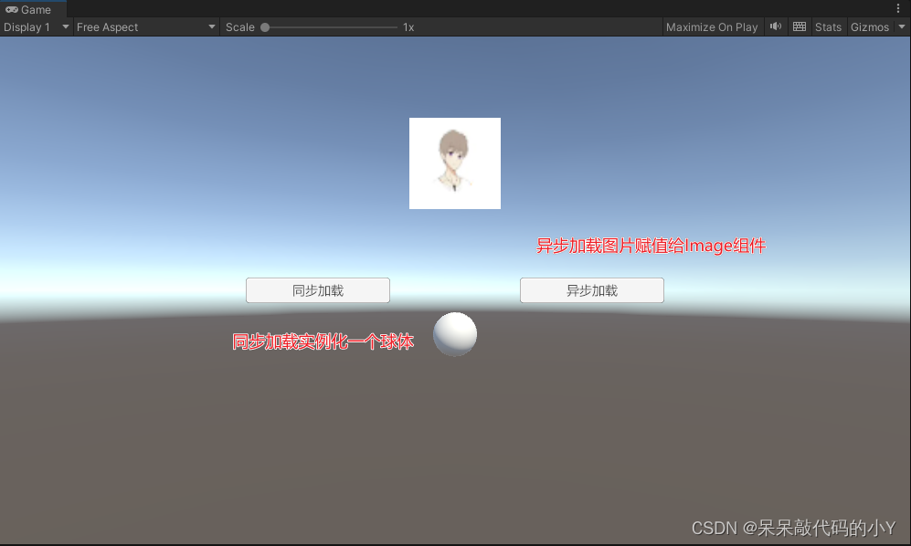

这样我们就学会最基本的Ab包加载和使用其中资源的方法了。

其中有个点需要注意：

 同一AB包不能重复加载多次，否则会报错（卸载后可重新加载） 

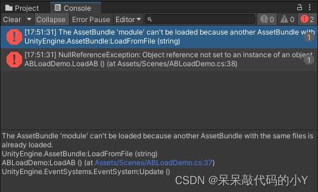 

AB包卸载方式如下：

```javascript
AssetBundle ab = AssetBundle.LoadFromFile(LoadPath + "/"+"module");

//卸载所有AB包资源。若参数为true表示将所有使用该AB包中的资源全部卸载，反之则不会
AssetBundle.UnloadAllAssetBundles(false);

//卸载某个指定AB包的方法。若参数为true表示将会把使用该AB包的场景资源也全部卸载，反之则不会
ab.Unload(false);
```

下面是几种常用的AB包加载方式，简单记录一下：

1. 异步加载：AssetBundle.LoadFromMemoryAsync 从内存区域异步创建 AssetBundle。

```
 /// <summary>
    /// 从本地异步加载AssetBundle资源，Path是AB包路径+AB包名称
    /// </summary>
    /// <param name="path">路径</param>
    /// <returns></returns>
    IEnumerator LoadFromMemoryAsync(string path)
    {
        AssetBundleCreateRequest createRequest = AssetBundle.LoadFromMemoryAsync(File.ReadAllBytes(path));
        yield return createRequest;
        AssetBundle bundle = createRequest.assetBundle;
        var prefab = bundle.LoadAsset<GameObject>("bullet");
        Instantiate(prefab);
    }
```

1. 同步加载，将等待 AssetBundle 对象创建完毕才返回。 AssetBundle.LoadFromMemory AssetBundle.LoadFromMemory由AssetBundle.LoadFromMemoryAsync变化而来，与 LoadFromMemoryAsync 相比，该版本是同步的，将等待 AssetBundle 对象创建完毕才返回。

```
AssetBundle bundle = AssetBundle.LoadFromMemory(File.ReadAllBytes(ABPath));
        var prefab = bundle.LoadAsset<GameObject>("bullet");
        Instantiate(prefab);
```

1. 同步加载AssetBundle.LoadFromFile 从磁盘上的文件同步加载 AssetBundle。 该函数支持任意压缩类型的捆绑包。 如果是 lzma 压缩，则将数据解压缩到内存。可以从磁盘直接读取未压缩和使用块压缩的捆绑包。

与 LoadFromFileAsync 相比，该版本是同步的，将等待 AssetBundle 对象创建完毕才返回。 这是加载 AssetBundle 的最快方法。

```
/// <summary>
/// 从磁盘上的文件同步加载 AssetBundle。
/// </summary>
void LoadFromFile()
{
    AssetBundle ab = AssetBundle.LoadFromFile(Application.dataPath + "/StreamingAssets/"+ assetBundle);
    var go = ab.LoadAsset<GameObject>("ZAY");
    Instantiate(go);
}
```

1. 异步加载：AssetBundle.LoadFromFileAsync LoadFromFileAsync AssetBundle 的异步创建请求。加载后使用 assetBundle 属性获取 AssetBundle。 从磁盘上的文件异步加载 AssetBundle。

该函数支持任意压缩类型的捆绑包。 如果是 lzma 压缩，则将数据解压缩到内存。可以从磁盘直接读取未压缩和使用块压缩的捆绑包。

```
IEnumerator LoadFromFileASync(string path)
    {
        AssetBundleCreateRequest createRequest = AssetBundle.LoadFromFileAsync(path);
        yield return createRequest;
        AssetBundle bundle = createRequest.assetBundle;
        if (bundle == null)
        {
            Debug.Log("Failed to load AssetBundle!");
            yield break;
        }
        var parefab = bundle.LoadAsset<GameObject>("bullet");
        Instantiate(parefab);
    }
```


1. UnityWebRequestAssetBundle 和 DownloadHandlerAssetBundle UnityWebRequestAssetBundle 此方法将 DownloadHandlerAssetBundle 附加到 UnityWebRequest。

DownloadHandlerAssetBundle.GetContent(UnityWebRequest) 作为参数。GetContent 方法将返回你的 AssetBundle 对象。

```javascript
   IEnumerator WEB(string url)
    {
        UnityWebRequest request = UnityWebRequestAssetBundle.GetAssetBundle(url, 3, 0);
        //此方法将返回 WebRequestAsyncOperation 对象。在协程内部生成 WebRequestAsyncOperation 将导致协程暂停，
        //直到 UnityWebRequest 遇到系统错误或结束通信为止。
        yield return request.SendWebRequest();
        //如果加载失败
        if (request.result != UnityWebRequest.Result.Success)
        {
            Debug.Log(request.error);
            yield break;
        }
        //返回下载的 AssetBundle 或 null。
        AssetBundle bundle = DownloadHandlerAssetBundle.GetContent(request);
        var parefab = bundle.LoadAsset<GameObject>("ZAY");
        Instantiate(parefab);
    }
```


##### 5 AB包的加载流程

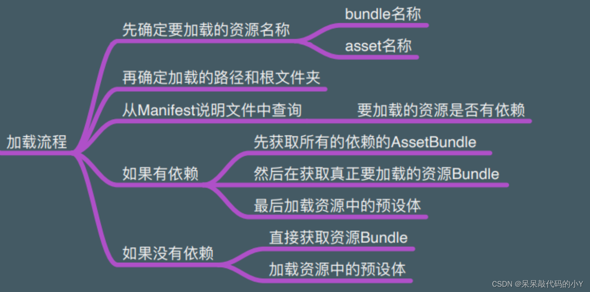


#### AssetBundle依赖关系

  上面讲了一下基本的 AssetBundle打包 和 加载 的方法。 

 在加载流程中也提到了依赖关系，下面就来讲一下**AssetBundle的依赖关系**，所谓依赖关系就是指某个AB包中的某个资源可能是依赖于另外一个AB包的。

比如我们打包的时候，一个AB包中的内容全是模型，而另外一个AB包中的资源都是材质，此时模型AB包中就可能需要使用到材质AB包中的资源，此时两个AB包就存在依赖关系。

下面用一个例子看一下具体效果： 首先新建一个Material材质球，改为黄色并将其赋给Player对象。

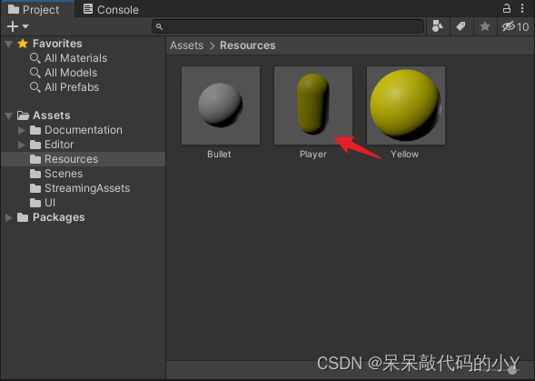 

Player对象是勾选了AB包的，我们现在重新使用Build打包看一下AB包情况。

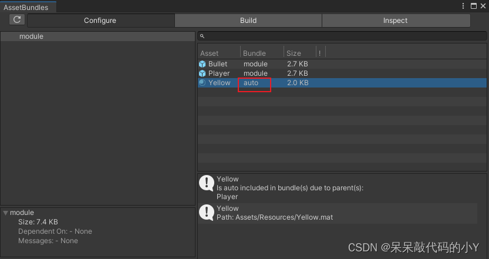

可以看到这个材质也被自动打包进了AB包中，而且Budle名是默认设置的auto。 在包中的一个资源如果使用了另外一个资源，那么打包的时候会把另外一个资源也默认打包进该包中。 此时我们可以手动修改该材质的AB包名称，然后重新打包一下。

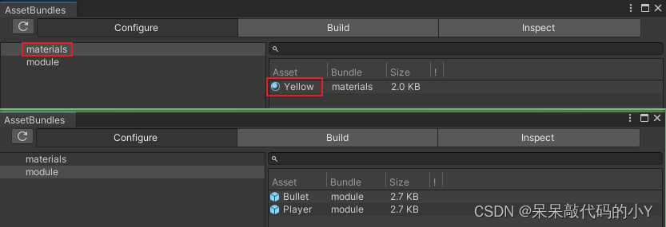

此时我们再去加载AB包module获取Player对象试一下效果：

```javascript
		//加载AB包
        AssetBundle ab = AssetBundle.LoadFromFile(LoadPath + "/"+"module");
        //加载AB包中的资源
        GameObject abGO = ab.LoadAsset("player", typeof(GameObject)) as GameObject;
        //实例化对象
        Instantiate(abGO);
```

可以看到游戏对象被加载出来了，但是材质发生了丢失。 

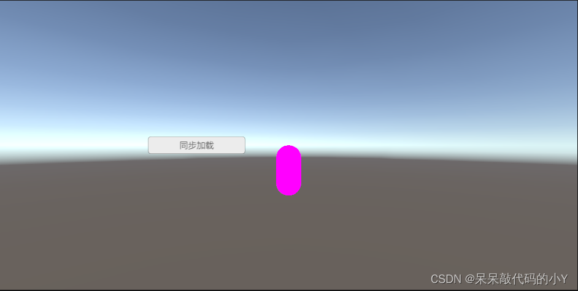

原因就是因为该AB包module中的Player对象使用到了materials包中的材质球资源，但是我们没有加载materials包。所以出现了材质丢失。 这就是说module包中有资源对象依赖对materials包中的资源，所以他们存在AB包依赖关系。

出现这种有依赖关系的情况时，如果只加载自己的AB包，那么通过它创建的对象就会出现资源丢失的情况(比如上方的材质丢失等)，此时就需要将依赖包一起进行加载，才能保证材质不丢失。

比如上方加载module包的代码多加一行，如下所示：

```javascript
		//加载AB包
        AssetBundle ab = AssetBundle.LoadFromFile(LoadPath + "/"+"module");
        //加载依赖包
        AssetBundle abMaterials = AssetBundle.LoadFromFile(LoadPath + "/" + "materials");
        //加载AB包中的资源
        GameObject abGO = ab.LoadAsset("player", typeof(GameObject)) as GameObject;
        //实例化对象
        Instantiate(abGO);
```

此时运行项目就会发现，一切正常了，模型和材质都是正常显示了。 


但问题是如果此时我们打包了很多的AB包，并且各个AB包中的依赖关系比较复杂时，我们就没办法上面那样根据依赖包的名称手动加载了。

此时我们就可以打开AB包中的主包的manifest文件查看具体的依赖关系： 

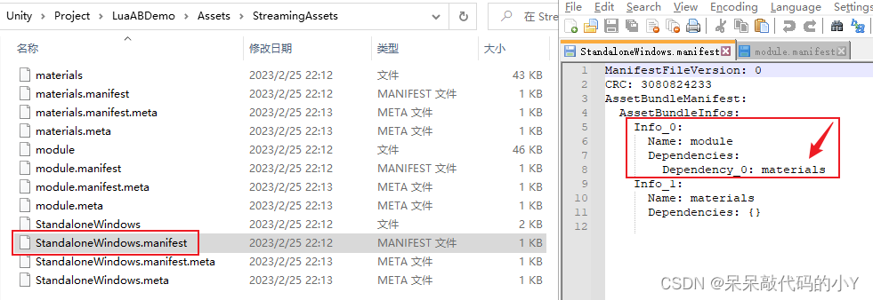

 可以看到manifest中有标志说 资源包info_0(module包) 对 Info_1(materials包)有依赖关系。

所以说我们在代码中就可以使用主包的manifest文件来对每个AB包的依赖包进行加载。 所以代码可以更改为如下所示：

```
        //加载AB包
        AssetBundle ab = AssetBundle.LoadFromFile(LoadPath + "/"+"module");
        //加载主包
        AssetBundle abMain = AssetBundle.LoadFromFile(LoadPath + "/" + "StandaloneWindows");
        //加载主包中的固定文件
        AssetBundleManifest abManifest = abMain.LoadAsset<AssetBundleManifest>("AssetBundleManifest");
        //从固定文件中得到依赖信息
        string[] strs = abManifest.GetAllDependencies("module");
        //得到依赖包的名字并加载
        foreach (var s in strs)
        {
            Debug.Log("依赖包："+s);
            AssetBundle.LoadFromFile(LoadPath + "/" + s);
        }
        //加载AB包中的资源 实例化对象 卸载所有AB包资源
        GameObject abGO = ab.LoadAsset("player", typeof(GameObject)) as GameObject;
        Instantiate(abGO);
        AssetBundle.UnloadAllAssetBundles(false);
```

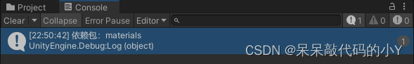 

此处注意点：在manifest文件中只能看到某个AB包依赖于哪些其他AB包，并不能看到某个AB包中资源依赖于哪个AB包中的具体资源。


#### AssetBundle分组策略

上面提到了AssetBundle的依赖关系，那么就不得不提一下AssetBundle的分组策略啦。

我们现在已经知道不同的AB包之间可能会存在各种依赖关系，那么此时对AB包的分组就显得尤为重要了。 不然的话等到项目资源越来越多、各个AB间的依赖关系越来越复杂时，足够让开发者们搞的头皮发麻。

分组策略可根据自己的项目规划进行划分，一般有下面几种分组参考：

**逻辑实体分组** 

a,一个UI界面或者所有UI界面一个包（这个界面里面的贴图和布局信息一个包） 

b,一个角色或者所有角色一个包（这个角色里面的模型和动画一个包） 

c,所有的场景所共享的部分一个包（包括贴图和模型）

**按照类型分组** 所有声音资源打成一个包，所有shader打成一个包，所有模型打成一个包，所有材质打成一个包

**按照使用类型分组** 把在某一时间内使用的所有资源打成一个包。可以按照关卡分，一个关卡所需要的所有资源包括角色、贴图、声音等打成一个包。也可以按照场景分，一个场景所需要的资源一个包

**按更新频率分组** 不经常更新的放在一个包，经常更新的放在一个包分别管理。

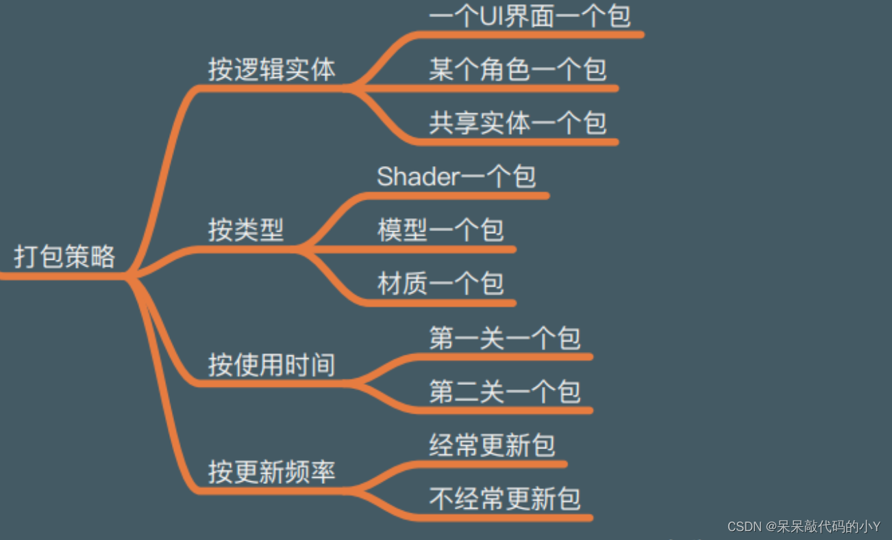


### 参考文献

[Unity 热更新技术 | （一） 热更新的基本概念原理及主流热更新方案介绍-腾讯云开发者社区-腾讯云 (tencent.com)](https://cloud.tencent.com/developer/article/2239496)

[Unity 热更新技术 | （二） AssetBundle - 完整系列教程学习-腾讯云开发者社区-腾讯云 (tencent.com)](https://cloud.tencent.com/developer/article/2240554)


## 本项目的资源热更


### 概要

这里使用了现成的框架--yooAsset，只学到了一点理论知识。

通过对比双端的资源清单来进行增量更新，少补多删。


### 简要操作步骤

1.资源服务器（网站）我们使用宝塔面板

http https


2.我们使用**yooAsset**资源热更框架，进行资源的加载

https://www.yooasset.com/

  

3.我们从资源服务器下载的热更文件放到了yoo文件夹下，yoo存放是联网下载的缓冲包。

若在游戏打包出来到MMO-Client-Release，该目录在MMO-Client-Release/MMOGame_Data/yoo

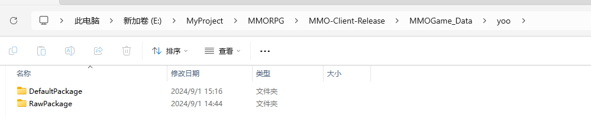


### 注意

在编辑器运行时，yoo插件好像build时好像不会将资源更新进来，需要资源服务器。


## 本项目的代码热更


### HybridCLR原理


**IL2CPP技术原理和AOT**

[unity杂谈-unity 怎么编译c#？]


**Hybrid热更新原理**

 

**hybridclr热更新，它是针对IL2CPP VM。**

相对于其他热更技术：Lua内置Lua虚拟机 + lua代码；ILRuntime方案：内置C#虚拟机+解释执行ILRuntime

内置虚拟机：自己解释执行的一个运行环境，无法直接继承MonoBehaviour(IL2CPP级别的数据对象)，需要封装一层。

这就会导致：跨域访问，接口导出这些问题，需要开发者自己来处理，比较麻烦，不符合我们标准的Unity开发。

**hybridclr到底做了什么？**

IL2CPP runtime环境(IL2CPP VM)编写了一个解释器，解释执行IL代码指令 + 使用的是AOT的数据内存对象。

c/c++角度：数据内存+代码逻辑指令(二进制机器指令)

hybridclr角度：数据内存+代码逻辑指令(二进制机器指令) + **IL代码指令解释执行**

就是扩展了解释执行的功能。


那么在热更项目里面，我们可以随意地继承使用我们的GameObject,MonoBehaviour;

数据对象都是AOT的，在AOT编译的时候，把热更项目的类型编译进去就可以了，

解释执行IL new GameObjct ---> new AOT的GameObjcet对象。


将热更文件转换为IL.dll,在运行的时候，我们的hybridclr就会加载IL.dll来解释执行了。

**没懂。。。。。**


**为什么Hybrid性能高？**

1.直接使用我们AOT项目的内存对象，内存占用，跨域都没有什么问题，内存占用少？

2.不需要改变上层的开发习惯，内置一个虚拟机，搞一个热更项目。

3.热更项目例如：Lua，ILRuntime 热更新1.0~2.0 都是解释执行的，

​	华佗1.0 可以解释执行，2.0时配置一个apk，可以直接aot执行，新版本可以获得更好的性能

4.开发方式：使用普通的unity开发模式就可以了。


**环境搭建和测试**

看官方吧


### 插件

**1.这里我们使用HybridCLR**

客户端内置c#解释器，把dll当作资源下载，客户端解释执行

[介绍 | HybridCLR (code-philosophy.com)](https://hybridclr.doc.code-philosophy.com/docs/intro)

- 支持2019.4.x、2020.3.x、2021.3.x、2022.3.x全系列LTS版本。`2023.2.0ax`版本也已支持，但未对外发布。
- 支持所有il2cpp支持的平台

案例演示

[快速上手 | HybridCLR (code-philosophy.com)](https://hybridclr.doc.code-philosophy.com/docs/beginner/quickstart)


**2.添加BetterStreammingAssets组件，可以更方便的读取**

https://gitee.com/HellGame/BetterStreamingAssets.git


### 核心代码分析

1.LoadDll:加载全部的dll到我们的vm中


 


### 程序集划分


**程序集划分方案A：**

项目核心框架.dll

第三方包.dll 

自定义游戏逻辑.dll

基础包(首包=Assembly-c#)


**程序集划分方案B：**

Assembly-CSharp.dll （项目默认程序集）

**基础包（Main程序集）**,我们打包场景的时候只需要打Main包即可

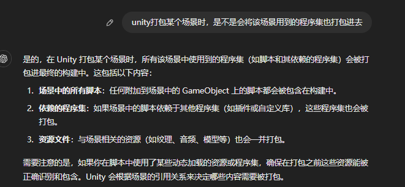 


**这里我们使用方案b，因为一开始没有先做热更新，所以现在修改起来十分麻烦**


MMOGame\HybridCLRData\HotUpdateDlls\StandaloneWindows64

**HybridCLRData**就是一个临时目录

**StandaloneWindows64**这里面存放着我们所以代码生成的dll文件


### 首包资源定制

玩家下载的游戏安装包我们称为首包，

首包如果携带补丁资源，那么玩家就可以直接进入游戏。

首包内置补丁：

```
/StreamingAssets/yoo/包名/补丁
```

项目启动时会检查这个目录是否存在对应补丁。

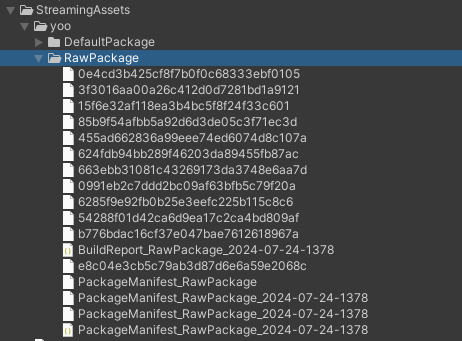 

项目打包这些东西就跟着了。


### 代码变更测试热更新

1.生成dll

 

构建资源并且复杂到StreamingAssets目录

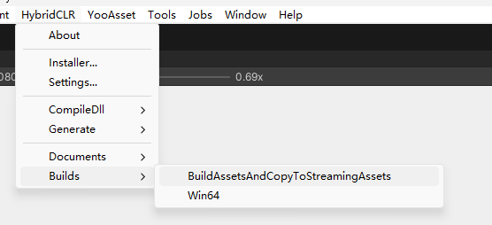 

将生成的dll文件放到 yoo指定的资源目录，准备打包发布。

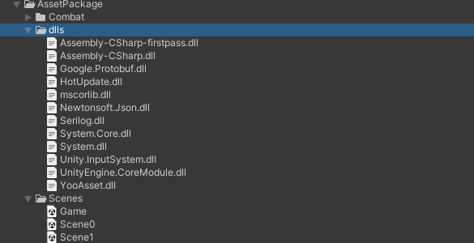 

然后使用yoo进行打包发布

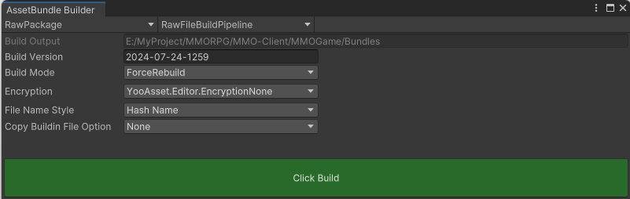 


### BUG：平台不被支持的问题

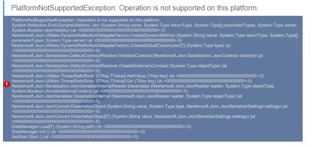 

Newtonsoft.Json不支持IL2CPP 环境

换一个适配unity的即可。

[com.unity.nuget.newtonsoft-json@3.2.1.zip官方版下载丨最新版下载丨绿色版下载丨APP下载-123云盘 (123pan.com)](https://www.123pan.com/s/HNyA-68g4.html)

放到Library\PackageCache下面

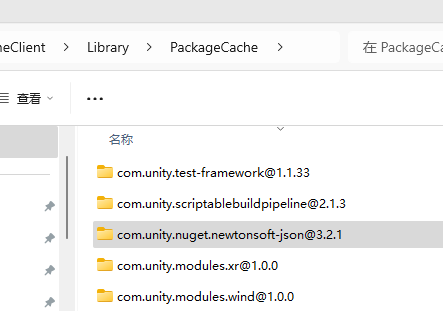 


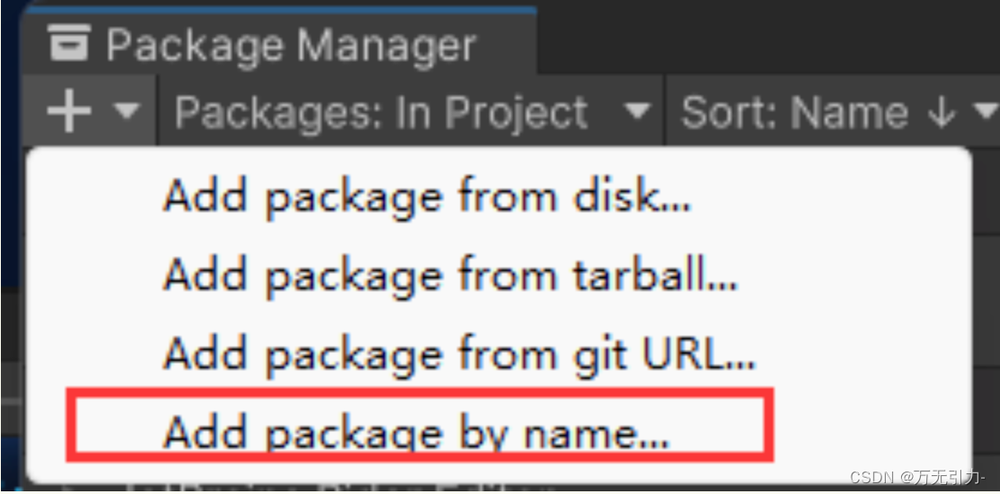 

com.unity.nuget.newtonsoft-json


### 多平台资源适配

```
private string GetHostServerURL()
{
    string hostServer = "http://.../mmo";
    if (Application.platform == RuntimePlatform.Android)
        return $"{hostServer}/Android";
    else if (Application.platform == RuntimePlatform.IPhonePlayer)
        return $"{hostServer}/IPhone";
    else if (Application.platform == RuntimePlatform.WebGLPlayer)
        return $"{hostServer}/WebGL";
    else //Windows、MacOS、Linux
        return $"{hostServer}/PC";
}
```


### **安卓环境注意事项**

出现代码被裁切的问题：

```
Could not produce class with ID 137.
This could be caused by a class being stripped from the build even though it is needed. Try disabling 'Strip Engine Code' in Player Settings.
```

 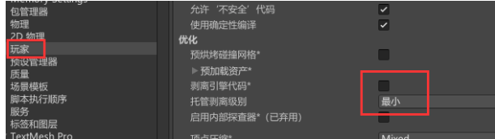

出现无访问权限的问题：

```
CollisionMeshData couldn't be created because the mesh has been 

marked as non-accessible. Mesh asset path "" Mesh name "Plane017"
```

勾线读写权限即可

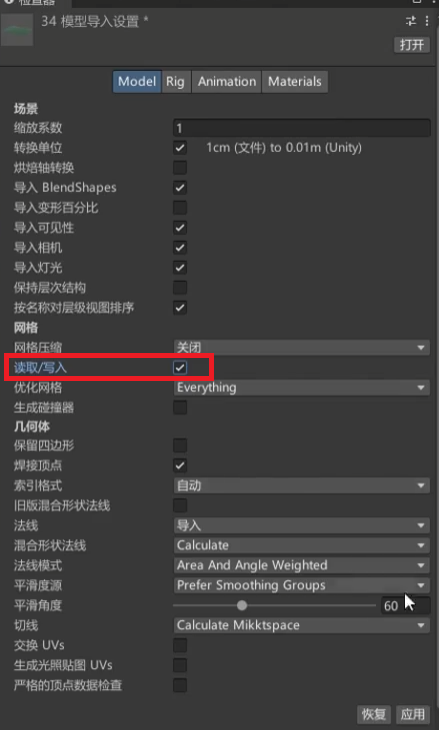 


Animancer Lite不支持运行时，需要专业版，自己找吧。

```
Animancer Pro-Only Feature Used: Animator Controllers (https://kybernetik.com.au/animancer/docs/manual/animator-controllers). Animancer Lite allows you to try out this feature in the Unity Editor, but using it in runtime builds requires Animancer Pro: https://kybernetik.com.au/animancer/pro
UnityEngine.Debug:LogError(Object, Object)
Animancer.AnimancerPlayable:PrepareFrame(Playable, FrameData)
```


建议允许“不安全代码”

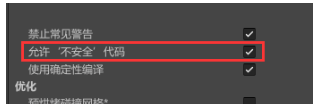  


```
    static IEnumerator RunLoad(string sceneName, OnSceneLoaded action)
    {
#if UNITY_EDITOR
        var scenePath = $"Assets/AssetPackage/Scenes/{sceneName}.unity";
        LoadSceneParameters parameters = new LoadSceneParameters() { loadSceneMode = LoadSceneMode.Single, localPhysicsMode = LocalPhysicsMode.None };
        AsyncOperation asyncOperation = UnityEditor.SceneManagement.EditorSceneManager.LoadSceneAsyncInPlayMode(scenePath, parameters);
        Scene loadedScene = UnityEditor.SceneManagement.EditorSceneManager.LoadSceneInPlayMode(scenePath, parameters);
        Debug.Log($"===>Loaded scene: {loadedScene.name}");
        Progress = 1;
        action?.Invoke(loadedScene);
        Kaiyun.Event.FireOut("SceneCompleted", loadedScene);

#else

        var package = YooAssets.GetPackage("DefaultPackage");
        string location = sceneName;
        var sceneMode = LoadSceneMode.Single;
        bool suspendLoad = false;
        Progress = 0;
        var handle = package.LoadSceneAsync(location, sceneMode, suspendLoad);
        yield return handle;
        yield return WaitForSceneLoaded(handle);
        Progress = 1;
        Debug.Log($"Scene name is {handle.SceneObject.name}");
        action?.Invoke(handle.SceneObject);
        Kaiyun.Event.FireOut("SceneCompleted", handle.SceneObject);
#endif
        yield break;
    }
```


### 其他注意事项

1.plugins目录和main目录的代码发生改变时需要重新发布程序，基础目录不能热更新


# 通用UI


## 基础知识

我们每一个ui控件它本质上还是一个游戏物体


### Rect Transform

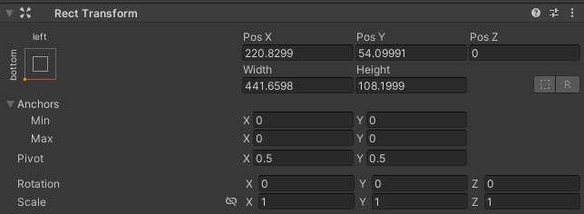 


#### Anchors(锚点)

关于Anchor锚点可能接触过UI的朋友都了解一些，但是Unity中Anchor应该称它为**锚框**更为合理，因为它是由两个锚点(Min，Max)组成的一个矩形，当然也可以组成一个点（两个点重合）

实际锚点就是一个**可自行设置的固定点**，控件到这个锚点的距离是永恒不变的，不会因为分辨率变化而变化，比如，**一个按钮在右上角，设置好锚点，这个按钮就永远在右上角，无论什么分辨率的屏幕，这样，我们就实现了自适应屏幕分辨率的UI**。

首先，我们要明白，一个UI物体的**锚点是相对于父物体来说的**，如果没有父物体，那就是相对于整个Canvas画布来说的, 此时Canvas就是父物体。

RectTransform提供了我们足够的自由去更改UI的锚点位置和中心点的位置。但是万变不离其宗：**anchoredPosition3D核心概念：中心点相对锚点的位置**。


锚框：而Unity为了方便我们调整锚框，在编辑视图给出了锚框的标示，如下图：

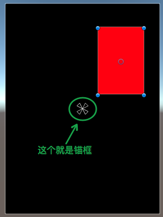 

​				锚框标示(重合情况)


当然上图是两个锚点重合的情况，所以看上去是一个点，下面我们利用两个锚点不重合的情况来说明一下：

 


我们用官网一组图片可以很形象的描述锚点的作用：

 **锚点全在中间的情况:**

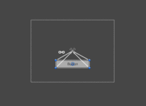 


**锚点全在右下角的情况:**   

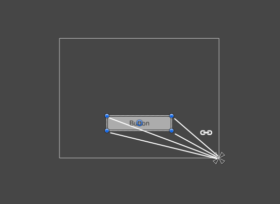  


 **锚点在两个角的情况:**            

  


**锚点分开的情况:**                                  

  


尽管锚点是附加在父类上的，但其并不是父类空间，父类空间指的是以其中心点为原点，而此处指的是以锚点为原点。


锚点的四个点分别为：

MinX: 相对于父物体左边框的比例：   		子物体的锚框距离父物体左锚边框的距离

MaxX: 相对于父物体右边框的**比例**																						

MinY: 相对于父物体下边框的**比例**               子物体的锚框距离父物体下点边框的距离

MaxY: 相对于父物体上边框的**比例**

这四个值决定了四个锚点的位置，而**四个锚点的位置决定了四个顶点的位置**。

总结：由此可以看到，不管什么情况，button的四个顶点到相应锚点的相对位置是不变的，并且，当四个锚点在一起和不在一起时RectTransform可调整的属性会有变化，

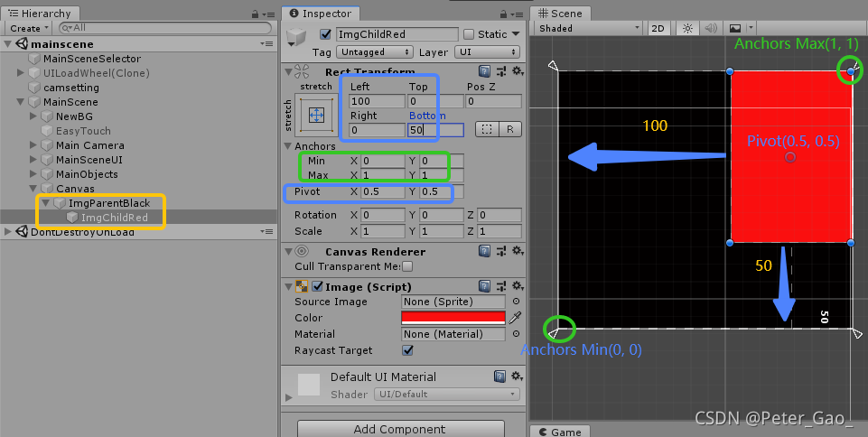 

 当拖动缩放黑色父物体时，红色子物体仍保持与父体的相对边距（100，50）不变

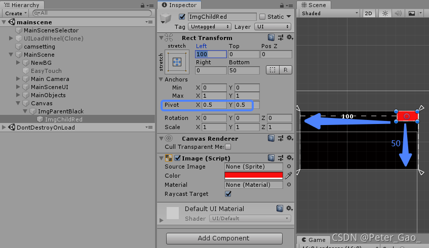 

当4个锚点都在一起的时候，RectTransform会显示Pos X，Pos Y，Width，Height四个属性可供修改，其中PosX，PosY就是子物体的中心点（轴点）相对于锚点的位置。

例如：如果子物体的4个锚点都在父物体的中心，且子物体的中心点（轴点）就在其几何中心点，这时如果子物体在父物体的中间，那么PosX，PosY就都是0。

 


#### **Pivot**

(UI的中心点，称为轴点)：

UI元素的旋转和缩放是围绕pivot进行的。轴点是Rect的实际中心点，是属于Rect自身的，和Rect尺寸中心点不同。尺寸中心点是以宽，高取1/2得到，即几何中心点。而轴点是可以任意指定的，如果将Rect旋转，可以看到Rect是围绕轴点旋转，而不是几何中心点。Pivot的范围也是[0,1]的比例值。Pivot默认值为(0.5, 0.5)，即物体的几何中心。

在黑框大小和位置变化的时候，Unity会保证红框的左下角到锚框的左下角距离不变，同时红框的右上角到锚框的右上角距离不变，来确定红框的相对位置和大小，看下图来感受一下变化：

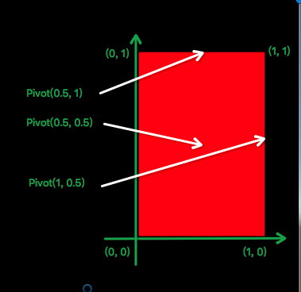 

设置Pivot的坐标系如上图，(0.0)表示红框物体的左下角的点，(1.1)表示红框物体的右上角的点


### Canvas

画布其实就相当于我们的屏幕，在画布上添加东西的时候就相当于在我们屏幕上添加东西。

当我们在场景中添加一个canvas的时候，它也会创建一共对应的**event system（事件系统）**

事件系统是用来处理我们之后在画布上添加的各种空间的事件，比如说点击事件，鼠标滑动的事件。 

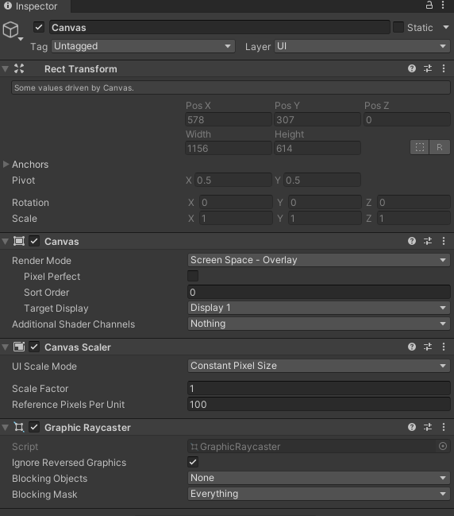 


#### **1.Canvas**


##### Render Mode:

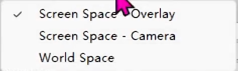 

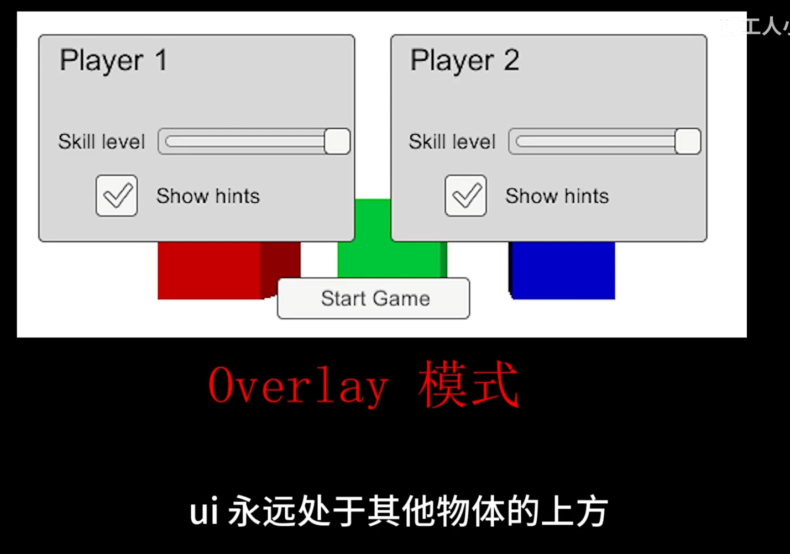 

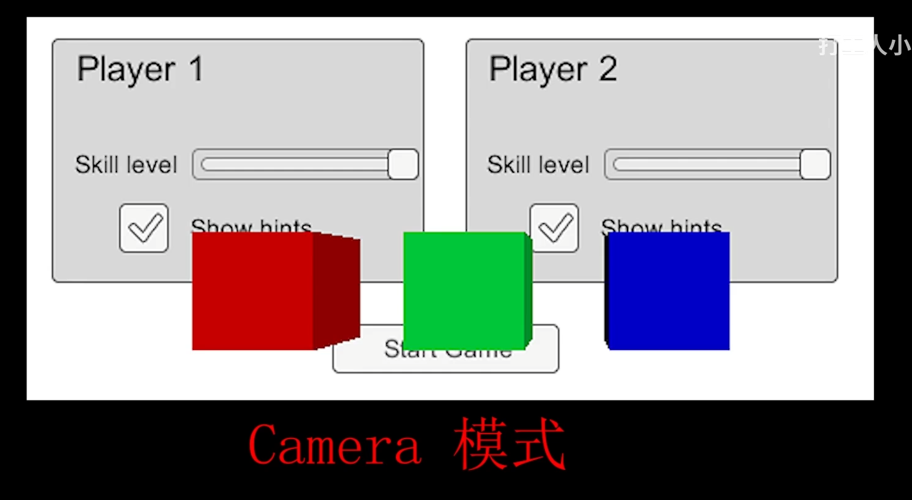 

ui元素讲绘制在指定相机下，通常用于在3d场景中嵌入2d的ui元素

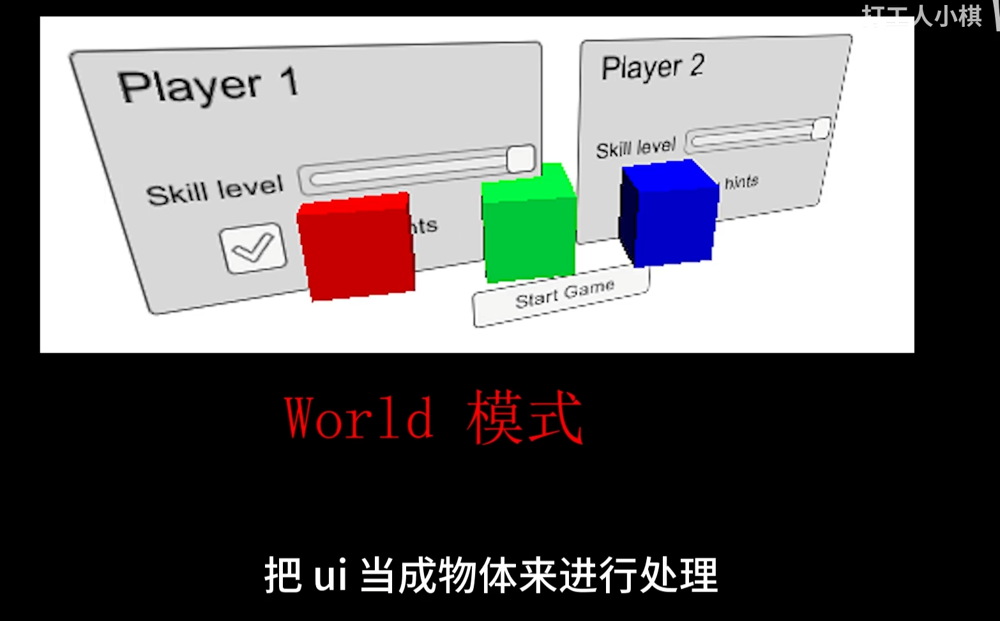 


##### **Pixel Perfect：**

勾选后可以让画布上的显示更加清晰，同时也会耗费更多的性能。

##### SortOrder ：

选择当前画布的优先级，数值越大优先级越高。应用于当前场景中有多个canvas


#### **2.Canvas Scaler**

Unity 中的 Canvas Scaler 组件是用于调整 Canvas（画布）上 UI 元素的缩放和适应性的工具。Canvas Scaler 主要用于确保 UI 元素在不同屏幕分辨率和设备上都能够正确显示，以保持用户界面的一致性和可用性。以下是 Canvas Scaler 组件的一些重要属性和介绍：

1. **UI Scale Mode (UI 缩放模式)**:
   - Canvas Scaler 提供了三种不同的 UI 缩放模式：
     - **Constant Pixel Size**：UI 元素的大小以像素为单位保持不变。这意味着在不同分辨率下，UI 元素的实际物理大小可能会改变。
     - **Scale with Screen Size**：UI 元素的大小根据屏幕的大小进行缩放。你可以指定一个参考分辨率，UI 元素将按比例缩放以适应不同的分辨率。
     - **Constant Physical Size**：UI 元素的实际物理大小保持不变。这意味着在不同分辨率下，UI 元素的像素数量会发生变化。
2. **Reference Resolution (参考分辨率)**:
   - 仅在 UI Scale Mode 设置为 "Scale with Screen Size" 时才可用。你可以指定一个参考分辨率，Canvas Scaler 将根据这个分辨率来缩放 UI 元素。
3. **Screen Match Mode (屏幕匹配模式)**:
   - 仅在 UI Scale Mode 设置为 "Scale with Screen Size" 时才可用。这个选项允许你选择如何匹配不同分辨率的屏幕。有两个选项：
     - **Match Width or Height**：根据屏幕的宽度或高度来调整 UI 缩放。这意味着 UI 元素将根据屏幕的宽度或高度中较小的那个维度来进行缩放。
     - **Expand**：扩展 UI 元素以填充整个屏幕，但可能会导致 UI 元素在某些方向上被裁剪。
4. **Screen Width (屏幕宽度) 和 Screen Height (屏幕高度)**:
   - 仅在 Screen Match Mode 设置为 "Match Width or Height" 时才可用。你可以设置屏幕宽度和屏幕高度的比例，以确定 UI 元素缩放的依据。
5. **Match (匹配)**:
   - 用于设置屏幕匹配模式的参数，包括屏幕宽度和屏幕高度。

Canvas Scaler 组件的主要目标是确保游戏的用户界面在不同屏幕分辨率和设备上都能够适应，并保持良好的可读性和可用性。通过使用 Canvas Scaler，你可以创建适应各种屏幕的响应式 UI，提供更好的用户体验。

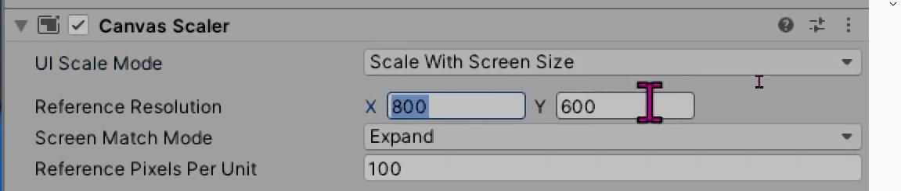


#### **3.Graphic Raycaster**

用于检测ui元素是否被点击或者触摸。

当鼠标触摸屏幕时，这个组件会向场景中的ui元素发射一条射线，来确定被点击或被触摸的元素是哪一个

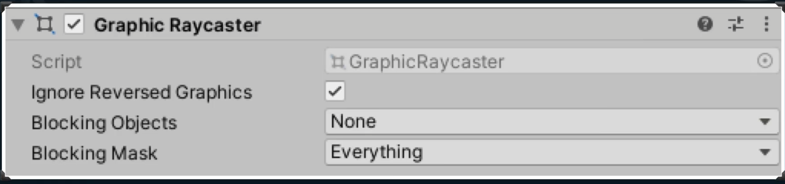

第一个参数：用于控制算法忽略逆向图形，就是摄像机在ui背面的时候不进行渲染

第二个参数：如果摄像机和ui中间有物体挡住了，我们的射线就有可能被挡住，这个参数就是用来忽略某些物体拦截射线

第三个参数：和第二个差不多


#### 4.React Transform

在我们ui所有的控件包括Canvas，它跟其他物体不同的点在于它拥有一个**React Transform**

这个本质上也是一个transform，多了一些 自身的宽度和高度


#### 5.Canvas Group

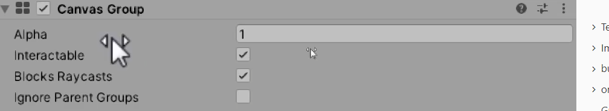

在Unity中，Canvas Group组件是用于控制UI元素的可见性和交互性的组件。

Canvas Group组件的主要功能包括：

- `Alpha`属性：控制UI元素的透明度，取值范围为0到1，0表示完全透明，1表示完全不透明。
- `Interactable`属性：控制UI元素是否可交互，可设置为true或false。
- `Blocks Raycasts`属性：控制UI元素是否会阻挡射线的碰撞检测，可设置为true或false。如果设置了，被我们挡住的ui将不会收到射线

通过使用Canvas Group组件，您可以实现以下效果：

- 控制UI元素的透明度，使其渐变显示或消失。
- 禁用或启用UI元素的交互性，使其在某些情况下无法响应用户的交互。
- 控制UI元素是否会阻挡射线的碰撞检测，以便在需要时将射线穿过UI元素。

使用Canvas Group组件的步骤如下：

1. 在Unity编辑器的场景中选择UI元素对象，例如一个UI面板。
2. 在Inspector窗口中，点击"Add Component"按钮，搜索并选择"Canvas Group"组件。
3. 在Inspector窗口中，您可以调整Alpha、Interactable和Blocks Raycasts属性，以实现您想要的效果。

通过使用Canvas Group组件，您可以对UI元素进行更精细的控制，以满足游戏或应用程序的需求。


#### Canvas Renderer

#### 注意：

如果场景中有多个画布的话，它的内容是叠加显示到我们的游戏场景当中


### Text

 用于显示文本

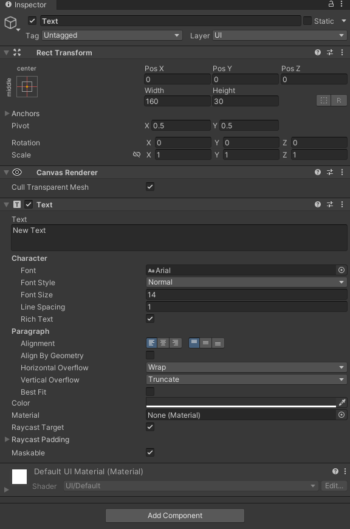 


**Character字体**

- Font可以选择自己喜欢的字体，自己导入	
- Font Style 字体风格
- Line Spacing 行间距
- Rich Text 富文本，选中后可以在文本中添加一些特殊的文本，可以使用类似html中标签，具体看官方文档

**Paragraph段落**

- Alignment 主要对文字的排列进行设置,居中对齐...
- Vertical Overflow  当超出文本限制的时候，自动换下一行 

**Color 颜色**


### Image

Image主要用于加载图片

#### 导入的图片

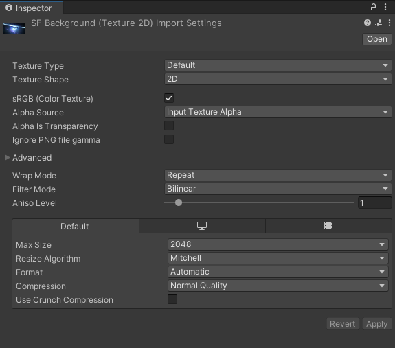 


将其类型选中为2dUI

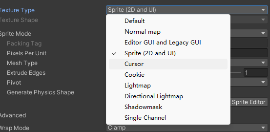 

#### 属性

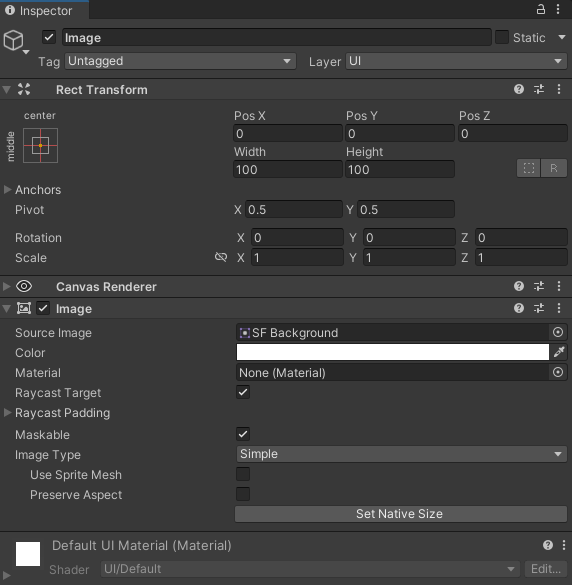 

宽高是以像素为单位的

Source Image:用于选择图片

Color：可以整体渲染图片 它的颜色

Raycase Target:选择后可以去监听鼠标点击之类的事件


#### Image Type


##### 1.simple

在做界面时常常是美工设计好UI元素，然后程序在Unity里把它们摆一摆。**比如做一个Image图标**，美工设计好的尺寸是100*100，那么我们在unity里创建一个image，设置它的长宽为100*100，然后放到合适位置。有没有省事的方法呢？

看Image组件底下有一个按钮：

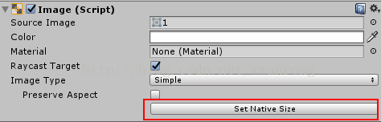 

**点击此按钮则 Image 组件的长宽自动与原图片长宽一致，这常常用于使用脚本创建Image并改贴图。**


##### 2.sliced

美工做了一张100*100的边框图给你，这张图有时以100*100显示，有时以200*100显示，有时……，放大会失真，难道要美工做 n 张图吗？

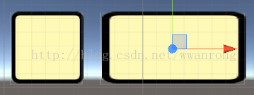 


下面是解决步骤:

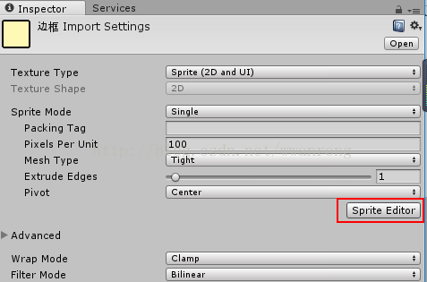 

看那个绿框，把边界留出来

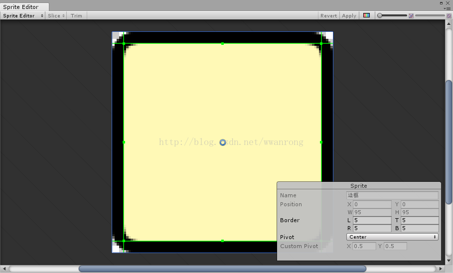 

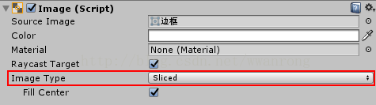 

效果如下：

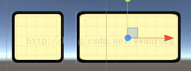 


##### 3.平铺tiled

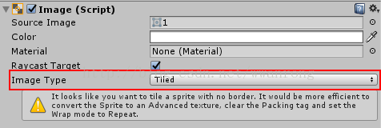 

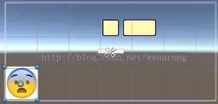 

##### 4.Filled

技能冷却 & 血条

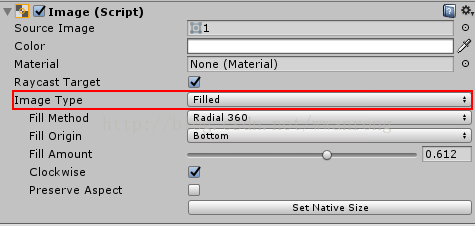 


### Sprite

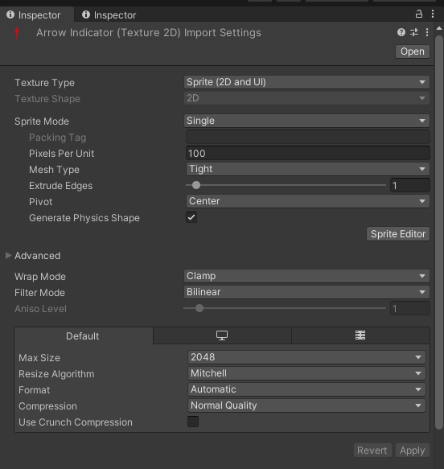 


#### **Filter Mode**

在Unity中，Sprite的Inspector面板中的Filter Mode（过滤模式）是用于控制如何在渲染时对Sprite进行过滤的选项。过滤模式主要影响了Sprite在屏幕上的渲染质量以及性能。

Filter Mode有三个选项：

1. **Point**: 这种模式下，当Sprite被放大时，会出现像素化的现象，因为它们直接采用了最近的像素颜色。**这种模式下渲染速度快，但放大时的图像质量较低。**

2. **Bilinear**: 在这种模式下，渲染时会对相邻像素的颜色进行插值计算，从而产生平滑的过渡效果。这种模式下，图像在放大时不会出现明显的像素化，但在放大的情况下仍可能显得有些模糊。

3. **Trilinear**: Trilinear模式是对Bilinear模式的扩展，它还考虑了Sprite的Mipmap。Mipmap是为了优化渲染性能而创建的多个不同分辨率的图像。Trilinear模式会在Bilinear的基础上考虑到Mipmap，从而在渲染时更好地处理放大和缩小时的质量和性能平衡。

选择过滤模式时需要根据实际需求和性能考虑来进行权衡，通常在需要保证渲染质量的情况下选择Bilinear或Trilinear，而在对性能要求较高的情况下可以选择Point模式。


#### **Default**


##### **Compression**

在Unity中，Sprite的Inspector面板中的Compression（压缩）选项用于控制纹理的压缩方式。这个选项主要影响了Sprite在内存中占用的空间以及在设备上的加载速度和性能。

Compression选项有几个预设的选项，包括：

1. **Default**: 默认选项，Unity会根据目标平台和图像类型自动选择合适的压缩方式。这通常是一个平衡了质量和性能的选项，适合大多数情况下使用。

2. **None**: 不使用任何压缩。这将导致Sprite在内存中占用更多的空间，但**加载速度会更快**，因为不需要解压缩。

3. **Low Quality**: 低质量压缩。这会导致图像在内存中占用的空间较小，但图像质量也会受到一定程度的影响。

4. **Normal Quality**: 普通质量压缩。这是一种平衡了空间占用和图像质量的选项。

5. **High Quality**: 高质量压缩。这会导致图像在内存中占用的空间最小，但加载速度可能会较慢，特别是在较慢的设备上。

选择压缩方式时需要根据实际需求和目标平台进行权衡。通常情况下，可以使用默认选项，根据需要调整为其他选项来达到最佳的性能和质量平衡。


### Button

#### 概述：

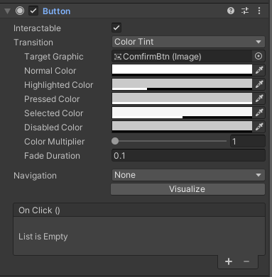 


问题：

**1.Unity Button按下后颜色从Pressed恢复到Normal的问题**

Button在点选之后，其颜色会变为Pressed Color，鼠标从Button移开之后，Button的颜色并不能恢复到Normal Color状态的问题。

**只需要将Button组件里面的Navigation设置为None**即可


#### 按钮的事件添加


##### 1.手动添加

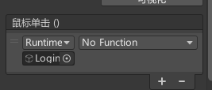

拖入你要触发事件的对象，然后选择里面的方法


##### 2.代码添加

```
loginButton.onClick.AddListener(OnLoginButton);
```

OnLoginButton()事件触发后执行的函数


### Grid Layout Group

GridLayout Group 是Unity中的一个组件，它可以帮助你在UI界面中实现自动布局。通过GridLayout Group，你可以快速地创建网格布局，将子物体按照指定的行数和列数进行排列，并且可以自动调整子物体的大小和间距，以适应不同的屏幕尺寸。

例如，你可以使用GridLayout Group来创建一个包含若干个按钮的面板，让它们以网格形式排列。当屏幕尺寸发生变化时，GridLayout Group会自动调整按钮的大小和间距，以保证它们始终以整齐的网格形式排列。

GridLayout Group 还可以与其他组件结合使用，比如Content Size Fitter 和 Scroll Rect，以实现更丰富的UI布局效果。总之，GridLayout Group 是Unity中非常实用的一个组件，可以帮助你快速地实现各种UI布局。

**要使用 GridLayout Group，你可以按照以下步骤进行操作：**

1. 在Unity编辑器中，选中你想要添加 GridLayout Group 的父物体。
2. 在Inspector窗口中，点击 Add Component 按钮，在搜索框中输入“GridLayout Group”，然后选择它并添加到父物体上。
3. 在 GridLayout Group 组件的 Inspector 窗口中，你可以设置网格布局的行数和列数，以及子物体之间的间距、对齐方式等参数。
4. 将你想要排列的子物体作为 GridLayout Group 的子物体添加到父物体中。
5. 根据需要，你可以调整子物体的大小、位置和布局顺序，以便它们能够以合适的方式排列在网格中。
6. 如果你想要更进一步地控制布局效果，你可以使用 Content Size Fitter 和 Scroll Rect 等组件来实现更高级的布局效果。

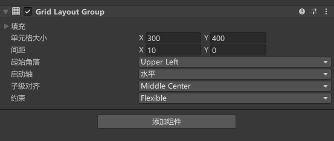 


然后将物体拖入挂载这个组件的物体下即可

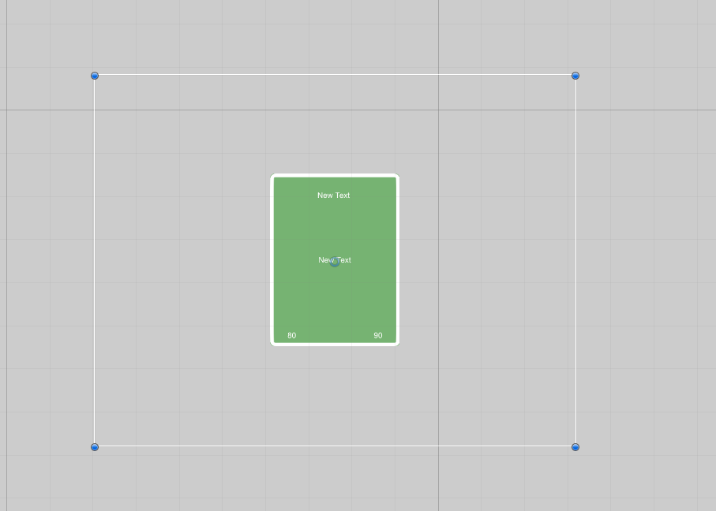 

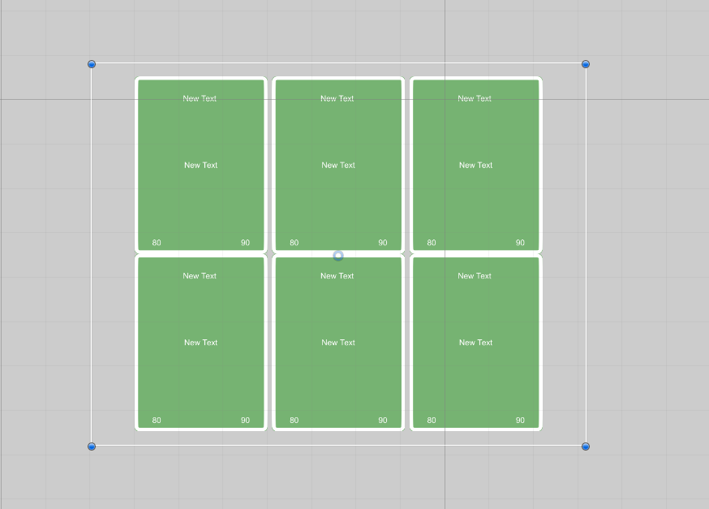 


**它会自动调整位置对齐**

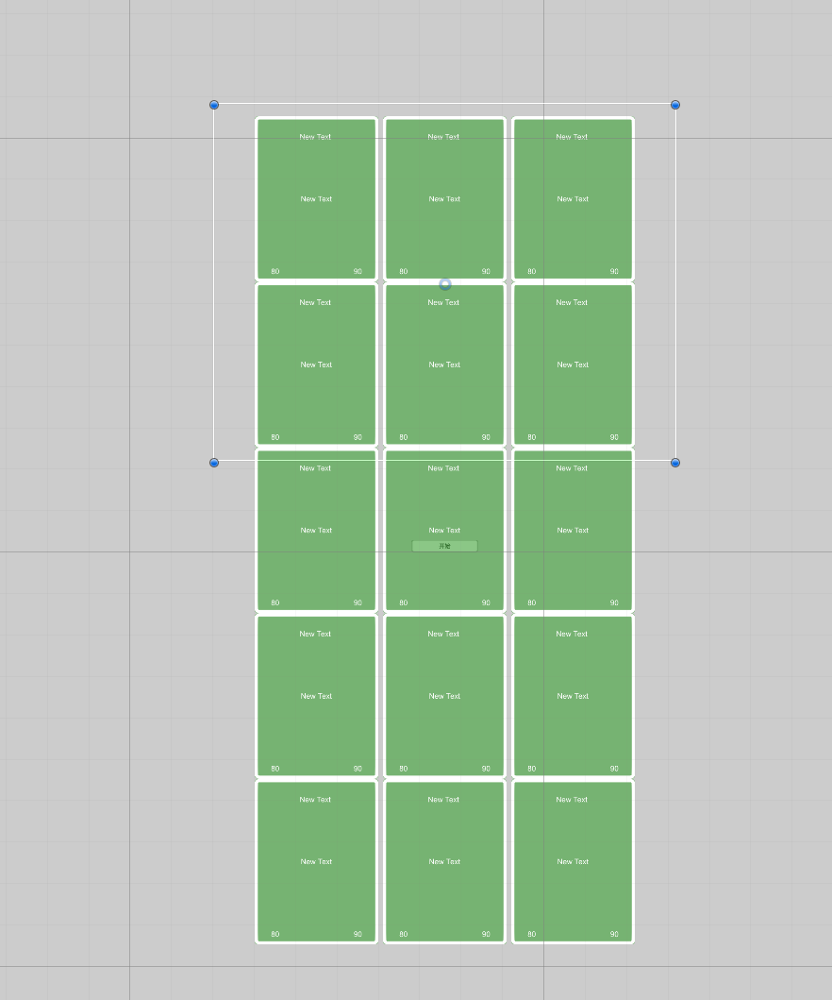 

因为里面的单元格大小是固定的，所以当单元多的时候就会超出这个范围


### Slider


### Scrollbar滚动条

#### 1.概要

 

 

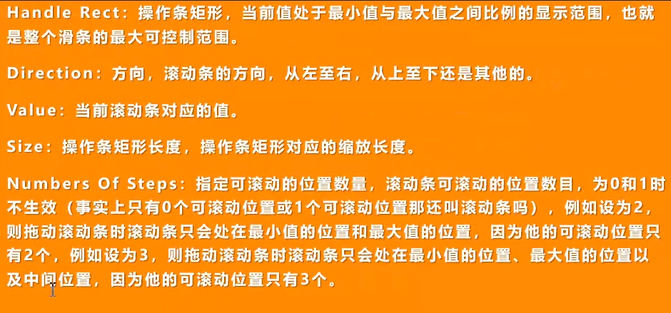 


### Scroll View 滚动视图

#### 1.概要

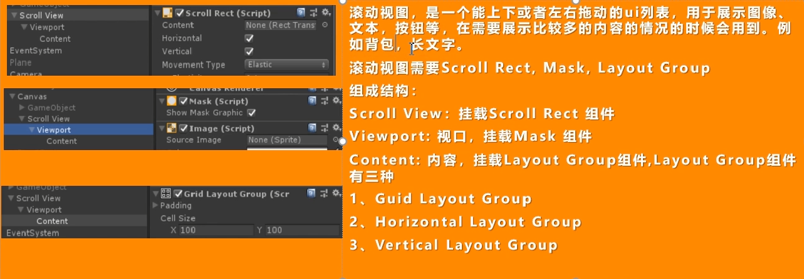

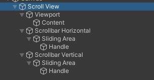 

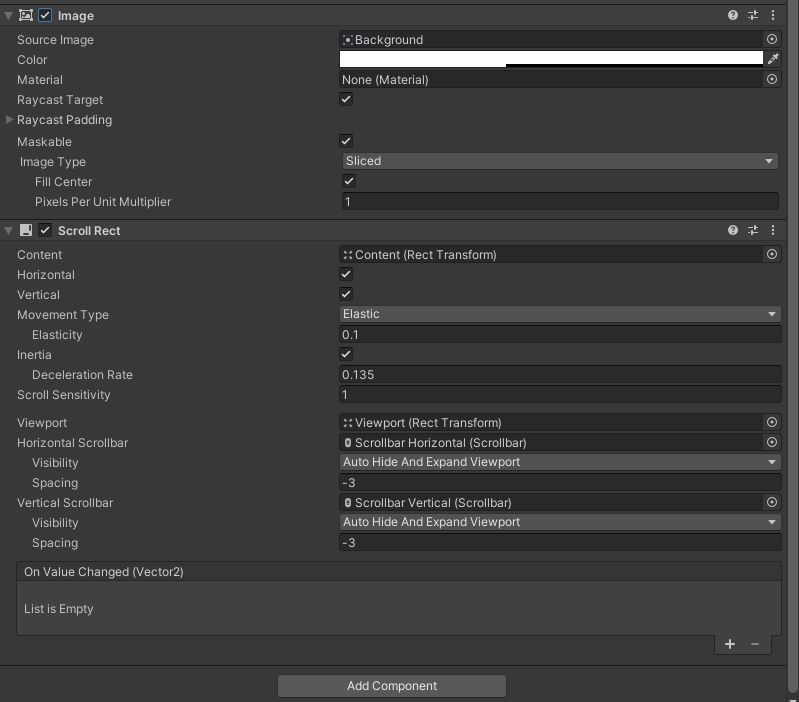 


#### 2.Scroll View --Mask


​	

比如说现在

 

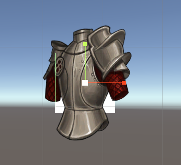 

子物体Image上面显示一张图片，并且子物体显示的范围比父物体大

现在我们给父物体添加Mask组件

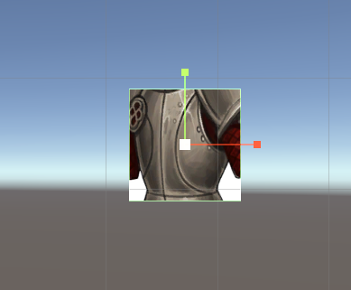 

现在，子物体显示的范围就变成了父物体范围的大小了


#### 3.Scroll Rect

这玩意用来控制滚动条的

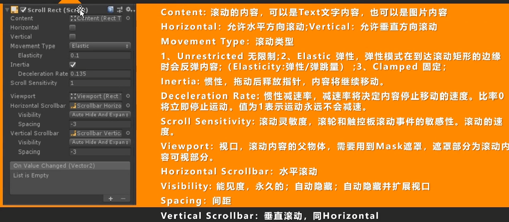


#### 4.Grid Layout Group

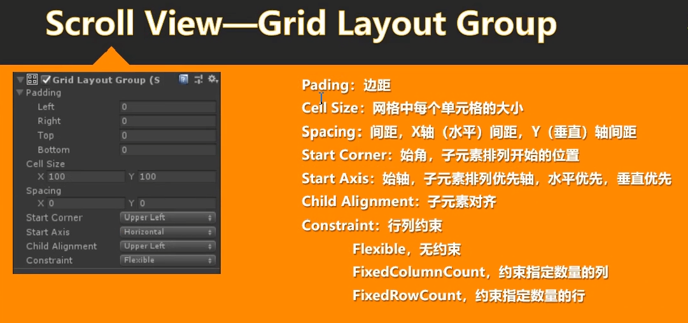


### Dropdown

下拉列表

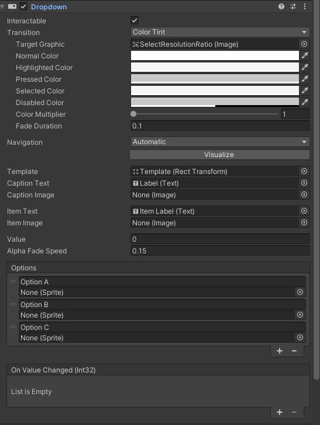 


Options可以添加选项，每个选项都有索引，0，1，2，3用于下面OnValueChanged事件的触发

OnValueChanged可以根据选项改变而触发事件


### Content Size Fitter

在Unity中，ContentSizeFitter是一个UI组件，通常用于自动调整UI元素的大小以适应其子元素的内容。这个组件主要用于处理UI布局，确保UI元素可以根据其子元素的大小进行调整，以确保内容适合。

具体来说，ContentSizeFitter组件有两种常见的模式：

1. **Unconstrained**（不受限制）：在这种模式下，UI元素的大小不受ContentSizeFitter组件的影响，它将保持不变。
2. **PreferredSize**（首选大小）：在这种模式下，UI元素的大小将根据其子元素的首选大小进行调整，以确保子元素的内容适合。

**ContentSizeFitter通常与其他布局组件（如Layout Group）一起使用，以便在构建复杂的UI布局时实现自适应的效果。**

以下是ContentSizeFitter组件的一些常见用途：

- **自适应文本框大小**：当文本内容变化时，可以使用ContentSizeFitter确保文本框自动调整大小，以适应文本内容的变化。
- **自适应按钮大小**：按钮可能包含不同长度的文本，ContentSizeFitter可以确保按钮的大小适应文本的长度。
- **列表项大小调整**：用于调整列表项的大小，以适应其子元素或内容。
- **网格布局中的单元格大小调整**：确保网格中的单元格大小根据其内容进行调整。

要使用ContentSizeFitter组件，你需要将其添加到你的UI元素上，然后选择适当的模式（Unconstrained或PreferredSize）以及其他参数，以满足你的UI设计需求。

比如说：将content的vertical方向受子元素的影响，这个滚动容器就可以实现自动扩张content的高度。

//之前我在做文本框还傻愣愣自己来调整content的高度呢。。。

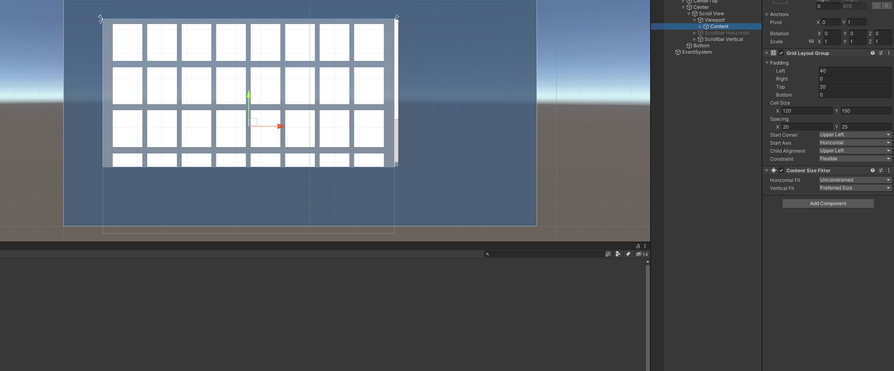


## [BUG]

### **1.UI中无法触发事件系统**

看看你的ui是否被其他ui给覆盖掉了

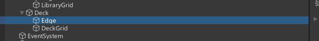

比如说我们我们的触发事件的物体**在DeckGrid中**，有顺序要求。比如说现在DeckGrid是会覆盖Edge的，也就是说放在下面的优先级高一点

也就是说如果你把DeckGrid放在上面的话就可能触发不了一些eventSystem事件

这里可以看出来这样设置的鼠标点击事件发出的射线只会触发第一个ui层


看看你的EventSystem

 

是不是不小心被删掉了


### 2.Canvas的边框不见了


点击这个Gizmos按钮


### 3.按钮事件绑定重复

按钮重复添加点击事件会导致一次调用执行两次


## [小技巧]

**1.在进行ui开发的时候，我们可以把scene视图改为2d视图**


**2.onGUI** 

平时测试时候用起来很方便

简单使用

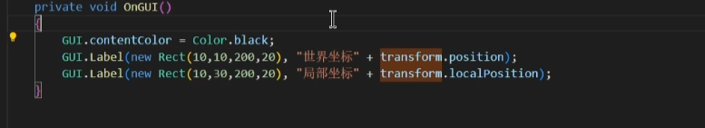 

rect(屏幕坐标x,屏幕坐标y，label宽，label高)  

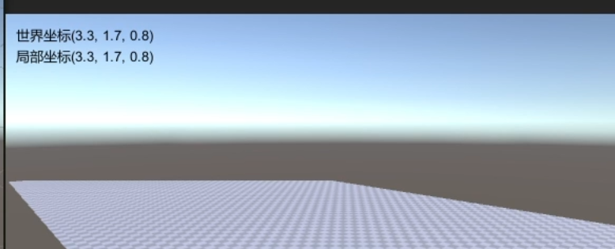 


**3.ui显示的优先级**

不同的canvas，调整sort order值，值越大优先级越高

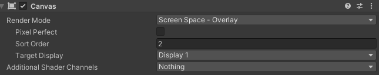 


同一个canvas下

顺序越往下，显示优先级越高

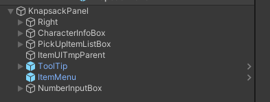 

如果需要在游戏中调整，可通过C#脚本更改某UI成为第几个子物体：

transform.SetAsFirstSibling();//将该物体作为父物体的第一个子物体。

transform.SetAsLastSibling();//将该物体作为父物体的最后一个子物体。

transform.SetSiblingIndex(n);//将该物体作为父物体的第n个子物体(第一个为0)。


## 伤害跳字


### 是什么？

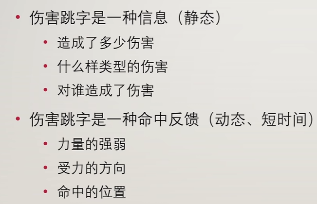 

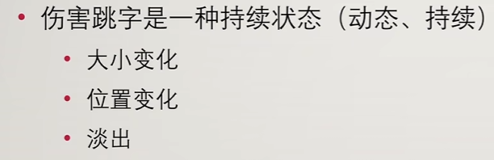 

### 为什么？

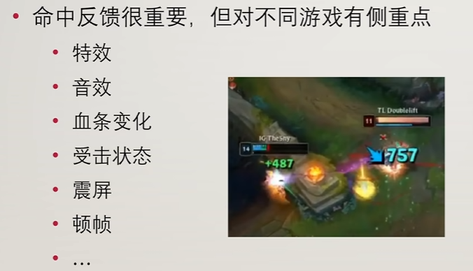 


### 怎么做？

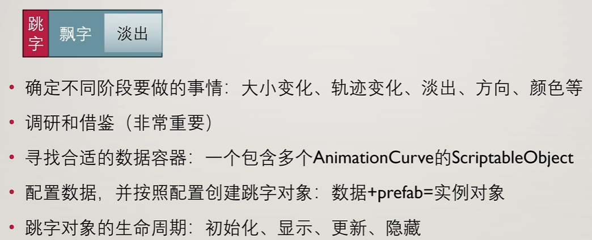 


### 参考文献

[如何制作高质量的伤害跳字_哔哩哔哩_bilibili](https://www.bilibili.com/video/BV1qx4y1Y7wv/?spm_id_from=333.1007.tianma.2-2-5.click&vd_source=ff929fb8407b30d15d4d258e14043130)


## 击杀提示

 


## 角色名和血条

弄个三维的UI即可，没什么难度，主要需要一直面向摄像机。

需要一个好看的ui，我这里这就就是一个滑动条。


红色 10

黄色 50

绿色 100


## 过程进度条/海报

找个好看的进度条才行.

需要有渐变消失的过程。


## 设置界面

 

### 永劫无间

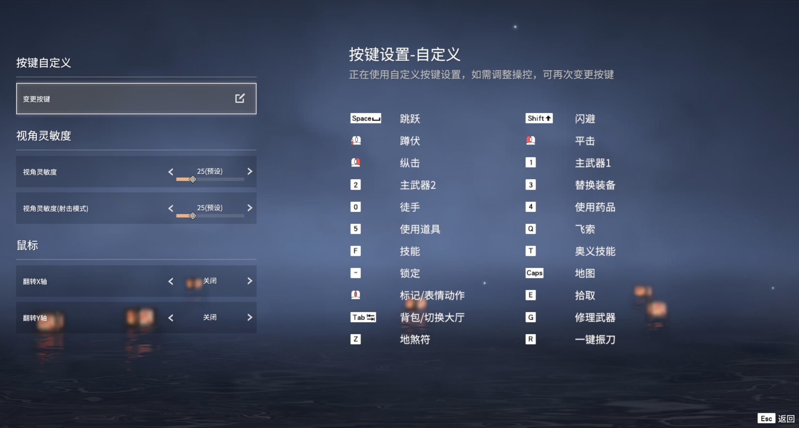


### 死寂

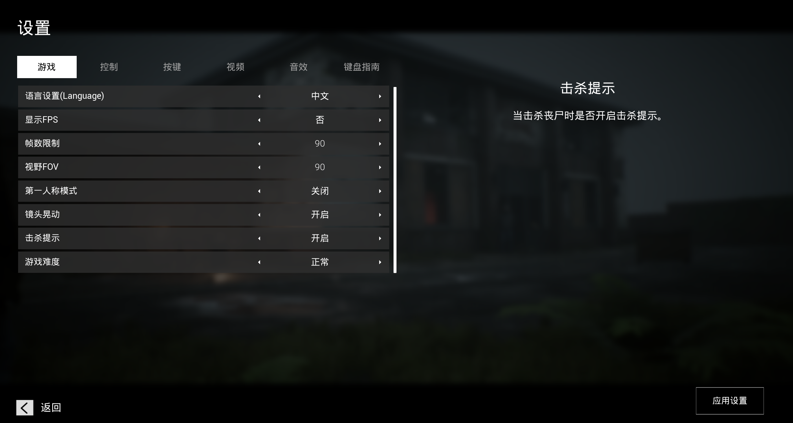

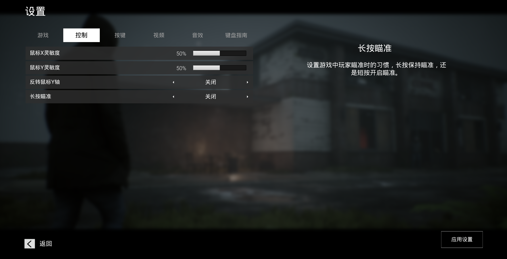

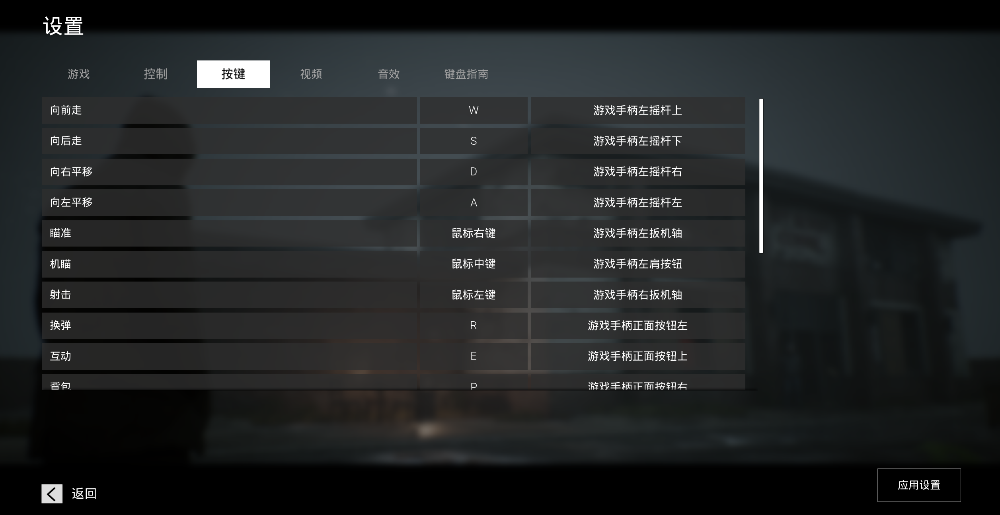

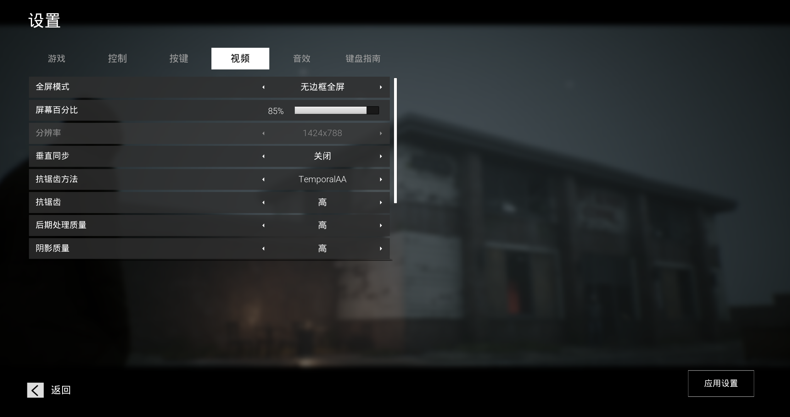

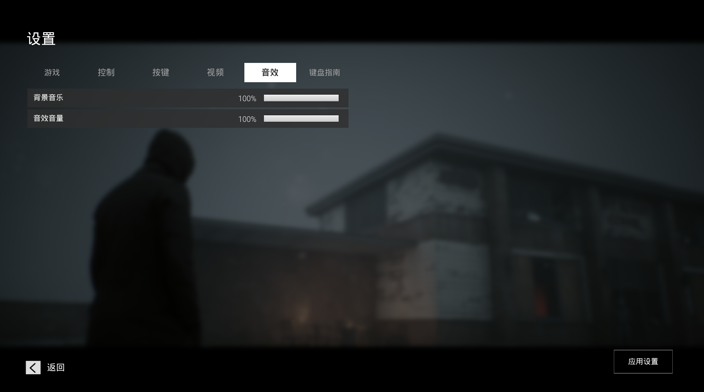


### 参考

死寂


## 游戏初始进入页面

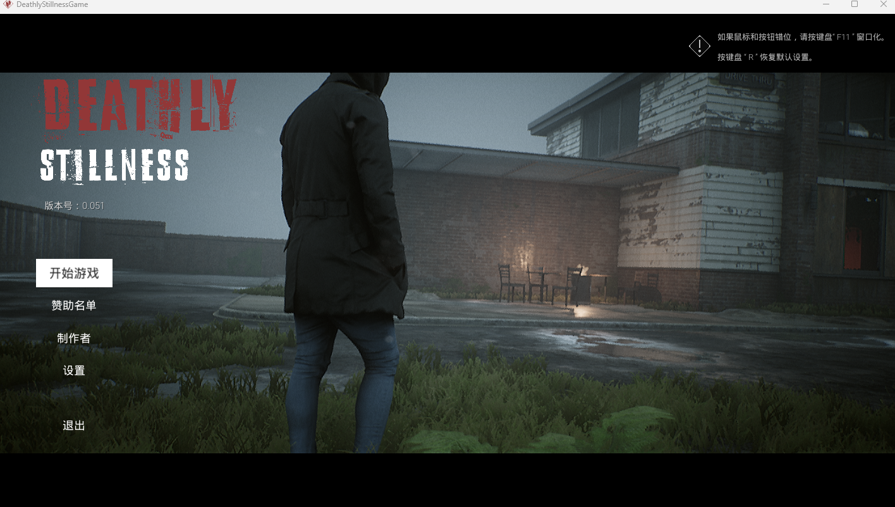


## 分辨率问题

最方便的是使用按键进行窗口化和全屏化。


## 一些选项的页面

都是背景虚化再再中间加一个横条ui做确认用，还挺好看的。

感觉死寂的好看点。


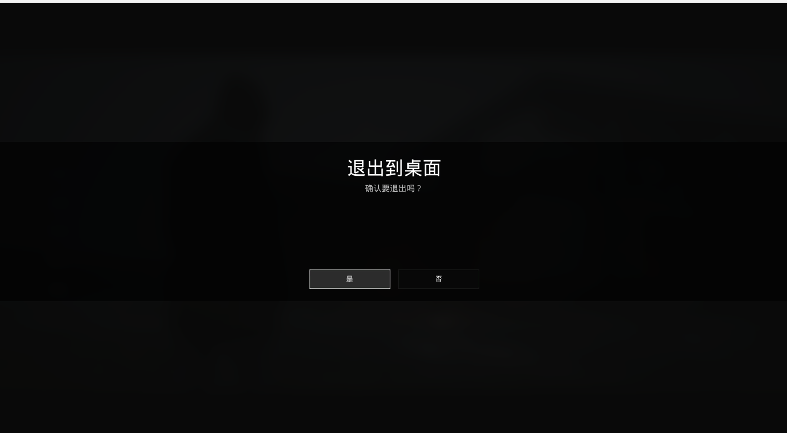


## 召唤指示箭头

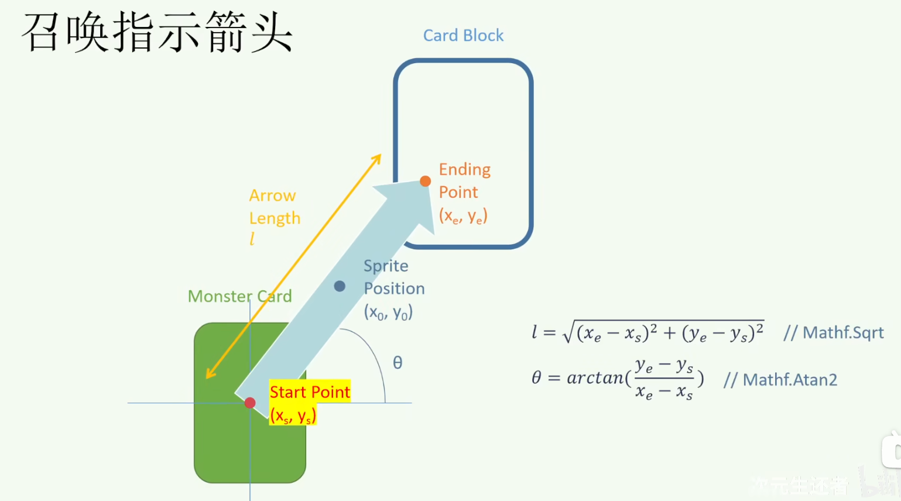


**可以通过修改Sprite精灵资源让箭头的头部三角形不参与缩放**

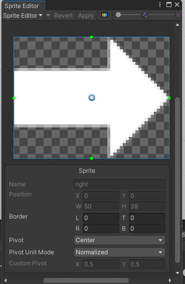

**上面四个绿点就是，缩放的时候会拉伸的部分**

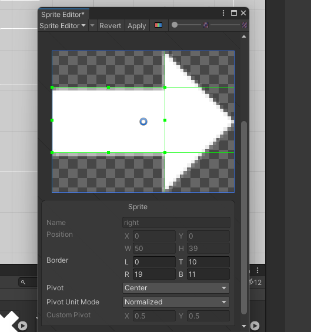

**并且将image type 改为sliced即可**

效果如下

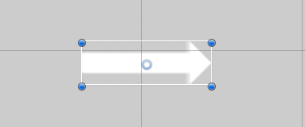

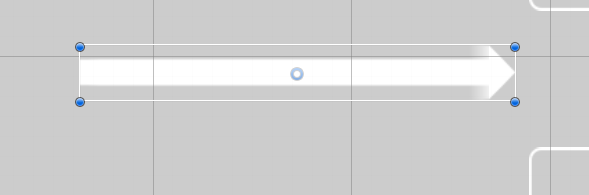


**最后我们只需要去修改这个image的宽度即可调整箭头的长度**

```
using System.Collections;
using System.Collections.Generic;
using UnityEngine;

public class Arrow : MonoBehaviour
{
    public Vector2 StartPoint;
    private Vector2 EndPoint;
    private RectTransform arrow;

    private float ArrowLength;
    private float ArrowAngle;
    private Vector2 ArrowMidPosition;

    private void Start()
    {
        arrow = transform.GetComponent<RectTransform>();
    }


    private void Update()
    {
        //计算相关信息
        EndPoint = Input.mousePosition - new Vector3(960.0f,540.0f,0.0f);//获取鼠标在屏幕上的坐标
        ArrowMidPosition = new Vector2((EndPoint.x + StartPoint.x) / 2, (EndPoint.y + StartPoint.y) / 2);
        ArrowLength = Mathf.Sqrt((EndPoint.x - StartPoint.x) * (EndPoint.x - StartPoint.x) + (EndPoint.y - StartPoint.y) * (EndPoint.y - StartPoint.y));
        ArrowAngle = Mathf.Atan2(EndPoint.y - StartPoint.y, EndPoint.x - StartPoint.x);

        arrow.localPosition = ArrowMidPosition;
        arrow.sizeDelta = new Vector2(ArrowLength, arrow.sizeDelta.y);
        arrow.localEulerAngles = new Vector3(0.0f, 0.0f, ArrowAngle * 180 / Mathf.PI);
    }

    public void SetStartPoint(Vector2 _startPoint)
    {
        StartPoint = _startPoint - new Vector2(960.0f, 540.0f);
    }
}
```


### 参考

死寂

永劫无间


## ui的点击拖拽...


### 简介IPointerClickHandler..

在Unity的UI系统中，IPointerClickHandler、IPointerEnterHandler和IPointerExitHandler是实现了不同的事件接口的接口之一，它们都继承自IEventSystemHandler接口。**这些接口用于处理指针输入事件（例如鼠标或触摸屏）。**

- IPointerClickHandler：处理指针点击事件，当玩家点击或轻触UI元素时被调用。
- IPointerEnterHandler：处理指针进入事件，当玩家将指针移动到UI元素上方时被调用。
- IPointerExitHandler：处理指针离开事件，当玩家将指针从UI元素上移走时被调用。


​	**这些接口通常用于实现与UI元素的交互。**


### 例如

当玩家点击按钮时，可以使用IPointerClickHandler接口来处理这个事件并执行相应的操作。当玩家将鼠标悬停在UI元素上方时，可以使用IPointerEnterHandler接口来显示提示或执行其他交互。当玩家将鼠标从UI元素上移开时，可以使用IPointerExitHandler接口来执行其他操作。


以下是一个示例，演示如何在代码中使用IPointerEnterHandler和IPointerExitHandler来检测鼠标悬停在UI元素上方的事件：

```
using UnityEngine;
using UnityEngine.EventSystems;

public class HoverExample : MonoBehaviour, IPointerEnterHandler, IPointerExitHandler
{
    // This function will be called when the pointer enters the UI element
    public void OnPointerEnter(PointerEventData eventData)
    {
        Debug.Log("Pointer entered!");
    }

    // This function will be called when the pointer exits the UI element
    public void OnPointerExit(PointerEventData eventData)
    {
        Debug.Log("Pointer exited!");
    }
}

```

在这个示例中，HoverExample是一个脚本，可以附加到任何UI元素上，例如Button或Text。它实现了IPointerEnterHandler和IPointerExitHandler接口，**并实现了OnPointerEnter和OnPointerExit方法**，这些方法将在玩家将鼠标悬停在UI元素上方或从UI元素上移走时被调用。在这些方法中，我们使用Debug.Log输出一条消息，以便可以在Unity的控制台中查看它。


### PointerEventData

PointerEventData是Unity引擎中的一个类，用于表示指针（如鼠标、触摸屏幕等）在UI系统中的事件数据。它包含了指针的位置、点击状态、按下和释放时的时间、是否拖动等信息。通过处理PointerEventData，可以在UI中实现按钮点击、拖拽、滑动等用户交互行为。PointerEventData是在Unity 4.6版本中引入的，并在之后的版本中得到了不断的扩展和改进。

**在使用PointerEventData时，通常需要结合Unity中的事件系统使用，以下是一些PointerEventData的常见用法：**


### 1.实现UI按钮点击事件

在UI按钮上添加Button组件，然后在Button组件的OnClick()事件上绑定一个处理函数。在处理函数中，可以通过PointerEventData参数获取到点击的位置和状态信息，从而实现不同的响应。

```
using UnityEngine;
using UnityEngine.UI;
using UnityEngine.EventSystems;

public class ButtonClick : MonoBehaviour, IPointerClickHandler
{
    public void OnPointerClick(PointerEventData eventData)
    {
        Debug.Log("Button clicked at position: " + eventData.position);
    }
}
```


### 2.实现拖拽事件

在UI组件上添加**Draggable**组件，然后在**Draggable组件的OnDrag()事件上绑定一个处理函数**。在处理函数中，可以通过PointerEventData参数获取到拖拽的位置和状态信息，从而实现拖拽效果。

```
using UnityEngine;
using UnityEngine.UI;
using UnityEngine.EventSystems;

public class Draggable : MonoBehaviour, IDragHandler
{
    public void OnDrag(PointerEventData eventData)
    {
        transform.position = eventData.position;
    }
}
```


### 3.获取当前鼠标位置


#### EventSystem

在需要获取鼠标位置的代码中，可以使用EventSystem.current.currentInputModule.input.mousePosition获取当前鼠标的位置。（屏幕坐标）

```
using UnityEngine;
using UnityEngine.UI;
using UnityEngine.EventSystems;

public class MousePosition : MonoBehaviour
{
    private void Update()
    {
        Vector3 mousePos = EventSystem.current.currentInputModule.input.mousePosition;
        Debug.Log("Mouse position: " + mousePos);
    }
}
```

## 技能框


冷却实现

添加一个image纯黑的，然后设置透明度。imageteyp配置如下，拖动fill amount就能实现效果

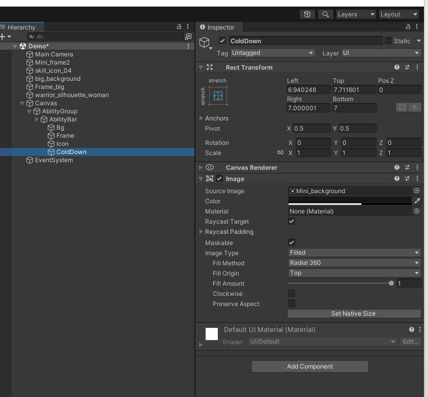 

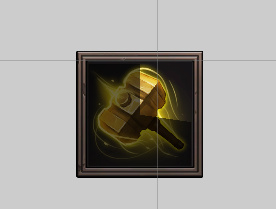 


# 游戏AI行为决策

## 概要

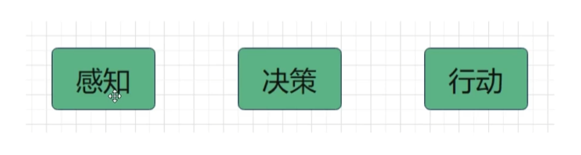

**感知**：可以检测附近玩家或者环境的变化，比如说：有没有玩家进入它的视野，有没有玩家对它进行攻击，感知到这些情况，就可以根据这些情况去做决策

**决策**：根据环境的变化来思考该做出什么反馈。实现的方式有：**状态机，行为树，硬编码**

​	如果只有4、5种状态的话就十分适合使用状态机。如果更多更复杂的就得使用行为树。

**行动**：ai所做出的具体反馈，比如说释放技能，移动到指定位置，寻路.....


AI包括的能力：寻路能力、移动、视野、技能

比如：

1.走地鸡：只能跑来跑去，被打就死

2.旋风狼：进入它的视野内就攻击你

3.豪猪：只有你打它，它才会撞你

4.飞僵：有技能


旋风狼：

1.生命值为0 死亡倒地

2.附近无人自动巡逻（出生点附近随机位置）

3.视野内出现敌人就回去追击

4.如果超出自己的可移动范围则返回

5.血量低于15%开始逃跑

6.血量低于10%狂化


## 有限状态机FSM


在Unity中，有限状态机（Finite State Machine，FSM）是**一种用于管理游戏对象的状态和行为的工具**。它基于状态转换图，将游戏对象的所有可能状态和它们之间的过渡转换表示为节点和边。

每个状态都定义了对象的行为和响应，以及转换到其他状态所需的条件。例如，一个游戏中的角色可能具有“站立”、“行走”、“奔跑”等多种状态，它们之间的转换可能取决于用户输入、游戏事件或其他条件。

Unity中的FSM可以使用Unity内置的Animator Controller或通过编写脚本来实现。使用Animator Controller，您可以为每个状态指定动画或动画过渡，以及与每个状态相关的其他属性和行为。编写脚本可以让您更精细地控制状态机，并为状态转换指定更复杂的条件和响应。

使用有限状态机可以让您更好地管理复杂的游戏对象和游戏系统，并使其更加可读和易于维护。它也可以帮助您实现复杂的行为和动画效果，并控制游戏中的角色和对象。


1.拥有多种状态（enum StateType）

2.处于其中一种状态(currentState)

3.状态互相切换(Updata Switch)


### 最简版本

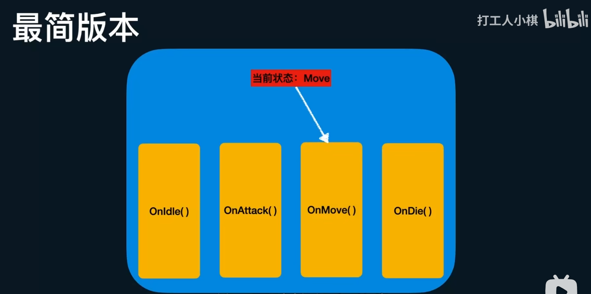


优点：简单

缺点：代码耦合性较高，不利于团队协作开发，单个状态只能使用一个状态来处理


**AI.cs**

```
using System.Collections;
using System.Collections.Generic;
using UnityEngine;
using MY_FSM;

/// <summary>
/// 最简单的状态机
/// </summary>

// 闲逛、索敌、攻击、死亡、胜利
// public enum StateType
// {
//     Idle,
//     Find_Enemy,
//     Attack,
//     Die,
//     Success,
// }

public class AI : MonoBehaviour
{
    // 当前所处的状态
    private StateType curState;
    void Start()
    {
        curState = StateType.Idle;
    }

    // Update is called once per frame
    void Update()
    {
        switch (curState)
        {
            case StateType.Idle:
                {
                    OnIdle();
                    break;
                }
            case StateType.Find_Enemy:
                {
                    OnFindEnemy();
                    break;
                }
            case StateType.Attack:
                {
                    OnAttack();
                    break;
                }
            case StateType.Die:
                {
                    OnDie();
                    break;
                }
            case StateType.Success:
                {
                    OnSuccess();
                    break;
                }
            default:
                break;
        }
    }

    // 不同状态时的响应函数
    void OnIdle() { }
    void OnFindEnemy() { }
    void OnAttack() { }
    void OnDie() { }
    void OnSuccess() { }

}
```


### 优化版本

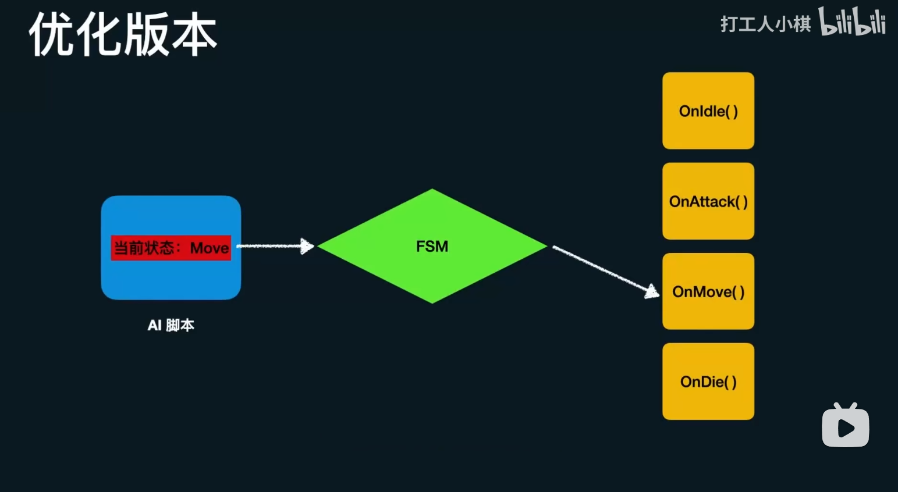


通过FSM这个代理来去处理状态切换的问题

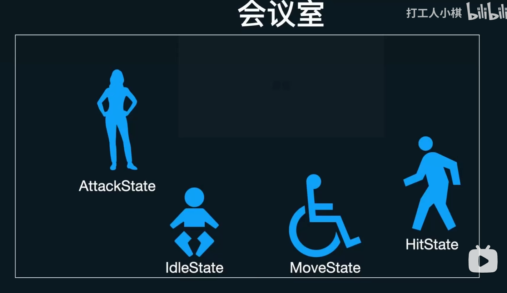

状态之间的通信问题：在会议室中内容展示到黑板上。所有我们可以在FSM创建一个类用于共享数据


**FSM**.CS

```
using System.Collections;
using System.Collections.Generic;
using UnityEngine;
using System;

namespace MY_FSM
{

    public enum StateType//状态
    {
        Idle,
        MOVE,
        Find_Enemy,
        Attack,
        Die,
        Success,
    }
    public interface IState//响应
    {
        void OnEnter();
        void OnExit();
        void OnUpdate();
        // void OnCheck();
        // void OnFixUpdate();
    }
    [Serializable]
    public class Blackboard
    {
        // 此处存储共享数据，或者向外展示的数据，可配置的数据
    }


    public class FSM
    {
        public IState curState;
        public Dictionary<StateType, IState> states;//状态和响应之间的映射关系
        public Blackboard blackboard;

        public FSM(Blackboard blackboard)
        {
            this.states = new Dictionary<StateType, IState>();
            this.blackboard = blackboard;
        }

        public void AddState(StateType stateType, IState state)
        {
            if (states.ContainsKey(stateType))
            {
                Debug.Log("[AddState] >>>>>>>>>>>>> map has contain key: " + stateType);
                return;
            }
            states.Add(stateType, state);
        }


        //状态转换
        public void SwitchState(StateType stateType)
        {
            if (!states.ContainsKey(stateType))
            {
                Debug.Log("[SwitchState] >>>>>>>>>>>>>>>>> not contain key: " + stateType);
                return;
            }
            if (curState != null)
            {
                curState.OnExit();
            }
            curState = states[stateType];
            curState.OnEnter();
        }

        public void OnUpdate()
        {
            curState.OnUpdate();
        }

        public void OnFixUpdate()
        {
            // curState.OnFixUpdate();
        }

        public void OnCheck()
        {
            // curState.OnCheck();
        }
    }
}
```


**AINew.cs**

```
using System.Collections;
using System.Collections.Generic;
using UnityEngine;
using MY_FSM;
using System;
using Random = UnityEngine.Random;

/// <summary>
/// 配合fsm的例子
/// </summary>


[Serializable]
public class ZombieBlackboard : Blackboard
{
    public float idleTime;
    public float moveSpeed;
    public Transform transform;
    public Vector2 targetPos;

}

public class AI_IdleState : IState
{
    private float idleTimer;
    private FSM fsm;
    private ZombieBlackboard blackboard;
    public AI_IdleState(FSM fsm)
    {
        this.fsm = fsm;
        this.blackboard = fsm.blackboard as ZombieBlackboard;
    }
    public void OnEnter()
    {
        idleTimer = 0;
    }

    public void OnExit()
    {
    }

    public void OnUpdate()
    {
        idleTimer += Time.deltaTime;
        if (idleTimer > blackboard.idleTime)
        {
            this.fsm.SwitchState(StateType.MOVE);
        }
    }
}

public class AI_MoveState : IState
{
    private FSM fsm;
    private ZombieBlackboard blackboard;
    public AI_MoveState(FSM fsm)
    {
        this.fsm = fsm;
        this.blackboard = fsm.blackboard as ZombieBlackboard;
    }
    public void OnEnter()
    {
        //这里只是随机移动而已，
        float randomX = Random.Range(-10, 10);
        float randomY = Random.Range(-10, 10);
        // 当前位置从黑板里拿
        blackboard.targetPos = new Vector2(blackboard.transform.position.x + randomX, blackboard.transform.position.y);
    }

    public void OnExit()
    {
    }

    public void OnUpdate()
    {
        if (Vector2.Distance(blackboard.transform.position, blackboard.targetPos) < 0.1f)
        {
            fsm.SwitchState(StateType.Idle);
        }
        else
        {
            //继续向目标移动
            blackboard.transform.position = Vector2.MoveTowards(blackboard.transform.position, blackboard.targetPos, blackboard.moveSpeed * Time.deltaTime);
        }
    }
}


public class AINew : MonoBehaviour
{
    // Start is called before the first frame update
    private FSM fsm;
    public ZombieBlackboard blackboard;
    void Start()
    {
        fsm = new FSM(blackboard);
        fsm.AddState(StateType.Idle, new AI_IdleState(fsm));
        fsm.AddState(StateType.MOVE, new AI_MoveState(fsm));
        fsm.SwitchState(StateType.Idle);
    }

    // Update is called once per frame
    void Update()
    {
        fsm.OnCheck();
        fsm.OnUpdate();
        Flip();
    }

    void Flip()
    {
        if (blackboard.targetPos != Vector2.zero)
        {
            if (blackboard.targetPos.x > transform.position.x)
            {
                transform.localScale = new Vector2(-1, 1);//利用缩放实现了翻转的效果
            }
            else
            {
                transform.localScale = new Vector2(1, 1);
            }
        }
    }

    private void FixedUpdate()
    {
        fsm.OnFixUpdate();
    }
}

```


### 代码实例，敌人多样性

idel  chase attack

Enemy

​	-->basse  角色的基类

​	-->Enemy Type  角色的类型

​	--> Interface  定义人物的一些行为接口给人物继承

​	-->StateMachine  人物的状态  和 状态机

​	-->TriggerChecks  


### 举个栗子

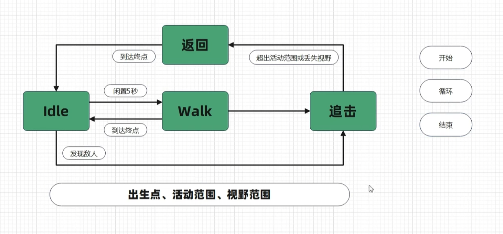

比如：Monster调用它的ai，然后通过ai来调用状态机。这里ai就相当于charactercontroller


**巡逻**

每隔一段时间，就给ai一个特定范围内的随机位置，让其移动即可。

我们给客户端也只需要发一个坐标就行了。

**追击**

在巡逻的时候来检测玩家是不是在检测范围内。

怎么检测呢？

其实就是判断两个actor坐标之间的距离,如果在怪物ai的追击范围内就进行追击，到达特定的范围就会进行攻击。

需要注意的就是，如果ai跑出了活动范围获取敌人超出了追击范围，ai就会进入return状态，返回出生点

**返回**

返回出生点


## HFSM

(HierarchyFiniteStateMachine)分层有限状态机


## 行为树


### 前言

行为树，是目前游戏中应用较为广泛的一种行为决策模型。这离不开它成熟的可视化编辑工具，例如Unity商城中的「Behaviour Designer」，甚至是虚幻引擎也自带此类编辑工具。而且它的设计逻辑并不复杂，其所利用的树状结构，很符合人的思考方式。

接下来，我们会先对它的运作逻辑进行介绍，然后再试图用代码实现它。树状结构在不借助可视化工具的情况下是不容易呈现清楚的，这里我借鉴了Steve Rabin的《[Game AI Pro](http://www.gameaipro.com/)》中行为树的实现方式，利用代码缩进稍稍实现了一些可视化（本教程使用C#代码实现）。下面我们就开始吧！

### 运作逻辑

#### 1.根节点驱动

如果你已经了解「有限状态机（FSM）」的话，你应该知道，有限状态机在运作时常常会停留在一个状态中，不断执行该状态的逻辑，直至接受到状态转移的指令才变化到其它状态。而行为树则是会不断从根节点向下搜索，即「**根节点驱动**」，来找到合适的「动作」执行，执行完毕后会再回到根节点重复这个过程。以下面这个「怪物攻击玩家」行为树为例：

[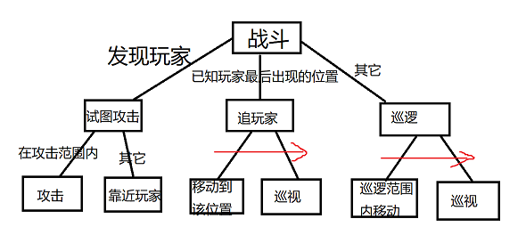](https://img2023.cnblogs.com/blog/3306371/202312/3306371-20231201215937020-2125698706.png)

假设「攻击」动作的逻辑是「向玩家挥一拳」，现在怪物发现玩家且玩家在攻击范围内。那么，按照行为树的逻辑，它会经过「战斗 → 试图攻击 → 攻击」一路下来，最终向玩家挥出一拳 (￣ε(#￣)☆╰╮o(￣皿￣///)。

至此，「攻击」就算是完成了，若是在状态机中，攻击也算是一种状态的话，怪物必然会停留于此，等待下一帧时再挥出一拳。但在行为树中呢？它确实也会在下一帧时在挥出一拳，只是会再经过「战斗 → 试图攻击 → 攻击」这个过程，也就是前面所说的，从根节点再次出发。

你可能也发现了，这明显是脱裤子放屁的行为，它确实可以算是行为树的小缺点。但其实行为树的深度通常并不会太深，多几次布尔判断或小遍历倒也不打紧；而且有一种**事件驱动**的行为树实现方法，能以“空间换时间”的手段改善这种情况，感兴趣的同学可以去了解一下。

#### 2.特殊的节点

行为树的一大特点，就是**将条件与行为本身进行了分离**。
什么意思呢？我们仍以上面那张图为例，只是稍稍修改下表现方式（也更接近行为树真正的样子）：

[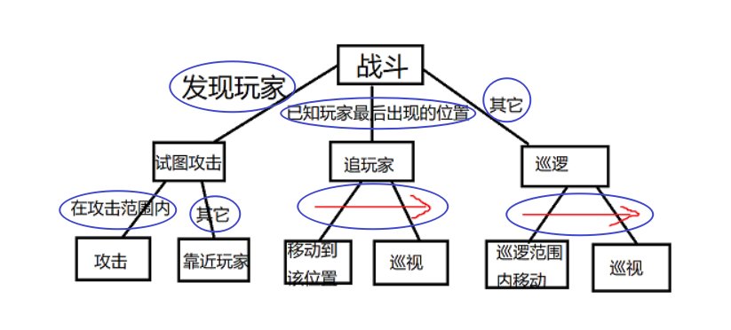](https://img2023.cnblogs.com/blog/3306371/202312/3306371-20231201223752295-1676670576.png)

好像多了几个圈？那现在，请你将这些圈也视为和「攻击」一样类型的节点。这样一来，我们将「判断逻辑」、「顺序遍历（图中的红色箭头）」、「动作」都用节点来表示了。这有什么好处呢？好处就在于我们可以将它们进行**各种各样的组合**！比如，如果有一个怪物比较胆小，遇到玩家后会逃跑，我们就可以用图中的「发现玩家」+「移动到该位置（逃跑的位置）」来实现；也可以配合新的节点来组合，比如「已知玩家最后出现的位置」+ 新节点：「朝指定位置开火」，就可以实现远程追击。

总之，正是因为行为树有一系列特殊的节点，使得开发者可以降低各个行为之间的关联（也就是解耦），再配合上树状结构的特点，开发者可以灵活地进行组装，实现节点的重复利用，避免写重复的代码，提高了开发效率。（用过有限状态机写游戏AI的同学一定能体会到这点的好处）

### 代码实现

现在，我们就一起来实现行为树吧，先看看我们有哪些要实现的吧（它们的具体含义后面会解释）：

1. 组合节点（Composite），指有多个子节点的特殊节点，具体包括：
   1. 顺序器（Sequence）
   2. 选择器（Selector）
   3. 并行器（Parallel）
   4. 过滤器（Filter）
   5. 主动选择器（ActiveSelector）
   6. 监视器（Monitor）
2. 修饰节点（Decorator），指仅有一个子节点的特殊节点，具体包括：
   1. 取反器（Inverter）
   2. 重复执行器（Repeat）
3. 动作节点，指可以自定义的节点，比如「攻击」、「巡视」之类的

#### 1.基础准备

正式实现它们之前，我们应当准备它们的基类，毕竟它们都是节点，有一些共性的东西可以提取出来，这样可以减少一些重复的代码。


csharp

```csharp
/// <summary>
/// 运行结果状态的枚举
/// </summary>
public enum EStatus
{
    //失败，成功，运行中，中断，无效
    Failure, Success, Running, Aborted, Invalid
}

/// <summary>
/// 行为树节点基类
/// </summary>
public abstract class Behavior
{
    public bool IsTerminated => IsSuccess || IsFailure;//是否运行结束
    public bool IsSuccess => status == EStatus.Success;//是否成功
    public bool IsFailure => status == EStatus.Failure;//是否失败
    public bool IsRunning => status == EStatus.Running;//是否正在运行
    protected EStatus status;//运行状态
    public Behavior()
    {
        status = EStatus.Invalid;
    }
    //当进入该节点时才会执行一次的函数，类似FSM的OnEnter
    protected virtual void OnInitialize() {}

    //该节点的运行逻辑，会时时返回执行结果的状态，类似FSM的OnUpdate
    protected abstract EStatus OnUpdate();

    //当运行结束时才会执行一次的函数，类似FSM的OnExit
    protected virtual void OnTerminate() {}

    //节点运行，从中应该更能了解上述三个函数的功能
    //它会返回本次调用的结果，为父节点接下来的运行提供依据
    public EStatus Tick()
    {
        if(!IsRunning)
            OnInitialize();
        status = OnUpdate();
        if(!IsRunning)
            OnTerminate();
        return status;
    }

    //添加子节点
    public virtual void AddChild(Behavior child) {}
    
    //重置该节点的运作
    public void Reset()
    {
        status = EStatus.Invalid;
    }
    
    //强行打断该节点的运作
    public void Abort()
    {
        OnTerminate();
        status = EStatus.Aborted;
    }
}
```

#### 2.组合节点

首先实现「组合节点」这个基类。


csharp

```csharp
using System.Collections.Generic;

public abstract class Composite : Behavior
{
    protected LinkedList<Behavior> children;//用双向链表构建子节点列表
    public Composite()
    {
        children = new LinkedList<Behavior>();
    }
    //移除指定子节点
    public virtual void RemoveChild(Behavior child)
    {
        children.Remove(child);
    }
    public void ClearChildren()//清空子节点列表
    {
        children.Clear();
    }
    public override void AddChild(Behavior child)//添加子节点
    {
        //默认是尾插入，如：0插入「1，2，3」中，就会变成「1，2，3，0」
        children.AddLast(child);
    }
}
```

接下来就是具体类的实现了，我会对这些节点的功能作出解释（有参考虚幻引擎的行为树节点介绍），再进行代码实现。

##### 1.顺序器

逻辑上来讲（非代码结构），它长这样：

[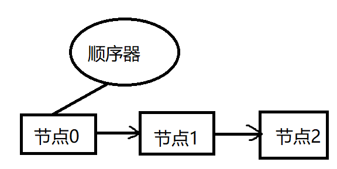](https://img2023.cnblogs.com/blog/3306371/202312/3306371-20231202081548303-1481202271.png)

顺序器会按从左到右的顺序执行其子节点。当其中一个子节点执行失败时，将停止执行，也就是说，任一子节点失败，顺序器就会失败。只有所有子节点运行都成功，顺序器才算成功。


csharp

```csharp
public class Sequence : Composite
{
    protected LinkedListNode<Behavior> currentChild;//当前运行的子节点
    protected override void OnInitialize()
    {
        currentChild = children.First;//从第一个子节点开始
    }
    protected override EStatus OnUpdate()
    {
        while(true)
        {
            var s = currentChild.Value.Tick();//记录子节点运行返回的结果状态
            /*
            如果子节点运行，还没有成功，就直接返回该结果。
            是「运行中」那就表明本节点也是运行中，有记录当前节点，下次还会继续执行；
            是「失败」就表明本节点也运行失败了，下次会再经历OnInitialize，从头开始。
            */
            if( s != EStatus.Success)
                return s;
            //如果运行成功，就换到下一个子节点
            currentChild = currentChild.Next;
            //如果全都成功运行完了，就返回「成功」
            if(currentChild == null)
                return EStatus.Success;
        }
    }
}
```

##### 2.选择器

从逻辑上讲，它的结构应该长这样：

[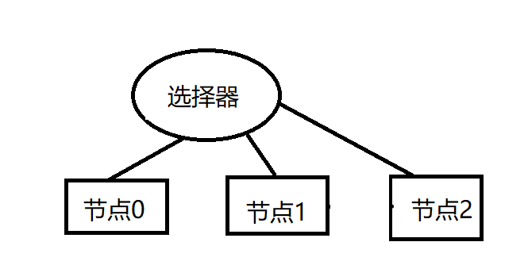](https://img2023.cnblogs.com/blog/3306371/202312/3306371-20231202082823410-203249342.png)

每次只会选择一个可以运行的子节点来运行。

但从代码上来说，选择器的结构和顺序器完全一致，只是运行逻辑变化了：
按从左到右的顺序执行其子节点。当其中一个子节点执行成功时，就停止执行，也就是说，任一子节点成功运行，就算运行成功。只有所有子节点运行都失败，选择器才算运行失败。

所以，只要简单地继承「顺序器」并修改它的OnUpdate逻辑，就能得到选择器啦！


csharp

```csharp
public class Selector : Sequence
{
    protected override EStatus OnUpdate()
    {
        while(true)
        {
            var s = currentChild.Value.Tick();
            if( s != EStatus.Failure)
                return s;
            currentChild = currentChild.Next;
            if(currentChild == null)
                return EStatus.Failure;
        }
    }
}
```

##### 3.并行器

并行器，它会同时执行所有子节点。

[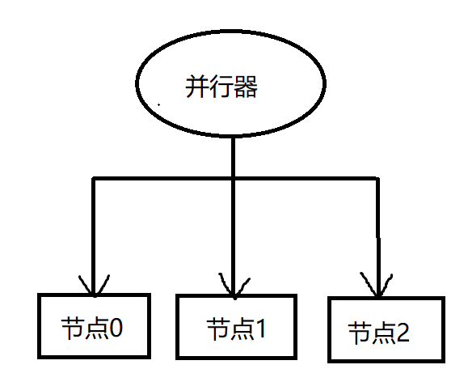](https://img2023.cnblogs.com/blog/3306371/202312/3306371-20231202083614525-239216242.png)

可这样就有问题了：

1. 怎么「同时」运行，要用多线程吗？
2. 同时执行必然会返回多个结果，该如何确定最终返回运行结果呢？

对于问题1，是不用多线程的，我们只要在一帧中把所有子节点都执行一次，就算是「同时」执行了。
对于问题2，我们可以根据需求自行设置并行器成功或失败的标准，一般可分为「全都」和「只要有一个」。
看看代码就知道了：


csharp

```csharp
public class Parallel : Composite
{
    protected Policy mSuccessPolicy;//成功的标准
    protected Policy mFailurePolicy;//失败的标准
    /// <summary>
    /// Parallel节点成功与失败的要求，是全部成功/失败，还是一个成功/失败
    /// </summary>
    public enum Policy
    {
        RequireOne, RequireAll,
    }
    //构造函数初始化时，会要求给定成功和失败的标准
    public Parallel(Policy mSuccessPolicy, Policy mFailurePolicy)
    {
        this.mSuccessPolicy = mSuccessPolicy;
        this.mFailurePolicy = mFailurePolicy;
    }
    protected override EStatus OnUpdate()
    {
        int successCount = 0, failureCount = 0;//记录执行成功和执行失败的节点数
        var b = children.First;//从第一个子节点开始
        var size = children.Count;
        for (int i = 0; i < size; ++i)
        {
            var bh = b.Value;
            if(!bh.IsTerminated)//如果该子节点还没运行结束，就运行它
                bh.Tick();
			b = b.Next;
            if(bh.IsSuccess)//该子节点运行结束后，如果运行成功了
            {
                ++successCount;//成功执行的节点数+1
                //如果是「只要有一个」标准的话，那就可以返回结果了
                if(mSuccessPolicy == Policy.RequireOne)
                    return EStatus.Success;
            }
            if(bh.IsFailure)//该子节点运行失败的情况同理
            {
                ++failureCount;
                if(mFailurePolicy == Policy.RequireOne)
                    return EStatus.Failure;
            }
        }
        //如果是「全都」标准的话，就需要比对当前成功/失败个数与总子节点数
        if(mFailurePolicy == Policy.RequireAll && failureCount == size)
            return EStatus.Failure;
        if(mSuccessPolicy == Policy.RequireAll && successCount == size)
            return EStatus.Success;
        return EStatus.Running;
    }
    //结束函数，只要简单地把所有子节点设为「中断」就可以了
    protected override void OnTerminate()
    {
        foreach(var b in children)
        {
            if(b.IsRunning)
                b.Abort();
        }
    }
}
```

至此，基础的组合节点就讲完了，但还有一些常用的组合节点，它们是在这些基础的组合节点上稍稍变形而来的。

##### 4.过滤器

过滤器，由顺序器改造而来，就是在进入子节点之前，加了些条件判断，如果不满足任意一个，就不能执行后续的子节点，此即为「过滤」。

[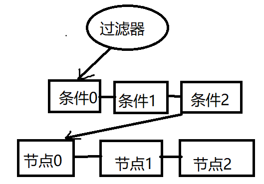](https://img2023.cnblogs.com/blog/3306371/202312/3306371-20231202093225445-1681124112.png)

你会发现，它们甚至可以直接看作是在同一个列表里，只是「条件」都在前半段，真正要运行的子节点都在后半段。代码也确实是这么设计的：


csharp

```csharp
public class Filter : Sequence
{
    public void AddCondition(Behavior condition)//添加条件，就用头插入
    {
        children.AddFirst(condition);
    }
    public void AddAction(Behavior action)//添加动作，就用尾插入
    {
        children.AddLast(action);
    }
}
```

##### 5.主动选择器

假设，某人正在砍树，但突然电锯故障了，迫不得已，他只能换斧头来砍树；但突然被扔在一旁的电锯又好起来了，那他还会继续费力的用斧子来砍树吗？

[](https://img2024.cnblogs.com/blog/3306371/202406/3306371-20240607145032977-546896905.jpg)

我想，只要他还没因为中暑把CPU干烧就不会这么做。但他如果是一个NPC的话，按照之前「选择器」的逻辑，确实会出现这种荒谬的行为。所以我们需要一个特殊的选择器，能始终执行最具优先级的子节点，甚至可以因此打断正在运行的低优先级的子节点。

我们只需对「选择器」的OnUpdate进行改造，在每次调用时，也从头到尾进行选择（默认高优先级的行为在前面）即可：


csharp

```csharp
public class ActiveSelector: Selector
{
    protected override EStatus OnUpdate()
    {
        var prev = currentChild;
        base.OnInitialize();//注意这里，currentChild 会被赋值为 children.First
        var res = base.OnUpdate();//按Selector的OnUpdate执行，顺序遍历选择
        /*
        只要不是遍历结束或可执行节点不变，都应该中断上一次执行的节点，无论优先是高是低。
        因为如果当前优先级比之前的高，理应中断之前的；
        而如果比之前的低，那就证明之前高优先级的行为无法继续了，
        否则怎么会轮到现在的低优先级的行为呢？所以也应中断它。
        */
        if(prev != children.Last && currentChild != prev)
            prev.Value.Abort();
        return res;
    }
}
```

##### 6.监视器

监视器是对「并行器」的改造，改造的目的也是为了能持续检查并行行为的条件。

[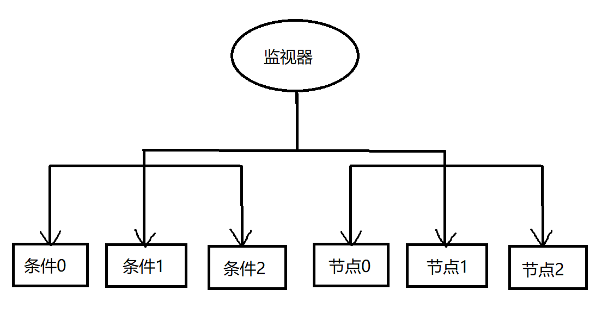](https://img2023.cnblogs.com/blog/3306371/202312/3306371-20231202110051734-775248817.png)

从逻辑上看，它有两个子树，一边负责条件，一边负责具体行为。这种分离方式是合理的，防止了同步和争用问题，因为只有一个子树将运行对世界进行更改的操作。

从代码上来说，其实它的改造方法和「过滤器」完全一致，因为我们完全可以把这两个子树看作一个，只是前半部分全是条件，后半部分全是具体动作而已：


csharp

```csharp
public class Monitor: Parallel
{
    public Monitor(Policy mSuccessPolicy, Policy mFailurePolicy)
     : base(mSuccessPolicy, mFailurePolicy)
    {
    }
    public void AddCondition(Behavior condition)
    {
        children.AddFirst(condition);
    }
    public void AddAction(Behavior action)
    {
        children.AddLast(action);
    }
}
```

终于，所有常用的组合节点我们都实现了，下面就该讲讲修饰节点了。

#### 3.修饰节点

修饰节点只有一个子节点，因为这样就足够了，想要多个条件只需要配合组合节点就可以实现。所以它的基类也十分简单：


csharp

```csharp
public abstract class Decorator : Behavior
{
    protected Behavior child;
    public override void AddChild(Behavior child)
    {
        this.child = child;
    }
}
```

修饰节点理论上可以扩展成各种「条件」，完全取决于开发者的需求。所以这里，我们就不在这方面展开，就说说几个比较实用的修饰器吧。

##### 1.取反器

简单地对子节点执行结果的「成功」或「失败」进行颠倒而已，但这小小的功能却能帮我们省去很多冗余的代码，比如有「存在敌人」的条件节点时，再想要「不存在敌人」的条件节点，就不必去写代码了，只需要在「存在敌人」前加上这样一个「取反器」就可以了。

它的实现也很简单：


csharp

```csharp
public class Inverter : Decorator
{
    protected override EStatus OnUpdate()
    {
        child.Tick();
        if(child.IsFailure)
            return EStatus.Success;
        if(child.IsSuccess)
            return EStatus.Failure;
        return EStatus.Running;
    }
}
```

##### 2.重复执行器

重复执行某（些）行为也是常见的动作需求，这些动作往往都是已实现的单一动作，例如，有了「点射」动作，我们就可以仅给它加上一个重复执行器，就可以实现「扫射」了。

重复执行器的逻辑也很直接：


csharp

```csharp
public class Repeat : Decorator
{
    private int conunter;//当前重复次数
    private int limit;//重复限度
    public Repeat(int limit)
    {
        this.limit = limit;
    }
    protected override void OnInitialize()
    {
        conunter = 0;//进入时，将次数清零
    }
    protected override EStatus OnUpdate()
    {
        while (true)
        {
            child.Tick();
            if(child.IsRunning)
                return EStatus.Running;
            if(child.IsFailure)
                return EStatus.Failure;
            //子节点执行成功，就增加一次计算，达到设定限度才返回成功
            if(++conunter >= limit)
                return EStatus.Success;
        }
    }
}
```

#### 4.动作节点

动作节点也是自由发挥的节点，具体功能随需求，但有一点要严格遵守——不能有子节点。
要实现动作节点，只要继承并重写节点基类就可以了，例如一个打印一些字的节点：


csharp

```csharp
public class DebugNode : Behavior
{
    private string word;
    public DebugNode(string word)
    {
        this.word = word;
    }
    protected override EStatus OnUpdate()
    {
        Debug.Log(word);
        return EStatus.Success;
    }
}
```

#### 5.构建与运行

节点部分我们都讲完了，现在就开始实现树的构建与运行了。

我们先实现树：


csharp

```csharp
public class BehaviorTree
{
    public bool HaveRoot => root != null;
    private Behavior root;//根节点
    public BehaviorTree(Behavior root)
    {
        this.root = root;
    }
    public void Tick()
    {
        root.Tick();
    }
    public void SetRoot(Behavior root)
    {
        this.root = root;
    }
}
```

很简短吧，实际上树只需要记录根节点就可以了，其余节点都会由各个节点用自己的子节点/子节点列表存储。这么说来，其实一个普通的节点，也可以视为一棵树吗？是的，只是将二者进行区分还是很有必要的，省得逻辑混乱。它的运行，也只是简单地递归调用子节点的Tick。当然，这只是对于简单实现的行为树来说是这样而已，至于更加成熟的实现方式（如之前提到的事件驱动的行为树）就不是这样了。

言归正传，那这只是一棵树而已，怎么向它增加节点呢？这里我们再单独造一个管理树逻辑的类：


csharp

```csharp
public partial class BehaviorTreeBuilder
{
    private readonly Stack<Behavior> nodeStack;//构建树结构用的栈
    private readonly BehaviorTree bhTree;//构建的树
    public BehaviorTreeBuilder()
    {
        bhTree = new BehaviorTree(null);//构造一个没有根的树
        nodeStack = new Stack<Behavior>();//初始化构建栈
    }
    private void AddBehavior(Behavior behavior)
    {
        if (bhTree.HaveRoot)//有根节点时，加入构建栈
        {
            nodeStack.Peek().AddChild(behavior);
        }
        else //当树没根时，新增得节点视为根节点
        {
            bhTree.SetRoot(behavior);
        }
        //只有组合节点和修饰节点需要进构建堆
        if (behavior is Composite || behavior is Decorator)
        {
            nodeStack.Push(behavior);
        }
    }
    public void TreeTick()
    {
        bhTree.Tick();
    }
    public BehaviorTreeBuilder Back()
    {
        nodeStack.Pop();
        return this;
    }
    public BehaviorTree End()
    {
        nodeStack.Clear();
        return bhTree;
    }
}
```

这样就实现了树构建，还把调用也再包装了一层。用BehaviorTreeBuilder，就可以既构建又运行了。什么？你说你不大明白里面的逻辑？我们来详细说说：

最开始用AddBehavior函数添加一个节点，它无疑会成为根：

[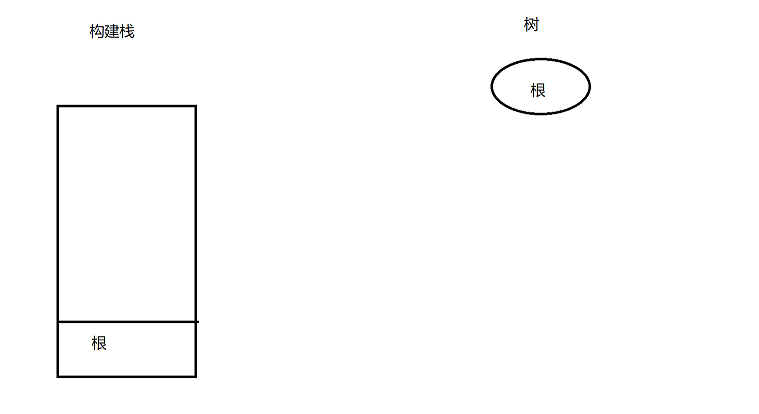](https://img2023.cnblogs.com/blog/3306371/202312/3306371-20231202123911350-1235459776.png)

再添加一个0，它会变成这样：

[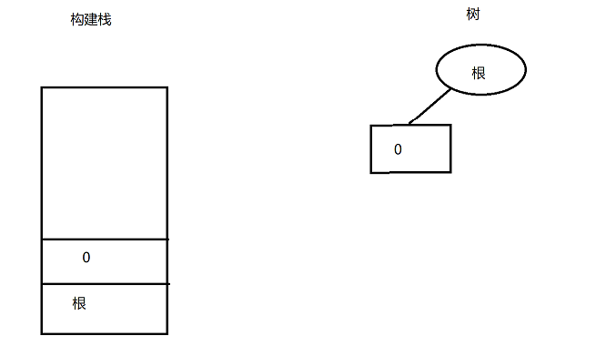](https://img2023.cnblogs.com/blog/3306371/202312/3306371-20231202124115300-145849231.png)

再添加同理：

[](https://img2023.cnblogs.com/blog/3306371/202312/3306371-20231202124326187-62553101.png)

而当我们想要为0添加第二个子节点时，只需要先调用Back，Back会使栈顶元素弹出：

[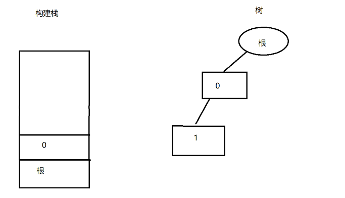](https://img2023.cnblogs.com/blog/3306371/202312/3306371-20231202124624826-233470165.png)

之后，再调用添加函数，由于该函数是向栈顶元素添加子节点，所以就变成了：

[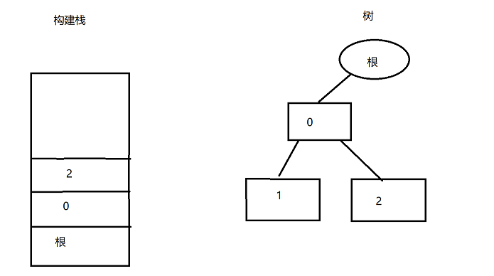](https://img2023.cnblogs.com/blog/3306371/202312/3306371-20231202124850234-1679091123.png)

通过AddBehavior和Back，我们就可以设置树的结构啦。什么？你问如果我又想给1添加子节点该怎么办？拜托￣へ￣，现在是编写阶段呢！你就直接在调用Back之前的代码里，加上给1节点添加子节点的代码呗。

配合缩进，我们可以勉强实现可视化，至少有层次感：


csharp

```csharp
public class Test0 : MonoBehaviour
{
    BehaviorTreeBuilder builder;
    private void Awake()
    {
        builder = new BehaviorTreeBuilder();
    }
    private void Start()
    {
        builder.Repeat(3)
                    .Sequence()
                        .DebugNode("Ok,")//由于动作节点不进栈，所以不用Back
                        .DebugNode("It's ")
                        .DebugNode("My time")
                    .Back()
                .End();
        builder.TreeTick();
    }
}
```

嗯？Repeat那些是什么？实际上就是对添加节点的包装，以下是该类的完整代码:


csharp

```csharp
public partial class BehaviorTreeBuilder
{
    private readonly Stack<Behavior> nodeStack;
    private readonly BehaviorTree bhTree;
    public BehaviorTreeBuilder()
    {
        bhTree = new BehaviorTree(null);
        nodeStack = new Stack<Behavior>();
    }
    private void AddBehavior(Behavior behavior)
    {
        if (bhTree.HaveRoot)
        {
            nodeStack.Peek().AddChild(behavior);
        }
        else
        {
            bhTree.SetRoot(behavior);
        }
        if (behavior is Composite || behavior is Decorator)
        {
            nodeStack.Push(behavior);
        }
    }
    public void TreeTick()
    {
        bhTree.Tick();
    }
    public BehaviorTreeBuilder Back()
    {
        nodeStack.Pop();
        return this;
    }
    public BehaviorTree End()
    {
        nodeStack.Clear();
        return bhTree;
    }
    //---------包装各节点---------
    public BehaviorTreeBuilder Sequence()
    {
        var tp = new Sequence();
        AddBehavior(tp);
        return this;
    }
    public BehaviorTreeBuilder Seletctor()
    {
        var tp = new Selector();
        AddBehavior(tp);
        return this;
    }
    public BehaviorTreeBuilder Filter()
    {
        var tp = new Filter();
        AddBehavior(tp);
        return this;
    }
    public BehaviorTreeBuilder Parallel(Parallel.Policy success, Parallel.Policy failure)
    {
        var tp = new Parallel(success, failure);
        AddBehavior(tp);
        return this;
    }
    public BehaviorTreeBuilder Monitor(Parallel.Policy success, Parallel.Policy failure)
    {
        var tp = new Monitor(success, failure);
        AddBehavior(tp);
        return this;
    }
    public BehaviorTreeBuilder ActiveSelector()
    {
        var tp = new ActiveSelector();
        AddBehavior(tp);
        return this;
    }
    public BehaviorTreeBuilder Repeat(int limit)
    {
        var tp = new Repeat(limit);
        AddBehavior(tp);
        return this;
    }
    public BehaviorTreeBuilder Inverter()
    {
        var tp = new Inverter();
        AddBehavior(tp);
        return this;
    }
}
```

你可能也注意到了，这个类是partial类，它还有另一部分内容，我将其与DebugNode写在同一处：


csharp

```csharp
public class DebugNode : Behavior
{
    private string word;
    public DebugNode(string word)
    {
        this.word = word;
    }
    protected override EStatus OnUpdate()
    {
        Debug.Log(word);
        return EStatus.Success;
    }
}
public partial class BehaviorTreeBuilder
{
    public BehaviorTreeBuilder DebugNode(string word)
    {
        var node = new DebugNode(word);
        AddBehavior(node);
        return this;
    }
}
```

个人还没想到好办法，这种包装确实好看，但要另写这样的函数属实有点繁琐。倒也可以修改AddBehavior类让它也返回BehaviorTreeBuilder，但这样在构建树时，代码会变得有些长，总之看个人选择吧。如果你的Test0能输出三次"Ok,It's My time"，那就说明你的构建没错啦。

内容到这也差不多了，个人其实还并没有正式用过这个行为树来做游戏 （所以出现问题请狠狠地拷打我，我倒也不是嫌弃它（毕竟买不起插件捏இ௰இ，好歹有个能用的），只是还有其它的行为决策方法我比较青睐，比如「分层任务网络（HTN）」，个人就用的比较多。在我个人的一些[游戏](https://dullame.itch.io/troop-mo)中就有使用到，有时间的话，也可以和大家交流下它的运行和实现。

完毕！\ (￣︶￣*\ ))


### 参考文献

[行为树(上-理论)_哔哩哔哩_bilibili](https://www.bilibili.com/video/BV18V411y7Xu?p=1&vd_source=ff929fb8407b30d15d4d258e14043130)

[游戏AI行为决策——Behavior Tree（行为树） - 狐王驾虎 - 博客园 (cnblogs.com)](https://www.cnblogs.com/OwlCat/p/17871494.html)


### Behavior Designer


## Goap

目标导向行为策略


# 未来任务


## 关于client角色控制

我们可以改变角色控制的方式，我们模仿战斗系统plus中状态机控制的方式

但是有一个问题就是：同步的角色我我们怎么优雅地控制它，使用两套状态机？

一套是ctrl,一套是sync


另外一个问题就是，怎么组织我们的entity传送的state，因为我们现在准备使用的是多层状态机

有一个大状态：空手、拿武器的、御剑飞行、载具、游泳

小状态：idle、move、jumpup、falldown、skill、hurt

小小状态：比如move中：walk、run、急停   || falldown:loop、end || hurt:start、loop、waitAttack、end

所以我们相当于需要一个三层状态机，这就需要我们的状态机+组合模式来构成它。

所以entitysync中需要有什么：大状态、小状态、小小状态分布怎么样表达才够优雅

我自己想到一个办法就是，client和server都写一个翻译器，我们传状态的时候呢我们就用数字来表达，然后再用翻译器来解读。


还有一个问题就是，角色模型需要有一个父类空对象，我们战斗系统plus中的方式来解决。


## 关于client角色动画是否使用根动画

目前的问题在于，我们sycn的的角色是否可以使用根动画来完成的。

理论上是可以的，只需要给他指令，就好像是本地控制的角色一样罢了。

但是有一个精度问题，最终可能会造成滑步和状态动画没切换等问题需要注意


## 世界观

1.白茫茫的原始场景可以保留，去往真正的世界则是需要"飞升"，当然这个飞升只是单纯的飞罢了，我们可以弄一个明显的标准，玩家一看就知道需要去往天上，所以有了飞行这个目的，这就引出了我们修仙者第一个执念：飞

2.数据化的我，已经不是我了，但是带着我的意志活下去吧。所以，在这个世界中不存在所谓的复活，有的只是数据的拷贝罢了。当然在我们这个玄幻的世界中，有的只是转生罢了，可以建造一个地府，过忘川河，喝孟婆汤，前世的一切都与你再无关系。

 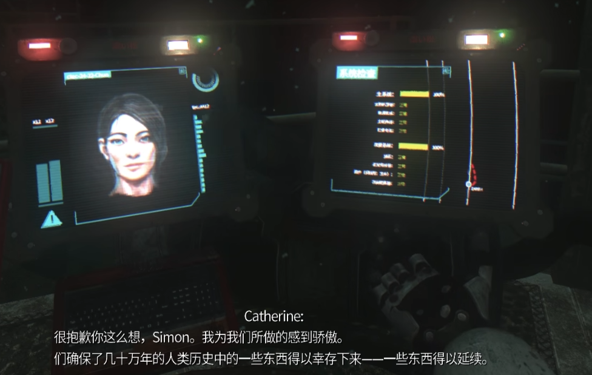 

3.现代修仙体系

坏孩子联盟

现代修仙体系

去月球


4.末日世界的想法

工会的形态以避难所展开，避难所为一个服务器，外面的世界就是开放世界了，这就需要我们考虑混服怎么解决多人联机的问题

## **符箓**

看魔法使葬送的芙莉莲中的 **菲伦的瞬发杀人魔法**，和传统观念里面那种吟唱魔法好。

还有就是关于魔力存储的问题，可以把魔力纯粹到武器中充能，然后战斗的时候将其释放，与修仙者中的符箓十分类似。

貌似误会了，这里菲伦只是将魔力收缩了，也就是扮猪吃老虎，并不是将魔力存储，不过引出符箓还是不错的。

 

 


## **跳跃下蹲行为**

​	跳跃的状态：起跳上升、fall、落地

​	问题1：
​	这三个状态需要分开，还是说放到一个jump状态内完成？

```
方案1：分开实现
方案2：不分开实现，但是jump状态需要监测actor的行为，而这些行为又是remote传送过来的，比如说怎么判断他在空中的时候是上升还是下降呢？
	这样做得需要一个标志位来判断，这样一想这个还比较麻烦一点呢。
结论：我们分开实现
```


## **技能自动索敌使用现有数据而不是碰撞体**

​	受击和眩晕的优先级,索敌的方法将碰撞体改为逻辑判断距离即可，毕竟我们同步的数据不用白不用嘛。


## **伤害跳字问题**

​	现阶段使用的这个插件比较丑陋，我们需要研究研究这个插件以达到更好的伤害数字效果


## **帧同步的demo 1000块那个**


## **redis**


## **御剑飞行**

添加人物的动作罢了，进入这个动作，关掉重力，同步y轴。 音效吧。
mode 模式，普通模式 武器模式 御剑飞行模式。。。似乎没我想得这么简单

问题1：
	需要和普通的 等待 行走 奔跑 进行区分，甚至说后面还有骑马的 、游泳的都需要区分？

```
方案1.根据不同模式下我们根据其标志来切换相应的御剑飞行等待|普通等待|游泳等待

方案2.我们需要弄分层状态机多套状态机吗：比如说不带武器的状态机、带武器的状态机、御剑飞行的状态机。
    缺点就是会类爆炸。
    所以需要弄一个fsmManager来管理多套状态机，根据人物状态flag来进行区分：0普通状态  1带武器的状态  2御剑飞行状态 3游泳状态  4骑马状态

方案3 还是使用一个状态机，但是每个状态里面细分，比如说idle状态， 里面通过 人物状态标志 委托来更换不同的执行方法。 普通状态的idle方法 带武器状态的idle方法
    这个方法如果需要添加新的状态比如开坦克，就要修改代码了，而不是热插拔了。
```

问题2：
    ctl的状态机和sync的状态机是否需要区分？
​        比如说跳跃，假设跳跃转发给服务器的代码写在state中，ctl角色需要转发因为是我们自己触发的，而sync的跳跃不需要我们转发。
​        但是上面这个问题只需要判断当前entity是不是ctl角色就行了，只是这样写会好一点吗？
​        考虑到如果分开的话就要重复写一遍其他state的逻辑，十分麻烦，所以我们用判断就行了。
​        所以得出结论，我们不需要区分这个状态机，直接复用即可。


问题3：

​	关于人物特殊状态标志的转换放在哪里完成？

    首先这个标志目前是已经存在了，放在actor中。
    输入的捕获在哪里呢？战斗管理器吗？但是战斗管理器目前是做连招和索敌的工作哎。
    
    是否需要专门的一个转换器类来完成这个工作,这个切换可以用状态机来实现喔。

问题4：

​	mode标志是放在actor还是character呢？

```
感觉现阶段的mode的行为都符合character的，普通小怪啥的有必要去切换吗？？
如果ai要做得好一些，这个东西是需要的，所以mode放在actor好了
```


## **某些动画的切换的时机和同步**

比如说起跳、fall、down，这个jump系列动作就必须告诉服务器转发了。放到响应的动作里面取发送就可以了
    关于gameentity那个类，感觉有点傻，应该进行区分：ctlgameentity  和syncgameentity，它们的功能混在一起了，看起来是否不好，并且它还有移动的功能，这就更加奇怪了。
    所以还得由一个syncmovementmanager，并且重力需要收归movementmanager来进行管理。

    所以目前的sync需要挂载：
        syncgameentity
        syncmovementmanager
        控制当前actor的状态机


## **巨人化，搞个艾尔迪亚角色**，须佐、法天相地、机甲

变身，这永远是男人的浪漫


 **1.首先是声音：**

​	巨人化时的音效我十分喜欢，

​	然后是背景音乐attack ON titan 或者 叛变神曲-YouSeeBIGGIRL/T:T

拔剑神曲 GC-βίος  

核爆神曲 AZ-aLIEz MKAlieZ  

变身神曲 巨人-at’aek ON taitn 

爆衣神曲 kill la kill-Before my body is dry  

断剑神曲 Perfect Time 

反击神曲 AZ-Keep on keeping on 

窒息神曲 AZ-BRE@TH//LESS

参考:https://www.bilibili.com/video/BV1X8411h7PJ/?spm_id_from=333.788.recommend_more_video.1&vd_source=ff929fb8407b30d15d4d258e14043130

2.然后是特效，一道炫酷的闪电，我们的镜头也需要拉长，来看到这个震撼的一幕，天空变暗。相当于过场动画吧。

特效可以找普通的闪电有现成的，然后就是那个光球了。

  


​	阿尼的变身也很好看：开机甲一样

  

 

小人->骨头和肌肉的逐渐生成->巨人。


还有枭的：

  

 


**3.变身时的爆炸效果，**

首先是闪电落下，然后是一个逐渐变大的圆球，人物就就在里面生成好了。

范围伤害啥的，超大型巨人那样的核弹不爽歪歪。

还有风的粒子效果，可以用摄像机旁边的草来衬托风的律动。


**4.然后需要讨论巨人的攻击啥的：**

​	首先得有一套动作打小人用的。


## 关于弹窗的重入问题思考

当触发某事件时需要弹出窗口进行确认，此时没有选择，又有另外一个事件触发需要弹出显示，这时我们就将旧的弹窗压栈保存，先处理新到达的弹窗。

使用栈而不是队列，可以避免比如靠近传送门时弹窗，离开传送门时弹窗这个情况。


## 死亡提示

被杀时显示凶手，显示一个大大的菜字，暗屏的遮罩。


## 关于实力外显示的讨论

在游戏中怎么样区分一个敌人的实力呢？

通常是：等级、属性等，我们可以稍微颠覆一下这个传统观念，这样就可以玩扮猪吃老虎流了。

可以有衍生出修仙者识别其他人真正实力的能力，而且也有隐藏自身修为的功夫之类的。


葬送的芙莉莲中魔力的显现也可以作为一种参考，


芙拉梅压制：

 

芙拉梅展开：

 


## 物品获取框

提示消失时fade并且向左移动

 

 


这个提示框好看，中间生成自动往上压。


## 任务提示框

任务提示不错、或者等级提升也不错

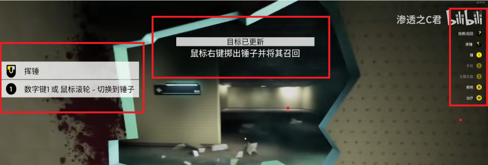

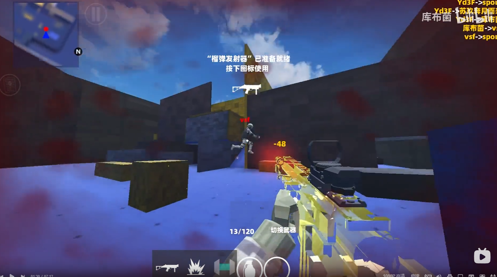


## 目标锁定的问题

z锁定，可以锁定也可以不锁定，但是锁定可以让你更容易看到目标

参考巫师3的战斗系统


普通攻击和技能施法时候是否去自动锁定这个问题：模仿黑猴需要自己锁定目标，普攻和技能才会自动转向。


## 音响技能

主动开音响，比如变身巨人时的叛变神曲，关键是怎么让他和变身技能配合呢？

想到了，这个音乐当做前摇，播放到指定的时间才能出发变身状态。

那要不要找一个变身期间的音乐当做持续时间呢？嘻嘻，想想都爽啊。

别人：快，快去关掉他的音响。
