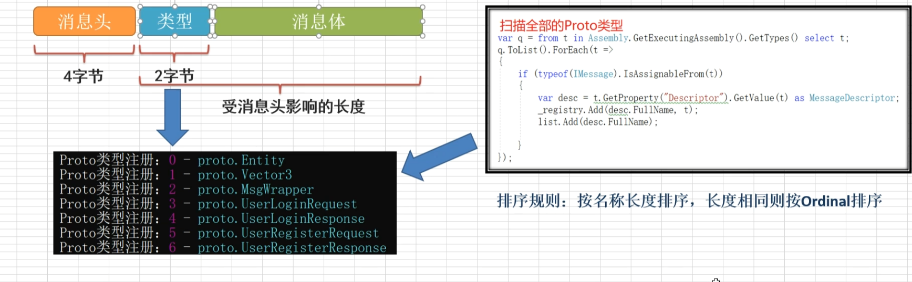
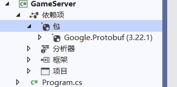

# BUG

## 1.客户端已断开服务器却收不到

**异常情况：丢包、系统蓝屏、客户端崩溃、unity后台异步任务没结束 ，这些情况服务器是无法知道的**


基于控制台的客户端，关闭时会触发系统关闭消息，会执行socket.Close();

在unity中停止调试的时候，主线程已经关闭了，但是负责网络连接的子线程异步任务没有关闭，	

处理方法：

**在客户端退出调试的时候关闭socket即可，OnApplicationQuit是unity内置的函数，重写即可。**

```
    private void OnApplicationQuit()
    {
        NetClient.Close();
    }
    
     public static void Close()
    {
        try
        {
            conn?.Close();
        }
        catch
        {

        }
    }
```


## 2.服务器控制台点击时会卡住

在c#的控制台应用程序中，当用户选中控制台中的文本时，标准输出流就会被暂停，这会影响程序的输出

解决方法：

1.摁F5刷新或者敲回车就可以正常运行了

2.使用异步的输出，程序就不会因为打印日志而阻塞正常运行


## 3.注意客户端的场景切换问题

可能会导致某些信息在场景切换后丢失了


# 丛林战争

## 游戏服务器端开发小框架

1.Server

创建tcp-socket，监听客户端连接

2.ConnHelper

工具类，用来连接数据库

3.Controller

处理客户端的请求

4.Model

实体类，一个实体类对应一个数据库表

5.Dao

data access object 数据访问对象，进行数据库增删改查操作


## 服务器端架构

.png)


## 客户端架构

.png)

## 通信逻辑


### 请求

controllerManager根据requestcode找到处理对应请求的controller（例如处理用户登录userController）

然后利用反射机制，根据actioncode来调用对应controller种的的方法来处理请求，最后响应回去


### 响应

客户端这里只有各种各样request，这些request存放到一个map集合种<actionCode,request>

每当一个响应回来，会根据actioncode调用相对应的request类来处理这个响应

一个requeset种默认有sendRequest和onresponse俩个方法来处理请求和响应


## 同步获取连接和接收消息

```
 void startServerSync()
        {

            Socket serverSocket = new Socket(AddressFamily.InterNetwork, SocketType.Stream, 							ProtocolType.Tcp);
            //本机ip 127.0.0.1
            // IpAddress xxx.xxx.xxx.xx  IpEndPoint xx.xx.xx.xx:port
            IPAddress iPAddress = IPAddress.Parse("127.0.0.1");
            IPEndPoint iPEndPoint = new IPEndPoint(iPAddress, 8888);
            serverSocket.Bind(iPEndPoint);//绑定IP和端口
            //开始监听端口号，参数为处理连接的队列最大个数，如Listen(10)即等待处理的连接为10个
            serverSocket.Listen(0);
            Socket clientSocket = serverSocket.Accept();//接收一个客户端连接

            //向客户端发送消息
            string msg = "hello client! 你好...";
            byte[] bytes = System.Text.Encoding.UTF8.GetBytes(msg);
            clientSocket.Send(bytes);

            //接收一条客户端的消息
            byte[] buffer = new byte[1024];
            int count = clientSocket.Receive(buffer);
            string msg2 = System.Text.Encoding.UTF8.GetString(buffer, 0, count);
            Console.WriteLine(msg2);

            clientSocket.Close();//关闭与客户端的连接socket
            serverSocket.Close();//关闭自身服务端的socket

            Console.ReadKey();
        }
```


## 异步获取连接、接收消息

```
static void startServerAsync()
        {

            Socket serverSocket = new Socket(AddressFamily.InterNetwork, SocketType.Stream, 			   				ProtocolType.Tcp);
            //本机ip 127.0.0.1
            // IpAddress xxx.xxx.xxx.xx  IpEndPoint xx.xx.xx.xx:port
            IPAddress iPAddress = IPAddress.Parse("127.0.0.1");
            IPEndPoint iPEndPoint = new IPEndPoint(iPAddress, 7777);
            serverSocket.Bind(iPEndPoint);//绑定IP和端口
            //开始监听端口号，参数为处理连接的队列最大个数，如Listen(10)即等待处理的连接为10个
            serverSocket.Listen(0);

            Console.WriteLine("服务器已启动:"+DateTime.Now);
            
            serverSocket.BeginAccept(AcceptCallBack, serverSocket);

        }

        //异步接收连接
        static void  AcceptCallBack(IAsyncResult ar)
        {
            //获取与客户端连接的socket
           Socket serverSocket =  ar.AsyncState as Socket;
            Socket clientSocket =  serverSocket.EndAccept(ar);

            //控制台输入
            Console.WriteLine("接收到来自【" + ((IPEndPoint)clientSocket.RemoteEndPoint).Address +":"+ 					((IPEndPoint)clientSocket.RemoteEndPoint).Port+ "】的连接");

            //向客户端发送一条问候消息
            string msg = "hello client connecte success! 你好...";
            byte[] bytes = System.Text.Encoding.UTF8.GetBytes(msg);
            clientSocket.Send(bytes);

            //开始接收客户端的数据传递
            //第5个参数是一个委托，第6个参数是回调函数的参数。回调函数可以通过ar的AsyncState来获取
            clientSocket.BeginReceive(dataBuffer, 0, 1024, SocketFlags.None, ReceiveCallBack, clientSocket);

            //尾递归，让其循环接收连接，等待下一个客户端连接
            serverSocket.BeginAccept(AcceptCallBack, serverSocket);

        }

        //服务端消息缓存
        static byte[] dataBuffer = new byte[1024];

        //异步接收消息
        static void ReceiveCallBack(IAsyncResult ar)
        {

            Socket clientSocket = null;

            try
            {
                clientSocket = ar.AsyncState as Socket;
                int count = clientSocket.EndReceive(ar);//count表示接收了多少个字节的数据

                //如果count为0就说明客户端关闭了
                if(count == 0)
                {
                    Console.WriteLine("【"+((IPEndPoint)clientSocket.RemoteEndPoint).Address + ":" + 						((IPEndPoint)clientSocket.RemoteEndPoint).Port +"】已断开连接");
                    clientSocket.Close();
                    return;
                }

                string msg = System.Text.Encoding.UTF8.GetString(dataBuffer, 0, count);
                Console.WriteLine("接收到来自【" + ((IPEndPoint)clientSocket.RemoteEndPoint).Address +":"+ 					((IPEndPoint)clientSocket.RemoteEndPoint).Port+ "】的长度为"+ count + "消息："+msg);

                //尾递归，让其循环接收消息
                clientSocket.BeginReceive(dataBuffer, 0, 1024, SocketFlags.None, ReceiveCallBack, 							clientSocket);
            }
            catch (Exception e)
            {
                Console.WriteLine(e);
                //发生异常就关闭连接
                if (clientSocket != null)
                {
                    clientSocket.Close();
                }
            }

        }
```


## 绑定连接的Socket获取IP

```
Socket newSocket = socket.Accept(); 
IPEndPoint clientipe = (IPEndPoint)newSocket.RemoteEndPoint;
Console.WriteLine("[" + clientipe.Address.ToString() + "] Connected");
端口

clientipe.RemoteEndPoint).Port
```


## 游戏人物位置和状态同步

处理本机持有的角色以外，其他客户端的映射到本机的游戏对象都是不需要挂载控制脚本的

全部由一个playermanager来处理这个映射对象的位置和状态的更新


客户端不断发送位置信息（本机持有的角色）到服务端进行更新

服务端会保存这个位置信息（服务端会保存所有人的位置信息）

服务端定时将全部人的信息广播发送到全部客户端让他们更新全部人的位置


## 游戏射击时的同步

以子弹为例子：

现在本地客户端处理发射的逻辑后，发送一个同步射击的请求（就是本机自己发送的子弹的信息）到服务端

服务端就会转发这个数据到各个客户端

其他客户端会根据子弹的类型、位置去实例化这一颗子弹，从而到达同步的目的


## 伤害同步

客户端不处理自己人物的扣血逻辑，让服务端控制本机人物的血量

客户端处理射中敌人，当自己的子弹射中敌人就向服务端发送一个请求，让服务端处理这次扣血的逻辑，然后广播所有人的血量信息

（客户端只会收到自己的血量）


## 如何部署到阿里云服务器

1.买服务器（用windows的操作系统 ），配置安全组端口

2.mstsc远程连接到服务器

3.按照mysql（这个麻烦）

下载mysql的msi程序包


Server和Connector/NET这两个要添加


Workbench是用来管理数据库的


4.将服务器项目进行发布

todo


5.注意公网ip和私网ip的使用

公网ip和私网ip是有映射关系的

**客户端连接服务端和发送消息都是用的用公网ip**，**然后映射到私网ip去给服务端发送连接请求和消息**

**服务端接收连接和接发消息都是用的私网ip**，根据私网ip映射到公网ip，然后在找到客户端；


云服务器中只有一个内网网卡，外网地址不是直接配置在服务器中的，而是配置在服务器外层的网关上，做了一层映射转发。程序是无法绑定公网ip地址的


# 服务器架构

## 参考


Switch Fabric:交换机结构，用于区分不同的请求，送入到不同的服务器当中进行处理

Loginapp:登录服务器，会有几台服务器来处理用户的登录请求 ，等你登录成功后就会进入Baseapp

Baseapp:基础服务器，想一些不需要空间坐标，像一些工会、拍卖行这些都可以用baseapp进行处理

如果涉及到空间坐标的,就会用到Cellapp:地图服务器


**网关服务器**：用于与外界进行沟通，比如说我们游戏登录以后要选择后一个服，例如广东一区连接进去 ，它实际上连接的就是网关服务器，它有一个固定的ip地址，让客户端能直接找到它连接。

连接网关服务器以后，他会跟你你要干的事情进行转发，比如说你要登录的话，他就会给你转发到**登录服务器**，在这里处理你的登录服务和认证服务（qq这种第三方认证）

等你登录成功了，就可以通过**游戏服务器**去加载一些没有三维坐标的，没有空间坐标的东西，包括你的个人信息，游戏角色角色列表，工会，拍卖行，世界频道。

如果你涉及到了空间坐标的，你要做不同的场景，一个主城城镇，这时候就可以使用**地图服务器**，连接地图服务器，使用里面的地图服务。

**战斗服务器**：提供战斗服务，比如说你的生命值，你扣多少血，你身上有多少技能，技能冷却。

**存储服务器**：数据库，存放数据

**缓存服务器**：将常用的数据放到这 


以上其实称为：**分布式远程调用**


## MMO系统设计

mmo:Massively Multiplayer Online大型多人在线游戏


网络：服务器如何进行通信，要开发客户端服务端 

存储：用户的信息啊，...

日志：记录异常信息，特殊信息，方便出问题时查找定位


AOI：Area Of Interest 一个很大的地图当中，你不能把所有的信息都同步给玩家，它只需要得到他视野附近的人就可以了，不需要将全部人都加载进来 

同步：同步基本信息，位置，方向角度，动画

地图：每个玩家都是共享的

副本：

聊天：私聊，世界频道

战斗：角色属性，角色状态：死亡


**上面这些都是都是网游都有的功能**


## 项目模块s

将代码封装好我们就可以事半功倍


### 1.通用模块

例如：封装一个json数据，数据转换，一些经常用到的，写什么功能都能够直接去调用它，直接拿来用


### 2.网络模块

数据通信的东西将其封装好，我们只关注数据发过去和接收回来，不考虑底层实现


### 3.数据加载

就比如说是一些技能数据，常用的一些表格加载到游戏当中


### 4.配置解析

比如说一些屏幕分辨率，音量，一些常见的属性，我们都可以放到配置里面

配置如何解析呢？我们也可以封装成一个模块可以拿过来直接用。


### 5.DB模块

服务端可以快速地连接到数据库，对数据库进行增删改查。


# TCP连接和缓冲区


**flush**命令可以主动强行提交缓冲区的数据（即使没有满）


## 粘包和分包

Sticky  unpacking 

是利用socket在tcp协议下内部的优化机制(等缓冲区满了在打包发送)

粘包：可能会将几条消息打包成一条消息，但是客户端只会接收一条消息

分包：当数据量很大的时候就可能会将一条消息分为几条消息发送

最终会产生以下四种情况：

 


### 解决方法

1.固定长度，比如100字节大小，如果不足100字节可以通过补0或空等，进行填充到指定长度。通常不用

**2.末尾固定分隔符**，例如：\r\n。如果发生拆包需要等待多个包发生过来之后再找到其中的\r\n进行合并

 **3.将消息分为头部和消息体**，头部中保存整个消息的长度，只是读取到足够长度的消息后才算是读到一个完整的消息。最常用


其中头部占用的空间长度是固定的，例如说4个字节作为消息头。


### 用到的api

**字节转换**

1.字符串转换成字节数组：

```
System.Text.Encoding.UTF8.GetBytes; 
```

2.Int32转换成字节数组BitConverter.GetBytes（int）;//变为对应类型长度的byte[],这里变位4个字节长度的

​										BitConverter.ToInt32//取字符数组中前4个字节

3.从字符数组转换string

```
string s = Encoding.UTF8.GetString(dataBuffer, 12,count-8);
```


**byte[]合并**

CopyTo

```
        public static byte[] addBytes(byte[] data1, byte[] data2)
        {
            byte[] data3 = new byte[data1.Length + data2.Length];
            data1.CopyTo(data3, 0);
            data2.CopyTo(data3, data1.Length);
            return data3;
        }
```

Array.Copy

```
byte[] byteAll = new byte[bytes1.Length + bytes2.Length];
Array.Copy(bytes1, 0, byteAll, 0, bytes1.Length);
Array.Copy(bytes2, 0, byteAll,bytes1.Length, bytes2.Length);
```

Concat

```
using System.Linq;

byte[] data1 = new byte[8000];
byte[] data2 = new byte[2000];
data1 = data1.Concat(data2).ToArray();
```


**输出字符数组**

```
Console.WriteLine(BitConverter.ToString(head));
```


# 网络服务端工作原理


并且连接不能断掉，如果连接断了，就说明这个人掉线了。


 **监听器**：它要绑定在一个端口上，客户端连接的时候就是通过ip和端口号直接连接过来，连接到监听器之后，监听器是不给你处理数据的，它只是在这里监听等着你连接进来而已，然后监听器会将连接交个线程进行处理。

**线程池**：监听器将接收的连接交给某个线程（哪一个空闲就给哪个，如果都在忙就稍后再处理 ），所以说是由线程池和客户端保持联系，进行数据通信。 如果你cup有8个线程，那么同一时间就只能有8个线程运行。


# c#项目的创建和管理


**创建一个控制台程序和一个类库（用于保存服务端和客户端通用的代码）**


## **1.使用控制台应用GameServer**

.Net5 /6都可以

**编写服务端独有的功能**

例如：

网络服务NetService


## 2.类库common，将其添加到控制台程序的引用当中

**服务端和客户端通用的代码**

例如：

**通用的网络模块**Network，**通用的工具类**都可以放到这个common当中

**单例模式Singeton**,因为是经常使用的。以后任何一个类你想要支持单例，就可以让其使用这个

```c#
这里不支持线程安全
public class Singleton<T> where T:new()
{
	private static T m_Instance;
	public static T Instance
	{
		get{
			if(m_Instance == null)
			{
				m_Instance = new T();
			}
			return m_Instance;
		}
	}
}


.NET支持的类型参数约束有以下五种：
where T : struct                               | T必须是一个结构类型
where T : class                                | T必须是一个Class类型
where T : new()                               | T必须要有一个无参构造函数
where T : NameOfBaseClass          | T必须继承名为NameOfBaseClass的类
where T : NameOfInterface             | T必须实现名为NameOfInterface的接口
```

使用时

```
//NetService继承singeton
public class NetService : Common.Singeton<NetService>
{

}

static void Main(string[] args){
	NetService.Instance........//这样就能使用了
}

```


# 异步连接（todo）


## 同步和异步


当我们使用Socket进行网络通信时，我们需要发送和接收数据，这些操作可以使用同步方式和异步方式进行。

在**同步模式**下，发送和接收数据的操作是阻塞的，也就是说程序会一直等待操作完成之后才会执行下一条语句。例如，当我们使用 `Socket.Send` 方法发送数据时，程序会一直等待数据发送完毕之后才会执行下一条语句。同样地，在接收数据时，程序会一直等待数据接收完毕之后才会执行下一条语句。这种方式下，程序会被阻塞，直到操作完成。

在**异步模式**下，发送和接收数据的操作是非阻塞的，也就是说程序不会等待操作完成就会继续执行后续代码。例如，在使用 `Socket.BeginSend` 方法发送数据时，程序会立即返回，而不会等待数据发送完毕。同时，程序会通过回调函数或事件来通知操作的完成情况。这种方式下，程序不会被阻塞，可以继续执行其他操作。

需要注意的是，使用异步方式进行网络通信需要编写异步回调函数或者使用异步事件，相对于同步方式来说，它更加复杂。但是，异步方式在高并发和网络延迟较高的情况下，可以提高程序的性能和响应速度。

综上所述，同步和异步方式是指数据的传输方式，而不是代码的执行方式。在Socket编程中，通常使用异步方式进行网络通信。


## 两种异步方式

C#异步接收有两套API，分别是：

1、 AcceptAsync

无论循环接收多少次，都是重复利用同一个对象（SocketAsyncEventArgs）

2、Begin+End模式 

每次循环都会创建新的异步结果对象(IAsyncResult)


## 异步操作和异步方法是不同的概念。

异步操作是指在执行某个操作时，不会阻塞当前线程，而是将操作放到另外一个线程或者线程池中执行，当操作完成后，通过回调或者等待的方式通知主线程。

异步方法是一种特殊的方法，它使用异步操作实现某个功能。异步方法可以使用 `async` 关键字进行声明，并且可以在其中使用 `await` 关键字等待异步操作完成。

需要注意的是，异步方法不一定都是异步操作，可能会包含同步操作。而异步操作也不一定需要使用异步方法来调用，可以使用回调或者任务的方式进行调用。


**当我们使用异步方法时，方法本身不会阻塞主线程**，而是在后台创建了一个新的线程去执行耗时操作，然后立即返回一个 Task 对象，以便程序可以继续执行其他操作，同时 Task 对象会保存异步操作的状态和结果。当异步操作完成后，它会自动通知 Task 对象，然后我们可以使用 await 关键字获取异步操作的结果，而不必等待异步操作完成。

举个例子，假设我们要从网上下载一张图片，并在下载完成后显示在 UI 上。如果我们使用传统的同步方法来下载图片，那么代码可能会像这样：

```
public void DownloadImage()
{
    var client = new WebClient();
    var bytes = client.DownloadData("http://example.com/image.jpg");
    var bitmap = new Bitmap(new MemoryStream(bytes));
    pictureBox.Image = bitmap;
}
```

这样的代码在执行下载操作时会阻塞主线程，直到下载完成才能继续执行下面的代码。


而如果我们使用异步方法来下载图片，代码可能会像这样：

```
public async Task DownloadImageAsync()
{
    var client = new WebClient();
    var bytes = await client.DownloadDataTaskAsync("http://example.com/image.jpg");
    var bitmap = new Bitmap(new MemoryStream(bytes));
    pictureBox.Image = bitmap;
}

```

在这个例子中，我们使用了异步方法 `DownloadDataTaskAsync` 来下载图片，它返回一个 Task<byte[]> 对象。我们使用 await 关键字来等待异步操作完成，并获取下载的字节数组。在下载完成后，我们创建一个 Bitmap 对象并将其显示在 PictureBox 控件中。

使用异步方法的好处是，它不会阻塞主线程，可以使程序更加流畅和响应，同时也可以更方便地处理异步操作的结果。


## AcceptAsync


### 与beginAccept的区别：

`BeginAccept` 和 `AcceptAsync` 都是用于在**异步方式下接受传入的连接请求的方法**，但是它们有一些区别。

**`BeginAccept` 方法**使用 .NET 的经典异步编程模型（APM）实现，需要一个 `AsyncCallback` 委托参数来指定当接受操作完成时所调用的回调方法。这个回调方法需要调用 `EndAccept` 方法来获取实际的 `Socket` 对象并结束操作。这种方式的缺点是，需要创建额外的回调方法，需要使用 `IAsyncResult` 对象来传递状态信息，并且可能需要进行线程切换。这些都增加了编码和调试的难度。

**`AcceptAsync` 方法**使用 .NET 异步编程模型（TAP）实现，不需要使用回调方法或 `IAsyncResult` 对象。取而代之的是，`AcceptAsync` 返回一个 `Task<Socket>` 对象，表示异步操作的结果。这个 `Task` 对象可以使用 `await` 关键字来等待异步操作完成。使用 TAP 模型的好处是代码更加简单和清晰，不需要回调方法，不需要管理状态对象，而且可以更容易地处理异常情况。

总的来说，如果你正在编写异步代码，并且使用的是支持 TAP 的版本的 .NET Framework 或 .NET Core，那么 `AcceptAsync` 可能更适合你。如果你使用的是较旧版本的 .NET Framework 或者更喜欢经典的 APM 模式，那么 `BeginAccept` 可能更适合你。


### 定义

`AcceptAsync()` 是 .NET Framework 中 Socket 类的异步方法之一，用于异步接受传入的网络连接请求。该方法会立即返回一个表示异步操作的 `Task<Socket>` 对象，而不会阻塞当前线程，从而使程序可以继续执行其他操作。

在调用 `AcceptAsync()` 方法后，如果有客户端连接请求到达，该方法将返回一个表示新连接的 `Socket` 对象。否则，该方法将在连接请求到达时才返回，并且返回的 `Socket` 对象将为 `null`。

以下是一个简单的示例，演示如何使用 `AcceptAsync()` 方法来异步接受客户端连接请求：

```
async Task AcceptClientAsync(Socket listener)
{
    while (true)
    {
        Socket client = await listener.AcceptAsync();
        // 处理客户端连接
    }
}

```

在这个示例中，`AcceptClientAsync()` 方法是一个异步方法，它接受一个 `Socket` 对象作为参数，表示要接受连接请求的监听器。

在 `AcceptClientAsync()` 方法中，我们使用一个无限循环来不断接受客户端连接请求。在每次循环中，我们调用 `AcceptAsync()` 方法来异步接受连接请求，并使用 `await` 关键字等待异步操作的完成。如果有连接请求到达，`AcceptAsync()` 方法将返回一个表示新连接的 `Socket` 对象，我们可以在该对象上执行后续的操作。如果没有连接请求到达，`AcceptAsync()` 方法将一直等待，直到有连接请求到达。

总之，`AcceptAsync()` 是一个用于异步接受网络连接请求的方法，它可以帮助我们实现高效的异步网络编程。


### 例子：


```
		public void Start()
        {
            if (!IsRunning)
            {
                serverSocket = new Socket(AddressFamily.InterNetwork, SocketType.Stream, ProtocolType.Tcp);
                serverSocket.Bind(endPoint);
                serverSocket.Listen(20);
                Console.WriteLine("开始监听端口：" + endPoint.Port);

                SocketAsyncEventArgs args = new SocketAsyncEventArgs();//这玩意可以复用
                args.Completed += OnAccept;//当有用户的连接时执行该方法

                serverSocket.AcceptAsync(args);//异步接收


            }
        }
        
         private void OnAccept(object sender, SocketAsyncEventArgs e)
        {
            //有人连接进来
            if (e.SocketError == SocketError.Success)
            {
                Socket socketClient = e.AcceptSocket;
                if (SocketConnected != null)
                {
                    //通过委托把这个socket送出去
                    SocketConnected(this, socketClient);
                }
            }
            

            //继续接收下一位
            e.AcceptSocket = null;
            serverSocket.AcceptAsync(e);
        }
```

在使用 `AcceptAsync` 方法时，**主线程不会被阻塞在 `AcceptAsync` 方法调用处**，而是会立即返回并继续执行后面的代码。**这是因为 `AcceptAsync` 方法是一个异步方法，会启动一个新的线程在后台监听连接请求，而不会阻塞当前线程。**

当有新的客户端连接进来时，后台线程会自动触发 `OnAccept` 回调函数来处理连接请求，该函数中的代码会被执行。在这个函数中，我们可以通过 `SocketAsyncEventArgs` 的参数来获取连接的客户端信息，并进行相应的处理。因此，我们并不需要在主线程中一直等待客户端的连接请求，而是可以使用异步方式来监听客户端连接，并在连接请求到来时自动触发回调函数来处理连接请求。

总之，使用异步方式可以让主线程不被阻塞，同时也能够及时响应客户端的请求。


主线程在调用 `AcceptAsync` 方法后会立即返回并且不会阻塞在该方法处，而是让其他线程来处理连接请求。在执行 `AcceptAsync` 方法时，底层的操作系统会为该方法分配一个线程来监听连接请求，当有新的客户端连接请求到来时，该线程会触发对应的事件，如 `OnAccept` 回调函数，来通知主线程有新的客户端连接请求。

这种异步方式可以让主线程不被阻塞，从而提高系统的并发处理能力和响应速度。因为主线程不需要一直等待连接请求的到来，而是可以继续执行其他任务，当有新的连接请求到来时，再通过回调函数来处理请求。

需要注意的是，在使用异步方式时，我们需要特别关注线程安全和资源的释放，以避免出现多线程竞争或资源泄漏等问题。在上面的示例代码中，可以看到在 `OnAccept` 回调函数中通过 `lock` 语句块来保证多线程安全，同时在处理完连接请求后需要释放相关资源，以避免资源泄漏。


## await

`await` 是 C# 中的一个关键字，用于在异步方法中等待异步操作完成。

**使用 `await` 的作用是等待异步方法的返回结果**

在异步方法中，**如果要等待一个异步操作完成后再继续执行后续的代码，就需要使用 `await` 关键字**。当遇到 `await` 关键字时，**异步方法会将控制权交回给调用方，直到异步操作完成为止**。当异步操作完成后，异步方法会从 `await` 语句处继续执行后续的代码。


使用 `await` 的效果类似于阻塞，但实际上它并不会阻塞当前线程。当程序执行到 `await` 时，会先让出当前线程的执行权，然后等待异步操作完成。一旦异步操作完成，程序会再次将执行权返回给当前线程，让它从 `await` 语句后面的代码开始继续执行。在这个过程中，当前线程并没有被阻塞，它可以去处理其他任务，或者让其他线程来处理任务。因此，使用 `await` 可以让程序更加高效地利用计算资源。


例如，在以下示例中，`DownloadAsync` 方法是一个异步方法，它会下载指定 URL 的内容。在方法中使用 `await` 关键字来等待 `HttpClient.GetStringAsync` 方法完成。

```
async Task<string> DownloadAsync(string url)
{
    var httpClient = new HttpClient();
    string result = await httpClient.GetStringAsync(url);
    return result;
}
```

在这个示例中，当执行到 `await httpClient.GetStringAsync(url)` 语句时，`DownloadAsync` 方法会将控制权交回给调用方，并在后台等待 `httpClient.GetStringAsync(url)` 完成。当异步操作完成后，`DownloadAsync` 方法会从 `await` 语句处继续执行后续的代码，最终返回下载的结果。

总的来说，`await` 关键字是异步编程中非常重要的一部分，可以让我们编写更加简单和易读的异步代码。


例子2：

```
async Task DoWorkAsync()
{
    string result = await DownloadAsync("https://www.example.com");
    // 使用下载的结果进行后续操作
}

async Task<string> DownloadAsync(string url)
{
    var httpClient = new HttpClient();
    string result = await httpClient.GetStringAsync(url);
    return result;
}

```

在这个示例中，调用方会等待 `DoWorkAsync` 方法完成，而 `DoWorkAsync` 方法中的 `await DownloadAsync("https://www.example.com")` 语句会等待异步方法 `DownloadAsync` 的完成，并获取下载的结果。当异步方法完成后，`DoWorkAsync` 方法会从 `await` 语句处继续执行后续的代码，使用下载的结果进行后续操作。

总的来说，无论是在异步方法中等待异步操作完成，还是在调用异步方法时等待异步方法的完成，都可以使用 `await` 关键字来等待异步操作的完成，并在完成后继续执行后续的代码。


**使用`await`并不是阻塞程序的执行，而是让程序能够更好地利用等待异步操作完成的这段时间**。当执行到`await`关键字时，**异步方法会立即返回一个未完成的`Task`对象，然后程序会将执行权返回给调用方**，让调用方可以继续执行其他的操作，而不必等待异步方法执行完成。当异步操作完成后，程序会再次将执行权返回给异步方法所在的线程，然后执行`await`关键字后面的代码。

相比于阻塞程序的执行，使用`await`可以让程序更加高效地利用等待异步操作完成的这段时间，避免了线程的阻塞和资源的浪费，同时也提高了程序的响应性和并发性能。因此，`await`是异步编程中非常重要的一种技术手段，能够使程序更加高效和健壮。


**如果调用方在异步操作执行完之前就完成了程序，会发生什么情况**

如果调用方在异步操作执行完之前就完成了程序，那么异步操作会继续在后台执行，直到完成或者抛出异常。这是因为异步操作本身就是在另一个线程中执行的，而不是在调用方的线程中执行的。当调用方完成程序后，程序会结束调用方所在的线程，但并不会影响异步操作所在的线程。**如果异步操作执行完成并且有结果返回，那么这个结果可能会被忽略或者丢失，因为调用方已经退出了程序，无法处理这个结果**。如果异步操作抛出异常，那么这个异常可能会被记录下来或者被忽略，取决于异步操作的具体实现和程序的配置。因此，在异步编程中，需要注意异步操作的生命周期和程序的退出条件，以避免出现不必要的错误和异常情况。


### 异步方法返回的结果可以通过多种方式传递给主线程。常见的方式有：

1. 使用 `await` 关键字获取异步方法的返回值。这种方式会阻塞当前线程直到异步方法返回结果。
2. 使用回调函数传递异步方法的返回值。可以在异步方法中指定一个回调函数，在异步操作完成后自动调用该回调函数，并将结果作为参数传递给回调函数。
3. 使用事件通知传递异步方法的返回值。可以在异步方法中定义一个事件，异步操作完成后触发该事件并将结果作为事件参数传递给事件处理程序。

无论使用哪种方式，最终都可以将异步方法返回的结果传递给主线程，以供主线程使用。需要注意的是，如果使用异步方法返回的结果来更新UI界面或进行其他耗时的操作，最好在主线程中执行，以避免出现线程冲突等问题。可以使用 `Dispatcher.Invoke` 方法或 `Task.Run` 方法将操作切换到主线程中执行。


## async Task

`async Task` 是 C# 中的异步方法的定义格式之一。

在 C# 中，异步方法可以使用 `async` 关键字来定义，异步方法的返回类型可以是 `Task`、`Task<T>` 或 `ValueTask<T>`。其中，`async Task` 表示异步方法返回的是一个不带返回值的 `Task` 对象，而 `async Task<T>` 表示异步方法返回的是一个带返回值的 `Task<T>` 对象。

例如，在以下示例中，`DoWorkAsync` 方法是一个异步方法，它返回一个 `Task` 对象。

```
async Task DoWorkAsync()
{
    // 异步操作
}
```

在这个示例中，`DoWorkAsync` 方法使用 `async` 关键字来定义为异步方法，返回类型为 `Task`，表示该方法返回一个不带返回值的 `Task` 对象。

异步方法可以使用 `await` 关键字来等待异步操作的完成，并在完成后继续执行后续的代码。例如，在以下示例中，异步方法 `DoWorkAsync` 中的 `await Task.Delay(1000)` 语句会等待 1 秒钟后继续执行后续的代码。

```
async Task DoWorkAsync()
{
    // 异步操作
    await Task.Delay(1000);
    // 异步操作完成后继续执行后续的代码
}
```

总的来说，`async Task` 是异步方法中常用的返回类型之一，表示异步方法返回的是一个不带返回值的 `Task` 对象，可以使用 `await` 关键字等待异步操作完成，并在完成后继续执行后续的代码。


## 不带返回值的 Task 对象

在 C# 中，`Task` 是一个表示异步操作的类型，它用于封装异步操作的执行结果。

`Task` 类型是一个泛型类型，它可以是带返回值的 `Task<T>` 类型，也可以是不带返回值的 `Task` 类型。当异步方法不需要返回值时，可以使用不带返回值的 `Task` 类型。

一个不带返回值的 `Task` 对象表示异步方法的执行结果不需要返回值，只需要通知调用方异步方法已经完成。调用方可以使用 `Task` 对象来等待异步方法的完成，但是无法从 `Task` 对象中获取异步方法的返回值。

例如，在以下示例中，异步方法 `DoWorkAsync` 返回一个不带返回值的 `Task` 对象。

```
async Task DoWorkAsync()
{
    // 异步操作
}
```

在这个示例中，`DoWorkAsync` 方法返回一个不带返回值的 `Task` 对象，表示异步方法的执行结果不需要返回值。调用方可以使用 `Task` 对象来等待异步方法的完成，但是无法从 `Task` 对象中获取异步方法的返回值。

当异步方法的返回值不需要使用时，可以使用不带返回值的 `Task` 对象，这样可以更加简洁地表示异步方法的返回结果，并减少不必要的开销。


## SocketAsyncEventArgs

`SocketAsyncEventArgs` 是用于异步套接字操作的 .NET 类，它提供了一种灵活和高效的方式来执行异步套接字操作。使用 `SocketAsyncEventArgs` 对象，**可以实现可重用的异步套接字操作，并且可以在操作完成后重用该对象来执行另一个异步操作，从而避免频繁地分配和回收对象。**


### 属性

`SocketAsyncEventArgs` 类是用于进行异步套接字操作的辅助类，它包含了许多与异步操作相关的属性，这些**属性可以在异步操作完成时获取操作的结果和状态，以及设置操作的参数和缓冲区**等。以下是一些常用的 `SocketAsyncEventArgs` 属性：

- `AcceptSocket`：**获取或设置接受到的套接字对象。**
- `ConnectSocket`：获取或设置连接的套接字对象。
- `RemoteEndPoint`：获取或设置远程终结点的地址。
- `UserToken`：获取或设置用户定义的对象，它与此对象关联的异步操作的 `Object` 属性相关联。
- `Buffer`：获取或设置要发送或接收的数据缓冲区。
- `Offset`：获取或设置缓冲区的偏移量。
- `Count`：获取或设置要发送或接收的字节数。
- `BytesTransferred`：获取异步操作传输的字节数。
- `SocketError`：获取异步操作的错误代码。
- `LastOperation`：获取异步操作类型的标识符。

这些属性提供了对异步操作的许多信息，例如接收到的套接字、远程终结点的地址、传输的字节数和错误代码等。在异步操作完成时，我们可以使用这些属性来检查操作的结果和状态，并根据需要执行所需的操作。同时，还可以使用这些属性来设置异步操作的参数和缓冲区，以便进行下一次操作。

`SocketAsyncEventArgs` 类提供了多个属性和方法，用于配置和执行异步套接字操作。其中最重要的属性是 `SocketAsyncEventArgs.SocketError`、`SocketAsyncEventArgs.BytesTransferred` 和 `SocketAsyncEventArgs.Buffer`，分别用于**获取操作的状态**、**传输的字节数**和操作使用的缓冲区。`SocketAsyncEventArgs` 类还提供了多个事件，例如 `Completed`、`AcceptCompleted`、`ConnectCompleted`、`SendCompleted` 和 `ReceiveCompleted`，用于在操作完成时通知应用程序。

`Completed`、`AcceptCompleted`、`ConnectCompleted`、`SendCompleted` 和 `ReceiveCompleted` 都是 `SocketAsyncEventArgs` 类的事件，用于表示异步操作完成的事件。

- `Completed` 事件在所有类型的异步操作完成时触发，包括 `AcceptAsync()`、`ConnectAsync()`、`SendAsync()` 和 `ReceiveAsync()`。
- `AcceptCompleted` 事件在 `AcceptAsync()` 异步操作完成时触发。
- `ConnectCompleted` 事件在 `ConnectAsync()` 异步操作完成时触发。
- `SendCompleted` 事件在 `SendAsync()` 异步操作完成时触发。
- `ReceiveCompleted` 事件在 `ReceiveAsync()` 异步操作完成时触发。

这些事件的处理程序应该在完成异步操作后执行所需的操作。例如，在 `SendCompleted` 事件处理程序中，我们可以检查发送的字节数，并处理任何错误或异常。这些事件还允许我们使用 `SocketAsyncEventArgs` 对象来检索异步操作的结果和状态，例如传输的字节数、错误代码和接收到的数据等。

需要注意的是，这些事件是在异步操作完成时触发的，但它们并不保证在完成时立即触发。因此，在处理这些事件时，我们应该使用 `SocketAsyncEventArgs` 对象的属性来检索异步操作的结果，而不是依赖于事件处理程序的执行顺序。

### 例子

以下是一个示例，演示如何使用 `SocketAsyncEventArgs` 执行异步套接字操作：

```
async Task SendDataAsync(Socket client, string data)
{
    byte[] buffer = Encoding.UTF8.GetBytes(data);

    SocketAsyncEventArgs e = new SocketAsyncEventArgs();
    e.SetBuffer(buffer, 0, buffer.Length);

    bool completedAsync = client.SendAsync(e);
    if (!completedAsync)
    {
        await Task.Factory.FromAsync(e, (args) => args.BytesTransferred);
    }

    if (e.SocketError == SocketError.Success)
    {
        Console.WriteLine($"Sent {e.BytesTransferred} bytes of data.");
    }
    else
    {
        Console.WriteLine($"Send failed with error {e.SocketError}");
    }
}

```

在这个示例中，我们定义了一个名为 `SendDataAsync()` 的异步方法，用于向客户端发送数据。在方法中，我们首先将要发送的数据转换为字节数组，并创建一个 `SocketAsyncEventArgs` 对象。然后，我们使用 `SetBuffer()` 方法将字节数组设置为操作使用的缓冲区。接下来，我们调用 `SendAsync()` 方法来异步发送数据，如果该方法返回 `false`，则说明操作已经同步完成，我们使用 `FromAsync()` 方法将操作转换为 `Task` 对象，并使用 `await` 关键字等待异步操作的完成。最后，我们检查操作的状态，如果操作成功，则打印发送的字节数，否则打印操作失败的原因。

需要注意的是，`SocketAsyncEventArgs` 对象是可重用的，可以在操作完成后重用它来执行另一个异步操作。在重用对象之前，必须清除对象的所有状态，以确保它不包含任何上一个操作的残留信息。可以使用 `SocketAsyncEventArgs` 类的 `ReuseSocketAsyncEventArgs()` 静态方法来清除对象的状态。

### 重用

在重用 `SocketAsyncEventArgs` 对象时，我们需要清除所有之前操作的状态，以确保其可用于下一次操作。这是因为 `SocketAsyncEventArgs` 对象被设计成可以重用的对象池，以便减少垃圾回收和创建对象的开销。如果我们不清除上一个操作的状态，那么它将保留其之前的缓冲区、偏移量、字节数等参数，这可能会导致下一次操作出现问题或产生意外的结果。

因此，在重用 `SocketAsyncEventArgs` 对象之前，需要调用 `SocketAsyncEventArgs` 对象的 `SetBuffer` 方法来设置新的缓冲区和参数，然后清除所有之前操作的状态，以便确保其处于可重用状态。通常，我们可以通过以下方式清除 `SocketAsyncEventArgs` 对象的状态：

- 将 `AcceptSocket` 和 `ConnectSocket` 属性设置为 `null`，以释放它们所引用的套接字资源。
- 将 `RemoteEndPoint` 属性设置为 `null`，以清除远程终结点的引用。
- 将 `Buffer`、`Offset` 和 `Count` 属性设置为 `null` 或零，以清除缓冲区和参数。
- 将 `UserToken` 属性设置为 `null` 或其他值，以清除与异步操作关联的用户定义的对象。
- 将 `SocketError` 属性设置为 `SocketError.Success`，以清除任何之前操作产生的错误代码。
- 将 `LastOperation` 属性设置为 `SocketAsyncOperation.None`，以清除之前操作的标识符。

通过清除所有状态，我们可以确保 `SocketAsyncEventArgs` 对象处于初始状态，并且可以在下一次操作中重用。这有助于提高性能和减少资源消耗。


## SocketAsyncEventArgs和acceptAsync搭配使用


`SocketAsyncEventArgs` 可以和 `acceptAsync` 方法搭配使用，用于异步接受传入的客户端连接。以下是一个简单的示例代码：

```
private Socket _listener;
private SocketAsyncEventArgs _acceptEventArgs;

public async Task StartListeningAsync()
{
    // 创建监听套接字
    _listener = new Socket(AddressFamily.InterNetwork, SocketType.Stream, ProtocolType.Tcp);
    _listener.Bind(new IPEndPoint(IPAddress.Any, 12345));
    _listener.Listen(100);

    // 初始化接受连接用的 SocketAsyncEventArgs 对象
    _acceptEventArgs = new SocketAsyncEventArgs();
    _acceptEventArgs.Completed += AcceptCompleted;

    // 开始异步接受连接
    while (true)
    {
        var clientSocket = new Socket(SocketType.Stream, ProtocolType.Tcp);
        if (!_listener.AcceptAsync(_acceptEventArgs))
        {
            AcceptCompleted(_listener, _acceptEventArgs);
        }

        // 在等待客户端连接的同时可以执行其他操作
        await DoSomethingElseAsync();

        // 处理新连接的客户端 Socket 对象
        var client = new MyClient(clientSocket);
        await client.HandleConnectionAsync();
    }
}

private void AcceptCompleted(object sender, SocketAsyncEventArgs e)
{
    // 处理接受连接的异步操作结果
    if (e.SocketError != SocketError.Success)
    {
        // 处理错误
        return;
    }

    // 获取新连接的客户端 Socket 对象
    var clientSocket = e.AcceptSocket;
    e.AcceptSocket = null;

    // 继续等待下一个连接
    if (!_listener.AcceptAsync(e))
    {
        AcceptCompleted(_listener, e);
    }
}

```

在上述示例代码中，我们首先创建一个监听套接字，并使用 `_listener.AcceptAsync(_acceptEventArgs)` 方法开始异步接受传入的客户端连接。`_acceptEventArgs` 是一个 `SocketAsyncEventArgs` 对象，用于处理接受连接的异步操作结果。当异步操作完成时，`Completed` 事件将被触发，我们可以在 `AcceptCompleted` 方法中处理这个事件。

在 `AcceptCompleted` 方法中，我们首先检查异步操作的结果，如果操作成功，则获取新连接的客户端 `Socket` 对象，并将 `_listener.AcceptAsync(_acceptEventArgs)` 再次调用以便继续等待下一个连接。注意，我们需要将 `e.AcceptSocket` 属性设置为 `null`，以便将新连接的客户端 `Socket` 对象与 `SocketAsyncEventArgs` 对象分离，避免在下一个异步操作中使用相同的 `SocketAsyncEventArgs` 对象。

最后，我们可以使用新连接的客户端 `Socket` 对象执行其他操作，例如调用 `client.HandleConnectionAsync()` 方法以处理连接。在等待客户端连接的同时，我们也可以执行其他操作，例如调用 `DoSomethingElseAsync()` 方法以处理其他任务。


**这是因为异步方法的调用不会在调用栈中保持一个完整的方法调用链，**而是会在调用异步方法时立即返回并继续执行后续代码。因此，当我们在异步方法中调用另一个异步方法时，不会在调用栈中建立一个新的方法调用链。（因为回调函数是由其他线程处理的）

具体来说，在本示例中，当我们调用 `acceptAsync` 方法时，它是异步执行的，并立即返回，不会在调用栈中保持一个完整的方法调用链。因此，即使有多个客户端连接同时到达，我们也不会在调用栈中建立一个新的方法调用链，而是会同时处理这些连接。这样，**就可以避免递归调用造成的问题。**


## event EventHandler

`event EventHandler` 是 C# 中用于**定义事件的一种方式**。它可以用来声明一个事件，**该事件将在对象中触发，并通知所有已注册的侦听器。**

`event` 关键字表示一个事件，并指定事件的委托类型为 `EventHandler`。`EventHandler` 是一个预定义的委托类型，它可以用于处理不包含事件数据的事件。它定义了一个具有两个参数的方法，**第一个参数是事件源**，通常是 `object` 类型；第二个参数是 `EventArgs` 类型的**实例**，通常为空。

以下是一个示例代码，演示如何声明和使用 `event EventHandler`：

```
public class Button
{
    public event EventHandler Click; // 声明一个 Click 事件

    public void OnClick()
    {
        if (Click != null) // 判断事件是否有订阅者
        {
            Click(this, EventArgs.Empty); // 触发 Click 事件
        }
    }
}

public class Form
{
    public Form()
    {
        var button = new Button();
        button.Click += Button_Click; // 订阅 Button 的 Click 事件
    }

    private void Button_Click(object sender, EventArgs e)
    {
        Console.WriteLine("Button is clicked!");
    }
}

```

在上面的代码中，我们声明了一个名为 `Click` 的事件，并使用 `event` 关键字指定它的委托类型为 `EventHandler`。在 `Button` 类的 `OnClick` 方法中，我们首先检查 `Click` 事件是否有订阅者，如果有，则调用事件委托来触发该事件，并传递当前按钮实例和一个空的 `EventArgs` 对象作为参数。在 `Form` 类中，我们实例化了一个 `Button` 对象，并订阅了它的 `Click` 事件。当按钮被点击时，会触发 `Button_Click` 方法，并在控制台输出一条消息。

需要注意的是，事件的委托类型可以是任何符合特定签名的委托类型。在实际应用中，我们可以根据需要定义自己的委托类型，然后将其用作事件的委托类型。


# socket的API


## 1.socket.Shutdown(SocketShutdown.Both)

 是一个方法调用，它用于关闭一个 `Socket` 对象的输入和输出连接，即关闭连接的两个方向。在调用该方法后，可以通过 `Socket` 对象的 `Connected` 属性检查连接状态。如果返回 `false`，则表示连接已被成功关闭。


## 2.socket.Close() 

是一个方法调用，它用于关闭一个 `Socket` 对象的连接。它将释放该对象所占用的所有资源，包括该连接所使用的套接字。调用该方法后，将无法在该连接上执行任何操作。


**以上两者区别**

两者的区别在于，`Shutdown` 方法只是关闭连接的两个方向，但是 `Socket` 对象本身仍然保持打开状态，可以在该对象上执行其他操作。而 `Close` 方法则是关闭了整个 `Socket` 对象，包括它的所有连接和资源。因此，在使用完 `Socket` 对象后，应该优先考虑使用 `Close` 方法来释放资源。


# 自定义报文

双方通信需要遵循协议，按照规定的方式发送和接收才可以完成数据通信。


魔数：魔法值（检验值） ，规定一个值比如说是1314（两个字节），如果这个检验值不是1314就证明这个包不是我们发的，可能是有人试图攻击我们的服务器，直接返回即可。


## **长度字段解码器**（异步接收的操作在这里完成）

lengthFieldOffset	长度字段的位置下标

lengthFieldLength	长度字段本身的长度，只推荐 1, 2, 4, 8

lengthAdjustment	偏移位，长度字节和内容中间隔了几个字节，可为负数。

initialBytesToStrip	表示获取完一个完整的数据包之后，舍弃前面的多少个字节


**这个类的作用就是异步接收来自客户端的信息，然后将消息内容byte[]返回给我们**


## 本项目


## 消息解析




# Protobuf


## 1.简介

protobuf是Google公司的一种轻便高效的数据存储格式，常用于处理结构化数据，具有语言无关、平台无关、可扩展性特性，常用于通讯协议、服务端数据交换场景。

**性能高效**：与XML相比，protobuf更小（3 ~ 10倍）、更快（20 ~ 100倍）、更为简单。

**语言无关、平台无关**：支持Java、C++、Python、C#、Go等多种语言，不与系统直接交互。

**扩展性强、兼容性强**：描述简单，更新消息结构时过程简单，且不会破坏原有的程序。

缺点：不够xml和json直观


**序列化：把程序对象转化为字节或文字。**

**反序列化：把存储的字节或者文字转化为程序对象。**


## 2.proto3语法


### 2.1定义一个 Message

首先我们来定义一个 Search 请求，在这个请求里面，我们需要给服务端发送三个信息：

- query：查询条件
- page_number：你想要哪一页数据
- result_per_page：每一页有多少条数据

于是我们可以这样定义：

```
// 指定使用proto3，如果不指定的话，编译器会使用proto2去编译
syntax = "proto3";
 
message SearchRequests {
    // 定义SearchRequests的成员变量，需要指定：变量类型、变量名、变量Tag
    string query = 1;
    int32 page_number = 2;
    int32 result_per_page = 3;
}
```

### 2.2定义多个message 类型

一个 proto 文件可以定义多个 message ，比如我们可以在刚才那个 proto 文件中把服务端返回的消息结构也一起定义：

```
message SearchRequest {
    string query = 1;
    int32 page_number = 2;
    int32 result_per_page = 3;
}
 
message SearchResponse {
    repeated string result = 1;
}
```

message 可以嵌套定义，比如 message 可以定义在另一个 message 内部

```
message SearchResponse {
    message Result {
        string url = 1;
        string title = 2;
        repeated string snippets = 3;
    }
    repeated Result results = 1;
}
```

定义在 message 内部的 message 可以这样使用：

```
message SomeOtherMessage {
    SearchResponse.Result result = 1;
}
```


### 2.3定义变量类型

在刚才的例子之中，我们使用了2个`标准值类型`： string 和 int32，除了这些标准类型之外，变量的类型还可以是复杂类型，比如自定义的`枚举`和自定义的 `message`

这里我们把标准类型列举一下[protobuf](https://so.csdn.net/so/search?q=protobuf&spm=1001.2101.3001.7020)内置的标准类型以及跟各平台对应的关系：


### 2.4分配Tag

每一个变量在message内都需要自定义一个**唯一的数字Tag**，protobuf会根据Tag从数据中查找变量对应的位置，具体原理跟protobuf的二进制数据格式有关。Tag一旦指定，以后更新协议的时候也不能修改，否则无法对旧版本兼容。

Tag的取值范围最小是1，最大是-1，但 19000~19999 是 protobuf 预留的，用户不能使用。

虽然 Tag 的定义范围比较大，但不同 Tag 也会对 protobuf 编码带来一些影响：

1 ~ 15：单字节编码
16 ~ 2047：双字节编码
使用频率高的变量最好设置为1 ~ 15，这样可以减少编码后的数据大小，但由于Tag一旦指定不能修改，所以为了以后扩展，也记得为未来保留一些 1 ~ 15 的 Tag

```
message SearchRequest {
    string query = 1;
    int32 page_number = 2;
    int32 result_per_page = 3;
}

上面的1、2、3不是赋值，而是一个属性的标记
```


### 2.5指定变量规则

在 proto3 中，可以给变量指定以下两个规则：

- singular：0或者1个，但不能多于1个

- repeated：任意数量（包括0）

当构建 message 的时候，build 数据的时候，会检测设置的数据跟规则是否匹配

在proto2中，规则为：

- required：必须有一个
- optional：0或者1个
- repeated：任意数量（包括0）

```
message SearchRequest {
    singular string query = 1;
    singular int32 page_number = 2;
    singular int32 result_per_page = 3;
}
不过正常情况下用不上
```


### 2.6注释

用`//`表示注释开头，如

```
message SearchRequest {
    string query = 1;
    int32 page_number = 2; // Which page number do we want
    int32 result_per_page = 3; // Number of results to return per page
}
```


### 2.7保留变量不被使用

上面我们说到，一旦 Tag 指定后就不能变更，这就会带来一个问题，假如在版本1的协议中，我们有个变量：

```
int32 number = 1；
```

在版本2中，我们决定废弃对它的使用，那我们应该如何修改协议呢？注释掉它？删除掉它？如果把它删除了，后来者很可能在定义新变量的时候，使新的变量 Tag = 1 ，这样会导致协议不兼容。那有没有办法规避这个问题呢？我们可以用 reserved 关键字，当一个变量不再使用的时候，我们可以把它的变量名或 Tag 用 reserved 标注，这样，当这个 Tag 或者变量名字被重新使用的时候，编译器会报错

```
message Foo {
    // 注意，同一个 reserved 语句不能同时包含变量名和 Tag 
    reserved 2, 15, 9 to 11;
    reserved "foo", "bar";
}
```


### 2.8默认值

当解析 message 时，如果被编码的 message 里没有包含某些变量，那么根据类型不同，他们会有不同的默认值：

- string：默认是空的字符串
- byte：默认是空的bytes
- bool：默认为false
- numeric：默认为0
- enums：定义在第一位的枚举值，也就是0
- messages：根据生成的不同语言有不同的表现，参考generated code guide

注意，收到数据后反序列化后，对于标准值类型的数据，比如bool，如果它的值是 false，那么我们无法判断这个值是对方设置的，还是对方压根就没给这个变量设置值。


### 2.9定义枚举Enumerations

在 protobuf 中，我们也可以定义枚举，并且使用该枚举类型，比如：

```
message SearchRequest {
    string query = 1;
    int32 page_number = 2; // Which page number do we want
    int32 result_per_page = 3; // Number of results to return per page
    enum Corpus {
        UNIVERSAL = 0;
        WEB = 1;
        IMAGES = 2;
        LOCAL = 3;
    }
    Corpus corpus = 4;
}
```

枚举定义在一个消息内部或消息外部都是可以的，如果枚举是 定义在 message 内部，而其他 message 又想使用，那么可以通过 MessageType.EnumType 的方式引用。定义枚举的时候，我们要保证第一个枚举值必须是0，枚举值不能重复，除非使用 option allow_alias = true 选项来开启别名。如：

```
enum EnumAllowingAlias {
    option allow_alias = true;
    UNKNOWN = 0;
    STARTED = 1;
    RUNNING = 1;
}
```

枚举值的范围是32-bit integer，但因为枚举值使用变长编码，所以不推荐使用负数作为枚举值，因为这会带来效率问题。


## 3.使用


**引入protobuf库**

通过vs中 工具-NuGet管理器-管理解决方案的NuGet程序包  安装 Google.Protobuf 3.21.12 程序包


**安装完成后就可以看见**




编辑你的protos文件，然后生成cs文件，在output中可以找到。

然后将这个cs文件放入项目当中使用。


**proto文件参考**

```
syntax = "proto3";//指定版本信息，不指定会报错

message Person //message为关键字，作用为定义一种消息类型
{
    int32 id = 2;       //id
    string name = 1;    //姓名
    string email = 3;   //邮件
}

message AddressBook
{
    repeated Person people = 1;
}
```


**protoc命令参考**

用于生成proto对应的cs类

```
::查看版本
protoc --version
::生成代码
protoc --csharp_out=. demo.proto
protoc --java_out=. demo.proto
protoc --go_out=. test.proto
protoc --cpp_out=. test.proto
protoc --python_out=. test.proto
protoc --php_out=. test.proto
```


**还可以把protoc配置到环境变量，达到全局可调用的效果**

1.把protoc复制到纯英文目录，例如 D:\programs\protoc-21.12-win64

2.创建环境变量 PROTOC_HOME=D:\programs\protoc-21.12-win64

3.在系统任何位置都可以调用 

%PROTOC_HOME%/bin/protoc --csharp_out=. message.proto


## **ProtobufTool**

序列化与反序列化工具类

```
using System.Collections;
using System.Collections.Generic;
using Google.Protobuf;
using System.IO;
using System;

namespace Summer
{
    /// <summary>
    /// Protobuf序列化与反序列化
    /// </summary>
    public class ProtobufTool
    {
        /// <summary>
        /// 序列化protobuf
        /// </summary>
        /// <param name="msg"></param>
        /// <returns></returns>
        public static byte[] Serialize(IMessage msg)
        {
            using (MemoryStream rawOutput = new MemoryStream())
            {
                msg.WriteTo(rawOutput);
                byte[] result = rawOutput.ToArray();
                return result;
            }
        }
        /// <summary>
        /// 解析
        /// </summary>
        /// <typeparam name="T"></typeparam>
        /// <param name="dataBytes"></param>
        /// <returns></returns>
        public static T Parse<T>(byte[] dataBytes) where T : IMessage, new()
        {
            T msg = new T();
            msg = (T)msg.Descriptor.Parser.ParseFrom(dataBytes);
            return msg;
        }
    }
}
```


**获取全部IMessage类型**

```
var q = from t in Assembly.GetExecutingAssembly().GetTypes() select t;
q.ToList().ForEach(t =>
{
    if (typeof(Google.Protobuf.IMessage).IsAssignableFrom(t))
    {
        protoTypeList.Add(t);
    }
});
```

具体来说，它首先执行之前提到的LINQ查询语句，获取程序集中所有的类型，并将它们存储在`q`变量中。然后，它使用`ToList()`方法将查询结果转换为`List<Type>`，并对列表中的每个类型执行一个操作。该操作使用`typeof(Google.Protobuf.IMessage).IsAssignableFrom(t)`判断当前类型是否实现了`Google.Protobuf.IMessage`接口，如果是，则将该类型添加到`protoTypeList`列表中。

这段代码通常用于在运行时动态查找并加载实现了`Google.Protobuf.IMessage`接口的类型，以便进行序列化和反序列化等操作。


## tostring

imessage类型的tostring会将类的信息转化为json格式


# 消息队列

服务器不能一次性去处理全部同时发过来的数据，我们需要将这些消息保存起来，并且不影响客户端和服务端的网络通信。

收到之后保存起来，然后一条一条处理。


注意：需要考虑多线程并发的问题


## 消息分发器MessageRter（转发）

设置一个队列

消息来的时候入队

使用多线程分发(线程池)

订阅（将某个消息发给某个模块），退订，触发订阅（找到一个消息并且转发了出去），消息频道

用户模块，角色模块，物品模块，地图模块，战斗模块


## NetConnection

发送消息，接收消息，关闭连接，断开通知


## **异步发送消息**

当socket.Connected成立，则允许发送数据

```
socket.BeginSend(data, offset, count, SocketFlags.None, new AsyncCallback(SendCallback), socket);

```

在回调方法中结束发送

```
Socket client = (Socket)ar.AsyncState;
// 发送的字节数
int len = client.EndSend(ar);

```


## api


### Interlocked

将WorkerCount+1或者WorkerCount-1，因为在多线程环境下，所以要这样处理

```
WorkerCount = Interlocked.Increment(ref WorkerCount);
WorkerCount = Interlocked.Decrement(ref WorkerCount);
```

在C#中，`Interlocked` 类提供了一组原子操作方法，这些方法可以以线程安全的方式对内存中的变量进行操作。在多线程编程中，当多个线程同时访问同一个变量时，可能会出现一些问题，例如竞争条件（race condition）、死锁（deadlock）等等。`Interlocked` 类提供了一些方法来解决这些问题，使得多个线程可以安全地对同一个变量进行读写操作。

`Interlocked` 类的方法包括：

- `Increment`：原子地将指定的变量加 1，并返回新的值。
- `Decrement`：原子地将指定的变量减 1，并返回新的值。
- `Exchange`：原子地交换指定变量的值，并返回原始值。
- `CompareExchange`：比较指定变量的值与给定值，如果相等则替换，并返回原始值。

这些方法使用了底层硬件级别的同步机制来确保操作的原子性和线程安全性。使用`Interlocked` 类可以避免一些常见的多线程编程错误，使得多个线程之间可以安全地共享数据。


### AutoResetEvent

在C#中，`AutoResetEvent` 是一个同步原语，用于协调线程之间的执行顺序。`AutoResetEvent` 可以使一个或多个线程等待另一个线程发出信号后再继续执行，从而实现线程之间的同步。

`AutoResetEvent` 的工作方式类似于一个门闩。当一个线程调用 `WaitOne` 方法时，它会阻塞并等待一个信号。当另一个线程调用 `Set` 方法时，它会解除等待的线程并允许它继续执行。与 `ManualResetEvent` 不同的是，`AutoResetEvent` 在解除等待线程之后会自动将信号重置为未发出状态，因此只有一个线程能够继续执行。

下面是一个简单的示例代码，演示了如何使用 `AutoResetEvent` 实现线程之间的同步：

```
using System.Threading;

class Program
{
    private static AutoResetEvent signal = new AutoResetEvent(false);

    static void Main()
    {
        // 启动一个线程来执行某个任务
        Thread workerThread = new Thread(DoWork);
        workerThread.Start();

        // 等待工作线程发出信号
        signal.WaitOne();

        // 在收到信号后，执行一些其他操作
        Console.WriteLine("Signal received, continuing...");

        // 等待用户按下任意键，然后退出
        Console.ReadKey();
    }

    private static void DoWork()
    {
        // 执行一些长时间的操作
        Thread.Sleep(5000);

        // 发出信号，允许主线程继续执行
        signal.Set();
    }
}

AutoResetEvent 的构造函数有一个 bool 类型的参数，用于指定初始状态。如果这个参数为 true，则创建的 AutoResetEvent 对象会处于已发出信号的状态；如果参数为 false，则创建的对象会处于未发出信号的状态。

如果 AutoResetEvent 处于已发出信号的状态，那么当一个线程调用 WaitOne 方法时，它会立即解除等待并继续执行；
而如果 AutoResetEvent 处于未发出信号的状态，那么线程调用 WaitOne 方法时就会被阻塞，直到另一个线程调用 Set 方法发出信号为止。

需要注意的是，AutoResetEvent 对象在被初始化为 true 后，只能被解除阻塞一次，也就是说，第一个线程调用 WaitOne 方法后，AutoResetEvent 对象会被重置为 "未发出信号" 状态，此时即使有其他线程调用 WaitOne 方法，它们也会被阻塞，直到下一次调用 Set 方法重新发出信号。

因此，如果你想要多个线程依次执行某些任务，可以使用 AutoResetEvent 对象来进行同步，将 AutoResetEvent 对象初始化为 false，让第一个线程先执行任务，执行完毕后调用 Set 方法发出信号，第二个线程再执行任务，以此类推。这样，每次只有一个线程在执行任务，其他线程都会被阻塞，从而实现了线程同步。
```


在上面的示例代码中，`Main` 方法启动一个新的线程 `workerThread` 来执行某个长时间的任务。然后，它调用 `signal.WaitOne()` 方法来等待工作线程发出信号。工作线程执行完毕后，它调用 `signal.Set()` 方法来发出信号，解除主线程的等待。在收到信号后，主线程可以继续执行其他操作。

需要注意的是，`AutoResetEvent` 是一种较为底层的同步原语，使用不当可能会导致线程死锁、竞争条件等问题。因此，在使用 `AutoResetEvent` 时需要谨慎考虑，并遵循良好的编程实践。


### MemoryStream


**使用流的速度通常比直接操作文件或网络资源要快，因为流可以在内存中缓冲数据，从而避免了频繁的磁盘或网络操作。**


MemoryStream 是 .NET Framework 和 .NET Core 中的一种流（stream）类型，它使用一个内存缓冲区来读写数据。它是一种特殊的流，可以将数据读写到内存缓冲区中，而不是一个实际的文件或网络资源。

MemoryStream 继承自抽象类 Stream，这意味着它继承了 Stream 类的所有特性。


**使用方法**

1.创建一个 MemoryStream 对象，可以使用无参构造函数创建一个空的 MemoryStream 对象，也可以使用带有 byte 数组参数的构造函数来创建一个已经包含数据的 MemoryStream 对象。

```
// 创建一个空的 MemoryStream 对象
MemoryStream stream = new MemoryStream();

// 创建一个包含数据的 MemoryStream 对象
byte[] data = new byte[] { 1, 2, 3, 4, 5 };
MemoryStream streamWithData = new MemoryStream(data);

```


2.通过 Write 方法写入数据到 MemoryStream 对象中。

```
// 写入一个字节到 MemoryStream 对象中
stream.WriteByte(1);

// 写入一个字节数组到 MemoryStream 对象中
byte[] data = new byte[] { 2, 3, 4 };
stream.Write(data, 0, data.Length);

```


3.通过 Seek 方法调整流的位置，可以读取或写入 MemoryStream 对象中的数据。

```
// 调整流的位置到开头
stream.Seek(0, SeekOrigin.Begin);

// 从流中读取一个字节
int b = stream.ReadByte();

// 从流中读取多个字节到字节数组中
byte[] buffer = new byte[stream.Length];
int bytesRead = stream.Read(buffer, 0, buffer.Length);

```

4.当不再需要 MemoryStream 对象时，应该调用 Dispose 方法释放资源。

```
// 释放资源
stream.Dispose();
```


5.可以将 MemoryStream 中的数据转换为 byte 数组。可以使用 MemoryStream 类的 ToArray 方法来实现。

```
// 创建一个 MemoryStream 对象并写入数据
MemoryStream stream = new MemoryStream();
byte[] data = new byte[] { 1, 2, 3 };
stream.Write(data, 0, data.Length);

// 将 MemoryStream 对象中的数据转换为 byte 数组
byte[] bytes = stream.ToArray();

// 输出 byte 数组的内容
foreach (byte b in bytes)
{
    Console.Write(b + " ");
}
// 输出结果：1 2 3
```


可以使用 MemoryStream 将 Protobuf 对象序列化为字节数组。在 C# 中，可以通过 Google.Protobuf 框架提供的 extension 方法 ToByteArray() 来实现。

可以使用 MemoryStream 将 Protobuf 对象序列化为字节数组。在 C# 中，可以通过 Google.Protobuf 框架提供的 extension 方法 ToByteArray() 来实现。

例如，假设我们有一个名为 MyMessage 的 Protobuf 消息类型，并已经创建了一个 MyMessage 对象 message。可以使用以下代码将 MyMessage 对象序列化为字节数组：

```
using Google.Protobuf;
using System.IO;

MyMessage message = new MyMessage();
// 填充 message 对象的字段

// 创建一个 MemoryStream 对象
MemoryStream stream = new MemoryStream();

// 将 MyMessage 对象序列化到 MemoryStream 中
message.WriteTo(stream);

// 获取 MemoryStream 中的字节数组
byte[] bytes = stream.ToArray();

```

在上面的代码中，首先创建了一个 MemoryStream 对象 stream。然后，将 MyMessage 对象 message 序列化到 MemoryStream 中，最后通过 stream.ToArray() 方法获取 MemoryStream 中的字节数组。

需要注意的是，上述代码中的 MyMessage 类型需要事先通过 Protobuf 的代码生成工具生成。生成的代码中包含了 MyMessage 类型的序列化和反序列化方法，以及一些辅助方法。在使用之前需要引用 Protobuf 的命名空间，并在代码中实例化 MyMessage 对象并设置其字段。

1.**使用 Protobuf 消息类型的 WriteTo() 方法将消息对象序列化到 MemoryStream 中，然后通过 MemoryStream 的 ToArray() 方法获取序列化后的字节数组。这种方法可以避免创建中间缓冲区，适用于对内存占用有要求的场景。**

```
using Google.Protobuf;
using System.IO;

MyMessage message = new MyMessage();
// 填充 message 对象的字段

// 创建一个 MemoryStream 对象
MemoryStream stream = new MemoryStream();

// 将 MyMessage 对象序列化到 MemoryStream 中
message.WriteTo(stream);

// 获取 MemoryStream 中的字节数组
byte[] bytes = stream.ToArray();

```

**2.使用 Protobuf 消息类型的 ToByteArray() 方法将消息对象序列化为字节数组。这种方法会创建一个中间缓冲区来存储序列化后的字节数组，适用于对性能要求更高的场景。例如，下面是一个将 Protobuf 消息对象序列化为字节数组的示例：**

```
using Google.Protobuf;

MyMessage message = new MyMessage();
// 填充 message 对象的字段

// 将 MyMessage 对象序列化为字节数组
byte[] bytes = message.ToByteArray();

```


### CodedOutputStream 

CodedOutputStream 是 Google Protobuf 序列化库中的一个类，它是一个封装了 OutputStream（Java）/Stream（C#） 的辅助类，用于编码和写入 Protobuf 格式的数据流。

在使用 CodedOutputStream 时，通常需要先创建一个 OutputStream/Stream 对象，然后将其传递给 CodedOutputStream 的构造函数。接下来，可以使用 CodedOutputStream 的一些方法来写入不同类型的 Protobuf 数据类型。

下面是一个使用 C# 版本的 CodedOutputStream 写入 Protobuf 数据的示例：

```
using Google.Protobuf;
using Google.Protobuf.WellKnownTypes;
using System.IO;

// 创建一个 OutputStream 对象
MemoryStream stream = new MemoryStream();

// 创建一个 CodedOutputStream 对象
CodedOutputStream codedStream = new CodedOutputStream(stream);

// 写入一个 Int32 值
codedStream.WriteInt32(42);

// 写入一个字符串
string message = "Hello, Protobuf!";
ByteString byteString = ByteString.CopyFromUtf8(message);
codedStream.WriteString(byteString);

// 写入一个 Timestamp 对象
Timestamp timestamp = Timestamp.FromDateTime(DateTime.UtcNow);
codedStream.WriteMessage(timestamp);

// 关闭 CodedOutputStream 对象并释放资源
codedStream.Dispose();

// 输出写入的数据
byte[] data = stream.ToArray();
foreach (byte b in data)
{
    Console.Write(b + " ");
}

```


在上面的代码中，首先创建了一个 MemoryStream 对象作为 OutputStream，然后创建了一个 CodedOutputStream 对象，用于编码和写入数据。接下来，使用 CodedOutputStream 的 WriteInt32、WriteString、WriteMessage 方法分别写入一个 Int32 值、一个字符串和一个 Timestamp 对象。最后，调用 CodedOutputStream 的 Dispose 方法释放资源，将数据从 MemoryStream 中读取到 byte 数组中，并输出到控制台。

需要注意的是，使用 CodedOutputStream 写入的数据需要使用相应的 CodedInputStream 或反序列化方法进行读取。

**在 C# 中，使用 CodedOutputStream 将 Protobuf 消息序列化到字节流的示例代码如下：**

```
using Google.Protobuf;
using Google.Protobuf.CodedOutputStream;
using System.IO;

MyMessage message = new MyMessage();
// 填充 message 对象的字段

// 创建一个 MemoryStream 对象
MemoryStream stream = new MemoryStream();

// 创建一个 CodedOutputStream 对象，将其关联到 MemoryStream
CodedOutputStream output = new CodedOutputStream(stream);

// 将 MyMessage 对象序列化到 CodedOutputStream 中
message.WriteTo(output);

// 将 CodedOutputStream 中的数据刷新到 MemoryStream 中
output.Flush();

// 获取 MemoryStream 中的字节数组
byte[] bytes = stream.ToArray();

```

上面的代码中，我们首先创建了一个 MemoryStream 对象 stream，然后创建了一个关联到 stream 的 CodedOutputStream 对象 output。通过调用 message.WriteTo(output) 方法，我们将 MyMessage 对象 message 序列化到 output 对象中。最后，通过调用 output.Flush() 方法将 CodedOutputStream 中的数据刷新到 MemoryStream 中，并通过 stream.ToArray() 方法获取序列化后的字节数组。

需要注意的是，使用 CodedOutputStream 进行序列化需要显式地创建一个 CodedOutputStream 对象，并将其关联到一个输出流中。这和使用 MemoryStream 相比，需要额外的代码和操作。因此，在大部分情况下，直接使用 MemoryStream 并调用 ToArray() 方法将 Protobuf 消息对象序列化为字节数组是更加方便和易于理解的方法。**只有在对内存使用有要求或对性能有极高要求的场景下，才需要考虑使用 CodedOutputStream 进行序列化。**


## 语法糖

在大多数情况下，建议使用 using 语句块来管理 MemoryStream 对象，这样可以确保在使用完毕后自动释放资源，避免出现内存泄漏的问题。例如：

```
byte[] data;
using (MemoryStream stream = new MemoryStream())
{
    // 写入数据到 stream 中
    data = stream.ToArray();
}
// 在 using 语句块结束后，stream 对象会被自动释放

```

如果你不想使用 using 语句块，也可以显式地调用 Close() 或 Dispose() 方法来释放 MemoryStream 对象。这两个方法的作用是相同的，都可以用于释放资源。不过需要注意的是，调用 Close() 或 Dispose() 方法后，就不能再对 MemoryStream 对象进行操作了。如果你需要再次使用该对象，需要重新创建一个新的 MemoryStream 对象。

总的来说，使用 using 语句块来管理 MemoryStream 对象是最安全和方便的方法，它能够确保在使用完毕后自动释放资源，而不需要显式地调用 Close() 或 Dispose() 方法。


需要注意的是，由于 C# 的垃圾回收机制，一般情况下不需要显式地调用 Close() 或 Dispose() 方法来释放 MemoryStream 对象，系统会自动回收这些对象并释放它们所占用的资源。但是在一些特殊情况下，比如在处理大量数据时，显式地调用 Close() 或 Dispose() 方法可以帮助及时释放资源，避免出现内存泄漏的问题。


# ===**网络核心模块阶段总结===**

NetService：网络服务，启动端口监听，接收Socket连入，建立连接，启动路由，

NetConnection：网络连接，代表客户端，负责消息接收与发送

MessageRouter：消息路由，负责订阅与消息转发

LengthFieldDecoder：消息解码器

后续主要用到： NetConnection 发送消息，MessageRouter订阅消息


# 反射


## 1.获取对象中的方法

```
var fireMethod = this.GetType().GetMethod("Fire",System.Reflection.BindingFlags.NonPublic|System.Reflection.BindingFlags.Instance);
```

这段代码是用于获取当前对象的类型（this.GetType()），然后通过 GetMethod 方法获取类型中名为 "Fire" 的私有实例方法（System.Reflection.BindingFlags.NonPublic|System.Reflection.BindingFlags.Instance），并将获取到的方法信息赋值给 fireMethod 变量。

具体地，使用 this.**GetType() 方法获取当前对象的类型信息**，然后通过 **GetMethod 方法获取类型中的方法信息**。GetMethod 方法接受两个参数，第一个参数是要获取的方法的名称，第二个参数是一个或多个 BindingFlags 枚举值，用于指定要获取的方法的类型和访问级别等信息。

在这个例子中，使用了 **BindingFlags.NonPublic|BindingFlags.Instance 表示获取非公共（即私有）的实例方法，同时还指定了 BindingFlags.Instance 表示只获取实例方法，不包括静态方法**。最终，如果找到名为 "Fire" 的私有实例方法，就将方法信息保存到 fireMethod 变量中。

需要注意的是，反射操作可能会带来一些安全隐患，因此建议仅在必要的情况下使用。


## 2.调用方法

可以通过 MethodInfo.Invoke 方法来通过反射调用方法。该方法接受两个参数，第一个参数是要调用的方法所属的对象（如果是静态方法，则可以传入 null），第二个参数是一个 object[] 数组，用于传递方法的参数。

例如，如果有一个名为 "Fire" 的私有实例方法，可以使用如下代码来调用该方法：

```
var fireMethod = this.GetType().GetMethod("Fire",System.Reflection.BindingFlags.NonPublic|System.Reflection.BindingFlags.Instance);

// 调用 Fire 方法
fireMethod.Invoke(this, new object[] { /* 方法参数 */ });
```

在这个例子中，首先获取了名为 "Fire" 的私有实例方法的 MethodInfo 对象，并将其保存到 fireMethod 变量中。然后，可以使用 fireMethod.Invoke 方法来调用该方法，并将当前对象（this）作为方法的第一个参数传入，同时可以使用 object[] 数组来传递方法的参数。

需要注意的是，在使用 Invoke 方法时，如果调用的方法返回值不是 void，可以通过方法的返回值来获取调用结果。例如：

```
// 调用 Fire 方法，并获取返回值
object result = fireMethod.Invoke(this, new object[] { /* 方法参数 */ });

// 如果 Fire 方法返回的是 int 类型，可以将返回值转换为 int
int intResult = (int)result;

```

总的来说，通过反射调用方法可以非常灵活地操作对象，但也需要注意反射操作的安全性和性能问题。如果可能的话，应该尽量避免使用反射操作，以提高代码的安全性和可维护性。


## 3.创建泛型方法

```
var fireMethod = this.GetType().GetMethod("Fire",System.Reflection.BindingFlags.NonPublic|System.Reflection.BindingFlags.Instance);

var met = fireMethod.MakeGenericMethod(value.GetType());
```

这段代码是使用反射创建泛型方法，其中 fireMethod 是一个 MethodInfo 对象，表示要调用的泛型方法的原始定义，value 是一个对象实例，表示要将其类型作为泛型参数传递给泛型方法。

具体来说，使用 MakeGenericMethod 方法将泛型方法定义 fireMethod 转换为具有指定类型参数的实例。**MakeGenericMethod 方法接受一个 Type 类型参数，表示要传递给泛型方法的类型参数**。在这个例子中，将 value.GetType() 方法的返回值作为类型参数传递给泛型方法。


## 4.获取类型、属性

```
using System;
using System.Reflection;

class MyClass {
    public int Age { get; set; }
    public string Name { get; set; }
}

class Program {
    static void Main() {
        Type myType = typeof(MyClass);
        PropertyInfo ageProperty = myType.GetProperty("Age");
        Type agePropertyType = ageProperty.PropertyType;
        Console.WriteLine(agePropertyType);   // 输出：System.Int32
    }
}
```

GetType() 方法返回的是**某个对象的类型信息，**(Type)

而 GetProperties() 方法返回的是**某个类型的所有公共属性信息。**(PropertyInfo [])

**PropertyType** 是 PropertyInfo 类型的一个属性，**用于获取属性的数据类型**，(Type)


**给指定对象里面的属性赋值**

SetValue() 方法是 PropertyInfo 类型的一个方法，用于设置指定对象的属性值。

SetValue() 方法有两个参数，

第一个参数是要设置属性值的对象，

第二个参数是要设置的属性值。

例如，下面的代码演示了如何使用 SetValue() 方法为一个对象的属性赋值：

```
using System;
using System.Reflection;

class MyClass {
    public int Age { get; set; }
    public string Name { get; set; }
}

class Program {
    static void Main() {
        MyClass myObj = new MyClass();
        Type myType = typeof(MyClass);
        PropertyInfo ageProperty = myType.GetProperty("Age");
        ageProperty.SetValue(myObj, 20);
        Console.WriteLine(myObj.Age);   // 输出：20
    }
}

```


# 大小端

## **1、什么是大小端**

**Little-Endian** 数据的低位字节位存放在内存的低地址端，高位字节存放在内存的高地址端。

**Big-Endian** 数据的高位字节位存放在内存的低地址端，低位字节存放在内存的高地址端。

## **2、举个栗子**

比如十六进制数字0x12345678，它占4个字节，每个字节（0x00~0xFF）。

这个数据的内存布局为：


**大端模式**

低地址---------------高地址

0x12 | 0x34 | 0x56 | 0x78

**小端模式（intel模式）**

低地址---------------高地址

0x78 | 0x56 | 0x34 | 0x12


## **3、 常见的大小端**

Intel的x86系列芯片是小端芯片，ARM架构默认采用小端，也可以切换为大端。另外，对于大小端的处理也和编译器的实现有关，在C语言中，默认是小端（但也有例外，C51单片机就是大端实现），Java是平台无关的，默认是大端。

**在网络上传输数据普遍采用的都是大端模式。**


## **4、 判断大小端**

```
bool IsLittleEndian() {
    int a = 0x1234;
    char c = *(char *)&a;
    if (c == 0x34) {
        return true;
    }
    return false;
}
```


## 5.网络相关的


所以你需要判断你的系统平台是一个大端模式还是小端模式。


读取大端模式的int32值

```
//获取大端模式int值
private int GetInt32BE(byte[] data, int index)
{
    return (data[index] << 0x18) | (data[index + 1] << 0x10) | (data[index + 2] << 8) | (data[index + 3]);
}
//获取小端模式int值
private int GetInt32LE(byte[] data, int index)
{
    return (data[index] | (data[index + 1] << 8) | (data[index + 2] << 0x10) | (data[index + 3] << 0x18);
}
```


## api

```
 //如果系统是小端模式就反转为大端模式
  if (BitConverter.IsLittleEndian) Array.Reverse(lenBytes);
```


# **ByteBuffer 字节缓冲区**

```
看着用吧
```

### **java与c#**读写演示

```
//JAVA-Netty4写入文件，默认大端模式
FileOutputStream out = new FileOutputStream("D:\\data\\3.txt");
PooledByteBufAllocator allocator = new PooledByteBufAllocator();
ByteBuf buf = allocator.directBuffer(256,512);
buf.writeByte(59);
buf.writeShort(1000);
buf.writeInt(12345);
buf.writeLong(12345678L);
buf.writeBytes("牛啊牛啊".getBytes("UTF-8"));
out.write(ByteBufUtil.getBytes(buf));
out.close();
```

```
//C#读取文件，平台小端模式，但翻转为大端解析
FileStream fs = new FileStream("D:\\data\\3.txt", FileMode.Open, FileAccess.Read);
byte[] data = new byte[fs.Length];
fs.Read(data, 0, data.Length);
fs.Close();
ByteBuffer buf = ByteBuffer.Allocate(data);
Console.WriteLine(buf.ReadByte());
Console.WriteLine(buf.ReadShort());
Console.WriteLine(buf.ReadInt());
Console.WriteLine(buf.ReadLong());
byte[] ss = new byte[12];
buf.ReadBytes(ss, 0, ss.Length);
Console.WriteLine(UTF8Encoding.UTF8.GetString(ss));
```


# 客户端需要引入的一些资源

1.上面建好的Common，将ddl放入unity中


2.将protobuf的动态连接库dll放入unity


# 多线程并发问题

**多线程同时访问资源的时候需要加锁，进行互斥访问临界资源**

```
 			//加锁
            lock(messageQueue)
            {
                messageQueue.Enqueue(new Msg() { sender = sender, message = message });
            }
```

比如说上面这个访问队列的操作


## lock

**`lock(this)` 是 C# 中用于实现多线程同步的关键字**。它的作用是在括号内指定的对象上创建一个互斥锁，**以确保只有一个线程能够访问这个对象，**从而避免多个线程同时修改它而导致数据不一致的问题。

具体来说，`lock(this)` 的意思是在当前对象实例上创建一个锁。如果另一个线程已经获得了这个锁，那么当前线程就会被阻塞，直到锁被释放为止。当某个线程执行完对该对象的操作后，它会释放锁，让其他线程可以继续访问对象。

需要注意的是，在使用 `lock(this)` 时要特别小心，因为它可能会导致死锁的问题。例如，如果在一个方法中使用 `lock(this)`，而该方法被另一个方法调用时也使用了 `lock(this)`，那么就会出现两个线程相互等待对方释放锁的情况，导致死锁。因此，最好避免在公共方法或属性上使用 `lock(this)`，而是使用私有对象来进行同步。


假设有一个类 `Counter`，它包含一个整型变量 `_count`，用于记录计数器的值。如果有多个线程同时访问该计数器，就可能会出现数据不一致的问题，因此需要使用 `lock` 来确保同步访问。

以下是一个使用 `lock` 的例子：

```
public class Counter
{
    private int _count = 0;
    private object _lock = new object(); // 创建一个私有对象用于同步

    public void Increment()
    {
        lock (_lock) // 在私有对象上加锁
        {
            _count++;
        }
    }

    public void Decrement()
    {
        lock (_lock) // 在私有对象上加锁
        {
            _count--;
        }
    }

    public int GetCount()
    {
        lock (_lock) // 在私有对象上加锁
        {
            return _count;
        }
    }
}

```

在这个例子中，我们使用了一个私有对象 `_lock` 来进行同步，而不是使用 `lock(this)`。这样可以避免在 `GetCount` 方法中使用 `lock` 导致死锁的问题。在 `Increment` 和 `Decrement` 方法中，我们使用 `lock` 来确保在修改 `_count` 变量时只有一个线程能够访问它。在 `GetCount` 方法中，我们同样使用 `lock` 来确保获取计数器值时不会出现并发问题。


# 日志模块

**一个自制的输出到控制台。**

Common.Log


**一个用别人写好的日志框架输出到文件中**


将这三个包安装加入依赖，后面的两个分别是对第一个的扩展


## 使用

```
//初始化日志环境，这里可以设置你的日志输出到哪里，怎么输出，是按天输出还是月输出
Log.Logger = new LoggerConfiguration()
.MinimumLevel.Debug()										//最小日志级别
.WriteTo.Console()											//结果输出到控制台
.WriteTo.File("logs\\log.txt", rollingInterval: RollingInterval.Day)//结果输出到文件，以天为单位
.CreateLogger();					

//输出日志
Log.Debug("服务器启动完成");
Log.Information("用户登录：{0} , {1}", name, pwd);
Log.Warning("警告信息");
Log.Error("错误信息");

```

**注意需要先初始化，不然没有显示**


## 生成的日志

**生成的日志文件在debug目录下**


# Varints数值压缩编码

varint是一种对正整数进行可变长字节编码的方法，大多数情况下可起到数据压缩的作用。通常，一个int型整数占4个字节，若该整数的数值小于256，显然一个字节的空间就能存储，浪费了3个字节的空间，而varint就起到了压缩数据的作用。整数数值越小，需要存储的字节数就越少。


## varint原理


```
uint32_t = 1;
// 原码：0000 0000 0000 0000 0000 0000 0000 0001
// 补码：0000 0000 0000 0000 0000 0000 0000 0001
// varints编码：0|000 0001(0x01)
//

// 整数1的variant解码
// 读取到0x01, msb位为0, 说明读取结束，该数就只占一个字节.
// 读到7bits值为000 0001的补码，显然其原码是000 0001,也就是数值1
// 如此，便将variant编码的整数1解码出来了。而0x01只用到了一个字节哦！
```

```
uint32_t = 665;
// 原码：0000 0000 0000 0000 0000 0010 1001 1001
// 补码：0000 0000 0000 0000 0000 0010 1001 1001
// 按照7bit一组，0000 ... 0000101 0011001
// 从低位往高位依次取7bit,重新编码,注意是反转排序，全0的bit舍弃
// 0011001 0000101
// 再加上msb，每7bit组 组成一个字节
// varints编码即为：
// 1|0011001 0|0000101
// 0x99       0x05
// 如此，即将整数665编码成0x99 0x05,将原来的4个字节压缩成2个字节

// 再来看看解码过程
// 编码为 0x99 0x05, 第一个字节的msb位为1，表示继续读取下一个字节；第二个字节的msb为0，读取结束。
// 读出两个字节的内容后，去掉msb，还原成2组 7bits组，即 0011001 0000101
// 再将两组7bits反转，即 0000101 0011001 (补码)
// 由于是整数，所以得到原码 0010 1001 1001，即665

```


我们知道variant是可变长的编码方式，但是，它总得知道要读取多少个字节结束啊，总不能一直读下去吧。通常我们需要指定length信息，而variant编码天然包含了length，也就是通过msb位来识别，如果某个数的variant编码的字节的msb位为1，就意味着还要继续读取，没有结束，直到后面的某个字节的msb为0。正是msb的存在可以让数值小的数占用更少的空间，提高了空间利用率。由于每个字节都拿出一个bit做为msb，那么，4个字节最大额能表示的数为2^28而不是2^32。在实际情况下，大于2^28的数很少出现，所以在实际工程中并不会影响高效性。


## 缺点

```
int32_t val = -1 // 4字节
// 原码：1000 0000 0000 0000 0000 0000 0000 0001
// 补码：1111 1111 1111 1111 1111 1111 1111 1111
// 按照variant的编码规则，7bit一组，低位在前
// 补码的4个字节，共32bit，按7bit分组，可分为4组，这4组的msb均为1；余下的4bit在第5组，msb为0，其余位补0
// 1111111 1111111 1111111 1111111 1111
// 1|1111111 1|1111111 1|1111111 1|1111111 0|0001111
//   0xFF      0xFF      0xFF     0xFF       0x0F
// 所以，-1的varint编码为 0xff 0xff 0xff 0xff 0xf 共5字节
```


从上例来看，原本占4字节的-1，经variant编码后，占了5个字节。并没有压缩呀！这就是variant编码的缺陷：**variant编码对负数编码效率低**。通常可使用zigzag编码将负数转为正数，然后再用variant编码

从上例来看，原本占4字节的-1，经variant编码后，占了5个字节。并没有压缩呀！这就是variant编码的缺陷：**variant编码对负数编码效率低**。通常可使用zigzag编码将负数转为正数，然后再用variant编码


## 编码规则

1. 将整数的二进制补码按7bit分组，然后按照小端排序
2. 除最后一组的msb位置0，其他组的msb置1；

已知编码规则，解码就是反向的过程，一是要去掉msb重新组合7bit组，二是7bit组要反序存储。


## 代码

### 1.压缩

```
public static byte[] VarintEncode(ulong value)
{
    var list = new List<byte>();
    while (value > 0)
    {
        byte b = (byte)(value & 0x7f); // 获取 value 的最低 7 位
        value >>= 7; // 将 value 右移 7 位，相当于除以 128
        if (value > 0)
        {
            b |= 0x80; // 如果还有剩余的位需要编码，将 b 的最高位设置为 1
        }
        list.Add(b); // 将 b 添加到列表中
    }
    return list.ToArray(); // 将列表转换为字节数组并返回
}
```

函数使用一个 while 循环，每次从 value 中获取最低的 7 位，将其存储到一个字节中，并将 value 右移 7 位。如果 value 的值还不为 0，则说明还有需要编码的位，需要继续循环。如果最后一个字节不足 7 位，则最高位为 0，否则最高位为 1，表示后面还有更多字节需要编码。

例如，如果 value 的值为 300，它的二进制表示为 100101100，编码过程如下：

- 第一次循环：b = 1001011，value = 4
- 第二次循环：b = 0000100，value = 0

最终得到的字节数组为 { 0x8C, 0x02 }。其中第一个字节的二进制表示为 10001100，表示最高位为 1，后面还有一个字节需要编码，低 7 位表示整数的一部分。第二个字节的二进制表示为 00000010，表示最高位为 0，这是最后一个字节，低 7 位表示整数的最高部分。

**注意：**

```
返回的数组：低位在前，高位在后处理
```


### 2.解压

```
public static ulong VarintDecode(byte[] buffer)
{
    ulong value = 0; // 初始化 value 的值为 0
    int shift = 0; // 初始化 shift 的值为 0
    int len = buffer.Length; // 获取 buffer 的长度
    for (int i = 0; i < len; i++)
    {
        byte b = buffer[i]; // 获取 buffer 中的一个字节
        value |= (ulong)(b & 0x7F) << shift; // 将字节中的低 7 位左移 shift 位，并与 value 进行按位或运算
        if ((b & 0x80) == 0) // 判断字节中的最高位是否为 0
        {
            break; // 如果最高位为 0，则表示该字节是最后一个字节，跳出循环
        }
        shift += 7; // 如果最高位为 1，则表示后面还有字节需要解码，将 shift 增加 7
    }
    return value; // 返回解码后的整数值
}
```

函数使用一个 for 循环，每次从 buffer 中获取一个字节，将字节中的低 7 位左移 shift 位，并与 value 进行按位或运算。如果字节的最高位为 0，则表示该字节是最后一个字节，跳出循环并返回解码后的整数值。如果字节的最高位为 1，则表示后面还有字节需要解码，将 shift 增加 7，继续循环解码。

例如，如果要解码的字节数组为 { 0x8C, 0x02 }，解码过程如下：

- 第一次循环：b = 10001100，低 7 位为 1001011，shift = 0，value = 1001011
- 第二次循环：b = 00000010，低 7 位为 0000010，shift = 7，value = 100101100

最终得到的无符号整数的值为 300，与编码时的值相同。


**注意：**

```
先处理的低位，放在ulong的最低位（也就是最右边），然后下一个字节是左移7位的，也就是高位（左边的）。这就是为什么左移的原因
```


# mmo角色与场景设计


1.一个玩家可以选择不同的角色，所以创建一个角色类

2.管理一个场景，将里面的资源发放给全部玩家，所以需要一个场景类来管理


3.基础的角色类


# 解决客户端中实例化操作不能在主线程中使用

**这里用一个插件UnityMainThreadDispatcher**

原理：本身就是一个MonoBehaviour，然后加了一个线程消息队列，实际上这个脚本就是一个中介（因为它运行在主线程中），我们可以把我们要干的事情交给他，然后主线程就会调用这个脚本，如果消息队列里面有消息就执行这些操作，就可以达到一个间接使用主线程的目的。

**使用方法：**

```
UnityMainThreadDispatcher.Instance().Enqueue(()=>{
	//你的代码......
});
```


# 同步

## 同步发生的问题

1、     角度同步问题

2、     角色在其他客户端武器与身体分离，一旦发生分离，客户端关闭时就会异常崩溃

3、     角色离线广播未生效

An1：角度同步问题的关键代码：

```
//获取角色方向的欧拉值
direction = transform.rotation.eulerAngles;
//根据欧拉值设置角色方向
transform.rotation = Quaternion.Euler(direction);
```

An2：身体分离的问题，主要是因为网络线程访问和设置了GameObject，

**访问和设置游戏对象属性一定要在MainThread执行。**

An3：客户端使用Destroy删除对应角色对象


## 1.进入游戏协议


a.发一个enter请求给服务器，这个请求可以携带一定量的参数（哪个角色），服务端根据其情况给他的角色分配初始的场景信息（senceid position rotation）;

收到这个请求并且响应成功的话，我们同时需要给场景中的其他玩家发送一个新玩家加入的响应，通知客户端有新玩家加入。

b.客户端收到响应再进行自己操作的角色进行实例化到场景中。信息entity（位置，方向，entityid，spaceid）;

## 2.列表协议


a.list请求请求当前场景中其他玩家的信息，服务器给客户端返回场景中全部entity的信息

b.客户端收到全部enetity信息响应的时候，用一个字典来保存并且在场景中实例化全部entityGamgobject对象，方便‘后面的更新操作。


## 3.同步entity信息协议

a.客户端需要开启一个协程定时的给服务器发送entity的同步信息

b.服务端收到这些entity同步信息就将其保存到服务器的容器当中，然后定时地給全部服务端广播这些同步信息。

c.客户端收到这些同步信息，通过之前保存的字典中的gameobject进行对这些对象的更新


注意：

e.本机控制的角色---->位置更新是由我们自己来控制的，通过协程不断往服务器发送本机角色的位置信息。

本机其他玩家的角色，由服务器下发位置信息进行更新

f.注意的是需要控制同步的频率，频率过高会占用过高的带宽，这样会导致同步的人数会降低。

过低也会导致延迟卡顿，所以要找到这个平衡的点。

这里我们使用每一秒同步10次。


## 位置同步

### 思路


1.当前使用的是客户端发送同步请求，然后服务端进行给当前场景全部客户端转发同步请求（发pos和dir即可）

2.客户端发送同步请求，服务端更新保存的角色位置信息，服务端定时给全部客户端进行转发同步信息


当任务没有动作的时候，第二种方法服务端还是不断地进行位置同步的转发。

没有经过测试，个人觉得第一种方法性能较好吧。

想法：可以在每一个场景种设置一个单线程专门用于位置的同步转发，这样会不会性能比较好一点呢？


### **使用插值算法让移动更平滑**

在多人网络游戏中，同步玩家位置是一个比较重要的问题。如果同步频率过低，可能会导致玩家位置的不同步和卡顿；如果同步频率过高，可能会导致网络负载过大。因此，需要在合适的同步频率下，使用合适的同步算法来实现玩家位置的同步。


### **优化位置上传的协程**

```
IEnumerator SyncRequest()
{
    while (true)
    {
        //只有主角位置发生变化才执行
        if(isMine && transform.hasChanged)
        {
            //上传位置消息给服务器
            NetClient.Send(req);
            transform.hasChanged = false;
        }
        yield return new WaitForSeconds(0.2f);
    }
}
```


# 心跳包

1.让通信双方都知道对方还活着。

客户端每隔xx时间给服务端发送消息，服务端收到之后记录最后心跳包的时间，然后给客户端响应。

2.还有一个好处：根据心跳包的往返，我们可以记录到客户端和服务器之间的网络延迟。

```
message HeartBeatRequest{
	//心跳请求
}

message HeartBeatResponse{
	//心跳响应
}
```


# 数据库


**安全性**


为了保证数据安全性，数据库通常不允许通过互联网访问，只能通过服务器内网访问，并且设置黑名单和白名单。严禁客户端直接访问数据库服务器。


## ORM框架FreeSql


什么是框架?

可复用的程序集，软件包，程序集，工具，组件，引擎


官网地址：

前置技能：至少会一种关系型数据库SQLServer，MySQL，SQLite，会基本的SQL也算会。

ORM框架，可以用面向对象的代码去直接操作数据库。


### **快速上手**

[入门 | FreeSql 官方文档](https://freesql.net/guide/getting-started.html)


#### 1.安装驱动


安装freesql和 freesql.provider.mysql的  还有repository


#### 2.案例

Program.cs

```c#
var connectionString = "Data Source=127.0.0.1;Port=3306;User ID=root;Password=root;" +
    "Initial Catalog=game;Charset=utf8;SslMode=none;Max pool size=10";

IFreeSql fsql = new FreeSql.FreeSqlBuilder()
    .UseConnectionString(FreeSql.DataType.MySql, connectionString)
    .UseAutoSyncStructure(true) //自动同步实体结构到数据库
    .Build(); //请务必定义成 Singleton 单例模式

Topic topic = new Topic() { Title="震惊，1分钟竟然等于60秒",Clicks=100};
fsql.Insert(topic).ExecuteIdentity();


```

Entity.cs

```
using FreeSql.DataAnnotations;
/// <summary>
/// 模型类
/// </summary>
class Topic
{
    [Column(IsIdentity = true, IsPrimary = true)]
    public int Id { get; set; }
    public int Clicks { get; set; }
    public string Title { get; set; }
    public DateTime CreateTime { get; set; }
}
```


#### 3.看官方文档吧，挺详细的


## 数据定时存放进数据库

如果你存放都在服务器内存中的话，到最后才保存到数据库中，万一服务器宕机了，数据也就没有了。


# 部署到云服务器


云服务器需要dotnet环境


选择release  Any Cpu


选择你要发布的项目，右键重写生成


可以看到重写生成的文件在这个目录下


 .exe就是在windows下面运行的，  .dll就是在linux下面运行的

然后我们可以通过xshell进行传输

```
dotnet GameServer.dll  就能运行了
```


# 监测网络流量

1M的游戏服务器能带多少玩家，多人在线需要多大的带宽，如何测试带宽占用情况

可以使用火绒自带的流量监控软件


假设现在每个服务端1秒发送的数据包有300byte


那么，3个客户端就一共发送900个byte

服务器需要对接收的每一个数据包向每一个客户端进行转发，这里有3个也就是3*300=900byte

一共转发3个数据包也就是3*900=2700byte

服务器的压力就是900+2700byte


如果我们在添加一个客户端


可以看到，每多一个人服务器的压力提高地很快。

我们可以得出结论：


如果不在同一个场景里面可以同时在线的人数更多，因为不同的场景中不涉及到广播


# mmo游戏场景切换设计


注意初始的模块、网络模块、通用模块都是唯一的不会被销毁，所以要设置位don‘t destory


# 中心计时器

参考代码 Schedule.cs 

需要先启动中心计时器

```
Schedule.Instance.Start();
```

```
//每隔2秒保存一次Data到数据库
var repo = Db.fsql.GetRepository<DbCharacter>();
Schedule.Instance.AddTask(() => repo.UpdateAsync(Data) , 2);
```


模拟unity的调度系统

**这个计时器存在的目的就是为了定时执行一些任务**

比如说：我们需要定时存放角色的位置信息，下次角色上线能找到位置，我们可以定时2秒保存一次


# **事件系统**

其实这玩意也就是相当于观察者模式


事件系统可以提高代码的灵活性、可维护性和可扩展性，降低模块之间的耦合度。


需要在主线程Update里调用 Tick方法

```
//主线程调用
void Update()
{
    Kaiyun.Event.Tick();
}

//注册，触发
//方向：in，out（主线程）
```


# 防作弊

## 限制角色的移动，防止作弊

判断依据是： 记录到客户端的位置和上次更新位置的时间，通过计算预测它再时间间隔内内能走多远，如果你超出这个范围，你大概率是作弊了 。


# 角色Ai系统


## **思路**

 

感知：可以检测腹肌玩家或者环境的变化，比如说：有没有玩家进入它的视野，有没有玩家对它进行攻击，感知到这些情况，就可以根据这些情况去做决策

决策：根据环境的变化来思考该做出什么反馈。实现的方式有：**状态机，行为树，硬编码**

​	如果只有4、5种状态的话就十分适合使用状态机。如果更多更复杂的就得使用行为树。

行动：ai所做出的具体反馈，比如说释放技能，移动到指定位置，寻路.....


AI包括的能力：寻路能力、移动、视野、技能

比如：

1.走地鸡：只能跑来跑去，被打就死

2.旋风狼：进入它的视野内就攻击你

3.豪猪：只有你打它，它才会撞你

4.飞僵：有技能


旋风狼：

1.生命值为0 死亡倒地

2.附近无人自动巡逻（出生点附近随机位置）

3.视野内出现敌人就回去追击

4.如果超出自己的可移动范围则返回

5.血量低于15%开始逃跑

6.血量低于10%狂化


## 有限状态机FSM


Monster调用它的ai，然后通过ai来调用状态机。这里ai就相当于charactercontroller


## 巡逻

每隔一段时间，就给ai一个特定范围内的随机位置，让其移动即可。

我们给客户端也只需要发一个坐标就行了。


## 追击

在巡逻的时候来检测玩家是不是在检测范围内。

怎么检测呢？

其实就是判断两个actor坐标之间的距离,如果在怪物ai的追击范围内就进行追击，到达特定的范围就会进行攻击。

需要注意的就是，如果ai跑出了活动范围获取敌人超出了追击范围，ai就会进入return状态，返回出生点


## 返回

返回出生点


# 刷怪管理


将每一个怪物的信息存放到json文件中，由datamanager进行读取，转换为dict；

每个space中有个spawnmanager，spawnmanager通过datamanager读取相对应的space中的刷怪信息，然后生成对应的spawner

spawner是刷怪对象，负责怪物的刷新。


# 战斗系统

 

战斗属性：


# 会话session

通过连接connection来获取的就是一个session

然后把相关联的属性我们都放到session里面


# **技能系统**

## **技能的设计理念**

开发一个 MMORPG 游戏的技能系统是一个复杂而又重要的任务。下面是一些你可以考虑的技能系统设计和实现方案：


\1. 技能分类：将技能分为不同的类别，如攻击技能、辅助技能等，可以让玩家更加容易理解和学习技能；技能施放目标（单位、点、无目标）

\2. 技能效果：每个技能应有独特的效果，其中包括直接伤害、控制效果、增益效果等；

\3. 技能等级：每个技能应该有对应的等级，随着技能等级的提升，技能的效果和威力也应该相应增强；

\4. 技能升级：玩家可以通过使用技能来提升技能等级，或者通过消耗游戏内资源来升级技能；

\5. 技能冷却时间：每个技能都应有冷却时间，这样可以防止玩家过于频繁地使用技能，从而保持游戏的平衡性；

\6. 技能组合：不同的技能可以组合使用，产生更加强大的效果和能力，玩家需要根据实际情况进行组合使用以获得最佳效果；

\7. 技能书或技能符：玩家可以通过购买或者掉落的方式获取技能书或技能符，学习新的技能或提升已有技能的等级。

需要注意的是，在设计一个 MMORPG 的技能系统时，应该考虑到游戏整体的平衡性，防止某些技能过于强大或者过于弱小。同时，技能系统应该有足够的深度和复杂度，以满足不同类型玩家的需求。最后，为了保证游戏平衡性，技能系统的实现也需要不断地进行调整和平衡，以确保游戏体验的公正性和爽快感。


## **技能参数**

根据提供的技能属性信息，以下是对应功能和作用的解释：

\1. 编号：技能在系统中的唯一标识符。

\2. 单位类型：适用该技能的单位类型，例如角色、怪物等。

\3. 技能码：用于区分不同的技能，同一个技能的不同等级他们的技能码相同。

\4. 技能名称：技能的名称，用于显示和玩家交互。

\5. 技能描述：对技能功能和效果的文字描述，用于向玩家解释技能的作用。

\6. 技能等级：技能的当前等级。

\7. 技能上限：技能可以达到的最高等级。

\8. 类别：技能所属的分类，如攻击型、防御型、辅助型等。

\9. 技能图标：技能在界面上显示的图标。

\10. 目标类型：技能可作用的目标类型，如单体、群体、敌方、友方等。

\11. 冷却时间：技能使用后需要等待的冷却时间，单位为秒。

\12. 施法距离：施法者与目标之间的最大距离。

\13. 施法前摇：技能使用前的准备时间，通常以秒为单位。

\14. 魔法消耗：使用技能所需的魔法值消耗。

\15. 施法动作：技能使用时的特定动作或动画。

\16. 等级要求：使用该技能所需的最低等级限制。

\17. 投射物：技能释放后是否有物体或者投射物飞出。

\18. 投射速度：投射物飞行的速度。

\19. 击中效果：技能击中目标后产生的效果，如伤害、状态移除等。

\20. 影响区域：技能的作用范围或影响区域，如圆形范围、扇形范围等。

\21. 命中时间：技能命中目标的时间点。

\22. 附加效果：技能额外带有的其他效果，如减速、治疗、提升属性等。

\23. 物理攻击：技能造成的物理伤害值。

\24. 法术攻击：技能造成的法术伤害值。

\25. 物攻加成：技能使用时对物理攻击的加成效果。

\26. 法攻加成：技能使用时对法术攻击的加成效果。

这些属性提供了对技能的详细描述，可以根据这些属性设计和调整技能的效果和功能，以满足游戏的需求和平衡性。请注意在设计时要考虑技能之间的相互作用和整体平衡，以确保游戏的公平性和可玩性。


## **开发思路**

客户端和服务器都有Define数据，所以我们并不需要将技能信息完整的传输，只需要通过网络同步技能的id即可，其他属性都可以通过Define计算得出。

技能阶段：开始-前摇-激活-结束

技能状态：

```
public enum SkillState
{
    None, Casting, Active
}
```


角色和技能的关系：

 


## 技能释放请求与结果

 


 


## 技能释放的流程


1.网络模块：接收释放请求，然后转交给场景

2.场景就会就会转交给施法者

3.施法者调用自己的Spell技能释放器来释放技能

4.Spell ：分别处理 单位类型，点类型，无类型 三种技能，技能前的必要条件处理

5.SCObject : Server-Client-Object,用于代理（单位与点）

6.CanUse: 技能是否能够执行，例如冷却 距离 道具 buff之类的。将结果通知施法者

7.Use:真正运行技能

8.广播给场景中的其他玩家：让其他玩家知道某个单位施法了技能


我们的冷却从激活的时候（因为激活这个状态时间很短，所以就把它并在一起了）才开始进行，所以说蓄气的时候不进入冷却


## **技能伤害**

设计伤害消息

在设计`Damage`消息结构时，是否需要加入其他属性取决于您的游戏逻辑和设计需求。以下是一些可能考虑加入的额外属性：


\1. **伤害类型**：可以通过枚举（enum）来定义不同的伤害类型，如物理、魔法、真实伤害等，以便在游戏逻辑中进行区分处理。

\2. **伤害来源**：除了技能，伤害可能来自多种来源，如陷阱、道具、环境效果等。添加一个字段来标识伤害来源可能有助于处理复杂的游戏逻辑。

\3. **时间戳**：记录伤害发生的具体时间点，对于解决网络延迟引起的同步问题或者回放系统中的事件重现可能非常有用。

\4. **位置信息**：如果游戏中位置信息很重要，可能需要记录伤害发生时攻击者和目标的位置。

\5. **连击信息**：如果游戏中有连击机制，记录连击数或者连击的特殊效果也许是必要的。

\6. **状态效果**：某些技能可能会附带状态效果，如减速、眩晕等，可以加入相关信息来描述这些效果。

\7. **护盾穿透**：如果游戏中有护盾机制，可能需要记录伤害是否穿透护盾以及穿透的量。

\8. **伤害减免**：记录目标因装备或技能效果而减免的伤害量，对于后续的游戏数据分析可能很有帮助。

\9. **伤害反射**：如有伤害反射机制，记录反射的伤害量和反射给谁也许是必要的。

\10. **溢出伤害**：如果目标的生命值低于伤害量，记录溢出的伤害量可能对于某些游戏机制来说很重要。

\11. **攻击者和目标的状态**：在造成伤害时，攻击者和目标的状态（如增益/减益效果）可能会影响最终的伤害计算，这些信息可能需要被记录下来。

\12. **技能等级**：如果技能伤害随着技能等级提升而增加，那么技能等级可能是一个重要的属性。

\13. **随机元素**：如果伤害计算中包含随机性，可能需要记录用于计算伤害的随机种子，以保证结果的可复现性。

请根据您的具体需求和游戏设计来决定是否需要加入这些额外的属性。记得在添加新的属性时，也要考虑到消息的大小、性能影响以及向后兼容性。


## **计算伤害数值**

**减法公式**

**伤害 = 攻击[攻] - 防御[守]**

**好处**：直观

**缺陷**：假设你的攻击力低于对方的防御，此时你打对方伤害为0

那你不断提升攻击力，但是还是达不到对方的防御力，那么你的提升就是0；因为打不出伤害.

差距过大的情况下，提升看不出效果


**英雄联盟（乘法公式）**

**伤害 = 攻击[攻] × ( 1 - 护甲[守] / ( 护甲[守] + 100 ) )**

**100 这个值是防御修正，你可以改变这个值，使得多少的护甲是百分之50的减伤，在低于这个防御修正之前，提升是非常快的**

10护甲=伤害减免9%

100护甲=伤害减免50%

200护甲=伤害减免66.66%

300护甲=伤害减免75%

400护甲=伤害减免80%

1000护甲=减免90%

好处：改善了减法公式的缺点

缺陷：一开始我们有100护甲的时候，伤害减免已经50%了

​			随着我们的护甲堆到1000，伤害减免也才90%。越往后堆护甲的收益越来越低

对于英雄联盟这种装备有限的游戏来说可以这样用。

但是对于mmo这种游戏来说就不行了，随着等级的不同，装备属性也会提升。因为我们出来300护甲的装备就已经减伤50%后面根本就没必要换装备了。

这时候游戏动力就没有了。


**魔兽世界（乘法公式）**

**伤害 = 攻击[攻] × ( 1 - 护甲[守] / ( 护甲[守] + 400 + 85 × 等级[敌人] ) )**

防御修正这个值不再是固定的值了，它会随着等级变化

你面对的敌人等级越高，你就需要堆更多的护甲才能达到百分之50的减伤


